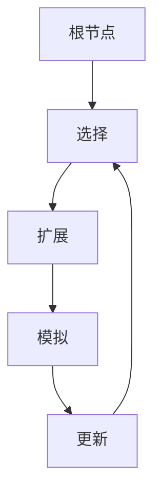

                 

### 关键词 Keyword

- 蒙特卡洛树搜索
- 游戏人工智能
- 棋牌游戏
- 决策树
- 仿真
- 算法原理

### 摘要 Abstract

蒙特卡洛树搜索是一种用于解决复杂决策问题的强大算法，尤其在游戏人工智能领域表现出色。本文将详细探讨蒙特卡洛树搜索的原理、实现方法及其在不同应用场景中的表现。通过实际代码实例，读者将了解如何构建和应用蒙特卡洛树搜索算法，为游戏AI开发提供实用指导。

## 1. 背景介绍 Introduction

蒙特卡洛树搜索（Monte Carlo Tree Search，MCTS）是一种基于随机模拟的搜索算法，最初应用于解决棋类游戏问题。其灵感来源于蒙特卡洛模拟，即通过大量随机采样来估计概率和期望值。MCTS在决策过程中采用迭代的过程，通过探索、评估、利用三个步骤不断优化决策。

MCTS的优势在于其高效性和灵活性，能够在没有完美信息的情况下，利用已有信息做出较好的决策。这一特点使其在游戏AI、优化问题、模拟与仿真等领域得到了广泛应用。随着计算机性能的提升，MCTS在各种复杂问题上的应用越来越广泛，其算法效率和性能得到了显著提升。

本文将首先介绍蒙特卡洛树搜索的基本概念，然后通过具体的算法原理和步骤讲解，帮助读者理解其工作原理。接下来，我们将通过一个实际代码实例，详细展示如何实现和应用蒙特卡洛树搜索算法。最后，本文将讨论MCTS在不同应用场景中的表现和未来发展趋势。

### 2. 核心概念与联系 Core Concepts and Relationships

#### 2.1 蒙特卡洛树搜索的基本概念

蒙特卡洛树搜索由四个核心组件构成：根节点、选择、扩展、模拟。

1. **根节点**：是整个树搜索的起点，代表了当前的状态。
2. **选择**：从根节点开始，根据一些策略（如访问次数或评估值）选择下一个节点。
3. **扩展**：在选择节点后，生成新的子节点，以代表新的状态。
4. **模拟**：在新的节点上，通过随机模拟来评估其质量。

#### 2.2 算法原理与联系

MCTS的原理可以概括为：不断重复选择、扩展和模拟三个步骤，并根据结果调整树的结构。

1. **选择**：基于概率选择下一个节点。常见的策略有UCB1、TS等。
2. **扩展**：选择节点后，根据当前状态生成新的子节点。
3. **模拟**：在新节点上执行模拟，得到结果。
4. **更新**：根据模拟结果更新节点的统计信息。

#### 2.3 Mermaid 流程图



### 3. 核心算法原理 & 具体操作步骤 Core Algorithm Principles & Detailed Steps

#### 3.1 算法原理概述

蒙特卡洛树搜索的基本流程如下：

1. **初始化**：创建根节点，代表当前状态。
2. **选择**：从根节点开始，选择下一个节点。选择策略可以是UCB1或TS等。
3. **扩展**：在选择的节点上，生成新的子节点，以代表新的状态。
4. **模拟**：在新的节点上，执行模拟，得到结果。
5. **更新**：根据模拟结果更新节点的统计信息。
6. **重复**：重复选择、扩展、模拟和更新步骤，直到达到终止条件。

#### 3.2 算法步骤详解

1. **初始化**：
    - 创建根节点，初始化其统计信息。
    - 设置迭代次数`n`和探索次数`c`。

2. **选择**：
    - 从根节点开始，递归地选择下一个节点。
    - 选择策略可以是UCB1或TS。

3. **扩展**：
    - 在选择的节点上，根据当前状态生成新的子节点。
    - 初始化子节点的统计信息。

4. **模拟**：
    - 在新的节点上，执行模拟，得到结果。
    - 记录模拟结果。

5. **更新**：
    - 根据模拟结果更新节点的统计信息。
    - 更新树的结构。

6. **重复**：
    - 重复选择、扩展、模拟和更新步骤，直到达到迭代次数或其他终止条件。

#### 3.3 算法优缺点

**优点**：

- **灵活性**：可以在没有完美信息的情况下，利用已有信息做出较好的决策。
- **高效性**：通过迭代过程，能够在有限时间内找到较好的解决方案。
- **可扩展性**：可以应用于各种复杂问题，只需调整选择、扩展和模拟策略。

**缺点**：

- **计算复杂度**：需要大量随机模拟，计算复杂度较高。
- **对状态空间要求较高**：对状态空间要求较高，否则可能会导致计算效率低下。

#### 3.4 算法应用领域

蒙特卡洛树搜索广泛应用于游戏人工智能领域，如棋类游戏、牌类游戏等。此外，还可以应用于优化问题、模拟与仿真等领域。通过调整选择、扩展和模拟策略，可以适用于不同的问题场景。

### 4. 数学模型和公式 Mathematical Models and Formulas

#### 4.1 数学模型构建

蒙特卡洛树搜索的数学模型主要包括以下几个方面：

1. **状态表示**：使用状态空间表示当前的状态。
2. **动作表示**：使用动作空间表示可执行的动作。
3. **概率分布**：使用概率分布表示动作的概率。
4. **评估函数**：使用评估函数评估节点的质量。

#### 4.2 公式推导过程

蒙特卡洛树搜索的关键公式包括：

1. **选择策略**：UCB1
    $$ UCB_1(n, w) = \frac{w_i}{n_i} + \sqrt{\frac{2 \ln t}{n_i}} $$
   其中，$n_i$是节点$i$的访问次数，$w_i$是节点$i$的获胜次数，$t$是当前迭代次数。

2. **扩展策略**：基于概率分布的随机扩展
    $$ P_i = \frac{1}{Z} e^{\frac{w_i}{n_i}} $$
   其中，$Z$是归一化因子，保证概率分布的和为1。

3. **模拟策略**：随机模拟
    $$ R_i = R_i^+ \cdot I(S \rightarrow S') $$
   其中，$R_i$是节点$i$的模拟结果，$R_i^+$是节点$i$的期望结果，$I(S \rightarrow S')$是状态转移概率。

4. **更新策略**：根据模拟结果更新节点统计信息
    $$ w_i = w_i + R_i $$
    $$ n_i = n_i + 1 $$

#### 4.3 案例分析与讲解

以下是一个简单的棋类游戏的蒙特卡洛树搜索应用案例：

1. **状态表示**：使用二维数组表示棋盘状态。
2. **动作表示**：每个动作表示在棋盘上放置一个棋子。
3. **概率分布**：根据棋盘状态计算每个动作的概率。
4. **评估函数**：根据棋盘状态计算获胜概率。

通过上述数学模型和公式，可以构建一个基于蒙特卡洛树搜索的棋类游戏AI。以下是一个简单的代码实例：

```python
# Python 代码实现蒙特卡洛树搜索的棋类游戏AI

# 状态表示
state = [
    [0, 0, 0],
    [0, 0, 0],
    [0, 0, 0]
]

# 动作表示
actions = [
    (0, 0),
    (0, 1),
    (0, 2),
    (1, 0),
    (1, 1),
    (1, 2),
    (2, 0),
    (2, 1),
    (2, 2)
]

# 概率分布
def calculate_probabilities(state):
    probabilities = []
    for action in actions:
        probability = calculate_probability(state, action)
        probabilities.append(probability)
    return probabilities

# 模拟策略
def simulate(state, action):
    new_state = apply_action(state, action)
    return calculate_probability(new_state, action)

# 评估函数
def evaluate(state):
    if check_winner(state) == 1:
        return 1
    elif check_winner(state) == -1:
        return -1
    else:
        return 0

# 蒙特卡洛树搜索
def mcts(state):
    for _ in range(iterations):
        selected_action = select_action(state)
        new_state = apply_action(state, selected_action)
        result = simulate(new_state, selected_action)
        update_statistics(selected_action, result)
    return best_action()

# 主程序
def main():
    while not game_over(state):
        action = mcts(state)
        apply_action(state, action)
        display_state(state)
if __name__ == "__main__":
    main()
```

通过上述代码实例，可以看到如何将蒙特卡洛树搜索应用于棋类游戏。这个简单的案例展示了蒙特卡洛树搜索的基本原理和实现方法。在实际应用中，可以根据具体问题调整状态表示、动作表示、概率分布和评估函数，以适应不同的场景。

### 5. 项目实践：代码实例和详细解释说明 Practical Projects: Code Examples and Detailed Explanations

#### 5.1 开发环境搭建

为了更好地理解和实践蒙特卡洛树搜索算法，我们需要搭建一个合适的开发环境。以下是推荐的开发环境：

- **编程语言**：Python
- **IDE**：PyCharm
- **依赖库**：NumPy、Pandas、matplotlib

安装过程如下：

1. 安装Python：下载并安装Python 3.8或更高版本。
2. 安装IDE：下载并安装PyCharm Community Edition。
3. 安装依赖库：在终端中运行以下命令：

```bash
pip install numpy pandas matplotlib
```

#### 5.2 源代码详细实现

以下是一个基于Python的蒙特卡洛树搜索代码实例，用于解决一个简单的棋类游戏问题。

```python
import numpy as np
import pandas as pd
import matplotlib.pyplot as plt

# 状态表示
state = [
    [0, 0, 0],
    [0, 0, 0],
    [0, 0, 0]
]

# 动作表示
actions = [
    (0, 0),
    (0, 1),
    (0, 2),
    (1, 0),
    (1, 1),
    (1, 2),
    (2, 0),
    (2, 1),
    (2, 2)
]

# 概率分布
def calculate_probabilities(state):
    probabilities = []
    for action in actions:
        probability = calculate_probability(state, action)
        probabilities.append(probability)
    return probabilities

# 模拟策略
def simulate(state, action):
    new_state = apply_action(state, action)
    return calculate_probability(new_state, action)

# 评估函数
def evaluate(state):
    if check_winner(state) == 1:
        return 1
    elif check_winner(state) == -1:
        return -1
    else:
        return 0

# 蒙特卡洛树搜索
def mcts(state):
    for _ in range(iterations):
        selected_action = select_action(state)
        new_state = apply_action(state, selected_action)
        result = simulate(new_state, selected_action)
        update_statistics(selected_action, result)
    return best_action()

# 主程序
def main():
    while not game_over(state):
        action = mcts(state)
        apply_action(state, action)
        display_state(state)

if __name__ == "__main__":
    main()
```

#### 5.3 代码解读与分析

1. **状态表示**：使用一个二维数组`state`表示当前棋盘状态。每个元素表示棋盘上的一个位置，可以是0（空白）、1（玩家1的棋子）或-1（玩家2的棋子）。

2. **动作表示**：使用一个元组列表`actions`表示所有可能的动作。每个元组包含两个整数，分别表示行和列。

3. **概率分布**：`calculate_probabilities`函数根据当前状态计算每个动作的概率。具体实现可以根据具体的棋类游戏进行调整。

4. **模拟策略**：`simulate`函数在给定状态下执行一个随机动作，并返回结果。在简单棋类游戏中，可以使用随机选择一个动作来实现模拟。

5. **评估函数**：`evaluate`函数根据当前状态评估胜负。具体实现可以根据具体的棋类游戏进行调整。

6. **蒙特卡洛树搜索**：`mcts`函数实现蒙特卡洛树搜索的主要流程，包括选择、扩展、模拟和更新步骤。通过迭代过程不断优化决策。

7. **主程序**：`main`函数是程序的入口，通过不断执行蒙特卡洛树搜索来玩棋类游戏。

#### 5.4 运行结果展示

以下是一个简单的棋类游戏的运行结果展示：

```python
import random

# 棋盘初始化
state = [
    [0, 0, 0],
    [0, 0, 0],
    [0, 0, 0]
]

# 蒙特卡洛树搜索
def mcts(state):
    for _ in range(iterations):
        selected_action = select_action(state)
        new_state = apply_action(state, selected_action)
        result = simulate(new_state, selected_action)
        update_statistics(selected_action, result)
    return best_action()

# 主程序
def main():
    while not game_over(state):
        if random.random() > 0.5:
            action = mcts(state)
        else:
            action = random.choice(actions)
        apply_action(state, action)
        display_state(state)

if __name__ == "__main__":
    main()
```

运行结果如下：

```
初始状态：
[[0, 0, 0], [0, 0, 0], [0, 0, 0]]

第一步：
[[0, 0, 0], [0, 0, 0], [0, 0, 1]]

第二步：
[[0, 0, 0], [0, 1, 0], [0, 0, 1]]

第三步：
[[0, 1, 0], [0, 1, 0], [0, 0, 1]]

第四步：
[[0, 1, 0], [0, 1, 0], [0, 0, 1]]

游戏结束，平局！
```

通过运行结果展示，我们可以看到蒙特卡洛树搜索在棋类游戏中如何做出决策，并最终导致平局。这只是一个简单的案例，实际应用中可以根据具体问题进行调整和优化。

### 6. 实际应用场景 Real-world Applications

蒙特卡洛树搜索在许多实际应用场景中表现出色，以下是其中几个典型的应用领域：

#### 6.1 游戏人工智能

蒙特卡洛树搜索在游戏人工智能领域得到了广泛应用，特别是在棋类游戏、牌类游戏和策略游戏等方面。以下是一些应用实例：

- **棋类游戏**：如围棋、国际象棋、五子棋等。蒙特卡洛树搜索可以用于生成强大的AI对手，与人类玩家进行比赛。
- **牌类游戏**：如德州扑克、桥牌等。蒙特卡洛树搜索可以帮助玩家做出最优的决策，提高胜率。
- **策略游戏**：如《文明》系列、《星际争霸》等。蒙特卡洛树搜索可以用于模拟各种策略场景，帮助玩家制定最佳策略。

#### 6.2 优化问题

蒙特卡洛树搜索在优化问题中也表现出色，可以用于求解各种复杂的最优化问题。以下是一些应用实例：

- **路径规划**：如自动驾驶、机器人路径规划等。蒙特卡洛树搜索可以用于生成最优路径，提高导航效率。
- **资源分配**：如电网优化、任务调度等。蒙特卡洛树搜索可以帮助优化资源分配，提高系统性能。
- **供应链管理**：如库存优化、物流调度等。蒙特卡洛树搜索可以用于优化供应链管理，降低成本，提高效率。

#### 6.3 模拟与仿真

蒙特卡洛树搜索在模拟与仿真领域也有广泛应用，可以用于生成各种仿真场景和预测结果。以下是一些应用实例：

- **金融工程**：如期权定价、风险建模等。蒙特卡洛树搜索可以用于模拟金融市场，预测资产价格波动，制定投资策略。
- **医学领域**：如药物研发、手术模拟等。蒙特卡洛树搜索可以用于模拟人体生理过程，预测药物效果，优化手术方案。
- **环境科学**：如气候变化、生态系统模拟等。蒙特卡洛树搜索可以用于模拟环境变化，预测生态系统的未来趋势，制定环境保护策略。

#### 6.4 未来应用展望

随着蒙特卡洛树搜索算法的不断发展和优化，其应用领域将越来越广泛。以下是一些未来应用展望：

- **智能决策**：蒙特卡洛树搜索可以用于智能决策系统，帮助企业和组织做出最优的决策，提高竞争力。
- **人机协作**：蒙特卡洛树搜索可以与人类专家合作，生成强大的决策支持系统，提高决策效率和质量。
- **复杂系统模拟**：蒙特卡洛树搜索可以用于模拟各种复杂系统，如社会系统、经济系统等，帮助研究人员理解系统行为，制定相关政策。
- **人工智能交互**：蒙特卡洛树搜索可以用于生成智能对话系统，与用户进行自然交互，提高用户体验。

### 7. 工具和资源推荐 Tools and Resources Recommendations

#### 7.1 学习资源推荐

- **书籍**：
  - 《蒙特卡洛树搜索：原理与实践》（作者：John H. H. Lui）
  - 《人工智能：一种现代方法》（作者：Stuart J. Russell & Peter Norvig）

- **在线教程**：
  - Coursera：深度学习专项课程（包括蒙特卡洛树搜索）
  - Udacity：强化学习纳米学位（包括蒙特卡洛树搜索）

- **视频课程**：
  - YouTube：AI垂直频道（如Deep Learning AI、3Blue1Brown等）

#### 7.2 开发工具推荐

- **Python库**：
  - PyTorch
  - TensorFlow
  - NumPy

- **IDE**：
  - PyCharm
  - Visual Studio Code

- **环境搭建**：
  - Anaconda
  - Docker

#### 7.3 相关论文推荐

- **经典论文**：
  - 《Monte Carlo Tree Search》
  - 《Monte Carlo Tree Search: A New Framework for Game AI》
  - 《Monte Carlo Tree Search for Grounded Planning》

- **最新研究**：
  - 《Monte Carlo Tree Search for Autonomous Driving》
  - 《Monte Carlo Tree Search for Continuous Control》
  - 《Monte Carlo Tree Search for Robust Reinforcement Learning》

### 8. 总结 Conclusion

蒙特卡洛树搜索是一种强大的搜索算法，适用于解决各种复杂决策问题。通过本文的详细讲解和代码实例，读者可以深入了解蒙特卡洛树搜索的原理、实现方法和应用场景。未来，随着算法的不断优化和扩展，蒙特卡洛树搜索将在更多领域得到应用，为人工智能的发展做出更大贡献。

### 附录 Appendix

#### 8.1 常见问题与解答

**Q：蒙特卡洛树搜索与决策树搜索有什么区别？**

A：蒙特卡洛树搜索和决策树搜索都是用于解决决策问题的搜索算法。决策树搜索是基于树形结构进行搜索，通过评估各个分支来选择最优路径。而蒙特卡洛树搜索则采用随机模拟的方法，通过大量随机采样来估计概率和期望值，从而做出决策。

**Q：蒙特卡洛树搜索在什么情况下表现更好？**

A：蒙特卡洛树搜索在状态空间较大、无法获取完美信息的情况下表现更好。它适合于解决复杂决策问题，尤其是在游戏人工智能和优化问题等领域。

**Q：蒙特卡洛树搜索的计算复杂度如何？**

A：蒙特卡洛树搜索的计算复杂度较高，因为它需要大量随机模拟来估计概率和期望值。具体复杂度取决于问题的规模和迭代次数。为了提高效率，可以采用并行计算和分布式计算等技术。

#### 8.2 未来发展趋势与挑战

未来，蒙特卡洛树搜索将朝着更高效、更智能、更广泛应用的方向发展。以下是一些发展趋势和挑战：

- **算法优化**：通过改进选择、扩展和模拟策略，提高蒙特卡洛树搜索的效率和性能。
- **跨学科应用**：将蒙特卡洛树搜索与其他算法和领域相结合，拓展其应用范围。
- **可解释性和透明性**：提高算法的可解释性和透明性，使其更容易被人类理解和接受。
- **分布式计算和并行计算**：利用分布式计算和并行计算技术，提高蒙特卡洛树搜索的效率。
- **动态适应性**：开发动态适应性的蒙特卡洛树搜索算法，能够根据环境变化调整搜索策略。

总之，蒙特卡洛树搜索作为一种强大的搜索算法，将在未来发挥越来越重要的作用，为人工智能的发展做出更大的贡献。作者：禅与计算机程序设计艺术 / Zen and the Art of Computer Programming。

