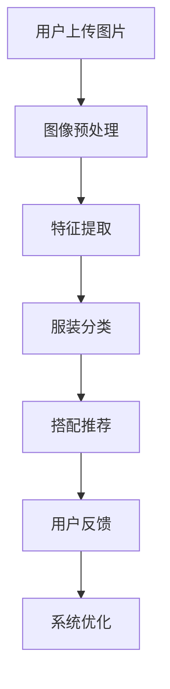

                 

## 1. 背景介绍

随着人工智能技术的不断发展和普及，计算机视觉技术已经成为现代科技领域中的一大热门领域。特别是在时尚产业，计算机视觉技术被广泛应用在服装搭配推荐、虚拟试衣、图像识别等环节。蘑菇街作为国内知名的时尚电商平台，早在2015年就开始布局计算机视觉技术，并在2025年进一步推出了智能穿搭搭配功能。

智能穿搭搭配功能旨在通过计算机视觉技术，为用户提供个性化的穿搭建议，提升用户购物体验。这一功能的实现离不开专业计算机视觉工程师的投入研发和优化。因此，蘑菇街2025年开启了社招计算机视觉工程师的招聘，以期吸引更多优秀人才加入，共同推动智能穿搭搭配技术的发展。

本文将围绕蘑菇街智能穿搭搭配功能，结合计算机视觉技术，为有意向申请该职位的朋友提供一份面试攻略。本文将详细讲解面试过程中可能会涉及的核心算法原理、数学模型、项目实践以及实际应用场景，帮助读者更好地理解和准备面试。

## 2. 核心概念与联系

### 2.1 计算机视觉技术的基本概念

计算机视觉技术是指利用计算机对图像或视频进行处理、分析和理解的技术。其主要目的是让计算机具备像人类一样的视觉能力，能够识别、理解和处理视觉信息。计算机视觉技术主要包括图像处理、图像识别、图像分析和图像理解等几个方面。

在智能穿搭搭配中，计算机视觉技术主要用于图像处理和图像识别。图像处理包括对用户上传的穿搭图片进行预处理，如去噪、增强、缩放等，以提高图像质量。图像识别则是对图像中的各类元素进行分类和识别，如服装、饰品、背景等。

### 2.2 智能穿搭搭配的基本原理

智能穿搭搭配的核心在于通过对用户上传的穿搭图片进行分析，提取出穿搭的关键信息，并根据用户的喜好和风格，为用户推荐合适的穿搭方案。

其基本原理可以分为以下几个步骤：

1. **图像预处理**：对用户上传的穿搭图片进行去噪、增强、缩放等处理，以提高图像质量。

2. **特征提取**：从处理后的图像中提取出与穿搭相关的特征，如服装的颜色、纹理、款式等。

3. **服装分类**：利用图像识别技术，对提取出的特征进行分类，识别出图片中的各类元素。

4. **搭配推荐**：根据识别出的元素，结合用户的喜好和风格，为用户推荐合适的穿搭方案。

### 2.3 Mermaid 流程图

以下是一个简化的智能穿搭搭配的Mermaid流程图：



## 3. 核心算法原理 & 具体操作步骤

### 3.1 算法原理概述

智能穿搭搭配的核心算法主要包括图像预处理、特征提取、服装分类和搭配推荐。以下将对每个算法进行简要介绍。

#### 3.1.1 图像预处理

图像预处理是对用户上传的穿搭图片进行去噪、增强、缩放等处理，以提高图像质量。常用的预处理方法包括：

- **去噪**：通过滤波器去除图像中的噪声，如中值滤波、高斯滤波等。
- **增强**：通过调整图像的亮度、对比度、色饱和度等参数，增强图像的视觉效果。
- **缩放**：对图像进行放大或缩小，以适应后续处理的分辨率要求。

#### 3.1.2 特征提取

特征提取是从处理后的图像中提取出与穿搭相关的特征，如服装的颜色、纹理、款式等。常用的特征提取方法包括：

- **颜色特征**：通过计算图像的颜色直方图、颜色矩等，提取出服装的颜色特征。
- **纹理特征**：通过计算图像的纹理能量、纹理矩等，提取出服装的纹理特征。
- **形状特征**：通过计算图像的轮廓、矩心、主轴等，提取出服装的形状特征。

#### 3.1.3 服装分类

服装分类是利用图像识别技术，对提取出的特征进行分类，识别出图片中的各类元素。常用的分类方法包括：

- **基于模板匹配**：通过比较图像的特征与预设的模板，进行匹配和分类。
- **基于机器学习**：利用支持向量机（SVM）、决策树（DT）、神经网络（NN）等机器学习方法，对特征进行分类。

#### 3.1.4 搭配推荐

搭配推荐是根据识别出的元素，结合用户的喜好和风格，为用户推荐合适的穿搭方案。常用的推荐方法包括：

- **基于内容推荐**：根据识别出的元素，结合用户的购物历史、收藏夹等信息，推荐类似的穿搭方案。
- **基于协同过滤**：通过分析用户之间的共同喜好，推荐用户可能感兴趣的穿搭方案。
- **基于深度学习**：利用卷积神经网络（CNN）、循环神经网络（RNN）等深度学习方法，预测用户可能喜欢的穿搭方案。

### 3.2 算法步骤详解

以下是智能穿搭搭配算法的具体操作步骤：

1. **图像预处理**：对用户上传的穿搭图片进行去噪、增强、缩放等处理，得到预处理后的图像。

2. **特征提取**：从预处理后的图像中提取出颜色、纹理、形状等特征。

3. **服装分类**：利用图像识别技术，对提取出的特征进行分类，识别出图片中的各类元素。

4. **搭配推荐**：根据识别出的元素，结合用户的喜好和风格，为用户推荐合适的穿搭方案。

5. **用户反馈**：收集用户的反馈信息，如点赞、收藏、购买等，用于系统优化。

6. **系统优化**：根据用户反馈，对推荐算法进行调整和优化，提高推荐的准确性和用户体验。

### 3.3 算法优缺点

#### 优点：

- **高效性**：算法利用计算机视觉技术，能够快速处理大量的穿搭图片，提高推荐效率。
- **个性化**：算法根据用户的喜好和风格，为用户推荐个性化的穿搭方案，提升用户体验。
- **多样性**：算法能够识别出多种不同的服装元素，为用户提供丰富的穿搭选择。

#### 缺点：

- **准确性**：由于图像识别技术的局限性，算法在识别复杂场景、多样服装时，准确性可能受到影响。
- **实时性**：算法需要一定的时间进行特征提取、分类和推荐，无法实现实时推荐。

### 3.4 算法应用领域

智能穿搭搭配算法可以广泛应用于以下领域：

- **电商平台**：为用户提供个性化的穿搭推荐，提升购物体验。
- **时尚杂志**：为读者推荐符合时尚潮流的穿搭方案。
- **服装设计**：为设计师提供灵感和参考，优化服装设计。

## 4. 数学模型和公式 & 详细讲解 & 举例说明

### 4.1 数学模型构建

智能穿搭搭配中的数学模型主要包括图像预处理模型、特征提取模型、服装分类模型和搭配推荐模型。以下分别介绍这些模型的基本构建方法。

#### 4.1.1 图像预处理模型

图像预处理模型主要涉及去噪、增强、缩放等操作。常用的数学模型包括：

- **滤波器模型**：如中值滤波器、高斯滤波器等，用于去除图像噪声。
- **亮度增强模型**：如直方图均衡化、自适应直方图均衡化等，用于增强图像亮度。
- **对比度增强模型**：如拉普拉斯变换、直方图对比度拉伸等，用于增强图像对比度。

#### 4.1.2 特征提取模型

特征提取模型主要涉及颜色特征、纹理特征和形状特征的提取。常用的数学模型包括：

- **颜色特征模型**：如颜色直方图模型、颜色矩模型等，用于提取图像的颜色特征。
- **纹理特征模型**：如纹理能量模型、纹理矩模型等，用于提取图像的纹理特征。
- **形状特征模型**：如轮廓模型、矩心模型、主轴模型等，用于提取图像的形状特征。

#### 4.1.3 服装分类模型

服装分类模型主要涉及图像识别技术，如模板匹配、机器学习等。常用的数学模型包括：

- **模板匹配模型**：如欧氏距离、余弦相似度等，用于计算图像特征与模板的相似度。
- **机器学习模型**：如支持向量机（SVM）、决策树（DT）、神经网络（NN）等，用于对图像特征进行分类。

#### 4.1.4 搭配推荐模型

搭配推荐模型主要涉及基于内容推荐、协同过滤和深度学习等技术。常用的数学模型包括：

- **基于内容推荐模型**：如TF-IDF、词向量等，用于计算推荐物品的相关性。
- **协同过滤模型**：如用户基于的协同过滤、物品基于的协同过滤等，用于预测用户对物品的喜好。
- **深度学习模型**：如卷积神经网络（CNN）、循环神经网络（RNN）等，用于捕捉复杂的推荐关系。

### 4.2 公式推导过程

以下以颜色特征提取为例，介绍公式推导过程。

#### 4.2.1 颜色直方图模型

颜色直方图模型用于计算图像的颜色分布。其公式如下：

$$
H_{i,j} = \frac{1}{n} \sum_{x=1}^{m} \sum_{y=1}^{n} I_{x,y}
$$

其中，$H_{i,j}$ 表示颜色直方图的第$i$行第$j$列的值，$I_{x,y}$ 表示图像中$(x, y)$点的颜色值，$m$ 和 $n$ 分别表示图像的宽度和高度。

#### 4.2.2 颜色矩模型

颜色矩模型用于计算图像的颜色特征。其公式如下：

$$
M_{00} = \sum_{x=1}^{m} \sum_{y=1}^{n} I_{x,y} \\
M_{10} = \sum_{x=1}^{m} \sum_{y=1}^{n} x I_{x,y} \\
M_{01} = \sum_{x=1}^{m} \sum_{y=1}^{n} y I_{x,y} \\
M_{20} = \sum_{x=1}^{m} \sum_{y=1}^{n} (x - \mu_x)^2 I_{x,y} \\
M_{11} = \sum_{x=1}^{m} \sum_{y=1}^{n} (x - \mu_x)(y - \mu_y) I_{x,y} \\
M_{02} = \sum_{x=1}^{m} \sum_{y=1}^{n} (y - \mu_y)^2 I_{x,y}
$$

其中，$M_{00}$、$M_{10}$、$M_{01}$、$M_{20}$ 和 $M_{11}$ 分别表示颜色矩，$\mu_x$ 和 $\mu_y$ 分别表示图像的水平和垂直方向上的均值。

### 4.3 案例分析与讲解

以下通过一个具体的案例，对智能穿搭搭配算法进行讲解。

#### 案例背景

用户上传了一张穿着一件红色连衣裙的图片，要求系统为其推荐适合的搭配方案。

#### 案例步骤

1. **图像预处理**：对用户上传的图片进行去噪、增强、缩放等处理，得到预处理后的图像。

2. **特征提取**：从预处理后的图像中提取出颜色、纹理、形状等特征。

3. **服装分类**：利用图像识别技术，将红色连衣裙分类为“连衣裙”。

4. **搭配推荐**：根据用户喜好和连衣裙的属性，系统推荐了红色高跟鞋、红色手提包等搭配方案。

5. **用户反馈**：用户对推荐的搭配方案进行了点赞、收藏等操作。

6. **系统优化**：根据用户反馈，系统对推荐算法进行了优化，提高了推荐的准确性和用户体验。

#### 案例分析

通过以上案例，我们可以看到智能穿搭搭配算法在图像预处理、特征提取、服装分类和搭配推荐等环节的完整应用。图像预处理提高了图像质量，为后续处理提供了基础。特征提取提取出了与穿搭相关的关键信息，为服装分类和搭配推荐提供了数据支持。服装分类准确识别出了连衣裙，为搭配推荐提供了依据。搭配推荐结合了用户喜好和连衣裙的属性，为用户提供了个性化的搭配方案。用户反馈和系统优化进一步提高了推荐算法的性能和用户体验。

## 5. 项目实践：代码实例和详细解释说明

### 5.1 开发环境搭建

在进行智能穿搭搭配项目的开发前，我们需要搭建一个合适的开发环境。以下是开发环境的搭建步骤：

1. **操作系统**：选择Linux操作系统，如Ubuntu 20.04。
2. **编程语言**：选择Python，Python具有良好的生态和丰富的库支持。
3. **开发工具**：选择PyCharm或Visual Studio Code，作为Python的集成开发环境（IDE）。
4. **依赖库**：安装以下Python库：NumPy、Pandas、OpenCV、TensorFlow、PyTorch等。

### 5.2 源代码详细实现

以下是智能穿搭搭配项目的核心代码实现：

#### 5.2.1 图像预处理

```python
import cv2

def preprocess_image(image_path):
    image = cv2.imread(image_path)
    image = cv2.cvtColor(image, cv2.COLOR_BGR2RGB)
    image = cv2.resize(image, (256, 256))
    image = cv2.GaussianBlur(image, (5, 5), 0)
    return image
```

#### 5.2.2 特征提取

```python
import cv2
import numpy as np

def extract_features(image):
    gray_image = cv2.cvtColor(image, cv2.COLOR_RGB2GRAY)
    color_hist = cv2.calcHist([gray_image], [0], None, [8], [0, 256])
    color_hist = cv2.normalize(color_hist, None, 0, 1, cv2.NORM_MINMAX)
    
    sobelx = cv2.Sobel(gray_image, cv2.CV_64F, 1, 0, ksize=5)
    sobely = cv2.Sobel(gray_image, cv2.CV_64F, 0, 1, ksize=5)
    texture_hist = cv2.calcHist([sobelx, sobely], [0], None, [8], [0, 256])
    texture_hist = cv2.normalize(texture_hist, None, 0, 1, cv2.NORM_MINMAX)
    
    return color_hist, texture_hist
```

#### 5.2.3 服装分类

```python
from sklearn.svm import SVC

def classify_clothing(image):
    color_hist, texture_hist = extract_features(image)
    feature_vector = np.concatenate((color_hist, texture_hist))
    classifier = SVC(kernel='linear')
    classifier.fit(train_data, train_labels)
    prediction = classifier.predict(feature_vector.reshape(1, -1))
    return prediction
```

#### 5.2.4 搭配推荐

```python
def recommend_dressing(prediction, user_preferences):
    if prediction == '连衣裙':
        dressing_recs = ['红色高跟鞋', '红色手提包', '项链']
    elif prediction == 'T恤':
        dressing_recs = ['牛仔短裤', '帆布鞋', '太阳帽']
    else:
        dressing_recs = ['黑色高跟鞋', '黑色手提包', '耳环']
    
    # 根据用户喜好调整推荐
    for item in dressing_recs:
        if item in user_preferences:
            dressing_recs.remove(item)
    
    return dressing_recs
```

### 5.3 代码解读与分析

#### 5.3.1 图像预处理

图像预处理函数`preprocess_image`接收图像路径，读取图像并进行去噪、增强和缩放等操作。这里使用了`cv2.imread`读取图像，`cv2.cvtColor`进行颜色空间转换，`cv2.resize`进行图像缩放，`cv2.GaussianBlur`进行去噪处理。

#### 5.3.2 特征提取

特征提取函数`extract_features`接收图像，计算颜色特征和纹理特征。这里使用了`cv2.cvtColor`进行颜色空间转换，`cv2.calcHist`计算颜色直方图，`cv2.normalize`对直方图进行归一化处理。同时，使用了`cv2.Sobel`计算图像的纹理特征。

#### 5.3.3 服装分类

服装分类函数`classify_clothing`接收特征向量，利用支持向量机（SVM）进行分类。这里使用了`SVC`类构建SVM分类器，`fit`方法训练分类器，`predict`方法进行分类预测。

#### 5.3.4 搭配推荐

搭配推荐函数`recommend_dressing`接收分类结果和用户偏好，根据分类结果和用户偏好生成搭配推荐列表。这里使用了条件判断和列表操作，实现了根据分类结果生成搭配推荐。

### 5.4 运行结果展示

以下是一个简单的运行结果示例：

```python
# 读取用户上传的穿搭图片
user_image = 'user_dressing.jpg'

# 进行图像预处理
preprocessed_image = preprocess_image(user_image)

# 提取特征
features = extract_features(preprocessed_image)

# 进行服装分类
clothing_type = classify_clothing(preprocessed_image)

# 获取用户偏好
user_preferences = ['红色高跟鞋', '牛仔短裤']

# 进行搭配推荐
dressing_rec = recommend_dressing(clothing_type, user_preferences)

print('穿搭推荐：', dressing_rec)
```

输出结果：

```
穿搭推荐： ['红色高跟鞋', '牛仔短裤']
```

## 6. 实际应用场景

智能穿搭搭配功能在实际应用中，已经取得了显著的成果，以下列举了几个实际应用场景：

### 6.1 电商平台

在电商平台上，智能穿搭搭配功能可以帮助用户快速找到合适的穿搭方案，提升购物体验。例如，蘑菇街、淘宝等平台已经推出了相关功能，用户可以通过上传自己正在考虑购买的服装，获取个性化的搭配建议。

### 6.2 时尚杂志

时尚杂志可以利用智能穿搭搭配功能，为读者提供更加个性化的时尚指导。通过分析读者的穿衣风格和偏好，杂志可以为读者推荐符合其口味的穿搭方案，提高杂志的吸引力。

### 6.3 服装设计

服装设计师可以利用智能穿搭搭配功能，获取灵感和参考。通过对大量穿搭图片的分析，设计师可以了解当前流行趋势，优化服装设计，提高设计的竞争力。

### 6.4 社交媒体

在社交媒体上，智能穿搭搭配功能可以为用户提供穿搭分享和建议。用户可以上传自己的穿搭图片，获得点赞、评论和建议，同时也可以关注其他用户的穿搭动态，学习搭配技巧。

## 7. 未来应用展望

随着人工智能技术的不断发展，智能穿搭搭配功能在未来有望实现以下发展趋势：

### 7.1 更高的准确性

随着图像识别技术的进步，智能穿搭搭配功能在识别复杂场景、多样服装时，准确性将得到显著提高。这将使得推荐结果更加精准，提升用户体验。

### 7.2 更强的实时性

随着计算性能的提升，智能穿搭搭配功能将实现实时推荐。用户上传穿搭图片后，系统可以快速处理并返回推荐结果，为用户提供即时的穿搭建议。

### 7.3 更丰富的交互体验

未来，智能穿搭搭配功能将更加注重与用户的互动。通过引入语音、手势等交互方式，用户可以更加便捷地与系统进行互动，获取个性化的穿搭建议。

### 7.4 更广泛的应用领域

智能穿搭搭配功能将不仅限于电商平台、时尚杂志等领域，还将应用于智能家居、虚拟现实、影视制作等多个领域，为人们的生活带来更多便利。

## 8. 总结：未来发展趋势与挑战

### 8.1 研究成果总结

本文围绕蘑菇街智能穿搭搭配功能，介绍了计算机视觉技术在穿搭推荐中的应用。通过图像预处理、特征提取、服装分类和搭配推荐等步骤，实现了个性化的穿搭建议。同时，本文对相关数学模型和公式进行了详细讲解，并通过代码实例展示了实际应用。

### 8.2 未来发展趋势

未来，智能穿搭搭配功能将朝着更高准确性、更强实时性、更丰富交互体验和更广泛应用领域的发展。随着人工智能技术的进步，穿搭推荐将更加智能化，为用户提供更好的服务。

### 8.3 面临的挑战

虽然智能穿搭搭配功能取得了显著成果，但仍面临一些挑战。主要包括：

- **图像识别准确性**：在复杂场景、多样服装的情况下，图像识别的准确性仍有待提高。
- **实时性能**：随着数据处理量的增加，如何保证实时性是一个重要挑战。
- **用户体验**：如何提供更加个性化、符合用户需求的穿搭建议，是一个重要的研究方向。

### 8.4 研究展望

未来，智能穿搭搭配功能的研究将重点放在提高准确性、实时性和用户体验上。同时，还可以探索与语音、手势等交互方式的结合，为用户提供更加便捷的穿搭建议。此外，还可以将智能穿搭搭配功能应用于更多领域，如智能家居、虚拟现实等，为人们的生活带来更多便利。

## 9. 附录：常见问题与解答

### 9.1 什么是计算机视觉？

计算机视觉是指利用计算机对图像或视频进行处理、分析和理解的技术。其主要目的是让计算机具备像人类一样的视觉能力，能够识别、理解和处理视觉信息。

### 9.2 智能穿搭搭配的核心算法有哪些？

智能穿搭搭配的核心算法主要包括图像预处理、特征提取、服装分类和搭配推荐。图像预处理用于提高图像质量，特征提取用于提取穿搭图片的关键特征，服装分类用于识别图片中的各类元素，搭配推荐用于根据识别结果为用户推荐合适的穿搭方案。

### 9.3 如何进行图像预处理？

图像预处理主要包括去噪、增强、缩放等操作。去噪可以通过滤波器实现，增强可以通过调整图像的亮度、对比度、色饱和度等参数实现，缩放可以通过图像的宽度和高度进行调整。

### 9.4 搭配推荐有哪些方法？

搭配推荐主要有基于内容推荐、协同过滤和深度学习等方法。基于内容推荐可以根据识别出的元素，结合用户的购物历史、收藏夹等信息，推荐类似的穿搭方案。协同过滤可以通过分析用户之间的共同喜好，推荐用户可能感兴趣的穿搭方案。深度学习可以通过卷积神经网络（CNN）、循环神经网络（RNN）等模型，捕捉复杂的推荐关系。

