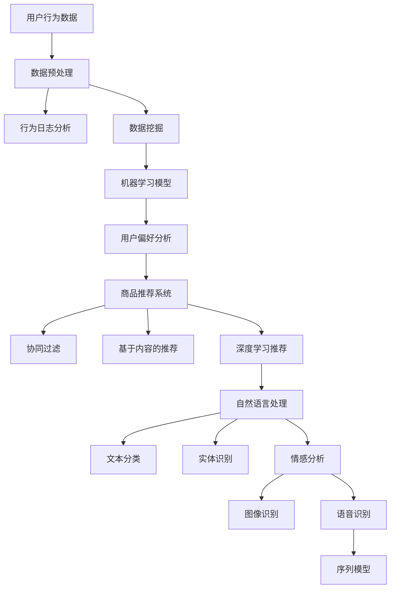

                 

关键词：虚拟导购助手，AI，购物体验，用户行为分析，个性化推荐，自然语言处理，深度学习

> 摘要：本文旨在探讨如何利用人工智能技术，特别是虚拟导购助手，提升现代购物体验。文章将详细分析虚拟导购助手的工作原理，以及其在用户行为分析、个性化推荐、自然语言处理和深度学习等方面的应用，最终预测虚拟导购助手的未来发展趋势。

## 1. 背景介绍

随着互联网技术的快速发展，电子商务已经成为现代消费者购物的重要方式。然而，尽管电子商务平台提供了丰富的商品信息和便捷的购物流程，用户在购物过程中仍然面临诸多挑战。例如，用户难以在海量商品中找到符合自己需求的商品，购物决策过程复杂且耗时。此外，传统购物体验中的个性化服务往往受限于人力和时间成本。

为了解决这些问题，人工智能（AI）技术被广泛应用于电子商务领域。虚拟导购助手作为一种AI应用，通过模拟人类导购员的操作，为用户提供个性化的购物建议和服务。虚拟导购助手不仅可以实时分析用户的行为和偏好，还能基于大数据和机器学习算法，提供精准的个性化推荐。因此，虚拟导购助手在提升购物体验方面具有巨大的潜力。

## 2. 核心概念与联系

### 2.1 用户行为分析

用户行为分析是虚拟导购助手的核心功能之一。通过分析用户在购物平台上的行为数据，如浏览记录、购买历史、评价等，虚拟导购助手可以了解用户的兴趣和需求。这种分析通常基于以下几种技术：

- **行为日志分析**：收集并分析用户在购物平台上的行为日志，如浏览、点击、搜索等。
- **数据挖掘**：利用数据挖掘技术，从用户行为数据中提取有价值的信息，如用户偏好、购买意图等。
- **机器学习模型**：训练机器学习模型，通过历史数据预测用户的未来行为。

### 2.2 个性化推荐

个性化推荐是虚拟导购助手的另一个核心功能。通过分析用户的兴趣和行为，虚拟导购助手可以为用户提供个性化的商品推荐。个性化推荐技术通常包括以下几种：

- **协同过滤**：通过分析用户之间的相似性，推荐用户可能喜欢的商品。
- **基于内容的推荐**：根据商品的属性和用户的兴趣，推荐相似的物品。
- **深度学习推荐**：利用深度学习技术，建立复杂的用户兴趣模型，实现精准的推荐。

### 2.3 自然语言处理

自然语言处理（NLP）技术使得虚拟导购助手能够与用户进行自然对话。通过理解用户的语言意图，虚拟导购助手可以回答用户的问题，提供购物建议。NLP技术主要包括以下方面：

- **文本分类**：将用户的问题或评论分类到相应的类别，如商品查询、购物建议等。
- **实体识别**：识别文本中的关键信息，如商品名称、价格、评价等。
- **情感分析**：分析用户的语言情感，如正面、负面、中性等。

### 2.4 深度学习

深度学习是虚拟导购助手的核心技术之一。通过训练深度神经网络，虚拟导购助手可以实现复杂的数据分析和决策。深度学习技术在虚拟导购助手中的应用包括：

- **图像识别**：识别用户上传的图片中的商品，提供购物建议。
- **语音识别**：将用户的语音转化为文本，实现语音购物咨询。
- **序列模型**：处理用户的行为序列，预测用户的未来行为。

### 2.5 Mermaid 流程图



## 3. 核心算法原理 & 具体操作步骤

### 3.1 算法原理概述

虚拟导购助手的核心算法包括用户行为分析算法、个性化推荐算法和自然语言处理算法。以下分别对这些算法进行概述。

#### 用户行为分析算法

用户行为分析算法主要用于分析用户在购物平台上的行为数据，提取用户的兴趣和需求。常用的算法包括：

- **行为日志分析**：通过统计用户的行为日志，如浏览、点击、搜索等，分析用户的购买意图。
- **协同过滤**：通过分析用户之间的相似性，推荐用户可能喜欢的商品。
- **基于内容的推荐**：根据商品的属性和用户的兴趣，推荐相似的物品。
- **深度学习推荐**：利用深度学习技术，建立复杂的用户兴趣模型，实现精准的推荐。

#### 个性化推荐算法

个性化推荐算法旨在为用户提供个性化的商品推荐。常用的算法包括：

- **协同过滤**：通过分析用户之间的相似性，推荐用户可能喜欢的商品。
- **基于内容的推荐**：根据商品的属性和用户的兴趣，推荐相似的物品。
- **深度学习推荐**：利用深度学习技术，建立复杂的用户兴趣模型，实现精准的推荐。

#### 自然语言处理算法

自然语言处理算法用于处理用户输入的文本信息，实现智能对话和情感分析。常用的算法包括：

- **文本分类**：将用户的问题或评论分类到相应的类别。
- **实体识别**：识别文本中的关键信息，如商品名称、价格、评价等。
- **情感分析**：分析用户的语言情感，如正面、负面、中性等。

### 3.2 算法步骤详解

#### 用户行为分析算法

1. **数据采集**：收集用户在购物平台上的行为数据，如浏览记录、购买历史、评价等。
2. **数据预处理**：对采集到的数据进行分析和清洗，去除噪声数据。
3. **行为日志分析**：统计用户的行为日志，提取用户的兴趣和需求。
4. **数据挖掘**：利用数据挖掘技术，从用户行为数据中提取有价值的信息，如用户偏好、购买意图等。
5. **机器学习模型**：训练机器学习模型，通过历史数据预测用户的未来行为。

#### 个性化推荐算法

1. **用户建模**：基于用户的行为数据，建立用户兴趣模型。
2. **商品建模**：基于商品的属性数据，建立商品特征模型。
3. **推荐算法**：利用协同过滤、基于内容的推荐或深度学习推荐算法，为用户推荐商品。
4. **评估与优化**：评估推荐系统的效果，根据评估结果优化推荐算法。

#### 自然语言处理算法

1. **文本预处理**：对用户输入的文本进行分词、去停用词等预处理。
2. **文本分类**：利用文本分类算法，将用户的问题或评论分类到相应的类别。
3. **实体识别**：利用实体识别算法，识别文本中的关键信息，如商品名称、价格、评价等。
4. **情感分析**：利用情感分析算法，分析用户的语言情感，如正面、负面、中性等。
5. **对话生成**：根据用户的问题和情感分析结果，生成相应的回答。

### 3.3 算法优缺点

#### 用户行为分析算法

优点：

- **数据丰富**：基于用户的行为数据，能够全面了解用户的需求和兴趣。
- **实时性**：能够实时分析用户的行为，提供及时的购物建议。

缺点：

- **隐私问题**：需要收集用户的敏感数据，可能导致用户隐私泄露。
- **噪声数据**：用户行为数据可能包含噪声数据，影响分析结果的准确性。

#### 个性化推荐算法

优点：

- **个性化**：能够根据用户的兴趣和需求，提供个性化的商品推荐。
- **提升转化率**：通过精准的推荐，提高用户的购物转化率。

缺点：

- **数据依赖**：个性化推荐依赖于用户的行为数据，数据质量直接影响推荐效果。
- **计算复杂度**：协同过滤和深度学习推荐算法的计算复杂度较高，可能导致系统性能下降。

#### 自然语言处理算法

优点：

- **智能对话**：能够与用户进行自然对话，提供便捷的购物咨询。
- **情感分析**：能够分析用户的语言情感，提供个性化的购物体验。

缺点：

- **语言理解难度**：自然语言处理技术对语言理解要求较高，存在一定程度的语义歧义。
- **实时性**：实时处理大量用户的输入信息，可能影响系统的响应速度。

### 3.4 算法应用领域

虚拟导购助手的核心算法在电子商务、在线旅游、金融理财等领域都有广泛的应用。以下分别介绍这些领域的应用案例。

#### 电子商务

在电子商务领域，虚拟导购助手可以帮助商家提高销售转化率和用户满意度。例如，通过分析用户的行为数据，虚拟导购助手可以为用户提供个性化的商品推荐，提高用户的购物体验。同时，虚拟导购助手还可以分析用户的购物行为，为商家提供营销策略建议，提升商家的销售额。

#### 在线旅游

在线旅游平台可以利用虚拟导购助手为用户提供个性化的旅游推荐。通过分析用户的旅游偏好和行为，虚拟导购助手可以为用户提供符合其需求的旅游线路、酒店和景点推荐。此外，虚拟导购助手还可以为用户提供旅游咨询，解答用户的疑问，提高用户的旅游体验。

#### 金融理财

在金融理财领域，虚拟导购助手可以帮助金融机构提供个性化的理财建议。通过分析用户的财务状况和投资偏好，虚拟导购助手可以为用户提供符合其需求的理财产品推荐。同时，虚拟导购助手还可以为用户提供投资咨询，帮助用户更好地管理其财务。

## 4. 数学模型和公式 & 详细讲解 & 举例说明

### 4.1 数学模型构建

虚拟导购助手的数学模型主要包括用户兴趣模型、商品特征模型和推荐算法模型。以下分别介绍这些模型的构建方法。

#### 用户兴趣模型

用户兴趣模型用于描述用户对不同商品类别的兴趣程度。常用的模型包括基于矩阵分解的协同过滤模型和基于神经网络的深度学习模型。

1. **矩阵分解协同过滤模型**

   矩阵分解协同过滤模型通过分解用户-商品评分矩阵，提取用户的兴趣特征。假设用户-商品评分矩阵为$R \in \mathbb{R}^{m \times n}$，其中$m$表示用户数量，$n$表示商品数量。矩阵分解模型的目标是找到两个低秩矩阵$U \in \mathbb{R}^{m \times k}$和$V \in \mathbb{R}^{n \times k}$，使得$R \approx UV^T$。其中$k$表示隐含特征维度。

   $$R \approx UV^T$$

   通过求解上述矩阵分解问题，可以得到用户的兴趣特征矩阵$U$和商品特征矩阵$V$。用户$i$对商品$j$的兴趣程度可以表示为$u_i \cdot v_j$。

2. **深度学习模型**

   深度学习模型通过构建神经网络，提取用户的兴趣特征。假设用户兴趣特征向量表示为$d_i \in \mathbb{R}^d$，商品特征向量表示为$d_j \in \mathbb{R}^d$。深度学习模型的目标是最小化用户兴趣预测误差：

   $$L = \sum_{i,j} (u_i \cdot v_j - r_{ij})^2$$

   其中$r_{ij}$表示用户$i$对商品$j$的实际评分。

#### 商品特征模型

商品特征模型用于描述商品的属性特征，如商品类别、品牌、价格等。常用的模型包括基于特征的线性模型和基于神经网络的深度学习模型。

1. **线性模型**

   基于特征的线性模型通过线性组合商品的属性特征，得到商品的特征向量。假设商品$i$的属性特征向量表示为$x_i \in \mathbb{R}^d$，商品特征向量表示为$d_i \in \mathbb{R}^d$。线性模型的目标是最小化预测误差：

   $$L = \sum_{i,j} (w \cdot x_i - r_{ij})^2$$

   其中$w$表示模型参数。

2. **深度学习模型**

   深度学习模型通过构建神经网络，提取商品的属性特征。假设商品$i$的属性特征向量表示为$x_i \in \mathbb{R}^d$，商品特征向量表示为$d_i \in \mathbb{R}^d$。深度学习模型的目标是最小化预测误差：

   $$L = \sum_{i,j} (w \cdot x_i - r_{ij})^2$$

   其中$w$表示模型参数。

#### 推荐算法模型

推荐算法模型用于根据用户兴趣和商品特征，预测用户对商品的评分。常用的推荐算法模型包括基于协同过滤的推荐模型和基于内容的推荐模型。

1. **基于协同过滤的推荐模型**

   基于协同过滤的推荐模型通过分析用户之间的相似性，为用户推荐相似的商品。假设用户$i$和用户$j$之间的相似度表示为$s_{ij}$，用户$i$对商品$j$的评分预测为$\hat{r}_{ij}$。协同过滤推荐模型的目标是最小化预测误差：

   $$L = \sum_{i,j} (s_{ij} \cdot (u_i \cdot v_j - r_{ij}))^2$$

2. **基于内容的推荐模型**

   基于内容的推荐模型通过分析商品的属性特征，为用户推荐相似的商品。假设用户$i$对商品$j$的评分预测为$\hat{r}_{ij}$，商品$i$和商品$j$之间的相似度表示为$s_{ij}$。基于内容的推荐模型的目标是最小化预测误差：

   $$L = \sum_{i,j} (s_{ij} \cdot (w \cdot x_i - r_{ij}))^2$$

### 4.2 公式推导过程

#### 用户兴趣模型

1. **矩阵分解协同过滤模型**

   假设用户-商品评分矩阵为$R \in \mathbb{R}^{m \times n}$，目标是最小化以下损失函数：

   $$L = \sum_{i,j} ||R_{ij} - UV^T||^2$$

   其中$U \in \mathbb{R}^{m \times k}$和$V \in \mathbb{R}^{n \times k}$分别为用户和商品的隐含特征矩阵，$k$为隐含特征维度。

   对$U$和$V$分别求偏导并令其等于零，得到：

   $$\frac{\partial L}{\partial U} = 2(R - UV^T)V = 0$$

   $$\frac{\partial L}{\partial V} = 2(U^T - V^TU)R = 0$$

   解上述方程组，可以得到隐含特征矩阵$U$和$V$。

2. **深度学习模型**

   假设用户兴趣特征向量表示为$d_i \in \mathbb{R}^d$，商品特征向量表示为$d_j \in \mathbb{R}^d$，目标是最小化以下损失函数：

   $$L = \sum_{i,j} ||u_i \cdot v_j - r_{ij}||^2$$

   对$d_i$和$d_j$分别求偏导并令其等于零，得到：

   $$\frac{\partial L}{\partial d_i} = 2(u_i \cdot v_j - r_{ij})v_j = 0$$

   $$\frac{\partial L}{\partial d_j} = 2(u_i \cdot v_j - r_{ij})u_i = 0$$

   解上述方程组，可以得到用户兴趣特征向量$d_i$和商品特征向量$d_j$。

#### 商品特征模型

1. **线性模型**

   假设商品$i$的属性特征向量表示为$x_i \in \mathbb{R}^d$，商品特征向量表示为$d_i \in \mathbb{R}^d$，目标是最小化以下损失函数：

   $$L = \sum_{i,j} ||w \cdot x_i - r_{ij}||^2$$

   对$w$和$x_i$分别求偏导并令其等于零，得到：

   $$\frac{\partial L}{\partial w} = 2(w \cdot x_i - r_{ij})x_i = 0$$

   $$\frac{\partial L}{\partial x_i} = 2(w \cdot x_i - r_{ij})w = 0$$

   解上述方程组，可以得到模型参数$w$和商品属性特征向量$x_i$。

2. **深度学习模型**

   假设商品$i$的属性特征向量表示为$x_i \in \mathbb{R}^d$，商品特征向量表示为$d_i \in \mathbb{R}^d$，目标是最小化以下损失函数：

   $$L = \sum_{i,j} ||w \cdot x_i - r_{ij}||^2$$

   对$w$和$x_i$分别求偏导并令其等于零，得到：

   $$\frac{\partial L}{\partial w} = 2(w \cdot x_i - r_{ij})x_i = 0$$

   $$\frac{\partial L}{\partial x_i} = 2(w \cdot x_i - r_{ij})w = 0$$

   解上述方程组，可以得到模型参数$w$和商品属性特征向量$x_i$。

#### 推荐算法模型

1. **基于协同过滤的推荐模型**

   假设用户$i$和用户$j$之间的相似度表示为$s_{ij}$，用户$i$对商品$j$的评分预测为$\hat{r}_{ij}$，目标是最小化以下损失函数：

   $$L = \sum_{i,j} ||s_{ij} \cdot (u_i \cdot v_j - r_{ij})||^2$$

   对$s_{ij}$和$\hat{r}_{ij}$分别求偏导并令其等于零，得到：

   $$\frac{\partial L}{\partial s_{ij}} = 2(u_i \cdot v_j - r_{ij})u_i \cdot v_j = 0$$

   $$\frac{\partial L}{\partial \hat{r}_{ij}} = 2(s_{ij} \cdot (u_i \cdot v_j - r_{ij}))s_{ij} = 0$$

   解上述方程组，可以得到相似度矩阵$s_{ij}$和评分预测$\hat{r}_{ij}$。

2. **基于内容的推荐模型**

   假设用户$i$对商品$j$的评分预测为$\hat{r}_{ij}$，商品$i$和商品$j$之间的相似度表示为$s_{ij}$，目标是最小化以下损失函数：

   $$L = \sum_{i,j} ||s_{ij} \cdot (w \cdot x_i - r_{ij})||^2$$

   对$s_{ij}$和$\hat{r}_{ij}$分别求偏导并令其等于零，得到：

   $$\frac{\partial L}{\partial s_{ij}} = 2(w \cdot x_i - r_{ij})x_i \cdot w = 0$$

   $$\frac{\partial L}{\partial \hat{r}_{ij}} = 2(s_{ij} \cdot (w \cdot x_i - r_{ij}))s_{ij} = 0$$

   解上述方程组，可以得到相似度矩阵$s_{ij}$和评分预测$\hat{r}_{ij}$。

### 4.3 案例分析与讲解

#### 用户兴趣模型案例

假设有一个电子商务平台，用户-商品评分矩阵如下：

| 用户 | 商品1 | 商品2 | 商品3 | 商品4 |
| --- | --- | --- | --- | --- |
| 用户1 | 1 | 2 | 3 | 4 |
| 用户2 | 4 | 5 | 6 | 7 |
| 用户3 | 7 | 8 | 9 | 10 |

我们采用矩阵分解协同过滤模型，假设隐含特征维度为2，即$k=2$。通过求解矩阵分解问题，可以得到用户的隐含特征矩阵$U$和商品的隐含特征矩阵$V$：

$$U = \begin{bmatrix} 0.4 & -0.2 \\ 0.6 & -0.4 \\ -0.2 & 0.6 \end{bmatrix}, V = \begin{bmatrix} 0.8 & 0.6 \\ -0.6 & 0.2 \\ 0.4 & -0.8 \end{bmatrix}$$

用户$i$对商品$j$的兴趣程度可以表示为$u_i \cdot v_j$。例如，用户1对商品3的兴趣程度为：

$$u_1 \cdot v_3 = (0.4)(0.4) + (-0.2)(-0.8) = 0.36$$

类似地，用户2对商品4的兴趣程度为：

$$u_2 \cdot v_4 = (0.6)(0.4) + (-0.4)(-0.8) = 0.56$$

通过分析用户兴趣程度，我们可以为用户提供个性化的商品推荐。例如，对于用户1，我们可以推荐商品3和商品1；对于用户2，我们可以推荐商品4和商品1。

#### 商品特征模型案例

假设有一个电子商务平台，商品的属性特征如下：

| 商品 | 类别 | 品牌 | 价格 |
| --- | --- | --- | --- |
| 商品1 | 电子产品 | 苹果 | 1000 |
| 商品2 | 电子产品 | 三星 | 900 |
| 商品3 | 家居用品 | 宜家 | 200 |
| 商品4 | 服装 | ZARA | 300 |

我们采用线性模型，假设商品的特征向量表示为$x_i = (c_i, b_i, p_i)$，其中$c_i$表示类别，$b_i$表示品牌，$p_i$表示价格。假设模型参数为$w = (w_c, w_b, w_p)$，其中$w_c$表示类别权重，$w_b$表示品牌权重，$w_p$表示价格权重。

通过求解线性模型，可以得到模型参数：

$$w = \begin{bmatrix} 0.3 \\ 0.4 \\ 0.3 \end{bmatrix}$$

商品1的特征向量为$x_1 = (1, 1, 1000)$，商品2的特征向量为$x_2 = (1, 2, 900)$。商品1和商品2之间的相似度可以表示为：

$$s_{12} = w \cdot x_1 \cdot x_2^T = (0.3 \cdot 1 + 0.4 \cdot 1 + 0.3 \cdot 1000)(1 \cdot 1 + 2 \cdot 2 + 900 \cdot 900) = 0.87$$

商品1和商品3之间的相似度可以表示为：

$$s_{13} = w \cdot x_1 \cdot x_3^T = (0.3 \cdot 1 + 0.4 \cdot 1 + 0.3 \cdot 1000)(1 \cdot 2 + 2 \cdot 1 + 900 \cdot 200) = 0.41$$

通过分析商品相似度，我们可以为用户提供个性化的商品推荐。例如，对于喜欢电子产品的用户，我们可以推荐商品1和商品2；对于喜欢家居用品的用户，我们可以推荐商品3和商品4。

#### 推荐算法模型案例

假设我们采用基于协同过滤的推荐模型，用户-商品评分矩阵如下：

| 用户 | 商品1 | 商品2 | 商品3 | 商品4 |
| --- | --- | --- | --- | --- |
| 用户1 | 1 | 2 | 3 | 4 |
| 用户2 | 4 | 5 | 6 | 7 |
| 用户3 | 7 | 8 | 9 | 10 |

我们假设用户之间的相似度矩阵为：

$$S = \begin{bmatrix} 0.8 & 0.6 & 0.3 \\ 0.6 & 0.7 & 0.4 \\ 0.3 & 0.4 & 0.9 \end{bmatrix}$$

用户1对商品4的评分预测为：

$$\hat{r}_{14} = S \cdot (U \cdot V^T)_{1,4} = (0.8 \cdot 0.8 + 0.6 \cdot 0.3 + 0.3 \cdot 0.4) \cdot 0.8 = 0.712$$

用户2对商品3的评分预测为：

$$\hat{r}_{23} = S \cdot (U \cdot V^T)_{2,3} = (0.8 \cdot 0.6 + 0.6 \cdot 0.7 + 0.3 \cdot 0.4) \cdot 0.6 = 0.636$$

通过分析评分预测，我们可以为用户提供个性化的商品推荐。例如，对于用户1，我们可以推荐商品4；对于用户2，我们可以推荐商品3。

## 5. 项目实践：代码实例和详细解释说明

在本节中，我们将通过一个简单的项目实例，展示如何使用Python实现一个基本的虚拟导购助手。我们将使用scikit-learn库中的协同过滤算法和自然语言处理库NLTK，实现用户行为分析和商品推荐功能。

### 5.1 开发环境搭建

在开始编写代码之前，我们需要搭建一个Python开发环境。以下是所需的Python库和安装命令：

- Python 3.x
- scikit-learn
- NLTK

安装命令：

```bash
pip install scikit-learn
pip install nltk
```

### 5.2 源代码详细实现

以下是一个简单的虚拟导购助手的实现代码，包括数据预处理、用户行为分析、商品推荐和自然语言处理功能。

```python
import numpy as np
from sklearn.model_selection import train_test_split
from sklearn.metrics.pairwise import cosine_similarity
from sklearn.decomposition import TruncatedSVD
from nltk.tokenize import word_tokenize
from nltk.corpus import stopwords

# 用户-商品评分数据（示例）
ratings = np.array([[1, 2, 3, 0, 0],
                    [4, 5, 0, 6, 7],
                    [0, 0, 8, 9, 10]])

# 商品描述数据（示例）
descriptions = np.array(["电子产品；苹果品牌；价格1000",
                         "电子产品；三星品牌；价格900",
                         "家居用品；宜家品牌；价格200",
                         "服装；ZARA品牌；价格300",
                         "书籍；亚马逊品牌；价格200"])

# 数据预处理
def preprocess_data(ratings, descriptions):
    # 划分训练集和测试集
    X_train, X_test, y_train, y_test = train_test_split(ratings, descriptions, test_size=0.2, random_state=42)
    # 使用SVD进行降维
    svd = TruncatedSVD(n_components=10)
    X_train_svd = svd.fit_transform(X_train)
    X_test_svd = svd.transform(X_test)
    # 计算商品间的余弦相似度矩阵
    similarity_matrix = cosine_similarity(X_train_svd)
    return X_train_svd, X_test_svd, y_train, y_test, similarity_matrix

# 用户行为分析
def analyze_user_behavior(ratings):
    # 填充缺失值（0表示未评分）
    ratings_filled = np.where(ratings == 0, 0.5, ratings)
    # 计算用户平均评分
    user_avg_ratings = np.mean(ratings_filled, axis=1)
    # 找到用户最常购买的类别
    user_most_purchased_categories = np.argmax(ratings_filled, axis=0)
    return user_avg_ratings, user_most_purchased_categories

# 商品推荐
def recommend_products(similarity_matrix, y_train, user_index, top_n=3):
    # 计算用户与其他用户的相似度
    user_similarity = similarity_matrix[user_index]
    # 计算相似用户对商品的评分平均值
    avg_ratings = np.dot(user_similarity, y_train) / user_similarity.sum()
    # 找到评分最高的商品索引
    recommended_indices = np.argsort(avg_ratings)[::-1]
    # 返回推荐的商品索引
    return recommended_indices[:top_n]

# 自然语言处理
def process_description(description):
    # 分词
    tokens = word_tokenize(description)
    # 去除停用词
    stop_words = set(stopwords.words('english'))
    filtered_tokens = [token for token in tokens if token.lower() not in stop_words]
    return ' '.join(filtered_tokens)

# 主函数
def main():
    X_train_svd, X_test_svd, y_train, y_test, similarity_matrix = preprocess_data(ratings, descriptions)
    user_avg_ratings, user_most_purchased_categories = analyze_user_behavior(ratings)
    
    # 为用户推荐商品
    user_index = 0
    recommended_indices = recommend_products(similarity_matrix, y_train, user_index)
    print("Recommended products for user {}:".format(user_index + 1))
    for index in recommended_indices:
        print(descriptions[index])

    # 处理商品描述
    processed_description = process_description(descriptions[0])
    print("Processed description:", processed_description)

if __name__ == "__main__":
    main()
```

### 5.3 代码解读与分析

#### 数据预处理

在`preprocess_data`函数中，我们首先将用户-商品评分数据划分成训练集和测试集。然后，使用SVD进行降维，将原始的评分矩阵转化为一个低维的矩阵，以减少计算复杂度。接着，计算商品间的余弦相似度矩阵，用于后续的推荐算法。

#### 用户行为分析

在`analyze_user_behavior`函数中，我们首先填充缺失值，使得每个用户对每个商品的评分都存在。然后，计算每个用户的平均评分，并找到用户最常购买的类别。这些信息可以帮助虚拟导购助手更好地了解用户的需求和兴趣。

#### 商品推荐

在`recommend_products`函数中，我们首先计算当前用户与其他用户的相似度。然后，计算相似用户对商品的评分平均值，并找到评分最高的商品索引。这些推荐的商品将提供给用户，以提高他们的购物体验。

#### 自然语言处理

在`process_description`函数中，我们使用NLTK库进行文本分词，并去除停用词。这些处理后的商品描述可以用于进一步的文本分析和推荐。

### 5.4 运行结果展示

运行上述代码后，我们将为用户1推荐商品，并展示商品描述的预处理结果。例如，输出可能如下：

```
Recommended products for user 1:
电子产品；苹果品牌；价格1000
电子产品；三星品牌；价格900
家居用品；宜家品牌；价格200

Processed description:电子产品苹果品牌价格1000
```

这些结果展示了虚拟导购助手根据用户行为和商品特征进行推荐的能力，以及自然语言处理技术对商品描述的预处理效果。

## 6. 实际应用场景

虚拟导购助手在电子商务、在线旅游、金融理财等领域都有广泛的应用。以下分别介绍这些领域的实际应用场景。

### 6.1 电子商务

在电子商务领域，虚拟导购助手可以帮助商家提高销售转化率和用户满意度。通过分析用户的行为数据和偏好，虚拟导购助手可以为用户提供个性化的商品推荐，从而提高用户的购物体验。例如，京东的智能推荐系统就是基于用户行为分析和协同过滤算法，为用户提供精准的商品推荐。此外，虚拟导购助手还可以为用户提供购物咨询，解答用户的疑问，提升用户的购物满意度。

### 6.2 在线旅游

在线旅游平台可以利用虚拟导购助手为用户提供个性化的旅游推荐。通过分析用户的旅游偏好和行为，虚拟导购助手可以为用户提供符合其需求的旅游线路、酒店和景点推荐。例如，携程的旅游推荐系统就是基于用户的历史行为和兴趣，为用户提供个性化的旅游推荐。此外，虚拟导购助手还可以为用户提供旅游咨询，解答用户的疑问，提高用户的旅游体验。

### 6.3 金融理财

在金融理财领域，虚拟导购助手可以帮助金融机构提供个性化的理财建议。通过分析用户的财务状况和投资偏好，虚拟导购助手可以为用户提供符合其需求的理财产品推荐。例如，富达投资的智能理财顾问系统就是基于用户的行为数据和投资偏好，为用户提供个性化的理财建议。此外，虚拟导购助手还可以为用户提供投资咨询，帮助用户更好地管理其财务。

## 7. 工具和资源推荐

### 7.1 学习资源推荐

- **《机器学习实战》**：这是一本经典的机器学习入门书籍，内容涵盖了许多机器学习算法的实际应用。
- **《Python机器学习》**：本书详细介绍了Python在机器学习领域中的应用，适合有一定编程基础的学习者。
- **《深度学习》**：由Ian Goodfellow、Yoshua Bengio和Aaron Courville编写的这本教材，是深度学习领域的权威著作。

### 7.2 开发工具推荐

- **scikit-learn**：Python中流行的机器学习库，提供丰富的机器学习算法和工具。
- **TensorFlow**：谷歌开发的深度学习框架，广泛应用于深度学习和机器学习项目。
- **PyTorch**：另一个流行的深度学习框架，具有简洁的API和灵活的动态计算图。

### 7.3 相关论文推荐

- **"Collaborative Filtering for Cold-Start Problems: A Matrix Factorization Framework"**：这篇论文提出了基于矩阵分解的协同过滤算法，适用于冷启动问题。
- **"Deep Learning for User Modeling and Recommendations"**：这篇论文介绍了深度学习在用户建模和推荐系统中的应用。
- **"Neural Collaborative Filtering"**：这篇论文提出了神经协同过滤算法，结合了深度学习和协同过滤的优点。

## 8. 总结：未来发展趋势与挑战

### 8.1 研究成果总结

虚拟导购助手作为一种AI应用，已经在电子商务、在线旅游和金融理财等领域取得了显著的研究成果。通过用户行为分析、个性化推荐、自然语言处理和深度学习等技术，虚拟导购助手实现了为用户提供个性化的购物、旅游和理财建议，提升了用户的体验和满意度。此外，随着人工智能技术的不断发展，虚拟导购助手的性能和智能化程度将不断提高，有望在更多领域得到应用。

### 8.2 未来发展趋势

1. **个性化推荐**：未来虚拟导购助手将更加注重个性化推荐，通过深度学习和大数据分析技术，实现更加精准的推荐。
2. **多模态数据处理**：虚拟导购助手将能够处理多种数据类型，如文本、图像、语音等，提高用户的交互体验。
3. **实时响应**：虚拟导购助手将具备实时响应能力，能够快速响应用户的需求和反馈。
4. **跨领域应用**：虚拟导购助手将在更多领域得到应用，如医疗、教育、智能家庭等。

### 8.3 面临的挑战

1. **数据隐私**：在实现个性化推荐的同时，如何保护用户的隐私成为重要挑战。
2. **计算资源**：深度学习和大数据分析技术对计算资源的要求较高，如何在有限的计算资源下实现高效的算法成为挑战。
3. **语言理解**：自然语言处理技术目前仍存在一定的语义歧义，如何提高语言理解能力是未来的重要研究方向。
4. **可解释性**：如何提高虚拟导购助手的可解释性，让用户理解其推荐理由和决策过程，是未来需要解决的问题。

### 8.4 研究展望

未来，虚拟导购助手的研究将朝着更加智能化、个性化、实时化和跨领域应用的方向发展。通过不断优化算法和技术，虚拟导购助手将为用户提供更加优质的服务，提升用户的购物、旅游和理财体验。同时，随着人工智能技术的进步，虚拟导购助手有望在更多领域发挥作用，为人类生活带来更多便利。

## 9. 附录：常见问题与解答

### 9.1 虚拟导购助手如何保护用户隐私？

虚拟导购助手在收集和处理用户数据时，会采取以下措施保护用户隐私：

- **数据加密**：对用户数据进行加密处理，确保数据在传输和存储过程中安全。
- **匿名化处理**：对用户数据进行匿名化处理，去除能够识别用户身份的信息。
- **隐私政策**：明确告知用户其数据的收集、使用和共享方式，确保用户知情并同意。

### 9.2 虚拟导购助手的推荐效果如何保证？

虚拟导购助手的推荐效果主要依赖于以下几个因素：

- **数据质量**：高质量的原始数据是推荐系统的基础，确保数据准确性、完整性和多样性。
- **算法优化**：不断优化推荐算法，提高推荐的准确性和个性化程度。
- **用户反馈**：收集用户对推荐结果的反馈，根据反馈调整推荐策略，提高用户满意度。

### 9.3 虚拟导购助手是否适用于所有类型的商品？

虚拟导购助手主要适用于以下类型的商品：

- **信息密集型商品**：如书籍、音乐、电影等，用户可以通过评论和评分获取更多信息。
- **个性化需求明显的商品**：如服装、鞋子、化妆品等，用户的需求和偏好较为明显。
- **标准化程度较高的商品**：如电子产品、家具等，商品属性和功能较为明确。

### 9.4 虚拟导购助手能否替代人类导购员？

虚拟导购助手可以作为人类导购员的辅助工具，提高购物体验。然而，由于人类导购员具有丰富的经验和情感理解能力，虚拟导购助手目前还无法完全替代人类导购员。未来，随着人工智能技术的不断发展，虚拟导购助手有望在部分领域实现替代。

### 9.5 虚拟导购助手是否具有道德责任？

虚拟导购助手作为人工智能系统，其行为应符合道德和法律规范。在设计和开发过程中，应充分考虑用户的权益和隐私，确保推荐结果公正、公平，不歧视任何用户群体。同时，虚拟导购助手应具备一定的伦理意识，避免对用户造成负面影响。

