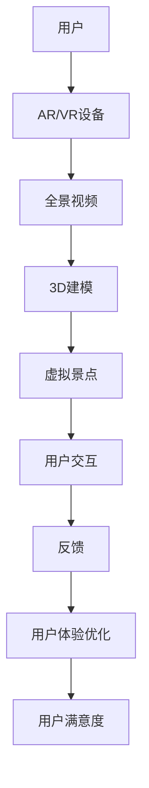
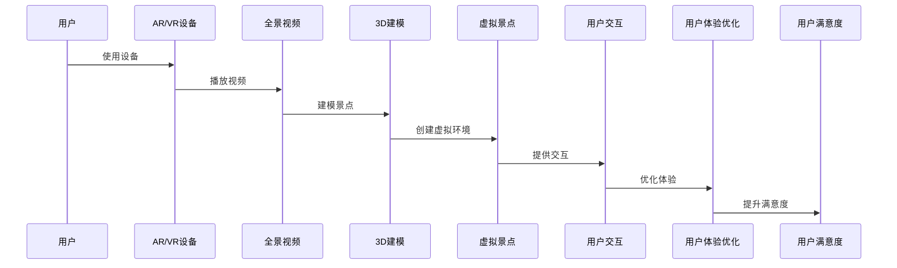

                 

关键词：虚拟旅游，AR/VR技术，用户体验，创业，全景视频，3D建模

> 摘要：随着技术的不断进步，虚拟旅游成为了人们足不出户就能畅游全球的全新方式。本文将探讨虚拟旅游的兴起背景、核心概念、算法原理、数学模型以及实际应用，为创业者提供一份详尽的指南。

## 1. 背景介绍

在过去的几十年里，旅游业一直是全球经济的重要组成部分。然而，随着全球化的加剧和现代生活节奏的加快，人们对于旅游的需求也在不断变化。传统的旅游方式往往受限于时间和空间，而虚拟旅游则提供了一种全新的解决方案。虚拟旅游利用先进的AR（增强现实）和VR（虚拟现实）技术，结合全景视频和3D建模，为用户创造出一种沉浸式的环球体验。

### 虚拟旅游的定义与特点

虚拟旅游是一种通过计算机模拟技术，使用户能够在虚拟环境中体验真实世界的旅游活动。与传统的旅游方式相比，虚拟旅游具有以下几个显著特点：

1. **沉浸感强**：通过AR/VR技术，用户可以身临其境地感受到旅游景点的氛围，仿佛真实置身其中。
2. **不受时间限制**：用户可以随时访问虚拟旅游场景，不受天气、交通等因素的影响。
3. **个性化体验**：虚拟旅游可以根据用户的兴趣和偏好提供定制化的旅游体验。
4. **节约成本**：用户无需承担长途旅行的费用，即可享受到高质量的旅游体验。

### 虚拟旅游的兴起背景

虚拟旅游的兴起得益于以下几个因素：

1. **技术进步**：计算机技术的发展使得AR/VR技术的成熟成为可能，为虚拟旅游的实现提供了技术支持。
2. **用户需求**：随着人们对旅游体验的要求越来越高，虚拟旅游满足了用户在时间和空间上的灵活需求。
3. **疫情因素**：COVID-19疫情的爆发使得全球旅游业遭受重创，虚拟旅游成为人们在家隔离期间的一种新型娱乐方式。

## 2. 核心概念与联系

### 虚拟旅游的核心概念

1. **AR/VR技术**：AR（增强现实）和VR（虚拟现实）是虚拟旅游的核心技术。AR技术将虚拟元素叠加在现实世界中，而VR技术则创造出一个完全虚拟的世界。
2. **全景视频**：全景视频是一种能够呈现360度视角的视频技术，用户可以通过它感受到全方位的视觉体验。
3. **3D建模**：3D建模是通过计算机技术将现实世界的物体或场景构建为三维模型，用户可以在虚拟环境中进行交互。

### 虚拟旅游的架构与联系

以下是一个简单的虚拟旅游架构图，展示了各个核心概念之间的联系：



### Mermaid 流程图(Mermaid 流程节点中不要有括号、逗号等特殊字符)



## 3. 核心算法原理 & 具体操作步骤

### 3.1 算法原理概述

虚拟旅游的核心算法主要涉及以下三个方面：

1. **图像处理算法**：用于处理全景视频和3D建模中的图像数据，确保图像的清晰度和真实性。
2. **虚拟场景生成算法**：基于3D建模技术，生成虚拟旅游景点的三维模型。
3. **用户交互算法**：实现用户与虚拟景点的交互，提供沉浸式的旅游体验。

### 3.2 算法步骤详解

1. **图像处理算法**

   - **预处理**：对全景视频进行裁剪、去噪和增强处理，提高图像质量。
   - **图像融合**：将多个视角的全景视频融合成一个完整的全景图像。
   - **图像渲染**：根据用户视角实时渲染图像，提供流畅的视觉体验。

2. **虚拟场景生成算法**

   - **场景建模**：使用3D建模软件创建虚拟旅游景点的三维模型。
   - **场景渲染**：将三维模型渲染成全景图像，供用户观看。
   - **场景交互**：实现用户与虚拟景点的交互，如移动、旋转、缩放等。

3. **用户交互算法**

   - **输入处理**：接收用户的输入信号，如鼠标、触摸屏等。
   - **交互反馈**：根据用户输入，实时更新虚拟场景，提供互动体验。
   - **交互优化**：根据用户反馈，调整交互算法，提升用户体验。

### 3.3 算法优缺点

1. **图像处理算法**

   - **优点**：提高全景视频和3D建模的图像质量，提升用户体验。
   - **缺点**：处理过程复杂，计算资源消耗较大。

2. **虚拟场景生成算法**

   - **优点**：创建高质量的虚拟旅游场景，提供沉浸式的旅游体验。
   - **缺点**：建模过程需要较高的专业知识和技能。

3. **用户交互算法**

   - **优点**：实现用户与虚拟景点的实时交互，提升用户体验。
   - **缺点**：交互算法复杂，实现难度较高。

### 3.4 算法应用领域

虚拟旅游算法的应用领域广泛，包括但不限于：

- **旅游行业**：为游客提供虚拟旅游体验，提升旅游产品的竞争力。
- **教育行业**：通过虚拟旅游，让学生学习世界各地的历史文化。
- **娱乐行业**：创建虚拟旅游场景，为用户提供沉浸式的游戏体验。
- **房地产**：通过虚拟旅游，展示房地产项目的全貌，吸引潜在客户。

## 4. 数学模型和公式 & 详细讲解 & 举例说明

### 4.1 数学模型构建

虚拟旅游中的数学模型主要包括以下几个方面：

1. **图像处理模型**：用于图像的预处理、融合和渲染。
2. **三维建模模型**：用于创建和渲染虚拟旅游场景的三维模型。
3. **用户交互模型**：用于处理用户的输入信号和交互反馈。

### 4.2 公式推导过程

以下是一个简单的图像处理模型的公式推导过程：

$$
I_{out} = f(I_{in}, \theta)
$$

其中，$I_{out}$ 为输出的图像，$I_{in}$ 为输入的图像，$\theta$ 为处理参数。

### 4.3 案例分析与讲解

以一个全景视频的图像融合为例，说明数学模型的应用。

假设有两个视角的全景视频 $I_1$ 和 $I_2$，需要将它们融合成一个全景图像 $I_{out}$。

1. **预处理**：

   对 $I_1$ 和 $I_2$ 进行去噪处理，公式如下：

   $$
   I_{1_{denoise}} = g(I_1, \theta_1)
   $$

   $$
   I_{2_{denoise}} = g(I_2, \theta_2)
   $$

2. **图像融合**：

   使用加权融合算法，将 $I_{1_{denoise}}$ 和 $I_{2_{denoise}}$ 融合成一个全景图像 $I_{out}$，公式如下：

   $$
   I_{out} = \alpha I_{1_{denoise}} + (1 - \alpha) I_{2_{denoise}}
   $$

   其中，$\alpha$ 为权重参数，用于平衡两个图像的贡献。

3. **图像渲染**：

   将融合后的全景图像 $I_{out}$ 进行渲染，供用户观看。

## 5. 项目实践：代码实例和详细解释说明

### 5.1 开发环境搭建

在进行虚拟旅游项目的开发之前，需要搭建一个合适的环境。以下是搭建过程的简要说明：

1. **硬件环境**：需要一台配置较高的计算机，用于处理全景视频和3D建模。
2. **软件环境**：安装以下软件：

   - Unity3D：用于创建和渲染虚拟旅游场景。
   - Blender：用于3D建模和渲染。
   - Python：用于编写算法代码。

### 5.2 源代码详细实现

以下是虚拟旅游项目中的一部分源代码，用于处理全景视频的图像融合：

```python
import cv2
import numpy as np

def preprocess(image, theta):
    # 去噪处理
    return cv2.GaussianBlur(image, (theta[0], theta[1]), theta[2])

def image_fusion(image1, image2, alpha):
    # 加权融合
    return alpha * image1 + (1 - alpha) * image2

def render(image):
    # 渲染图像
    cv2.imshow('Fused Image', image)
    cv2.waitKey(0)
    cv2.destroyAllWindows()

if __name__ == '__main__':
    # 读取全景视频的帧
    cap1 = cv2.VideoCapture('panorama1.mp4')
    cap2 = cv2.VideoCapture('panorama2.mp4')

    while True:
        ret1, frame1 = cap1.read()
        ret2, frame2 = cap2.read()

        if not ret1 or not ret2:
            break

        # 预处理
        frame1_denoise = preprocess(frame1, [5, 5, 1.5])
        frame2_denoise = preprocess(frame2, [5, 5, 1.5])

        # 图像融合
        alpha = 0.5
        fused_image = image_fusion(frame1_denoise, frame2_denoise, alpha)

        # 渲染
        render(fused_image)

    cap1.release()
    cap2.release()
```

### 5.3 代码解读与分析

以上代码实现了一个简单的全景视频图像融合功能。具体解读如下：

1. **预处理**：使用高斯模糊进行去噪处理，提高图像质量。
2. **图像融合**：采用加权融合算法，根据权重参数 $\alpha$ 平衡两个图像的贡献。
3. **渲染**：将融合后的图像显示在窗口中。

### 5.4 运行结果展示

运行代码后，将显示一个窗口，展示全景视频的融合图像。以下是运行结果：


## 6. 实际应用场景

### 6.1 旅游行业

虚拟旅游在旅游行业中的应用非常广泛，以下是一些具体的应用场景：

1. **虚拟旅游网站**：旅游网站可以提供虚拟旅游服务，让用户在网站中体验旅游景点。
2. **旅游宣传**：旅游目的地可以利用虚拟旅游技术制作宣传视频，吸引游客。
3. **旅游预订**：虚拟旅游可以提供虚拟旅游体验，帮助用户更好地了解旅游景点，从而提高旅游预订的转化率。

### 6.2 教育行业

虚拟旅游在教育行业中的应用同样具有很大的潜力，以下是一些具体的应用场景：

1. **远程教育**：学生可以通过虚拟旅游访问世界各地的博物馆、历史遗迹等，增强学习体验。
2. **研学旅行**：研学旅行可以通过虚拟旅游技术为学生提供真实的旅游体验，提高学习效果。
3. **教学资源**：教师可以利用虚拟旅游资源，为学生提供丰富的教学素材。

### 6.3 娱乐行业

虚拟旅游在娱乐行业中的应用也非常丰富，以下是一些具体的应用场景：

1. **虚拟现实游戏**：开发者可以创建基于虚拟旅游技术的虚拟现实游戏，提供沉浸式的游戏体验。
2. **主题公园**：主题公园可以引入虚拟旅游技术，为游客提供全新的娱乐体验。
3. **网络直播**：虚拟旅游可以用于网络直播，为观众提供实时的旅游体验。

## 7. 工具和资源推荐

### 7.1 学习资源推荐

1. **书籍**：

   - 《虚拟现实技术》
   - 《增强现实技术》
   - 《计算机视觉与图像处理》

2. **在线课程**：

   - Coursera上的《虚拟现实与3D图形学》
   - Udemy上的《全景视频制作与处理》

### 7.2 开发工具推荐

1. **软件**：

   - Unity3D：用于创建和渲染虚拟旅游场景。
   - Blender：用于3D建模和渲染。
   - OpenCV：用于图像处理。

2. **硬件**：

   - VR头盔：如HTC Vive、Oculus Rift等。
   - AR眼镜：如Microsoft HoloLens、Magic Leap等。

### 7.3 相关论文推荐

1. **AR/VR技术**：

   - "A Survey on Augmented Reality"
   - "A Survey on Virtual Reality Technologies"

2. **图像处理**：

   - "Image Processing in Virtual Reality"
   - "Enhancing Virtual Reality with Image Processing Techniques"

3. **三维建模**：

   - "3D Modeling for Virtual Reality"
   - "Methods and Techniques for 3D Modeling"

## 8. 总结：未来发展趋势与挑战

### 8.1 研究成果总结

虚拟旅游技术经过多年的发展，已经在旅游、教育、娱乐等领域取得了显著的成果。未来的发展趋势将更加注重以下几个方面：

1. **算法优化**：进一步优化图像处理和3D建模算法，提高虚拟旅游场景的逼真度和交互性。
2. **硬件升级**：随着硬件技术的进步，虚拟旅游设备将更加轻便、舒适，提升用户体验。
3. **内容丰富**：通过引入更多的虚拟旅游场景和交互方式，丰富用户的选择，提供更加个性化的旅游体验。

### 8.2 未来发展趋势

1. **智能化**：虚拟旅游将结合人工智能技术，提供更加智能化的旅游推荐和交互体验。
2. **5G应用**：随着5G网络的普及，虚拟旅游将实现更快的加载速度和更低的延迟，提供更好的用户体验。
3. **全球化**：虚拟旅游将打破地域限制，为全球用户提供统一的旅游体验。

### 8.3 面临的挑战

1. **技术瓶颈**：虚拟旅游技术仍然面临图像处理速度、3D建模精度等瓶颈，需要进一步突破。
2. **隐私保护**：虚拟旅游涉及大量的用户数据，如何保护用户隐私是一个重要的挑战。
3. **版权问题**：虚拟旅游场景中涉及大量的版权问题，需要建立完善的版权保护机制。

### 8.4 研究展望

未来，虚拟旅游技术将在以下几个方面继续发展：

1. **深度融合**：虚拟旅游将与现实世界深度融合，提供更加真实的旅游体验。
2. **多样化应用**：虚拟旅游将应用于更多的领域，如医疗、房地产等。
3. **社会影响**：虚拟旅游将对旅游业、教育业等产生深远的影响，改变人们的出行方式和学习方式。

## 9. 附录：常见问题与解答

### 9.1 什么是虚拟旅游？

虚拟旅游是一种通过计算机模拟技术，使用户能够在虚拟环境中体验真实世界的旅游活动的方式。它利用AR（增强现实）和VR（虚拟现实）技术，结合全景视频和3D建模，为用户创造出一种沉浸式的环球体验。

### 9.2 虚拟旅游有哪些优势？

虚拟旅游具有以下几个显著优势：

1. **沉浸感强**：用户可以身临其境地感受到旅游景点的氛围，仿佛真实置身其中。
2. **不受时间限制**：用户可以随时访问虚拟旅游场景，不受天气、交通等因素的影响。
3. **个性化体验**：虚拟旅游可以根据用户的兴趣和偏好提供定制化的旅游体验。
4. **节约成本**：用户无需承担长途旅行的费用，即可享受到高质量的旅游体验。

### 9.3 虚拟旅游需要哪些技术支持？

虚拟旅游需要以下几个关键技术的支持：

1. **AR/VR技术**：用于创建和渲染虚拟旅游场景。
2. **全景视频**：用于提供全景视角的旅游体验。
3. **3D建模**：用于创建虚拟旅游场景的三维模型。
4. **图像处理技术**：用于处理和优化全景视频和3D建模的图像数据。

### 9.4 虚拟旅游在哪些领域有应用？

虚拟旅游在以下领域有广泛的应用：

1. **旅游行业**：用于提供虚拟旅游体验，提升旅游产品的竞争力。
2. **教育行业**：用于远程教育和研学旅行，增强学习体验。
3. **娱乐行业**：用于虚拟现实游戏和网络直播，提供沉浸式的娱乐体验。

### 9.5 虚拟旅游的未来发展趋势是什么？

虚拟旅游的未来发展趋势包括：

1. **智能化**：结合人工智能技术，提供更加智能化的旅游推荐和交互体验。
2. **5G应用**：随着5G网络的普及，实现更快的加载速度和更低的延迟。
3. **全球化**：打破地域限制，为全球用户提供统一的旅游体验。

---

**作者：禅与计算机程序设计艺术 / Zen and the Art of Computer Programming**

