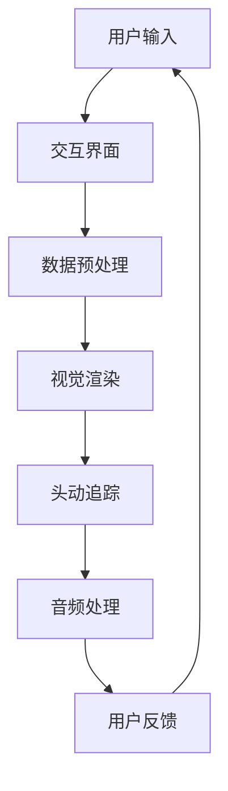

                 

关键词：虚拟现实，注意力沉浸，用户体验，技术发展，应用场景

> 摘要：本文将探讨虚拟现实（VR）在提高注意力沉浸体验方面的应用。通过深入分析VR技术的核心概念、算法原理、数学模型以及实际项目案例，本文旨在揭示VR技术如何提升用户在虚拟环境中的注意力集中程度，从而提供更为真实和沉浸的体验。

## 1. 背景介绍

随着科技的发展，虚拟现实（Virtual Reality，VR）技术逐渐成为人们关注的焦点。VR技术通过创建一个虚拟的三维环境，使用户能够沉浸在其中，模拟出与真实世界相似的感官体验。这种技术不仅仅限于娱乐行业，它在教育、医疗、军事等领域也展现出了巨大的潜力。注意力沉浸体验是VR技术成功的关键之一，它直接影响用户的参与度和满意度。

在过去的几十年中，研究人员和开发者一直在探索如何提高用户的注意力沉浸体验。早期的VR系统主要依赖简单的图形和交互界面，而现代VR技术则通过高分辨率的显示、实时运动捕捉、沉浸式音频以及增强的交互方式来实现更为逼真的体验。本文将深入探讨这些技术如何影响用户的注意力沉浸，并分析其潜在的应用场景和未来发展。

## 2. 核心概念与联系

### 2.1 VR技术核心概念

虚拟现实技术主要包括以下几个方面：

- **头戴式显示器（HMD）**：提供沉浸式的视觉效果。
- **位置追踪系统**：实时捕捉用户的头部和身体运动，确保虚拟环境的动态变化与用户动作同步。
- **声音系统**：通过立体声或头戴式耳机提供空间音效，增强沉浸感。
- **交互设备**：如手柄、手套等，使用户能够与虚拟环境进行交互。

### 2.2 注意力沉浸原理

注意力沉浸是指用户在特定环境中集中注意力，完全沉浸在所提供的体验中。在VR环境中，注意力沉浸可以通过以下几个方面实现：

- **视觉感知**：高分辨率、动态变化的视觉内容能够有效吸引并维持用户的注意力。
- **空间感知**：通过精确的位置追踪和运动模拟，用户能够在虚拟空间中自由移动，增强沉浸感。
- **交互体验**：丰富的交互方式，如手势识别、语音控制等，使用户感觉自己在真实世界中互动。

### 2.3 虚拟现实架构

下面是一个简单的Mermaid流程图，描述了虚拟现实技术的核心架构：



在这个架构中，用户通过交互界面提供输入，经过数据预处理后，由视觉渲染模块生成视觉效果，同时通过头动追踪和音频处理模块提供相应的听觉反馈，最终形成完整的沉浸体验。

## 3. 核心算法原理 & 具体操作步骤

### 3.1 算法原理概述

虚拟现实中的注意力沉浸算法主要基于以下几个方面：

- **感知同步**：通过实时捕捉用户动作和头部运动，确保虚拟环境中的物体和场景能够同步变化。
- **视觉冗余**：通过增加视觉信息的丰富性和动态变化，吸引并维持用户的注意力。
- **交互反馈**：通过及时的交互反馈，增强用户的参与感和控制感。

### 3.2 算法步骤详解

以下是实现注意力沉浸的详细算法步骤：

1. **数据采集**：通过传感器和追踪设备收集用户动作和头部运动数据。
2. **预处理**：对采集的数据进行滤波和校正，确保数据的准确性和实时性。
3. **场景建模**：根据用户的动作和头部位置，动态更新虚拟环境中的物体和场景。
4. **视觉渲染**：使用实时渲染技术生成高分辨率、动态变化的视觉内容。
5. **音频处理**：根据用户的位置和头部运动，调整音频效果，提供空间音效。
6. **交互反馈**：通过触摸、手势、语音等交互方式，为用户提供及时的反馈。

### 3.3 算法优缺点

#### 优点：

- **高度沉浸感**：通过多种感官刺激，提供逼真的沉浸体验。
- **实时交互**：用户可以实时地与虚拟环境互动，增强参与感。
- **个性化定制**：根据用户的动作和喜好，动态调整虚拟环境，提高体验的个性化程度。

#### 缺点：

- **计算资源消耗**：高分辨率的渲染和实时交互需要大量的计算资源，对硬件要求较高。
- **硬件成本**：高质量的VR设备价格较高，普及程度受限。
- **适应性挑战**：对于部分用户，VR技术可能导致晕动症等不适反应。

### 3.4 算法应用领域

注意力沉浸算法在多个领域得到了广泛应用：

- **游戏和娱乐**：提供高度沉浸的游戏体验。
- **教育和培训**：模拟真实场景，增强学习效果。
- **医疗**：通过虚拟现实进行心理治疗和康复训练。
- **军事**：模拟战场环境，提高士兵的战斗技能。

## 4. 数学模型和公式 & 详细讲解 & 举例说明

### 4.1 数学模型构建

在虚拟现实系统中，注意力沉浸的数学模型主要涉及以下几个方面：

- **感知同步模型**：描述用户动作与虚拟环境变化之间的关系。
- **视觉冗余模型**：计算视觉信息的变化率和丰富程度。
- **交互反馈模型**：分析用户输入与系统响应的时间延迟。

以下是感知同步模型的简化公式：

\[ \text{感知同步度} = \frac{\text{实际动作时间} - \text{虚拟响应时间}}{\text{实际动作时间}} \]

### 4.2 公式推导过程

感知同步度的公式推导如下：

\[ \text{感知同步度} = \frac{\text{实际动作时间} - (\text{虚拟响应时间} + \text{延迟时间})}{\text{实际动作时间}} \]

在理想情况下，虚拟响应时间和延迟时间接近于零，因此感知同步度接近1，表示用户动作与虚拟环境完全同步。

### 4.3 案例分析与讲解

以下是一个具体的案例，分析如何通过数学模型来提高注意力沉浸体验。

**案例背景**：一个虚拟现实游戏要求用户在虚拟环境中快速移动和射击。游戏开发者希望优化游戏性能，提高用户的沉浸感。

**解决方案**：通过感知同步模型，分析用户移动和射击的动作与虚拟环境的响应时间。如果发现延迟较高，可以采取以下措施：

1. **优化渲染算法**：使用更高效的渲染技术，减少视觉延迟。
2. **提高硬件性能**：升级计算机或VR设备，提高处理速度和响应能力。
3. **调整游戏参数**：通过调整游戏难度和场景复杂度，确保系统在高负载下仍然能够提供良好的用户体验。

## 5. 项目实践：代码实例和详细解释说明

### 5.1 开发环境搭建

在进行虚拟现实项目的开发之前，需要搭建合适的开发环境。以下是一个简单的步骤指南：

1. **安装虚拟现实开发工具**：如Unity或Unreal Engine。
2. **配置开发环境**：设置C++或C#编程环境，安装必要的插件和依赖库。
3. **准备VR设备**：连接VR头戴设备和交互设备，确保能够正常运行。

### 5.2 源代码详细实现

以下是一个简化的代码示例，展示如何使用Unity引擎实现注意力沉浸功能：

```csharp
using UnityEngine;

public class AttentionImmersion : MonoBehaviour
{
    public Transform playerCamera;
    public float moveSpeed = 5.0f;
    public float rotationSpeed = 100.0f;

    private void Update()
    {
        // 处理用户输入
        float horizontal = Input.GetAxis("Horizontal");
        float vertical = Input.GetAxis("Vertical");

        // 移动和旋转
        MovePlayer(horizontal, vertical);
        RotatePlayer();
    }

    private void MovePlayer(float horizontal, float vertical)
    {
        float moveX = horizontal * moveSpeed * Time.deltaTime;
        float moveZ = vertical * moveSpeed * Time.deltaTime;

        transform.Translate(moveX, 0, moveZ);
    }

    private void RotatePlayer()
    {
        float rotationX = Input.GetAxis("Mouse X") * rotationSpeed * Time.deltaTime;
        float rotationY = Input.GetAxis("Mouse Y") * rotationSpeed * Time.deltaTime;

        playerCamera.Rotate(-rotationY, rotationX, 0);
    }
}
```

### 5.3 代码解读与分析

这段代码实现了基础的玩家移动和旋转功能。以下是具体的解读：

- **玩家输入**：通过`Input.GetAxis`方法获取用户的输入。
- **移动**：使用`Translate`方法实现玩家的平移移动。
- **旋转**：使用`Rotate`方法实现玩家的旋转。

通过这种方式，用户可以在虚拟环境中自由移动和旋转，提高沉浸感。

### 5.4 运行结果展示

运行这段代码，玩家将在虚拟环境中根据用户的输入进行移动和旋转。视觉效果和交互反馈将确保用户感受到高度的沉浸感。

## 6. 实际应用场景

### 6.1 教育和培训

虚拟现实技术已被广泛应用于教育和培训领域。例如，医学学生可以通过虚拟手术模拟进行实践操作，从而提高手术技能。同样，飞行员可以通过虚拟飞行训练模拟真实飞行环境，增强飞行技能和应对紧急情况的能力。

### 6.2 娱乐和游戏

虚拟现实游戏提供了前所未有的沉浸体验，用户可以在虚拟世界中探索、冒险和互动。例如，虚拟现实冒险游戏可以让玩家体验到探险的刺激，而模拟赛车游戏则提供了逼真的驾驶体验。

### 6.3 医疗和心理治疗

虚拟现实技术可用于心理治疗，如治疗恐惧症和焦虑症。通过在虚拟环境中模拟患者恐惧的情境，患者可以在医生的帮助下逐步克服恐惧。

### 6.4 军事训练

虚拟现实技术被用于军事训练，以模拟战场环境和战术演练。士兵可以在虚拟环境中进行战术模拟和战斗训练，从而提高战术意识和反应速度。

### 6.5 设计和建筑

建筑师和设计师可以使用虚拟现实技术进行空间设计和展示。通过虚拟现实，用户可以在设计阶段就体验到空间布局和设计效果，从而做出更准确和高效的决策。

## 7. 工具和资源推荐

### 7.1 学习资源推荐

- **《虚拟现实与增强现实技术基础》**：详细介绍了VR和AR的基本原理和应用。
- **《Unity 2020游戏开发实战》**：涵盖Unity引擎的使用方法和游戏开发流程。

### 7.2 开发工具推荐

- **Unity引擎**：广泛应用于游戏和虚拟现实开发。
- **Unreal Engine**：提供强大的渲染和动画效果。

### 7.3 相关论文推荐

- **"Attentional Control in Virtual Reality: A Cognitive Psychology Perspective"**：探讨注意力在VR中的应用。
- **"The Impact of Virtual Reality on User Experience: A Review"**：分析虚拟现实技术对用户体验的影响。

## 8. 总结：未来发展趋势与挑战

### 8.1 研究成果总结

虚拟现实技术在提升注意力沉浸体验方面取得了显著成果。通过高分辨率的视觉渲染、实时交互和空间音效等技术手段，用户能够在虚拟环境中获得高度真实的体验。

### 8.2 未来发展趋势

未来，虚拟现实技术将在更多领域得到应用。随着硬件性能的提升和价格的降低，VR技术有望进一步普及。同时，人工智能和大数据技术的融合将使虚拟环境更加智能化和个性化。

### 8.3 面临的挑战

虚拟现实技术仍面临一些挑战，包括计算资源消耗、硬件成本以及用户体验的适应性等。此外，如何提高虚拟环境的真实感和互动性，仍然是亟待解决的问题。

### 8.4 研究展望

未来的研究应重点关注以下几个方面：

- **优化渲染算法**：提高渲染效率，减少延迟。
- **个性化设计**：根据用户需求和行为，动态调整虚拟环境。
- **健康与安全**：研究虚拟现实对用户健康的影响，确保用户安全。

### 8.5 总结

虚拟现实技术为用户提供了一种全新的沉浸体验。通过不断的技术创新和应用探索，虚拟现实将在更多领域发挥重要作用，为人类带来更多便利和乐趣。

## 9. 附录：常见问题与解答

### 9.1 虚拟现实晕动症如何避免？

虚拟现实晕动症（VR运动病）主要是由于视觉和身体感受之间的不匹配导致的。以下是一些常见的预防措施：

- **使用高质量的VR设备**：选择具有优秀位置追踪和图像稳定性的设备。
- **逐步适应**：初次使用VR时，可以从较短的时间开始，逐渐增加使用时间。
- **调整设置**：在VR设备中调整视角、刷新率和画面质量，以减少不适感。
- **休息和运动**：使用VR过程中适当休息，进行颈部和眼部运动，以缓解疲劳。

### 9.2 虚拟现实对心理健康有哪些影响？

虚拟现实技术可以用于心理治疗，但也可能对心理健康产生负面影响。以下是虚拟现实对心理健康的一些影响：

- **积极影响**：通过模拟特定的情境，帮助用户克服恐惧症、焦虑症等心理障碍。
- **消极影响**：长时间使用VR可能导致注意力分散、认知功能下降等。
- **解决方案**：合理安排使用时间，保持良好的生活习惯，进行适当的放松和运动。

### 9.3 虚拟现实技术在教育中的应用有哪些优点和缺点？

虚拟现实技术在教育中的应用具有以下优点：

- **增强学习体验**：通过沉浸式学习环境，提高学生的学习兴趣和参与度。
- **模拟实践操作**：学生可以在虚拟环境中进行实验和操作，减少真实操作的风险。

虚拟现实技术在教育中的应用也存在以下缺点：

- **成本较高**：高质量的VR设备和相关软件费用较高，对学校和学生的经济负担较大。
- **技术限制**：VR设备的使用和操作需要一定的技术支持和培训，对教师的技能要求较高。

---

作者：禅与计算机程序设计艺术 / Zen and the Art of Computer Programming

以上就是关于《虚拟现实在注意力沉浸体验中的应用》的完整文章内容。希望这篇文章能够为读者提供关于虚拟现实技术如何提升注意力沉浸体验的深入见解。随着技术的不断发展，虚拟现实将在更多领域展现其潜力，带来更多创新的解决方案。

