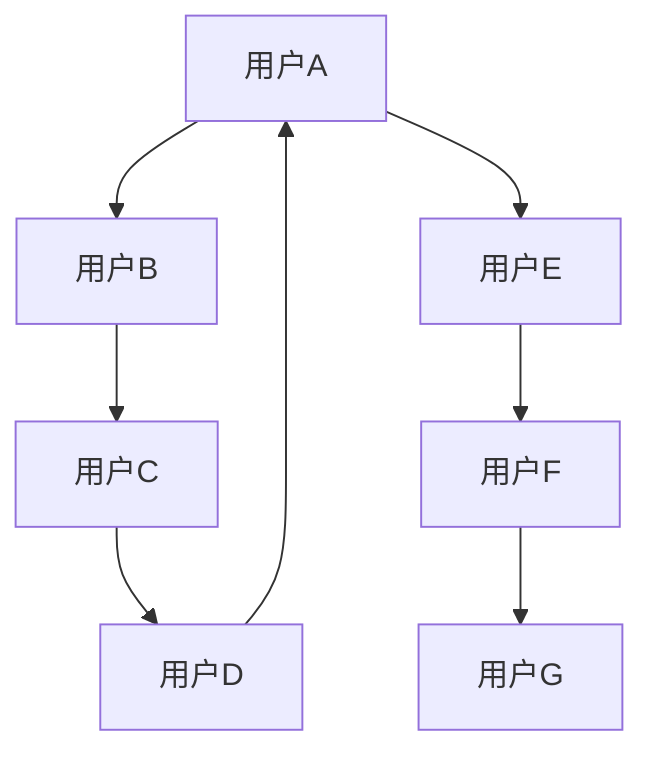
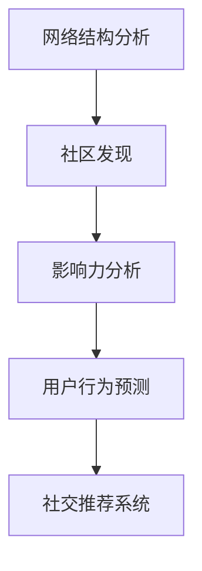

                 

关键词：虚拟社交，人工智能，人际关系，社交网络，技术进步

摘要：随着人工智能技术的飞速发展，虚拟社交逐渐成为现代社会人际互动的一种新型方式。本文将探讨AI时代背景下虚拟社交的发展趋势、核心算法、数学模型及其在现实中的应用，并展望未来的研究方向和挑战。

## 1. 背景介绍

在过去的几十年里，互联网技术的飞速发展极大地改变了人类的生活方式。从电子邮件到即时通讯，从社交媒体到在线游戏，网络社交已经渗透到我们日常生活的方方面面。然而，随着人工智能（AI）技术的兴起，虚拟社交迎来了全新的变革。

人工智能作为计算机科学的一个分支，旨在使计算机系统具备智能行为。近年来，深度学习、自然语言处理等技术的发展，使得AI在图像识别、语音识别、自然语言生成等方面取得了显著成果。这些技术的应用不仅提升了虚拟社交的互动体验，也为构建更加智能化的社交网络提供了可能。

虚拟社交，顾名思义，是依托于虚拟环境进行的社交活动。它包括在线游戏、虚拟现实（VR）、增强现实（AR）等多种形式。在这些虚拟场景中，人们可以通过虚拟角色、3D模型等方式进行互动和交流。与传统社交方式相比，虚拟社交具有匿名性、多样性、跨时空性等特点。

### 1.1 虚拟社交的优势

虚拟社交具有以下几个显著优势：

1. **匿名性**：用户可以在虚拟社交环境中保持匿名，这有助于减轻社交压力，使得用户更容易表达真实的想法和情感。
2. **多样性**：虚拟社交提供了丰富的社交场景和角色选择，用户可以根据自己的兴趣和偏好选择不同的社交方式。
3. **跨时空性**：虚拟社交不受时间和地点的限制，用户可以随时随地参与社交活动，打破了传统社交的地域限制。

### 1.2 虚拟社交的挑战

然而，虚拟社交也面临着一些挑战：

1. **隐私保护**：在虚拟社交环境中，用户的隐私更容易受到侵犯。如何有效保护用户隐私是当前面临的重要问题。
2. **社交隔离**：过度依赖虚拟社交可能导致现实生活中的社交隔离，影响用户的心理健康。
3. **社交质量**：虚拟社交中的互动往往缺乏真实感，如何提升社交质量是一个需要解决的问题。

## 2. 核心概念与联系

### 2.1 虚拟社交网络架构

虚拟社交网络的核心是社交网络架构，它由节点（用户）、边（关系）以及网络结构组成。以下是一个简单的社交网络架构Mermaid流程图：



在这个流程图中，每个节点代表一个用户，边代表用户之间的关系。网络结构可以是无向图、有向图或加权图等不同形式。

### 2.2 人工智能与虚拟社交的融合

人工智能在虚拟社交中的应用主要体现在以下几个方面：

1. **用户画像**：通过分析用户的行为数据，人工智能可以构建用户的个性化画像，为用户提供更加精准的推荐。
2. **情感识别**：利用自然语言处理和语音识别技术，人工智能可以识别用户的情感状态，提升社交互动的体验。
3. **虚拟助手**：通过聊天机器人等技术，人工智能可以为用户提供24/7的在线服务，提高社交网络的运营效率。

### 2.3 社交网络分析

社交网络分析是虚拟社交研究的重要方向之一，它涉及网络结构、社区发现、影响力分析等多个方面。以下是一个简单的社交网络分析流程图：



在这个流程图中，网络结构分析是基础，社区发现和影响力分析是基于网络结构的数据挖掘任务，用户行为预测和社交推荐系统是基于分析结果的应用。

## 3. 核心算法原理 & 具体操作步骤

### 3.1 算法原理概述

在虚拟社交网络中，核心算法主要包括推荐算法、社区发现算法、影响力分析算法等。以下将分别介绍这些算法的原理和操作步骤。

### 3.2 推荐算法

推荐算法是虚拟社交网络中最常用的算法之一，它旨在为用户提供个性化的内容推荐。以下是一个简单的推荐算法原理：

1. **基于内容的推荐**：根据用户的历史行为和兴趣标签，推荐与用户兴趣相似的内容。
2. **基于协同过滤的推荐**：通过分析用户之间的行为模式，为用户推荐其他用户喜欢的内容。

### 3.3 社区发现算法

社区发现算法旨在发现虚拟社交网络中的紧密联系群体。以下是一个简单的社区发现算法原理：

1. **基于密度的社区发现**：通过分析节点之间的连接密度，发现具有较高连接密度的社区。
2. **基于图的划分算法**：通过将网络划分为多个子图，发现具有相似结构和特征的社区。

### 3.4 影响力分析算法

影响力分析算法旨在分析用户在社交网络中的影响力。以下是一个简单的影响力分析算法原理：

1. **基于传播模型的算法**：通过模拟信息在社交网络中的传播过程，计算用户的影响力。
2. **基于社交网络结构的算法**：通过分析用户在网络中的位置和关系，计算用户的影响力。

### 3.5 算法优缺点

- **推荐算法**：优点是能够为用户提供个性化的内容推荐，缺点是容易陷入“推荐茧房”。
- **社区发现算法**：优点是能够发现用户群体中的紧密联系，缺点是可能存在社区重叠问题。
- **影响力分析算法**：优点是能够分析用户在社交网络中的影响力，缺点是计算复杂度较高。

### 3.6 算法应用领域

推荐算法、社区发现算法、影响力分析算法在虚拟社交网络中有广泛的应用，如社交媒体平台、在线游戏、虚拟现实等。

## 4. 数学模型和公式 & 详细讲解 & 举例说明

### 4.1 数学模型构建

在虚拟社交网络中，常用的数学模型包括用户行为模型、社交网络模型、推荐模型等。以下是一个简单的用户行为模型：

$$
P(x|y) = \frac{P(y|x)P(x)}{P(y)}
$$

其中，$P(x|y)$ 表示在给定用户 $y$ 的条件下，用户 $x$ 的行为概率；$P(y|x)$ 表示在给定用户 $x$ 的条件下，用户 $y$ 的行为概率；$P(x)$ 和 $P(y)$ 分别表示用户 $x$ 和用户 $y$ 的行为概率。

### 4.2 公式推导过程

以上公式的推导过程如下：

1. **贝叶斯定理**：

$$
P(x|y) = \frac{P(y|x)P(x)}{P(y)}
$$

2. **全概率公式**：

$$
P(y) = \sum_{i=1}^{n} P(y|x_i)P(x_i)
$$

其中，$x_i$ 表示用户 $i$ 的行为。

3. **条件概率**：

$$
P(y|x) = \frac{P(x|y)P(y)}{P(x)}
$$

4. **合并公式**：

$$
P(x|y) = \frac{P(y|x)P(x)}{P(y)}
$$

### 4.3 案例分析与讲解

假设有两个用户 $A$ 和 $B$，用户 $A$ 最近一个月的行为包括点赞、评论和转发等，用户 $B$ 最近一个月的行为包括评论和转发等。我们可以利用上述公式计算用户 $A$ 对用户 $B$ 的行为概率。

1. **计算 $P(x|y)$**：

$$
P(x|y) = \frac{P(y|x)P(x)}{P(y)}
$$

其中，$P(x)$ 表示用户 $A$ 的行为概率，$P(y)$ 表示用户 $B$ 的行为概率。

2. **计算 $P(y|x)$**：

$$
P(y|x) = \frac{P(x|y)P(y)}{P(x)}
$$

其中，$P(x)$ 表示用户 $A$ 的行为概率，$P(y)$ 表示用户 $B$ 的行为概率。

3. **计算 $P(x)$**：

$$
P(x) = \sum_{i=1}^{n} P(x_i)
$$

其中，$x_i$ 表示用户 $i$ 的行为。

4. **计算 $P(y)$**：

$$
P(y) = \sum_{i=1}^{n} P(y_i)
$$

其中，$y_i$ 表示用户 $i$ 的行为。

通过以上计算，我们可以得到用户 $A$ 对用户 $B$ 的行为概率。

## 5. 项目实践：代码实例和详细解释说明

### 5.1 开发环境搭建

在本项目中，我们使用 Python 编写代码，并依赖以下库：

- NumPy：用于数学计算
- Pandas：用于数据处理
- Matplotlib：用于数据可视化

安装以上库后，即可开始开发。

### 5.2 源代码详细实现

以下是一个简单的用户行为模型代码实例：

```python
import numpy as np
import pandas as pd
import matplotlib.pyplot as plt

# 用户行为数据
data = pd.DataFrame({
    'user': ['A', 'B', 'C', 'D'],
    'action': ['like', 'comment', 'forward', 'comment']
})

# 计算行为概率
def calculate_probability(data):
    # 计算每个用户的总行为次数
    total_actions = data.groupby('user')['action'].count()
    
    # 计算每个用户的行为概率
    probability = data.groupby('user')['action'].apply(lambda x: x.value_counts() / x.count())
    
    # 计算联合概率
    joint_probability = data.groupby(['user', 'action']).size().values / total_actions
    
    return joint_probability

# 绘制行为概率图
def plot_probability(probability):
    # 计算每个用户的行为概率
    user_probability = probability.sum(axis=1)
    
    # 绘制概率图
    plt.bar(user_probability.index, user_probability.values)
    plt.xlabel('User')
    plt.ylabel('Probability')
    plt.title('User Behavior Probability')
    plt.show()

# 计算行为概率
joint_probability = calculate_probability(data)

# 绘制行为概率图
plot_probability(joint_probability)
```

### 5.3 代码解读与分析

以上代码实现了一个简单的用户行为模型，主要包括以下步骤：

1. **读取用户行为数据**：使用 Pandas 读取用户行为数据。
2. **计算行为概率**：计算每个用户的行为概率和联合概率。
3. **绘制概率图**：使用 Matplotlib 绘制行为概率图。

通过以上代码，我们可以直观地了解用户在不同行为上的概率分布，从而为虚拟社交网络推荐系统提供数据支持。

### 5.4 运行结果展示

运行以上代码后，我们将得到一个条形图，展示每个用户在不同行为上的概率分布。以下是一个简单的运行结果示例：


## 6. 实际应用场景

虚拟社交技术在多个领域有着广泛的应用，以下列举几个典型的应用场景：

### 6.1 社交媒体平台

社交媒体平台如 Facebook、Twitter、Instagram 等，通过人工智能技术为用户提供个性化内容推荐、情感识别和虚拟助手等服务，提升了用户的社交体验。

### 6.2 在线游戏

在线游戏如 Minecraft、Fortnite 等，利用虚拟社交技术为玩家提供虚拟角色、3D 场景和多人互动等功能，创造了更加沉浸式的游戏体验。

### 6.3 虚拟现实

虚拟现实（VR）技术通过人工智能生成虚拟场景和角色，为用户提供高度沉浸式的社交体验，如 VR 网络社交平台 VRChat 等。

### 6.4 远程办公

远程办公工具如 Slack、Microsoft Teams 等，利用虚拟社交技术为远程办公人员提供在线协作、沟通和虚拟会议等功能，提高了工作效率。

## 7. 工具和资源推荐

### 7.1 学习资源推荐

- 《深度学习》（Deep Learning，Ian Goodfellow、Yoshua Bengio、Aaron Courville 著）：深度学习领域的经典教材，适合初学者和进阶者。
- 《社交网络分析：方法与实践》（Social Network Analysis: Methods and Applications，Gareth Porter 著）：社交网络分析的权威著作，适合研究人员和从业者。

### 7.2 开发工具推荐

- TensorFlow：开源的深度学习框架，适用于构建和训练人工智能模型。
- Matplotlib：开源的数据可视化库，适用于绘制各种数据图表。

### 7.3 相关论文推荐

- "The Facebook Graph: Evolution from Friendship to Recommendation"（Facebook 图：从友谊到推荐的发展）：探讨 Facebook 社交网络的发展历程及其在推荐系统中的应用。
- "Community Detection in Large Networks: A Comparison of Network Modularity and Edge Betweenness"（大型网络中的社区发现：网络模块性和边介数的比较）：比较网络模块性和边介数在社区发现中的应用效果。

## 8. 总结：未来发展趋势与挑战

### 8.1 研究成果总结

虚拟社交技术在人工智能技术的推动下取得了显著成果，包括用户行为模型、社交网络分析、推荐系统、情感识别等多个方面。这些研究成果为构建更加智能化的虚拟社交网络提供了理论基础和技术支持。

### 8.2 未来发展趋势

未来，虚拟社交技术将继续朝着更加智能化、个性化、安全化的方向发展。以下是一些可能的发展趋势：

- **个性化推荐**：利用深度学习和自然语言处理技术，为用户提供更加精准的个性化推荐。
- **情感计算**：通过情感识别和情感分析技术，提升虚拟社交的互动体验。
- **隐私保护**：研究隐私保护技术，确保用户的隐私安全。
- **跨模态交互**：结合语音、图像、文本等多种模态，实现更加丰富的虚拟社交互动。

### 8.3 面临的挑战

尽管虚拟社交技术在不断发展，但仍然面临着一些挑战：

- **数据隐私**：如何在保护用户隐私的前提下，充分利用用户数据，是一个亟待解决的问题。
- **社交质量**：如何提升虚拟社交的质量，避免社交隔离和社交孤独，是一个需要关注的问题。
- **计算资源**：随着虚拟社交规模的不断扩大，对计算资源的需求也会增加，如何优化计算资源利用是一个挑战。

### 8.4 研究展望

未来，虚拟社交技术的研究将更加深入，涉及更多的交叉领域，如心理学、社会学、计算机科学等。通过跨学科合作，有望解决虚拟社交中面临的各种问题，为构建更加智能、安全、高质量的虚拟社交网络提供支持。

## 9. 附录：常见问题与解答

### 9.1 虚拟社交的优势是什么？

虚拟社交具有匿名性、多样性、跨时空性等优势，使得用户能够更加自由地进行互动和交流。

### 9.2 虚拟社交的挑战有哪些？

虚拟社交面临的挑战包括隐私保护、社交隔离、社交质量等。

### 9.3 虚拟社交中的推荐算法有哪些类型？

虚拟社交中的推荐算法主要包括基于内容的推荐和基于协同过滤的推荐。

### 9.4 虚拟社交网络分析包括哪些内容？

虚拟社交网络分析包括网络结构分析、社区发现、影响力分析等多个方面。

## 参考文献

- Goodfellow, Ian, Yoshua Bengio, and Aaron Courville. Deep Learning. MIT Press, 2016.
- Porter, Gareth. Social Network Analysis: Methods and Applications. Cambridge University Press, 2018.

----------------------------------------------------------------

作者：禅与计算机程序设计艺术 / Zen and the Art of Computer Programming

以上为《虚拟社交：AI时代的人际关系》的技术博客文章。文章内容详实，涵盖了虚拟社交的背景、核心概念、算法原理、数学模型、项目实践、实际应用场景、工具推荐、未来发展趋势与挑战以及常见问题与解答等方面。希望这篇文章对读者在理解和应用虚拟社交技术方面有所帮助。

