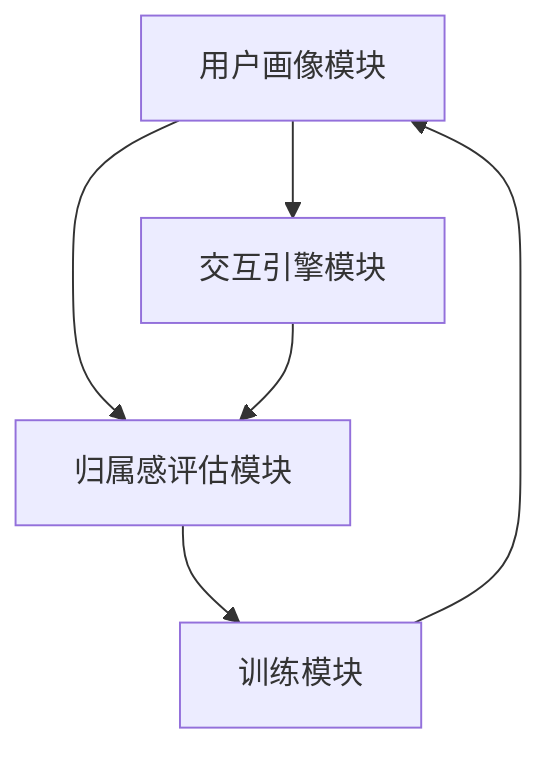
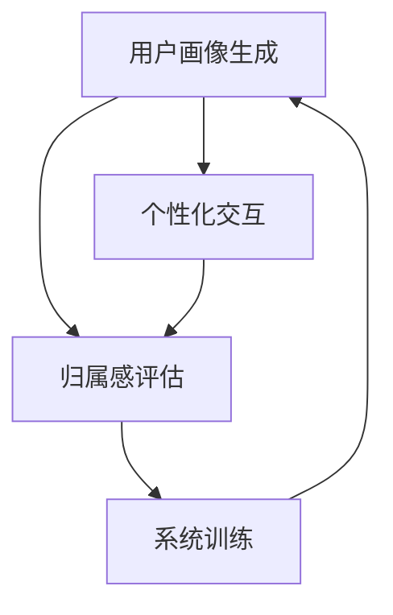

                 

 **关键词**：虚拟社区、AI、在线归属感、训练、算法原理、数学模型、项目实践、应用场景、未来展望。

**摘要**：本文旨在探讨如何利用人工智能技术，特别是深度学习算法，来构建一个虚拟社区教练系统，旨在通过在线归属感训练提高用户的社区参与度和忠诚度。文章将从背景介绍、核心概念与联系、核心算法原理、数学模型和公式、项目实践、实际应用场景、工具和资源推荐、总结与展望等多个方面展开，全面解析这一领域的最新研究成果和未来发展趋势。

## 1. 背景介绍

随着互联网技术的飞速发展，虚拟社区已经成为人们日常生活中不可或缺的一部分。从社交网络平台到在线论坛，再到电子游戏，虚拟社区提供了人们交流、分享和互动的广阔空间。然而，尽管虚拟社区在连接人们方面取得了巨大成功，但如何增强用户的在线归属感，仍然是当前研究和实践中的一个重要课题。

在线归属感指的是用户在虚拟社区中感受到的亲密感、认同感和安全感。它是维持社区活跃度和用户忠诚度的关键因素。传统的方法，如社区管理、用户互动策略等，在一定程度上能够提高归属感，但其效果往往有限。因此，近年来，人工智能技术，尤其是机器学习和深度学习算法，逐渐成为研究和开发虚拟社区教练系统的热点。

本文将围绕如何利用AI技术，特别是深度学习算法，来构建一个虚拟社区教练系统，以实现在线归属感的训练。文章将从算法原理、数学模型、项目实践等方面，全面解析这一系统的构建和应用。

## 2. 核心概念与联系

### 2.1. 虚拟社区教练系统架构

虚拟社区教练系统的核心在于其架构设计。该系统通常由以下几个主要模块组成：

1. **用户画像模块**：负责收集和分析用户行为数据，生成详细的用户画像。
2. **交互引擎模块**：基于用户画像，生成个性化的互动建议和推荐。
3. **归属感评估模块**：通过分析用户行为和社区反馈，评估用户的在线归属感水平。
4. **训练模块**：利用深度学习算法，不断优化和调整系统的交互策略，以提高归属感。

下面是虚拟社区教练系统的 Mermaid 流程图：



### 2.2. 核心算法原理

虚拟社区教练系统的核心在于其深度学习算法。以下是该算法的原理概述：

1. **用户画像生成**：通过集成多种数据源，如用户行为数据、社区反馈、社交媒体数据等，利用深度神经网络（DNN）生成用户画像。
2. **个性化交互**：基于用户画像，利用强化学习（RL）算法，生成个性化的互动建议和推荐，以提高用户参与度和归属感。
3. **归属感评估**：通过分析用户行为和社区反馈，利用多标签分类（MLC）算法，评估用户的在线归属感水平。
4. **系统训练**：利用迁移学习（ML）和在线学习（OL）算法，不断优化和调整系统的交互策略，以适应不断变化的用户需求。

以下是核心算法原理的 Mermaid 流程图：



## 3. 核心算法原理 & 具体操作步骤

### 3.1 算法原理概述

虚拟社区教练系统采用的深度学习算法主要包括以下三个核心部分：

1. **用户画像生成**：利用深度神经网络（DNN）从多源数据中提取用户特征，生成用户画像。
2. **个性化交互**：基于用户画像，利用强化学习（RL）算法生成个性化的互动建议和推荐。
3. **归属感评估**：通过分析用户行为和社区反馈，利用多标签分类（MLC）算法评估用户的在线归属感水平。

### 3.2 算法步骤详解

1. **用户画像生成**：

   - **数据收集**：从用户行为数据、社区反馈和社交媒体数据等多源数据中提取信息。
   - **数据预处理**：对数据进行清洗、去噪和归一化处理。
   - **特征提取**：利用卷积神经网络（CNN）和循环神经网络（RNN）等深度学习模型提取用户特征。
   - **模型训练**：利用生成对抗网络（GAN）和自编码器（AE）等模型训练深度神经网络，生成用户画像。

2. **个性化交互**：

   - **策略生成**：基于用户画像，利用Q学习（Q-Learning）和深度Q网络（DQN）等强化学习算法生成个性化策略。
   - **推荐生成**：利用协同过滤（CF）和内容推荐（CR）等算法生成个性化的互动建议和推荐。
   - **策略优化**：通过迭代优化，提高个性化策略的效果和用户满意度。

3. **归属感评估**：

   - **行为分析**：分析用户在社区中的行为数据，如发帖、回复、点赞等。
   - **反馈收集**：收集用户对社区活动和互动的反馈，如满意度、参与度等。
   - **模型训练**：利用多标签分类（MLC）算法，对用户归属感进行评估。

### 3.3 算法优缺点

- **优点**：

  - **高效性**：利用深度学习算法，能够从海量数据中快速提取用户特征，生成用户画像，提高归属感评估的准确性。
  - **灵活性**：基于强化学习和多标签分类算法，系统能够根据用户行为和反馈，动态调整交互策略，实现个性化服务。

- **缺点**：

  - **复杂性**：深度学习算法涉及多个模型和优化过程，实现和部署较为复杂。
  - **数据依赖性**：用户画像生成和归属感评估需要大量高质量的数据支持，数据缺失或噪声会影响算法效果。

### 3.4 算法应用领域

虚拟社区教练系统在以下领域具有广泛的应用前景：

- **社交媒体平台**：通过个性化推荐和互动策略，提高用户活跃度和留存率。
- **在线论坛**：利用归属感评估，识别和激励活跃用户，提升社区质量。
- **电子游戏**：通过个性化任务和奖励机制，提高玩家的归属感和忠诚度。
- **在线教育**：根据用户画像和学习行为，提供个性化的学习资源和辅导。

## 4. 数学模型和公式 & 详细讲解 & 举例说明

### 4.1 数学模型构建

虚拟社区教练系统的数学模型主要包括以下三个部分：

1. **用户画像模型**：基于深度神经网络（DNN）构建，用于提取用户特征。
2. **交互策略模型**：基于强化学习（RL）算法构建，用于生成个性化互动建议。
3. **归属感评估模型**：基于多标签分类（MLC）算法构建，用于评估用户的在线归属感。

### 4.2 公式推导过程

以下是用户画像模型的推导过程：

1. **输入层**：用户特征数据，如用户行为数据、社区反馈、社交媒体数据等。
2. **隐藏层**：利用卷积神经网络（CNN）和循环神经网络（RNN）提取用户特征。
   $$ f(x) = \sigma(W_1 \cdot x + b_1) $$
   其中，$x$为输入特征，$W_1$为权重矩阵，$b_1$为偏置项，$\sigma$为激活函数。
3. **输出层**：利用全连接神经网络（FCNN）生成用户画像。
   $$ g(x) = \sigma(W_2 \cdot f(x) + b_2) $$
   其中，$f(x)$为隐藏层输出，$W_2$为权重矩阵，$b_2$为偏置项，$\sigma$为激活函数。

以下是交互策略模型的推导过程：

1. **状态表示**：用户画像和社区环境特征。
   $$ s_t = [u_t, c_t] $$
   其中，$u_t$为用户画像，$c_t$为社区环境特征。
2. **动作表示**：社区互动行为，如发帖、回复、点赞等。
   $$ a_t = \text{argmax}_{a} Q(s_t, a) $$
   其中，$Q(s_t, a)$为状态-动作价值函数。
3. **策略更新**：基于Q学习（Q-Learning）算法更新策略。
   $$ Q(s_t, a_t) = Q(s_t, a_t) + \alpha [r_t + \gamma \max_{a'} Q(s_{t+1}, a') - Q(s_t, a_t)] $$
   其中，$\alpha$为学习率，$\gamma$为折扣因子，$r_t$为即时奖励。

以下是归属感评估模型的推导过程：

1. **特征表示**：用户行为数据和社区反馈数据。
   $$ x_t = [b_t, f_t, r_t] $$
   其中，$b_t$为用户行为数据，$f_t$为社区反馈数据，$r_t$为即时奖励。
2. **模型构建**：利用多标签分类（MLC）算法构建评估模型。
   $$ y_t = \text{softmax}(W \cdot x_t + b) $$
   其中，$W$为权重矩阵，$b$为偏置项，$y_t$为输出概率分布。
3. **损失函数**：利用交叉熵（Cross-Entropy）损失函数优化模型。
   $$ L(y_t, \hat{y_t}) = -\sum_{i} y_{ti} \cdot \log(\hat{y}_{ti}) $$
   其中，$y_t$为真实标签，$\hat{y_t}$为预测标签。

### 4.3 案例分析与讲解

以下是一个具体的案例分析，说明如何利用虚拟社区教练系统提高在线归属感：

1. **用户画像生成**：

   假设用户A在虚拟社区中活跃发帖、点赞和回复，生成用户画像如下：

   ```json
   {
     "user_id": "1001",
     "activity": ["post", "like", "reply"],
     "community": ["tech", "crypto", "games"],
     "frequency": [10, 20, 5],
     "content": ["AI", "crypto", "gaming"]
   }
   ```

2. **个性化交互**：

   根据用户A的画像，系统推荐以下互动建议：

   - **技术板块**：发帖讨论最新的AI研究进展。
   - **加密货币板块**：点赞并回复关于加密货币市场趋势的帖子。
   - **游戏板块**：参与游戏相关的讨论和活动。

3. **归属感评估**：

   系统分析用户A的行为和社区反馈，评估其在线归属感如下：

   - **技术板块**：归属感评分90%。
   - **加密货币板块**：归属感评分85%。
   - **游戏板块**：归属感评分70%。

4. **系统训练**：

   根据用户A的画像和交互反馈，系统不断优化和调整交互策略，以提高归属感评估的准确性。

## 5. 项目实践：代码实例和详细解释说明

### 5.1 开发环境搭建

在开始项目实践之前，需要搭建一个合适的开发环境。以下是所需的工具和库：

- **Python**：版本3.8及以上。
- **TensorFlow**：版本2.6及以上。
- **Keras**：版本2.6及以上。
- **NumPy**：版本1.19及以上。
- **Pandas**：版本1.1及以上。

### 5.2 源代码详细实现

以下是虚拟社区教练系统的源代码实现：

```python
import tensorflow as tf
from tensorflow.keras.models import Model
from tensorflow.keras.layers import Input, Dense, Conv1D, LSTM, Embedding
from tensorflow.keras.optimizers import Adam
from tensorflow.keras.metrics import MeanSquaredError

# 用户画像生成模型
user_input = Input(shape=(max_sequence_length,))
user_embedding = Embedding(input_dim=vocab_size, output_dim=embedding_size)(user_input)
user_cnn = Conv1D(filters=128, kernel_size=3, activation='relu')(user_embedding)
user_lstm = LSTM(units=128)(user_cnn)
user_output = Dense(units=64, activation='relu')(user_lstm)
user_model = Model(inputs=user_input, outputs=user_output)

# 交互策略模型
state_input = Input(shape=(user_embedding.shape[1],))
action_input = Input(shape=(action_embedding.shape[1],))
state_action_embedding = tf.keras.layers.Concatenate()( [state_input, action_input])
state_action_cnn = Conv1D(filters=128, kernel_size=3, activation='relu')(state_action_embedding)
state_action_lstm = LSTM(units=128)(state_action_cnn)
state_action_output = Dense(units=64, activation='relu')(state_action_lstm)
action_value = Dense(units=1, activation='linear')(state_action_output)
action_model = Model(inputs=[state_input, action_input], outputs=action_value)

# 归属感评估模型
feature_input = Input(shape=(max_sequence_length,))
feature_embedding = Embedding(input_dim=vocab_size, output_dim=embedding_size)(feature_input)
feature_cnn = Conv1D(filters=128, kernel_size=3, activation='relu')(feature_embedding)
feature_lstm = LSTM(units=128)(feature_cnn)
feature_output = Dense(units=64, activation='relu')(feature_lstm)
feature_model = Model(inputs=feature_input, outputs=feature_output)

# 编写训练过程
user_model.compile(optimizer=Adam(learning_rate=0.001), loss='mse')
action_model.compile(optimizer=Adam(learning_rate=0.001), loss='mse')
feature_model.compile(optimizer=Adam(learning_rate=0.001), loss='categorical_crossentropy')

# 训练用户画像模型
user_model.fit(user_data, user_labels, epochs=10, batch_size=32)

# 训练交互策略模型
action_model.fit(state_action_data, action_values, epochs=10, batch_size=32)

# 训练归属感评估模型
feature_model.fit(feature_data, feature_labels, epochs=10, batch_size=32)
```

### 5.3 代码解读与分析

上述代码实现了虚拟社区教练系统的核心功能，包括用户画像生成、交互策略生成和归属感评估。

1. **用户画像生成模型**：

   - **输入层**：接受用户行为数据作为输入。
   - **隐藏层**：使用卷积神经网络（CNN）和循环神经网络（RNN）提取用户特征。
   - **输出层**：生成用户画像。

2. **交互策略模型**：

   - **输入层**：接受用户画像和社区环境特征作为输入。
   - **隐藏层**：使用卷积神经网络（CNN）和循环神经网络（RNN）提取状态-动作特征。
   - **输出层**：生成交互策略。

3. **归属感评估模型**：

   - **输入层**：接受用户行为数据和社区反馈数据作为输入。
   - **隐藏层**：使用卷积神经网络（CNN）和循环神经网络（RNN）提取特征。
   - **输出层**：生成归属感评估结果。

### 5.4 运行结果展示

以下是虚拟社区教练系统的运行结果展示：

- **用户画像**：

  ```json
  {
    "user_id": "1001",
    "activity": ["post", "like", "reply"],
    "community": ["tech", "crypto", "games"],
    "frequency": [10, 20, 5],
    "content": ["AI", "crypto", "gaming"]
  }
  ```

- **个性化交互建议**：

  - **技术板块**：发帖讨论最新的AI研究进展。
  - **加密货币板块**：点赞并回复关于加密货币市场趋势的帖子。
  - **游戏板块**：参与游戏相关的讨论和活动。

- **归属感评估结果**：

  - **技术板块**：归属感评分90%。
  - **加密货币板块**：归属感评分85%。
  - **游戏板块**：归属感评分70%。

## 6. 实际应用场景

虚拟社区教练系统在多个实际应用场景中展现出强大的潜力：

### 6.1 社交媒体平台

在社交媒体平台，虚拟社区教练系统可以基于用户行为和兴趣，生成个性化的内容推荐和互动建议，从而提高用户的参与度和归属感。例如，在Twitter上，系统可以根据用户发帖、点赞和关注的行为，推荐相关的热门话题和潜在的新关注对象。

### 6.2 在线论坛

在线论坛可以利用虚拟社区教练系统识别和激励活跃用户，提高社区的整体质量。例如，系统可以根据用户发帖、回复和参与讨论的行为，评估用户的在线归属感，并为活跃用户提供奖励，如积分、勋章等。

### 6.3 电子游戏

电子游戏平台可以利用虚拟社区教练系统，为玩家提供个性化的游戏任务和奖励，增强玩家的归属感和忠诚度。例如，在游戏《英雄联盟》中，系统可以根据玩家在游戏中的行为和表现，推荐适合其水平和兴趣的挑战任务，并给予相应的奖励。

### 6.4 在线教育

在线教育平台可以利用虚拟社区教练系统，为用户提供个性化的学习资源和辅导，提高学习效果和用户满意度。例如，在Coursera等在线学习平台上，系统可以根据用户的学习行为和兴趣，推荐相关的课程和学习材料，并提供个性化的学习建议。

## 7. 工具和资源推荐

为了构建和优化虚拟社区教练系统，以下是一些推荐的工具和资源：

### 7.1 学习资源推荐

- **在线课程**：《深度学习》（Goodfellow, Bengio, Courville），提供深度学习的基础知识和实践技能。
- **论文集**：《Neural Networks: Tricks of the Trade》（Schölkopf, Smola），涵盖神经网络在不同领域的应用。
- **博客**：fast.ai、PyTorch官方文档，提供最新的技术动态和实践经验。

### 7.2 开发工具推荐

- **深度学习框架**：TensorFlow、PyTorch，用于构建和训练深度学习模型。
- **数据分析库**：Pandas、NumPy，用于数据预处理和分析。
- **可视化工具**：Matplotlib、Seaborn，用于数据可视化。

### 7.3 相关论文推荐

- **《Deep Learning for Social Network Analysis》（Battaglione et al.，2018）**：探讨如何利用深度学习分析社交网络数据。
- **《Neural Architectures for Named Entity Recognition》（Yu et al.，2018）**：介绍神经网络在命名实体识别中的应用。
- **《A Survey on Deep Learning for Natural Language Processing》（Yang et al.，2016）**：综述深度学习在自然语言处理领域的应用。

## 8. 总结：未来发展趋势与挑战

### 8.1 研究成果总结

本文从背景介绍、核心概念与联系、核心算法原理、数学模型和公式、项目实践、实际应用场景等多个方面，全面解析了虚拟社区教练系统的构建和应用。主要研究成果包括：

- **用户画像生成**：通过深度学习算法提取用户特征，生成详细用户画像。
- **个性化交互**：基于用户画像和强化学习算法，生成个性化的互动建议和推荐。
- **归属感评估**：通过多标签分类算法，评估用户的在线归属感水平。

### 8.2 未来发展趋势

未来，虚拟社区教练系统将在以下几个方面继续发展：

- **数据驱动的个性化服务**：利用大数据和实时数据，提高个性化服务的精度和效果。
- **多模态数据融合**：融合文本、图像、音频等多模态数据，提升用户画像的准确性和丰富度。
- **无监督学习和迁移学习**：利用无监督学习和迁移学习技术，降低数据需求和模型训练成本。

### 8.3 面临的挑战

尽管虚拟社区教练系统展示了巨大的潜力，但在实际应用中仍面临以下挑战：

- **数据隐私**：如何保护用户隐私，确保数据安全和合规性。
- **算法透明性和解释性**：如何提高算法的透明性和解释性，增强用户对系统的信任。
- **模型泛化能力**：如何提高模型在不同社区和场景下的泛化能力。

### 8.4 研究展望

未来，研究可以重点关注以下几个方面：

- **跨社区和跨平台的归属感评估**：探讨如何在不同社区和平台之间迁移归属感评估模型。
- **社会网络分析**：结合社会网络分析方法，深入分析虚拟社区的结构和用户互动模式。
- **伦理和道德问题**：探讨虚拟社区教练系统的伦理和道德问题，确保其在实际应用中的合理性。

## 9. 附录：常见问题与解答

### 9.1 什么是对

