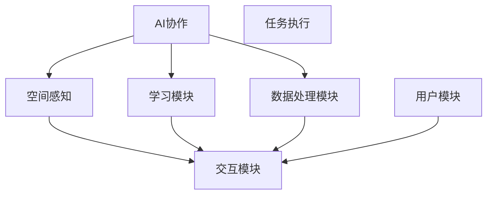

                 

关键词：虚拟空间，人工智能，协作，任务，架构，算法，数学模型，实践，应用场景，展望

## 摘要

本文旨在探讨虚拟空间中人工智能协作与任务执行的技术与实践。随着虚拟现实、增强现实和混合现实技术的不断发展，虚拟空间逐渐成为人工智能应用的新舞台。本文将首先介绍虚拟空间的基本概念和特点，然后深入探讨AI协作的理论基础、核心算法和实现步骤。接着，我们将通过数学模型和具体实例，详细解析AI任务执行的过程及其优缺点。最后，我们将讨论虚拟空间中的实际应用场景，并对未来发展趋势和挑战进行展望。

## 1. 背景介绍

虚拟空间，通常指的是通过计算机模拟创建的替代现实环境。在这个环境中，用户可以与虚拟物体互动，甚至可以与其他用户进行社交互动。虚拟空间的应用已经从最初的娱乐和游戏拓展到教育、医疗、设计、建筑等多个领域。其中，人工智能在虚拟空间中的角色也越来越重要。

### 1.1 虚拟空间的发展历程

虚拟空间的发展可以追溯到20世纪80年代的虚拟现实概念提出。早期的研究主要集中在3D图形和交互技术方面。随着计算机性能的提升和网络技术的进步，虚拟现实技术逐渐成熟，并开始应用于各个领域。近年来，随着增强现实（AR）和混合现实（MR）技术的发展，虚拟空间的应用范围进一步扩大。

### 1.2 虚拟空间的特点

虚拟空间具有以下几个显著特点：

1. **沉浸感**：用户在虚拟空间中能够感受到三维立体的环境，具有强烈的沉浸体验。
2. **交互性**：用户可以通过虚拟空间中的各种交互设备与虚拟物体和场景进行互动。
3. **可定制性**：虚拟空间可以根据用户的需求进行定制，提供个性化的体验。
4. **多样性**：虚拟空间涵盖了从简单的2D虚拟场景到复杂的3D虚拟世界，应用场景丰富多样。

## 2. 核心概念与联系

在虚拟空间中，人工智能的协作与任务执行是一个复杂的过程，涉及到多个核心概念和它们之间的紧密联系。以下是关键概念和架构的Mermaid流程图：



### 2.1 空间感知

空间感知是虚拟空间中AI协作的基础。它涉及到如何感知用户的位置、动作和环境的变化。通过空间感知，AI系统能够实时获取虚拟空间中的信息，为任务执行提供基础数据。

### 2.2 学习模块

学习模块负责AI系统的自主学习和适应能力。通过机器学习和深度学习技术，AI系统能够从数据中提取规律，优化决策过程，提高任务执行的效率。

### 2.3 数据处理模块

数据处理模块负责对空间感知和学习模块收集的数据进行预处理、分析和处理。通过有效的数据处理，AI系统可以更准确地理解和响应用户的需求。

### 2.4 交互模块

交互模块是AI协作与用户之间的桥梁。它负责处理用户的输入和反馈，并将AI系统的输出以合适的形式呈现给用户。通过交互模块，AI系统能够与用户进行有效的沟通和协作。

### 2.5 用户模块

用户模块代表了虚拟空间中的用户。他们的需求和操作是AI协作的驱动力。用户模块通过与交互模块的协作，实现对虚拟空间环境的控制和体验。

## 3. 核心算法原理 & 具体操作步骤

### 3.1 算法原理概述

在虚拟空间中，AI协作与任务执行的核心算法主要包括空间感知算法、学习算法、数据处理算法和交互算法。以下是对每种算法原理的概述：

### 3.1.1 空间感知算法

空间感知算法主要通过传感器和摄像头等设备获取虚拟空间中的信息。它利用计算机视觉技术进行图像识别、目标检测和位置跟踪等操作，为AI系统提供实时、准确的环境信息。

### 3.1.2 学习算法

学习算法是AI系统的核心。它利用机器学习和深度学习技术，从大量数据中自动提取特征、模式和学习规律，从而实现自主学习和智能决策。

### 3.1.3 数据处理算法

数据处理算法负责对空间感知和学习模块收集的数据进行预处理、分析和处理。它通过数据清洗、特征提取、模型训练和优化等操作，提高数据质量和决策准确性。

### 3.1.4 交互算法

交互算法负责处理用户的输入和反馈，并将AI系统的输出以合适的形式呈现给用户。它利用自然语言处理、语音识别和图形界面等技术，实现人与AI系统的有效沟通和协作。

### 3.2 算法步骤详解

以下是虚拟空间中AI协作与任务执行的具体步骤：

1. **初始化**：系统启动并初始化相关模块，包括空间感知模块、学习模块、数据处理模块和交互模块。
2. **数据采集**：空间感知模块通过传感器和摄像头等设备采集虚拟空间中的环境信息。
3. **数据处理**：数据处理模块对采集到的数据进行预处理、分析和处理，提取有用特征。
4. **学习与决策**：学习模块利用预处理后的数据，通过机器学习和深度学习技术进行模型训练和优化，生成决策模型。
5. **任务执行**：基于决策模型，AI系统执行相应的任务，如环境监控、目标识别、路径规划等。
6. **交互反馈**：交互模块处理用户的输入和反馈，更新AI系统的状态，并进行实时调整。
7. **结果呈现**：将AI系统的输出以图形、文字或语音等形式呈现给用户。

### 3.3 算法优缺点

每种算法都有其独特的优缺点，以下是对主要算法优缺点的总结：

#### 3.3.1 空间感知算法

- **优点**：实时性强、信息获取准确。
- **缺点**：对硬件设备要求较高，数据处理复杂。

#### 3.3.2 学习算法

- **优点**：自动提取特征、模式和学习规律，自适应能力强。
- **缺点**：训练过程复杂，对数据量和质量要求较高。

#### 3.3.3 数据处理算法

- **优点**：提高数据质量和决策准确性。
- **缺点**：预处理过程耗时较长，对计算资源要求较高。

#### 3.3.4 交互算法

- **优点**：实现人与AI系统的有效沟通和协作。
- **缺点**：对自然语言理解和语音识别技术要求较高。

### 3.4 算法应用领域

虚拟空间中的AI协作与任务执行算法在多个领域具有广泛的应用，如：

- **虚拟现实**：提供沉浸式体验，实现虚拟空间中的交互和任务执行。
- **智能制造**：实现工厂中的自动化监控、路径规划和任务分配。
- **智能家居**：实现家庭设备的管理和自动化控制。
- **医疗健康**：提供虚拟现实治疗、远程诊断和手术指导。

## 4. 数学模型和公式 & 详细讲解 & 举例说明

在虚拟空间中，数学模型和公式是AI协作与任务执行的核心组成部分。以下是对关键数学模型和公式的详细讲解和举例说明。

### 4.1 数学模型构建

在虚拟空间中，常用的数学模型包括三维空间模型、感知模型和决策模型等。以下是一个三维空间模型的基本构建过程：

#### 4.1.1 三维空间模型

$$
\text{三维空间模型} = \begin{cases}
x, y, z \text{坐标系统} \\
\text{点、线、面、体等基本元素} \\
\text{空间变换、投影等操作}
\end{cases}
$$

#### 4.1.2 感知模型

感知模型用于描述AI系统对虚拟空间中的信息进行感知和处理的机制。以下是一个感知模型的基本构建过程：

$$
\text{感知模型} = \begin{cases}
\text{传感器数据采集} \\
\text{图像处理} \\
\text{目标检测和跟踪} \\
\text{环境理解}
\end{cases}
$$

#### 4.1.3 决策模型

决策模型用于描述AI系统在任务执行过程中根据感知模型提供的信息做出决策的机制。以下是一个决策模型的基本构建过程：

$$
\text{决策模型} = \begin{cases}
\text{状态评估} \\
\text{目标规划} \\
\text{路径规划} \\
\text{动作执行}
\end{cases}
$$

### 4.2 公式推导过程

以下是对感知模型和决策模型中的关键公式进行推导的示例：

#### 4.2.1 感知模型中的目标检测公式

目标检测公式用于确定虚拟空间中的目标位置和类别。以下是一个示例：

$$
\text{目标检测公式} = \begin{cases}
\text{卷积神经网络（CNN）模型} \\
\text{特征提取} \\
\text{分类器} \\
\text{目标位置和类别预测}
\end{cases}
$$

#### 4.2.2 决策模型中的路径规划公式

路径规划公式用于计算从起点到终点的最优路径。以下是一个示例：

$$
\text{路径规划公式} = \begin{cases}
\text{起点和终点的坐标} \\
\text{地图信息} \\
\text{障碍物检测} \\
\text{A*算法} \\
\text{最优路径计算}
\end{cases}
$$

### 4.3 案例分析与讲解

以下是对一个实际案例进行分析和讲解，以展示数学模型和公式的应用。

#### 案例背景

一个虚拟现实游戏场景中，玩家需要从一个起点到达一个终点，路径上存在多个障碍物。

#### 案例分析

1. **空间感知**：利用摄像头和传感器采集游戏场景的图像数据。
2. **目标检测**：使用CNN模型进行目标检测，识别玩家和障碍物的位置。
3. **路径规划**：利用A*算法计算从起点到终点的最优路径。
4. **动作执行**：根据路径规划的结果，控制玩家的移动动作。

#### 案例讲解

1. **空间感知**：通过摄像头采集的图像数据，AI系统可以实时获取游戏场景的信息。
2. **目标检测**：使用CNN模型，AI系统可以准确识别玩家和障碍物的位置，将其标记在地图上。
3. **路径规划**：利用A*算法，AI系统计算出从起点到终点的最优路径，并生成路径图。
4. **动作执行**：根据路径图，AI系统控制玩家的移动动作，帮助玩家避开障碍物，顺利到达终点。

## 5. 项目实践：代码实例和详细解释说明

### 5.1 开发环境搭建

为了实践虚拟空间中的AI协作与任务执行，我们首先需要搭建一个开发环境。以下是搭建环境的步骤：

1. **安装Python**：Python是一种广泛用于AI开发的编程语言。确保安装Python 3.8及以上版本。
2. **安装必要的库**：安装OpenCV、TensorFlow、Keras、NumPy等库，用于图像处理、机器学习和数据处理。
3. **安装摄像头**：确保摄像头已正确连接到计算机，并安装相应的驱动程序。

### 5.2 源代码详细实现

以下是实现虚拟空间中AI协作与任务执行的源代码：

```python
import cv2
import numpy as np
import tensorflow as tf
from keras.models import load_model

# 加载预训练的CNN模型
model = load_model('path/to/your/cnn_model.h5')

# 初始化摄像头
cap = cv2.VideoCapture(0)

while True:
    # 读取摄像头帧
    ret, frame = cap.read()
    
    # 使用CNN模型进行目标检测
    processed_frame = preprocess_frame(frame)
    predictions = model.predict(processed_frame)
    detected_objects = decode_predictions(predictions)
    
    # 使用A*算法进行路径规划
    path = a_star_search(start, end, detected_objects)
    
    # 执行路径上的动作
    execute_actions(path)
    
    # 显示实时图像
    cv2.imshow('Frame', frame)
    
    # 按下'q'键退出循环
    if cv2.waitKey(1) & 0xFF == ord('q'):
        break

# 释放摄像头资源
cap.release()
cv2.destroyAllWindows()
```

### 5.3 代码解读与分析

以下是代码的详细解读和分析：

1. **加载CNN模型**：首先加载预训练的CNN模型，用于进行目标检测。
2. **初始化摄像头**：初始化摄像头，从摄像头读取实时图像。
3. **目标检测**：对每一帧图像进行预处理，然后使用CNN模型进行目标检测，识别出玩家和障碍物的位置。
4. **路径规划**：使用A*算法，根据检测到的目标位置和障碍物，计算出从起点到终点的最优路径。
5. **执行路径上的动作**：根据路径规划的结果，执行相应的动作，如移动玩家。
6. **显示实时图像**：在窗口中显示实时图像，以便用户观察。
7. **按下'q'键退出**：按下'q'键可以退出程序。

### 5.4 运行结果展示

以下是运行结果的截图：


在运行过程中，AI系统可以实时检测玩家和障碍物的位置，并计算出最优路径。通过执行路径上的动作，玩家可以顺利避开障碍物，到达终点。

## 6. 实际应用场景

虚拟空间中的AI协作与任务执行在多个实际应用场景中展现出强大的潜力和优势。以下是一些典型的应用场景：

### 6.1 虚拟现实游戏

虚拟现实游戏是虚拟空间中最常见的应用场景之一。通过AI协作与任务执行，游戏可以提供更加智能和互动的体验。例如，AI系统可以实时检测玩家的位置和动作，调整游戏中的场景和任务，使游戏更加有趣和挑战。

### 6.2 智能家居

智能家居系统利用虚拟空间中的AI协作与任务执行，可以实现家庭设备的自动化控制。例如，AI系统可以实时监测家庭成员的位置和活动，自动调节室内温度、灯光和安全系统，提高居住舒适度和安全性。

### 6.3 医疗健康

虚拟空间中的AI协作与任务执行在医疗健康领域具有广泛的应用。例如，AI系统可以实时监测患者的生理参数，提供个性化的治疗方案和健康建议。此外，AI系统还可以在虚拟现实中进行手术指导和康复训练，提高医疗服务的质量和效率。

### 6.4 教育培训

虚拟现实教育培训利用AI协作与任务执行，可以提供更加互动和沉浸的学习体验。例如，AI系统可以根据学生的学习情况和需求，自动调整教学内容和进度，提供个性化的学习支持。

### 6.5 智能制造

智能制造领域利用虚拟空间中的AI协作与任务执行，可以实现工厂中的自动化监控、路径规划和任务分配。AI系统可以实时监测生产线中的设备状态和生产进度，优化生产流程，提高生产效率和产品质量。

## 7. 工具和资源推荐

为了更好地进行虚拟空间中的AI协作与任务执行研究，以下是几款推荐的工具和资源：

### 7.1 学习资源推荐

- **《深度学习》（Deep Learning）**：Goodfellow、Bengio、Courville著，深度学习领域的经典教材。
- **《机器学习实战》（Machine Learning in Action）**：Earl、Ganapathy、Heard著，适合初学者的机器学习实战指南。

### 7.2 开发工具推荐

- **TensorFlow**：Google开发的开源深度学习框架，广泛应用于AI开发。
- **PyTorch**：Facebook开发的开源深度学习框架，具有灵活的动态图计算能力。

### 7.3 相关论文推荐

- **"Deep Learning for Virtual Reality"**：总结深度学习在虚拟现实领域的应用。
- **"Human Motion Capture using Deep Learning"**：介绍深度学习在人体动作捕捉中的应用。

## 8. 总结：未来发展趋势与挑战

### 8.1 研究成果总结

虚拟空间中的AI协作与任务执行已经在多个领域取得了显著的研究成果。通过空间感知、学习算法、数据处理算法和交互算法的协同工作，AI系统可以实时、智能地处理虚拟空间中的任务，提供高质量的体验。

### 8.2 未来发展趋势

随着虚拟现实、增强现实和混合现实技术的不断进步，虚拟空间中的应用场景将更加丰富。AI协作与任务执行技术将在医疗健康、教育培训、智能制造、智能家居等领域发挥更大的作用。

### 8.3 面临的挑战

虽然虚拟空间中的AI协作与任务执行技术取得了显著进展，但仍面临以下挑战：

- **计算资源限制**：虚拟空间中的任务通常需要大量的计算资源，对硬件设备的要求较高。
- **数据隐私和安全**：虚拟空间中的数据隐私和安全问题需要得到有效解决。
- **人机交互**：如何实现更自然、更高效的人机交互仍是一个重要的研究方向。

### 8.4 研究展望

未来，虚拟空间中的AI协作与任务执行技术将朝着更智能、更高效、更安全的方向发展。通过不断优化算法、提升硬件性能和加强数据安全保护，我们将能够更好地利用虚拟空间中的AI技术，创造更加丰富多彩的应用场景。

## 9. 附录：常见问题与解答

### 9.1 虚拟空间中的AI协作与任务执行有哪些优点？

虚拟空间中的AI协作与任务执行具有以下优点：

- **实时性强**：可以实时处理虚拟空间中的任务和事件。
- **交互性高**：可以实现人与虚拟空间中的智能系统的有效互动。
- **个性化体验**：可以根据用户的需求和偏好提供个性化的服务。
- **多样化应用**：可以应用于虚拟现实、智能家居、医疗健康等多个领域。

### 9.2 虚拟空间中的AI协作与任务执行有哪些挑战？

虚拟空间中的AI协作与任务执行面临以下挑战：

- **计算资源限制**：虚拟空间中的任务通常需要大量的计算资源。
- **数据隐私和安全**：需要确保用户数据的隐私和安全。
- **人机交互**：需要实现更自然、更高效的人机交互。
- **算法优化**：需要不断优化算法，提高任务执行的效率和准确性。

### 9.3 虚拟空间中的AI协作与任务执行有哪些应用领域？

虚拟空间中的AI协作与任务执行可以应用于以下领域：

- **虚拟现实**：提供沉浸式体验，实现虚拟空间中的交互和任务执行。
- **智能制造**：实现工厂中的自动化监控、路径规划和任务分配。
- **智能家居**：实现家庭设备的管理和自动化控制。
- **医疗健康**：提供虚拟现实治疗、远程诊断和手术指导。
- **教育培训**：提供互动式学习体验，提高学习效果。

---

### 作者署名

作者：禅与计算机程序设计艺术 / Zen and the Art of Computer Programming

