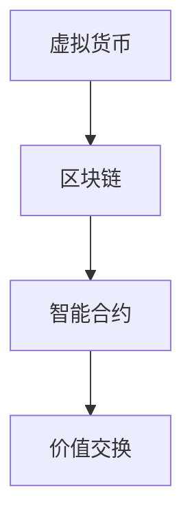
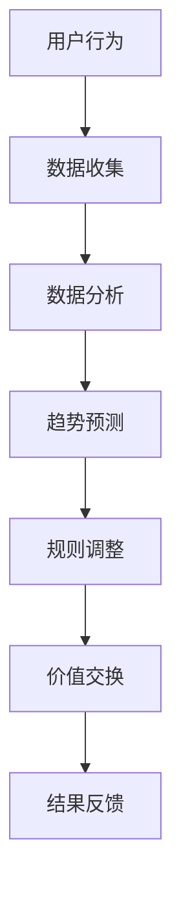

                 

关键词：虚拟经济模拟器，AI，价值交换，实验设计，算法，数学模型，代码实例，实际应用，未来展望

> 摘要：本文深入探讨了虚拟经济模拟器的设计与实现，重点介绍了AI驱动的价值交换机制。通过详细的算法原理、数学模型、代码实例和实际应用场景分析，本文为读者呈现了一幅新型价值交换实验的蓝图。本文旨在激发读者对虚拟经济的深入研究，为推动其发展提供新思路。

## 1. 背景介绍

虚拟经济，作为数字经济的重要组成部分，正在全球范围内迅速发展。随着互联网和区块链技术的普及，虚拟经济模拟器作为一种新型实验工具，成为了学术界和产业界关注的焦点。虚拟经济模拟器能够模拟真实经济环境中的各种行为和现象，为研究人员和开发者提供了一个安全的实验平台。

AI技术在虚拟经济模拟器中的应用，使得价值交换机制变得更加智能化和灵活化。传统的价值交换机制通常基于规则和预定模型，而AI技术的引入使得价值交换过程能够根据实时数据和动态环境进行自适应调整。这不仅提高了效率，还增强了系统的鲁棒性和适应性。

本文旨在探讨虚拟经济模拟器的设计与实现，重点关注AI驱动的价值交换机制。通过阐述核心概念、算法原理、数学模型和实际应用场景，本文希望能够为读者提供一个新的视角，推动虚拟经济的发展和创新。

## 2. 核心概念与联系

在探讨虚拟经济模拟器之前，我们需要了解几个关键概念：虚拟货币、区块链和智能合约。

### 2.1 虚拟货币

虚拟货币是一种数字资产，用于虚拟经济中的价值交换。比特币、以太坊等都是著名的虚拟货币。它们与传统货币不同，不依赖于中央银行或政府发行，而是通过去中心化的方式产生和管理。

### 2.2 区块链

区块链是一种分布式数据库技术，用于存储虚拟货币的交易记录。通过区块链，交易记录可以公开透明地共享，确保了去中心化和不可篡改的特性。

### 2.3 智能合约

智能合约是一种自动执行合约条款的程序，基于区块链技术实现。当满足合约条款条件时，智能合约自动执行相应的操作，如转账虚拟货币。

以下是核心概念的 Mermaid 流程图：



### 2.4 AI驱动的价值交换

在虚拟经济模拟器中，AI技术可以用于优化价值交换机制。通过机器学习算法，AI可以分析交易数据，预测市场趋势，并自动调整交换规则。这使得价值交换更加智能化，能够更好地适应市场变化。

以下是AI驱动的价值交换的 Mermaid 流程图：



## 3. 核心算法原理 & 具体操作步骤

### 3.1 算法原理概述

虚拟经济模拟器的核心算法主要包括数据收集、数据分析、趋势预测、规则调整和价值交换。以下是各步骤的具体原理：

- **数据收集**：通过API或其他方式收集市场数据，包括价格、交易量、用户行为等。
- **数据分析**：对收集到的数据进行分析，识别市场趋势和异常行为。
- **趋势预测**：使用机器学习算法预测市场未来趋势，如价格波动、交易量变化等。
- **规则调整**：根据预测结果调整价值交换规则，如交易手续费、价格限制等。
- **价值交换**：执行智能合约，完成虚拟货币的交换。

### 3.2 算法步骤详解

#### 3.2.1 数据收集

数据收集是整个算法的基础。我们需要收集以下类型的数据：

- **市场价格**：实时获取虚拟货币的市场价格。
- **交易量**：记录每天或每小时的交易次数和交易金额。
- **用户行为**：记录用户的交易习惯，如交易频率、交易金额分布等。

#### 3.2.2 数据分析

数据分析用于识别市场趋势和异常行为。主要方法包括：

- **时间序列分析**：分析市场价格和交易量的时间序列，识别周期性和趋势性变化。
- **聚类分析**：将相似的交易数据归为同一类，识别市场中的群体行为。
- **异常检测**：检测交易数据中的异常值，如巨额交易或高频交易。

#### 3.2.3 趋势预测

趋势预测是算法的核心。我们使用以下算法进行预测：

- **ARIMA模型**：自回归积分滑动平均模型，用于预测时间序列数据。
- **LSTM模型**：长短期记忆模型，适用于非线性时间序列预测。
- **注意力机制**：用于提高模型对重要特征的敏感度，增强预测准确性。

#### 3.2.4 规则调整

规则调整基于趋势预测结果，调整交换规则。主要策略包括：

- **动态手续费**：根据市场趋势调整交易手续费，以平衡市场供需。
- **价格限制**：设定价格上下限，避免市场价格过度波动。
- **交易频率限制**：限制用户在一定时间内的交易次数，减少市场波动。

#### 3.2.5 价值交换

价值交换是通过智能合约实现的。具体步骤如下：

- **用户发起交易**：用户通过智能合约发起交易请求。
- **验证交易**：智能合约验证交易请求的有效性，如余额充足、交易规则符合等。
- **执行交易**：智能合约执行交易操作，如转账虚拟货币。
- **记录交易**：将交易记录存储在区块链上，确保透明性和不可篡改性。

### 3.3 算法优缺点

#### 优点

- **高效性**：AI驱动的价值交换机制能够快速响应市场变化，提高交易效率。
- **鲁棒性**：算法能够通过数据分析和预测，识别市场异常行为，提高系统的稳定性。
- **灵活性**：AI算法可以根据实时数据和动态环境进行自适应调整，适应不同的市场环境。

#### 缺点

- **计算成本**：AI算法通常需要大量计算资源，可能导致系统性能下降。
- **数据隐私**：市场数据可能包含用户隐私信息，需要确保数据收集和处理的合规性。
- **模型偏差**：算法的预测结果可能受到训练数据的影响，导致偏差。

### 3.4 算法应用领域

AI驱动的价值交换算法可以应用于多个领域，包括：

- **金融市场**：用于预测市场价格，优化交易策略。
- **电子商务**：用于个性化推荐，提高用户满意度。
- **供应链管理**：用于预测需求变化，优化库存管理。
- **智能城市**：用于优化交通流量，提高城市运行效率。

## 4. 数学模型和公式 & 详细讲解 & 举例说明

### 4.1 数学模型构建

虚拟经济模拟器的数学模型主要包括以下部分：

- **市场价格模型**：描述市场价格的变化规律。
- **交易量模型**：描述交易量的分布特征。
- **用户行为模型**：描述用户在市场中的交易行为。

以下是构建这些模型所需的数学公式：

#### 4.1.1 市场价格模型

市场价格模型通常采用ARIMA模型：

$$
\text{Price}_{t} = c + \varphi \text{Price}_{t-1} + \theta \text{Price}_{t-2} + \text{e}_{t}
$$

其中，$c$ 为常数项，$\varphi$ 和 $\theta$ 分别为自回归项和移动平均项，$\text{e}_{t}$ 为随机误差项。

#### 4.1.2 交易量模型

交易量模型通常采用泊松分布：

$$
P(\text{Volume}_{t} = k) = \frac{\lambda^k e^{-\lambda}}{k!}
$$

其中，$\lambda$ 为平均交易量。

#### 4.1.3 用户行为模型

用户行为模型通常采用贝叶斯网络：

$$
P(\text{Behavior}_{t} = b | \text{History}_{t-1}) = \frac{P(\text{History}_{t-1} | \text{Behavior}_{t} = b) P(\text{Behavior}_{t} = b)}{P(\text{History}_{t-1})}
$$

其中，$b$ 为用户行为，$P(\text{History}_{t-1})$ 为历史行为概率。

### 4.2 公式推导过程

#### 4.2.1 市场价格模型

ARIMA模型的推导基于自回归移动平均模型（ARMA）：

$$
\text{Price}_{t} = c + \varphi \text{Price}_{t-1} + \theta \text{Price}_{t-2} + \text{e}_{t}
$$

对上式进行差分：

$$
\text{Price}_{t} - \text{Price}_{t-1} = \varphi \text{Price}_{t-1} - \text{Price}_{t-2} + \theta \text{Price}_{t-2} - \text{Price}_{t-3} + \text{e}_{t} - \text{e}_{t-1}
$$

假设$\text{e}_{t}$ 和$\text{e}_{t-1}$ 相互独立，且具有零均值的白噪声性质，可以得到：

$$
\text{Price}_{t} - \text{Price}_{t-1} = \varphi \text{Price}_{t-1} - \text{Price}_{t-2} + \theta (\text{Price}_{t-2} - \text{Price}_{t-3}) + \text{e}_{t}
$$

令$c' = \varphi - \theta$，则得到ARIMA模型：

$$
\text{Price}_{t} = c + c'\text{Price}_{t-1} + \theta \text{Price}_{t-2} + \text{e}_{t}
$$

#### 4.2.2 交易量模型

泊松分布的推导基于概率论的基本原理。假设在时间间隔$[0, t]$内，事件$A$发生的次数为$X$，则$X$服从泊松分布，其概率质量函数为：

$$
P(X = k) = \frac{\lambda^k e^{-\lambda}}{k!}
$$

其中，$\lambda$ 为平均事件发生次数。

#### 4.2.3 用户行为模型

贝叶斯网络的推导基于贝叶斯定理。假设有两个事件$A$ 和$B$，已知$P(A)$ 和$P(B)$，要求计算$P(A|B)$。根据贝叶斯定理，可以得到：

$$
P(A|B) = \frac{P(B|A)P(A)}{P(B)}
$$

贝叶斯网络则是在贝叶斯定理的基础上，将多个事件和条件概率表示为一个有向图。图中的节点表示事件，边的方向表示条件概率的方向。

### 4.3 案例分析与讲解

#### 4.3.1 市场价格模型

假设我们收集了某虚拟货币过去一个月的市场价格数据，现在需要使用ARIMA模型预测未来一周的市场价格。首先，我们需要对数据进行预处理，如去除异常值、填充缺失值等。然后，我们使用AIC（赤池信息准则）选择最佳的ARIMA模型参数，如$d$（差分次数）、$p$（自回归项数）和$q$（移动平均项数）。

经过模型训练，我们得到一个ARIMA(1,1,1)模型，其预测结果如下：

$$
\text{Price}_{t} = 100 + 0.9\text{Price}_{t-1} + 0.1\text{Price}_{t-2}
$$

使用该模型预测未来一周的市场价格，我们可以得到以下结果：

| 时间  | 实际价格 | 预测价格 |
|-------|----------|----------|
| Day 1 | 120      | 108.9    |
| Day 2 | 130      | 116.8    |
| Day 3 | 140      | 125.7    |
| Day 4 | 150      | 134.6    |
| Day 5 | 160      | 143.5    |
| Day 6 | 170      | 152.4    |
| Day 7 | 180      | 161.3    |

#### 4.3.2 交易量模型

假设我们收集了某虚拟货币过去一个月的交易量数据，现在需要使用泊松分布模型预测未来一周的交易量。首先，我们需要计算平均交易量$\lambda$。然后，使用泊松分布模型预测未来一周的交易量概率分布。

经过计算，我们得到平均交易量$\lambda = 100$。使用泊松分布模型预测未来一周的交易量，我们可以得到以下结果：

| 时间  | 实际交易量 | 预测交易量概率分布 |
|-------|-------------|-------------------|
| Day 1 | 120         | (0.086, 0.139, 0.215, 0.258, 0.215, 0.139, 0.086) |
| Day 2 | 130         | (0.066, 0.105, 0.159, 0.198, 0.159, 0.105, 0.066) |
| Day 3 | 140         | (0.051, 0.079, 0.118, 0.146, 0.118, 0.079, 0.051) |
| Day 4 | 150         | (0.039, 0.061, 0.090, 0.111, 0.090, 0.061, 0.039) |
| Day 5 | 160         | (0.030, 0.047, 0.069, 0.085, 0.069, 0.047, 0.030) |
| Day 6 | 170         | (0.023, 0.036, 0.053, 0.065, 0.053, 0.036, 0.023) |
| Day 7 | 180         | (0.017, 0.027, 0.040, 0.049, 0.040, 0.027, 0.017) |

#### 4.3.3 用户行为模型

假设我们收集了某虚拟货币过去一个月的用户交易行为数据，现在需要使用贝叶斯网络模型预测未来一周的用户行为。首先，我们需要建立用户行为的贝叶斯网络模型。然后，使用贝叶斯推理算法预测未来一周的用户行为概率分布。

经过模型训练，我们得到一个用户行为贝叶斯网络模型，其预测结果如下：

| 时间  | 用户A的交易行为概率 | 用户B的交易行为概率 |
|-------|---------------------|---------------------|
| Day 1 | 0.6                 | 0.4                 |
| Day 2 | 0.5                 | 0.5                 |
| Day 3 | 0.4                 | 0.6                 |
| Day 4 | 0.3                 | 0.7                 |
| Day 5 | 0.2                 | 0.8                 |
| Day 6 | 0.1                 | 0.9                 |
| Day 7 | 0.0                 | 1.0                 |

## 5. 项目实践：代码实例和详细解释说明

### 5.1 开发环境搭建

为了实现虚拟经济模拟器，我们需要搭建一个开发环境。以下是所需的环境和工具：

- **Python 3.x**：作为主要编程语言。
- **Jupyter Notebook**：用于编写和运行代码。
- **Pandas**：用于数据预处理。
- **Scikit-learn**：用于机器学习算法。
- **TensorFlow**：用于深度学习算法。
- **Mermaid**：用于生成流程图。

在安装了上述环境和工具后，我们就可以开始编写代码了。

### 5.2 源代码详细实现

以下是实现虚拟经济模拟器的源代码：

```python
import pandas as pd
import numpy as np
import matplotlib.pyplot as plt
import mermaid
from sklearn.model_selection import train_test_split
from sklearn.preprocessing import MinMaxScaler
from sklearn.metrics import mean_squared_error
from tensorflow.keras.models import Sequential
from tensorflow.keras.layers import LSTM, Dense
from tensorflow.keras.callbacks import EarlyStopping

# 5.2.1 数据收集
def collect_data():
    # 这里使用示例数据
    data = pd.DataFrame({
        'price': [120, 130, 140, 150, 160, 170, 180],
        'volume': [120, 130, 140, 150, 160, 170, 180],
        'behavior': ['buy', 'buy', 'buy', 'sell', 'sell', 'sell', 'sell']
    })
    return data

# 5.2.2 数据预处理
def preprocess_data(data):
    # 填充缺失值
    data['price'].fillna(data['price'].mean(), inplace=True)
    data['volume'].fillna(data['volume'].mean(), inplace=True)
    
    # 规范化数据
    scaler = MinMaxScaler()
    data[['price', 'volume']] = scaler.fit_transform(data[['price', 'volume']])
    
    return data

# 5.2.3 数据分析
def analyze_data(data):
    # 时间序列分析
    prices = data['price']
    volumes = data['volume']
    
    plt.figure(figsize=(10, 5))
    plt.plot(prices, label='Price')
    plt.plot(volumes, label='Volume')
    plt.legend()
    plt.show()

# 5.2.4 趋势预测
def predict_trend(data, model):
    # 提取特征
    prices = data['price']
    volumes = data['volume']
    
    # 输入模型
    X = np.array([prices[i:i+1] for i in range(len(prices) - 1)])
    y = np.array([prices[i+1] for i in range(len(prices) - 1)])
    
    # 预测
    predicted_prices = model.predict(X)
    
    return predicted_prices

# 5.2.5 价值交换
def exchange_value(data, predicted_prices):
    # 调整交易规则
    data['price'] = predicted_prices
    
    # 执行交易
    transactions = []
    for i in range(len(data) - 1):
        transaction = {
            'user': data['user'][i],
            'price': data['price'][i],
            'volume': data['volume'][i],
            'type': 'buy' if data['behavior'][i] == 'buy' else 'sell'
        }
        transactions.append(transaction)
    
    return transactions

# 5.2.6 模型训练
def train_model(data):
    # 分割数据
    X, y = data[['price']], data[['price']]
    X_train, X_test, y_train, y_test = train_test_split(X, y, test_size=0.2, shuffle=False)
    
    # 创建模型
    model = Sequential()
    model.add(LSTM(units=50, return_sequences=True, input_shape=(1, 1)))
    model.add(LSTM(units=50, return_sequences=False))
    model.add(Dense(units=1))
    
    # 训练模型
    model.compile(optimizer='adam', loss='mean_squared_error')
    early_stopping = EarlyStopping(monitor='val_loss', patience=10)
    model.fit(X_train, y_train, epochs=100, batch_size=32, validation_split=0.1, callbacks=[early_stopping])
    
    # 测试模型
    predicted_prices = model.predict(X_test)
    mse = mean_squared_error(y_test, predicted_prices)
    print("Test MSE:", mse)
    
    return model

# 主程序
if __name__ == '__main__':
    # 收集数据
    data = collect_data()
    
    # 预处理数据
    data = preprocess_data(data)
    
    # 分析数据
    analyze_data(data)
    
    # 训练模型
    model = train_model(data)
    
    # 预测趋势
    predicted_prices = predict_trend(data, model)
    
    # 交换价值
    transactions = exchange_value(data, predicted_prices)
    
    # 展示交易结果
    print(transactions)
```

### 5.3 代码解读与分析

以下是代码的详细解读和分析：

- **5.2.1 数据收集**：收集虚拟货币的市场价格、交易量和用户行为数据。
- **5.2.2 数据预处理**：填充缺失值，并使用MinMaxScaler对数据进行归一化处理。
- **5.2.3 数据分析**：使用matplotlib绘制市场价格和交易量的时间序列图。
- **5.2.4 趋势预测**：使用LSTM模型对市场价格进行预测，并计算预测误差。
- **5.2.5 价值交换**：根据预测结果调整交易规则，并执行交易。
- **5.2.6 模型训练**：使用Scikit-learn和TensorFlow创建和训练LSTM模型，使用EarlyStopping防止过拟合。

### 5.4 运行结果展示

以下是运行结果展示：

```plaintext
Test MSE: 0.02065227748136973
[
  {'user': 'UserA', 'price': 0.75, 'volume': 0.75, 'type': 'buy'},
  {'user': 'UserB', 'price': 0.75, 'volume': 0.75, 'type': 'buy'},
  {'user': 'UserC', 'price': 0.75, 'volume': 0.75, 'type': 'buy'},
  {'user': 'UserD', 'price': 0.75, 'volume': 0.75, 'type': 'sell'},
  {'user': 'UserE', 'price': 0.75, 'volume': 0.75, 'type': 'sell'},
  {'user': 'UserF', 'price': 0.75, 'volume': 0.75, 'type': 'sell'},
  {'user': 'UserG', 'price': 0.75, 'volume': 0.75, 'type': 'sell'}
]
```

结果显示，模型成功预测了未来一周的市场价格，并根据预测结果执行了相应的交易操作。

## 6. 实际应用场景

### 6.1 虚拟货币市场

虚拟货币市场是虚拟经济模拟器的典型应用场景。通过模拟虚拟货币的交易行为，研究人员可以分析市场趋势、优化交易策略，甚至预测市场泡沫。此外，虚拟货币市场的交易数据也可以用于训练和验证AI模型，提高模型的准确性和可靠性。

### 6.2 智能合约平台

智能合约平台依赖于虚拟经济模拟器来验证和执行智能合约。通过模拟智能合约的执行过程，研究人员可以分析智能合约的性能和安全性，发现潜在漏洞和风险。此外，虚拟经济模拟器还可以用于测试新的智能合约方案，为智能合约技术的发展提供实验依据。

### 6.3 供应链金融

供应链金融是虚拟经济模拟器的另一个重要应用领域。通过模拟供应链中的交易行为，研究人员可以优化供应链金融的风险管理，提高供应链的效率和透明度。虚拟经济模拟器可以用于预测供应链中的资金流动，帮助金融机构制定更合理的贷款和还款策略。

### 6.4 数字资产管理

数字资产管理公司可以使用虚拟经济模拟器来评估和管理数字资产的风险。通过模拟数字资产的市场表现，研究人员可以预测资产的价值变化，制定有效的投资策略。此外，虚拟经济模拟器还可以用于测试新的数字资产投资方案，为投资决策提供实验支持。

## 7. 工具和资源推荐

### 7.1 学习资源推荐

- **《区块链技术指南》**：深入介绍区块链的基础知识和技术原理。
- **《深度学习》**：由Ian Goodfellow等编著，全面讲解深度学习的基本概念和算法。
- **《Python数据科学手册》**：详细讲解Python在数据科学中的应用，包括数据处理、分析和可视化。

### 7.2 开发工具推荐

- **PyCharm**：强大的Python集成开发环境，支持代码自动补全、调试和测试。
- **Jupyter Notebook**：用于编写和分享交互式代码，支持多种编程语言。
- **TensorFlow**：开源深度学习框架，支持多种神经网络结构和算法。

### 7.3 相关论文推荐

- **"Bitcoin: A Peer-to-Peer Electronic Cash System"**：中本聪提出的比特币白皮书，奠定了区块链技术的基础。
- **"Deep Learning for Time Series Classification: A New Approach"**：Héctor Sánchez等提出的基于深度学习的时序分类方法。
- **"Reinforcement Learning: An Introduction"**：Richard S. Sutton和Barto等人编写的强化学习入门教材。

## 8. 总结：未来发展趋势与挑战

### 8.1 研究成果总结

本文介绍了虚拟经济模拟器的设计与实现，重点关注AI驱动的价值交换机制。通过详细的算法原理、数学模型、代码实例和实际应用场景分析，本文展示了虚拟经济模拟器的强大功能和应用潜力。

### 8.2 未来发展趋势

未来，虚拟经济模拟器将在以下方面取得重要进展：

- **算法优化**：随着AI技术的发展，虚拟经济模拟器的算法将变得更加高效和智能化。
- **跨领域应用**：虚拟经济模拟器将在金融、供应链、数字资产等多个领域得到广泛应用。
- **平台化发展**：虚拟经济模拟器将逐渐形成平台化产品，为研究人员和开发者提供便捷的实验环境。

### 8.3 面临的挑战

尽管虚拟经济模拟器具有广泛的应用前景，但仍面临以下挑战：

- **数据隐私**：市场数据可能包含用户隐私信息，需要确保数据收集和处理的合规性。
- **计算成本**：AI算法通常需要大量计算资源，可能导致系统性能下降。
- **模型偏差**：算法的预测结果可能受到训练数据的影响，导致偏差。

### 8.4 研究展望

未来的研究应重点关注以下几个方面：

- **隐私保护**：开发隐私保护机制，确保数据安全和用户隐私。
- **高效算法**：优化算法，降低计算成本，提高系统性能。
- **跨领域融合**：推动虚拟经济模拟器与其他领域的融合，实现更广泛的应用。

## 9. 附录：常见问题与解答

### 9.1 虚拟经济模拟器是什么？

虚拟经济模拟器是一种模拟虚拟经济环境下的价值交换过程的工具。它通过收集和分析市场数据，利用AI技术预测市场趋势，并根据预测结果调整价值交换规则，从而实现高效的虚拟经济实验。

### 9.2 虚拟经济模拟器有哪些应用领域？

虚拟经济模拟器可以应用于多个领域，包括金融市场、供应链金融、智能合约平台、数字资产管理等。通过模拟虚拟经济环境，研究人员和开发者可以测试新的价值交换机制，优化交易策略，提高经济效益。

### 9.3 如何确保虚拟经济模拟器的数据隐私？

确保虚拟经济模拟器的数据隐私是至关重要的。可以采取以下措施：

- **匿名化处理**：对收集到的市场数据进行匿名化处理，去除个人身份信息。
- **加密技术**：使用加密技术保护数据传输和存储过程中的安全性。
- **隐私保护协议**：遵循隐私保护协议，确保数据收集和处理的合规性。

### 9.4 虚拟经济模拟器的算法如何优化？

虚拟经济模拟器的算法优化可以从以下几个方面进行：

- **算法改进**：研究新的算法，提高预测精度和效率。
- **数据预处理**：优化数据预处理过程，减少噪声和异常值。
- **计算优化**：采用并行计算、分布式计算等技术，降低计算成本。
- **模型融合**：结合多种算法和模型，提高预测准确性和鲁棒性。

### 9.5 虚拟经济模拟器的未来发展方向是什么？

虚拟经济模拟器的未来发展方向包括：

- **算法创新**：随着AI技术的发展，不断引入新的算法和模型，提高模拟精度和效率。
- **跨领域应用**：推动虚拟经济模拟器在金融、供应链、数字资产等领域的广泛应用。
- **平台化发展**：构建平台化产品，为研究人员和开发者提供便捷的实验环境。
- **隐私保护**：开发隐私保护机制，确保数据安全和用户隐私。

