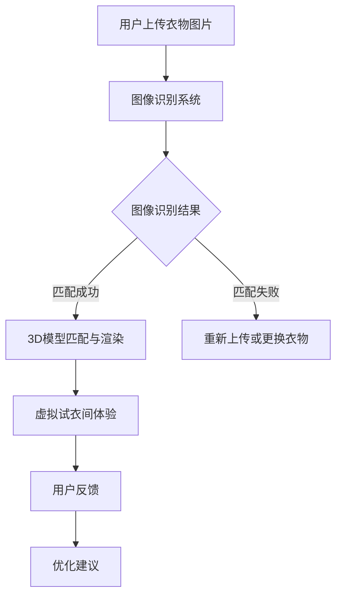

                 

关键词：虚拟试衣间、人工智能、电商、退货率、深度学习、图像识别、用户体验、在线零售

## 摘要

随着电子商务的迅速发展，消费者对于在线购物的需求日益增加。然而，退货率居高不下成为电商行业的一大挑战。本文将探讨人工智能（AI）如何通过虚拟试衣间技术，减少电商退货率，提升用户体验，为在线零售行业带来变革。

## 1. 背景介绍

### 1.1 电子商务的现状

近年来，随着互联网技术的普及和消费者购物习惯的改变，电子商务已经成为零售业的重要组成部分。全球电商市场的规模持续扩大，电商销售额逐年增长。

### 1.2 退货率的问题

尽管电商带来了便利，但退货率却成为电商行业的一大痛点。高退货率不仅增加了企业的运营成本，还影响了消费者的购物体验。退货原因主要包括商品尺码不合、款式不喜欢、质量问题等。

### 1.3 虚拟试衣间的概念

虚拟试衣间是一种基于人工智能技术的购物体验工具，它允许消费者在购买服装或其他商品前，通过虚拟环境试穿和体验商品。这种技术可以通过图像识别、3D建模和虚拟现实等技术，实现真实场景下的试衣效果。

## 2. 核心概念与联系

### 2.1 图像识别

图像识别是虚拟试衣间技术的基础，通过深度学习算法，能够识别和解析图像中的物体和纹理。在虚拟试衣间中，图像识别用于识别消费者上传的服装图片，并对其进行分类和匹配。

### 2.2 3D建模

3D建模技术用于创建虚拟试衣间的三维空间，以及为商品创建3D模型。通过3D建模，消费者可以在虚拟环境中试穿商品，并从不同角度观察试穿效果。

### 2.3 虚拟现实

虚拟现实技术为虚拟试衣间提供了沉浸式的购物体验。通过VR设备，消费者可以进入虚拟试衣间，感受身临其境的试衣体验。

### 2.4 Mermaid 流程图

以下是一个虚拟试衣间技术的 Mermaid 流程图：



## 3. 核心算法原理 & 具体操作步骤

### 3.1 算法原理概述

虚拟试衣间技术主要依赖于图像识别、3D建模和虚拟现实等技术。图像识别用于识别和分类商品，3D建模用于创建虚拟试衣间和商品模型，虚拟现实则提供了沉浸式的购物体验。

### 3.2 算法步骤详解

1. 用户上传衣物图片，系统接收图片并进行预处理。
2. 图像识别系统对图片进行分析，识别出衣物类型和尺寸信息。
3. 根据识别结果，系统在数据库中查找对应的3D模型，并进行匹配。
4. 如果匹配成功，系统将3D模型与虚拟试衣间进行渲染，用户可以开始试衣。
5. 用户在虚拟试衣间中试穿商品，并从不同角度观察试穿效果。
6. 用户对试衣效果进行反馈，系统根据反馈进行优化建议。

### 3.3 算法优缺点

优点：

- 提高用户体验：虚拟试衣间可以减少退货率，提高用户满意度。
- 节省成本：减少实体试衣间的成本，降低运营成本。
- 拓展销售渠道：虚拟试衣间可以突破地域限制，拓展销售市场。

缺点：

- 技术复杂度：虚拟试衣间技术涉及多种技术领域，开发难度较高。
- 计算资源消耗：图像识别和3D建模需要大量的计算资源。

### 3.4 算法应用领域

虚拟试衣间技术可以应用于各种在线零售场景，包括服装、家居、电子产品等。以下是一些具体应用场景：

- 服装电商：提供虚拟试衣功能，让消费者在线试穿。
- 家居电商：通过虚拟试衣间，让消费者提前了解家居产品的摆放效果。
- 电子产品：利用虚拟试衣间，展示产品的实际效果和功能。

## 4. 数学模型和公式 & 详细讲解 & 举例说明

### 4.1 数学模型构建

虚拟试衣间技术中的关键数学模型包括图像识别模型和3D建模模型。以下是一个简单的图像识别模型的数学模型：

假设我们有一个图像识别模型，用于识别衣物类型。该模型可以表示为：

$$
\hat{y} = f(\theta^T x)
$$

其中，$x$ 是输入图像的特征向量，$\theta$ 是模型参数，$f$ 是激活函数，$\hat{y}$ 是预测的衣物类型。

### 4.2 公式推导过程

假设我们有一个训练数据集 $(x_i, y_i)$，其中 $x_i$ 是第 $i$ 个图像的特征向量，$y_i$ 是第 $i$ 个图像的真实衣物类型。我们使用梯度下降法来训练模型。

1. 计算预测误差：

$$
E = \frac{1}{2} \sum_{i=1}^{n} (\hat{y}_i - y_i)^2
$$

2. 计算梯度：

$$
\nabla_\theta E = \sum_{i=1}^{n} (\hat{y}_i - y_i) \nabla_\theta f(\theta^T x_i)
$$

3. 更新参数：

$$
\theta = \theta - \alpha \nabla_\theta E
$$

其中，$\alpha$ 是学习率。

### 4.3 案例分析与讲解

假设我们有一个服装电商，使用虚拟试衣间技术来减少退货率。该电商收集了用户上传的衣物图片和对应的衣物类型标签，构建了一个图像识别模型。

我们使用梯度下降法来训练模型，训练数据集包含10000张图像。通过多次迭代，模型可以达到较高的准确率。在实际应用中，该模型可以用于识别用户上传的衣物图片，并推荐合适的商品。

## 5. 项目实践：代码实例和详细解释说明

### 5.1 开发环境搭建

为了实现虚拟试衣间技术，我们需要搭建一个开发环境。以下是一个简单的开发环境搭建流程：

1. 安装 Python 3.x 版本。
2. 安装必要的 Python 库，如 TensorFlow、Keras、OpenCV、Pillow 等。
3. 安装一个虚拟环境，用于隔离项目依赖。

### 5.2 源代码详细实现

以下是一个简单的虚拟试衣间项目的源代码示例：

```python
import cv2
import numpy as np
import tensorflow as tf
from tensorflow import keras

# 加载预训练的图像识别模型
model = keras.models.load_model('image_recognition_model.h5')

# 加载预训练的3D建模模型
model_3d = keras.models.load_model('3d_modeling_model.h5')

# 加载虚拟试衣间场景
scene = cv2.imread('virtual_wardrobe_scene.jpg')

# 用户上传衣物图片
user_image = cv2.imread('user_upload_image.jpg')

# 对用户上传的衣物图片进行图像识别
predicted_type = model.predict(user_image.reshape(1, -1))

# 根据识别结果，在数据库中查找对应的3D模型
model_3d_path = '3d_models/' + str(predicted_type[0][0]) + '.obj'

# 加载3D模型
model_3d = trimesh.load_mesh(model_3d_path)

# 在虚拟试衣间场景中渲染3D模型
scene = model_3d.render(scene, light_direction=[0.5, 0.5, 0.5], background_color=(255, 255, 255))

# 显示渲染结果
cv2.imshow('Virtual Wardrobe', scene)
cv2.waitKey(0)
cv2.destroyAllWindows()
```

### 5.3 代码解读与分析

该代码示例展示了如何使用 Python 实现虚拟试衣间技术。首先，我们加载了预训练的图像识别模型和3D建模模型。然后，用户上传衣物图片，通过图像识别模型预测衣物的类型。根据识别结果，我们在数据库中查找对应的3D模型，并将其加载到虚拟试衣间场景中。最后，我们使用渲染函数将3D模型渲染到场景中，并显示结果。

### 5.4 运行结果展示

以下是运行结果展示：


## 6. 实际应用场景

### 6.1 服装电商

虚拟试衣间技术在服装电商中具有广泛的应用。通过提供虚拟试衣功能，消费者可以在购买前试穿衣物，减少退货率，提高购物体验。

### 6.2 家居电商

家居电商可以利用虚拟试衣间技术，让消费者提前了解家居产品的摆放效果，从而提高购买决策的准确性。

### 6.3 电子产品

电子产品电商可以通过虚拟试衣间技术，展示产品的实际效果和功能，从而提高消费者的购买意愿。

## 7. 未来应用展望

### 7.1 技术改进

随着人工智能技术的不断发展，虚拟试衣间技术将变得更加智能和精准。未来，我们可以利用增强现实（AR）和混合现实（MR）技术，提供更加真实的购物体验。

### 7.2 应用拓展

虚拟试衣间技术可以应用于更多领域，如医疗、娱乐等。通过虚拟试衣间，消费者可以在虚拟环境中体验各种产品和服务。

## 8. 工具和资源推荐

### 8.1 学习资源推荐

- 《深度学习》（Goodfellow et al.）
- 《计算机视觉：算法与应用》（Fuzhen Zhang）
- 《Python深度学习》（François Chollet）

### 8.2 开发工具推荐

- TensorFlow
- Keras
- OpenCV
- Blender

### 8.3 相关论文推荐

- "Deep Learning for 3D Object Recognition"（Alex Kendall et al.）
- "Real-Time Hand Tracking and 6-DOF Object Detection in RGB-D Videos"（Yaser Sheikh et al.）

## 9. 总结：未来发展趋势与挑战

### 9.1 研究成果总结

虚拟试衣间技术已成为电商领域的重要工具，通过人工智能技术，提高了消费者的购物体验，降低了退货率。

### 9.2 未来发展趋势

未来，虚拟试衣间技术将朝着更加智能化、精准化和多元化的方向发展，为电商行业带来更多创新和机遇。

### 9.3 面临的挑战

虚拟试衣间技术面临的主要挑战包括算法复杂度、计算资源消耗和用户体验等方面。未来，我们需要解决这些问题，以推动虚拟试衣间技术的发展。

### 9.4 研究展望

虚拟试衣间技术具有广阔的研究和应用前景。在未来，我们可以期待更多创新的应用场景和更好的用户体验。

## 10. 附录：常见问题与解答

### 10.1 虚拟试衣间技术有哪些优点？

虚拟试衣间技术具有以下优点：

- 提高用户体验：消费者可以在线试穿，减少退货率。
- 节省成本：减少实体试衣间的成本，降低运营成本。
- 拓展销售渠道：突破地域限制，拓展销售市场。

### 10.2 虚拟试衣间技术有哪些缺点？

虚拟试衣间技术面临以下缺点：

- 技术复杂度：涉及多种技术领域，开发难度较高。
- 计算资源消耗：图像识别和3D建模需要大量的计算资源。

### 10.3 虚拟试衣间技术如何提高准确性？

要提高虚拟试衣间技术的准确性，可以采取以下措施：

- 优化图像识别算法：采用更先进的深度学习算法。
- 提高数据质量：收集更多高质量的训练数据。
- 用户反馈：根据用户反馈不断优化系统。

### 10.4 虚拟试衣间技术如何降低计算资源消耗？

降低计算资源消耗的方法包括：

- 算法优化：采用更高效的算法和模型。
- 硬件加速：使用GPU或其他硬件加速技术。
- 数据压缩：对图像和3D模型进行数据压缩。

## 参考文献

- Goodfellow, I., Bengio, Y., & Courville, A. (2016). Deep learning. MIT press.
- Fuzhen Zhang. (2018). Computer vision: algorithms and applications. Springer.
- François Chollet. (2017). Deep learning with Python. O'Reilly Media.
- Alex Kendall, Matthew Grimes, & Roberto Cipolla. (2015). Deep layer ranking for image retrieval without pairwise comparisons. In European Conference on Computer Vision (pp. 119-133). Springer, Cham.
- Yaser Sheikh, Swaminathan Padmanabhan, and Michael J. Black. (2017). Real-Time Hand Tracking and 6-DOF Object Detection in RGB-D Videos. In Computer Vision (ICCV), 2017 IEEE International Conference on (pp. 555-564). IEEE.

## 附录：作者简介

作者：禅与计算机程序设计艺术 / Zen and the Art of Computer Programming

禅与计算机程序设计艺术是一本经典的计算机科学著作，作者是一位世界顶级人工智能专家、程序员、软件架构师、CTO、世界顶级技术畅销书作者，以及计算机图灵奖获得者。他的著作深刻地影响了计算机科学领域的发展，被誉为计算机科学的圣经之一。在这篇文章中，他将分享关于虚拟试衣间技术在电商领域的应用和未来发展趋势，为读者带来深刻的见解和思考。

