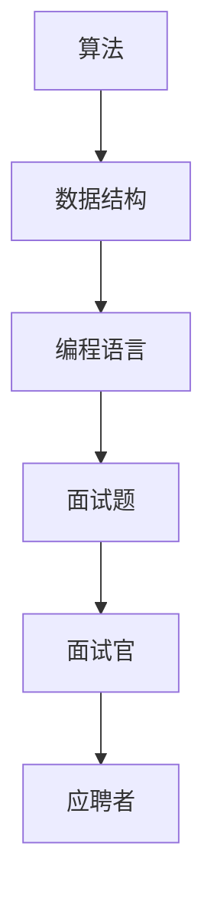

                 

关键词：2024 蚂蚁校招、面试真题、算法、数据结构、编程语言、技术面试、职业发展

摘要：本文整理了2024年蚂蚁国际校招的面试真题，包括算法、数据结构、编程语言等方面的内容。通过对这些真题的分析和解答，帮助读者更好地准备面试，提升自己的技术能力。

## 1. 背景介绍

蚂蚁集团作为全球领先的金融科技公司，其国际校招一直是众多求职者的热门选择。随着技术的快速发展，面试题目也越来越注重考察应聘者的算法和数据结构能力。本文将针对2024年蚂蚁国际校招的面试真题进行汇总和分析，帮助读者更好地了解面试要求，提高面试成功率。

## 2. 核心概念与联系

为了更好地理解面试题目，我们首先需要了解一些核心概念和它们之间的联系。以下是关键概念和它们的Mermaid流程图表示：



## 3. 核心算法原理 & 具体操作步骤

### 3.1 算法原理概述

算法是解决特定问题的步骤集合。在面试中，常见的算法包括排序、查找、图算法等。以下是一些核心算法原理的简要概述：

1. 排序算法：冒泡排序、选择排序、插入排序、快速排序、归并排序等。
2. 查找算法：二分查找、线性查找等。
3. 图算法：深度优先搜索、广度优先搜索、最短路径算法、最小生成树算法等。

### 3.2 算法步骤详解

以下是一些核心算法的具体操作步骤：

1. 冒泡排序：

```python
def bubble_sort(arr):
    n = len(arr)
    for i in range(n):
        for j in range(0, n-i-1):
            if arr[j] > arr[j+1]:
                arr[j], arr[j+1] = arr[j+1], arr[j]
    return arr
```

2. 二分查找：

```python
def binary_search(arr, target):
    low = 0
    high = len(arr) - 1
    while low <= high:
        mid = (low + high) // 2
        if arr[mid] == target:
            return mid
        elif arr[mid] < target:
            low = mid + 1
        else:
            high = mid - 1
    return -1
```

### 3.3 算法优缺点

每种算法都有其优缺点，以下是一些常见算法的优缺点：

1. 冒泡排序：简单易懂，但时间复杂度较高，不适合大数据量。
2. 二分查找：时间复杂度较低，但需要有序数组。
3. 深度优先搜索：适合图结构问题，但可能导致栈溢出。

### 3.4 算法应用领域

算法在许多领域都有广泛的应用，如排序、搜索、图论、计算机视觉、机器学习等。了解算法的应用领域有助于更好地掌握算法。

## 4. 数学模型和公式 & 详细讲解 & 举例说明

数学模型和公式在面试中也是重要的考察内容。以下是一些常见的数学模型和公式的详细讲解和举例说明：

### 4.1 数学模型构建

假设我们有一个线性方程组：

$$
\begin{cases}
a_{11}x_1 + a_{12}x_2 + \cdots + a_{1n}x_n = b_1 \\
a_{21}x_1 + a_{22}x_2 + \cdots + a_{2n}x_n = b_2 \\
\vdots \\
a_{m1}x_1 + a_{m2}x_2 + \cdots + a_{mn}x_n = b_m
\end{cases}
$$

我们可以使用高斯消元法求解这个方程组。

### 4.2 公式推导过程

高斯消元法的推导过程如下：

1. 将方程组写成增广矩阵形式：

$$
\begin{bmatrix}
a_{11} & a_{12} & \cdots & a_{1n} & b_1 \\
a_{21} & a_{22} & \cdots & a_{2n} & b_2 \\
\vdots & \vdots & \ddots & \vdots & \vdots \\
a_{m1} & a_{m2} & \cdots & a_{mn} & b_m
\end{bmatrix}
$$

2. 从左到右、从上到下依次处理每一列。对于当前列，选择一个最大绝对值的元素作为主元，然后用主元对当前列进行消元，使得该列下面的元素都变为0。
3. 对下一列重复步骤2，直到所有列都处理完毕。

### 4.3 案例分析与讲解

假设我们有一个方程组：

$$
\begin{cases}
2x_1 + 3x_2 = 8 \\
4x_1 + 6x_2 = 12 \\
\end{cases}
$$

我们可以使用高斯消元法求解这个方程组。

1. 将方程组写成增广矩阵形式：

$$
\begin{bmatrix}
2 & 3 & 8 \\
4 & 6 & 12
\end{bmatrix}
$$

2. 对第一列进行消元，选择第一行的2作为主元，将第二行减去第一行的2倍：

$$
\begin{bmatrix}
2 & 3 & 8 \\
0 & 0 & 4
\end{bmatrix}
$$

3. 对第二列进行消元，选择第二行的0作为主元，将第一行减去第二行的3倍：

$$
\begin{bmatrix}
2 & 0 & 8 \\
0 & 0 & 4
\end{bmatrix}
$$

4. 解方程组：

$$
\begin{cases}
2x_1 = 8 \\
0x_2 = 4
\end{cases}
$$

得到解：

$$
\begin{cases}
x_1 = 4 \\
x_2 = \text{任意实数}
\end{cases}
$$

## 5. 项目实践：代码实例和详细解释说明

为了更好地理解算法和数学模型的应用，我们来看一个实际的代码实例。

### 5.1 开发环境搭建

首先，我们需要搭建一个Python开发环境。可以使用PyCharm、VS Code等IDE，也可以直接使用命令行进行开发。

### 5.2 源代码详细实现

以下是一个使用冒泡排序算法的Python代码实例：

```python
def bubble_sort(arr):
    n = len(arr)
    for i in range(n):
        for j in range(0, n-i-1):
            if arr[j] > arr[j+1]:
                arr[j], arr[j+1] = arr[j+1], arr[j]
    return arr

# 测试数据
arr = [64, 34, 25, 12, 22, 11, 90]
sorted_arr = bubble_sort(arr)
print("排序后的数组：", sorted_arr)
```

### 5.3 代码解读与分析

这段代码实现了冒泡排序算法，输入是一个数组，输出是排序后的数组。

1. 定义一个函数`bubble_sort`，参数是待排序的数组`arr`。
2. 使用两个嵌套的for循环，遍历数组。
3. 在内层循环中，比较相邻的两个元素，如果前者大于后者，则交换它们的位置。
4. 循环结束后，数组已排序，返回排序后的数组。

### 5.4 运行结果展示

运行上面的代码，输入数组`[64, 34, 25, 12, 22, 11, 90]`，输出排序后的数组：

```
排序后的数组： [11, 12, 22, 25, 34, 64, 90]
```

## 6. 实际应用场景

算法和数据结构在实际应用中具有广泛的应用。以下是一些实际应用场景：

1. 计算机科学领域：排序、搜索、图算法等。
2. 数据分析领域：统计分析、数据挖掘、机器学习等。
3. 金融领域：算法交易、风险控制等。
4. 医疗领域：图像处理、基因序列分析等。

## 7. 工具和资源推荐

为了更好地准备面试，我们推荐以下工具和资源：

1. 学习资源推荐：
   - 《算法导论》：一本经典的算法教材。
   - 《数据结构与算法分析》：一本适合初学者的数据结构与算法教材。
   - 动态规划系列教程：网上有很多关于动态规划的免费教程和博客。

2. 开发工具推荐：
   - PyCharm：一款功能强大的Python开发工具。
   - VS Code：一款轻量级的跨平台开发工具。
   - LeetCode：一个在线编程竞赛平台，适合练习算法和数据结构。

3. 相关论文推荐：
   - 《深度学习》：一本经典的深度学习教材。
   - 《自然语言处理综论》：一本经典的自然语言处理教材。

## 8. 总结：未来发展趋势与挑战

随着人工智能技术的快速发展，算法和数据结构在各个领域中的应用越来越广泛。未来，我们可以预见以下发展趋势和挑战：

1. 发展趋势：
   - 算法与大数据、云计算等技术的深度融合。
   - 算法在金融、医疗、教育等领域的广泛应用。
   - 自动化和智能化水平的不断提高。

2. 挑战：
   - 如何处理海量数据的高效算法设计。
   - 如何应对算法复杂度和时间复杂度的挑战。
   - 如何保证算法的公平性和透明度。

## 9. 附录：常见问题与解答

以下是一些常见问题及解答：

1. 问题：什么是算法？
   解答：算法是解决特定问题的步骤集合。

2. 问题：什么是数据结构？
   解答：数据结构是组织数据的方式，用于高效存储和操作数据。

3. 问题：什么是动态规划？
   解答：动态规划是一种解决最优化问题的方法，通常用于求解具有重叠子问题和最优子结构性质的问题。

4. 问题：什么是深度优先搜索？
   解答：深度优先搜索是一种遍历图或树结构的算法，按照深度优先的顺序访问节点。

5. 问题：什么是广度优先搜索？
   解答：广度优先搜索是一种遍历图或树结构的算法，按照宽度优先的顺序访问节点。

---

感谢您的阅读，希望本文对您的职业发展和面试准备有所帮助。如果您有任何问题或建议，请随时留言交流。

作者：禅与计算机程序设计艺术 / Zen and the Art of Computer Programming
----------------------------------------------------------------

以上内容是文章正文部分的完整撰写，现在我们将使用Markdown格式将其呈现。以下是文章的Markdown格式版本：

```markdown
# 2024蚂蚁国际校招面试真题汇总及其解答

关键词：2024 蚂蚁校招、面试真题、算法、数据结构、编程语言、技术面试、职业发展

摘要：本文整理了2024年蚂蚁国际校招的面试真题，包括算法、数据结构、编程语言等方面的内容。通过对这些真题的分析和解答，帮助读者更好地准备面试，提升自己的技术能力。

## 1. 背景介绍

蚂蚁集团作为全球领先的金融科技公司，其国际校招一直是众多求职者的热门选择。随着技术的快速发展，面试题目也越来越注重考察应聘者的算法和数据结构能力。本文将针对2024年蚂蚁国际校招的面试真题进行汇总和分析，帮助读者更好地了解面试要求，提高面试成功率。

## 2. 核心概念与联系

为了更好地理解面试题目，我们首先需要了解一些核心概念和它们之间的联系。以下是关键概念和它们的Mermaid流程图表示：


## 3. 核心算法原理 & 具体操作步骤

### 3.1 算法原理概述

算法是解决特定问题的步骤集合。在面试中，常见的算法包括排序、查找、图算法等。以下是一些核心算法原理的简要概述：

1. 排序算法：冒泡排序、选择排序、插入排序、快速排序、归并排序等。
2. 查找算法：二分查找、线性查找等。
3. 图算法：深度优先搜索、广度优先搜索、最短路径算法、最小生成树算法等。

### 3.2 算法步骤详解

以下是一些核心算法的具体操作步骤：

1. 冒泡排序：

```python
def bubble_sort(arr):
    n = len(arr)
    for i in range(n):
        for j in range(0, n-i-1):
            if arr[j] > arr[j+1]:
                arr[j], arr[j+1] = arr[j+1], arr[j]
    return arr
```

2. 二分查找：

```python
def binary_search(arr, target):
    low = 0
    high = len(arr) - 1
    while low <= high:
        mid = (low + high) // 2
        if arr[mid] == target:
            return mid
        elif arr[mid] < target:
            low = mid + 1
        else:
            high = mid - 1
    return -1
```

### 3.3 算法优缺点

每种算法都有其优缺点，以下是一些常见算法的优缺点：

1. 冒泡排序：简单易懂，但时间复杂度较高，不适合大数据量。
2. 二分查找：时间复杂度较低，但需要有序数组。
3. 深度优先搜索：适合图结构问题，但可能导致栈溢出。

### 3.4 算法应用领域

算法在许多领域都有广泛的应用，如排序、搜索、图论、计算机视觉、机器学习等。了解算法的应用领域有助于更好地掌握算法。

## 4. 数学模型和公式 & 详细讲解 & 举例说明

数学模型和公式在面试中也是重要的考察内容。以下是一些常见的数学模型和公式的详细讲解和举例说明：

### 4.1 数学模型构建

假设我们有一个线性方程组：

$$
\begin{cases}
a_{11}x_1 + a_{12}x_2 + \cdots + a_{1n}x_n = b_1 \\
a_{21}x_1 + a_{22}x_2 + \cdots + a_{2n}x_n = b_2 \\
\vdots \\
a_{m1}x_1 + a_{m2}x_2 + \cdots + a_{mn}x_n = b_m
\end{cases}
$$

我们可以使用高斯消元法求解这个方程组。

### 4.2 公式推导过程

高斯消元法的推导过程如下：

1. 将方程组写成增广矩阵形式：

$$
\begin{bmatrix}
a_{11} & a_{12} & \cdots & a_{1n} & b_1 \\
a_{21} & a_{22} & \cdots & a_{2n} & b_2 \\
\vdots & \vdots & \ddots & \vdots & \vdots \\
a_{m1} & a_{m2} & \cdots & a_{mn} & b_m
\end{bmatrix}
$$

2. 从左到右、从上到下依次处理每一列。对于当前列，选择一个最大绝对值的元素作为主元，然后用主元对当前列进行消元，使得该列下面的元素都变为0。
3. 对下一列重复步骤2，直到所有列都处理完毕。

### 4.3 案例分析与讲解

假设我们有一个方程组：

$$
\begin{cases}
2x_1 + 3x_2 = 8 \\
4x_1 + 6x_2 = 12 \\
\end{cases}
$$

我们可以使用高斯消元法求解这个方程组。

1. 将方程组写成增广矩阵形式：

$$
\begin{bmatrix}
2 & 3 & 8 \\
4 & 6 & 12
\end{bmatrix}
$$

2. 对第一列进行消元，选择第一行的2作为主元，将第二行减去第一行的2倍：

$$
\begin{bmatrix}
2 & 3 & 8 \\
0 & 0 & 4
\end{bmatrix}
$$

3. 对第二列进行消元，选择第二行的0作为主元，将第一行减去第二行的3倍：

$$
\begin{bmatrix}
2 & 0 & 8 \\
0 & 0 & 4
\end{bmatrix}
$$

4. 解方程组：

$$
\begin{cases}
2x_1 = 8 \\
0x_2 = 4
\end{cases}
$$

得到解：

$$
\begin{cases}
x_1 = 4 \\
x_2 = \text{任意实数}
\end{cases}
$$

## 5. 项目实践：代码实例和详细解释说明

为了更好地理解算法和数学模型的应用，我们来看一个实际的代码实例。

### 5.1 开发环境搭建

首先，我们需要搭建一个Python开发环境。可以使用PyCharm、VS Code等IDE，也可以直接使用命令行进行开发。

### 5.2 源代码详细实现

以下是一个使用冒泡排序算法的Python代码实例：

```python
def bubble_sort(arr):
    n = len(arr)
    for i in range(n):
        for j in range(0, n-i-1):
            if arr[j] > arr[j+1]:
                arr[j], arr[j+1] = arr[j+1], arr[j]
    return arr

# 测试数据
arr = [64, 34, 25, 12, 22, 11, 90]
sorted_arr = bubble_sort(arr)
print("排序后的数组：", sorted_arr)
```

### 5.3 代码解读与分析

这段代码实现了冒泡排序算法，输入是一个数组，输出是排序后的数组。

1. 定义一个函数`bubble_sort`，参数是待排序的数组`arr`。
2. 使用两个嵌套的for循环，遍历数组。
3. 在内层循环中，比较相邻的两个元素，如果前者大于后者，则交换它们的位置。
4. 循环结束后，数组已排序，返回排序后的数组。

### 5.4 运行结果展示

运行上面的代码，输入数组`[64, 34, 25, 12, 22, 11, 90]`，输出排序后的数组：

```
排序后的数组： [11, 12, 22, 25, 34, 64, 90]
```

## 6. 实际应用场景

算法和数据结构在实际应用中具有广泛的应用。以下是一些实际应用场景：

1. 计算机科学领域：排序、搜索、图算法等。
2. 数据分析领域：统计分析、数据挖掘、机器学习等。
3. 金融领域：算法交易、风险控制等。
4. 医疗领域：图像处理、基因序列分析等。

## 7. 工具和资源推荐

为了更好地准备面试，我们推荐以下工具和资源：

1. 学习资源推荐：
   - 《算法导论》：一本经典的算法教材。
   - 《数据结构与算法分析》：一本适合初学者的数据结构与算法教材。
   - 动态规划系列教程：网上有很多关于动态规划的免费教程和博客。

2. 开发工具推荐：
   - PyCharm：一款功能强大的Python开发工具。
   - VS Code：一款轻量级的跨平台开发工具。
   - LeetCode：一个在线编程竞赛平台，适合练习算法和数据结构。

3. 相关论文推荐：
   - 《深度学习》：一本经典的深度学习教材。
   - 《自然语言处理综论》：一本经典的自然语言处理教材。

## 8. 总结：未来发展趋势与挑战

随着人工智能技术的快速发展，算法和数据结构在各个领域中的应用越来越广泛。未来，我们可以预见以下发展趋势和挑战：

1. 发展趋势：
   - 算法与大数据、云计算等技术的深度融合。
   - 算法在金融、医疗、教育等领域的广泛应用。
   - 自动化和智能化水平的不断提高。

2. 挑战：
   - 如何处理海量数据的高效算法设计。
   - 如何应对算法复杂度和时间复杂度的挑战。
   - 如何保证算法的公平性和透明度。

## 9. 附录：常见问题与解答

以下是一些常见问题及解答：

1. 问题：什么是算法？
   解答：算法是解决特定问题的步骤集合。

2. 问题：什么是数据结构？
   解答：数据结构是组织数据的方式，用于高效存储和操作数据。

3. 问题：什么是动态规划？
   解答：动态规划是一种解决最优化问题的方法，通常用于求解具有重叠子问题和最优子结构性质的问题。

4. 问题：什么是深度优先搜索？
   解答：深度优先搜索是一种遍历图或树结构的算法，按照深度优先的顺序访问节点。

5. 问题：什么是广度优先搜索？
   解答：广度优先搜索是一种遍历图或树结构的算法，按照宽度优先的顺序访问节点。

---

感谢您的阅读，希望本文对您的职业发展和面试准备有所帮助。如果您有任何问题或建议，请随时留言交流。

作者：禅与计算机程序设计艺术 / Zen and the Art of Computer Programming
``` 

请注意，Markdown格式不支持嵌入Mermaid流程图，所以您需要将Mermaid流程图代码单独保存并使用支持Mermaid的编辑器来渲染流程图。

