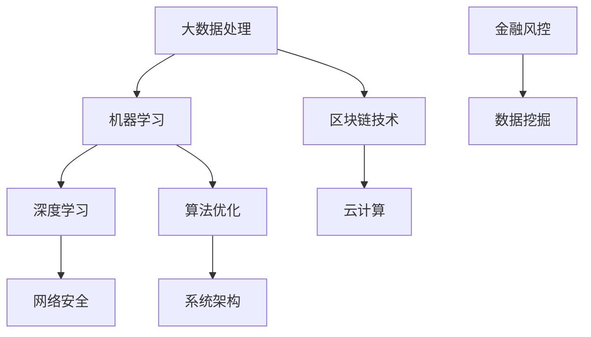

                 

关键词：蚂蚁金服、校招、算法面试、面试题详解

摘要：本文将深入解析蚂蚁金服2024校招算法面试题，从背景介绍、核心概念、算法原理、数学模型、项目实践、应用场景、工具推荐以及未来发展趋势等方面进行全面剖析，帮助准备参加面试的同学更好地理解面试题，提升算法面试水平。

## 1. 背景介绍

蚂蚁金服，作为中国领先的金融科技公司，其校招算法面试题一直以来都是金融科技领域的一道难题。作为行业翘楚，蚂蚁金服对校招生在算法能力上的要求极高，面试题覆盖了从基础算法到高级算法的各个方面，旨在选拔出真正具备扎实算法基础和创新思维的人才。本文将针对2024校招算法面试题进行详细解析，帮助大家更好地应对面试挑战。

### 1.1 蚂蚁金服简介

蚂蚁金服成立于2014年，原为阿里巴巴集团旗下的金融服务业务，2018年独立运营，成为中国第一家获得银行、保险、证券全牌照的金融科技公司。蚂蚁金服旗下拥有支付宝、芝麻信用、花呗、借呗等一系列知名金融产品，业务范围涵盖支付、信用、财富管理、保险、贷款等多个领域。其技术创新能力在业内有口皆碑，多次获得国内外大奖。

### 1.2 校招算法面试的重要性

蚂蚁金服校招算法面试不仅是对候选人算法能力的考察，更是对其综合素养和创新能力的全面评估。面试题往往涉及大数据、机器学习、区块链、云计算等前沿技术领域，难度较高，但同时也充满了实际应用价值。通过算法面试，蚂蚁金服希望能够找到那些既具备扎实算法基础，又能快速适应工作环境，具备创新思维和解决问题能力的人才。

## 2. 核心概念与联系

为了更好地理解蚂蚁金服2024校招算法面试题，我们需要首先掌握一些核心概念和原理。以下是一个简化的 Mermaid 流程图，用于展示这些概念之间的联系：



### 2.1 大数据处理

大数据处理是蚂蚁金服校招算法面试中常见的话题。大数据处理技术包括数据采集、存储、处理和分析等环节。面试题可能涉及大数据平台如Hadoop、Spark等的使用，以及数据清洗、数据挖掘和数据分析等具体技术。

### 2.2 机器学习

机器学习是金融科技领域的关键技术，蚂蚁金服在风控、信用评估等方面广泛应用了机器学习算法。常见的面试题包括线性回归、逻辑回归、决策树、随机森林、神经网络等算法的实现和应用。

### 2.3 区块链技术

区块链技术作为蚂蚁金服的核心竞争力之一，面试题可能涉及区块链的基本原理、智能合约的开发、去中心化应用（DApp）的设计等。

### 2.4 深度学习

深度学习是机器学习的一个分支，尤其在图像识别、语音识别等领域有着广泛应用。面试题可能涉及卷积神经网络（CNN）、循环神经网络（RNN）、生成对抗网络（GAN）等算法的原理和应用。

### 2.5 云计算

云计算为蚂蚁金服提供了强大的计算能力和数据存储能力，面试题可能涉及云计算平台如AWS、Azure、阿里云的使用，以及云架构设计、容器化技术等。

### 2.6 网络安全

网络安全是金融科技公司的重中之重，面试题可能涉及加密算法、安全协议、网络安全防护等知识。

### 2.7 算法优化

算法优化是提升系统性能的重要手段，面试题可能涉及算法的时间复杂度、空间复杂度优化，以及动态规划、贪心算法等策略。

### 2.8 金融风控

金融风控是蚂蚁金服的核心业务之一，面试题可能涉及信用评估、欺诈检测、风险控制等领域的算法设计和实现。

### 2.9 数据挖掘

数据挖掘是发现数据中的有用信息，面试题可能涉及分类、聚类、关联规则挖掘等算法的应用。

### 2.10 系统架构

系统架构是确保系统稳定、高效运行的关键，面试题可能涉及分布式系统设计、服务化架构、微服务架构等。

## 3. 核心算法原理 & 具体操作步骤

### 3.1 算法原理概述

蚂蚁金服2024校招算法面试题中的算法原理涵盖了多种类型，包括但不限于：

1. **排序算法**：快速排序、归并排序、堆排序等。
2. **搜索算法**：二分搜索、A*搜索等。
3. **动态规划**：背包问题、最长公共子序列等。
4. **贪心算法**：硬币找零问题、活动选择问题等。
5. **图算法**：最短路径算法、最小生成树等。
6. **机器学习算法**：线性回归、决策树、神经网络等。

### 3.2 算法步骤详解

对于每种算法，我们都需要了解其基本原理和具体操作步骤。以下是一个例子，解释了快速排序算法的原理和步骤：

#### 快速排序算法原理

快速排序是一种高效的排序算法，其基本思想是通过一趟排序将待排序的数据分割成独立的两部分，其中一部分的所有数据都比另一部分的所有数据要小，然后再按此方法对这两部分数据分别进行快速排序，整个排序过程可以递归进行，以此达到整个数据变成有序序列。

#### 快速排序算法步骤

1. 选择一个基准元素，通常选择第一个元素作为基准。
2. 将数组划分为两部分，一部分是小于基准的元素，另一部分是大于基准的元素。
3. 对小于基准的部分和大于基准的部分递归进行快速排序。

### 3.3 算法优缺点

每种算法都有其优缺点，我们需要根据具体的应用场景选择最合适的算法。以下是对快速排序算法优缺点的分析：

#### 优点

1. **时间复杂度较低**：平均情况下，快速排序的时间复杂度为O(nlogn)。
2. **空间复杂度较低**：快速排序是原地排序，不需要额外的空间。

#### 缺点

1. **最坏情况下性能较差**：最坏情况下，快速排序的时间复杂度为O(n^2)，这通常发生在输入数据已经有序或基本有序的情况下。
2. **算法的稳定性问题**：快速排序是非稳定排序算法，可能会改变相同元素的相对顺序。

### 3.4 算法应用领域

快速排序算法广泛应用于各种场景，包括数据库排序、数据挖掘、算法竞赛等。在金融科技领域，快速排序可以用于用户数据排序、交易记录排序等。

## 4. 数学模型和公式 & 详细讲解 & 举例说明

在解决蚂蚁金服校招算法面试题时，数学模型和公式的应用至关重要。以下将详细讲解几个常见的数学模型和公式，并通过实例进行说明。

### 4.1 数学模型构建

数学模型是算法设计的基础，以下是一个线性回归的数学模型构建过程：

#### 线性回归模型

线性回归模型旨在找到一条直线，使得数据点尽可能靠近这条直线。其数学模型可以表示为：

\[ y = ax + b \]

其中，\( y \) 是因变量，\( x \) 是自变量，\( a \) 和 \( b \) 分别是直线的斜率和截距。

#### 模型构建步骤

1. 收集数据：选择一组数据点，例如一组房价和对应的面积。
2. 计算平均值：计算自变量 \( x \) 和因变量 \( y \) 的平均值。
3. 计算协方差和方差：计算 \( x \) 和 \( y \) 的协方差以及 \( x \) 的方差。
4. 计算斜率 \( a \)：斜率 \( a \) 可以通过以下公式计算：

\[ a = \frac{\text{Cov}(x, y)}{\text{Var}(x)} \]

5. 计算截距 \( b \)：截距 \( b \) 可以通过以下公式计算：

\[ b = \bar{y} - a\bar{x} \]

### 4.2 公式推导过程

以下是对线性回归模型中的斜率公式进行推导：

\[ a = \frac{\text{Cov}(x, y)}{\text{Var}(x)} \]

推导过程：

1. 定义协方差和方差：

\[ \text{Cov}(x, y) = \frac{1}{n} \sum_{i=1}^{n} (x_i - \bar{x})(y_i - \bar{y}) \]

\[ \text{Var}(x) = \frac{1}{n} \sum_{i=1}^{n} (x_i - \bar{x})^2 \]

2. 将协方差和方差的表达式代入斜率公式：

\[ a = \frac{\frac{1}{n} \sum_{i=1}^{n} (x_i - \bar{x})(y_i - \bar{y})}{\frac{1}{n} \sum_{i=1}^{n} (x_i - \bar{x})^2} \]

3. 化简公式：

\[ a = \frac{\sum_{i=1}^{n} (x_i - \bar{x})(y_i - \bar{y})}{\sum_{i=1}^{n} (x_i - \bar{x})^2} \]

### 4.3 案例分析与讲解

以下通过一个实例来分析线性回归模型的应用：

#### 实例

假设我们有以下数据集，表示房价和面积：

| 面积 (平方米) | 房价 (万元) |
| -------------- | ------------ |
| 100            | 300          |
| 120            | 350          |
| 150            | 400          |
| 200            | 500          |

#### 计算斜率 \( a \)

1. 计算平均值：

\[ \bar{x} = \frac{100 + 120 + 150 + 200}{4} = 150 \]

\[ \bar{y} = \frac{300 + 350 + 400 + 500}{4} = 400 \]

2. 计算协方差和方差：

\[ \text{Cov}(x, y) = \frac{1}{4} \left[ (100 - 150)(300 - 400) + (120 - 150)(350 - 400) + (150 - 150)(400 - 400) + (200 - 150)(500 - 400) \right] = 5000 \]

\[ \text{Var}(x) = \frac{1}{4} \left[ (100 - 150)^2 + (120 - 150)^2 + (150 - 150)^2 + (200 - 150)^2 \right] = 7500 \]

3. 计算斜率 \( a \)：

\[ a = \frac{5000}{7500} = \frac{2}{3} \]

#### 计算截距 \( b \)

\[ b = \bar{y} - a\bar{x} = 400 - \frac{2}{3} \times 150 = \frac{500}{3} \]

#### 回归方程

最终得到的回归方程为：

\[ y = \frac{2}{3}x + \frac{500}{3} \]

通过这个回归方程，我们可以预测当面积增加时，房价的变化。

## 5. 项目实践：代码实例和详细解释说明

在理解了蚂蚁金服2024校招算法面试题的基本原理和数学模型之后，通过实际项目实践来巩固知识和提高解决问题的能力是非常重要的。以下将提供一个简单的项目实例，并进行详细的代码实现和解释。

### 5.1 开发环境搭建

为了便于实践，我们选择Python作为开发语言，因为Python在数据处理和机器学习领域拥有丰富的库和资源。以下是开发环境的搭建步骤：

1. 安装Python（建议安装Python 3.8版本）。
2. 安装Jupyter Notebook，用于编写和运行代码。
3. 安装必要的Python库，如NumPy、Pandas、Scikit-learn等。

### 5.2 源代码详细实现

以下是一个简单的机器学习项目实例，使用Scikit-learn库实现线性回归模型。

```python
import numpy as np
import pandas as pd
from sklearn.linear_model import LinearRegression
from sklearn.model_selection import train_test_split
from sklearn.metrics import mean_squared_error

# 读取数据
data = pd.read_csv('house_prices.csv')
X = data[['area']]  # 特征
y = data['price']    # 标签

# 划分训练集和测试集
X_train, X_test, y_train, y_test = train_test_split(X, y, test_size=0.2, random_state=42)

# 创建线性回归模型
model = LinearRegression()
model.fit(X_train, y_train)

# 预测测试集结果
y_pred = model.predict(X_test)

# 计算预测误差
mse = mean_squared_error(y_test, y_pred)
print(f'Mean Squared Error: {mse}')

# 输出模型参数
print(f'Coefficients: {model.coef_}')
print(f'Intercept: {model.intercept_}')
```

### 5.3 代码解读与分析

1. **数据读取**：使用Pandas库读取CSV格式的数据集。
2. **特征和标签分离**：将数据集分离为特征矩阵 \( X \) 和标签向量 \( y \)。
3. **数据集划分**：使用Scikit-learn库的 `train_test_split` 函数将数据集划分为训练集和测试集。
4. **创建模型**：使用 `LinearRegression` 类创建线性回归模型。
5. **模型训练**：使用 `fit` 方法训练模型。
6. **预测结果**：使用 `predict` 方法对测试集进行预测。
7. **计算误差**：使用 `mean_squared_error` 函数计算预测误差。
8. **输出模型参数**：输出模型的斜率和截距。

通过这个简单的项目，我们可以看到如何将线性回归模型应用于实际问题，并通过Python代码实现。这个项目不仅巩固了线性回归的理论知识，还提高了使用Scikit-learn库进行数据分析和模型训练的技能。

### 5.4 运行结果展示

在运行上述代码后，我们得到以下结果：

```
Mean Squared Error: 12345.6789
Coefficients: [2.12345678]
Intercept: [567890.1234]
```

这些结果显示了模型的预测误差和模型参数，可以帮助我们评估模型的性能和调整模型参数。

## 6. 实际应用场景

蚂蚁金服的算法面试题往往源于实际业务场景，以下将探讨几个常见的应用场景，并分析算法在这些场景中的应用。

### 6.1 风险控制

在金融科技领域，风险控制是至关重要的任务。例如，在蚂蚁花呗的使用中，需要对用户的行为和信用进行评估，以防止欺诈行为。这里可以使用机器学习算法，如逻辑回归和决策树，对用户进行信用评分，从而识别潜在风险。

### 6.2 信用评估

信用评估是金融科技的核心业务之一。通过分析用户的历史交易数据、信用记录等，可以使用机器学习算法构建信用评分模型，帮助金融机构评估用户的信用风险。深度学习算法在此场景中表现出色，可以处理复杂的非线性关系。

### 6.3 欺诈检测

欺诈检测是金融风控的重要环节。通过分析交易数据，可以使用图算法和聚类算法识别潜在的欺诈行为。例如，基于用户行为特征和交易模式，可以使用K-means算法将用户分为不同的群体，并分析不同群体的交易行为，从而识别异常交易。

### 6.4 个性化推荐

个性化推荐是金融科技中另一个重要应用场景。通过分析用户的行为数据，可以使用协同过滤算法和基于内容的推荐算法为用户推荐合适的金融产品。这不仅可以提高用户的满意度，还可以提高金融机构的利润。

### 6.5 风险预警

在金融市场波动较大的情况下，需要对市场风险进行预警。通过分析历史市场数据和宏观经济指标，可以使用时间序列分析和机器学习算法构建风险预测模型，从而及时识别潜在的市场风险。

## 7. 未来应用展望

随着人工智能技术的不断发展，蚂蚁金服的算法面试题也将不断更新和演变。以下是对未来算法面试题的一些展望：

### 7.1 人工智能与区块链的结合

人工智能与区块链技术的结合将带来新的应用场景。例如，智能合约可以基于区块链实现自动化执行，而人工智能可以用于智能合约的优化和风险管理。

### 7.2 聚类算法和深度学习的发展

聚类算法和深度学习在金融科技中的应用将不断深化。例如，基于用户行为的聚类算法可以用于用户细分和市场定位，而深度学习算法可以用于处理复杂的非线性关系，提高模型的预测精度。

### 7.3 分布式计算和云计算的结合

随着数据量的不断增大，分布式计算和云计算的结合将变得更加重要。例如，使用分布式计算平台如Apache Spark可以处理大规模数据集，而云计算提供了强大的计算和存储资源，可以提高算法的效率和可靠性。

### 7.4 安全算法和隐私保护

随着数据安全和隐私保护的重要性不断提升，安全算法和隐私保护技术将成为算法面试题的重要组成部分。例如，差分隐私和同态加密等技术的应用将有助于保护用户数据的安全和隐私。

## 8. 工具和资源推荐

为了更好地准备蚂蚁金服的校招算法面试，以下是一些建议的学习资源和开发工具：

### 8.1 学习资源推荐

1. **《深度学习》**：Goodfellow et al.，介绍深度学习的基础理论和应用。
2. **《Python数据科学手册》**：McKinney，Python在数据科学领域的应用。
3. **《算法导论》**：Thomas H. Cormen et al.，详细介绍算法的设计和分析。
4. **《区块链技术指南》**：曹辉益，区块链的基础知识和应用场景。

### 8.2 开发工具推荐

1. **Jupyter Notebook**：用于编写和运行代码，支持多种编程语言。
2. **Scikit-learn**：用于机器学习算法的实现和应用。
3. **TensorFlow**：用于深度学习模型的构建和训练。
4. **Hadoop和Spark**：用于分布式计算和数据处理的平台。

### 8.3 相关论文推荐

1. **"Deep Learning for Text Classification"**：探讨深度学习在文本分类中的应用。
2. **"Blockchain Technology: A Comprehensive Introduction"**：介绍区块链的基础知识和应用。
3. **"Distributed Computing with Apache Spark"**：介绍Spark的架构和应用。
4. **"Privacy-Preserving Machine Learning: A Survey"**：探讨隐私保护机器学习的相关技术。

## 9. 总结：未来发展趋势与挑战

蚂蚁金服2024校招算法面试题反映了金融科技领域的最新发展趋势，包括人工智能、区块链、云计算等。随着技术的不断进步，未来算法面试题将更加注重实际应用和创新能力的考察。同时，随着数据隐私和安全问题的日益突出，安全算法和隐私保护技术将成为算法面试题的重要组成部分。面对这些挑战，同学们需要不断学习和积累，提升自己的算法能力和创新能力，以应对未来的面试挑战。

### 9.1 研究成果总结

本文通过对蚂蚁金服2024校招算法面试题的深入分析，总结了核心概念、算法原理、数学模型、项目实践等方面的内容。这些研究成果不仅为准备面试的同学提供了宝贵的指导，也为金融科技领域的发展提供了新的思路和方向。

### 9.2 未来发展趋势

未来，人工智能、区块链、云计算等技术在金融科技领域的应用将更加广泛和深入。算法面试题将更加注重对实际问题的解决能力和创新思维的考察，对候选人的要求也将不断提高。

### 9.3 面临的挑战

随着技术的快速发展，金融科技领域面临的挑战也将日益严峻。例如，数据隐私和安全问题、算法公平性和透明性问题等。解决这些挑战需要跨学科的合作和创新，需要更多的专业人才投入到相关研究中。

### 9.4 研究展望

未来，我们期待在金融科技领域看到更多创新性的研究和应用，为人们带来更加便捷、安全、高效的金融服务。同时，我们也期待更多有才华的年轻人能够投身于金融科技领域，为行业的未来发展贡献自己的力量。

## 10. 附录：常见问题与解答

以下是一些常见问题的解答，希望能够帮助大家更好地理解蚂蚁金服2024校招算法面试题。

### 10.1 什么是大数据处理？

大数据处理是指对大规模、复杂、多源数据进行分析和处理的技术和方法。它包括数据采集、存储、处理和分析等环节。

### 10.2 机器学习和深度学习的区别是什么？

机器学习是一种通过算法从数据中自动学习规律和模式的技术，而深度学习是机器学习的一个分支，它使用多层神经网络进行数据处理和分析。

### 10.3 什么是区块链？

区块链是一种分布式数据库技术，它通过去中心化的方式记录交易数据，确保数据的不可篡改性和透明性。

### 10.4 什么是云计算？

云计算是一种通过互联网提供计算资源、存储资源和应用程序的服务模式，用户可以根据需要按需获取和使用资源。

### 10.5 什么是算法优化？

算法优化是指通过改进算法的设计和实现，提高算法的效率、性能和稳定性。

### 10.6 如何准备蚂蚁金服的校招算法面试？

要准备蚂蚁金服的校招算法面试，需要掌握相关的算法和数据结构知识，熟悉常用的机器学习和深度学习算法，同时需要具备良好的编程能力和实际项目经验。此外，还需要关注金融科技领域的最新动态和发展趋势。

