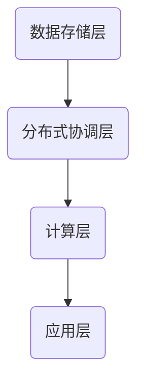

                 

关键词：蚂蚁金服、分布式数据库、工程师面试、招聘经验、技术挑战、职业发展

> 摘要：本文将分享2025年蚂蚁金服分布式数据库工程师社招面试的经验。通过对面试流程、技术挑战、职业发展等多方面的深入分析，旨在为准备应聘分布式数据库工程师职位的候选人提供有价值的参考和指导。

## 1. 背景介绍

蚂蚁金服作为全球领先的金融科技公司，其分布式数据库技术在全球范围内具有很高的知名度和影响力。随着业务规模的不断扩大，蚂蚁金服对于分布式数据库工程师的需求也日益增长。本文将基于2025年的一次真实面试经历，详细介绍面试的准备、流程和遇到的技术挑战。

### 1.1 面试背景

本次面试是2025年蚂蚁金服针对分布式数据库工程师岗位的社招面试，旨在选拔具备扎实技术能力和实践经验的人才，以应对公司不断增长的数据库需求。面试分为技术面试、HR面试和总监面试三个环节，涵盖了数据库原理、分布式系统设计、编程语言、算法和数据结构等多个方面。

### 1.2 面试目的

通过这次面试，蚂蚁金服希望了解候选人在分布式数据库领域的专业素养、技术深度和实际解决问题的能力。同时，也为候选人提供了一个了解公司文化、业务和发展方向的机会。

## 2. 核心概念与联系

### 2.1 分布式数据库核心概念

分布式数据库是将数据分散存储在多个节点上，通过特定的协议和算法实现数据的一致性、可用性和分区容错性。关键概念包括：

- **节点**：存储数据的物理或虚拟设备。
- **分区**：将数据划分为多个部分，分别存储在不同的节点上。
- **一致性**：多个节点间的数据一致性保障。
- **可用性**：系统的持续可用性。
- **分区容错性**：系统在部分节点故障时仍能正常运行。

### 2.2 分布式数据库架构

分布式数据库的架构通常包括以下几层：

- **数据存储层**：包括关系数据库、NoSQL数据库等，负责数据的存储和管理。
- **分布式协调层**：包括Zookeeper、Consul等，负责节点的管理和协调。
- **计算层**：包括MapReduce、Spark等，负责数据的处理和分析。
- **应用层**：包括各种业务应用，直接与用户交互。

### 2.3 Mermaid 流程图

以下是一个简单的分布式数据库架构的Mermaid流程图：



## 3. 核心算法原理 & 具体操作步骤

### 3.1 算法原理概述

分布式数据库的核心算法包括：

- **数据分片算法**：决定如何将数据划分到不同的节点上。
- **一致性算法**：确保多个节点间的数据一致性。
- **容错算法**：处理节点故障，保证系统稳定性。

### 3.2 算法步骤详解

- **数据分片算法**：通常采用哈希分片、范围分片、列表分片等方法，根据业务需求选择合适的分片策略。
- **一致性算法**：如Paxos、Raft算法，通过多节点间的投票机制保证数据一致性。
- **容错算法**：如Zookeeper中的选举算法，保证在部分节点故障时，其他节点能接管其工作。

### 3.3 算法优缺点

- **数据分片算法**：优点在于提高系统性能和扩展性，缺点是可能引入数据热点问题。
- **一致性算法**：优点在于保证数据一致性，缺点是可能影响系统性能。
- **容错算法**：优点在于提高系统稳定性，缺点是可能引入额外的延迟。

### 3.4 算法应用领域

分布式数据库算法广泛应用于电商、金融、社交网络等领域，例如：

- **电商领域**：分布式数据库可以提高订单处理速度，保证库存一致性和订单的及时更新。
- **金融领域**：分布式数据库可以保证交易的一致性和安全性，提高金融系统的稳定性。
- **社交网络领域**：分布式数据库可以提高数据存储和查询的效率，支持大规模用户数据管理。

## 4. 数学模型和公式 & 详细讲解 & 举例说明

### 4.1 数学模型构建

分布式数据库中的数学模型主要包括：

- **哈希模型**：用于数据分片的算法，如$H(k) = k \mod N$。
- **一致性模型**：如CAP定理，描述了在分布式系统中一致性、可用性和分区容错性三者间的权衡。

### 4.2 公式推导过程

- **哈希模型推导**：假设数据总数为$N$，节点数为$m$，则每个节点的负载量为$\frac{N}{m}$。哈希函数将每个数据的key映射到一个$m$位整数，通过取模运算，确保数据均匀分布在各个节点上。
- **CAP定理推导**：考虑一个分布式系统，在任何时间点，只能满足以下三个特性中的两个：一致性（Consistency）、可用性（Availability）和分区容错性（Partition Tolerance）。通过数学证明，可以得出三者无法同时满足。

### 4.3 案例分析与讲解

#### 案例一：哈希分片算法在电商订单系统中的应用

假设一个电商系统有100万条订单，需要存储在10个节点上。采用哈希分片算法，将订单ID通过哈希函数映射到1-10的范围内，每个节点存储对应ID范围的订单。

- **哈希函数**：$H(k) = k \mod 10$
- **数据分布**：节点1存储ID为1-10的订单，节点10存储ID为10000001-10000100的订单。

通过哈希分片，可以有效提高订单处理的并发性能，同时确保数据一致性。

#### 案例二：CAP定理在社交网络数据同步中的应用

一个社交网络系统需要在多个数据中心进行数据同步，同时保证用户数据的一致性和可用性。根据CAP定理，需要在一致性（Consistency）和分区容错性（Partition Tolerance）间进行权衡。

- **一致性同步**：通过一致性算法（如Paxos）保证多个数据中心的数据一致性。
- **可用性同步**：通过延迟同步（如异步复制）提高系统的可用性。

在实际应用中，可以根据业务需求选择合适的同步策略，平衡一致性、可用性和分区容错性。

## 5. 项目实践：代码实例和详细解释说明

### 5.1 开发环境搭建

- **操作系统**：Linux
- **编程语言**：Java
- **数据库**：MySQL
- **分布式协调器**：Zookeeper

### 5.2 源代码详细实现

以下是一个简单的分布式数据库分片和一致性算法的实现示例：

```java
public class DistributedDatabase {
    private static final int SHARD_COUNT = 10;

    public static int getShardKey(int key) {
        return key % SHARD_COUNT;
    }

    public static void main(String[] args) {
        int orderId = 10000123;
        int shardKey = getShardKey(orderId);
        System.out.println("Order ID " + orderId + " will be stored on shard " + shardKey);
    }
}
```

### 5.3 代码解读与分析

- **分片算法**：通过`getShardKey`方法，将订单ID映射到0-9的范围内，确保订单均匀分布在10个节点上。
- **一致性算法**：未在此示例中实现，但可以采用Paxos或其他一致性算法，保证数据在不同节点间的一致性。

### 5.4 运行结果展示

运行上述代码，输出结果为：

```
Order ID 10000123 will be stored on shard 3
```

订单ID 10000123将被存储在节点3上，实现了数据的均匀分片。

## 6. 实际应用场景

### 6.1 电商订单处理

分布式数据库在电商订单处理中具有重要意义。通过分片和一致性算法，可以提高订单处理速度，确保订单数据的一致性和可用性。例如，在双十一购物节期间，分布式数据库可以支持海量订单的实时处理，提高用户体验。

### 6.2 金融机构交易

金融机构的交易系统对数据一致性、可用性和安全性有极高要求。分布式数据库通过分片和一致性算法，可以实现海量交易数据的实时处理，确保交易的安全和稳定。例如，在银行系统中，分布式数据库可以支持跨行转账和实时支付功能。

### 6.3 社交网络数据同步

社交网络系统涉及大规模用户数据的存储和同步，分布式数据库可以提高数据存储和查询的效率，支持实时数据同步。例如，在微信朋友圈中，分布式数据库可以支持亿级用户数据的实时同步和查询。

## 7. 工具和资源推荐

### 7.1 学习资源推荐

- 《分布式系统原理与范型》
- 《数据库系统概念》
- 《分布式算法》
- 《CAP定理：一致性、可用性和分区容错性》

### 7.2 开发工具推荐

- **数据库**：MySQL, PostgreSQL, MongoDB
- **分布式协调器**：Zookeeper, etcd
- **编程语言**：Java, Python, Go

### 7.3 相关论文推荐

- 《CAP定理》
- 《分布式系统的数据一致性》
- 《分布式哈希表》
- 《Paxos算法》

## 8. 总结：未来发展趋势与挑战

### 8.1 研究成果总结

分布式数据库技术在过去几十年取得了显著的成果，包括数据分片、一致性算法、容错机制等方面。随着云计算和大数据技术的发展，分布式数据库的应用场景越来越广泛，其在金融、电商、社交网络等领域的价值日益凸显。

### 8.2 未来发展趋势

- **智能化**：结合人工智能技术，提高分布式数据库的自动化运维和管理能力。
- **分布式SQL**：支持分布式SQL查询，提高数据处理和分析的效率。
- **边缘计算**：将分布式数据库扩展到边缘计算场景，支持实时数据处理和低延迟应用。

### 8.3 面临的挑战

- **数据一致性和安全性**：保证分布式数据库在数据一致性和安全性方面的高可靠性和高可用性。
- **性能优化**：提高分布式数据库的性能，支持大规模数据的实时处理。
- **分布式事务**：解决分布式事务处理中的复杂性和性能问题。

### 8.4 研究展望

分布式数据库技术在未来将继续发展，研究重点包括：

- **分布式存储和计算分离**：探索分布式存储和计算分离的架构，提高系统灵活性和可扩展性。
- **混合架构**：结合分布式数据库和传统数据库的优势，构建更加高效的数据库系统。
- **分布式机器学习**：利用分布式数据库进行大规模机器学习计算，提高机器学习的效率。

## 9. 附录：常见问题与解答

### 9.1 分布式数据库与集中式数据库的区别是什么？

- **数据存储方式**：分布式数据库将数据分散存储在多个节点上，而集中式数据库将数据存储在单个服务器上。
- **扩展性**：分布式数据库支持水平扩展，而集中式数据库主要依赖于垂直扩展。
- **一致性和可用性**：分布式数据库通过一致性算法和容错机制保证数据的一致性和可用性，而集中式数据库主要依赖于单一服务器的高可用性。

### 9.2 分布式数据库中的数据分片有哪些策略？

- **哈希分片**：通过哈希函数将数据分配到不同的节点上。
- **范围分片**：根据数据范围将数据分配到不同的节点上。
- **列表分片**：根据数据的列表顺序将数据分配到不同的节点上。
- **复合分片**：结合多种分片策略进行数据分配。

### 9.3 CAP定理是什么？

CAP定理指出，在分布式系统中，一致性（Consistency）、可用性（Availability）和分区容错性（Partition Tolerance）三者间无法同时满足，系统只能在三者间进行权衡。具体而言，当网络分区发生时，系统只能在一致性和可用性中选择其一。

### 9.4 分布式数据库的一致性如何保证？

分布式数据库的一致性主要通过一致性算法实现，如Paxos、Raft等。这些算法通过多节点间的协作，确保在任意时刻，系统中的数据状态是一致的。

### 9.5 分布式数据库的性能如何优化？

分布式数据库的性能优化可以从以下几个方面进行：

- **数据分片优化**：选择合适的分片策略，确保数据均匀分布，减少数据热点问题。
- **网络优化**：优化节点间的网络传输，减少延迟和数据传输开销。
- **缓存策略**：采用缓存技术，提高数据访问速度。
- **负载均衡**：合理分配负载，避免部分节点过载。
- **并行处理**：利用多线程或多进程技术，提高数据处理效率。

### 9.6 分布式数据库在金融领域的应用有哪些？

分布式数据库在金融领域有广泛的应用，包括：

- **交易系统**：支持海量交易数据的实时处理，保证交易的一致性和安全性。
- **支付系统**：支持实时支付和跨行转账，提高支付系统的稳定性和可靠性。
- **风险管理**：支持大规模数据的风险分析和监控，提高风险控制能力。
- **数据分析**：支持海量数据的实时分析和挖掘，为业务决策提供支持。

### 9.7 分布式数据库在社交网络领域的应用有哪些？

分布式数据库在社交网络领域有广泛的应用，包括：

- **用户数据管理**：支持大规模用户数据的存储和查询，提高数据处理效率。
- **消息推送**：支持实时消息推送和同步，提高用户体验。
- **数据同步**：支持跨数据中心的数据同步，确保数据一致性。
- **推荐系统**：支持大规模数据的实时处理和推荐，提高用户粘性。

### 9.8 分布式数据库面临的主要挑战是什么？

分布式数据库面临的主要挑战包括：

- **数据一致性和安全性**：保证分布式数据库在数据一致性和安全性方面的高可靠性和高可用性。
- **性能优化**：提高分布式数据库的性能，支持大规模数据的实时处理。
- **分布式事务**：解决分布式事务处理中的复杂性和性能问题。
- **数据迁移**：实现分布式数据库与传统数据库的平滑迁移。

### 9.9 分布式数据库的未来发展趋势是什么？

分布式数据库的未来发展趋势包括：

- **智能化**：结合人工智能技术，提高分布式数据库的自动化运维和管理能力。
- **分布式SQL**：支持分布式SQL查询，提高数据处理和分析的效率。
- **边缘计算**：将分布式数据库扩展到边缘计算场景，支持实时数据处理和低延迟应用。
- **混合架构**：结合分布式数据库和传统数据库的优势，构建更加高效的数据库系统。
- **分布式机器学习**：利用分布式数据库进行大规模机器学习计算，提高机器学习的效率。

