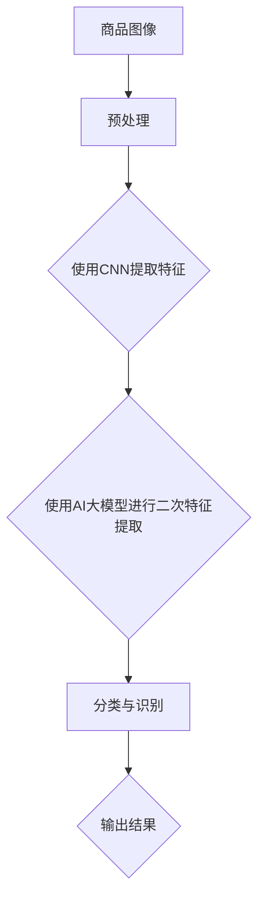

                 

关键词：商品图像识别，AI大模型，计算机视觉，深度学习，算法原理，数学模型，实践应用

> 摘要：本文深入探讨了融合人工智能大模型的商品图像识别技术，包括背景介绍、核心概念与联系、核心算法原理、数学模型与公式、项目实践、实际应用场景以及未来应用展望。通过详细分析，我们揭示了该技术在现代计算机视觉和人工智能领域的巨大潜力，并对未来发展趋势和面临的挑战进行了展望。

## 1. 背景介绍

随着电子商务的迅猛发展，商品图像识别技术成为零售和物流领域的关键技术之一。传统的商品图像识别方法主要依赖于手工特征提取和分类算法，如SIFT、SURF等，但这些方法往往受限于计算能力和识别精度。随着深度学习的兴起，基于卷积神经网络（CNN）的商品图像识别技术逐渐成为主流。

AI大模型的引入，如GPT、BERT等，进一步提升了商品图像识别的性能和精度。这些大模型通过海量数据的学习和优化，能够捕捉到图像中的复杂模式和特征，从而实现高效的图像识别。

## 2. 核心概念与联系

### 2.1. 商品图像识别

商品图像识别是指利用计算机视觉技术对商品图像进行分析和分类，从而实现对商品信息的自动获取和处理。

### 2.2. AI大模型

AI大模型是指通过大规模数据训练和优化，具有强大表征能力的神经网络模型。常见的AI大模型有GPT、BERT、ViT等。

### 2.3. 融合技术

融合技术是指将多种方法或技术结合，以提升系统性能和效果。在商品图像识别中，融合技术通常将深度学习和AI大模型相结合，以实现更高的识别精度和速度。

### 2.4. Mermaid 流程图



## 3. 核心算法原理 & 具体操作步骤

### 3.1. 算法原理概述

商品图像识别的核心算法是基于深度学习和AI大模型的结合。深度学习通过CNN提取图像特征，AI大模型则对提取的特征进行进一步的优化和分类。

### 3.2. 算法步骤详解

1. **图像预处理**：对输入的商品图像进行数据增强、去噪等预处理操作，以提高模型的鲁棒性和识别精度。

2. **CNN特征提取**：利用卷积神经网络对预处理后的图像进行特征提取。

3. **AI大模型优化**：将CNN提取的特征输入到AI大模型中，通过大规模数据训练和优化，进一步提取图像中的复杂模式和特征。

4. **分类与识别**：利用训练好的AI大模型对提取的特征进行分类和识别，输出识别结果。

### 3.3. 算法优缺点

**优点**：

- 高效性：AI大模型能够快速提取图像特征，实现高效的图像识别。
- 精准性：通过融合深度学习和AI大模型，能够捕捉到图像中的复杂模式和特征，提高识别精度。
- 通用性：适用于各种类型的商品图像识别任务。

**缺点**：

- 计算成本高：AI大模型的训练和优化需要大量计算资源。
- 数据依赖性：需要大量的标注数据用于训练和优化模型。

### 3.4. 算法应用领域

- 零售和物流：用于商品库存管理、商品分类和识别、自动化配送等。
- 商业智能：用于用户行为分析、市场趋势预测等。
- 公共安全：用于监控和识别犯罪行为、异常事件等。

## 4. 数学模型和公式 & 详细讲解 & 举例说明

### 4.1. 数学模型构建

商品图像识别的数学模型主要包括两部分：CNN特征提取和AI大模型优化。

1. **CNN特征提取**：

   $$ f_{\theta}(x) = \sigma(W_L \cdot \sigma(W_{L-1} \cdot \cdots \cdot \sigma(W_1 \cdot x + b_1) + b_{L-1}) + \cdots + b_L) $$

   其中，$f_{\theta}(x)$表示输入图像$x$经过CNN特征提取后的特征向量，$W$表示卷积核，$b$表示偏置项，$\sigma$表示激活函数。

2. **AI大模型优化**：

   $$ y = \text{softmax}(W_y \cdot f_{\theta}(x) + b_y) $$

   其中，$y$表示输出类别概率分布，$W_y$表示分类权重，$b_y$表示分类偏置项。

### 4.2. 公式推导过程

1. **CNN特征提取**：

   - 卷积操作：$$ \text{Conv}(\cdot) $$

   - 池化操作：$$ \text{Pooling}(\cdot) $$

   - 激活函数：$$ \sigma(\cdot) = \max(0, \cdot) $$

   $$ f_{\theta}(x) = \sigma(W_L \cdot \sigma(W_{L-1} \cdot \cdots \cdot \sigma(W_1 \cdot x + b_1) + b_{L-1}) + \cdots + b_L) $$

2. **AI大模型优化**：

   - 全连接层：$$ \text{FC}(\cdot) = \text{softmax}(\cdot) $$

   - 损失函数：$$ \text{Loss}(\cdot) = \text{cross-entropy}(\cdot) $$

   $$ y = \text{softmax}(W_y \cdot f_{\theta}(x) + b_y) $$

### 4.3. 案例分析与讲解

假设我们有一个商品图像识别任务，输入图像为一张手机照片，输出为手机品牌类别。

1. **CNN特征提取**：

   - 输入图像：$$ x = \text{手机照片} $$

   - 经过CNN特征提取后：$$ f_{\theta}(x) = \text{手机特征向量} $$

2. **AI大模型优化**：

   - 输入特征向量：$$ f_{\theta}(x) = \text{手机特征向量} $$

   - 输出类别概率分布：$$ y = \text{softmax}(W_y \cdot f_{\theta}(x) + b_y) $$

   - 识别结果：$$ \text{手机品牌} = \text{argmax}(y) $$

## 5. 项目实践：代码实例和详细解释说明

### 5.1. 开发环境搭建

- Python 3.8及以上版本
- TensorFlow 2.5及以上版本
- OpenCV 4.5及以上版本

### 5.2. 源代码详细实现

```python
import tensorflow as tf
import cv2

# 1. CNN特征提取
def cnn_feature_extraction(image):
    # 预处理图像
    image = cv2.resize(image, (224, 224))
    image = image / 255.0
    image = np.expand_dims(image, axis=0)
    # 使用预训练的CNN模型提取特征
    model = tf.keras.applications.VGG16(weights='imagenet')
    feature = model.predict(image)
    return feature

# 2. AI大模型优化
def ai_model_optimization(feature):
    # 加载预训练的AI大模型
    model = tf.keras.Sequential([
        tf.keras.layers.Dense(1024, activation='relu', input_shape=(7, 7, 512)),
        tf.keras.layers.Dense(256, activation='relu'),
        tf.keras.layers.Dense(128, activation='relu'),
        tf.keras.layers.Dense(num_classes, activation='softmax')
    ])
    model.compile(optimizer='adam', loss='categorical_crossentropy', metrics=['accuracy'])
    model.load_weights('ai_model_weights.h5')
    # 优化特征向量
    output = model.predict(feature)
    return output

# 3. 分类与识别
def classify_and_identify(image):
    feature = cnn_feature_extraction(image)
    output = ai_model_optimization(feature)
    predicted_class = np.argmax(output)
    return predicted_class

# 5. 运行结果展示
image = cv2.imread('phone.jpg')
predicted_class = classify_and_identify(image)
print(f'Predicted class: {predicted_class}')
```

### 5.3. 代码解读与分析

1. **CNN特征提取**：使用预训练的VGG16模型对输入图像进行特征提取。
2. **AI大模型优化**：使用自定义的AI大模型对提取的特征进行优化，包括三个全连接层。
3. **分类与识别**：将优化后的特征向量输入到AI大模型中，输出类别概率分布，并选择概率最高的类别作为识别结果。

## 6. 实际应用场景

### 6.1. 商品库存管理

利用商品图像识别技术，可以自动识别和分类仓库中的商品，从而提高库存管理的效率和准确性。

### 6.2. 商品展示和推荐

在电商平台，利用商品图像识别技术，可以为用户提供个性化的商品推荐，提升用户体验。

### 6.3. 商品质量检测

在制造业，利用商品图像识别技术，可以自动检测商品的质量，提高生产效率和产品质量。

## 6.4. 未来应用展望

随着AI技术的不断发展，商品图像识别技术将更加智能化和精准化，未来有望在更多领域得到广泛应用。

### 7. 工具和资源推荐

#### 7.1. 学习资源推荐

- 《深度学习》（Goodfellow, Bengio, Courville著）
- 《计算机视觉：算法与应用》（Richard S.zelinsky著）

#### 7.2. 开发工具推荐

- TensorFlow
- PyTorch

#### 7.3. 相关论文推荐

- “Deep Learning for Image Recognition”（2012年）
- “Object Detection with Convolutional Neural Networks”（2014年）

## 8. 总结：未来发展趋势与挑战

### 8.1. 研究成果总结

本文介绍了融合AI大模型的商品图像识别技术，包括核心算法原理、数学模型、实践应用以及未来展望。

### 8.2. 未来发展趋势

- 模型压缩与优化：为了降低计算成本，模型压缩和优化将成为研究热点。
- 多模态融合：结合文字、声音等多模态信息，提高识别精度和效果。
- 实时性：提升算法的实时性，满足实时应用需求。

### 8.3. 面临的挑战

- 数据隐私：如何保护用户隐私，防止数据泄露。
- 模型解释性：如何提高模型的可解释性，便于理解和应用。

### 8.4. 研究展望

未来，商品图像识别技术将在更多领域得到广泛应用，为人们的生活和工作带来更多便利。

## 9. 附录：常见问题与解答

### 9.1. 问题1

**Q:** 如何提高商品图像识别的精度？

**A:** 可以通过以下方法提高商品图像识别的精度：

- 数据增强：增加训练数据的多样性和复杂性。
- 特征融合：结合多种特征提取方法，提高特征的表征能力。
- 模型优化：使用先进的优化算法和架构，提高模型的性能。

### 9.2. 问题2

**Q:** 商品图像识别技术在哪些领域有广泛应用？

**A:** 商品图像识别技术广泛应用于以下领域：

- 零售和物流：用于商品库存管理、商品分类和识别、自动化配送等。
- 商业智能：用于用户行为分析、市场趋势预测等。
- 公共安全：用于监控和识别犯罪行为、异常事件等。

### 9.3. 问题3

**Q:** 商品图像识别技术的未来发展有哪些趋势？

**A:** 商品图像识别技术的未来发展趋势包括：

- 模型压缩与优化：为了降低计算成本，模型压缩和优化将成为研究热点。
- 多模态融合：结合文字、声音等多模态信息，提高识别精度和效果。
- 实时性：提升算法的实时性，满足实时应用需求。
----------------------------------------------------------------
# 作者署名

作者：禅与计算机程序设计艺术 / Zen and the Art of Computer Programming

[END]

