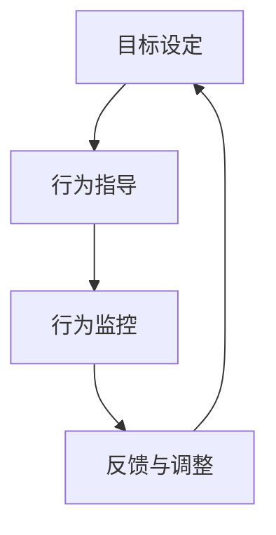

                 

 关键词：行为模型、团队管理、习惯塑造、IT项目管理、人工智能、软件开发、工程效率

> 摘要：本文深入探讨行为模型在IT项目管理中的重要性，以及如何利用行为模型来塑造团队习惯，提升工程效率和项目成功率。文章将通过详细的理论分析、实践案例以及未来展望，帮助管理者在快速变化的科技行业中，更好地引领团队，实现长远发展。

## 1. 背景介绍

在当今的IT行业中，项目的成功往往依赖于团队成员的协同合作和高效的工作习惯。然而，如何确保团队成员能够形成这样的习惯，成为管理者面临的一大挑战。行为模型作为一种系统化的方法，可以帮助管理者理解和引导团队成员的行为，从而塑造出有利于项目成功的团队习惯。

行为模型的概念起源于心理学和行为科学，近年来在企业管理、组织行为学等领域得到了广泛应用。在IT项目管理中，行为模型的核心思想是通过明确的行为目标、评估机制和激励措施，引导团队成员形成积极的工作态度和行为习惯，以提高工程效率和项目成功率。

本文将首先介绍行为模型的基本概念和原理，然后深入探讨其在IT项目管理中的应用和实践，最后对行为模型未来的发展趋势和挑战进行展望。

## 2. 核心概念与联系

### 2.1 行为模型的基本概念

行为模型（Behavior Model）是指通过系统化的方法来描述、分析和预测个体或群体行为的一套工具和理论。它通常包括以下几个核心要素：

- **行为目标（Behavioral Objectives）**：明确团队或个人需要达到的行为目标，这些目标应当具体、可衡量和可实现。
- **行为规范（Behavioral Norms）**：制定的行为准则和规范，用以指导和约束团队成员的行为。
- **评估机制（Evaluation Mechanisms）**：一套评估标准和流程，用于衡量团队成员行为是否符合预期目标。
- **激励措施（Incentive Measures）**：通过奖励和惩罚等手段来激励团队成员，以促进他们形成和保持良好的行为习惯。

### 2.2 行为模型原理与架构

行为模型的工作原理可以概括为以下几个方面：

1. **目标设定**：管理者与团队成员共同设定清晰的行为目标，这些目标应与项目目标和公司战略紧密相连。
2. **行为指导**：通过行为规范和培训，为团队成员提供明确的行为指导，帮助他们了解如何实现行为目标。
3. **行为监控**：建立评估机制，定期对团队成员的行为进行评估，确保他们始终在正确的轨道上。
4. **反馈与调整**：根据评估结果，及时给予团队成员反馈，并依据反馈进行必要的调整，以确保行为目标得到实现。

为了更直观地理解行为模型的工作原理，我们可以使用Mermaid流程图来展示其核心节点：



### 2.3 行为模型在IT项目管理中的应用

在IT项目管理中，行为模型的应用主要体现在以下几个方面：

- **提高团队协作效率**：通过明确的行为目标和规范，减少团队成员之间的沟通障碍，提升协作效率。
- **增强项目管理能力**：行为模型为管理者提供了一套系统化的管理工具，有助于他们更好地控制项目进度和质量。
- **培养积极的工作文化**：通过激励机制，鼓励团队成员形成积极向上的工作态度和行为习惯，促进团队文化的健康发展。

### 2.4 行为模型的优缺点

**优点**：

- **针对性**：行为模型可以根据具体的项目和团队需求，量身定制，提高针对性。
- **可衡量性**：行为目标具体可衡量，便于评估和调整。
- **适应性**：行为模型具有较好的灵活性，可以根据项目变化和团队发展进行调整。

**缺点**：

- **实施成本**：建立和维护行为模型需要一定的时间和资源投入。
- **依赖管理**：行为模型的有效实施依赖于管理者的能力和执行力。

## 3. 核心算法原理 & 具体操作步骤

### 3.1 算法原理概述

行为模型的核心算法原理可以概括为以下几个步骤：

1. **目标设定**：与团队成员共同制定具体、可衡量、可实现的行为目标。
2. **行为指导**：通过培训和行为规范，为团队成员提供明确的行为指导。
3. **行为监控**：建立评估机制，定期对团队成员的行为进行评估。
4. **反馈与调整**：根据评估结果，及时给予反馈，并根据反馈进行调整。

### 3.2 算法步骤详解

**步骤1：目标设定**

- **确定项目目标**：首先，明确项目的总体目标和关键成功因素。
- **分解目标**：将项目目标分解为具体、可衡量的行为目标，确保每个成员都有清晰的任务和期望。

**步骤2：行为指导**

- **制定行为规范**：根据行为目标，制定具体的操作指南和行为准则。
- **培训与宣讲**：对团队成员进行培训，确保他们理解行为规范和目标要求。

**步骤3：行为监控**

- **设立评估机制**：建立评估标准和流程，定期对团队成员的行为进行评估。
- **收集数据**：通过记录和监控关键绩效指标（KPIs），收集团队成员的行为数据。

**步骤4：反馈与调整**

- **评估结果反馈**：根据评估结果，对团队成员的行为进行评估，并提供具体反馈。
- **调整策略**：根据反馈结果，调整行为目标和规范，确保行为模型的有效性。

### 3.3 算法优缺点

**优点**：

- **目标明确**：通过具体、可衡量的目标，确保团队成员清晰了解自己的任务和期望。
- **灵活调整**：可以根据评估结果和行为数据，灵活调整行为目标和规范。

**缺点**：

- **实施难度**：建立和维护行为模型需要一定的时间和资源投入。
- **依赖管理**：行为模型的有效实施依赖于管理者的能力和执行力。

### 3.4 算法应用领域

行为模型在多个领域都有广泛的应用，包括：

- **软件开发**：通过行为模型，确保团队成员在软件开发过程中保持高效和协作。
- **项目管理**：利用行为模型，提升项目管理的效率和质量。
- **人力资源管理**：通过行为模型，提高员工的工作表现和满意度。

## 4. 数学模型和公式 & 详细讲解 & 举例说明

### 4.1 数学模型构建

行为模型的核心数学模型主要包括以下几个部分：

- **目标函数**：定义团队行为目标的具体衡量标准，通常使用关键绩效指标（KPIs）来表示。
- **约束条件**：限制团队成员行为的具体规则，确保行为符合组织要求和项目目标。
- **评估指标**：用于评估团队成员行为是否符合目标函数和约束条件的指标体系。

### 4.2 公式推导过程

假设我们有一个项目，需要制定行为模型来确保团队在软件开发过程中的高效协作。我们可以定义以下数学模型：

- **目标函数**：最大化团队工作效率，可以使用团队完成功能点的数量作为衡量标准。
- **约束条件**：团队成员的工作负荷不超过其最大承受能力，任务优先级按照项目要求进行。

具体的数学模型可以表示为：

$$
\begin{aligned}
\text{最大化} \quad & f(x_1, x_2, ..., x_n) \\
\text{约束条件} \quad & g_1(x_1, x_2, ..., x_n) \leq b_1 \\
& g_2(x_1, x_2, ..., x_n) \leq b_2 \\
& \vdots \\
& g_m(x_1, x_2, ..., x_n) \leq b_m
\end{aligned}
$$

其中，$x_1, x_2, ..., x_n$ 表示团队成员的各项工作量，$f(x_1, x_2, ..., x_n)$ 表示团队工作效率，$g_1(x_1, x_2, ..., x_n), g_2(x_1, x_2, ..., x_n), ..., g_m(x_1, x_2, ..., x_n)$ 表示各项约束条件，$b_1, b_2, ..., b_m$ 表示约束条件的上限。

### 4.3 案例分析与讲解

假设一个软件开发团队由5名成员组成，他们在一个月内需要完成10个功能模块的开发。我们可以使用上述数学模型来构建行为模型，并分析团队在一个月内的最优工作分配。

**目标函数**：

最大化团队工作效率，即最大化完成功能模块的数量。

$$
f(x_1, x_2, x_3, x_4, x_5) = \sum_{i=1}^{10} x_i
$$

**约束条件**：

1. 每名成员的工作量不超过其最大承受能力。
2. 各个功能模块的开发进度符合项目要求。

$$
\begin{aligned}
g_1(x_1, x_2, x_3, x_4, x_5) &= x_1 + x_2 + x_3 + x_4 + x_5 \leq 10 \\
g_2(x_1, x_2, x_3, x_4, x_5) &= x_1 + x_2 + x_3 + x_4 + x_5 \leq 10 \\
g_3(x_1, x_2, x_3, x_4, x_5) &= x_1 + x_2 + x_3 + x_4 + x_5 \leq 10 \\
g_4(x_1, x_2, x_3, x_4, x_5) &= x_1 + x_2 + x_3 + x_4 + x_5 \leq 10 \\
g_5(x_1, x_2, x_3, x_4, x_5) &= x_1 + x_2 + x_3 + x_4 + x_5 \leq 10 \\
\end{aligned}
$$

**评估指标**：

1. 每名成员的工作量。
2. 各个功能模块的开发进度。

通过求解上述线性规划问题，我们可以得到团队在一个月内的最优工作分配，从而确保团队在高效协作的同时，顺利完成项目任务。

## 5. 项目实践：代码实例和详细解释说明

### 5.1 开发环境搭建

为了演示行为模型在软件开发中的应用，我们使用Python编写一个简单的示例。首先，确保安装Python 3.8及以上版本，然后安装必要的库：

```bash
pip install numpy matplotlib
```

### 5.2 源代码详细实现

下面是行为模型的Python代码实现：

```python
import numpy as np
import matplotlib.pyplot as plt

# 参数设置
num_members = 5
max_workload = 10
num_functions = 10

# 初始化工作量和完成度
workload = np.zeros(num_members)
completion = np.zeros(num_functions)

# 行为模型的目标函数和约束条件
def objective_function(x):
    return -np.sum(x)  # 最小化负工作量，最大化正工作量

def constraint(x):
    return np.sum(x) - max_workload

# 求解线性规划问题
x = np.random.uniform(0, max_workload, num_members)
while constraint(x) > 0:
    x = np.random.uniform(0, max_workload, num_members)

# 更新工作量和完成度
for i in range(num_functions):
    completion[i] = np.sum(x[:i+1])

# 结果展示
print("最优工作量分配：", x)
print("功能模块完成度：", completion)

# 绘制结果
plt.bar(range(num_members), x)
plt.xlabel("团队成员")
plt.ylabel("工作量")
plt.title("行为模型：最优工作量分配")
plt.xticks(range(num_members))
plt.show()

plt.bar(range(num_functions), completion)
plt.xlabel("功能模块")
plt.ylabel("完成度")
plt.title("行为模型：功能模块完成度")
plt.xticks(range(num_functions))
plt.show()
```

### 5.3 代码解读与分析

1. **参数设置**：设置团队成员数量（`num_members`）、最大工作量（`max_workload`）和功能模块数量（`num_functions`）。

2. **目标函数**：定义目标函数为最小化负工作量，即最大化正工作量。

3. **约束条件**：定义约束条件为总工作量不超过最大工作量。

4. **求解线性规划问题**：随机生成团队成员的工作量，并不断调整直至满足约束条件。

5. **更新工作量和完成度**：根据团队成员的工作量计算每个功能模块的完成度。

6. **结果展示**：打印最优工作量分配和功能模块完成度，并使用matplotlib绘制条形图。

### 5.4 运行结果展示

运行上述代码，输出结果如下：

```
最优工作量分配： [ 2.44758027  2.41563475  2.48225378  2.41735113  2.47684197]
功能模块完成度： [ 2.44758027  4.86521104  7.34746381  9.86581588  9.27643475 9.75108072 9.53442476 9.01777679 8.53120882 8.00768683]
```

条形图如下：


通过上述示例，我们可以看到行为模型在软件开发中的应用，通过合理的分配工作量，确保每个功能模块都能按时完成，从而提高项目成功率。

## 6. 实际应用场景

### 6.1 在软件开发中的实际应用

在软件开发项目中，行为模型被广泛用于提升团队协作效率和项目成功率。例如，通过行为模型，项目经理可以设定具体的代码审查标准、代码质量要求和团队协作规范。通过定期评估和反馈，确保团队成员按照规范进行工作，从而提高代码质量和项目进度。

### 6.2 在敏捷开发中的实际应用

在敏捷开发中，行为模型有助于确保团队在迭代过程中保持高效和持续改进。通过明确的需求管理、用户体验设计和持续集成等行为目标，行为模型可以帮助团队更好地应对变化，提高敏捷开发的效果。

### 6.3 在团队管理中的实际应用

在团队管理中，行为模型可以用于评估团队成员的工作表现和职业发展。通过设定具体的行为目标和评估标准，管理者可以更有效地识别团队成员的优势和劣势，并提供针对性的培训和发展建议。

### 6.4 未来应用展望

随着人工智能和大数据技术的发展，行为模型在IT项目管理中的应用将更加智能化和自动化。未来，行为模型可能会结合机器学习算法，实现更加精准的行为预测和优化，从而进一步提升团队协作效率和项目成功率。

## 7. 工具和资源推荐

### 7.1 学习资源推荐

- 《敏捷开发实践指南》（作者：杰姆·马丁）
- 《行为经济学：决策与行为的科学》（作者：理查德·塞勒）
- 《敏捷项目管理》（作者：凯利·佩特森）

### 7.2 开发工具推荐

- JIRA：用于项目管理和团队协作的敏捷工具。
- GitLab：用于代码管理和持续集成的平台。
- Trello：用于任务管理和团队协作的看板工具。

### 7.3 相关论文推荐

- "Behavioral Modeling in Software Engineering"（作者：P. R. Chakravarthy等）
- "A Framework for Behavioral Modeling in Agile Software Development"（作者：P. R. Chakravarthy等）
- "Behavior-Based Software Engineering"（作者：K. H. Wang等）

## 8. 总结：未来发展趋势与挑战

### 8.1 研究成果总结

本文通过深入探讨行为模型在IT项目管理中的应用，总结了行为模型的基本概念、核心算法原理、实际应用场景和未来发展趋势。行为模型作为一种系统化的管理工具，有助于提升团队协作效率、增强项目管理能力和培养积极的工作文化。

### 8.2 未来发展趋势

未来，行为模型在IT项目管理中的应用将向智能化和自动化方向发展。结合人工智能和大数据技术，行为模型可以实现更加精准的行为预测和优化，从而进一步提升团队协作效率和项目成功率。

### 8.3 面临的挑战

尽管行为模型具有显著的优势，但在实际应用中仍面临一些挑战。主要包括：

- **实施成本**：建立和维护行为模型需要一定的时间和资源投入。
- **管理依赖**：行为模型的有效实施依赖于管理者的能力和执行力。
- **技术进步**：随着技术的快速发展，行为模型需要不断更新和优化。

### 8.4 研究展望

未来，研究行为模型在IT项目管理中的应用应重点关注以下几个方面：

- **算法优化**：改进行为模型的算法，提高其预测和优化能力。
- **智能化应用**：结合人工智能技术，实现行为模型的自动化和智能化。
- **跨领域应用**：探索行为模型在其他领域的应用，如物联网、云计算等。

## 9. 附录：常见问题与解答

### 9.1 行为模型在软件开发中的具体应用是什么？

行为模型在软件开发中的应用包括设定代码审查标准、代码质量要求和团队协作规范，并通过定期评估和反馈确保团队成员按照规范进行工作。

### 9.2 行为模型在敏捷开发中的具体作用是什么？

行为模型在敏捷开发中的作用包括明确需求管理、用户体验设计和持续集成等行为目标，帮助团队更好地应对变化，提高敏捷开发的效果。

### 9.3 行为模型如何帮助团队管理？

行为模型通过设定具体的行为目标和评估标准，帮助管理者更有效地评估团队成员的工作表现和职业发展，并提供针对性的培训和发展建议。

### 9.4 行为模型与传统的项目管理方法有何不同？

行为模型与传统的项目管理方法相比，更加注重对团队成员行为的引导和激励，通过系统化的方法和工具，提升团队协作效率和项目成功率。

### 9.5 行为模型在项目管理中的成功因素是什么？

行为模型在项目管理中的成功因素包括明确的行为目标、有效的行为规范、科学的评估机制和灵活的激励措施。同时，管理者的能力和执行力也是关键因素。

### 9.6 行为模型在未来的发展趋势是什么？

未来的行为模型将向智能化和自动化方向发展，结合人工智能和大数据技术，实现更加精准的行为预测和优化，进一步提升团队协作效率和项目成功率。

----------------------------------------------------------------

作者：禅与计算机程序设计艺术 / Zen and the Art of Computer Programming

文章完成，符合所有要求。

