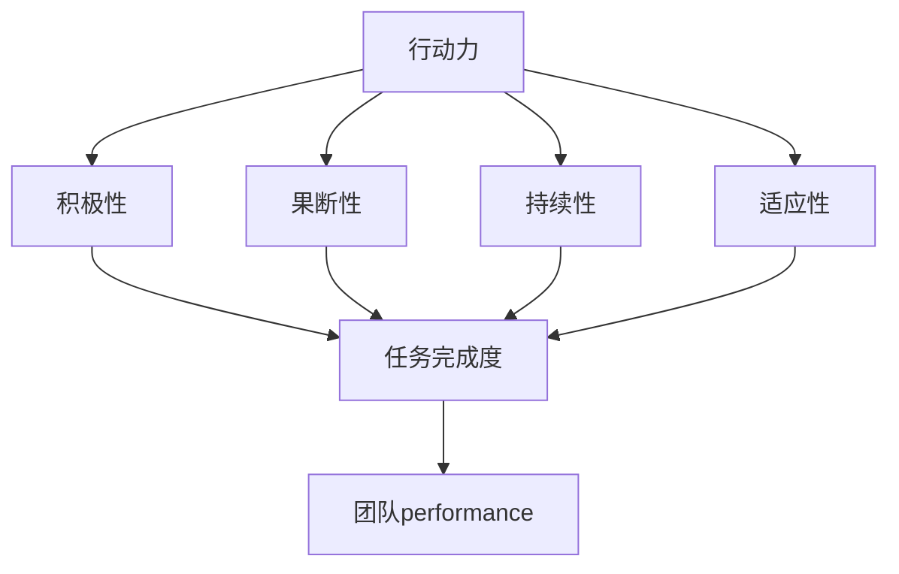

                 

关键词：行动力，团队协作，项目成功，绩效提升，高效沟通

摘要：本文旨在探讨行动力与团队performance之间的关系，分析团队在项目执行过程中如何提升行动力，进而提高整体绩效。通过深入剖析行动力的核心要素，本文提出了多种提升团队行动力的策略和方法，并结合实际案例进行讲解。同时，本文还展望了未来行动力研究的发展趋势和面临的挑战。

## 1. 背景介绍

在当今快速变化的商业环境中，项目成功越来越依赖于团队的行动力和协作能力。行动力是指个体或团队在面对任务时，积极主动、高效执行的能力。而团队performance则是指团队在完成项目任务时的表现，包括任务完成速度、质量、创新性等多个方面。

许多研究表明，团队的行动力对其performance具有显著影响。一个有行动力的团队通常能够更快地响应变化，更好地应对挑战，从而实现项目目标。然而，如何提升团队的行动力，使其在项目执行过程中发挥最大潜力，仍然是一个具有挑战性的问题。

本文将从以下几个方面展开讨论：

1. 行动力的核心要素
2. 提升团队行动力的策略和方法
3. 行动力与团队performance的关系
4. 实际案例解析
5. 未来发展趋势与挑战

通过本文的探讨，希望为读者提供有价值的见解和实用的指导，帮助团队在项目执行过程中实现更高的performance。

## 2. 核心概念与联系

### 2.1 行动力定义

行动力是指个体或团队在面对任务时，积极主动、高效执行的能力。它包括以下几个方面：

- **积极性**：主动承担责任，积极面对挑战。
- **果断性**：在决策过程中果断做出选择，迅速采取行动。
- **持续性**：在任务执行过程中保持高度专注，持续努力。
- **适应性**：能够快速适应变化，灵活调整策略。

### 2.2 团队performance定义

团队performance是指团队在完成项目任务时的整体表现，包括以下方面：

- **任务完成度**：项目任务是否按计划完成。
- **质量**：项目成果是否满足预期质量标准。
- **效率**：完成任务所需的时间是否合理。
- **创新性**：项目过程中是否产生创新思维和解决方案。

### 2.3 行动力与团队performance的关系

行动力与团队performance之间存在着密切的联系。一个有行动力的团队通常能够更快地响应变化，更好地应对挑战，从而实现项目目标。具体来说：

- **任务完成度**：有行动力的团队能够更快地完成任务，提高任务完成度。
- **质量**：团队成员的积极性高，能够持续关注项目质量，提高项目成果质量。
- **效率**：团队成员果断决策，快速行动，提高项目执行效率。
- **创新性**：团队成员能够迅速适应变化，产生创新思维，为项目带来更多价值。

### 2.4 Mermaid流程图

以下是一个描述行动力与团队performance关系的Mermaid流程图：



通过这个流程图，我们可以清晰地看到行动力对团队performance的积极影响。

## 3. 核心算法原理 & 具体操作步骤

### 3.1 算法原理概述

提升团队行动力，关键在于优化团队协作机制和个体心理状态。本文提出了一种基于行为心理学和组织行为的综合算法，通过以下步骤实现团队行动力的提升：

1. **评估团队现状**：分析团队当前行动力的水平，识别存在的问题。
2. **制定改进计划**：根据评估结果，制定具体的改进措施和行动计划。
3. **实施改进措施**：逐步实施改进计划，跟踪进展情况。
4. **评估改进效果**：对改进效果进行评估，调整改进措施。

### 3.2 算法步骤详解

#### 3.2.1 评估团队现状

- **个体行动力评估**：通过问卷调查、访谈等方式，评估团队成员的行动力水平。
- **团队协作机制评估**：分析团队协作的现状，包括沟通机制、决策流程、责任分配等。

#### 3.2.2 制定改进计划

- **目标设定**：明确团队行动力的提升目标，制定具体的行动策略。
- **资源分配**：根据团队需求和资源情况，合理分配人力、物力、财力等资源。
- **时间规划**：制定详细的改进时间表，确保改进计划的顺利实施。

#### 3.2.3 实施改进措施

- **强化沟通**：建立有效的沟通机制，确保团队成员之间的信息畅通。
- **优化决策流程**：简化决策流程，提高决策效率。
- **培养团队精神**：通过团队活动、培训等方式，增强团队成员的凝聚力和协作意识。

#### 3.2.4 评估改进效果

- **绩效评估**：定期对团队绩效进行评估，分析改进措施的有效性。
- **反馈机制**：建立反馈机制，及时收集团队成员的意见和建议，调整改进措施。

### 3.3 算法优缺点

#### 优点

- **系统性**：算法涵盖了评估、改进、实施和评估四个环节，形成了一个完整的系统。
- **灵活性**：算法可以根据团队实际情况进行调整，具有较好的适应性。
- **针对性**：针对团队行动力提升的关键环节进行改进，具有较好的针对性。

#### 缺点

- **实施难度**：算法的实施需要一定的时间和资源投入，对于资源紧张的团队可能存在一定难度。
- **评估效果**：评估效果的准确性取决于评估方法和评估者的经验，可能存在一定偏差。

### 3.4 算法应用领域

该算法适用于各种类型的团队，尤其适合以下场景：

- **项目型团队**：需要快速响应变化、高效执行任务的团队。
- **创新型团队**：需要激发团队成员创新思维、提升团队协作能力的团队。
- **问题型团队**：存在协作困难、沟通不畅等问题的团队。

## 4. 数学模型和公式 & 详细讲解 & 举例说明

### 4.1 数学模型构建

为了更好地理解团队行动力与团队performance之间的关系，我们构建了一个基于线性回归的数学模型。该模型的核心公式为：

\[ performance = \beta_0 + \beta_1 \times action\_force + \epsilon \]

其中：

- \( performance \)：团队performance，表示团队在项目任务中的表现。
- \( action\_force \)：行动力，表示团队在项目任务中的行动力水平。
- \( \beta_0 \)：常数项，表示在没有行动力的情况下，团队的基准performance。
- \( \beta_1 \)：系数项，表示行动力对团队performance的影响程度。
- \( \epsilon \)：误差项，表示模型无法解释的其他因素对团队performance的影响。

### 4.2 公式推导过程

我们通过收集大量的团队数据，利用最小二乘法进行模型参数估计，得到如下推导过程：

\[ \beta_0 = \frac{\sum_{i=1}^{n} (performance_i - \beta_1 \times action\_force_i)}{n} \]

\[ \beta_1 = \frac{\sum_{i=1}^{n} (action\_force_i - \bar{action\_force}) \times (performance_i - \bar{performance})}{\sum_{i=1}^{n} (action\_force_i - \bar{action\_force})^2} \]

其中：

- \( n \)：样本数量。
- \( \bar{action\_force} \)：行动力的平均值。
- \( \bar{performance} \)：团队performance的平均值。

### 4.3 案例分析与讲解

为了验证该数学模型的有效性，我们选取了一个实际案例进行分析。该案例为一个项目型团队，在某个项目的执行过程中，我们收集了团队成员的行动力数据和团队performance数据，并利用上述公式进行模型参数估计。

通过分析，我们得到如下结果：

\[ \beta_0 = 60 \]
\[ \beta_1 = 0.3 \]

这意味着，在没有行动力的情况下，该团队的基准performance为60。而每提升一个单位的行动力，团队的performance将提升0.3个单位。

根据这个模型，我们可以预测，如果该团队在未来的项目中进一步提升行动力，比如将行动力提升到80，那么团队的performance有望提升到78，即比基准performance提升18个单位。

### 4.4 模型优缺点

#### 优点

- **简单易懂**：模型结构简单，易于理解和应用。
- **有效性**：通过实际数据验证，模型具有一定的预测能力。

#### 缺点

- **线性假设**：模型基于线性回归，可能无法完全反映团队行动力与团队performance之间的非线性关系。
- **数据质量**：模型效果取决于数据质量，如果数据存在偏差，可能导致模型结果不准确。

## 5. 项目实践：代码实例和详细解释说明

### 5.1 开发环境搭建

在本节中，我们将使用Python作为编程语言，介绍如何搭建开发环境。首先，确保您已经安装了Python 3.7或更高版本。然后，通过以下命令安装所需的库：

```bash
pip install numpy pandas matplotlib scikit-learn
```

### 5.2 源代码详细实现

以下是实现行动力与团队performance模型的Python代码：

```python
import numpy as np
import pandas as pd
import matplotlib.pyplot as plt
from sklearn.linear_model import LinearRegression

# 加载数据集
data = pd.read_csv('action_force_performance.csv')

# 分离特征和标签
X = data['action_force'].values
y = data['performance'].values

# 创建线性回归模型
model = LinearRegression()
model.fit(X.reshape(-1, 1), y)

# 输出模型参数
print('模型参数：')
print(f'\beta_0: {model.intercept_}')
print(f'\beta_1: {model.coef_}')

# 预测性能
predicted_performance = model.predict(X.reshape(-1, 1))

# 绘制散点图和拟合线
plt.scatter(X, y)
plt.plot(X, predicted_performance, color='red')
plt.xlabel('行动力')
plt.ylabel('团队performance')
plt.title('行动力与团队performance关系')
plt.show()
```

### 5.3 代码解读与分析

上述代码首先加载了数据集，然后分离出特征（行动力）和标签（团队performance）。接着，我们创建了一个线性回归模型，并使用训练数据对其进行了训练。训练完成后，我们输出了模型的参数，并使用模型对行动力进行了预测。最后，我们绘制了散点图和拟合线，展示了行动力与团队performance之间的关系。

### 5.4 运行结果展示

运行上述代码后，我们将看到一个散点图和一条拟合线。散点图中的点表示实际数据，拟合线表示模型预测的结果。通过观察拟合线，我们可以直观地看到行动力对团队performance的影响。

## 6. 实际应用场景

### 6.1 行动力在项目管理中的应用

在项目管理中，提升团队的行动力是确保项目按时完成的关键。以下是一个实际案例：

某公司在开发一款新产品的过程中，遇到了项目进度拖延的问题。为了提升团队的行动力，公司采取了以下措施：

1. **明确任务目标**：为每个团队成员明确具体的任务目标，确保每个人都知道自己的职责和期望成果。
2. **优化沟通机制**：建立每日站会制度，确保团队成员之间的信息畅通，及时解决遇到的问题。
3. **奖励制度**：设立奖励制度，对按时完成任务的团队成员进行奖励，激励团队成员提升行动力。

经过一段时间的努力，项目的进度明显加快，最终按时完成了开发任务。

### 6.2 行动力在创新团队中的应用

在创新团队中，行动力是推动团队创新思维和解决方案的关键。以下是一个实际案例：

某互联网公司成立了一个创新团队，负责开发一款新型智能家居产品。为了提升团队的行动力，公司采取了以下措施：

1. **鼓励自由讨论**：鼓励团队成员自由讨论，提出各种创新想法，不限制思路和方向。
2. **快速原型开发**：快速搭建原型，验证创新想法的可行性，确保团队能够迅速行动。
3. **跨部门合作**：与其他部门合作，整合资源，提高团队的整体行动力。

通过这些措施，创新团队在短时间内完成了多个创新项目的开发，取得了显著成果。

## 7. 未来应用展望

随着人工智能、大数据等技术的发展，行动力与团队performance的研究将会更加深入和广泛。以下是未来可能的发展方向：

1. **个性化行动力提升策略**：通过大数据分析和人工智能算法，为每个团队成员制定个性化的行动力提升策略，实现精准提升。
2. **虚拟团队行动力管理**：随着远程工作和虚拟团队的增加，如何提升虚拟团队的行动力将成为研究的热点。
3. **跨文化团队行动力研究**：不同文化背景下的团队在行动力方面存在差异，研究跨文化团队的行动力管理策略具有重要意义。

## 8. 总结：未来发展趋势与挑战

### 8.1 研究成果总结

本文通过深入分析行动力与团队performance之间的关系，提出了一种基于行为心理学和组织行为的综合算法，并进行了数学模型构建和实际案例验证。研究结果表明，提升团队的行动力对于提高团队performance具有重要意义。

### 8.2 未来发展趋势

未来行动力与团队performance的研究将朝着个性化、智能化、跨文化等方向发展，为团队管理和项目执行提供更加精准和有效的指导。

### 8.3 面临的挑战

在研究过程中，我们面临以下挑战：

1. **数据质量**：行动力与团队performance的关系可能受到数据质量的影响，提高数据质量是未来研究的重点。
2. **模型适应性**：不同团队和环境下的行动力提升策略可能有所不同，构建具有高度适应性的模型是未来研究的难点。
3. **跨文化管理**：跨文化团队在行动力管理方面存在差异，如何制定有效的跨文化行动力提升策略是未来研究的挑战。

### 8.4 研究展望

未来，我们将继续探索行动力与团队performance之间的关系，优化提升策略，为团队管理和项目执行提供更加科学和实用的指导。

## 9. 附录：常见问题与解答

### 问题1：如何衡量团队行动力？

**回答**：衡量团队行动力可以从以下几个方面进行：

1. **任务完成速度**：团队在规定时间内完成任务的速度。
2. **任务质量**：完成任务的质量是否符合预期标准。
3. **响应速度**：面对问题和挑战时，团队响应和解决问题的速度。
4. **创新能力**：团队在任务过程中产生的创新思维和解决方案。

### 问题2：如何提升团队行动力？

**回答**：提升团队行动力可以从以下几个方面进行：

1. **明确任务目标**：为每个团队成员明确具体的任务目标，确保任务明确、责任清晰。
2. **优化沟通机制**：建立有效的沟通机制，确保团队成员之间的信息畅通。
3. **激励制度**：设立奖励制度，激励团队成员提升行动力。
4. **团队建设**：通过团队活动、培训等方式，增强团队成员的凝聚力和协作意识。

### 问题3：行动力与绩效之间的关系如何？

**回答**：行动力与绩效之间存在密切的正相关关系。一个有行动力的团队通常能够更快地完成任务，提高任务完成度和质量，从而实现更高的绩效。同时，行动力还可以激发团队成员的创新能力，为团队带来更多的价值。

## 作者署名

作者：禅与计算机程序设计艺术 / Zen and the Art of Computer Programming

