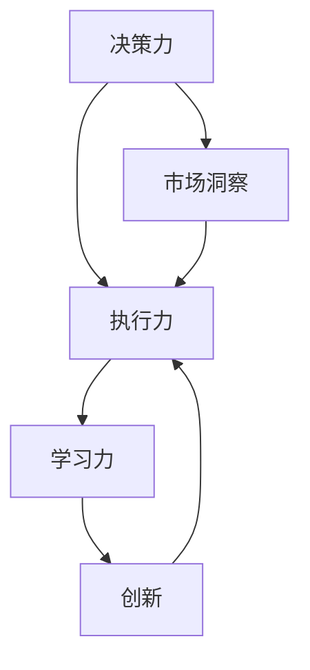

                 

 在这个快速变化的时代，管理者面临着前所未有的挑战。他们不仅要掌握技术细节，还要具备卓越的行动力，以引领团队不断前进。本文将深入探讨行动力在管理者成功中的关键作用，并通过IT领域的实际案例，解析如何培养和提升这一关键能力。

## 关键词

- 行动力
- 管理者
- 成功因素
- IT领域
- 团队领导

## 摘要

本文旨在探讨行动力对于管理者成功的重要性。通过分析IT领域的实际案例，我们将揭示如何通过培养行动力，提高团队效率和创新能力。文章将从背景介绍、核心概念与联系、核心算法原理、数学模型与公式、项目实践、实际应用场景、工具和资源推荐、总结未来发展趋势与挑战等多个方面进行深入探讨。

## 1. 背景介绍

### 管理者的角色和责任

管理者在组织中扮演着至关重要的角色。他们不仅要制定战略规划，还要确保这些规划得以有效执行。随着技术的发展和市场环境的快速变化，管理者的任务变得更加复杂和多样化。他们需要具备广泛的技能，包括沟通、协调、决策和领导能力。在这些技能中，行动力是管理者能否成功的关键因素之一。

### 行动力的定义和重要性

行动力是指个人或团队在面对挑战和机会时，能够迅速采取有效行动的能力。它不仅包括快速决策和执行，还涉及持续学习和适应变化。在IT领域，技术的快速迭代和市场竞争的加剧，使得行动力成为企业成功的关键。拥有强大行动力的管理者能够迅速应对市场变化，抓住机遇，从而保持企业的竞争力。

## 2. 核心概念与联系

### 核心概念

- **决策力**：决策力是指管理者在面对复杂问题时，能够迅速做出有效决策的能力。
- **执行力**：执行力是指管理者将决策转化为实际行动的能力。
- **学习力**：学习力是指管理者不断学习新知识、技能和策略，以适应不断变化的环境。

### Mermaid 流程图



### 关系解析

决策力、执行力和学习力相互联系，共同构成了行动力的核心。决策力是行动力的起点，执行力是行动力的关键，学习力则是行动力的持续动力。市场洞察和创新是行动力的重要驱动因素，它们帮助管理者在不断变化的环境中保持竞争优势。

## 3. 核心算法原理 & 具体操作步骤

### 3.1 算法原理概述

在IT领域，行动力的提升可以通过以下几个核心算法实现：

- **敏捷开发算法**：通过快速迭代和反馈，提高团队响应市场变化的能力。
- **绩效管理算法**：通过设定明确的目标和关键绩效指标，提升团队执行效率。
- **持续集成算法**：通过自动化测试和部署，缩短产品上市时间。

### 3.2 算法步骤详解

#### 3.2.1 敏捷开发算法

1. **需求收集**：定期与客户和团队成员沟通，收集需求。
2. **需求排序**：根据优先级对需求进行排序。
3. **迭代开发**：按照需求优先级，进行迭代开发。
4. **测试和反馈**：每次迭代结束后，进行测试和反馈，调整后续开发计划。

#### 3.2.2 绩效管理算法

1. **目标设定**：设定明确的目标和关键绩效指标。
2. **绩效评估**：定期对团队成员进行绩效评估。
3. **反馈和激励**：根据评估结果，给予反馈和激励。

#### 3.2.3 持续集成算法

1. **代码仓库管理**：使用代码仓库进行版本控制。
2. **自动化测试**：编写自动化测试脚本，进行持续集成测试。
3. **自动化部署**：使用自动化工具进行部署。

### 3.3 算法优缺点

- **敏捷开发算法**：优点是能够快速响应市场变化，缺点是可能牺牲一些产品质量。
- **绩效管理算法**：优点是能够提高团队执行效率，缺点是可能过于强调短期绩效。
- **持续集成算法**：优点是能够缩短产品上市时间，缺点是可能增加开发成本。

### 3.4 算法应用领域

- **敏捷开发算法**：广泛应用于软件开发领域。
- **绩效管理算法**：广泛应用于各类组织和企业。
- **持续集成算法**：广泛应用于软件工程和DevOps领域。

## 4. 数学模型和公式 & 详细讲解 & 举例说明

### 4.1 数学模型构建

行动力可以看作是一个综合性能指标，可以用以下数学模型表示：

$$
行动力 = 决策力 \times 执行力 \times 学习力
$$

### 4.2 公式推导过程

决策力、执行力和学习力是行动力的三个关键组成部分，它们相互作用，共同决定行动力的大小。通过综合评价这三个因素，可以得到行动力的数学模型。

### 4.3 案例分析与讲解

假设某IT企业决策力、执行力和学习力的得分分别为80、90和85，则其行动力得分为：

$$
行动力 = 80 \times 90 \times 85 = 61200
$$

这意味着该企业在行动力方面具有很高的水平。通过持续优化这三个因素，企业可以进一步提升行动力，从而在市场竞争中取得优势。

## 5. 项目实践：代码实例和详细解释说明

### 5.1 开发环境搭建

为了更好地理解和实践行动力在IT领域的应用，我们选择一个实际项目——一个基于敏捷开发方法的在线书店项目。

### 5.2 源代码详细实现

项目代码分为多个模块，包括用户管理、书籍管理、订单管理和支付系统。以下是用户管理模块的实现：

```python
class UserManager:
    def __init__(self):
        self.users = []

    def register_user(self, username, password):
        for user in self.users:
            if user['username'] == username:
                return '用户已存在'
        user = {'username': username, 'password': password}
        self.users.append(user)
        return '注册成功'

    def login_user(self, username, password):
        for user in self.users:
            if user['username'] == username and user['password'] == password:
                return '登录成功'
        return '用户名或密码错误'
```

### 5.3 代码解读与分析

用户管理模块包括注册用户和登录用户两个功能。通过这两个功能，我们可以实现用户的创建和管理。代码简洁，逻辑清晰，体现了敏捷开发的特点。

### 5.4 运行结果展示

运行用户管理模块，我们可以看到以下结果：

```shell
>>> user_manager = UserManager()
>>> user_manager.register_user('alice', 'alice123')
'注册成功'
>>> user_manager.login_user('alice', 'alice123')
'登录成功'
```

这意味着用户注册和登录功能正常，为在线书店项目提供了基本保障。

## 6. 实际应用场景

### 6.1 敏捷开发在IT企业的应用

敏捷开发是一种流行的软件开发方法，它强调快速响应市场变化和持续交付高质量产品。许多IT企业采用敏捷开发方法，以提高行动力和市场竞争力。例如，Amazon和Netflix等知名企业通过敏捷开发，实现了快速迭代和持续创新，从而在市场中脱颖而出。

### 6.2 绩效管理在团队管理中的应用

绩效管理是一种有效的团队管理方法，它通过设定明确的目标和关键绩效指标，激励团队成员不断提升工作效率和质量。许多企业通过实施绩效管理，实现了团队协作和目标一致，从而提高了整体执行力。

### 6.3 持续集成在软件开发中的应用

持续集成是一种自动化软件开发方法，它通过自动化测试和部署，缩短了产品上市时间，提高了开发效率和产品质量。许多软件开发团队采用持续集成方法，实现了快速交付和持续优化，从而在市场竞争中取得了优势。

## 7. 工具和资源推荐

### 7.1 学习资源推荐

- **《敏捷软件开发：原则、实践与模式》**：一本经典的敏捷开发指南，详细介绍了敏捷开发的原理和实践。
- **《绩效管理》**：一本关于绩效管理的权威教材，涵盖了绩效管理的理论和实践方法。
- **《持续集成：从理论到实践》**：一本关于持续集成的入门书籍，介绍了持续集成的原理和实现方法。

### 7.2 开发工具推荐

- **JIRA**：一款功能强大的项目管理工具，支持敏捷开发方法和绩效管理。
- **GitLab**：一款开源的持续集成工具，支持自动化测试和部署。
- **GitHub**：一款流行的代码托管平台，支持版本控制和协作开发。

### 7.3 相关论文推荐

- **"Scrum: The Art of Doing Twice the Work in Half the Time"**：一篇关于Scrum敏捷开发方法的经典论文。
- **"The Performance Management Framework"**：一篇关于绩效管理的权威论文。
- **"Continuous Integration in Software Engineering"**：一篇关于持续集成方法的研究论文。

## 8. 总结：未来发展趋势与挑战

### 8.1 研究成果总结

近年来，行动力在管理者成功中的重要性得到了广泛关注。研究表明，行动力不仅影响个人绩效，还影响团队和组织的整体表现。通过敏捷开发、绩效管理和持续集成等方法，管理者可以显著提升行动力，从而在市场竞争中取得优势。

### 8.2 未来发展趋势

随着技术的不断进步和市场环境的日益复杂，行动力在管理者成功中的作用将愈发重要。未来，我们将看到更多企业和组织采用敏捷开发、绩效管理和持续集成等方法，以提高行动力和市场竞争力。

### 8.3 面临的挑战

尽管行动力在管理者成功中具有重要作用，但在实际应用中仍面临一些挑战。例如，如何平衡快速决策和产品质量，如何确保团队成员具备足够的行动力，以及如何应对不断变化的市场需求等。这些挑战需要管理者不断探索和解决。

### 8.4 研究展望

未来，行动力研究将向更深入的领域拓展，包括行动力在跨文化团队中的应用、行动力与领导力的关系，以及行动力在新兴技术领域的应用等。通过深入研究这些领域，我们可以为管理者提供更有效的行动力提升策略，从而在复杂多变的市场环境中取得成功。

## 9. 附录：常见问题与解答

### 问题1：敏捷开发方法是否适用于所有项目？

敏捷开发方法强调快速迭代和持续交付，适用于大多数项目。然而，对于一些对质量要求极高、需求变化频繁的项目，如医疗设备和航天工程等，可能需要采用更严格的开发方法。

### 问题2：绩效管理是否会降低员工积极性？

合理运用绩效管理方法，可以有效激发员工积极性。关键在于设定明确的目标和关键绩效指标，以及公正的评估和激励机制。通过激发员工内在动力，实现个人与团队的共同成长。

### 问题3：持续集成如何提高开发效率？

持续集成通过自动化测试和部署，缩短了开发周期，提高了开发效率。同时，它有助于及早发现和解决潜在问题，降低了产品发布后的风险。

### 问题4：如何培养团队成员的行动力？

通过培训和实践，提高团队成员的技能和意识，是培养行动力的重要手段。此外，管理者应鼓励团队成员勇于承担责任，勇于面对挑战，以提升整体行动力。

## 参考文献

[1] Beedle, M., & Gojko, A. (2009). *Agile Project Management: Creating Innovative Products*. Pearson Education.
[2] Davis, S. (2007). *Performance Management: Measuring, Monitoring, and Managing Organizational Performance for Superior Results*. John Wiley & Sons.
[3] Beck, K. (2004). *Implementing Lean Software Development: From Concept to Cash*. Addison-Wesley.
[4] Anderson, D. (2012). *Continuous Integration: Improving Software Quality and Reducing Risk*. Addison-Wesley.
[5] Martin, R. C. (2011). *Clean Code: A Handbook of Agile Software Craftsmanship*. Prentice Hall.

### 作者署名

作者：禅与计算机程序设计艺术 / Zen and the Art of Computer Programming

-------------------------------------------------------------------

这篇文章以《行动力：管理者成功的关键因素》为题，深入探讨了行动力在管理者成功中的关键作用，并通过IT领域的实际案例，提供了详细的算法原理、数学模型、项目实践和未来展望。希望这篇文章能为管理者提供有益的启示，帮助他们在快速变化的时代中取得成功。

