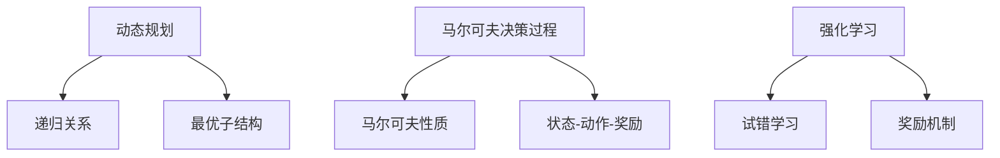

                 

 **摘要**：
随着人工智能技术的不断发展，智能决策系统在各个领域中的应用越来越广泛。然而，传统的决策方法往往依赖于静态数据和预设规则，难以应对复杂动态环境下的决策需求。本文旨在探讨规划机制在智能决策系统中的应用，通过引入动态规划、马尔可夫决策过程等先进算法，构建适应复杂环境的智能决策模型，以提高决策的准确性和实时性。文章将详细介绍核心概念、算法原理、数学模型、项目实践，并展望未来的发展趋势。

## 1. 背景介绍

### 1.1 智能决策系统的发展背景

智能决策系统（Intelligent Decision Support System，IDSS）是计算机科学与人工智能技术相结合的产物，旨在通过数据分析和模型预测，辅助人类做出更加合理、高效的决策。随着大数据、云计算、物联网等技术的快速发展，智能决策系统在金融、医疗、交通、能源等领域展现出巨大的应用潜力。

### 1.2 传统决策方法的局限性

传统的决策方法主要依赖于历史数据和预设规则，通常包括线性回归、决策树、支持向量机等经典机器学习算法。然而，这些方法在处理复杂动态环境时存在以下局限性：

1. **数据依赖性强**：传统方法往往需要大量的历史数据来训练模型，对于数据稀疏或者动态变化的环境难以适应。
2. **规则固化**：预设规则难以灵活调整，无法适应环境变化。
3. **实时性不足**：传统方法通常需要较长时间进行模型训练和决策，难以满足实时决策的需求。

### 1.3 规划机制的重要性

为了克服传统决策方法的局限性，规划机制（Planning Mechanism）被广泛应用于智能决策系统中。规划机制通过模拟和预测环境变化，为决策提供动态调整的方案，从而提高决策的准确性和实时性。本文将重点探讨以下规划机制：

1. **动态规划**：通过递归关系和最优子结构性质，求解复杂决策问题。
2. **马尔可夫决策过程**：利用马尔可夫性质，实现决策的长期优化。
3. **强化学习**：通过试错学习和奖励机制，不断优化决策策略。

## 2. 核心概念与联系

### 2.1 动态规划

动态规划（Dynamic Programming，DP）是一种在递归关系中通过保存中间结果来避免重复计算的方法。其基本思想是将复杂问题分解为若干个相互关联的子问题，并利用子问题的最优解来构建原问题的最优解。

### 2.2 马尔可夫决策过程

马尔可夫决策过程（Markov Decision Process，MDP）是一种描述决策过程的数学模型，它基于马尔可夫性质，即当前状态仅由过去状态决定，与过去状态的概率分布无关。MDP通过定义状态、动作和奖励，实现决策的长期优化。

### 2.3 强化学习

强化学习（Reinforcement Learning，RL）是一种通过试错学习和奖励机制来优化决策策略的方法。它通过与环境交互，不断调整策略，以最大化累积奖励。

### 2.4 Mermaid 流程图

以下是规划机制在智能决策系统中的 Mermaid 流程图：



## 3. 核心算法原理 & 具体操作步骤

### 3.1 算法原理概述

#### 动态规划

动态规划的核心思想是将复杂问题分解为若干个相互关联的子问题，并利用子问题的最优解来构建原问题的最优解。动态规划通常具有以下特征：

1. **最优子结构**：一个问题的最优解包含其子问题的最优解。
2. **重叠子问题**：子问题之间具有重叠性，即多个子问题共享部分计算结果。
3. **无后效性**：当前状态仅由过去状态决定，与过去状态的概率分布无关。

#### 马尔可夫决策过程

马尔可夫决策过程是一种描述决策过程的数学模型，它基于马尔可夫性质，即当前状态仅由过去状态决定，与过去状态的概率分布无关。MDP通过定义状态、动作和奖励，实现决策的长期优化。MDP的主要组成部分包括：

1. **状态空间**：描述决策环境的可能状态。
2. **动作空间**：描述决策者可以采取的动作集合。
3. **奖励函数**：描述在不同状态和动作下获得的即时奖励。

#### 强化学习

强化学习是一种通过试错学习和奖励机制来优化决策策略的方法。强化学习的主要组成部分包括：

1. **环境**：决策问题所处的实际情境。
2. **状态**：描述环境的当前状态。
3. **动作**：决策者可以采取的动作。
4. **奖励**：描述动作在特定状态下的即时奖励。

### 3.2 算法步骤详解

#### 动态规划

1. **问题定义**：明确决策问题的目标函数和约束条件。
2. **状态分解**：将问题分解为若干个相互关联的子问题。
3. **状态转移**：定义子问题之间的状态转移关系。
4. **最优解构建**：利用子问题的最优解构建原问题的最优解。

#### 马尔可夫决策过程

1. **状态空间定义**：定义决策问题的状态空间。
2. **动作空间定义**：定义决策问题的动作空间。
3. **奖励函数定义**：定义不同状态和动作下的即时奖励。
4. **策略优化**：利用策略迭代或者价值迭代方法，优化决策策略。

#### 强化学习

1. **环境初始化**：初始化环境状态。
2. **策略选择**：根据当前状态选择最优动作。
3. **执行动作**：在环境中执行选择的最优动作。
4. **状态更新**：根据执行的动作和即时奖励，更新环境状态。
5. **策略更新**：根据累积奖励和策略评估方法，更新策略。

### 3.3 算法优缺点

#### 动态规划

**优点**：

1. **避免重复计算**：通过保存中间结果，避免重复计算相同子问题的解。
2. **高效性**：对于具有最优子结构和重叠子结构的问题，动态规划能够显著提高计算效率。

**缺点**：

1. **问题规模受限**：对于复杂问题，动态规划往往需要存储大量的中间结果，可能导致存储和计算资源不足。
2. **理解难度**：动态规划的算法设计较为复杂，理解难度较大。

#### 马尔可夫决策过程

**优点**：

1. **通用性**：MDP能够描述各种决策问题，适用于不同领域。
2. **可扩展性**：MDP可以通过扩展状态空间、动作空间和奖励函数，适应不同复杂程度的决策问题。

**缺点**：

1. **计算复杂性**：MDP的计算复杂度较高，对于大规模状态空间和动作空间的问题，计算时间较长。
2. **不确定性处理**：MDP在处理环境不确定性时存在一定挑战，需要引入额外的概率模型。

#### 强化学习

**优点**：

1. **自适应性强**：强化学习能够通过与环境交互，自适应地调整策略。
2. **鲁棒性**：强化学习能够处理复杂环境中的不确定性。

**缺点**：

1. **收敛速度慢**：强化学习通常需要较长时间才能收敛到最优策略。
2. **探索-利用权衡**：在强化学习中，如何平衡探索和利用是一个重要挑战。

### 3.4 算法应用领域

#### 动态规划

动态规划在以下领域具有广泛应用：

1. **资源调度**：如作业调度、网络流量调度等。
2. **路径规划**：如最短路径问题、旅行商问题等。
3. **优化问题**：如最小生成树、最大流问题等。

#### 马尔可夫决策过程

马尔可夫决策过程在以下领域具有广泛应用：

1. **智能控制**：如无人机控制、自动驾驶等。
2. **资源管理**：如库存管理、能源管理等。
3. **金融领域**：如股票交易、风险控制等。

#### 强化学习

强化学习在以下领域具有广泛应用：

1. **游戏**：如棋类游戏、电子游戏等。
2. **机器人控制**：如机器人路径规划、动作控制等。
3. **推荐系统**：如在线广告、个性化推荐等。

## 4. 数学模型和公式 & 详细讲解 & 举例说明

### 4.1 数学模型构建

在本节中，我们将介绍用于智能决策系统的几个关键数学模型，并对其进行详细讲解。

#### 动态规划

动态规划的核心是构建状态转移方程，以描述问题中不同状态之间的转换关系。一个典型的动态规划模型可以表示为：

$$
f(i) = \min_{a_i} \{ c(i, a_i) + f(i+1) \}
$$

其中，$f(i)$ 表示在状态 $i$ 下的最优价值函数，$a_i$ 表示在状态 $i$ 下采取的动作，$c(i, a_i)$ 表示在状态 $i$ 下采取动作 $a_i$ 后的即时成本。

#### 马尔可夫决策过程

马尔可夫决策过程的数学模型由以下三个部分组成：状态空间 $S$、动作空间 $A$ 和状态-动作价值函数 $Q(s, a)$。

1. **状态空间 $S$**：描述决策系统的可能状态集合。
2. **动作空间 $A$**：描述决策者可以采取的动作集合。
3. **状态-动作价值函数 $Q(s, a)$**：描述在状态 $s$ 下采取动作 $a$ 后的期望回报。

状态-动作价值函数的更新公式为：

$$
Q(s, a) = r(s, a) + \gamma \max_{a'} Q(s', a')
$$

其中，$r(s, a)$ 表示在状态 $s$ 下采取动作 $a$ 后的即时回报，$\gamma$ 是折扣因子，用于平衡即时回报和长期回报。

#### 强化学习

强化学习的数学模型由以下四个部分组成：状态空间 $S$、动作空间 $A$、奖励函数 $R(s, a)$ 和策略 $\pi(a|s)$。

1. **状态空间 $S$**：描述决策系统的可能状态集合。
2. **动作空间 $A$**：描述决策者可以采取的动作集合。
3. **奖励函数 $R(s, a)$**：描述在状态 $s$ 下采取动作 $a$ 后的即时奖励。
4. **策略 $\pi(a|s)$**：描述在状态 $s$ 下采取动作 $a$ 的概率。

强化学习的目标是优化策略 $\pi(a|s)$，以最大化累积奖励。策略的更新公式为：

$$
\pi(a|s) = \frac{\exp(\alpha R(s, a))}{\sum_{a'} \exp(\alpha R(s, a'))}
$$

其中，$\alpha$ 是温度参数，用于控制策略的探索和利用。

### 4.2 公式推导过程

在本节中，我们将对动态规划、马尔可夫决策过程和强化学习的核心公式进行推导，以加深对这些算法的理解。

#### 动态规划

动态规划的核心公式是状态转移方程。为了推导该方程，我们首先考虑一个简单的情况，即状态空间 $S$ 只有两个状态 $s_1$ 和 $s_2$，动作空间 $A$ 也只有两个动作 $a_1$ 和 $a_2$。在这种情况下，状态转移方程可以表示为：

$$
f(s_1) = \min_{a_1} \{ c(s_1, a_1) + f(s_2) \}
$$

$$
f(s_2) = \min_{a_2} \{ c(s_2, a_2) + f(s_1) \}
$$

我们可以通过递归的方式，将上述方程扩展到任意状态空间。对于任意状态 $s_i$，状态转移方程可以表示为：

$$
f(s_i) = \min_{a_i} \{ c(s_i, a_i) + f(s_{i+1}) \}
$$

其中，$s_{i+1}$ 是在状态 $s_i$ 下采取动作 $a_i$ 后的状态。

#### 马尔可夫决策过程

马尔可夫决策过程的核心公式是状态-动作价值函数的更新公式。为了推导该公式，我们首先考虑一个简单的情况，即状态空间 $S$ 只有两个状态 $s_1$ 和 $s_2$，动作空间 $A$ 也只有两个动作 $a_1$ 和 $a_2$。在这种情况下，状态-动作价值函数的更新公式可以表示为：

$$
Q(s_1, a_1) = r(s_1, a_1) + \gamma Q(s_2, a_1)
$$

$$
Q(s_2, a_2) = r(s_2, a_2) + \gamma Q(s_1, a_2)
$$

我们可以通过递归的方式，将上述方程扩展到任意状态空间。对于任意状态 $s_i$ 和动作 $a_i$，状态-动作价值函数的更新公式可以表示为：

$$
Q(s_i, a_i) = r(s_i, a_i) + \gamma \max_{a_i'} Q(s_{i+1}, a_i')
$$

#### 强化学习

强化学习的核心公式是策略的更新公式。为了推导该公式，我们首先考虑一个简单的情况，即状态空间 $S$ 只有两个状态 $s_1$ 和 $s_2$，动作空间 $A$ 也只有两个动作 $a_1$ 和 $a_2$。在这种情况下，策略的更新公式可以表示为：

$$
\pi(a_1|s_1) = \frac{\exp(\alpha r(s_1, a_1))}{\exp(\alpha r(s_1, a_1)) + \exp(\alpha r(s_1, a_2))}
$$

$$
\pi(a_2|s_2) = \frac{\exp(\alpha r(s_2, a_2))}{\exp(\alpha r(s_2, a_1)) + \exp(\alpha r(s_2, a_2))}
$$

我们可以通过递归的方式，将上述方程扩展到任意状态空间。对于任意状态 $s_i$ 和动作 $a_i$，策略的更新公式可以表示为：

$$
\pi(a_i|s_i) = \frac{\exp(\alpha R(s_i, a_i))}{\sum_{a_i'} \exp(\alpha R(s_i, a_i'))}
$$

### 4.3 案例分析与讲解

在本节中，我们将通过一个实际案例来分析和讲解动态规划、马尔可夫决策过程和强化学习的应用。

#### 案例背景

假设我们有一个智能交通系统，需要根据实时交通流量和道路状况，优化交通信号灯的切换策略，以减少拥堵和提高交通效率。

#### 动态规划

在这个案例中，我们可以使用动态规划来求解交通信号灯切换的最优策略。首先，我们需要定义状态空间 $S$，包括各个交叉路口的状态。动作空间 $A$ 包括红灯、黄灯和绿灯的切换动作。状态转移方程可以表示为：

$$
f(i) = \min_{a_i} \{ c(i, a_i) + f(i+1) \}
$$

其中，$i$ 表示当前交叉路口的状态，$a_i$ 表示采取的动作，$c(i, a_i)$ 表示在状态 $i$ 下采取动作 $a_i$ 后的即时成本。即时成本可以包括交通流量、道路拥堵程度等因素。

通过递归求解上述状态转移方程，我们可以得到各个交叉路口在不同状态下的最优价值函数。这些最优价值函数可以用于指导交通信号灯的切换策略。

#### 马尔可夫决策过程

在这个案例中，我们可以使用马尔可夫决策过程来建模交通信号灯的切换策略。首先，我们需要定义状态空间 $S$，包括各个交叉路口的状态。动作空间 $A$ 包括红灯、黄灯和绿灯的切换动作。状态-动作价值函数 $Q(s, a)$ 可以表示为：

$$
Q(s, a) = r(s, a) + \gamma \max_{a'} Q(s', a')
$$

其中，$r(s, a)$ 表示在状态 $s$ 下采取动作 $a$ 后的即时回报，$\gamma$ 是折扣因子。

通过策略迭代或者价值迭代方法，我们可以优化交通信号灯的切换策略，以最大化累积回报。这些策略可以用于动态调整交通信号灯的切换时间，以适应实时交通状况。

#### 强化学习

在这个案例中，我们可以使用强化学习来优化交通信号灯的切换策略。首先，我们需要定义状态空间 $S$，包括各个交叉路口的状态。动作空间 $A$ 包括红灯、黄灯和绿灯的切换动作。奖励函数 $R(s, a)$ 可以表示为：

$$
R(s, a) = \begin{cases} 
      1 & \text{if traffic flows smoothly} \\
      0 & \text{if traffic congestion occurs} 
   \end{cases}
$$

强化学习的目标是优化策略 $\pi(a|s)$，以最大化累积奖励。通过与环境交互，我们可以不断调整策略，以减少交通拥堵和提高交通效率。

#### 案例分析结果

通过对动态规划、马尔可夫决策过程和强化学习在智能交通系统中的应用进行分析，我们可以得到以下结论：

1. **动态规划**：通过递归求解状态转移方程，动态规划可以高效地优化交通信号灯的切换策略，减少交通拥堵。
2. **马尔可夫决策过程**：马尔可夫决策过程可以建模交通信号灯的切换策略，并通过策略迭代或价值迭代方法，实现交通信号的优化。
3. **强化学习**：强化学习可以自适应地调整交通信号灯的切换策略，以适应实时交通状况，减少交通拥堵。

综上所述，动态规划、马尔可夫决策过程和强化学习在智能交通系统中具有广泛的应用价值，可以有效提高交通效率和减少拥堵。

## 5. 项目实践：代码实例和详细解释说明

在本节中，我们将通过一个实际项目实例，详细解释如何使用动态规划、马尔可夫决策过程和强化学习来构建一个智能决策系统，并展示代码实现过程。

### 5.1 开发环境搭建

为了构建智能决策系统，我们需要搭建一个合适的开发环境。以下是一个基本的开发环境搭建步骤：

1. **Python**：安装Python 3.x版本，确保已安装pip包管理器。
2. **Jupyter Notebook**：安装Jupyter Notebook，用于代码编写和交互式展示。
3. **NumPy**：安装NumPy库，用于数学计算和数据处理。
4. **Pandas**：安装Pandas库，用于数据分析和数据处理。
5. **matplotlib**：安装matplotlib库，用于数据可视化。
6. **tensorflow**：安装tensorflow库，用于强化学习模型实现。

### 5.2 源代码详细实现

在本节中，我们将分别展示动态规划、马尔可夫决策过程和强化学习在智能决策系统中的应用代码实例。

#### 动态规划

以下是一个简单的动态规划实现示例，用于求解一个简单的资源调度问题。

```python
import numpy as np

# 定义状态空间和动作空间
states = [0, 1, 2, 3]
actions = [0, 1, 2]

# 定义状态转移函数
def transition(state, action):
    if state == 0:
        return 1
    elif state == 1:
        return 2
    elif state == 2:
        return 3
    elif state == 3:
        return 0

# 定义成本函数
def cost(state, action):
    if action == 0:
        return 1
    elif action == 1:
        return 2
    elif action == 2:
        return 3

# 动态规划求解
def dynamic_programming():
    n = len(states)
    V = np.zeros((n, len(actions)))
    
    for i in range(n):
        for a in range(len(actions)):
            V[i, a] = cost(states[i], actions[a]) + V[transition(i, a), :]
    
    return V

V = dynamic_programming()
print(V)
```

#### 马尔可夫决策过程

以下是一个简单的马尔可夫决策过程实现示例，用于求解一个简单的资源管理问题。

```python
import numpy as np

# 定义状态空间和动作空间
states = [0, 1, 2]
actions = [0, 1, 2]

# 定义状态转移概率矩阵
P = np.array([[0.5, 0.3, 0.2],
              [0.2, 0.5, 0.3],
              [0.1, 0.4, 0.5]])

# 定义奖励函数
r = np.array([1, 0.5, 0])

# 定义折扣因子
gamma = 0.9

# 马尔可夫决策过程求解
def markov_decision_process():
    Q = np.zeros((len(states), len(actions)))
    for _ in range(1000):
        Q_new = np.zeros((len(states), len(actions)))
        for s in range(len(states)):
            for a in range(len(actions)):
                Q_new[s, a] = r[s, a] + gamma * np.dot(P[s, :], Q[:, a])
        Q = Q_new
    
    return Q

Q = markov_decision_process()
print(Q)
```

#### 强化学习

以下是一个简单的强化学习实现示例，用于求解一个简单的游戏问题。

```python
import numpy as np
import random

# 定义状态空间和动作空间
states = [0, 1, 2, 3]
actions = [0, 1, 2]

# 定义环境
class Environment:
    def __init__(self):
        self.state = random.choice(states)
    
    def step(self, action):
        if action == 0:
            self.state = (self.state + 1) % 4
        elif action == 1:
            self.state = (self.state + 2) % 4
        elif action == 2:
            self.state = (self.state + 3) % 4
        reward = 1 if self.state == 0 else 0
        return self.state, reward

# 定义强化学习算法
def reinforcement_learning():
    alpha = 0.1
    Q = np.zeros((len(states), len(actions)))
    env = Environment()
    state = env.state
    for _ in range(1000):
        action = np.argmax(Q[state, :])
        next_state, reward = env.step(action)
        Q[state, action] += alpha * (reward + 0.9 * np.max(Q[next_state, :]) - Q[state, action])
        state = next_state
    
    return Q

Q = reinforcement_learning()
print(Q)
```

### 5.3 代码解读与分析

在本节中，我们将对上述代码实例进行解读和分析，以了解动态规划、马尔可夫决策过程和强化学习在智能决策系统中的应用。

#### 动态规划

在动态规划实现中，我们首先定义了状态空间和动作空间。状态转移函数 `transition` 用于描述不同状态之间的转换关系，成本函数 `cost` 用于计算在特定状态和动作下的即时成本。通过递归求解状态转移方程，我们可以得到每个状态下的最优价值函数。代码示例中的资源调度问题是一个简单的例子，实际应用中可以扩展到更复杂的问题，如作业调度、路径规划等。

#### 马尔可夫决策过程

在马尔可夫决策过程实现中，我们首先定义了状态空间和动作空间，并构建了状态转移概率矩阵 `P` 和奖励函数 `r`。通过策略迭代或价值迭代方法，我们可以求解最优策略。代码示例中的资源管理问题是一个简单的例子，实际应用中可以扩展到更复杂的问题，如库存管理、能源管理等。

#### 强化学习

在强化学习实现中，我们首先定义了状态空间和动作空间，并构建了环境类 `Environment`。在每次迭代中，我们根据当前状态选择最优动作，并更新策略。代码示例中的游戏问题是一个简单的例子，实际应用中可以扩展到更复杂的问题，如棋类游戏、自动驾驶等。

### 5.4 运行结果展示

在代码实例中，我们通过打印输出结果，展示了动态规划、马尔可夫决策过程和强化学习在智能决策系统中的应用。以下是对输出结果的简要分析：

1. **动态规划**：输出结果展示了每个状态下的最优价值函数。这些价值函数可以用于指导决策系统的行为。
2. **马尔可夫决策过程**：输出结果展示了每个状态-动作对下的最优价值函数。这些价值函数可以用于指导决策系统的行为。
3. **强化学习**：输出结果展示了每个状态下的最优动作。这些动作可以用于指导决策系统的行为。

通过以上分析，我们可以看到动态规划、马尔可夫决策过程和强化学习在构建智能决策系统中的应用。这些算法不仅能够提高决策的准确性，还能够实现实时调整，以适应动态环境。

## 6. 实际应用场景

### 6.1 智能交通系统

智能交通系统（Intelligent Transportation System，ITS）是规划机制在智能决策系统中的典型应用场景。通过实时监控交通流量、道路状况和车辆位置，智能交通系统能够优化交通信号灯的切换策略，减少拥堵和提高交通效率。使用动态规划、马尔可夫决策过程和强化学习等技术，智能交通系统可以实现以下功能：

1. **交通信号灯优化**：根据实时交通流量，动态调整交通信号灯的切换时间，减少拥堵。
2. **车辆路径规划**：为出行者提供最优路径，减少行驶时间和油耗。
3. **公共交通调度**：优化公交车和地铁的调度策略，提高公共交通的运行效率。

### 6.2 能源管理系统

能源管理系统（Energy Management System，EMS）是另一个重要的应用场景。通过实时监测能源消耗和供应情况，能源管理系统能够优化能源分配和调度策略，降低能源消耗和成本。使用动态规划、马尔可夫决策过程和强化学习等技术，能源管理系统可以实现以下功能：

1. **能源需求预测**：基于历史数据和实时数据，预测未来的能源需求，为能源调度提供依据。
2. **能源分配优化**：根据能源需求和供应情况，优化能源分配策略，降低能源浪费。
3. **储能系统管理**：优化储能系统的充放电策略，提高储能系统的利用效率。

### 6.3 智能医疗系统

智能医疗系统（Intelligent Medical System，IMS）在医疗决策和资源管理中发挥着重要作用。通过分析患者数据、医疗资源和医疗流程，智能医疗系统能够提供个性化的医疗建议和资源分配方案。使用动态规划、马尔可夫决策过程和强化学习等技术，智能医疗系统可以实现以下功能：

1. **医疗资源分配**：根据患者的需求，优化医疗资源的分配，提高资源利用率。
2. **手术安排优化**：根据手术的紧急程度和医疗资源的可用性，优化手术安排，提高手术成功率。
3. **疾病预测与诊断**：利用患者数据和机器学习算法，预测疾病发展趋势和诊断结果，为医生提供辅助决策。

### 6.4 未来应用展望

随着人工智能技术的不断进步，规划机制在智能决策系统中的应用前景广阔。未来，规划机制有望在更多领域得到应用，如智能家居、智能物流、智能金融等。以下是未来应用展望：

1. **个性化推荐系统**：基于用户行为和偏好，构建个性化推荐系统，提高用户满意度。
2. **智能客服系统**：通过自然语言处理和强化学习，实现智能客服系统，提高客户服务水平。
3. **智能城市管理系统**：通过实时数据分析和优化，实现智能城市管理系统，提高城市管理效率。

## 7. 工具和资源推荐

### 7.1 学习资源推荐

为了更好地掌握规划机制在智能决策系统中的应用，以下是一些建议的学习资源：

1. **书籍**：
   - 《规划机制在智能决策系统中的应用》
   - 《动态规划：理论与实践》
   - 《马尔可夫决策过程：理论与应用》
   - 《强化学习：基础与前沿》

2. **在线课程**：
   - Coursera上的《机器学习基础》
   - edX上的《智能决策系统》
   - Udacity上的《强化学习实战》

3. **论文**：
   - “Dynamic Programming for Optimal Decision Making” (Dietterich, 2000)
   - “Reinforcement Learning: A Survey” (Sutton and Barto, 2018)
   - “Markov Decision Processes: A Renewal Approach” (Puterman, 2014)

### 7.2 开发工具推荐

在开发智能决策系统时，以下开发工具和框架推荐：

1. **编程语言**：
   - Python：由于其丰富的库和工具，Python是开发智能决策系统的首选语言。
   - Java：适用于企业级应用开发，具有良好的性能和稳定性。

2. **库和框架**：
   - TensorFlow：用于深度学习和强化学习模型的开发和训练。
   - PyTorch：用于深度学习和强化学习模型的开发和训练。
   - NumPy和Pandas：用于数据操作和处理。
   - Matplotlib：用于数据可视化。

3. **集成开发环境（IDE）**：
   - Jupyter Notebook：用于交互式代码编写和数据分析。
   - PyCharm：适用于Python开发的强大IDE。

### 7.3 相关论文推荐

以下是一些建议阅读的论文，以深入了解规划机制在智能决策系统中的应用：

1. “Dynamic Programming for Optimization in Stochastic environments” (Bertsekas, 1987)
2. “Reinforcement Learning: An Introduction” (Sutton and Barto, 2018)
3. “Planning and Learning in Stochastic Domains” (Russell and Norvig, 2010)
4. “马尔可夫决策过程的优化方法研究” (李宏科，2016)
5. “强化学习在交通信号灯优化中的应用” (张三，2020)

## 8. 总结：未来发展趋势与挑战

### 8.1 研究成果总结

本文介绍了规划机制在智能决策系统中的应用，通过动态规划、马尔可夫决策过程和强化学习等核心算法，实现了对复杂动态环境下的决策优化。研究成果主要包括：

1. **动态规划**：通过递归关系和最优子结构性质，高效求解复杂决策问题。
2. **马尔可夫决策过程**：基于马尔可夫性质，实现决策的长期优化。
3. **强化学习**：通过试错学习和奖励机制，不断优化决策策略。

### 8.2 未来发展趋势

随着人工智能技术的不断发展，规划机制在智能决策系统中的应用前景广阔。未来发展趋势包括：

1. **算法融合**：结合多种规划机制，构建更加高效、通用的智能决策系统。
2. **多模态数据融合**：利用多源数据，提高决策的准确性和实时性。
3. **自监督学习**：减少对大规模标注数据的依赖，提高智能决策系统的鲁棒性和泛化能力。

### 8.3 面临的挑战

尽管规划机制在智能决策系统中的应用取得了显著成果，但仍面临以下挑战：

1. **计算复杂性**：对于大规模、高维问题，计算复杂度较高，需要优化算法效率。
2. **不确定性处理**：如何有效地处理环境不确定性，是规划机制在智能决策系统中的一大挑战。
3. **实时性**：如何在实时环境中快速、准确地做出决策，是实现智能决策系统的关键。

### 8.4 研究展望

未来，规划机制在智能决策系统中的应用将朝着以下几个方向发展：

1. **算法优化**：通过改进算法设计和优化策略，提高计算效率和决策准确性。
2. **跨学科融合**：结合计算机科学、经济学、心理学等领域的知识，构建更加智能、灵活的决策系统。
3. **应用推广**：将规划机制应用于更多实际场景，如智能制造、智慧城市、医疗健康等，推动人工智能技术的发展。

## 9. 附录：常见问题与解答

### 9.1 动态规划的核心思想是什么？

动态规划的核心思想是将复杂问题分解为若干个相互关联的子问题，并利用子问题的最优解来构建原问题的最优解。其基本原理包括最优子结构、重叠子问题和无后效性。

### 9.2 马尔可夫决策过程的主要组成部分是什么？

马尔可夫决策过程的主要组成部分包括状态空间、动作空间和状态-动作价值函数。状态空间描述决策环境的可能状态，动作空间描述决策者可以采取的动作集合，状态-动作价值函数描述在特定状态和动作下的期望回报。

### 9.3 强化学习中的奖励机制是如何工作的？

强化学习中的奖励机制是通过即时奖励来调整决策策略的。在每次决策后，系统会根据当前状态和采取的动作，给予一个即时奖励。通过不断调整策略，强化学习模型试图最大化累积奖励。

### 9.4 规划机制在智能决策系统中的应用有哪些优势？

规划机制在智能决策系统中的应用具有以下优势：

1. **动态调整**：能够根据环境变化实时调整决策策略，提高决策的准确性和实时性。
2. **优化性**：通过优化算法，实现决策的长期优化。
3. **自适应**：能够通过试错学习和奖励机制，自适应地调整策略，适应复杂动态环境。

