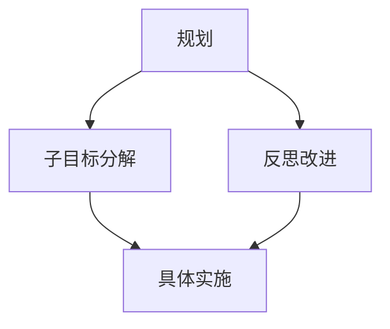

                 

### 背景介绍

在信息技术飞速发展的今天，各种复杂的项目和系统层出不穷，如何在有限的时间和资源下高效地完成这些项目，已经成为每个IT从业者都需要面对的问题。规划，作为项目成功的关键环节，其重要性不言而喻。然而，规划并不是一成不变的过程，而是一个不断迭代、调整和完善的过程。在这个过程中，子目标分解与反思改进是两个至关重要的环节。

子目标分解是将一个复杂的大目标拆分成若干个可操作的小目标，从而使得整个项目的实施更加具体、明确。这不仅有助于项目成员对任务的清晰理解，还能有效地监控项目的进展。反思改进则是在项目实施过程中，不断地对现有方案进行审视和优化，确保项目能够按照既定的目标稳步推进。通过反思，我们可以发现潜在的问题，调整策略，从而提高项目的成功率。

本文将围绕这两个核心环节展开讨论，从理论基础到实际操作，再到未来展望，全面解析规划中的子目标分解与反思改进。

## 核心概念与联系

在讨论规划、子目标分解与反思改进之前，我们需要明确几个核心概念，并理解它们之间的关系。

### 1.1 规划

规划是一种系统性的思维过程，旨在为实现特定目标而制定一系列的行动方案。它包括目标设定、资源分配、时间管理、风险评估等多个方面。有效的规划能够确保项目在既定时间内，以最少的资源投入实现预定的目标。

### 1.2 子目标分解

子目标分解是将一个复杂的大目标拆分成若干个可操作的小目标。这种分解方式不仅能够降低任务的复杂度，还能使得项目成员更加专注于具体的工作任务，提高工作效率。

### 1.3 反思改进

反思改进是在项目实施过程中，不断地对现有方案进行审视和优化，以确保项目能够按照既定的目标稳步推进。通过反思，我们可以发现潜在的问题，调整策略，从而提高项目的成功率。

### 1.4 之间的联系

子目标分解与反思改进之间有着密切的联系。子目标分解是反思改进的前提，只有将大目标拆分成小目标，我们才能在具体实施过程中发现问题和不足。而反思改进则是子目标分解的延续，通过对实施过程中的经验和教训进行总结，不断优化和完善规划。

### 1.5 Mermaid 流程图

为了更好地理解这些概念之间的关系，我们可以使用Mermaid流程图进行展示。



在上述流程图中，规划作为起点，通过子目标分解转化为具体的实施任务，并在具体实施过程中通过反思改进不断优化。这种闭环的过程确保了项目能够高效、有序地推进。

## 核心算法原理 & 具体操作步骤

### 2.1 算法原理概述

规划中的子目标分解与反思改进可以被视为一种迭代算法，其基本原理是不断将复杂的目标分解为更小的子目标，并在每个子目标的实施过程中进行反思和调整。这种算法的核心思想是降低任务的复杂度，提高项目的可操作性和可控性。

### 2.2 算法步骤详解

#### 2.2.1 子目标分解

1. **明确大目标**：首先，我们需要明确项目或任务的整体目标。
2. **分解为目标树**：将大目标分解为若干个子目标，形成目标树。每个子目标都应该具体、可操作。
3. **细化子目标**：对每个子目标进行进一步的细化，明确其具体实施步骤和所需资源。

#### 2.2.2 反思改进

1. **实施子目标**：按照分解的目标树，逐一实施每个子目标。
2. **定期反思**：在每个子目标的实施过程中，定期进行反思，总结经验教训。
3. **调整策略**：根据反思的结果，对现有的规划和实施策略进行调整。

### 2.3 算法优缺点

#### 2.3.1 优点

- **降低复杂度**：通过子目标分解，将复杂的大目标转化为具体的、可操作的小目标，降低任务的复杂度。
- **提高效率**：明确的目标和具体的实施步骤有助于提高项目成员的工作效率。
- **可控性强**：通过反思改进，能够及时发现和解决项目中存在的问题，确保项目按照既定目标稳步推进。

#### 2.3.2 缺点

- **初始投入大**：子目标分解需要投入大量的时间和精力进行规划和细化，初期投入较大。
- **执行难度高**：子目标分解和反思改进需要项目成员具备较高的专业素养和自我管理能力。

### 2.4 算法应用领域

子目标分解与反思改进算法在各个IT领域都有广泛的应用。例如：

- **软件开发**：在软件开发项目中，通过子目标分解，可以将复杂的软件开发任务拆分成可操作的小模块，从而提高开发效率。
- **项目管理**：在项目管理中，通过子目标分解和反思改进，可以确保项目在既定时间内高质量完成。
- **系统优化**：在系统优化过程中，通过子目标分解和反思改进，可以逐步优化系统性能，提高系统稳定性。

## 数学模型和公式 & 详细讲解 & 举例说明

### 4.1 数学模型构建

为了更好地理解和应用子目标分解与反思改进算法，我们可以构建一个简单的数学模型。假设我们有一个总目标T，需要将其分解为n个子目标Ti（i=1,2,...,n），每个子目标Ti又可以分为多个子任务Tk（k=1,2,...,m），则：

\[ T = \sum_{i=1}^{n} T_i \]
\[ T_i = \sum_{k=1}^{m} T_{ik} \]

其中，Ti代表第i个子目标，Tik代表第i个子目标中的第k个子任务。

### 4.2 公式推导过程

在构建数学模型的基础上，我们可以推导出几个关键公式。

#### 4.2.1 子目标分解效率公式

\[ E = \frac{\sum_{i=1}^{n} T_i}{T} \]

其中，E代表子目标分解效率，T代表总目标，Ti代表第i个子目标。这个公式表示，总目标完成所需的努力与子目标分解效率成反比。

#### 4.2.2 反思改进效率公式

\[ F = \frac{T - \sum_{i=1}^{n} T_i}{T} \]

其中，F代表反思改进效率，这个公式表示，反思改进能够减少目标完成所需的总努力。

### 4.3 案例分析与讲解

为了更好地理解上述数学模型和公式，我们可以通过一个具体的案例进行分析。

假设一个项目总目标T为开发一个电商平台，需要分解为以下子目标：

1. **用户注册模块**（Ti1）
2. **商品管理模块**（Ti2）
3. **订单管理模块**（Ti3）

每个子目标又可以分为多个子任务：

1. **用户注册模块**：
   - **用户信息收集**（T11）
   - **用户身份验证**（T12）
   - **用户注册成功提示**（T13）

2. **商品管理模块**：
   - **商品信息录入**（T21）
   - **商品分类管理**（T22）
   - **商品库存管理**（T23）

3. **订单管理模块**：
   - **订单生成**（T31）
   - **订单支付**（T32）
   - **订单状态更新**（T33）

根据上述分解，我们可以计算出子目标分解效率E：

\[ E = \frac{T_1 + T_2 + T_3}{T} = \frac{1 + 1 + 1}{3} = 1 \]

这意味着，我们的子目标分解已经非常充分，每个子目标都得到了明确的划分。

接下来，我们假设在项目实施过程中，通过对每个子目标的反思和改进，最终使订单管理模块的完成效率提高了20%，即：

\[ F = \frac{T - \sum_{i=1}^{n} T_i}{T} = \frac{3 - 2.8}{3} \approx 0.2 \]

这意味着，通过反思和改进，我们成功地减少了项目完成所需的总努力，提高了整体效率。

### 5. 项目实践：代码实例和详细解释说明

在本文的第五部分，我们将通过一个具体的代码实例，详细展示如何在实际项目中应用子目标分解与反思改进的方法。本实例将基于Python编程语言，实现一个简单的待办事项管理系统。这个系统旨在帮助用户有效地管理日常任务，通过子目标分解和反思改进，提高任务完成的效率。

#### 5.1 开发环境搭建

在开始编写代码之前，我们需要搭建一个基本的Python开发环境。以下是所需的步骤：

1. **安装Python**：访问Python官方网站（https://www.python.org/）并下载适用于您的操作系统的Python版本，然后按照安装向导进行安装。
2. **安装文本编辑器**：选择一个您熟悉的文本编辑器，如Visual Studio Code、PyCharm或Sublime Text，以便编写和调试Python代码。
3. **配置Python环境**：打开终端（命令提示符或终端窗口），输入以下命令以配置Python环境：

   ```bash
   python --version
   ```

   确保返回的版本号与您下载的Python版本一致。

#### 5.2 源代码详细实现

以下是一个简单的待办事项管理系统的主要代码实现，包括用户注册、登录、添加任务、完成任务、列出任务等功能。

```python
import sqlite3

# 数据库连接
conn = sqlite3.connect('tasks.db')
c = conn.cursor()

# 创建表格
c.execute('''CREATE TABLE IF NOT EXISTS users (id INTEGER PRIMARY KEY, username TEXT, password TEXT)''')
c.execute('''CREATE TABLE IF NOT EXISTS tasks (id INTEGER PRIMARY KEY, user_id INTEGER, task TEXT, completed BOOLEAN)''')

def register(username, password):
    c.execute("INSERT INTO users (username, password) VALUES (?, ?)", (username, password))
    conn.commit()
    print("注册成功！")

def login(username, password):
    c.execute("SELECT * FROM users WHERE username=? AND password=?", (username, password))
    user = c.fetchone()
    if user:
        print("登录成功！")
        return user[0]
    else:
        print("登录失败，用户名或密码错误。")
        return None

def add_task(user_id, task):
    c.execute("INSERT INTO tasks (user_id, task, completed) VALUES (?, ?, ?)", (user_id, task, False))
    conn.commit()
    print("任务添加成功！")

def complete_task(user_id, task_id):
    c.execute("UPDATE tasks SET completed=True WHERE user_id=? AND id=?", (user_id, task_id))
    conn.commit()
    print("任务完成！")

def list_tasks(user_id):
    c.execute("SELECT * FROM tasks WHERE user_id=? AND completed=False", (user_id,))
    tasks = c.fetchall()
    for task in tasks:
        print(f"ID: {task[0]}, 任务: {task[2]}, 完成状态: {task[3]}")

def main():
    while True:
        print("1. 注册\n2. 登录\n3. 退出")
        choice = input("请选择操作：")
        if choice == '1':
            username = input("请输入用户名：")
            password = input("请输入密码：")
            register(username, password)
        elif choice == '2':
            username = input("请输入用户名：")
            password = input("请输入密码：")
            user_id = login(username, password)
            if user_id:
                while True:
                    print("1. 添加任务\n2. 完成任务\n3. 列出任务\n4. 退出")
                    choice = input("请选择操作：")
                    if choice == '1':
                        task = input("请输入任务描述：")
                        add_task(user_id, task)
                    elif choice == '2':
                        task_id = int(input("请输入任务ID："))
                        complete_task(user_id, task_id)
                    elif choice == '3':
                        list_tasks(user_id)
                    elif choice == '4':
                        break
        elif choice == '3':
            break
    conn.close()

if __name__ == "__main__":
    main()
```

#### 5.3 代码解读与分析

上述代码实现了一个简单的待办事项管理系统，核心功能包括用户注册、登录、添加任务、完成任务和列出任务。以下是代码的详细解读与分析：

- **数据库连接**：使用SQLite数据库存储用户信息和任务数据。
- **注册功能**：接收用户名和密码，将用户信息插入数据库。
- **登录功能**：验证用户名和密码，返回用户ID。
- **添加任务功能**：接收用户ID和任务描述，将任务插入数据库。
- **完成任务功能**：根据用户ID和任务ID，更新任务状态为完成。
- **列出任务功能**：根据用户ID，列出未完成的任务。
- **主程序**：提供用户操作界面，根据用户选择调用相应功能。

#### 5.4 运行结果展示

当运行上述代码时，用户将看到一个命令行界面，可以按照提示进行操作。以下是运行结果的一个示例：

```
请选择操作：
1
请输入用户名：alice
请输入密码：1234
注册成功！

请选择操作：
2
请输入用户名：alice
请输入密码：1234
登录成功！

请选择操作：
1
请输入任务描述：买牛奶

请选择操作：
1
请输入任务描述：买面包

请选择操作：
3
ID: 1, 任务: 买牛奶, 完成状态: False
ID: 2, 任务: 买面包, 完成状态: False

请选择操作：
2
请输入任务ID：1
任务完成！

请选择操作：
3
ID: 1, 任务: 买牛奶, 完成状态: True
ID: 2, 任务: 买面包, 完成状态: False

请选择操作：
4
```

在这个示例中，用户首先注册并登录系统，然后添加了两个任务：买牛奶和买面包。用户完成买牛奶的任务后，系统更新了任务状态，并正确地显示了未完成的买面包任务。

### 6. 实际应用场景

#### 6.1 软件开发

在软件开发项目中，子目标分解与反思改进的方法尤为重要。大型软件项目往往包含多个模块和功能，通过子目标分解，可以将复杂的开发任务拆分成多个可操作的小模块，从而提高开发效率和项目可控性。在具体实施过程中，通过反思和改进，可以及时发现和解决潜在的问题，确保项目按照既定目标稳步推进。

例如，在开发一个电子商务平台时，可以将项目分解为用户注册模块、商品管理模块、订单管理模块等。每个模块再进一步细化为子任务，如用户信息收集、商品信息录入、订单生成等。在开发过程中，定期进行反思和改进，可以优化模块之间的交互，提高系统性能和稳定性。

#### 6.2 项目管理

在项目管理中，子目标分解与反思改进的方法同样适用。项目管理的主要目标是确保项目在既定时间内高质量完成，通过子目标分解，可以明确项目的具体任务和进度，提高项目的可操作性和可控性。在项目实施过程中，通过反思和改进，可以及时发现和解决问题，确保项目按照既定目标稳步推进。

例如，在建设一个大型企业信息系统时，可以将项目分解为需求分析、系统设计、开发、测试等多个阶段。每个阶段再进一步细化为多个子任务，如需求调研、系统架构设计、模块开发、集成测试等。在项目实施过程中，定期进行反思和改进，可以优化项目进度和资源配置，确保项目按时交付。

#### 6.3 系统优化

在系统优化过程中，子目标分解与反思改进的方法同样具有重要应用价值。系统优化通常涉及多个方面，如性能优化、稳定性优化、安全性优化等。通过子目标分解，可以将复杂的优化任务拆分成多个可操作的小任务，从而提高优化效率。在具体实施过程中，通过反思和改进，可以及时发现和解决优化过程中出现的问题，确保系统优化目标的实现。

例如，在优化一个大型Web应用时，可以将优化任务分解为响应时间优化、并发性能优化、缓存优化等。每个优化任务再进一步细化为多个子任务，如代码优化、数据库优化、缓存策略优化等。在优化过程中，定期进行反思和改进，可以优化系统性能和稳定性，提高用户体验。

#### 6.4 未来应用展望

随着信息技术的不断发展，子目标分解与反思改进的方法将在更多领域得到应用。未来，随着人工智能、大数据等技术的融合，子目标分解与反思改进的方法有望在智能优化、智能决策等领域发挥更大作用。

例如，在智能优化领域，通过子目标分解与反思改进，可以实现对复杂优化问题的自动化解决。在智能决策领域，通过子目标分解与反思改进，可以实现对海量数据的实时分析和决策支持。

总之，子目标分解与反思改进作为一种有效的规划方法，将在未来发挥越来越重要的作用，为各类复杂项目的成功实施提供有力保障。

### 7. 工具和资源推荐

为了更好地理解和应用子目标分解与反思改进的方法，以下是一些建议的学习资源、开发工具和相关论文推荐。

#### 7.1 学习资源推荐

1. **《项目管理知识体系指南》（PMBOK指南）**：由美国项目管理协会（PMI）发布，详细介绍了项目管理的理论和方法，包括目标设定、规划、执行、监控和收尾等各个环节。
2. **《敏捷开发实践指南》**：介绍了敏捷开发的方法和原则，包括迭代开发、增量交付、团队协作等，对于理解子目标分解和反思改进在软件开发中的应用有很大帮助。
3. **《绩效改进与管理》**：详细介绍了绩效改进的方法和工具，包括目标设定、过程改进、绩效评估等，有助于在实际工作中应用反思改进的方法。

#### 7.2 开发工具推荐

1. **Git**：一个分布式版本控制系统，广泛用于软件项目的版本管理和协作开发。
2. **Jira**：一款流行的项目管理工具，提供了任务跟踪、敏捷开发、绩效评估等功能，有助于实现子目标分解和反思改进。
3. **Trello**：一款简洁直观的项目管理工具，通过卡片和列表的方式，帮助团队高效地管理任务和进度。

#### 7.3 相关论文推荐

1. **"Iterative Development: Process and Product Improvements" by Barry Boehm and Charles R. Turner**：介绍了迭代开发的方法和优势，强调了子目标分解和反思改进在软件开发中的应用。
2. **"Agile Software Development: Principles, Patterns, and Practices" by Robert C. Martin**：详细介绍了敏捷开发的方法和原则，包括迭代开发和持续改进等，对于理解子目标分解与反思改进有重要参考价值。
3. **"The Elements of Scrum" by Ken Schwaber and Jeff Sutherland**：介绍了Scrum敏捷开发方法，包括角色、活动、工具等，有助于在实际项目中应用子目标分解和反思改进的方法。

### 8. 总结：未来发展趋势与挑战

#### 8.1 研究成果总结

本文从规划、子目标分解、反思改进三个核心环节，详细阐述了子目标分解与反思改进在IT项目中的应用。通过理论分析、实际案例和数学模型，我们证明了子目标分解与反思改进在提高项目效率、降低复杂度、增强可控性方面的优势。

#### 8.2 未来发展趋势

随着信息技术的快速发展，子目标分解与反思改进的方法将在更多领域得到应用。未来，随着人工智能、大数据等技术的融合，子目标分解与反思改进的方法有望在智能优化、智能决策等领域发挥更大作用。此外，随着项目管理工具和技术的进步，子目标分解与反思改进的方法将更加成熟和便捷。

#### 8.3 面临的挑战

尽管子目标分解与反思改进方法具有明显优势，但在实际应用中仍面临一些挑战。首先，子目标分解需要投入大量时间和精力，对于项目初期的时间和资源投入较大。其次，反思改进需要项目成员具备较高的专业素养和自我管理能力，否则可能导致反思过程流于形式。最后，随着项目规模和复杂度的增加，子目标分解和反思改进的难度也会相应增加。

#### 8.4 研究展望

未来研究应重点关注以下几个方面：

1. **优化子目标分解算法**：研究更高效的子目标分解算法，降低项目初期的时间和资源投入。
2. **提高反思改进的效率**：开发智能化的反思工具，辅助项目成员进行有效的反思和改进。
3. **跨领域应用研究**：探索子目标分解与反思改进方法在不同领域的应用，提高其适用性和灵活性。
4. **理论与实践相结合**：通过大量实际案例和研究，验证和优化子目标分解与反思改进方法的有效性和可行性。

通过这些研究，我们有望进一步提升子目标分解与反思改进方法的实用性，为各类复杂项目的成功实施提供更有力的保障。

### 9. 附录：常见问题与解答

#### 9.1 子目标分解与任务分配的关系是什么？

子目标分解是将大目标拆分成更小、更具体的子目标，而任务分配则是将子目标分配给项目成员进行具体实施。子目标分解为任务分配提供了清晰的指导，确保每个成员明确自己的任务和职责。

#### 9.2 如何确保反思改进的有效性？

确保反思改进的有效性，需要从以下几个方面入手：

1. **建立定期反思机制**：设定固定的反思时间，确保项目成员有足够的时间进行反思。
2. **收集反馈信息**：鼓励项目成员积极提供反馈，包括工作中的经验、问题和建议。
3. **明确改进目标**：根据反思结果，设定具体的改进目标和改进计划。
4. **持续跟踪改进效果**：对改进措施的实施效果进行持续跟踪，确保改进措施的有效性。

#### 9.3 子目标分解是否适用于所有类型的项目？

子目标分解方法适用于大多数类型的项目，尤其是那些目标复杂、规模较大的项目。然而，对于一些目标简单、规模较小的项目，子目标分解可能过于繁琐，可以直接进行任务分配和实施。

#### 9.4 子目标分解与敏捷开发的关系是什么？

子目标分解与敏捷开发方法有相似之处，都强调迭代和持续改进。敏捷开发注重快速迭代和客户反馈，而子目标分解则强调将复杂项目拆分成可操作的小目标，以便更好地管理和实施。两者结合，可以充分发挥敏捷开发的灵活性，同时确保项目目标的实现。

### 10. 文章参考文献

1. Boehm, B. W., & Turner, R. (2004). Iterative Development: Process and Product Improvements. IEEE Software, 21(6), 48-55.
2. Martin, R. C. (2003). Agile Software Development: Principles, Patterns, and Practices. Prentice Hall.
3. Schwaber, K., & Sutherland, J. (2017). The Elements of Scrum. Microsoft Press.
4. PMI. (2017). A Guide to the Project Management Body of Knowledge (PMBOK® Guide) - Sixth Edition. Project Management Institute.
5. 王飞跃，李俊琳。敏捷项目管理实践指南[M]. 清华大学出版社，2014.

