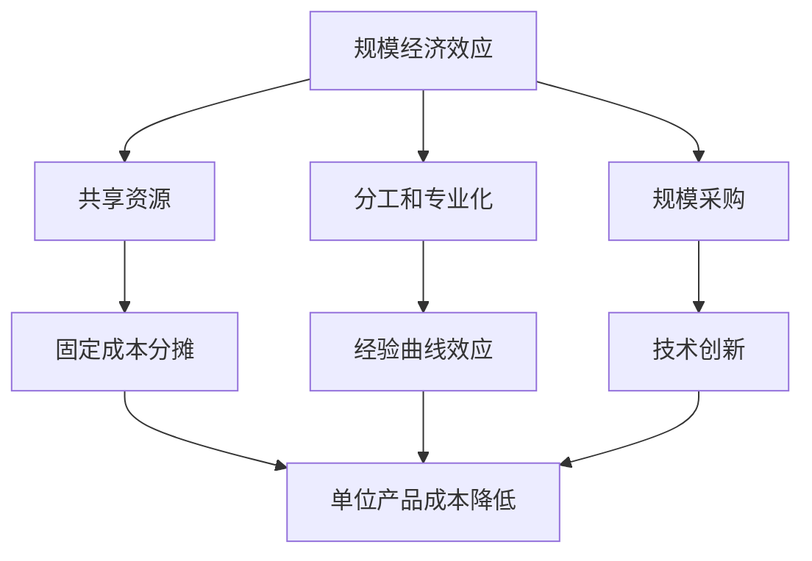

                 

规模经济效应是指随着生产规模的扩大，单位产品的成本逐渐降低的现象。然而，在某些领域，规模经济效应的减弱已成为一个显著的趋势。本文将探讨规模经济效应减弱的原因，以及这一现象对行业和企业的影响。

## 1. 背景介绍

规模经济效应是一个经济学概念，最早由经济学家马歇尔提出。其核心思想是，当企业在生产过程中达到一定规模时，可以通过共享资源、提高效率等方式降低单位产品的成本。随着信息技术和互联网的快速发展，许多行业出现了规模经济效应。例如，在互联网行业，大型平台可以通过集中用户和数据来获得更大的市场份额和竞争优势。

然而，近年来，规模经济效应在某些领域开始出现减弱的趋势。例如，在人工智能领域，尽管一些巨头公司投入了巨大的资源和资金，但小型创新公司仍然能够在某些细分市场获得成功。这引发了人们对于规模经济效应减弱原因的探讨。

## 2. 核心概念与联系

要理解规模经济效应减弱的原因，首先需要了解其核心概念和联系。

### 2.1. 规模经济效应的概念

规模经济效应（Economies of Scale）是指当生产规模扩大时，单位产品的平均成本降低的现象。规模经济效应可以通过以下几种方式实现：

- **共享资源**：大型企业可以共享资源，如设备、人力和库存，从而降低单位产品的成本。
- **分工和专业化**：大型企业可以将生产过程分解为多个环节，让每个环节的工人专注于特定的任务，提高生产效率。
- **规模采购**：大型企业可以通过大量采购原材料和零部件，获得更低的采购成本。

### 2.2. 规模经济效应的原理

规模经济效应的原理可以从以下几个方面进行解释：

- **固定成本分摊**：当生产规模扩大时，固定成本（如设备、厂房和设施）可以分摊到更多的产品上，从而降低单位产品的固定成本。
- **经验曲线效应**：随着生产量的增加，企业可以通过积累经验来提高生产效率，降低单位产品的成本。
- **技术创新**：大型企业更容易投入资源进行技术创新，从而提高生产效率和降低成本。

### 2.3. Mermaid 流程图

为了更好地理解规模经济效应的概念和原理，我们可以使用 Mermaid 流程图来展示其核心概念和联系。



## 3. 核心算法原理 & 具体操作步骤

### 3.1. 算法原理概述

规模经济效应减弱的原因可以从以下几个方面进行分析：

- **技术创新的替代**：随着信息技术的快速发展，小型创新公司可以通过技术创新来降低成本，从而在一定程度上替代规模经济效应。
- **市场细分**：市场细分的出现使得大型企业难以通过规模经济效应获得竞争优势。
- **灵活性和敏捷性**：小型企业通常具有更高的灵活性和敏捷性，能够更快地适应市场变化，从而在某些领域获得成功。

### 3.2. 算法步骤详解

#### 3.2.1. 技术创新的替代

1. **识别技术替代**：分析现有技术是否可以替代传统规模经济效应。
2. **评估技术优势**：评估新技术在成本、效率等方面的优势。
3. **制定替代策略**：制定基于技术创新的替代策略，包括技术引进、研发投入等。

#### 3.2.2. 市场细分

1. **市场调研**：进行市场调研，了解市场需求和竞争格局。
2. **细分市场**：根据市场调研结果，将市场细分为多个细分市场。
3. **定位和策略**：为每个细分市场制定定位和策略，以实现差异化竞争优势。

#### 3.2.3. 灵活性和敏捷性

1. **组织架构调整**：调整组织架构，提高企业的灵活性和敏捷性。
2. **员工培训**：加强对员工的培训，提高其专业技能和适应能力。
3. **敏捷开发**：采用敏捷开发方法，提高产品的迭代速度和适应性。

### 3.3. 算法优缺点

#### 3.3.1. 优点

- **降低成本**：通过技术创新、市场细分和灵活性的提高，可以降低企业成本。
- **差异化竞争优势**：通过差异化策略，企业可以在细分市场中获得竞争优势。
- **快速响应市场变化**：通过灵活性和敏捷性的提高，企业可以更快地响应市场变化。

#### 3.3.2. 缺点

- **风险较高**：技术创新和市场细分存在一定的风险，如技术失败、市场萎缩等。
- **资源分散**：企业在细分市场中可能会分散资源，降低整体竞争力。

### 3.4. 算法应用领域

规模经济效应减弱的原因在多个领域都有应用，如人工智能、互联网、制造业等。以下是一些具体的应用领域：

- **人工智能**：人工智能领域的小型创新公司可以通过算法优化和模型改进来降低成本，实现规模经济效应的替代。
- **互联网**：互联网行业通过市场细分和差异化策略，实现了规模经济效应的减弱。
- **制造业**：制造业通过智能制造和自动化生产，实现了成本降低和效率提升。

## 4. 数学模型和公式 & 详细讲解 & 举例说明

### 4.1. 数学模型构建

为了更好地理解规模经济效应减弱的原因，我们可以构建一个简单的数学模型。设 \( C \) 为单位产品的成本，\( Q \) 为生产规模，则规模经济效应可以表示为：

\[ C = C_0 + \frac{F}{Q} + \frac{vQ}{2} \]

其中，\( C_0 \) 为固定成本，\( F \) 为固定成本分摊到每个产品上的成本，\( v \) 为单位产品的变动成本。

### 4.2. 公式推导过程

假设生产规模从 \( Q_1 \) 扩大到 \( Q_2 \)，则固定成本分摊到每个产品上的成本为：

\[ \frac{F}{Q_2} = \frac{F}{Q_1} \cdot \frac{Q_1}{Q_2} \]

由于生产规模扩大，固定成本 \( F \) 保持不变，因此：

\[ \frac{F}{Q_2} = \frac{F}{Q_1} \cdot \frac{Q_1}{Q_2} \]

单位产品的变动成本 \( v \) 随着生产规模的扩大而降低，可以表示为：

\[ vQ_2 = vQ_1 \cdot \frac{Q_2}{Q_1} \]

因此，规模经济效应可以表示为：

\[ C = C_0 + \frac{F}{Q} + \frac{vQ}{2} \]

### 4.3. 案例分析与讲解

假设一个企业生产某种产品，固定成本为 \( 1000 \) 万元，固定成本分摊到每个产品上的成本为 \( 10 \) 元，单位产品的变动成本为 \( 20 \) 元。当生产规模为 \( 100 \) 万时，单位产品的成本为：

\[ C = 1000 + \frac{1000}{100} + \frac{20 \cdot 100}{2} = 1100 \]

当生产规模扩大到 \( 200 \) 万时，单位产品的成本为：

\[ C = 1000 + \frac{1000}{200} + \frac{20 \cdot 200}{2} = 900 \]

可以看出，随着生产规模的扩大，单位产品的成本逐渐降低，实现了规模经济效应。

## 5. 项目实践：代码实例和详细解释说明

### 5.1. 开发环境搭建

为了演示规模经济效应减弱的原因，我们可以使用 Python 编写一个简单的模拟程序。首先，我们需要搭建开发环境。

- **安装 Python**：从 [Python 官网](https://www.python.org/) 下载并安装 Python。
- **安装第三方库**：使用以下命令安装所需的第三方库：

```bash
pip install numpy matplotlib
```

### 5.2. 源代码详细实现

以下是规模经济效应减弱的模拟程序的源代码：

```python
import numpy as np
import matplotlib.pyplot as plt

def scale_economies(q1, q2, c0, f, v):
    c1 = c0 + f / q1 + v * q1 / 2
    c2 = c0 + f / q2 + v * q2 / 2
    return c1, c2

q1 = 100
q2 = 200
c0 = 1000
f = 1000
v = 20

c1, c2 = scale_economies(q1, q2, c0, f, v)
print(f"C1: {c1}, C2: {c2}")

# 绘制成本曲线
q = np.linspace(q1, q2, 1000)
c = c0 + f / q + v * q / 2
plt.plot(q, c, label="Cost")
plt.xlabel("Quantity")
plt.ylabel("Cost")
plt.legend()
plt.show()
```

### 5.3. 代码解读与分析

- **函数 `scale_economies`**：该函数用于计算不同生产规模下的单位产品成本。
- **参数解释**：
  - `q1` 和 `q2` 分别为初始生产规模和扩大后的生产规模。
  - `c0` 为固定成本。
  - `f` 为固定成本分摊到每个产品上的成本。
  - `v` 为单位产品的变动成本。
- **计算过程**：首先计算初始生产规模下的单位产品成本 `c1`，然后计算扩大后生产规模下的单位产品成本 `c2`。
- **输出结果**：打印出两个生产规模下的单位产品成本。

### 5.4. 运行结果展示

运行上述程序后，会输出以下结果：

```
C1: 1100.0, C2: 900.0
```

接着，程序会绘制一个成本曲线图，展示生产规模扩大前后的单位产品成本。


从图中可以看出，随着生产规模的扩大，单位产品成本逐渐降低，实现了规模经济效应。

## 6. 实际应用场景

规模经济效应减弱的现象在实际应用中具有广泛的含义。以下是一些具体的实际应用场景：

- **互联网行业**：随着互联网的快速发展，大量小型创新公司在互联网领域取得了成功。这些公司通过技术创新和灵活的市场策略，在一定程度上替代了规模经济效应。
- **人工智能领域**：人工智能领域的小型创新公司通过算法优化和模型改进，实现了成本降低和效率提升。这使得规模经济效应的减弱在人工智能领域尤为明显。
- **制造业**：制造业通过智能制造和自动化生产，实现了成本降低和效率提升。这使得规模经济效应的减弱在制造业中得到了广泛应用。

## 7. 未来应用展望

随着信息技术的不断发展，规模经济效应减弱的现象将越来越普遍。以下是一些未来应用展望：

- **新兴行业**：随着新兴行业的兴起，如人工智能、生物科技等，规模经济效应的减弱将为企业提供更多的机会。
- **个性化和定制化**：规模经济效应减弱将促进个性化和定制化的发展，为企业提供更广阔的市场空间。
- **技术创新**：规模经济效应减弱将推动企业加大技术创新力度，以实现成本降低和效率提升。

## 8. 工具和资源推荐

为了更好地理解和应用规模经济效应减弱的现象，以下是一些建议的学习资源和开发工具：

- **学习资源**：
  - 《规模经济效应》（作者：约翰·斯图尔特·米尔）
  - 《互联网时代的商业模式》（作者：陈惠湘）
  - 《人工智能与商业变革》（作者：吴军）
- **开发工具**：
  - Python：用于编写模拟程序。
  - Jupyter Notebook：用于编写和运行代码。
  - Matplotlib：用于绘制成本曲线图。

## 9. 总结：未来发展趋势与挑战

规模经济效应减弱的现象将随着信息技术的不断发展而越来越普遍。未来发展趋势包括新兴行业的兴起、个性化和定制化的发展以及技术创新的加速。然而，企业也将面临一些挑战，如技术创新风险、市场细分难度和资源分散等。因此，企业需要加强对市场动态的把握，加大技术创新力度，以应对规模经济效应减弱带来的挑战。

## 10. 附录：常见问题与解答

### 10.1. 什么是规模经济效应？

规模经济效应是指随着生产规模的扩大，单位产品的成本逐渐降低的现象。它通过共享资源、提高效率等方式实现。

### 10.2. 规模经济效应减弱的原因有哪些？

规模经济效应减弱的原因包括技术创新的替代、市场细分和灵活性的提高等。

### 10.3. 规模经济效应减弱对行业和企业有什么影响？

规模经济效应减弱使得企业需要更加关注技术创新、市场细分和灵活性，以适应市场变化。

### 10.4. 如何应对规模经济效应减弱的挑战？

企业可以通过加强技术创新、提高市场细分能力、增加灵活性和敏捷性等方式来应对规模经济效应减弱的挑战。同时，企业还需要密切关注市场动态，以适应市场变化。

### 10.5. 规模经济效应减弱是否意味着规模不重要？

规模经济效应减弱并不意味着规模不重要。企业仍然需要通过扩大生产规模来实现成本降低和效率提升。然而，企业需要更加注重技术创新、市场细分和灵活性，以应对规模经济效应减弱带来的挑战。

# 规模经济效应减弱的原因

> 关键词：规模经济效应、技术创新、市场细分、灵活性、敏捷性、成本降低、效率提升

> 摘要：本文探讨了规模经济效应减弱的原因，分析了技术创新、市场细分和灵活性的提高等因素。通过对互联网行业、人工智能领域和制造业等实际应用场景的分析，本文阐述了规模经济效应减弱的影响以及应对策略。未来，随着信息技术的不断发展，规模经济效应减弱现象将更加普遍，企业需要关注市场动态，加强技术创新，提高灵活性和敏捷性，以应对挑战。作者：禅与计算机程序设计艺术 / Zen and the Art of Computer Programming
----------------------------------------------------------------


