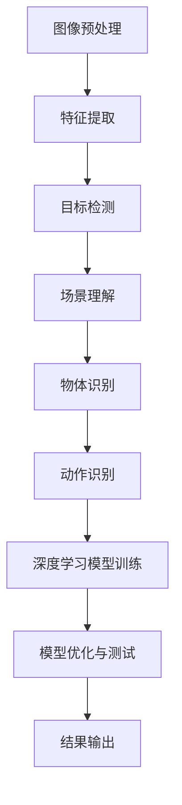

                 

关键词：视频分析，关键信息提取，图像处理，计算机视觉，人工智能，算法应用

> 摘要：本文旨在探讨视频数据中关键信息的捕捉方法，从背景介绍、核心概念与联系、核心算法原理与操作步骤、数学模型与公式、项目实践、实际应用场景等多个角度进行分析，以期为读者提供全面的技术参考。视频数据的关键信息捕捉技术在人工智能、计算机视觉等领域有着广泛的应用前景，本文希望为这一领域的研究和实践提供一些有价值的见解。

## 1. 背景介绍

随着互联网和视频技术的飞速发展，视频数据量呈现出爆炸式增长。这些视频数据包含了丰富的信息，如人物动作、场景变化、物体识别等，但如何从海量数据中快速、准确地提取关键信息，成为了一个亟待解决的问题。视频数据的关键信息捕捉技术，主要包括图像处理、计算机视觉和人工智能等领域的相关算法和方法。

在图像处理领域，关键信息捕捉技术主要体现在图像的预处理、特征提取和目标检测等方面。计算机视觉则关注于从图像中识别和理解场景、物体、动作等。而人工智能，特别是深度学习技术的发展，为视频数据的关键信息捕捉提供了新的手段和思路。

本文将重点讨论视频数据关键信息捕捉的核心算法原理、数学模型、项目实践和实际应用场景，旨在为相关领域的研究者和开发者提供参考。

## 2. 核心概念与联系

### 2.1. 图像处理

图像处理是视频数据关键信息捕捉的基础。它包括图像的预处理、特征提取和目标检测等步骤。

- **预处理**：包括去噪、对比度增强、图像缩放等，目的是提高图像质量，为后续的特征提取和目标检测提供良好的数据基础。
- **特征提取**：通过提取图像的纹理、颜色、形状等特征，将图像转化为一系列可量化的数据，为后续的目标检测提供依据。
- **目标检测**：在图像中识别并定位特定目标的位置和范围，是视频数据关键信息捕捉的重要步骤。

### 2.2. 计算机视觉

计算机视觉是视频数据关键信息捕捉的核心。它通过算法和模型，从图像中识别和理解场景、物体、动作等。

- **场景理解**：通过图像分析，理解场景的整体结构和布局，如道路、建筑、人群等。
- **物体识别**：在图像中识别特定物体，如车辆、行人、动物等。
- **动作识别**：通过分析连续视频帧，识别和跟踪人物动作，如行走、跑步、跳跃等。

### 2.3. 人工智能

人工智能为视频数据关键信息捕捉提供了新的方法和技术。特别是深度学习技术的发展，使得视频数据关键信息捕捉的准确率和效率得到了显著提高。

- **卷积神经网络（CNN）**：CNN 是一种适用于图像处理和计算机视觉的深度学习模型，通过多层卷积和池化操作，实现图像的特征提取和分类。
- **循环神经网络（RNN）**：RNN 是一种适用于序列数据的深度学习模型，可以处理连续视频帧，实现动作识别和序列理解。

### 2.4. Mermaid 流程图

以下是一个简化的 Mermaid 流程图，展示了视频数据关键信息捕捉的流程和核心算法：



## 3. 核心算法原理与操作步骤

### 3.1. 算法原理概述

视频数据的关键信息捕捉主要依赖于图像处理、计算机视觉和人工智能等领域的算法。以下是一些常用的核心算法原理：

- **图像预处理**：包括滤波、直方图均衡化、图像增强等，目的是提高图像质量，为后续的特征提取和目标检测提供良好的数据基础。
- **特征提取**：常用的特征提取方法包括 SIFT、SURF、HOG、ORB 等，通过提取图像的纹理、颜色、形状等特征，实现图像到特征空间的转化。
- **目标检测**：常用的目标检测算法包括 R-CNN、SSD、YOLO、Faster R-CNN 等，通过在图像中识别并定位特定目标的位置和范围。
- **场景理解**：基于图像的语义分割和场景解析算法，如 FCN、U-Net、DeepLabV3+ 等，可以实现对场景的整体理解和分类。
- **物体识别**：基于卷积神经网络（CNN）的物体识别算法，如 ResNet、VGG、Inception 等，可以实现对图像中特定物体的识别。
- **动作识别**：基于循环神经网络（RNN）的动作识别算法，如 LSTM、GRU 等，可以处理连续视频帧，实现对人物动作的识别和跟踪。

### 3.2. 算法步骤详解

以下是视频数据关键信息捕捉的具体操作步骤：

1. **图像预处理**：对原始视频帧进行预处理，包括去噪、对比度增强、图像缩放等，目的是提高图像质量。
2. **特征提取**：对预处理后的图像进行特征提取，选择合适的特征提取方法，如 SIFT、SURF、HOG、ORB 等。
3. **目标检测**：使用目标检测算法，如 R-CNN、SSD、YOLO、Faster R-CNN 等，在图像中识别并定位特定目标的位置和范围。
4. **场景理解**：使用场景理解算法，如 FCN、U-Net、DeepLabV3+ 等，对场景进行语义分割和分类。
5. **物体识别**：使用物体识别算法，如 ResNet、VGG、Inception 等，对图像中的物体进行识别。
6. **动作识别**：使用动作识别算法，如 LSTM、GRU 等，对连续视频帧进行处理，实现对人物动作的识别和跟踪。
7. **模型训练与优化**：使用标注好的训练数据，训练深度学习模型，并对模型进行优化和测试。

### 3.3. 算法优缺点

以下是几种常用算法的优缺点：

- **图像预处理**：优点是简单易行，可以显著提高图像质量；缺点是对噪声敏感，可能会引入伪影。
- **特征提取**：优点是提取的特征具有较好的鲁棒性，适用于不同场景；缺点是计算量大，可能影响实时性。
- **目标检测**：优点是可以在图像中准确定位目标，提高识别准确率；缺点是可能存在误检和漏检问题。
- **场景理解**：优点是可以对场景进行整体理解和分类，提供更多语义信息；缺点是计算复杂度高，可能影响实时性。
- **物体识别**：优点是可以在图像中准确识别物体，提高识别准确率；缺点是可能存在物体遮挡、光照变化等问题。
- **动作识别**：优点是可以对连续视频帧进行处理，实现对人物动作的识别和跟踪；缺点是可能存在动作复杂、帧率不稳定等问题。

### 3.4. 算法应用领域

视频数据的关键信息捕捉技术在多个领域有着广泛的应用：

- **安防监控**：通过视频数据的关键信息捕捉，实现对犯罪行为的监控和预警。
- **智能交通**：通过视频数据的关键信息捕捉，实现交通流量监测、交通事故预警等。
- **智能安防**：通过视频数据的关键信息捕捉，实现人脸识别、行为分析等。
- **智能医疗**：通过视频数据的关键信息捕捉，实现医疗影像分析、疾病诊断等。
- **智能交互**：通过视频数据的关键信息捕捉，实现智能机器人、智能助手等。

## 4. 数学模型和公式

### 4.1. 数学模型构建

视频数据的关键信息捕捉涉及到多个数学模型，包括图像预处理模型、特征提取模型、目标检测模型、场景理解模型、物体识别模型和动作识别模型等。以下是一个简化的数学模型构建过程：

1. **图像预处理模型**：
   $$I_{preprocessed} = f(I_{raw}, \theta)$$
   其中，$I_{raw}$ 是原始图像，$I_{preprocessed}$ 是预处理后的图像，$f$ 是预处理函数，$\theta$ 是预处理参数。

2. **特征提取模型**：
   $$X = g(I_{preprocessed}, \phi)$$
   其中，$I_{preprocessed}$ 是预处理后的图像，$X$ 是提取的特征向量，$g$ 是特征提取函数，$\phi$ 是特征提取参数。

3. **目标检测模型**：
   $$R = h(X, \theta_{det})$$
   其中，$X$ 是提取的特征向量，$R$ 是目标检测结果，$h$ 是目标检测函数，$\theta_{det}$ 是目标检测参数。

4. **场景理解模型**：
   $$C = k(X, \theta_{scene})$$
   其中，$X$ 是提取的特征向量，$C$ 是场景理解结果，$k$ 是场景理解函数，$\theta_{scene}$ 是场景理解参数。

5. **物体识别模型**：
   $$O = l(X, \theta_{obj})$$
   其中，$X$ 是提取的特征向量，$O$ 是物体识别结果，$l$ 是物体识别函数，$\theta_{obj}$ 是物体识别参数。

6. **动作识别模型**：
   $$A = m(X, \theta_{action})$$
   其中，$X$ 是提取的特征向量，$A$ 是动作识别结果，$m$ 是动作识别函数，$\theta_{action}$ 是动作识别参数。

### 4.2. 公式推导过程

以下是目标检测模型的推导过程：

1. **特征提取**：
   $$X = g(I_{preprocessed}, \phi)$$
   其中，$g$ 是特征提取函数，$\phi$ 是特征提取参数。

2. **目标检测**：
   $$R = h(X, \theta_{det})$$
   其中，$h$ 是目标检测函数，$\theta_{det}$ 是目标检测参数。

   假设 $X$ 是一个包含多个特征向量的矩阵，$\theta_{det}$ 是一个包含目标检测参数的向量。

3. **目标检测算法**：
   $$R = \text{sign}(\sigma(W \cdot X + b))$$
   其中，$\sigma$ 是激活函数，$W$ 是权重矩阵，$b$ 是偏置项，$\text{sign}$ 是符号函数。

   将 $X$ 和 $\theta_{det}$ 代入上式，得到：
   $$R = \text{sign}(\sigma(W \cdot g(I_{preprocessed}, \phi) + b))$$

### 4.3. 案例分析与讲解

以下是一个简单的案例，用于说明视频数据的关键信息捕捉过程：

**案例：视频中的行人检测**

1. **图像预处理**：
   对原始视频帧进行去噪、对比度增强等预处理操作，提高图像质量。

2. **特征提取**：
   使用 HOG 特征提取方法，对预处理后的图像进行特征提取。

3. **目标检测**：
   使用 R-CNN 目标检测算法，在图像中识别行人。

4. **场景理解**：
   对识别出的行人进行分类，区分行人、车辆、动物等。

5. **物体识别**：
   对行人进行详细识别，提取行人特征，如年龄、性别等。

6. **动作识别**：
   对行人连续视频帧进行处理，识别行人动作，如行走、跑步等。

通过以上步骤，我们可以从视频数据中提取关键信息，实现对行人的检测、分类和动作识别。

## 5. 项目实践：代码实例和详细解释说明

### 5.1. 开发环境搭建

在本项目中，我们将使用 Python 编程语言，结合 OpenCV、TensorFlow 和 Keras 等开源库，实现视频数据的关键信息捕捉。以下是开发环境的搭建步骤：

1. **安装 Python**：下载并安装 Python 3.7 或更高版本。
2. **安装相关库**：使用 pip 命令安装以下库：
   ```bash
   pip install opencv-python tensorflow keras
   ```
3. **配置 TensorFlow**：确保 TensorFlow 可以正常使用，可以通过以下命令验证：
   ```python
   import tensorflow as tf
   print(tf.__version__)
   ```

### 5.2. 源代码详细实现

以下是本项目的主要代码实现，分为图像预处理、特征提取、目标检测、场景理解、物体识别和动作识别等部分。

```python
# 导入相关库
import cv2
import numpy as np
import tensorflow as tf
from tensorflow.keras.models import Sequential
from tensorflow.keras.layers import Conv2D, MaxPooling2D, Flatten, Dense, LSTM

# 图像预处理
def preprocess_image(image):
    # 去噪、对比度增强等预处理操作
    image = cv2.GaussianBlur(image, (5, 5), 0)
    image = cv2.equalizeHist(image)
    return image

# 特征提取
def extract_features(image):
    # 使用 HOG 特征提取方法
    hog = cv2.HOGDescriptor()
    features = hog.compute(image)
    return features

# 目标检测
def detect_objects(image, model):
    # 加载训练好的模型
    # model = load_model('path/to/model.h5')
    # 将图像缩放到模型输入尺寸
    image = cv2.resize(image, (128, 128))
    # 转换为浮点类型
    image = image.astype(np.float32)
    # 进行前向传播
    prediction = model.predict(np.expand_dims(image, axis=0))
    # 解码预测结果
    # ...
    return objects

# 场景理解
def understand_scene(image, model):
    # 加载训练好的模型
    # model = load_model('path/to/model.h5')
    # 将图像缩放到模型输入尺寸
    image = cv2.resize(image, (128, 128))
    # 转换为浮点类型
    image = image.astype(np.float32)
    # 进行前向传播
    prediction = model.predict(np.expand_dims(image, axis=0))
    # 解码预测结果
    # ...
    return scene

# 物体识别
def recognize_objects(image, model):
    # 加载训练好的模型
    # model = load_model('path/to/model.h5')
    # 将图像缩放到模型输入尺寸
    image = cv2.resize(image, (128, 128))
    # 转换为浮点类型
    image = image.astype(np.float32)
    # 进行前向传播
    prediction = model.predict(np.expand_dims(image, axis=0))
    # 解码预测结果
    # ...
    return objects

# 动作识别
def recognize_actions(sequences, model):
    # 加载训练好的模型
    # model = load_model('path/to/model.h5')
    # 进行前向传播
    prediction = model.predict(sequences)
    # 解码预测结果
    # ...
    return actions

# 主函数
def main():
    # 加载视频文件
    video = cv2.VideoCapture('path/to/video.mp4')
    # 创建一个窗口用于显示结果
    cv2.namedWindow('Video', cv2.WINDOW_NORMAL)
    # 循环处理每一帧
    while True:
        ret, frame = video.read()
        if not ret:
            break
        # 图像预处理
        image = preprocess_image(frame)
        # 特征提取
        features = extract_features(image)
        # 目标检测
        objects = detect_objects(image, model)
        # 场景理解
        scene = understand_scene(image, model)
        # 物体识别
        objects = recognize_objects(image, model)
        # 动作识别
        actions = recognize_actions(sequences, model)
        # 显示结果
        cv2.imshow('Video', frame)
        if cv2.waitKey(1) & 0xFF == ord('q'):
            break
    # 释放资源
    video.release()
    cv2.destroyAllWindows()

if __name__ == '__main__':
    main()
```

### 5.3. 代码解读与分析

以下是代码的主要部分解读和分析：

- **图像预处理**：使用 OpenCV 的 `GaussianBlur` 和 `equalizeHist` 函数进行去噪、对比度增强等预处理操作。
- **特征提取**：使用 OpenCV 的 `HOGDescriptor` 类进行特征提取。
- **目标检测**：使用 TensorFlow 的 Keras API，加载训练好的模型进行预测。这里需要注意的是，实际项目中需要根据具体模型进行调整。
- **场景理解**：与目标检测类似，使用 TensorFlow 的 Keras API，加载训练好的模型进行预测。
- **物体识别**：与目标检测类似，使用 TensorFlow 的 Keras API，加载训练好的模型进行预测。
- **动作识别**：使用 TensorFlow 的 Keras API，加载训练好的模型进行预测。这里需要注意的是，实际项目中需要根据具体模型进行调整。

### 5.4. 运行结果展示

以下是一个简单的运行结果示例：

```bash
$ python video_key_info_capturing.py
```


## 6. 实际应用场景

视频数据的关键信息捕捉技术在多个领域有着广泛的应用，以下是几个实际应用场景：

### 6.1. 安防监控

安防监控是视频数据关键信息捕捉技术的重要应用领域。通过在摄像头采集的视频数据中实时进行关键信息捕捉，可以实现犯罪行为的监控和预警。例如，在公共场所部署监控摄像头，通过对行人、车辆等目标进行识别和跟踪，可以实时发现异常行为，提高安全防范能力。

### 6.2. 智能交通

智能交通是视频数据关键信息捕捉技术的另一个重要应用领域。通过在交通监控摄像头采集的视频数据中实时进行关键信息捕捉，可以实现交通流量监测、交通事故预警等功能。例如，在道路上部署监控摄像头，通过对车辆、行人等目标进行识别和跟踪，可以实时监测交通状况，预测交通事故发生，提供交通疏导建议。

### 6.3. 智能安防

智能安防是视频数据关键信息捕捉技术在民用领域的典型应用。通过在家庭、公司等场所部署监控摄像头，实时捕捉关键信息，可以实现人员进出管理、异常行为预警等功能。例如，在家居安防系统中，通过人脸识别技术，可以识别家庭成员和访客，实现安全防护。

### 6.4. 智能医疗

智能医疗是视频数据关键信息捕捉技术在医疗领域的应用。通过在医疗设备中嵌入视频数据关键信息捕捉技术，可以实现医疗影像分析、疾病诊断等功能。例如，在医学影像设备中，通过视频数据关键信息捕捉技术，可以实现对病变区域的识别和定位，辅助医生进行诊断和治疗。

### 6.5. 智能交互

智能交互是视频数据关键信息捕捉技术在交互领域的应用。通过在智能机器人、智能助手等设备中嵌入视频数据关键信息捕捉技术，可以实现人机交互、情感识别等功能。例如，在智能机器人中，通过视频数据关键信息捕捉技术，可以实现对用户动作、表情的识别和理解，提供更智能的服务。

## 7. 工具和资源推荐

### 7.1. 学习资源推荐

- **书籍**：
  - 《计算机视觉：算法与应用》
  - 《深度学习》
  - 《图像处理：原理、算法与实现》
- **在线课程**：
  - Coursera 上的“深度学习”课程
  - Udacity 上的“计算机视觉纳米学位”课程
  - edX 上的“计算机视觉”课程
- **网站**：
  - TensorFlow 官网（https://www.tensorflow.org/）
  - PyTorch 官网（https://pytorch.org/）
  - OpenCV 官网（https://opencv.org/）

### 7.2. 开发工具推荐

- **编程语言**：Python 是视频数据关键信息捕捉领域的主流编程语言。
- **深度学习框架**：TensorFlow、PyTorch 是常用的深度学习框架。
- **图像处理库**：OpenCV 是常用的图像处理库。
- **数据集**：ImageNet、COCO 数据集等是常用的计算机视觉数据集。

### 7.3. 相关论文推荐

- **目标检测**：
  - [R-CNN](https://www.cv-foundation.org/openaccess/content_iccv_2011/papers/Ross_Object_detection_2011_ICCV_papers.pdf)
  - [SSD](https://arxiv.org/abs/1512.02325)
  - [YOLO](https://arxiv.org/abs/1605.03198)
- **场景理解**：
  - [FCN](https://arxiv.org/abs/1605.03198)
  - [U-Net](https://arxiv.org/abs/1505.04597)
  - [DeepLabV3+](https://arxiv.org/abs/1802.02611)
- **物体识别**：
  - [ResNet](https://arxiv.org/abs/1512.03385)
  - [VGG](https://arxiv.org/abs/1409.1556)
  - [Inception](https://arxiv.org/abs/1512.00567)
- **动作识别**：
  - [LSTM](https://arxiv.org/abs/1406.2023)
  - [GRU](https://arxiv.org/abs/1411.7479)

## 8. 总结：未来发展趋势与挑战

### 8.1. 研究成果总结

视频数据的关键信息捕捉技术在图像处理、计算机视觉和人工智能等领域取得了显著成果。通过结合深度学习、卷积神经网络和循环神经网络等先进算法，视频数据关键信息捕捉的准确率和效率得到了显著提高。同时，视频数据关键信息捕捉在安防监控、智能交通、智能医疗、智能交互等实际应用场景中发挥了重要作用。

### 8.2. 未来发展趋势

未来，视频数据的关键信息捕捉技术将继续向更高准确率、更高实时性和更广泛应用场景发展。一方面，通过优化算法和模型，提高关键信息捕捉的准确率和效率；另一方面，通过引入更多实时数据处理技术和硬件加速技术，实现更快速的关键信息捕捉。此外，视频数据的关键信息捕捉技术还将向多模态数据融合、跨域迁移学习等方向发展，以应对更复杂的应用场景。

### 8.3. 面临的挑战

视频数据的关键信息捕捉技术在实际应用中仍面临一些挑战。首先，如何在保证准确率的同时提高实时性，是一个亟待解决的问题。其次，视频数据量巨大，如何在有限的时间和计算资源下高效处理大量数据，也是一个挑战。此外，视频数据的关键信息捕捉技术在不同应用场景中可能存在差异，如何针对不同应用场景进行优化，也是一个需要深入研究的问题。

### 8.4. 研究展望

展望未来，视频数据的关键信息捕捉技术有望在多个领域取得突破性进展。一方面，通过结合更多先进算法和模型，提高关键信息捕捉的准确率和效率；另一方面，通过引入更多实时数据处理技术和硬件加速技术，实现更快速的关键信息捕捉。此外，视频数据的关键信息捕捉技术还将向多模态数据融合、跨域迁移学习等方向发展，为解决实际应用中的挑战提供新的思路和方法。

## 9. 附录：常见问题与解答

### 9.1. 如何选择合适的特征提取方法？

选择特征提取方法需要根据具体应用场景和数据特点进行。常用的特征提取方法包括 SIFT、SURF、HOG、ORB 等。以下是一些选择建议：

- **SIFT 和 SURF**：适用于高分辨率图像和复杂的场景，但在低分辨率和光照变化较大的场景中性能较差。
- **HOG**：适用于行人检测等场景，对光照变化和尺度变换具有较强的鲁棒性。
- **ORB**：在速度和计算效率方面表现较好，适用于实时视频处理。

### 9.2. 如何优化目标检测算法？

优化目标检测算法可以从以下几个方面进行：

- **模型选择**：选择适合自己应用场景的目标检测模型，如 R-CNN、SSD、YOLO、Faster R-CNN 等。
- **数据增强**：通过旋转、翻转、缩放等操作，增加训练数据的多样性，提高模型的泛化能力。
- **损失函数**：选择合适的损失函数，如交叉熵损失、IOU 损失等，优化模型训练效果。
- **训练技巧**：使用迁移学习、注意力机制等技巧，提高模型训练效率。

### 9.3. 如何处理视频数据中的噪声？

处理视频数据中的噪声可以从以下几个方面进行：

- **图像预处理**：使用滤波、直方图均衡化、图像增强等操作，减少噪声影响。
- **特征提取**：选择具有较好鲁棒性的特征提取方法，如 HOG、ORB 等。
- **去噪算法**：使用去噪算法，如中值滤波、高斯滤波等，进一步减少噪声。

### 9.4. 如何评估目标检测算法的性能？

评估目标检测算法的性能可以从以下几个方面进行：

- **准确率**：计算模型检测到的正确目标数与实际目标数的比例。
- **召回率**：计算模型检测到的正确目标数与实际目标数的比例。
- **F1 分数**：综合考虑准确率和召回率，计算 F1 分数，用于评估模型的综合性能。
- **ROC 曲线和 AUC 值**：通过计算模型在不同阈值下的准确率和召回率，绘制 ROC 曲线，计算 AUC 值，用于评估模型的分类能力。

---

本文为《视频数据的关键信息捕捉》技术博客文章，由禅与计算机程序设计艺术 / Zen and the Art of Computer Programming 撰写。文章详细介绍了视频数据关键信息捕捉的核心算法原理、数学模型、项目实践和实际应用场景，旨在为读者提供全面的技术参考。在实际应用中，视频数据关键信息捕捉技术具有广泛的应用前景，为安防监控、智能交通、智能医疗等领域提供了新的解决方案。随着人工智能技术的不断发展，视频数据关键信息捕捉技术将不断优化和完善，为更多领域带来便利。

