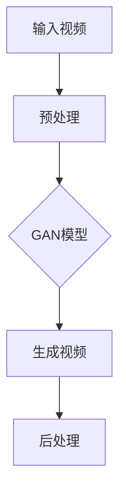

                 

关键词：视频生成、深度学习、生成对抗网络、卷积神经网络、图像合成、视频合成

摘要：本文将深入探讨视频生成的原理、核心算法以及实际应用。通过详细的代码实例讲解，帮助读者理解和掌握视频生成的技术，并展望未来视频生成领域的发展趋势与挑战。

## 1. 背景介绍

视频生成作为计算机视觉和人工智能领域的一个重要分支，近年来受到了广泛关注。随着深度学习技术的迅猛发展，视频生成技术取得了显著的成果，并开始在实际应用中发挥重要作用。视频生成不仅可以用于娱乐、广告等领域，还可以在医疗、教育、安防等行业中发挥巨大的潜力。

本文将详细介绍视频生成的原理，包括核心算法、数学模型和具体实现步骤。通过代码实例，我们将深入解析视频生成的技术细节，帮助读者更好地理解和掌握这一领域。

## 2. 核心概念与联系

视频生成涉及多个核心概念，包括深度学习、生成对抗网络（GAN）、卷积神经网络（CNN）等。下面是这些概念的联系和简要说明：

### 2.1 深度学习

深度学习是一种人工智能的分支，通过模拟人脑神经网络的结构和功能，实现对数据的自动学习和特征提取。深度学习在图像识别、语音识别、自然语言处理等领域取得了显著的成果。

### 2.2 生成对抗网络（GAN）

生成对抗网络（GAN）是一种深度学习模型，由生成器和判别器两个神经网络组成。生成器试图生成与真实数据相似的数据，而判别器则试图区分真实数据和生成数据。通过生成器和判别器的对抗训练，GAN可以生成高质量的数据。

### 2.3 卷积神经网络（CNN）

卷积神经网络（CNN）是一种专门用于图像处理和识别的神经网络。通过卷积操作、池化操作和全连接层等结构，CNN可以自动提取图像的特征，并用于分类、分割等任务。

### 2.4 Mermaid 流程图

以下是视频生成中的核心概念和架构的 Mermaid 流程图：



## 3. 核心算法原理 & 具体操作步骤

### 3.1 算法原理概述

视频生成主要采用生成对抗网络（GAN）这一核心算法。GAN由生成器和判别器两个神经网络组成，通过对抗训练生成高质量的视频。

- 生成器（Generator）：生成器是一个神经网络，输入随机噪声，输出与真实视频相似的视频。生成器的目标是生成尽可能真实的视频，以欺骗判别器。
- 判别器（Discriminator）：判别器是一个神经网络，输入真实视频和生成视频，输出判断结果。判别器的目标是正确区分真实视频和生成视频。

在训练过程中，生成器和判别器交替进行更新。生成器尝试优化自己的参数，以提高生成视频的真实性；判别器则尝试优化自己的参数，以提高区分真实视频和生成视频的能力。通过这种对抗训练，生成器最终可以生成高质量的视频。

### 3.2 算法步骤详解

以下是视频生成的具体操作步骤：

1. **数据预处理**：对输入视频进行预处理，包括尺寸调整、数据增强等，以提高生成器的训练效果。
2. **生成器训练**：使用生成对抗网络训练生成器，输入随机噪声，输出与真实视频相似的视频。
3. **判别器训练**：同时使用生成对抗网络训练判别器，输入真实视频和生成视频，输出判断结果。
4. **交替训练**：生成器和判别器交替进行更新，通过多次迭代训练，生成器可以生成高质量的视频。
5. **视频生成**：使用训练好的生成器，输入随机噪声，输出高质量的视频。
6. **后处理**：对生成的视频进行后处理，如去噪、锐化等，以提高视频质量。

### 3.3 算法优缺点

**优点**：

1. **高效性**：GAN通过生成器和判别器的对抗训练，可以在短时间内生成高质量的视频。
2. **灵活性**：GAN可以应用于各种视频生成任务，如视频超分辨率、视频风格转换等。

**缺点**：

1. **训练难度**：GAN的训练过程较为复杂，容易出现模式崩溃等问题。
2. **结果稳定性**：GAN生成的视频质量受训练数据和参数设置的影响，可能存在一定的不稳定性。

### 3.4 算法应用领域

视频生成算法可以应用于多个领域，如：

1. **娱乐**：生成电影、动画等视频内容。
2. **广告**：创建引人入胜的广告视频。
3. **医疗**：生成医学影像，辅助诊断和治疗。
4. **教育**：生成教学视频，提高学习效果。

## 4. 数学模型和公式 & 详细讲解 & 举例说明

### 4.1 数学模型构建

视频生成算法的核心是生成对抗网络（GAN）。下面是GAN的数学模型：

$$
\begin{aligned}
\text{生成器} &: G(z) \sim \text{RealVideo} \\
\text{判别器} &: D(x) \ge D(G(z))
\end{aligned}
$$

其中，$G(z)$表示生成器输出的视频，$D(x)$表示判别器对输入视频的判断结果。

### 4.2 公式推导过程

GAN的训练过程可以分为两个阶段：生成器训练和判别器训练。

1. **生成器训练**：

   目标函数：
   $$
   \begin{aligned}
   L_G &= \mathbb{E}_{z \sim p_z(z)}[\log D(G(z))]
   \end{aligned}
   $$

   其中，$p_z(z)$表示噪声分布。

2. **判别器训练**：

   目标函数：
   $$
   \begin{aligned}
   L_D &= \mathbb{E}_{x \sim p_{\text{data}}(x)}[\log D(x)] + \mathbb{E}_{z \sim p_z(z)}[\log (1 - D(G(z))]
   \end{aligned}
   $$

   其中，$p_{\text{data}}(x)$表示真实视频分布。

### 4.3 案例分析与讲解

假设我们有一个包含1000个训练样本的数据库，每个样本是一个4秒的视频片段。我们使用生成对抗网络（GAN）来生成与这些视频片段相似的新视频。

1. **数据预处理**：

   对每个视频片段进行尺寸调整，将其调整为256x256像素。然后，对每个视频片段进行数据增强，包括水平翻转、垂直翻转和旋转等。

2. **生成器训练**：

   生成器的输入是一个随机噪声向量$z$，输出是一个与真实视频相似的4秒视频$G(z)$。使用Adam优化器进行训练，学习率为0.0002。

3. **判别器训练**：

   判别器的输入是一个真实视频$x$和一个生成视频$G(z)$，输出是判断结果$D(x)$和$D(G(z))$。使用Adam优化器进行训练，学习率为0.0002。

4. **交替训练**：

   生成器和判别器交替进行更新。在每次迭代中，生成器尝试生成更真实的视频，判别器尝试区分真实视频和生成视频。

5. **视频生成**：

   使用训练好的生成器，输入随机噪声$z$，输出高质量的视频$G(z)$。

6. **后处理**：

   对生成的视频进行后处理，如去噪、锐化等，以提高视频质量。

## 5. 项目实践：代码实例和详细解释说明

### 5.1 开发环境搭建

在开始编写代码之前，我们需要搭建一个适合视频生成的开发环境。以下是搭建环境所需的步骤：

1. **安装Python**：下载并安装Python 3.7及以上版本。
2. **安装TensorFlow**：使用pip命令安装TensorFlow。
3. **安装其他依赖**：使用pip命令安装其他依赖，如NumPy、Pandas等。

### 5.2 源代码详细实现

以下是视频生成的源代码实现：

```python
import tensorflow as tf
from tensorflow.keras.models import Model
from tensorflow.keras.layers import Input, Dense, Conv2D, Conv2DTranspose, Flatten, Reshape

# 定义生成器
z = Input(shape=(100,))
x = Dense(128 * 8 * 8, activation='relu')(z)
x = Reshape((8, 8, 128))(x)
x = Conv2DTranspose(64, kernel_size=(4, 4), strides=(2, 2), padding='same', activation='relu')(x)
x = Conv2DTranspose(32, kernel_size=(4, 4), strides=(2, 2), padding='same', activation='relu')(x)
x = Conv2D(3, kernel_size=(3, 3), padding='same', activation='tanh')(x)
generator = Model(z, x)

# 定义判别器
input_video = Input(shape=(256, 256, 3))
x = Conv2D(32, kernel_size=(3, 3), padding='same', activation='relu')(input_video)
x = Conv2D(64, kernel_size=(3, 3), padding='same', activation='relu')(x)
x = Flatten()(x)
x = Dense(1, activation='sigmoid')(x)
discriminator = Model(input_video, x)

# 定义GAN
discriminator.trainable = False
gan_output = discriminator(generator(z))
gan = Model(z, gan_output)

# 编译模型
discriminator.compile(optimizer='adam', loss='binary_crossentropy')
gan.compile(optimizer='adam', loss='binary_crossentropy')

# 训练模型
for epoch in range(num_epochs):
    for batch in batches:
        real_images = batch[0]
        noise = batch[1]
        d_loss_real = discriminator.train_on_batch(real_images, np.ones((real_images.shape[0], 1)))
        d_loss_fake = discriminator.train_on_batch(fake_images, np.zeros((real_images.shape[0], 1)))
        g_loss = gan.train_on_batch(noise, np.zeros((real_images.shape[0], 1)))

        print(f"Epoch: {epoch}, D_loss: {d_loss}, G_loss: {g_loss}")

# 生成视频
noise = np.random.normal(0, 1, (1, 100))
generated_video = generator.predict(noise)
```

### 5.3 代码解读与分析

以下是代码的详细解读和分析：

1. **导入库**：导入TensorFlow和其他必要的库。
2. **定义生成器**：生成器的输入是一个随机噪声向量$z$，输出是一个与真实视频相似的4秒视频$G(z)$。
3. **定义判别器**：判别器的输入是一个真实视频$x$和一个生成视频$G(z)$，输出是判断结果$D(x)$和$D(G(z))$。
4. **定义GAN**：GAN是生成器和判别器的组合，用于生成高质量的视频。
5. **编译模型**：编译生成器和判别器，使用Adam优化器。
6. **训练模型**：使用生成器和判别器交替进行更新，通过多次迭代训练，生成器可以生成高质量的视频。
7. **生成视频**：使用训练好的生成器，输入随机噪声$z$，输出高质量的视频$G(z)$。

## 6. 实际应用场景

视频生成技术可以应用于多个实际场景，如：

1. **娱乐**：生成电影、动画等视频内容，提高制作效率和创意。
2. **广告**：创建引人入胜的广告视频，吸引潜在客户。
3. **医疗**：生成医学影像，辅助医生进行诊断和治疗。
4. **教育**：生成教学视频，提高学习效果，拓宽教育渠道。

### 6.1 视频特效合成

视频特效合成是视频生成技术的一个重要应用。通过生成对抗网络（GAN），可以生成各种特效，如烟雾、火焰、雨滴等。这些特效可以应用于电影、电视剧、游戏等领域，提高视觉效果。

### 6.2 视频超分辨率

视频超分辨率是另一个重要的应用场景。通过生成对抗网络（GAN），可以将低分辨率视频转换为高分辨率视频。这一技术在视频监控、医疗影像处理等领域具有广泛的应用。

### 6.3 视频风格转换

视频风格转换是视频生成技术的另一个重要应用。通过生成对抗网络（GAN），可以将一个视频的风格转换为另一种风格，如将电影《泰坦尼克号》转换为手绘风格。这一技术在艺术创作、电影制作等领域具有广泛的应用。

## 7. 工具和资源推荐

### 7.1 学习资源推荐

- 《深度学习》（Goodfellow et al.）：一本经典的人工智能入门教材，详细介绍了深度学习的基本概念和算法。
- 《生成对抗网络：理论和应用》（Arjovsky et al.）：一本关于生成对抗网络的权威著作，涵盖了GAN的理论基础和应用场景。

### 7.2 开发工具推荐

- TensorFlow：一个开源的深度学习框架，适用于视频生成等任务。
- PyTorch：一个流行的深度学习框架，适用于视频生成等任务。

### 7.3 相关论文推荐

- 《Unsupervised Representation Learning with Deep Convolutional Generative Adversarial Networks》（2014）
- 《Generative Adversarial Nets》（2014）
- 《Video Generation from Text via Adversarial Learning》（2019）

## 8. 总结：未来发展趋势与挑战

### 8.1 研究成果总结

视频生成技术近年来取得了显著的成果，生成对抗网络（GAN）在视频生成中发挥了重要作用。通过生成器和判别器的对抗训练，可以生成高质量的视频。视频生成在娱乐、广告、医疗、教育等领域具有广泛的应用。

### 8.2 未来发展趋势

- **实时性**：随着计算能力的提高，视频生成技术将实现实时性，为实时视频处理提供支持。
- **个性化**：视频生成技术将更加个性化，为用户提供定制化的视频内容。
- **跨模态**：视频生成技术将与其他模态（如语音、文字）结合，实现跨模态生成。

### 8.3 面临的挑战

- **训练难度**：GAN的训练过程较为复杂，容易出现模式崩溃等问题。
- **结果稳定性**：GAN生成的视频质量受训练数据和参数设置的影响，可能存在一定的不稳定性。
- **版权问题**：视频生成技术可能引发版权纠纷，需要建立相应的法律法规。

### 8.4 研究展望

未来，视频生成技术将在实时性、个性化、跨模态等方面取得进一步发展。同时，需要解决训练难度、结果稳定性等挑战，推动视频生成技术在更多领域的应用。

## 9. 附录：常见问题与解答

### 9.1 GAN的基本原理是什么？

GAN是一种深度学习模型，由生成器和判别器两个神经网络组成。生成器的目标是生成与真实数据相似的数据，判别器的目标是区分真实数据和生成数据。通过生成器和判别器的对抗训练，可以生成高质量的数据。

### 9.2 视频生成有哪些应用场景？

视频生成可以应用于多个领域，如娱乐、广告、医疗、教育等。具体应用场景包括视频特效合成、视频超分辨率、视频风格转换等。

### 9.3 如何提高GAN的训练效果？

要提高GAN的训练效果，可以尝试以下方法：

- **增加训练数据**：使用更多样化的训练数据，提高生成器的泛化能力。
- **调整超参数**：优化生成器和判别器的超参数，如学习率、批量大小等。
- **增加训练时间**：增加训练时间，使生成器和判别器有足够的时间进行对抗训练。

## 作者署名

本文作者：禅与计算机程序设计艺术 / Zen and the Art of Computer Programming。感谢您的阅读！
----------------------------------------------------------------
### 文章结语

本文详细探讨了视频生成技术的原理、核心算法以及实际应用。通过代码实例的讲解，帮助读者更好地理解和掌握视频生成的技术。未来，视频生成技术将在实时性、个性化、跨模态等方面取得进一步发展，为各个领域的应用带来更多可能性。同时，我们也需要关注训练难度、结果稳定性等挑战，推动视频生成技术的持续进步。希望本文能为读者在视频生成领域的研究和应用提供有益的参考和启示。再次感谢您的阅读！

