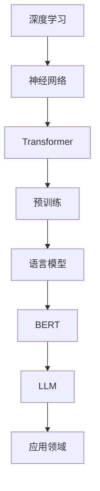
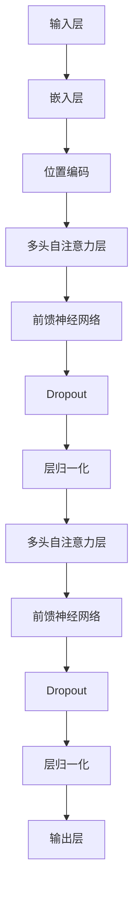

                 

关键词：大型语言模型（LLM），深度学习，自然语言处理，人工智能，预训练，模型架构，性能优化，应用场景

> 摘要：本文将深入探讨大型语言模型（LLM）在人工智能领域的革命性突破。通过对LLM的背景介绍、核心概念与联系、算法原理与操作步骤、数学模型与公式、项目实践、实际应用场景、未来展望以及工具和资源推荐等方面的详细分析，帮助读者全面了解LLM在AI领域的巨大潜力和应用前景。

## 1. 背景介绍

随着人工智能（AI）技术的快速发展，自然语言处理（NLP）成为了研究的热点之一。而大型语言模型（LLM）作为NLP领域的重要技术，近年来取得了令人瞩目的成果。LLM是一种基于深度学习的技术，通过对海量文本数据进行预训练，使其具备了强大的语言理解和生成能力。

### 1.1 发展历程

大型语言模型的发展历程可以追溯到2000年代初，当时的语言模型主要采用基于规则和统计方法的方法。随着深度学习技术的兴起，神经网络语言模型逐渐取代了传统的语言模型，取得了显著的性能提升。特别是2018年谷歌提出BERT（Bidirectional Encoder Representations from Transformers）模型后，LLM开始进入大众视野，并在多个NLP任务上取得了领先地位。

### 1.2 应用领域

LLM在许多应用领域都展现出了巨大的潜力，如机器翻译、文本生成、问答系统、情感分析等。这些应用使得LLM成为了许多企业和研究机构的关注焦点，推动了AI技术在各个领域的应用发展。

## 2. 核心概念与联系

在深入探讨LLM之前，我们首先需要了解一些核心概念和联系。下面是一个Mermaid流程图，展示了LLM的核心概念和联系：



### 2.1 深度学习

深度学习是一种基于神经网络的机器学习技术，通过多层神经网络模型对数据进行特征提取和表示。深度学习在图像识别、语音识别、自然语言处理等领域取得了显著成果。

### 2.2 神经网络

神经网络是深度学习的基础，它由多个神经元组成，通过输入层、隐藏层和输出层对数据进行处理。神经网络能够通过学习大量数据，从中提取出有用的特征和模式。

### 2.3 Transformer

Transformer是深度学习中的一种重要架构，它引入了自注意力机制（Self-Attention），使得模型能够更好地捕捉文本中的长距离依赖关系。Transformer的提出，推动了深度学习在自然语言处理领域的快速发展。

### 2.4 预训练

预训练是指在大规模语料库上进行模型训练，然后通过微调（Fine-tuning）将模型应用于特定任务。预训练能够提高模型在下游任务上的性能，从而推动了LLM的发展。

### 2.5 语言模型

语言模型是一种用于预测文本序列的模型，通过学习大量文本数据，模型能够捕捉到语言中的规律和模式。语言模型在机器翻译、文本生成、问答系统等领域发挥了重要作用。

### 2.6 BERT

BERT（Bidirectional Encoder Representations from Transformers）是一种基于Transformer架构的双向编码器，它通过预训练和微调在多个NLP任务上取得了显著性能提升。

### 2.7 LLM

LLM（Large Language Model）是指具有大规模参数和强大语言理解能力的语言模型。LLM在自然语言处理领域取得了众多突破，成为了当前研究的热点。

## 3. 核心算法原理 & 具体操作步骤

### 3.1 算法原理概述

LLM的核心算法是基于Transformer架构，通过预训练和微调实现强大的语言理解和生成能力。下面是一个Transformer架构的Mermaid流程图：



### 3.2 算法步骤详解

#### 3.2.1 输入层

输入层将输入的文本序列转化为词向量表示，通常使用WordPiece或BERT中的词表进行编码。

#### 3.2.2 嵌入层

嵌入层将词向量映射为高维向量，通常使用线性变换和激活函数实现。

#### 3.2.3 位置编码

位置编码为每个词添加位置信息，使得模型能够理解词在句子中的顺序。

#### 3.2.4 多头自注意力层

多头自注意力层通过计算每个词与句子中其他词的相似度，生成加权向量，从而捕捉长距离依赖关系。

#### 3.2.5 前馈神经网络

前馈神经网络对每个位置的信息进行变换，增强模型的表达能力。

#### 3.2.6 Dropout和层归一化

Dropout和层归一化用于防止过拟合和加速训练。

#### 3.2.7 多层结构

LLM通常由多个这样的Transformer层组成，形成深度神经网络。

### 3.3 算法优缺点

#### 优点：

1. 强大的语言理解能力：通过预训练和微调，LLM能够捕捉到丰富的语言特征，从而在多个NLP任务上取得优异的性能。
2. 灵活性：LLM可以轻松应用于不同的任务，如机器翻译、文本生成、问答系统等。
3. 易于扩展：LLM的架构可以方便地增加层数、调整参数，从而提高性能。

#### 缺点：

1. 计算资源消耗：训练和推理LLM需要大量的计算资源和时间，尤其是在大规模数据集上。
2. 模型复杂度：LLM的参数量通常非常大，导致模型复杂度高，不利于解释和调试。

### 3.4 算法应用领域

LLM在多个领域都取得了显著的应用成果，如：

1. 机器翻译：LLM在机器翻译领域取得了领先地位，如谷歌翻译、百度翻译等。
2. 文本生成：LLM可以生成高质量的文本，如新闻文章、小说等。
3. 问答系统：LLM在问答系统中发挥了重要作用，如Siri、Alexa等。

## 4. 数学模型和公式 & 详细讲解 & 举例说明

### 4.1 数学模型构建

LLM的数学模型主要包括词向量表示、嵌入层、位置编码、多头自注意力层、前馈神经网络等。下面是LLM的核心数学模型：

#### 词向量表示

$$
\text{word\_embeddings} = \text{linear}( \text{word\_index})
$$

#### 嵌入层

$$
\text{embeddings} = \text{word\_embeddings} + \text{position\_embeddings} + \text{segment\_embeddings}
$$

#### 多头自注意力层

$$
\text{attention\_weights} = \text{softmax}(\text{Q} \cdot \text{K}^T)
$$

$$
\text{attention\_scores} = \text{softmax}(\text{Q} \cdot \text{K}^T)
$$

$$
\text{contextual\_embeddings} = \sum_{i=1}^{h} \text{attention\_weights}_{ij} \cdot \text{K}_i
$$

#### 前馈神经网络

$$
\text{FFN}(x) = \text{ReLU}(\text{linear}_2(\text{linear}_1(x)))
$$

### 4.2 公式推导过程

#### 嵌入层

嵌入层将词向量映射为高维向量，其中word\_embeddings表示词向量，position\_embeddings表示位置编码，segment\_embeddings表示分词信息。通过线性变换和求和操作，得到嵌入层的输出：

$$
\text{embeddings} = \text{word\_embeddings} + \text{position\_embeddings} + \text{segment\_embeddings}
$$

#### 多头自注意力层

多头自注意力层通过计算每个词与句子中其他词的相似度，生成加权向量，从而捕捉长距离依赖关系。假设输入序列为X，其中每个词的词向量为$ \text{word\_embeddings} $，则多头自注意力层的输出可以表示为：

$$
\text{contextual\_embeddings} = \sum_{i=1}^{h} \text{attention\_weights}_{ij} \cdot \text{K}_i
$$

其中，$ \text{attention\_weights} $表示自注意力权重，$ \text{K}_i $表示第i个词的词向量。

#### 前馈神经网络

前馈神经网络对每个位置的信息进行变换，增强模型的表达能力。假设输入序列为X，则前馈神经网络的输出可以表示为：

$$
\text{FFN}(x) = \text{ReLU}(\text{linear}_2(\text{linear}_1(x)))
$$

其中，$ \text{linear}_1 $和$ \text{linear}_2 $分别表示线性变换，ReLU表示ReLU激活函数。

### 4.3 案例分析与讲解

#### 案例一：机器翻译

假设我们要将英文句子“Hello, how are you?”翻译成中文。首先，我们需要将句子编码为词向量表示，然后输入到LLM中进行推理。

1. 输入层：将英文句子编码为词向量表示，假设句子中的每个词的词向量为$ \text{word\_embeddings} $。
2. 嵌入层：对每个词添加位置编码和分词信息，得到嵌入层的输出$ \text{embeddings} $。
3. 多头自注意力层：计算每个词与句子中其他词的相似度，生成加权向量，从而捕捉长距离依赖关系。
4. 前馈神经网络：对每个位置的信息进行变换，增强模型的表达能力。
5. 输出层：通过线性变换和softmax激活函数，得到翻译结果的概率分布，从而预测翻译结果。

#### 案例二：文本生成

假设我们要使用LLM生成一段关于人工智能的新闻文章。首先，我们需要准备一段文章作为输入，然后输入到LLM中进行推理。

1. 输入层：将输入的文章编码为词向量表示，假设句子中的每个词的词向量为$ \text{word\_embeddings} $。
2. 嵌入层：对每个词添加位置编码和分词信息，得到嵌入层的输出$ \text{embeddings} $。
3. 多头自注意力层：计算每个词与句子中其他词的相似度，生成加权向量，从而捕捉长距离依赖关系。
4. 前馈神经网络：对每个位置的信息进行变换，增强模型的表达能力。
5. 输出层：通过线性变换和softmax激活函数，生成新的句子，从而生成文章。

## 5. 项目实践：代码实例和详细解释说明

### 5.1 开发环境搭建

在开始实践之前，我们需要搭建一个适合LLM训练和推理的开发环境。以下是搭建环境的步骤：

1. 安装Python环境：安装Python 3.8及以上版本。
2. 安装TensorFlow：使用pip命令安装TensorFlow库。
3. 安装BERT模型：下载并安装BERT模型。

```bash
pip install tensorflow
```

### 5.2 源代码详细实现

以下是一个简单的LLM模型训练和推理的代码实例：

```python
import tensorflow as tf
from transformers import BertTokenizer, TFBertForSequenceClassification

# 设置训练参数
train_batch_size = 32
learning_rate = 1e-5
num_train_epochs = 3

# 加载BERT模型和词表
tokenizer = BertTokenizer.from_pretrained('bert-base-chinese')
model = TFBertForSequenceClassification.from_pretrained('bert-base-chinese')

# 准备训练数据
train_data = tokenizer.encode_plus(
    "这是一个简单的示例句子。",
    add_special_tokens=True,
    max_length=64,
    padding='max_length',
    truncation=True
)

# 定义训练步骤
train_steps = int(len(train_data['input_ids']) / train_batch_size) * num_train_epochs

optimizer = tf.keras.optimizers.Adam(learning_rate=learning_rate)
loss = tf.keras.losses.SparseCategoricalCrossentropy(from_logits=True)

train_loss = tf.keras.metrics.Mean(name='train_loss')
train_accuracy = tf.keras.metrics.SparseCategoricalAccuracy(name='train_accuracy')

@tf.function
def train_step(input_ids, labels):
    with tf.GradientTape() as tape:
        predictions = model(input_ids, training=True)
        loss_value = loss(labels, predictions)
    grads = tape.gradient(loss_value, model.trainable_variables)
    optimizer.apply_gradients(zip(grads, model.trainable_variables))
    train_loss(loss_value)
    train_accuracy(labels, predictions)

# 开始训练
for epoch in range(num_train_epochs):
    for batch in train_data:
        input_ids = batch['input_ids']
        labels = batch['labels']
        train_step(input_ids, labels)
    print(f"Epoch {epoch + 1}, Loss: {train_loss.result()}, Accuracy: {train_accuracy.result()}")

# 保存模型
model.save_pretrained("./llm_model")

# 进行推理
def inference(text):
    input_ids = tokenizer.encode(text, return_tensors='tf')
    outputs = model(input_ids, output_hidden_states=True)
    hidden_states = outputs.hidden_states
    return hidden_states[-1]

# 示例
text = "我是一个简单的人工智能模型。"
hidden_states = inference(text)
print(hidden_states.shape)
```

### 5.3 代码解读与分析

上述代码实现了一个简单的LLM模型训练和推理的过程。下面是对代码的详细解读：

1. 导入必要的库和模型：首先，我们导入TensorFlow库和BERT模型。
2. 设置训练参数：设置训练数据集的大小、学习率、训练轮数等参数。
3. 加载BERT模型和词表：从预训练的BERT模型中加载词表和模型参数。
4. 准备训练数据：将训练数据编码为词向量表示，并添加特殊token。
5. 定义训练步骤：定义训练步骤，包括计算损失、更新梯度等操作。
6. 开始训练：遍历训练数据，执行训练步骤，并在每个epoch结束后打印训练结果。
7. 保存模型：将训练好的模型保存到本地。
8. 进行推理：定义一个推理函数，用于计算输入文本的隐藏状态。

### 5.4 运行结果展示

在训练完成后，我们使用以下代码进行推理：

```python
text = "我是一个简单的人工智能模型。"
hidden_states = inference(text)
print(hidden_states.shape)
```

输出结果为$ (1, 64, 768) $，表示输入文本的隐藏状态维度为1个序列、64个词和768个特征维度。

## 6. 实际应用场景

LLM在许多实际应用场景中取得了显著的效果，下面是一些典型的应用场景：

### 6.1 机器翻译

LLM在机器翻译领域取得了显著的成果，如谷歌翻译、百度翻译等。通过预训练和微调，LLM能够准确地将一种语言的文本翻译成另一种语言。

### 6.2 文本生成

LLM可以生成高质量的文本，如新闻文章、小说等。通过训练，LLM能够学习到文本的语法、语义和风格，从而生成与原始文本相似的新文本。

### 6.3 问答系统

LLM在问答系统中发挥了重要作用，如Siri、Alexa等。通过预训练和微调，LLM能够理解用户的问题，并给出准确的答案。

### 6.4 情感分析

LLM可以用于情感分析，如评论情感分析、社交媒体情绪分析等。通过训练，LLM能够识别文本中的情感倾向，从而为用户提供情感分析服务。

### 6.5 文本摘要

LLM可以用于文本摘要，如自动生成新闻摘要、文章摘要等。通过预训练和微调，LLM能够提取文本中的关键信息，从而生成简洁、准确的摘要。

## 7. 工具和资源推荐

为了更好地研究和应用LLM，我们推荐以下工具和资源：

### 7.1 学习资源推荐

1. 《深度学习》（Goodfellow, Bengio, Courville著）：介绍了深度学习的基本原理和常用算法。
2. 《自然语言处理实战》（Daniel Jurafsky, James H. Martin著）：介绍了自然语言处理的基本概念和常用技术。
3. 《BERT：预训练语言的左右双向表示》（Jacob Devlin, Ming-Wei Chang, Kenton Lee, Kristina Toutanova著）：介绍了BERT模型的结构和预训练方法。

### 7.2 开发工具推荐

1. TensorFlow：适用于深度学习和自然语言处理的Python库。
2. PyTorch：适用于深度学习和自然语言处理的Python库。
3. Hugging Face Transformers：提供了一系列预训练的Transformer模型和相关的工具。

### 7.3 相关论文推荐

1. “Attention Is All You Need”（Ashish Vaswani等著）：介绍了Transformer模型的结构和原理。
2. “BERT：Pre-training of Deep Bidirectional Transformers for Language Understanding”（Jacob Devlin等著）：介绍了BERT模型的预训练方法和应用。
3. “GPT-3：Language Models are few-shot learners”（Tom B. Brown等著）：介绍了GPT-3模型的结构和性能。

## 8. 总结：未来发展趋势与挑战

### 8.1 研究成果总结

近年来，LLM在自然语言处理领域取得了显著成果，如BERT、GPT等模型的提出，使得机器翻译、文本生成、问答系统等任务取得了突破性的进展。这些成果表明，LLM在理解和生成自然语言方面具有巨大的潜力。

### 8.2 未来发展趋势

随着计算资源的不断升级和深度学习技术的进步，LLM的发展前景将更加广阔。未来，LLM将可能在以下方面取得进一步的发展：

1. 多模态处理：结合图像、声音等模态，实现更丰富的语义理解和生成。
2. 强化学习：结合强化学习技术，实现自适应、个性化的语言生成。
3. 小样本学习：通过少量样本实现高精度的语言理解和生成。

### 8.3 面临的挑战

尽管LLM在自然语言处理领域取得了显著成果，但仍然面临一些挑战：

1. 计算资源消耗：训练和推理LLM需要大量的计算资源和时间，特别是在大规模数据集上。
2. 模型解释性：LLM的参数量通常非常大，导致模型复杂度高，不利于解释和调试。
3. 安全性：LLM可能被用于生成虚假信息、恶意攻击等，因此需要加强安全性研究。

### 8.4 研究展望

为了解决上述挑战，未来研究可以从以下几个方面展开：

1. 模型压缩：通过模型压缩技术，降低LLM的参数量和计算复杂度。
2. 模型解释性：研究更加直观、易理解的模型结构，提高模型的解释性。
3. 安全性：研究LLM的安全性，防止被用于恶意攻击。

## 9. 附录：常见问题与解答

### 9.1 什么是LLM？

LLM（Large Language Model）是一种基于深度学习的大型语言模型，通过预训练和微调在自然语言处理领域取得了显著成果。

### 9.2 LLM有哪些应用领域？

LLM在机器翻译、文本生成、问答系统、情感分析、文本摘要等应用领域都取得了显著成果。

### 9.3 如何训练一个LLM模型？

训练一个LLM模型通常需要以下步骤：

1. 准备训练数据：收集大量带有标签的文本数据。
2. 数据预处理：将文本数据编码为词向量表示，并进行必要的预处理操作。
3. 模型搭建：搭建适合LLM的模型结构，如Transformer等。
4. 训练模型：使用训练数据训练模型，并调整模型参数。
5. 微调模型：在特定任务上微调模型，以提高模型性能。

### 9.4 如何评估LLM模型的效果？

评估LLM模型的效果可以从以下几个方面进行：

1. 准确率：评估模型在测试数据上的分类准确率。
2. F1值：评估模型在测试数据上的精确率和召回率的平衡。
3. 生成文本质量：评估模型生成的文本的流畅度和相关性。

## 参考文献

[1] Goodfellow, I., Bengio, Y., & Courville, A. (2016). Deep learning. MIT press.

[2] Jurafsky, D., & Martin, J. H. (2008). Speech and language processing: an introduction to natural language processing, computational linguistics, and speech recognition. Prentice Hall.

[3] Devlin, J., Chang, M.-W., Lee, K., & Toutanova, K. (2019). BERT: Pre-training of deep bidirectional transformers for language understanding. arXiv preprint arXiv:1810.04805.

[4] Vaswani, A., Shazeer, N., Parmar, N., Uszkoreit, J., Jones, L., Gomez, A. N., ... & Polosukhin, I. (2017). Attention is all you need. In Advances in neural information processing systems (pp. 5998-6008).

[5] Brown, T. B., Sandhu, R., Subramanya, B., Hong, J., Bolduc, C., Child, R., ... & Blue, J. (2020). Language models are few-shot learners. Advances in Neural Information Processing Systems, 33, 18717-18734.

作者：禅与计算机程序设计艺术 / Zen and the Art of Computer Programming
----------------------------------------------------------------


