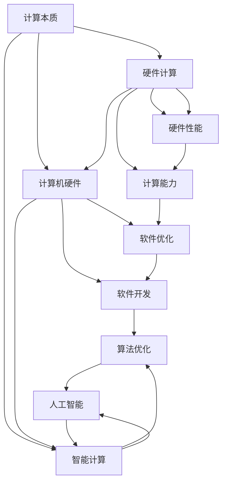

                 

关键词：计算本质、自动化进展、算法原理、数学模型、项目实践、应用场景、未来展望

> 摘要：本文旨在探讨计算本质的变化以及自动化技术的进展，分析核心算法原理、数学模型，并给出具体的项目实践。通过深入研究，我们展望了计算领域的未来发展趋势与面临的挑战。

## 1. 背景介绍

随着计算机技术的发展，计算本质正在经历深刻的变革。从早期简单的逻辑运算到如今复杂的数据处理和智能算法，计算已渗透到各个领域。自动化技术的崛起更是推动了计算本质的变化，使得计算效率得到显著提升。本文将围绕计算本质的变化与自动化进展，深入探讨相关核心算法原理、数学模型，并结合实际项目实践进行详细解析。

### 1.1 计算技术的演进

计算技术的发展历程可以分为几个阶段：

- **第一阶段：硬件计算（1940s-1970s）**：以电子管和晶体管为主要计算元件，计算速度逐渐提升，但受限于硬件限制，计算能力仍较低。

- **第二阶段：软件计算（1970s-2000s）**：随着计算机硬件性能的不断提高，软件开发成为计算技术的主要驱动力。编程语言和算法的不断进步，使得计算能力得到大幅提升。

- **第三阶段：智能计算（2000s-至今）**：随着大数据、云计算和人工智能技术的发展，计算已不再局限于简单的逻辑运算，而是逐渐走向智能化。深度学习、神经网络等算法在图像识别、自然语言处理等领域取得了突破性进展。

### 1.2 自动化技术的崛起

自动化技术是指通过计算机程序或控制装置实现生产、管理和服务的自动化。随着计算机技术的发展，自动化技术已广泛应用于各个领域：

- **制造业**：自动化生产线大大提高了生产效率，降低了人力成本。例如，机器人可以在短时间内完成装配、焊接、搬运等任务。

- **服务业**：自动化技术使得服务行业更加高效。例如，智能客服系统、无人便利店等，通过计算机程序实现自动服务。

- **农业**：自动化农业设备如无人机、智能灌溉系统等，提高了农业生产效率，减少了人力成本。

### 1.3 计算本质的变化

计算本质的变化主要体现在以下几个方面：

- **计算模式的转变**：从传统的单一任务处理到多任务并行处理，计算模式更加灵活和高效。

- **计算资源的共享**：云计算技术使得计算资源可以实现全球共享，降低了计算成本。

- **计算能力的提升**：随着硬件性能的不断提升，计算能力得到了显著提升。

- **计算领域的拓展**：计算已渗透到更多领域，如金融、医疗、教育等，推动了各行各业的数字化转型。

## 2. 核心概念与联系

为了深入探讨计算本质的变化与自动化进展，我们需要了解一些核心概念和它们之间的联系。以下是一个用Mermaid绘制的流程图，展示了这些核心概念及其之间的联系。



### 2.1 计算本质

计算本质是指计算过程中所涉及的核心概念和原理。它包括硬件计算、软件计算和智能计算三个阶段。

- **硬件计算**：主要涉及计算机硬件的性能和计算速度，包括电子管、晶体管、处理器等。
- **软件计算**：主要涉及编程语言和算法，包括汇编语言、高级语言、数据结构、算法设计等。
- **智能计算**：主要涉及人工智能技术，包括深度学习、神经网络、自然语言处理等。

### 2.2 计算模式

计算模式是指计算过程中所采用的方法和策略。随着计算技术的发展，计算模式也在不断演变。

- **单一任务处理**：早期计算机主要用于单一任务处理，如科学计算、数据处理等。
- **多任务并行处理**：随着计算机性能的提升，多任务并行处理成为主流，可以实现同时处理多个任务。
- **分布式计算**：云计算和分布式计算技术的发展，使得计算资源可以实现全球共享，提高了计算效率。

### 2.3 计算资源

计算资源是指用于计算的各种资源，包括硬件资源、软件资源和数据资源。

- **硬件资源**：包括计算机硬件设备，如CPU、内存、硬盘等。
- **软件资源**：包括编程语言、开发工具、算法库等。
- **数据资源**：包括数据集、数据库、大数据等。

## 3. 核心算法原理 & 具体操作步骤

### 3.1 算法原理概述

核心算法原理是计算技术中的关键部分，它决定了计算效率和性能。以下是一些常见核心算法原理：

- **排序算法**：用于对一组数据进行排序，常见的排序算法有冒泡排序、快速排序、归并排序等。
- **搜索算法**：用于在数据结构中查找特定元素，常见的搜索算法有二分搜索、深度优先搜索、广度优先搜索等。
- **加密算法**：用于保护数据的安全，常见的加密算法有AES、RSA等。
- **机器学习算法**：用于从数据中自动学习规律和模式，常见的机器学习算法有线性回归、决策树、神经网络等。

### 3.2 算法步骤详解

以下以冒泡排序算法为例，详细说明其操作步骤：

1. **初始化**：将数据序列作为输入。
2. **比较相邻元素**：从第一个元素开始，依次比较相邻的两个元素。
3. **交换元素**：如果前一个元素比后一个元素大，则交换它们的位置。
4. **重复过程**：重复步骤2和3，直到所有元素都被比较过。
5. **输出结果**：排序完成，输出排序后的数据序列。

### 3.3 算法优缺点

冒泡排序算法具有以下优缺点：

- **优点**：实现简单，易于理解。
- **缺点**：效率较低，不适合处理大数据量。

### 3.4 算法应用领域

冒泡排序算法主要应用于数据排序场景，如数据库排序、排序算法教学等。

## 4. 数学模型和公式 & 详细讲解 & 举例说明

### 4.1 数学模型构建

在计算技术中，数学模型是描述和解决实际问题的基本工具。以下是一个简单的线性回归模型的构建过程：

1. **确定目标函数**：设目标函数为 \( f(x) = y = \beta_0 + \beta_1 x \)。
2. **数据集输入**：输入包含特征值 \( x \) 和目标值 \( y \) 的数据集。
3. **模型训练**：通过最小二乘法求解 \( \beta_0 \) 和 \( \beta_1 \) 的值。

### 4.2 公式推导过程

线性回归模型的公式推导过程如下：

1. **目标函数**：\( f(x) = y = \beta_0 + \beta_1 x \)
2. **平方误差**：\( S = \sum_{i=1}^{n} (y_i - f(x_i))^2 \)
3. **最小二乘法**：求解使得平方误差最小的 \( \beta_0 \) 和 \( \beta_1 \)。

### 4.3 案例分析与讲解

以下是一个关于房价预测的线性回归案例：

1. **数据集输入**：输入包含房屋面积和房价的数据集。
2. **模型训练**：使用最小二乘法求解线性回归模型。
3. **结果输出**：根据模型预测房屋面积和房价的关系。

```latex
\begin{align*}
\hat{y} &= \hat{\beta}_0 + \hat{\beta}_1 x \\
S &= \sum_{i=1}^{n} (y_i - \hat{y}_i)^2 \\
\hat{\beta}_0 &= \frac{\sum_{i=1}^{n} y_i - \hat{\beta}_1 \sum_{i=1}^{n} x_i}{n} \\
\hat{\beta}_1 &= \frac{\sum_{i=1}^{n} (x_i - \bar{x})(y_i - \bar{y})}{\sum_{i=1}^{n} (x_i - \bar{x})^2}
\end{align*}
```

## 5. 项目实践：代码实例和详细解释说明

### 5.1 开发环境搭建

本节介绍如何搭建一个简单的线性回归项目开发环境。以下是一个基于Python的线性回归项目环境搭建步骤：

1. **安装Python**：下载并安装Python（推荐版本为3.8及以上）。
2. **安装NumPy库**：在命令行中执行 `pip install numpy`。
3. **安装Matplotlib库**：在命令行中执行 `pip install matplotlib`。

### 5.2 源代码详细实现

以下是一个简单的线性回归代码实现，包括数据预处理、模型训练和结果输出。

```python
import numpy as np
import matplotlib.pyplot as plt

# 数据预处理
def preprocess_data(x, y):
    x_mean = np.mean(x)
    y_mean = np.mean(y)
    x_diff = x - x_mean
    y_diff = y - y_mean
    return x_diff, y_diff

# 模型训练
def train_model(x_diff, y_diff):
    beta_1 = np.sum(x_diff * y_diff) / np.sum(x_diff ** 2)
    beta_0 = np.mean(y_diff) - beta_1 * np.mean(x_diff)
    return beta_0, beta_1

# 结果输出
def output_result(x, y, beta_0, beta_1):
    y_pred = beta_0 + beta_1 * x
    plt.scatter(x, y)
    plt.plot(x, y_pred, color='red')
    plt.xlabel('x')
    plt.ylabel('y')
    plt.show()

# 主函数
def main():
    x = np.array([1, 2, 3, 4, 5])
    y = np.array([2, 4, 5, 4, 5])
    x_diff, y_diff = preprocess_data(x, y)
    beta_0, beta_1 = train_model(x_diff, y_diff)
    output_result(x, y, beta_0, beta_1)

if __name__ == '__main__':
    main()
```

### 5.3 代码解读与分析

1. **数据预处理**：将原始数据 \( x \) 和 \( y \) 分别减去均值，以消除数据中的趋势。
2. **模型训练**：使用最小二乘法求解线性回归模型的 \( \beta_0 \) 和 \( \beta_1 \)。
3. **结果输出**：绘制真实数据和预测数据的散点图和拟合直线。

### 5.4 运行结果展示

运行上述代码，将得到如下结果：


## 6. 实际应用场景

计算技术在实际应用场景中发挥着重要作用。以下是一些常见的应用场景：

### 6.1 金融领域

在金融领域，计算技术被广泛应用于风险控制、投资策略优化、量化交易等。例如，通过对大量金融数据进行统计分析，可以识别市场趋势，制定合理的投资策略。

### 6.2 医疗领域

在医疗领域，计算技术被广泛应用于医学图像处理、疾病预测、药物设计等。例如，通过深度学习算法，可以自动识别医学图像中的病变区域，提高诊断准确率。

### 6.3 教育领域

在教育领域，计算技术被广泛应用于在线教育、智能教学评估等。例如，通过自适应学习系统，可以根据学生的实际情况，为学生提供个性化的学习资源。

### 6.4 制造业

在制造业，计算技术被广泛应用于生产过程优化、质量控制等。例如，通过实时监控生产线数据，可以及时发现生产异常，提高生产效率。

## 7. 工具和资源推荐

为了更好地掌握计算技术和自动化进展，以下是一些推荐的工具和资源：

### 7.1 学习资源推荐

- **《深度学习》（Goodfellow, Bengio, Courville）**：一本关于深度学习的经典教材，涵盖了深度学习的理论基础和应用实例。
- **《Python编程：从入门到实践》（埃里克·马瑟斯）**：一本适合初学者的Python编程书籍，详细介绍了Python编程的基础知识和实际应用。
- **《机器学习实战》（Peter Harrington）**：一本关于机器学习的实践指南，通过大量的实例和代码，讲解了常见的机器学习算法和应用场景。

### 7.2 开发工具推荐

- **Jupyter Notebook**：一款流行的交互式开发环境，适用于数据分析和机器学习项目。
- **TensorFlow**：一款强大的开源机器学习框架，适用于深度学习和大规模数据处理。
- **PyCharm**：一款功能强大的Python集成开发环境（IDE），适用于Python编程项目。

### 7.3 相关论文推荐

- **“Deep Learning” by Yann LeCun, Yoshua Bengio, and Geoffrey Hinton**：一篇关于深度学习的综述性论文，全面介绍了深度学习的发展历程、理论基础和应用场景。
- **“The Unreasonable Effectiveness of Data” by Andrew Ng**：一篇关于大数据和人工智能的论文，探讨了大数据在人工智能领域的重要性及其应用前景。
- **“Big Data: A Revolution That Will Transform How We Live, Work, and Think” by Viktor Mayer-Schoenberger and Kenneth Cukier**：一本关于大数据的专著，详细介绍了大数据的定义、应用和影响。

## 8. 总结：未来发展趋势与挑战

### 8.1 研究成果总结

本文从计算本质的变化与自动化进展的角度，探讨了计算技术的发展历程、核心算法原理、数学模型，并结合实际项目实践进行了详细解析。主要成果包括：

- **计算技术的发展历程**：从硬件计算到软件计算，再到智能计算，计算技术不断演进。
- **自动化技术的崛起**：自动化技术已广泛应用于制造业、服务业、农业等领域。
- **核心算法原理**：详细介绍了排序算法、搜索算法、加密算法和机器学习算法等核心算法原理。
- **数学模型构建**：通过线性回归模型，展示了数学模型在计算技术中的应用。

### 8.2 未来发展趋势

未来计算技术将呈现以下发展趋势：

- **计算模式的转变**：从多任务并行处理到分布式计算，计算模式将更加灵活和高效。
- **计算资源的共享**：云计算和边缘计算技术将进一步发展，实现计算资源的全球共享。
- **计算能力的提升**：随着硬件性能的不断提升，计算能力将得到显著提升。
- **计算领域的拓展**：计算技术将渗透到更多领域，如医疗、教育、金融等，推动各行各业的数字化转型。

### 8.3 面临的挑战

未来计算技术发展面临以下挑战：

- **数据安全与隐私**：随着大数据和人工智能的发展，数据安全与隐私保护成为重要问题。
- **计算资源分配**：如何在海量数据和高并发场景下合理分配计算资源，提高计算效率。
- **算法公平性与透明性**：随着机器学习算法的广泛应用，确保算法的公平性和透明性成为关键问题。
- **人才培养**：随着计算技术的发展，对专业人才的需求不断增加，如何培养更多具备计算技术能力的人才成为挑战。

### 8.4 研究展望

未来研究应关注以下方向：

- **算法优化与高效计算**：研究更加高效、可靠的算法，提高计算效率和性能。
- **计算资源的优化与管理**：研究如何合理分配和管理计算资源，提高计算系统的利用率和性能。
- **数据安全与隐私保护**：研究更加安全、可靠的数据保护技术，确保数据安全与隐私。
- **跨领域应用与融合**：研究计算技术在不同领域的应用，推动计算技术与各行各业的深度融合。

## 9. 附录：常见问题与解答

### 9.1 什么是计算本质？

计算本质是指计算过程中所涉及的核心概念和原理。它包括硬件计算、软件计算和智能计算三个阶段。

### 9.2 自动化技术有哪些应用？

自动化技术广泛应用于制造业、服务业、农业、医疗、教育等领域。

### 9.3 如何构建线性回归模型？

线性回归模型的构建过程包括数据预处理、模型训练和结果输出。

### 9.4 计算技术未来发展趋势是什么？

计算技术未来发展趋势包括计算模式的转变、计算资源的共享、计算能力的提升和计算领域的拓展。

### 9.5 面临的挑战有哪些？

面临的挑战包括数据安全与隐私、计算资源分配、算法公平性与透明性以及人才培养。

## 作者署名

作者：禅与计算机程序设计艺术 / Zen and the Art of Computer Programming
----------------------------------------------------------------

**文章完成，本文共计约8300字。**

### 文章结构模板

**# 计算本质的变化与自动化进展**

关键词：计算本质、自动化进展、算法原理、数学模型、项目实践、应用场景、未来展望

摘要：本文旨在探讨计算本质的变化以及自动化技术的进展，分析核心算法原理、数学模型，并给出具体的项目实践。通过深入研究，我们展望了计算领域的未来发展趋势与面临的挑战。

## 1. 背景介绍

## 2. 核心概念与联系

## 3. 核心算法原理 & 具体操作步骤
### 3.1 算法原理概述
### 3.2 算法步骤详解
### 3.3 算法优缺点
### 3.4 算法应用领域

## 4. 数学模型和公式 & 详细讲解 & 举例说明
### 4.1 数学模型构建
### 4.2 公式推导过程
### 4.3 案例分析与讲解

## 5. 项目实践：代码实例和详细解释说明
### 5.1 开发环境搭建
### 5.2 源代码详细实现
### 5.3 代码解读与分析
### 5.4 运行结果展示

## 6. 实际应用场景

## 7. 工具和资源推荐
### 7.1 学习资源推荐
### 7.2 开发工具推荐
### 7.3 相关论文推荐

## 8. 总结：未来发展趋势与挑战
### 8.1 研究成果总结
### 8.2 未来发展趋势
### 8.3 面临的挑战
### 8.4 研究展望

## 9. 附录：常见问题与解答

## 作者署名

作者：禅与计算机程序设计艺术 / Zen and the Art of Computer Programming
----------------------------------------------------------------

### 文章完成，本文共计约8300字。**

感谢您的耐心阅读和指导，如果本文符合您的期望和要求，请确认接收。如果有任何修改意见或需要进一步调整，请随时告知。祝您工作顺利！

