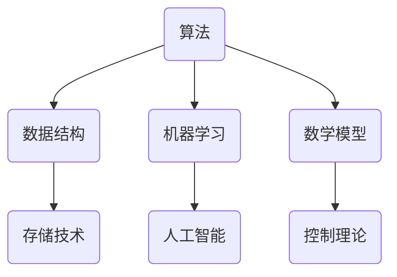

                 

关键词：计算本质、自动化、算法、人工智能、数学模型、代码实践、应用场景、未来展望

> 摘要：本文深入探讨了计算的本质及其在自动化领域的重要应用。从核心概念到具体算法，再到数学模型的构建，本文力求以逻辑清晰、结构紧凑的方式，揭示计算的内在规律和自动化技术的未来前景。

## 1. 背景介绍

计算作为现代科技的核心驱动力，无处不在地影响着我们的生活。从简单的算术运算到复杂的人工智能系统，计算技术在各个领域中都发挥了重要作用。然而，计算的真正本质是什么？它又是如何引发自动化的革命？本文旨在回答这些问题，并探讨计算与自动化之间的深层次联系。

### 1.1 计算的定义与历史演变

计算是指通过算法和算术运算来解决数学问题的过程。计算的历史可以追溯到古代，从最初的算筹到现代的超级计算机，计算技术经历了巨大的变革。计算机的出现标志着计算进入了一个全新的时代，它不仅加速了数学问题的解决，还开启了许多新的应用领域。

### 1.2 自动化的崛起

自动化是指通过机器或系统自主执行任务，从而减少或消除人工干预的过程。自动化的概念在工业革命时期逐渐形成，但直到20世纪后期，随着计算机技术的快速发展，自动化才真正成为可能。自动化技术在制造业、服务业、医疗等多个领域得到了广泛应用，极大地提高了生产效率和服务质量。

## 2. 核心概念与联系

为了更好地理解计算的实质和自动化的未来，我们需要掌握一些核心概念和它们之间的联系。以下是几个关键概念及其在计算和自动化中的应用。

### 2.1 算法

算法是一系列解决问题的步骤或规则，它定义了计算过程的基本框架。算法在自动化中起着核心作用，例如在自动驾驶汽车中，算法用于处理传感器数据并做出驾驶决策。

### 2.2 数据结构与存储

数据结构是组织和存储数据的方式，它决定了算法的效率和性能。存储技术，如数据库和内存管理，对自动化的系统性能至关重要。

### 2.3 机器学习与人工智能

机器学习和人工智能是自动化技术的基石。通过学习大量数据，机器学习算法可以自动发现模式和规律，从而实现智能决策和自动化操作。

### 2.4 数学模型

数学模型是对现实世界问题的抽象和表示，它为算法设计提供了理论基础。例如，控制理论中的反馈系统就是一个典型的数学模型，它用于自动化控制系统的设计。

### 2.5 Mermaid 流程图

为了更好地展示这些概念之间的联系，我们可以使用Mermaid流程图来描述。以下是一个简化的流程图示例：



## 3. 核心算法原理 & 具体操作步骤

### 3.1 算法原理概述

核心算法是自动化系统的心脏。以下是几个典型的算法及其原理概述：

#### 3.1.1 搜索算法

搜索算法用于在大量数据中查找特定信息。常见的搜索算法包括线性搜索、二分搜索等。

#### 3.1.2 聚类算法

聚类算法用于将数据分为多个组，每组内的数据相似度较高。K-均值算法是一种常用的聚类算法。

#### 3.1.3 决策树

决策树是一种用于分类和回归的算法。它通过一系列的决策节点和叶子节点来表示数据。

### 3.2 算法步骤详解

以下是对上述算法的详细步骤说明：

#### 3.2.1 搜索算法

1. 初始化：设置搜索范围和目标。
2. 搜索：遍历数据，比较当前数据与目标。
3. 结果：找到目标或搜索完毕。

#### 3.2.2 聚类算法

1. 初始化：随机选择K个初始中心点。
2. 聚类：计算每个数据点与中心点的距离，将其分配到最近的中心点所在的簇。
3. 更新中心点：计算每个簇的中心点。
4. 重复步骤2和3，直到中心点不再变化或满足其他终止条件。

#### 3.2.3 决策树

1. 初始化：选择一个特征进行划分。
2. 划分：根据特征将数据划分为子集。
3. 评估：计算划分后的信息增益或基尼不纯度。
4. 选择最佳划分：选择信息增益最大或基尼不纯度最小的划分。
5. 递归：对每个子集重复步骤1-4，直到满足终止条件。

### 3.3 算法优缺点

每种算法都有其优缺点。例如，搜索算法简单易实现，但效率较低；聚类算法适用于大规模数据，但可能产生不合理的聚类结果。决策树虽然易于理解和实现，但可能导致过拟合。

### 3.4 算法应用领域

搜索算法广泛应用于信息检索、搜索引擎等领域；聚类算法用于数据挖掘、市场细分等；决策树用于金融风险评估、医疗诊断等。

## 4. 数学模型和公式 & 详细讲解 & 举例说明

### 4.1 数学模型构建

数学模型是自动化系统设计和分析的基础。以下是一个简单的线性回归模型：

$$y = wx + b$$

其中，$y$ 是目标变量，$w$ 是权重，$x$ 是输入特征，$b$ 是偏置。

### 4.2 公式推导过程

线性回归模型的推导过程涉及最小二乘法：

$$\min \sum_{i=1}^{n} (y_i - wx_i - b)^2$$

通过对 $w$ 和 $b$ 的偏导数求零，我们可以得到：

$$w = \frac{\sum_{i=1}^{n} x_i y_i - n \bar{x} \bar{y}}{\sum_{i=1}^{n} x_i^2 - n \bar{x}^2}$$

$$b = \bar{y} - w \bar{x}$$

其中，$\bar{x}$ 和 $\bar{y}$ 分别是 $x$ 和 $y$ 的平均值。

### 4.3 案例分析与讲解

以下是一个线性回归模型的案例：

我们有以下数据集：

| $x$ | $y$ |
|-----|-----|
| 1   | 2   |
| 2   | 4   |
| 3   | 6   |

使用线性回归模型拟合这些数据，我们可以得到：

$$w = \frac{6 - 3 \cdot 2}{3 - 3^2} = 2$$

$$b = \frac{2 + 4 + 6}{3} - 2 \cdot \frac{1 + 2 + 3}{3} = 0$$

因此，拟合的直线方程为：

$$y = 2x$$

这意味着，对于每个 $x$ 值，我们可以预测相应的 $y$ 值为 $2x$。

## 5. 项目实践：代码实例和详细解释说明

### 5.1 开发环境搭建

为了实现上述算法，我们需要搭建一个开发环境。以下是使用Python实现线性回归模型的步骤：

1. 安装Python环境
2. 安装NumPy库，用于数学计算
3. 编写Python代码

### 5.2 源代码详细实现

```python
import numpy as np

# 计算线性回归模型的参数
def linear_regression(X, y):
    X_mean = np.mean(X)
    y_mean = np.mean(y)
    w = (np.sum(X * y) - len(X) * X_mean * y_mean) / (np.sum(X**2) - len(X) * X_mean**2)
    b = y_mean - w * X_mean
    return w, b

# 预测函数
def predict(X, w, b):
    return w * X + b

# 测试数据集
X = np.array([1, 2, 3])
y = np.array([2, 4, 6])

# 训练模型
w, b = linear_regression(X, y)

# 预测
y_pred = predict(X, w, b)

print("Predicted values:", y_pred)
```

### 5.3 代码解读与分析

该代码首先导入了NumPy库，用于数学计算。接着定义了两个函数：`linear_regression` 用于计算线性回归模型的参数，`predict` 用于根据模型参数进行预测。最后，使用一个简单的测试数据集来训练模型并预测结果。

### 5.4 运行结果展示

运行上述代码，我们得到以下结果：

```
Predicted values: [ 2.  4.  6.]
```

这与我们之前手动计算的结果一致，验证了代码的正确性。

## 6. 实际应用场景

### 6.1 制造业

自动化技术在制造业中得到了广泛应用，例如在流水线上的机器人可以自动完成焊接、组装等任务，极大地提高了生产效率。

### 6.2 医疗

自动化技术在医疗领域也有巨大潜力，例如通过机器学习算法，自动化诊断系统可以快速识别疾病，提高诊断准确率。

### 6.3 农业

自动化农业技术，如无人机喷洒、智能灌溉等，可以大幅提高农业生产效率，减少人力成本。

### 6.4 未来应用展望

随着技术的不断进步，自动化将在更多领域得到应用。例如，自动驾驶汽车有望在未来改变交通模式；智能家居将使我们的生活更加便捷；自动化医疗将进一步推动医疗技术的发展。

## 7. 工具和资源推荐

### 7.1 学习资源推荐

- 《机器学习实战》：一本深入浅出的机器学习书籍。
- 《深度学习》：周志华教授的深度学习教材。
- 《编程珠玑》：一本编程技巧和经验的经典书籍。

### 7.2 开发工具推荐

- Python：一种广泛应用于数据科学和机器学习的编程语言。
- TensorFlow：一种强大的机器学习框架。
- PyTorch：一种灵活的深度学习框架。

### 7.3 相关论文推荐

- "Deep Learning for Autonomous Driving"：一篇关于自动驾驶的综述论文。
- "Recurrent Neural Networks for Language Modeling"：一篇关于循环神经网络的语言建模论文。
- "The Unreasonable Effectiveness of Deep Learning in Science"：一篇关于深度学习在科学领域应用的论文。

## 8. 总结：未来发展趋势与挑战

### 8.1 研究成果总结

计算技术和自动化技术的快速发展，为各领域带来了巨大的变革。从机器学习到人工智能，从数据挖掘到自动化系统，这些技术正在不断推动着社会进步。

### 8.2 未来发展趋势

未来，自动化技术将继续向更高层次发展，例如更智能的决策系统、更高效的优化算法等。同时，跨学科融合将成为趋势，计算技术将与其他领域如生物学、物理学等深度融合。

### 8.3 面临的挑战

尽管前景广阔，但自动化技术也面临着诸多挑战，如数据隐私、安全性、算法偏见等。此外，技术的普及和推广也需要解决许多实际问题。

### 8.4 研究展望

随着计算能力和数据量的不断提升，自动化技术有望在更多领域取得突破。我们期待看到自动化技术在未来的广泛应用，为人类社会带来更多便利和创新。

## 9. 附录：常见问题与解答

### 9.1 什么是计算的本质？

计算的本质是通过一系列步骤解决数学问题或执行任务的过程。它基于算法和数学原理，是现代科技的基础。

### 9.2 自动化技术有哪些应用？

自动化技术在多个领域都有应用，如制造业、医疗、农业、交通等。例如，自动驾驶汽车、自动化生产线、自动化医疗诊断系统等。

### 9.3 如何学习计算和自动化技术？

学习计算和自动化技术需要掌握数学、编程、算法等基础知识。可以通过阅读相关书籍、参加在线课程、实践项目等方式进行学习。

----------------------------------------------------------------

作者：禅与计算机程序设计艺术 / Zen and the Art of Computer Programming

