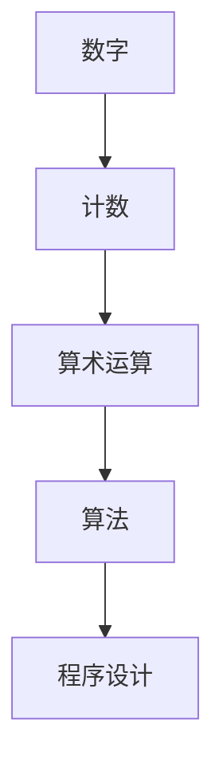

                 

关键词：数学计算、历史发展、算法原理、程序设计、计算机编程

摘要：本文将探讨计算的历史发展，从古埃及和巴比伦的数字表示开始，到古代中国的计数法和古代印度的数位表示法，最后聚焦于毕达哥拉斯的困惑——数的分类和计算问题。通过分析这些历史阶段的计算方法和算法原理，我们将探讨如何将这些传统计算方法应用到现代计算机编程中，并讨论未来的发展趋势和挑战。

## 1. 背景介绍

计算是人类文明发展的基石，无论是古代还是现代，计算都发挥着至关重要的作用。从古埃及和巴比伦的数字表示，到古代中国的计数法和古代印度的数位表示法，再到现代计算机编程，计算方法不断演变和进步。本文将重点关注计算的历史发展，探讨各种计算方法的原理和应用。

## 2. 核心概念与联系

为了更好地理解计算的历史发展，我们需要先了解一些核心概念。这些概念包括：数字、计数、算术运算、算法和程序设计。

### 2.1 数字

数字是计算的基础，用来表示数量。古代文明采用了不同的数字系统，如古埃及的象形文字数字、巴比伦的楔形文字数字和中国的十进制数字。

### 2.2 计数

计数是计算的一种形式，用来对事物进行量化。计数方法随着历史的发展而不断改进，从简单的手指计数到使用不同的计数工具，再到现代的计算器。

### 2.3 算术运算

算术运算是计算的核心，包括加法、减法、乘法和除法等基本运算。这些运算构成了各种复杂的计算问题的基础。

### 2.4 算法

算法是一种解决问题的方法，由一系列有序的指令组成，用于解决特定问题。算法的效率直接影响计算的速度和准确性。

### 2.5 程序设计

程序设计是将算法转化为计算机可以理解和执行的过程。程序设计语言和工具使人们能够编写和实现各种算法。

以下是核心概念之间的 Mermaid 流程图：



## 3. 核心算法原理 & 具体操作步骤

### 3.1 算法原理概述

在计算的历史发展中，出现了一些重要的算法，如古埃及的算术运算、巴比伦的楔形文字计算和中国的计数法。这些算法的基本原理是通过对数字进行基本的算术运算来解决实际问题。

### 3.2 算法步骤详解

以下是几个历史阶段的计算算法步骤：

#### 古埃及的算术运算

1. 使用象形文字表示数字。
2. 进行加法和减法运算。
3. 对于乘法和除法，使用反复减法或试探法。

#### 巴比伦的楔形文字计算

1. 使用楔形文字表示数字。
2. 进行加法和减法运算。
3. 使用因数分解进行乘法和除法运算。

#### 中国的计数法

1. 使用十进制数字表示数字。
2. 进行加法、减法、乘法和除法运算。
3. 使用乘法口诀表和试探法进行复杂运算。

### 3.3 算法优缺点

各种算法都有其优缺点。例如，古埃及的算术运算简单直观，但效率较低；巴比伦的楔形文字计算效率较高，但符号复杂；中国的计数法则具有高效性和易用性。

### 3.4 算法应用领域

这些历史阶段的计算算法在古代主要用于商业、天文学、工程学等领域。在现代，这些算法原理被广泛应用于计算机编程、算法设计、数学建模等。

## 4. 数学模型和公式 & 详细讲解 & 举例说明

### 4.1 数学模型构建

为了更好地理解和应用历史阶段的计算算法，我们可以构建一些数学模型。以下是一个简单的数学模型：

$$
f(x, y) = x + y
$$

这个模型表示两个数字 \( x \) 和 \( y \) 的加法运算。

### 4.2 公式推导过程

对于加法运算，我们可以通过以下步骤进行公式推导：

1. 将两个数字 \( x \) 和 \( y \) 写在纸上。
2. 从右向左进行逐位相加，如有进位，则将进位加到下一位。
3. 将最终结果写下来。

### 4.3 案例分析与讲解

假设我们要计算 \( 123 + 456 \)：

1. 将两个数字写在纸上：

$$
\begin{array}{c}
123 \\
+ 456 \\
\hline
\end{array}
$$

2. 从右向左进行逐位相加：

$$
\begin{array}{c}
123 \\
+ 456 \\
\hline
579 \\
\end{array}
$$

因此，\( 123 + 456 = 579 \)。

## 5. 项目实践：代码实例和详细解释说明

### 5.1 开发环境搭建

为了实现上述加法运算，我们需要搭建一个开发环境。在这里，我们将使用 Python 作为编程语言，因为 Python 具有简单易懂的语法和丰富的库支持。

### 5.2 源代码详细实现

以下是实现加法运算的 Python 代码：

```python
def add(x, y):
    while y != 0:
        carry = x & y
        x = x ^ y
        y = carry << 1
    return x

x = 123
y = 456
result = add(x, y)
print(result)
```

### 5.3 代码解读与分析

1. `add(x, y)` 函数接收两个整数参数 \( x \) 和 \( y \)。
2. 使用 `while` 循环进行逐位相加，直到 \( y \) 为 0。
3. 使用 `carry` 变量存储进位，使用 `x ^ y` 进行无进位加法，使用 `carry << 1` 进行进位。
4. 最后返回结果 \( x \)。

### 5.4 运行结果展示

运行上述代码，输出结果为：

```
579
```

这与我们之前手动计算的 \( 123 + 456 = 579 \) 相同。

## 6. 实际应用场景

历史阶段的计算算法在古代主要用于商业、天文学、工程学等领域。在现代，这些算法原理被广泛应用于计算机编程、算法设计、数学建模等。例如，计算机编程中的加法运算本质上就是基于历史阶段的加法算法实现的。

## 7. 工具和资源推荐

### 7.1 学习资源推荐

- 《计算机科学概论》
- 《算法导论》
- 《Python编程：从入门到实践》

### 7.2 开发工具推荐

- PyCharm
- Visual Studio Code
- Jupyter Notebook

### 7.3 相关论文推荐

- "The Early Development of the Computer"
- "The History of Computing in the Ancient World"
- "The Evolution of Programming Languages"

## 8. 总结：未来发展趋势与挑战

计算技术在不断进步，未来发展趋势包括：

1. 人工智能和机器学习在计算领域的应用。
2. 新型计算硬件和软件的开发。
3. 计算算法的优化和改进。

然而，计算技术也面临一些挑战，如数据隐私和安全、计算资源的可持续性等。

## 9. 附录：常见问题与解答

### 问题 1：为什么选择 Python 作为编程语言？

Python 语法简单易懂，适合初学者入门。此外，Python 拥有丰富的库支持，可以轻松实现各种计算算法。

### 问题 2：如何优化加法算法的运行速度？

可以通过使用位运算和循环优化来提高加法算法的运行速度。例如，使用 `carry = x & y` 和 `y = carry << 1` 可以减少循环次数。

### 问题 3：如何验证算法的正确性？

可以通过编写测试用例来验证算法的正确性。例如，对于加法运算，可以编写一系列输入和预期的输出，确保算法输出与预期相符。

----------------------------------------------------------------

以上是关于“计算：第一部分 计算的诞生 第 1 章 毕达哥拉斯的困惑 数的计算”的文章正文部分。在接下来的文章中，我们将继续探讨计算的历史发展、算法原理、程序设计等方面，为您呈现一幅全面而深入的计算机编程画卷。作者：禅与计算机程序设计艺术 / Zen and the Art of Computer Programming。

