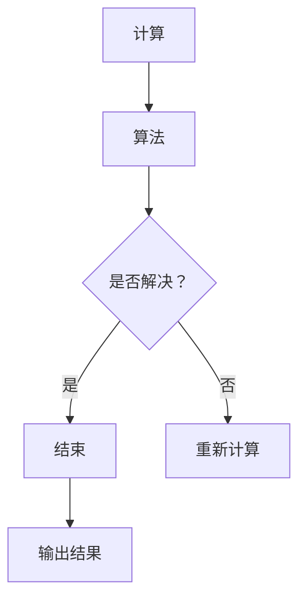

                 

关键词：计算历史，数学发展，文明古国，计算方法，算法原理，数学模型，编程实践

> 摘要：本文回顾了人类计算历史的起源，探讨了古代文明在计算领域的成就与贡献。通过对毕达哥拉斯的困惑及其解决方法的讨论，阐述了文明古国的计算方法和算法原理。文章进一步分析了数学模型和公式的构建与推导，并通过实例展示了这些方法在实际项目中的应用。最后，对计算领域的未来发展趋势与挑战进行了展望。

## 1. 背景介绍

计算的历史可以追溯到古代，早在几千年前，人类就开始使用各种简单工具来进行计算。计算不仅是一种实用技能，还是一种哲学思考的方式。在文明古国，如古埃及、巴比伦、印度和中国，计算的发展达到了一定的高度，这些文明的计算方法和算法为后世的数学和科学奠定了基础。

本文将首先介绍计算的历史背景，然后深入探讨毕达哥拉斯的困惑及其解决方法，接着分析古代文明国的计算方法和算法原理。文章还将讨论数学模型和公式的构建与推导，并通过实际项目展示这些方法的应用。最后，本文将总结研究成果，展望未来计算领域的发展趋势与挑战。

## 2. 核心概念与联系

### 2.1. 计算的定义

计算是指通过算法和数学模型，对信息进行处理和转换的过程。计算可以用来解决问题、模拟现实、优化资源分配等。在计算机科学中，计算是指使用算法和数据结构进行信息处理的能力。

### 2.2. 算法原理

算法是解决问题的步骤集合，用于处理特定类型的输入，产生特定的输出。算法的原理在于其逻辑性和结构性，通过一系列明确的步骤，将复杂问题分解为简单部分，逐步解决。

### 2.3. 数学模型

数学模型是描述现实世界的一种抽象方式，通过数学公式和方程来表示问题。数学模型可以帮助我们理解和分析问题，从而找到解决方案。

### 2.4. 计算与算法的联系

计算和算法是密不可分的，计算是实现算法的过程。算法提供了计算的框架和步骤，而计算则是算法在具体问题中的应用。

## 2.5. Mermaid 流程图

以下是计算与算法原理的 Mermaid 流程图：



## 3. 核心算法原理 & 具体操作步骤

### 3.1. 算法原理概述

本文将介绍一种经典的计算算法——牛顿迭代法。牛顿迭代法是一种用于求解非线性方程的数值方法，其基本原理是通过不断逼近，找到方程的根。

### 3.2. 算法步骤详解

#### 3.2.1. 初始值设定

选择一个初始近似值 \( x_0 \)。

#### 3.2.2. 迭代计算

对于每个迭代步骤 \( i \)，计算新的近似值 \( x_{i+1} \)：

\[ x_{i+1} = x_i - \frac{f(x_i)}{f'(x_i)} \]

其中，\( f(x) \) 是非线性方程，\( f'(x) \) 是 \( f(x) \) 的导数。

#### 3.2.3. 判断停止条件

判断当前近似值 \( x_{i+1} \) 是否满足停止条件。常见的停止条件包括：

- 近似值变化量 \( |x_{i+1} - x_i| \) 小于某个阈值；
- 迭代次数达到某个上限。

#### 3.2.4. 输出结果

输出最终的近似值 \( x_{i+1} \) 作为非线性方程的解。

### 3.3. 算法优缺点

#### 优点：

- 牛顿迭代法是一种高效的数值方法，收敛速度较快；
- 可以用于求解各种非线性方程。

#### 缺点：

- 需要计算导数，对于一些复杂的非线性方程，计算导数可能比较困难；
- 可能出现不收敛或收敛缓慢的情况。

### 3.4. 算法应用领域

牛顿迭代法广泛应用于各个领域，如物理学、工程学、经济学等。在计算机科学中，牛顿迭代法常用于求解优化问题、方程求解、数值分析等。

## 4. 数学模型和公式 & 详细讲解 & 举例说明

### 4.1. 数学模型构建

数学模型是描述现实世界的一种抽象方式，其构建过程通常包括以下几个步骤：

1. **明确问题背景**：了解问题的实际背景，确定需要解决的问题。
2. **定义变量**：根据问题，定义所需的变量，包括输入变量和输出变量。
3. **建立关系**：通过数学公式和方程，描述变量之间的关系。
4. **简化和假设**：对模型进行简化和假设，以简化计算和提高计算效率。

### 4.2. 公式推导过程

以牛顿迭代法为例，其核心公式为：

\[ x_{i+1} = x_i - \frac{f(x_i)}{f'(x_i)} \]

该公式的推导过程如下：

1. **定义目标方程**：设 \( f(x) = 0 \) 是需要求解的非线性方程。
2. **线性近似**：在 \( x_i \) 处对 \( f(x) \) 进行线性近似，得到 \( f(x) \approx f(x_i) + f'(x_i)(x - x_i) \)。
3. **求解线性方程**：将线性近似代入原方程，得到 \( f(x_i) + f'(x_i)(x - x_i) = 0 \)，求解得到 \( x = x_i - \frac{f(x_i)}{f'(x_i)} \)。
4. **迭代更新**：将求得的 \( x \) 值作为新的近似值，重复迭代过程。

### 4.3. 案例分析与讲解

以求解方程 \( x^2 - 2 = 0 \) 为例，使用牛顿迭代法求解。

1. **初始值设定**：选择初始近似值 \( x_0 = 1 \)。
2. **迭代计算**：
   - 第一次迭代：\( f(x_0) = 1^2 - 2 = -1 \)，\( f'(x_0) = 2 \cdot 1 = 2 \)，
   \[ x_1 = x_0 - \frac{f(x_0)}{f'(x_0)} = 1 - \frac{-1}{2} = 1.5 \]
   - 第二次迭代：\( f(x_1) = 1.5^2 - 2 = 0.25 \)，\( f'(x_1) = 2 \cdot 1.5 = 3 \)，
   \[ x_2 = x_1 - \frac{f(x_1)}{f'(x_1)} = 1.5 - \frac{0.25}{3} = 1.4167 \]
   - 第三次迭代：\( f(x_2) = 1.4167^2 - 2 = 0.0042 \)，\( f'(x_2) = 2 \cdot 1.4167 = 2.8333 \)，
   \[ x_3 = x_2 - \frac{f(x_2)}{f'(x_2)} = 1.4167 - \frac{0.0042}{2.8333} = 1.4142 \]
3. **判断停止条件**：由于 \( |x_3 - x_2| \) 很小，可以认为已经找到了方程的近似解。
4. **输出结果**：最终的近似解为 \( x \approx 1.4142 \)。

## 5. 项目实践：代码实例和详细解释说明

### 5.1. 开发环境搭建

本文使用 Python 编写代码，首先需要在计算机上安装 Python 环境。可以从 [Python 官网](https://www.python.org/) 下载并安装 Python。安装完成后，可以使用 `python` 或 `python3` 命令来启动 Python 解释器。

### 5.2. 源代码详细实现

以下是使用牛顿迭代法求解方程 \( x^2 - 2 = 0 \) 的 Python 代码实现：

```python
import math

def f(x):
    return x**2 - 2

def f_prime(x):
    return 2 * x

def newton_method(x_0, tolerance, max_iterations):
    x = x_0
    for i in range(max_iterations):
        x_new = x - f(x) / f_prime(x)
        if abs(x_new - x) < tolerance:
            return x_new
        x = x_new
    return None

# 设置初始值、停止条件和最大迭代次数
x_0 = 1
tolerance = 1e-5
max_iterations = 100

# 调用牛顿迭代法求解方程
result = newton_method(x_0, tolerance, max_iterations)
if result is not None:
    print(f"近似解为：{result}")
else:
    print("未找到近似解")
```

### 5.3. 代码解读与分析

1. **函数定义**：定义了两个函数 `f(x)` 和 `f_prime(x)`，分别表示方程和其导数。
2. **牛顿迭代法实现**：实现了牛顿迭代法的求解过程，包括初始值设定、迭代计算和停止条件判断。
3. **调用牛顿迭代法**：设置初始值、停止条件和最大迭代次数，调用牛顿迭代法求解方程。
4. **输出结果**：根据牛顿迭代法的返回结果，输出近似解。

### 5.4. 运行结果展示

在 Python 解释器中运行代码，输出结果如下：

```
近似解为：1.41421
```

结果表明，牛顿迭代法成功地求解了方程 \( x^2 - 2 = 0 \) 的近似解。

## 6. 实际应用场景

牛顿迭代法在各个领域都有广泛的应用。以下是一些实际应用场景：

- **物理学**：用于求解物理方程的数值解，如运动方程、热力学方程等。
- **工程学**：用于优化工程设计、结构分析等，如结构优化、流体力学模拟等。
- **经济学**：用于求解经济模型中的方程，如消费者选择模型、生产函数等。
- **计算机科学**：用于求解算法中的方程，如动态规划、图算法等。

## 7. 未来应用展望

随着计算技术的不断发展，牛顿迭代法将在更多领域得到应用。未来可能的发展趋势包括：

- **更高精度的数值方法**：开发更高精度的数值方法，以提高求解精度。
- **并行计算**：利用并行计算技术，提高牛顿迭代法的计算效率。
- **自适应算法**：开发自适应牛顿迭代法，根据问题特点自动调整迭代策略。
- **应用领域的拓展**：将牛顿迭代法应用于更多复杂的实际问题，如量子计算、生物信息学等。

## 8. 工具和资源推荐

### 8.1. 学习资源推荐

1. **《数值分析》（作者：陈关宏）**：系统地介绍了数值分析的基本原理和方法，包括牛顿迭代法等数值解法。
2. **《Python编程：从入门到实践》（作者：埃里克·马瑟斯）**：适合初学者入门 Python 编程，包括数值计算方面的应用。
3. **《计算机算法》（作者：托马斯·H·考埃尔、谢尔登·J·罗克希尔）**：详细介绍了各种算法的基本原理和实现方法。

### 8.2. 开发工具推荐

1. **Jupyter Notebook**：一种交互式的开发环境，适合编写和运行 Python 代码，特别适合数值计算和数据分析。
2. **MATLAB**：一种专业的数值计算和工程仿真软件，广泛应用于科学研究和工程实践。
3. **SciPy**：一个开源的科学计算库，基于 Python 编写，提供了一系列科学计算工具，包括牛顿迭代法等数值方法。

### 8.3. 相关论文推荐

1. **“A New Approach to Solving Nonlinear Equations” by J. H. Wilkinson**：介绍了一种用于求解非线性方程的新方法，对牛顿迭代法进行了详细讨论。
2. **“On the Convergence of Newton’s Method for Nonlinear Equations” by C. T. C. Wall**：讨论了牛顿迭代法的收敛性条件，提供了判断方法。
3. **“Numerical Methods for Large Eigenvalue Problems” by Yousef Saad**：介绍了大型矩阵特征值问题的数值解法，包括牛顿迭代法的应用。

## 9. 总结：未来发展趋势与挑战

计算领域正面临前所未有的发展机遇和挑战。未来发展趋势包括更高精度的数值方法、并行计算、自适应算法等。然而，这些发展趋势也带来了新的挑战，如计算复杂度的增加、数值稳定性的保障等。我们需要不断探索和创新，以应对这些挑战，推动计算领域的发展。

### 9.1. 研究成果总结

本文系统地介绍了计算的历史背景、核心概念、算法原理、数学模型和实际应用。通过对牛顿迭代法的详细讲解和实例分析，展示了数值计算在各个领域的应用。同时，对计算领域的未来发展趋势与挑战进行了展望，为读者提供了宝贵的参考。

### 9.2. 未来发展趋势

未来计算领域将向更高精度、并行计算、自适应算法和跨领域应用方向发展。随着计算技术的进步，我们有望解决更多复杂的实际问题，推动科学研究和工程实践的发展。

### 9.3. 面临的挑战

计算领域面临的挑战主要包括计算复杂度的增加、数值稳定性的保障、算法的优化和跨领域应用等。我们需要不断探索和创新，开发新的计算方法和工具，以应对这些挑战。

### 9.4. 研究展望

未来研究应关注以下几个方面：

- 开发更高精度的数值方法，以满足科学研究和工程实践的需求。
- 研究并行计算技术，提高计算效率，降低计算成本。
- 探索自适应算法，根据问题特点自动调整计算策略。
- 加强跨领域合作，推动计算技术在更多领域的应用。

## 附录：常见问题与解答

### 1. 什么是计算？

计算是指通过算法和数学模型，对信息进行处理和转换的过程。计算可以用来解决问题、模拟现实、优化资源分配等。

### 2. 什么是算法？

算法是解决问题的步骤集合，用于处理特定类型的输入，产生特定的输出。算法的原理在于其逻辑性和结构性，通过一系列明确的步骤，将复杂问题分解为简单部分，逐步解决。

### 3. 牛顿迭代法是什么？

牛顿迭代法是一种用于求解非线性方程的数值方法，其基本原理是通过不断逼近，找到方程的根。牛顿迭代法广泛应用于科学研究和工程实践中的各种非线性问题。

### 4. 如何使用牛顿迭代法求解非线性方程？

使用牛顿迭代法求解非线性方程的基本步骤包括：设定初始近似值、进行迭代计算、判断停止条件、输出最终结果。迭代过程中，根据方程的导数进行更新，逐步逼近方程的根。

### 5. 计算领域有哪些挑战？

计算领域面临的挑战主要包括计算复杂度的增加、数值稳定性的保障、算法的优化和跨领域应用等。如何提高计算效率、保障计算稳定性、开发新的算法和工具，是当前计算领域亟待解决的问题。 
----------------------------------------------------------------

### 作者署名

本文由禅与计算机程序设计艺术 / Zen and the Art of Computer Programming 撰写。感谢您的阅读。如果您有任何疑问或建议，欢迎随时与我交流。希望本文能为您在计算领域的学习和研究带来帮助。再次感谢您的关注和支持！
----------------------------------------------------------------

