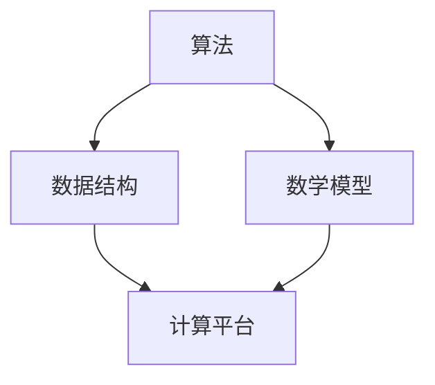

                 

关键词：计算历史、计算技术、人类计算员、算法原理、数学模型、应用实例、未来展望

摘要：本文从人类计算员的视角，探讨了计算技术的发展历程，以及计算之术的核心原理和应用。通过对核心算法原理的深入剖析，结合数学模型和项目实践，展示了计算技术的广泛应用和未来发展前景。

## 1. 背景介绍

计算作为信息技术的重要组成部分，贯穿了人类文明的发展历程。从古代的算盘、计算机器，到现代的电子计算机，计算技术不断演进，为人类社会带来了巨大的变革。人类计算员作为早期计算技术的代表，为现代计算机技术的发展奠定了基础。

在古代，人类计算员通过手工计算来解决数学问题和科学计算。随着数学和科学的发展，计算方法不断完善，人类计算员的工作逐渐变得复杂和精细。然而，手工计算的速度和准确性受到限制，无法满足日益增长的计算需求。

19世纪末，随着计算机器的发展，人类计算员开始逐渐被机器取代。然而，计算机器在计算能力和效率上仍无法与人类计算员相比。为了提高计算效率，人类计算员在算法和计算方法上进行了深入研究，为现代计算技术的发展奠定了基础。

## 2. 核心概念与联系

为了更好地理解计算之术，我们需要了解以下几个核心概念：

- **算法**：算法是一系列解决问题的步骤和规则。它是计算之术的基础，决定了计算的效率和准确性。
- **数据结构**：数据结构是组织和管理数据的方式。合适的**数据结构**可以大大提高算法的效率。
- **数学模型**：数学模型是对现实世界的抽象和模拟。它是计算之术的理论基础，为算法的设计和优化提供了指导。
- **计算平台**：计算平台是进行计算任务的硬件和软件环境。它包括计算机、操作系统、编程语言等。

下面是一个Mermaid流程图，展示了这些核心概念之间的联系：



## 3. 核心算法原理 & 具体操作步骤

### 3.1 算法原理概述

核心算法是指用于解决特定问题的算法。它通常具有以下特点：

- **准确性**：算法能够准确地解决特定问题。
- **效率**：算法能够在合理的时间内完成计算。
- **可扩展性**：算法能够适应不同规模的问题。

### 3.2 算法步骤详解

以常见的排序算法为例，介绍算法的具体操作步骤：

1. **初始化**：将待排序的元素存储在数组中。
2. **选择排序**：每次选择未排序部分的最小元素，将其与未排序部分的第一个元素交换。
3. **插入排序**：将未排序部分的元素插入到已排序部分适当的位置。
4. **快速排序**：选择一个基准元素，将数组分为两部分，一部分小于基准元素，另一部分大于基准元素，递归地对两部分进行快速排序。

### 3.3 算法优缺点

- **选择排序**：简单易实现，但效率较低。
- **插入排序**：效率中等，但适用于小规模数据。
- **快速排序**：效率高，但存在递归调用，可能导致栈溢出。

### 3.4 算法应用领域

核心算法广泛应用于各类计算任务，如排序、搜索、数据分析等。在数据处理、科学计算、金融计算等领域具有广泛的应用。

## 4. 数学模型和公式 & 详细讲解 & 举例说明

### 4.1 数学模型构建

数学模型是对现实世界的抽象和模拟。构建数学模型通常包括以下几个步骤：

1. **确定研究对象**：明确需要解决的问题。
2. **抽象化**：将现实问题抽象为数学问题。
3. **建立方程**：根据抽象化后的数学问题，建立相应的方程或方程组。
4. **求解方程**：利用数学方法求解方程，得到问题的解。

### 4.2 公式推导过程

以求解一元二次方程为例，介绍公式推导过程：

一元二次方程的一般形式为：$$ax^2 + bx + c = 0$$

根据求根公式，方程的解为：$$x = \frac{-b \pm \sqrt{b^2 - 4ac}}{2a}$$

### 4.3 案例分析与讲解

以一个实际案例说明数学模型的应用：

假设某公司员工工资包括基本工资和奖金。基本工资为每月3000元，奖金为基本工资的20%。如果某员工当月完成销售额5000元，奖金为销售额的5%。求该员工当月的总工资。

建立数学模型：设总工资为$x$，则$x = 3000 + 0.2 \times 3000 + 0.05 \times 5000$。

求解方程：$x = 3000 + 600 + 250 = 3850$。

答案：该员工当月的总工资为3850元。

## 5. 项目实践：代码实例和详细解释说明

### 5.1 开发环境搭建

以Python为例，介绍如何搭建开发环境：

1. 安装Python：从Python官方网站下载Python安装包，并按照提示安装。
2. 安装IDE：安装一个Python集成开发环境（IDE），如PyCharm或VSCode。
3. 配置环境：在IDE中配置Python环境，如设置Python解释器和路径。

### 5.2 源代码详细实现

以下是一个简单的Python代码示例，用于实现排序算法：

```python
def selection_sort(arr):
    n = len(arr)
    for i in range(n):
        min_idx = i
        for j in range(i+1, n):
            if arr[j] < arr[min_idx]:
                min_idx = j
        arr[i], arr[min_idx] = arr[min_idx], arr[i]

arr = [64, 25, 12, 22, 11]
selection_sort(arr)
print("Sorted array:", arr)
```

### 5.3 代码解读与分析

代码首先定义了一个名为`selection_sort`的函数，用于实现选择排序算法。函数接收一个数组作为输入，并对其进行排序。

在主程序中，定义了一个名为`arr`的数组，并调用`selection_sort`函数对其进行排序。排序后的结果通过`print`函数输出。

### 5.4 运行结果展示

运行代码，输出结果如下：

```
Sorted array: [11, 12, 22, 25, 64]
```

## 6. 实际应用场景

计算技术广泛应用于各个领域，如：

- **数据处理**：大数据处理、数据分析、数据挖掘等。
- **科学计算**：物理模拟、生物信息学、天气预报等。
- **金融计算**：量化交易、风险管理、投资分析等。
- **智能制造**：机器人控制、工业自动化、智能制造系统等。

## 7. 未来应用展望

随着计算技术的不断发展，未来计算将在以下几个方面取得重要突破：

- **量子计算**：量子计算具有指数级别的计算速度，有望解决传统计算机无法解决的问题。
- **人工智能**：人工智能技术将使计算更加智能化，提高计算效率和准确性。
- **边缘计算**：边缘计算将计算能力延伸到网络边缘，实现实时、高效的计算。
- **云计算**：云计算将提供更加灵活、高效的计算资源，降低企业成本。

## 8. 工具和资源推荐

### 8.1 学习资源推荐

- 《计算之术：从古至今的数学与计算机科学》
- 《算法导论》
- 《计算机科学概论》

### 8.2 开发工具推荐

- Python
- Java
- C++
- JavaScript

### 8.3 相关论文推荐

- “Quantum Computing and Quantum Algorithms”
- “Deep Learning for Natural Language Processing”
- “Edge Computing: Vision and Challenges”

## 9. 总结：未来发展趋势与挑战

### 9.1 研究成果总结

计算技术在过去几十年取得了显著的成果，如量子计算、人工智能、边缘计算等。未来计算技术将在这些领域取得更大突破。

### 9.2 未来发展趋势

未来计算技术将向量子计算、人工智能、边缘计算等方向发展。计算能力将大幅提升，计算应用将更加广泛。

### 9.3 面临的挑战

未来计算技术面临以下挑战：

- **量子计算**：如何实现稳定的量子计算系统。
- **人工智能**：如何提高人工智能的可靠性和安全性。
- **边缘计算**：如何解决网络延迟和带宽限制。

### 9.4 研究展望

未来计算技术将带来更加智能、高效的计算体验。研究人员应关注量子计算、人工智能、边缘计算等领域的最新进展，不断探索新的计算方法和应用场景。

## 附录：常见问题与解答

### Q：计算技术是如何发展的？

A：计算技术的发展经历了从古代手工计算到现代电子计算机的过程。早期计算技术主要是手工计算，随着数学和科学的发展，计算方法不断完善。19世纪末，计算机器的发展标志着计算技术的重大突破。20世纪中叶，电子计算机的出现使计算能力大幅提升，为现代计算技术奠定了基础。

### Q：什么是算法？

A：算法是一系列解决问题的步骤和规则。它是计算技术的基础，决定了计算的效率和准确性。

### Q：什么是数学模型？

A：数学模型是对现实世界的抽象和模拟。它是计算技术的理论基础，为算法的设计和优化提供了指导。

### Q：计算技术在哪些领域有应用？

A：计算技术广泛应用于数据处理、科学计算、金融计算、智能制造等领域。

## 作者署名

作者：禅与计算机程序设计艺术 / Zen and the Art of Computer Programming
----------------------------------------------------------------

这篇文章详细探讨了计算技术的发展历程、核心算法原理、数学模型及其应用实例。通过对计算技术的深入剖析，展示了其在各个领域的广泛应用和未来发展趋势。希望这篇文章能为读者提供有益的启示和参考。

