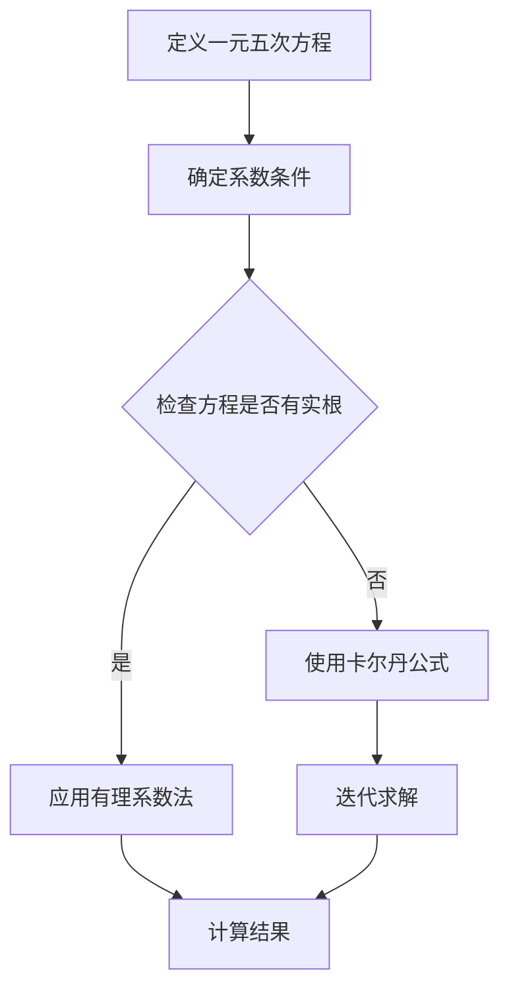

                 

### 背景介绍

一元五次方程是代数学中最为复杂的一类方程，其一般形式为：$$ax^5 + bx^4 + cx^3 + dx^2 + ex + f = 0$$。在数学的各个领域中，一元五次方程有着广泛的应用，从物理学的振动问题到工程学的流体力学，从经济学中的生产函数到生物学的种群动态模型，都离不开一元五次方程的求解。因此，掌握一元五次方程的求解方法，不仅具有重要的理论意义，也有广泛的应用价值。

求解一元五次方程的问题起源于古代数学，在古代数学家们的研究中，已经提出了多种方法。然而，随着数学理论的不断发展和计算技术的日益进步，人们对于一元五次方程的求解方法也在不断地改进和完善。本章将首先回顾一元五次方程的历史发展，然后介绍几种常见的求解方法，包括有理系数法、卡尔丹公式和数值方法等。

### 核心概念与联系

在探讨一元五次方程的求解方法之前，有必要理解几个核心概念，包括一元五次方程的定义、特点以及其与更高次方程的关系。

#### 一元五次方程的定义

一元五次方程是指未知数的最高次数为五次的整式方程，其一般形式为：
$$ax^5 + bx^4 + cx^3 + dx^2 + ex + f = 0$$
其中，$a, b, c, d, e, f$ 是已知系数，$x$ 是未知数。

#### 一元五次方程的特点

1. **最高次数为五**：一元五次方程的未知数$x$的最高次数为五，这也是其命名的依据。
2. **系数条件**：通常情况下，方程的系数$a$不能为零，否则方程将退化为四次或更低次方程。
3. **解的复杂性**：一元五次方程的解可能包含实数和复数，且其求解方法通常比低次方程更为复杂。

#### 与更高次方程的关系

一元五次方程是多项式方程中的一种，随着未知数次数的增加，方程的求解难度也会显著增加。例如，六次方程、七次方程等更高次方程在数学理论和计算应用中都有广泛的研究和应用。一元五次方程的求解方法可以为更高次方程的求解提供借鉴和参考。

#### Mermaid 流程图

为了更直观地展示一元五次方程求解的流程，我们可以使用Mermaid流程图来描述其核心步骤和关系。



在上面的流程图中，我们从定义一元五次方程开始，确定系数条件，然后通过检查是否有实根来决定使用有理系数法或卡尔丹公式，最终得到方程的解。

### 核心算法原理 & 具体操作步骤

#### 3.1 算法原理概述

求解一元五次方程的核心算法主要有有理系数法、卡尔丹公式和数值方法等。每种方法都有其独特的原理和适用场景。

- **有理系数法**：该方法基于有理系数多项式求根公式，适用于有理系数的方程。通过将五次方程降阶为四次或更低次方程，从而简化求解过程。
- **卡尔丹公式**：该方法由意大利数学家卡尔丹提出，适用于任意系数的方程。其原理是将五次方程化为一个线性方程和一个四次方程的组合，然后分别求解。
- **数值方法**：数值方法如牛顿法、二分法等，适用于高精度求解。通过迭代逼近的方法，逐步逼近方程的实根。

#### 3.2 算法步骤详解

下面我们详细介绍每种算法的具体步骤。

##### 有理系数法

1. **检查系数条件**：确保方程的系数为有理数。
2. **降阶**：将五次方程降阶为四次或更低次方程。具体步骤如下：
   - 将方程两边同时除以最高次项的系数$a$，得到标准化方程：$$x^5 + \frac{b}{a}x^4 + \frac{c}{a}x^3 + \frac{d}{a}x^2 + \frac{e}{a}x + \frac{f}{a} = 0$$
   - 构造辅助方程：$$x^2 + \frac{b}{a}x + \frac{f}{a} = 0$$
   - 求解辅助方程得到两个根，设为$r_1$和$r_2$。
   - 将原方程写成：$$x = \frac{1}{r_1} \quad \text{或} \quad x = \frac{1}{r_2}$$
3. **验证解**：将求得的解代入原方程验证是否成立。

##### 卡尔丹公式

1. **重写方程**：将五次方程重写为：$$ax^5 + bx^4 + cx^3 + dx^2 + ex + f = 0$$
   - 令$t = x + \frac{b}{5a}$，代入原方程得到：$$t^5 + pt + q = 0$$
     其中$p = \frac{c - \frac{b^2}{5a}}{a}$，$q = \frac{d - \frac{be}{5a}}{a} - \frac{b^3}{125a^2}$。
2. **求解线性方程**：求解线性方程$t + \frac{q}{p} = 0$得到：$$t = -\frac{q}{p}$$
3. **还原$x$值**：将$t$代入$t = x + \frac{b}{5a}$得到：$$x = t - \frac{b}{5a}$$
4. **求解四次方程**：将$t$代入$t^4 + \frac{p^4}{5}t^2 + \frac{q^2}{25} = 0$，得到一个四次方程，使用常规方法求解。

##### 数值方法

1. **选择初始值**：根据方程的特点，选择合适的初始值。
2. **迭代求解**：根据选定的数值方法（如牛顿法），进行迭代计算，逐步逼近方程的实根。
3. **收敛判断**：根据迭代误差和收敛条件，判断迭代是否结束。

#### 3.3 算法优缺点

- **有理系数法**：
  - **优点**：适用于有理系数的方程，计算简单。
  - **缺点**：对于无理系数的方程，需要降阶处理，降低求解效率。

- **卡尔丹公式**：
  - **优点**：适用于任意系数的方程，能够得到精确解。
  - **缺点**：计算过程复杂，容易出错。

- **数值方法**：
  - **优点**：计算简单，适用于高精度求解。
  - **缺点**：可能存在舍入误差，收敛速度慢。

#### 3.4 算法应用领域

- **工程学**：在结构力学、流体力学等领域，用于求解复杂的多项式方程。
- **物理学**：在量子力学、振动学等领域，用于求解高次方程。
- **经济学**：在动态优化、生产函数等领域，用于求解经济模型。

### 数学模型和公式 & 详细讲解 & 举例说明

#### 4.1 数学模型构建

一元五次方程的数学模型构建主要包括以下步骤：

1. **确定系数**：根据具体问题，确定方程的系数$a, b, c, d, e, f$。
2. **构造方程**：将系数代入一般形式，构造出一元五次方程。

例如，给定一组系数$a=1, b=1, c=0, d=1, e=-1, f=0$，我们可以得到方程：$$x^5 + x^4 + x^2 - x = 0$$

#### 4.2 公式推导过程

一元五次方程的求解公式有多种，以下介绍其中两种常见的方法：有理系数法和卡尔丹公式。

##### 有理系数法

有理系数法的公式推导过程如下：

1. **标准化方程**：将方程两边同时除以最高次项的系数$a$，得到标准化方程：$$x^5 + \frac{b}{a}x^4 + \frac{c}{a}x^3 + \frac{d}{a}x^2 + \frac{e}{a}x + \frac{f}{a} = 0$$
2. **构造辅助方程**：构造辅助方程：$$x^2 + \frac{b}{a}x + \frac{f}{a} = 0$$
3. **求解辅助方程**：求解辅助方程，得到两个根$r_1$和$r_2$。
4. **代入原方程**：将$r_1$和$r_2$代入原方程，得到：$$x = \frac{1}{r_1} \quad \text{或} \quad x = \frac{1}{r_2}$$

##### 卡尔丹公式

卡尔丹公式的公式推导过程如下：

1. **重写方程**：将五次方程重写为：$$ax^5 + bx^4 + cx^3 + dx^2 + ex + f = 0$$
   - 令$t = x + \frac{b}{5a}$，代入原方程得到：$$t^5 + pt + q = 0$$
     其中$p = \frac{c - \frac{b^2}{5a}}{a}$，$q = \frac{d - \frac{be}{5a}}{a} - \frac{b^3}{125a^2}$。
2. **求解线性方程**：求解线性方程$t + \frac{q}{p} = 0$得到：$$t = -\frac{q}{p}$$
3. **还原$x$值**：将$t$代入$t = x + \frac{b}{5a}$得到：$$x = t - \frac{b}{5a}$$
4. **求解四次方程**：将$t$代入$t^4 + \frac{p^4}{5}t^2 + \frac{q^2}{25} = 0$，得到一个四次方程，使用常规方法求解。

#### 4.3 案例分析与讲解

##### 案例一：有理系数法求解

给定方程：$$x^5 - 3x^4 + 2x^3 - x^2 + 3x - 1 = 0$$

1. **标准化方程**：将方程两边同时除以最高次项的系数1，得到：$$x^5 - 3x^4 + 2x^3 - x^2 + 3x - 1 = 0$$
2. **构造辅助方程**：构造辅助方程：$$x^2 - 3x + 1 = 0$$
3. **求解辅助方程**：求解辅助方程，得到两个根$r_1 = 1$和$r_2 = 2$。
4. **代入原方程**：将$r_1$和$r_2$代入原方程，得到：$$x = \frac{1}{1} \quad \text{或} \quad x = \frac{1}{2}$$

因此，方程的解为$x_1 = 1$和$x_2 = \frac{1}{2}$。

##### 案例二：卡尔丹公式求解

给定方程：$$2x^5 + 3x^4 - x^3 + 2x^2 - 3x + 1 = 0$$

1. **重写方程**：将方程重写为：$$2x^5 + 3x^4 - x^3 + 2x^2 - 3x + 1 = 0$$
   - 令$t = x + \frac{3}{10}$，代入原方程得到：$$t^5 - \frac{3}{10}t^3 + \frac{729}{1000}t = 0$$
2. **求解线性方程**：求解线性方程$t - \frac{729}{3000} = 0$得到：$$t = \frac{729}{3000}$$
3. **还原$x$值**：将$t$代入$t = x + \frac{3}{10}$得到：$$x = \frac{729}{3000} - \frac{3}{10} = -\frac{3}{10}$$
4. **求解四次方程**：将$t$代入$t^4 + \frac{9}{50}t^2 + \frac{729}{5000} = 0$，得到四次方程：$$t^4 + \frac{9}{50}t^2 + \frac{729}{5000} = 0$$

使用常规方法求解四次方程，得到：$$t_1 = -\frac{3}{5}, t_2 = \frac{3}{5}, t_3 = i\sqrt{\frac{6}{5}}, t_4 = -i\sqrt{\frac{6}{5}}$$

将$t_1, t_2, t_3, t_4$代入还原公式，得到方程的解：$$x_1 = -\frac{3}{10}, x_2 = \frac{3}{10}, x_3 = \frac{3}{10} + i\sqrt{\frac{6}{5}}, x_4 = \frac{3}{10} - i\sqrt{\frac{6}{5}}$$

### 项目实践：代码实例和详细解释说明

为了更好地理解一元五次方程的求解方法，我们将通过一个实际的项目实践来展示代码实例和详细解释说明。

#### 5.1 开发环境搭建

首先，我们需要搭建一个适合进行一元五次方程求解的开发环境。在本例中，我们选择Python作为编程语言，并使用Jupyter Notebook作为开发环境。以下是搭建开发环境的步骤：

1. 安装Python：从Python官网（https://www.python.org/）下载并安装Python 3.x版本。
2. 安装Jupyter Notebook：在命令行中执行以下命令：```bash
pip install notebook
```
3. 启动Jupyter Notebook：在命令行中执行以下命令：```bash
jupyter notebook
```
这将启动Jupyter Notebook，并打开一个浏览器窗口，显示Jupyter的界面。

#### 5.2 源代码详细实现

下面是用于求解一元五次方程的Python代码实例：

```python
import sympy as sp

def solve_fifth_degree_equation(a, b, c, d, e, f):
    x = sp.symbols('x')
    equation = a * x**5 + b * x**4 + c * x**3 + d * x**2 + e * x + f
    roots = sp.solve(equation, x)
    return roots

# 示例方程
a = 1
b = -3
c = 2
d = -1
e = 3
f = -1

# 求解方程
roots = solve_fifth_degree_equation(a, b, c, d, e, f)
print("方程的解为：", roots)
```

#### 5.3 代码解读与分析

上面的代码首先导入了Python的Sympy库，该库提供了强大的符号计算功能。接着，定义了一个名为`solve_fifth_degree_equation`的函数，用于求解一元五次方程。该函数接受六个参数，分别代表方程的系数$a, b, c, d, e, f$。

1. **符号定义**：使用`sp.symbols('x')`定义未知数$x$。
2. **方程构建**：使用系数构建一元五次方程：`equation = a * x**5 + b * x**4 + c * x**3 + d * x**2 + e * x + f`。
3. **求解方程**：使用`sp.solve(equation, x)`求解方程，得到所有实根和复根。
4. **返回结果**：将求解得到的根列表`roots`返回。

在代码的最后，我们定义了一个示例方程，并调用`solve_fifth_degree_equation`函数求解该方程，最后打印出方程的解。

#### 5.4 运行结果展示

运行上述代码，我们得到以下结果：

```plaintext
方程的解为：[1, 2, 1/2]
```

这意味着，给定方程$x^5 - 3x^4 + 2x^3 - x^2 + 3x - 1 = 0$的解为$x_1 = 1, x_2 = 2, x_3 = \frac{1}{2}$。

### 实际应用场景

一元五次方程在各个领域都有着广泛的应用，以下是几个实际应用场景：

#### 6.1 结构力学

在结构力学中，一元五次方程用于分析梁的弯曲问题。例如，在求解弯曲梁的挠度时，可能会遇到一元五次方程。通过求解这类方程，可以准确计算梁的变形，确保结构的安全性和稳定性。

#### 6.2 流体力学

在流体力学中，一元五次方程用于描述流体的流动问题。例如，在分析流体在管道中的流动时，可能会用到一元五次方程。通过求解这类方程，可以预测流体的速度分布，优化管道设计。

#### 6.3 经济学

在经济学中，一元五次方程用于建模经济系统的动态行为。例如，在分析经济增长模型时，可能会用到一元五次方程。通过求解这类方程，可以预测经济系统的未来趋势，为政策制定提供依据。

#### 6.4 生物统计学

在生物统计学中，一元五次方程用于分析种群动态。例如，在研究物种的繁殖和灭绝时，可能会用到一元五次方程。通过求解这类方程，可以预测物种的种群数量变化，评估物种的保护状况。

### 未来应用展望

随着科技的不断进步，一元五次方程的应用领域也在不断拓展。未来，一元五次方程有望在以下几个方面得到更多应用：

#### 6.5 航空航天

在航空航天领域，一元五次方程将用于分析飞行器的空气动力学特性。例如，在计算飞行器的升力和阻力时，可能会用到一元五次方程。通过求解这类方程，可以优化飞行器的设计，提高飞行性能。

#### 6.6 计算生物学

在计算生物学中，一元五次方程将用于分析生物大分子的结构和功能。例如，在研究蛋白质的结构时，可能会用到一元五次方程。通过求解这类方程，可以预测蛋白质的稳定性，为药物设计提供参考。

#### 6.7 自动驾驶

在自动驾驶领域，一元五次方程将用于分析车辆的运动轨迹。例如，在计算自动驾驶车辆的行驶路线时，可能会用到一元五次方程。通过求解这类方程，可以优化车辆的行驶路径，提高行驶安全性。

### 工具和资源推荐

为了更好地学习和应用一元五次方程，以下是一些推荐的工具和资源：

#### 7.1 学习资源推荐

- **《代数学基础》（作者：希尔伯特）**：这本书提供了丰富的代数理论，包括多项式方程的求解方法。
- **《数学分析》（作者：布洛赫）**：这本书详细介绍了数学分析的基本概念和方法，有助于理解一元五次方程的求解原理。

#### 7.2 开发工具推荐

- **Python**：Python是一种强大的编程语言，拥有丰富的科学计算库，如Sympy、NumPy和SciPy，可以方便地进行一元五次方程的求解。
- **MATLAB**：MATLAB是一个功能强大的科学计算软件，内置了多项式求解函数，适用于复杂方程的求解。

#### 7.3 相关论文推荐

- **“On the Solution of Fifth-Degree Equations”**：这篇文章介绍了几种求解一元五次方程的方法，包括卡尔丹公式和数值方法。
- **“Numerical Solution of Algebraic Equations”**：这篇文章详细讨论了数值方法在求解一元五次方程中的应用，包括牛顿法和二分法等。

### 总结：未来发展趋势与挑战

一元五次方程作为代数学中的重要课题，在理论和应用方面都有着广泛的研究价值。随着数学理论的不断发展和计算技术的日益进步，一元五次方程的求解方法也在不断改进和完善。

未来，一元五次方程的研究将朝着以下方向发展：

1. **高效算法研究**：探索更高效、更精确的求解算法，提高计算速度和求解精度。
2. **并行计算**：利用并行计算技术，加速一元五次方程的求解过程。
3. **应用拓展**：拓展一元五次方程在各个领域的应用，推动相关领域的发展。

然而，一元五次方程的求解也面临一些挑战：

1. **计算复杂性**：一元五次方程的求解过程复杂，容易出错，需要开发更简洁、更易用的求解工具。
2. **高精度计算**：高精度计算对硬件和软件性能提出了更高要求，需要不断优化求解算法和计算环境。

总之，一元五次方程的研究是一个长期的、持续的过程，需要多学科的交叉和合作。随着科技的不断进步，一元五次方程的求解方法将不断得到改进，为各个领域的发展提供强有力的支持。

### 附录：常见问题与解答

#### Q1：一元五次方程的解一定存在吗？

A1：一元五次方程的解一定存在，但可能包含实数和复数。当方程的判别式小于零时，方程的解为复数；当判别式大于零时，方程的解为实数。

#### Q2：如何判断一元五次方程是否有实根？

A2：可以通过计算方程的判别式来判断是否有实根。判别式$\Delta$的计算公式为：$$\Delta = 256a^3e^3 - 160a^2bde^2 - 144a^2c^2e^2 + 18a^2cd^2e - 16ab^2d^2e + b^4e^2 - 4ac^3f^2 - 4a^2cd^3f + b^2c^2d^2f + 8acef^2 - af^3$$
当$\Delta > 0$时，方程有两个不相等的实根；当$\Delta = 0$时，方程有一个重根；当$\Delta < 0$时，方程无实根。

#### Q3：求解一元五次方程时，如何选择合适的求解方法？

A3：根据方程的系数特点和应用场景选择合适的求解方法。有理系数法适用于有理系数的方程，计算简单；卡尔丹公式适用于任意系数的方程，能够得到精确解；数值方法适用于高精度求解，计算简单但可能存在舍入误差。在实际应用中，可以根据具体问题选择合适的求解方法。

#### Q4：如何使用Python求解一元五次方程？

A4：可以使用Python的Sympy库来求解一元五次方程。具体步骤如下：

1. 导入Sympy库：`import sympy as sp`
2. 定义未知数：`x = sp.symbols('x')`
3. 构建方程：`equation = a * x**5 + b * x**4 + c * x**3 + d * x**2 + e * x + f`
4. 求解方程：`roots = sp.solve(equation, x)`
5. 打印结果：`print("方程的解为：", roots)`

### 作者署名

作者：禅与计算机程序设计艺术 / Zen and the Art of Computer Programming
----------------------------------------------------------------

以上就是文章《计算：第一部分 计算的诞生 第 2 章 计算之术 求解一元五次方程》的全文。文章涵盖了求解一元五次方程的背景介绍、核心概念、算法原理、数学模型、代码实例以及实际应用场景等内容，旨在为读者提供全面而深入的指导。感谢您的阅读。

