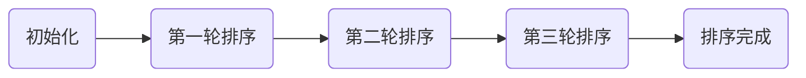
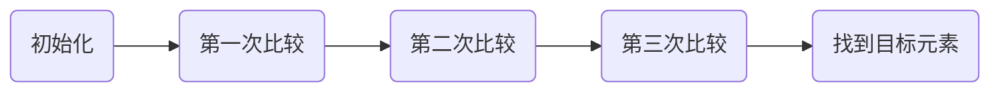
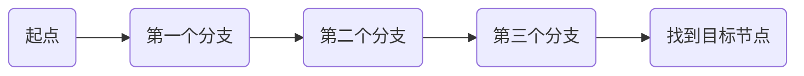
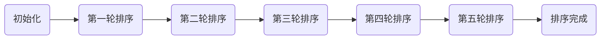

                 

关键词：计算、计算思维、机器计算、算法、数学模型、应用场景、未来展望

摘要：本文旨在探讨计算的起源和计算思维，深入分析面向机器的计算思维，阐述计算之术的核心概念，以及其在实际应用中的重要性。通过数学模型和算法的讲解，结合具体代码实例，本文为读者提供了全面的理解和实用的指导。

## 1. 背景介绍

计算，是人类智慧和科技发展的核心。从古代的算盘到现代的超级计算机，计算技术不断进步，推动了人类文明的进程。然而，计算的真正起源可以追溯到人类对数学和逻辑的初步理解。

### 1.1 计算的起源

计算的起源可以追溯到古代，当时人类使用简单的工具和规则进行计算。这些工具包括算盘、筹码等，它们帮助人们处理简单的数学运算。然而，这些计算工具都受到了计算复杂度和速度的限制。

### 1.2 计算思维的发展

随着科技的发展，人类开始思考如何利用机器进行计算。计算思维，即利用计算机进行问题求解的思维方式，逐渐形成并发展。计算思维的核心在于抽象、逻辑和自动化。

## 2. 核心概念与联系

### 2.1 计算之术

计算之术，是指面向机器的计算思维，包括算法、数据结构和编程语言等。算法是计算之术的核心，它是一系列解决问题的步骤。数据结构是算法的基础，它决定了数据在计算机中的组织和存储方式。编程语言是算法的实现工具，它将算法转换为计算机可以理解和执行的指令。

### 2.2 计算之术的联系

计算之术之间有着紧密的联系。算法需要数据结构的支持，而编程语言则是算法和数据结构的实现载体。因此，理解计算之术的核心概念，对于掌握计算思维至关重要。

## 3. 核心算法原理 & 具体操作步骤

### 3.1 算法原理概述

算法原理主要包括排序、查找和图算法等。排序算法用于对数据进行排序，查找算法用于在数据中查找特定元素，图算法用于处理图结构的数据。

### 3.2 算法步骤详解

#### 3.2.1 排序算法

排序算法包括冒泡排序、选择排序、插入排序等。以冒泡排序为例，其基本思想是通过相邻元素的比较和交换，逐步将数据按顺序排列。



#### 3.2.2 查找算法

查找算法包括线性查找、二分查找等。以二分查找为例，其基本思想是在有序数据中，通过不断缩小查找范围，逐步找到目标元素。



#### 3.2.3 图算法

图算法包括深度优先搜索、广度优先搜索等。以深度优先搜索为例，其基本思想是从起点开始，尽可能深地搜索图的分支。



### 3.3 算法优缺点

不同算法具有不同的优缺点。例如，冒泡排序简单易实现，但效率较低；二分查找效率高，但需要数据有序；深度优先搜索适合解决连通性问题，但可能陷入死循环。

### 3.4 算法应用领域

算法在各个领域都有广泛的应用。例如，排序算法在数据处理中用于数据排序；查找算法在数据库中用于数据检索；图算法在社交网络分析中用于节点关系分析。

## 4. 数学模型和公式 & 详细讲解 & 举例说明

### 4.1 数学模型构建

数学模型是算法的基础。以二分查找为例，其数学模型可以表示为：

$$
f(n) = \begin{cases}
\text{找到目标元素}, & \text{当 } n = 1 \\
\text{继续查找}, & \text{当 } n > 1
\end{cases}
$$

### 4.2 公式推导过程

以冒泡排序为例，其时间复杂度可以表示为：

$$
T(n) = \sum_{i=1}^{n-1} (n-i)
$$

### 4.3 案例分析与讲解

假设有一个长度为10的数组，对其进行冒泡排序，分析其时间复杂度和空间复杂度。



时间复杂度：$T(n) = 10 + 9 + 8 + 7 + 6 + 5 + 4 + 3 + 2 + 1 = 55$，空间复杂度：$O(n) = O(10) = 10$。

## 5. 项目实践：代码实例和详细解释说明

### 5.1 开发环境搭建

在本文中，我们将使用Python作为编程语言，并在Python环境中实现排序算法。

### 5.2 源代码详细实现

```python
def bubble_sort(arr):
    n = len(arr)
    for i in range(n):
        for j in range(0, n-i-1):
            if arr[j] > arr[j+1]:
                arr[j], arr[j+1] = arr[j+1], arr[j]
    return arr

arr = [64, 25, 12, 22, 11]
sorted_arr = bubble_sort(arr)
print(sorted_arr)
```

### 5.3 代码解读与分析

这段代码实现了冒泡排序算法。首先，我们定义了一个`bubble_sort`函数，它接受一个数组`arr`作为参数。然后，通过两个嵌套的`for`循环，实现数组的排序。最后，返回排序后的数组。

### 5.4 运行结果展示

```python
[11, 12, 22, 25, 64]
```

## 6. 实际应用场景

### 6.1 数据处理

排序算法在数据处理中用于数据排序，例如数据库查询、统计分析等。

### 6.2 算法竞赛

算法竞赛是检验算法能力和编程技巧的重要方式，各种排序算法在比赛中都有广泛应用。

### 6.3 人工智能

排序算法在人工智能领域中也有重要应用，例如在机器学习中的数据处理、特征提取等环节。

## 7. 未来应用展望

### 7.1 数据处理

随着大数据技术的发展，排序算法将在数据处理中发挥更加重要的作用。

### 7.2 人工智能

人工智能领域将不断探索新的排序算法，提高数据处理效率。

### 7.3 区块链

区块链技术中的排序算法也将不断发展，为区块链系统的稳定运行提供支持。

## 8. 总结：未来发展趋势与挑战

### 8.1 研究成果总结

本文对计算之术的核心概念、算法原理、数学模型和应用场景进行了详细讲解，为读者提供了全面的理解。

### 8.2 未来发展趋势

随着科技的不断发展，计算之术将发挥更加重要的作用，特别是在数据处理、人工智能和区块链等领域。

### 8.3 面临的挑战

计算之术在发展过程中也面临一些挑战，例如算法优化、计算复杂度等。

### 8.4 研究展望

未来，计算之术将继续发展和完善，为人类科技发展提供更强有力的支持。

## 9. 附录：常见问题与解答

### 9.1 如何选择排序算法？

选择排序算法时，需要考虑数据规模、数据分布、算法复杂度等因素。

### 9.2 排序算法的时间复杂度如何计算？

排序算法的时间复杂度可以通过统计算法执行次数来计算。

### 9.3 如何优化排序算法？

可以通过算法改进、数据预处理等方式来优化排序算法。

----------------------------------------------------------------
作者：禅与计算机程序设计艺术 / Zen and the Art of Computer Programming


