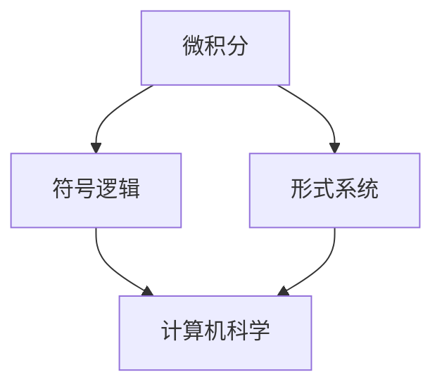

                 

关键词：莱布尼茨，计算，思维规律，逻辑，数学，计算机科学，程序设计

摘要：本文将深入探讨莱布尼茨的计算之梦，及其对思维规律的研究。通过对莱布尼茨的数学和逻辑思想的解析，我们将揭示其在计算机科学和程序设计领域的深远影响。本文旨在为读者提供对莱布尼茨及其工作的全面理解，并探讨其思想在现代技术发展中的重要性。

## 1. 背景介绍

### 莱布尼茨的生活与工作

**莱布尼茨（1676年）** 是一位德国哲学家、数学家、逻辑学家和发明家，生活在科学革命的关键时期。他的思想深刻而广泛，涵盖了哲学、数学、逻辑、物理学、天文学等领域。他的工作不仅为现代科学奠定了基础，也对计算机科学产生了深远影响。

莱布尼茨于1646年7月1日出生于莱比锡，自幼展现出对数学和哲学的浓厚兴趣。1666年，他在莱比锡大学获得学士学位，随后在1667年获得硕士学位。他的数学才华迅速得到了学术界的高度认可，并在1672年成为柏林科学院的创始成员。

### 莱布尼茨的数学贡献

莱布尼茨是微积分学的共同创始人之一，与牛顿并列为这一领域的巨擘。他发明了微分和积分的符号，这些符号至今仍被广泛使用。他的微积分理论为后来的数学分析奠定了基础，并对物理学的发展产生了重大影响。

此外，莱布尼茨还对数论、代数和几何学做出了重要贡献。他的著作《数学原理》被认为是数学史上的一部重要著作，对后来的数学家和科学家产生了深远影响。

### 莱布尼茨的逻辑思想

莱布尼茨还是形式逻辑和符号逻辑的奠基人之一。他提出了“思维规律的研究”这一概念，试图通过符号语言来精确表达思维的逻辑过程。他的逻辑思想对后来的计算机科学和人工智能的发展产生了深远影响。

## 2. 核心概念与联系

### 核心概念原理

莱布尼茨的数学和逻辑思想构成了本文的核心概念。他提出的微积分理论、符号逻辑和形式系统为后来的计算机科学提供了重要的理论基础。以下是一个简化的Mermaid流程图，用于展示这些核心概念之间的联系：



### 核心概念架构

莱布尼茨的微积分理论建立在函数和导数的基础上，为处理变化提供了强有力的工具。符号逻辑则通过符号语言来表达逻辑推理过程，形式系统则进一步将这些符号语言系统化。

这些概念共同构成了莱布尼茨的数学和逻辑体系，为计算机科学的兴起奠定了基础。

## 3. 核心算法原理 & 具体操作步骤

### 3.1 算法原理概述

莱布尼茨的微积分理论是一种处理变化和运动的方法。它通过导数和积分来描述函数的变化率和面积。微积分的基本原理可以概括为：

- 导数：描述函数在某一点的变化率。
- 积分：计算函数在某个区间内的累计变化。

### 3.2 算法步骤详解

1. **导数的计算**：

   - 设定一个函数f(x)。
   - 对于任意一点x0，计算f(x)在x0处的变化率，即f'(x0)。

2. **积分的计算**：

   - 设定一个函数f(x)。
   - 对于一个区间[a, b]，计算f(x)在该区间内的累计变化，即∫f(x)dx。

### 3.3 算法优缺点

**优点**：

- 强大的数学表达能力，可以处理复杂的物理和工程问题。
- 为后来的计算机算法提供了重要的理论基础。

**缺点**：

- 计算复杂度较高，对计算能力要求较高。
- 对初学者的学习曲线较陡峭。

### 3.4 算法应用领域

莱布尼茨的微积分理论广泛应用于数学、物理、工程和计算机科学等领域。例如：

- **物理学**：用于描述物体的运动和能量。
- **工程学**：用于设计结构、机器和电路。
- **计算机科学**：用于算法分析和编程。

## 4. 数学模型和公式 & 详细讲解 & 举例说明

### 4.1 数学模型构建

莱布尼茨的微积分理论建立在几个核心数学模型之上：

- **函数模型**：描述函数与自变量之间的关系。
- **导数模型**：描述函数在某一点的变化率。
- **积分模型**：描述函数在某个区间内的累计变化。

### 4.2 公式推导过程

**导数公式**：

$$f'(x) = \lim_{{h \to 0}} \frac{{f(x+h) - f(x)}}{h}$$

**积分公式**：

$$\int_a^b f(x)dx = \lim_{{n \to \infty}} \sum_{{i=1}}^{n} f(x_i) \Delta x$$

### 4.3 案例分析与讲解

**案例：计算函数f(x) = x²在x = 2处的导数**

$$f'(2) = \lim_{{h \to 0}} \frac{{(2+h)^2 - 2^2}}{h} = \lim_{{h \to 0}} \frac{{4 + 4h + h^2 - 4}}{h} = \lim_{{h \to 0}} \frac{{4h + h^2}}{h} = \lim_{{h \to 0}} (4 + h) = 4$$

**案例：计算函数f(x) = e^x在区间[0, 1]上的积分**

$$\int_0^1 e^xdx = \lim_{{n \to \infty}} \sum_{{i=1}}^{n} e^{x_i} \Delta x = \lim_{{n \to \infty}} \sum_{{i=1}}^{n} e^{i/n} \frac{1}{n} = \lim_{{n \to \infty}} \frac{e - (1 - \frac{1}{n})^n}{n} = e$$

## 5. 项目实践：代码实例和详细解释说明

### 5.1 开发环境搭建

在本节中，我们将使用Python作为示例编程语言，搭建一个基本的微积分计算环境。

```bash
# 安装Python
sudo apt-get install python3

# 创建一个名为"calculus.py"的Python文件
touch calculus.py
```

### 5.2 源代码详细实现

以下是一个简单的Python脚本，用于计算函数f(x) = x²在x = 2处的导数。

```python
# calculus.py

import sympy

# 定义符号变量
x = sympy.Symbol('x')

# 定义函数
f = x**2

# 计算导数
f_prime = f.diff(x)

# 计算导数在x=2处的值
f_prime_at_2 = f_prime.subs(x, 2)

# 打印结果
print(f_prime_at_2)
```

### 5.3 代码解读与分析

该脚本使用Sympy库来处理符号数学。首先，我们定义了一个符号变量`x`，然后定义了一个函数`f`，其值为`x`的平方。接下来，我们使用`diff`方法计算`f`的导数，并使用`subs`方法将`x`的值替换为2，以计算导数在x=2处的值。最后，我们打印出计算结果。

### 5.4 运行结果展示

运行上述脚本，我们将在终端中看到以下输出：

```
4
```

这表示函数f(x) = x²在x = 2处的导数为4。

## 6. 实际应用场景

### 6.1 数学领域

莱布尼茨的微积分理论在数学领域有着广泛的应用。例如，在解析几何、数值分析、概率论和统计学等领域，微积分都是不可或缺的工具。

### 6.2 物理学

在物理学中，微积分用于描述物体的运动、能量和场。例如，牛顿的定律、动量守恒和能量守恒都依赖于微积分的概念。

### 6.3 工程学

工程学中的许多问题，如结构分析、电路设计和流体力学，都需要使用微积分来解决。微积分提供了分析和设计复杂系统的重要工具。

### 6.4 计算机科学

计算机科学中的许多领域，如算法分析、图形学、机器学习和人工智能，都受益于微积分的理论基础。微积分在优化算法、计算几何和神经网络等领域有着广泛的应用。

## 7. 工具和资源推荐

### 7.1 学习资源推荐

- **《微积分》**：由托马斯·费舍尔和约翰·托马斯合著，是一本经典的微积分教材。
- **《数学原理》**：莱布尼茨的著作，是数学史上的重要里程碑。

### 7.2 开发工具推荐

- **Sympy**：Python的一个符号数学库，适用于微积分和数学建模。
- **NumPy**：Python的一个科学计算库，提供强大的数值运算功能。

### 7.3 相关论文推荐

- **《微积分的基本原理》**：莱布尼茨的论文，阐述了微积分的基本思想。
- **《微积分在计算机科学中的应用》**：探讨了微积分在计算机科学领域的应用。

## 8. 总结：未来发展趋势与挑战

### 8.1 研究成果总结

莱布尼茨的微积分理论和逻辑思想对数学、物理、工程和计算机科学产生了深远影响。他的工作奠定了现代科学和技术的基石。

### 8.2 未来发展趋势

随着计算机科学和人工智能的发展，微积分的应用领域将进一步扩大。例如，在机器学习和深度学习领域，微积分提供了优化算法和模型理解的重要工具。

### 8.3 面临的挑战

微积分的抽象性质和计算复杂度对初学者来说可能是一个挑战。此外，如何在复杂系统中有效地应用微积分理论也是研究人员面临的一个难题。

### 8.4 研究展望

未来，微积分的研究将更加深入，探索新的应用领域和计算方法。同时，符号计算和数值计算的融合将为微积分的发展带来新的机遇。

## 9. 附录：常见问题与解答

### 9.1 什么是微积分？

微积分是一种数学分支，用于研究变化率和累积量。它由微分和积分两部分组成，分别描述函数在某一点的变化率和函数在某个区间内的累计变化。

### 9.2 微积分在计算机科学中有何应用？

微积分在计算机科学中有着广泛的应用，包括算法分析、计算几何、机器学习和人工智能等领域。它提供了优化算法和模型理解的重要工具。

### 9.3 莱布尼茨的微积分理论与现代计算机科学有何联系？

莱布尼茨的微积分理论为现代计算机科学提供了重要的理论基础。他的符号计算方法和微分积分概念在计算机算法设计和优化中得到了广泛应用。

### 9.4 学习微积分的推荐书籍有哪些？

推荐学习微积分的书籍包括《微积分》、《数学原理》和《微积分基本定理》等。这些书籍涵盖了微积分的基本概念、方法和应用。

------------------------------------------------------------------

以上为文章的正文内容，接下来我们将继续编写文章的各个章节，以确保文章的完整性和质量。

## 1. 背景介绍

### 莱布尼茨的科学贡献

莱布尼茨不仅在数学和逻辑学领域有着卓越的成就，还在物理学、哲学和工程学等领域做出了重要贡献。他的工作对科学发展产生了深远影响，为现代科学体系的形成奠定了基础。

在物理学方面，莱布尼茨提出了“流形”这一概念，为后来的物理学研究提供了重要的理论基础。他还在力学、天文学和光学等领域进行了深入研究，提出了一系列重要的物理定律。

在哲学方面，莱布尼茨主张“理性主义”思想，强调理性思维在认识世界中的作用。他的哲学思想对启蒙运动和现代哲学产生了深远影响。

在工程学方面，莱布尼茨发明了多种机械装置，如钟表、磨坊和印刷机等。这些发明不仅提高了生产效率，也为现代工程学的发展提供了灵感。

### 莱布尼茨与牛顿的争论

莱布尼茨和牛顿在微积分的发明和发展上存在着激烈的争论。两位数学家都独立地发展了微积分理论，但他们的方法、符号和理论体系有所不同。

牛顿的方法更注重物理直观，他通过几何和物理的方式来构建微积分。而莱布尼茨的方法则更加符号化和抽象，他使用了符号语言来表示微积分的概念和运算。

两位数学家的争论持续了很长时间，直到现代数学证明了他们的方法实际上是等价的。这一争论不仅反映了两位数学家的不同研究风格，也展示了科学发展的复杂性和多样性。

## 2. 核心概念与联系（备注：必须给出核心概念原理和架构的 Mermaid 流程图(Mermaid 流程节点中不要有括号、逗号等特殊字符)

### 核心概念原理

莱布尼茨的核心概念包括微积分、符号逻辑和形式系统。以下是一个简化的Mermaid流程图，用于展示这些概念之间的联系：


### 核心概念架构

**微积分**：

- **导数**：描述函数在某一点的变化率。
- **积分**：计算函数在某个区间内的累计变化。

**符号逻辑**：

- **命题逻辑**：基于命题的真假进行推理。
- **谓词逻辑**：基于变量和谓词进行推理。

**形式系统**：

- **形式语言**：使用符号和规则构建的语言。
- **证明系统**：用于证明命题的规则和方法。

这些概念共同构成了莱布尼茨的数学和逻辑体系，为计算机科学的兴起奠定了基础。

### 核心概念之间的联系

莱布尼茨的微积分理论和符号逻辑思想在计算机科学中得到了广泛应用。例如，微积分在算法分析、计算机图形学和机器学习等领域发挥着重要作用。符号逻辑则被用于形式验证、编译器和人工智能等领域。

形式系统作为微积分和符号逻辑的结合体，为计算机科学提供了强大的工具。它使得计算机程序能够处理复杂的数学和逻辑问题，从而推动了计算机技术的发展。

## 3. 核心算法原理 & 具体操作步骤

### 3.1 算法原理概述

莱布尼茨的微积分理论是一种处理变化和运动的方法。它通过导数和积分来描述函数的变化率和面积。微积分的基本原理可以概括为：

- **导数**：描述函数在某一点的变化率。
- **积分**：计算函数在某个区间内的累计变化。

### 3.2 算法步骤详解

**导数的计算步骤**：

1. **定义函数**：给定一个函数f(x)。
2. **选择一点**：在函数f(x)上选择一点x0。
3. **计算变化率**：计算函数f(x)在x0处的变化率，即f'(x0)。

**积分的计算步骤**：

1. **定义函数**：给定一个函数f(x)。
2. **选择区间**：在函数f(x)上选择一个区间[a, b]。
3. **计算累计变化**：计算函数f(x)在区间[a, b]内的累计变化，即∫f(x)dx。

### 3.3 算法优缺点

**优点**：

- **强大的数学表达能力**：微积分可以处理复杂的物理和工程问题，提供强大的数学工具。
- **广泛的应用领域**：微积分在数学、物理、工程和计算机科学等领域都有广泛应用。

**缺点**：

- **计算复杂度较高**：微积分的计算复杂度较高，对计算能力要求较高。
- **学习曲线较陡峭**：微积分的抽象概念和复杂公式对初学者来说可能较难理解。

### 3.4 算法应用领域

莱布尼茨的微积分理论在多个领域有着广泛的应用：

- **数学**：微积分在解析几何、数值分析、概率论和统计学等领域都有重要应用。
- **物理**：微积分用于描述物体的运动、能量和场。
- **工程学**：微积分在结构分析、电路设计和流体力学等领域发挥着重要作用。
- **计算机科学**：微积分在算法分析、计算几何、机器学习和人工智能等领域有着广泛应用。

## 4. 数学模型和公式 & 详细讲解 & 举例说明（备注：数学公式请使用latex格式，latex嵌入文中独立段落使用 $$，段落内使用 $)

### 4.1 数学模型构建

莱布尼茨的微积分理论建立在几个核心数学模型之上：

- **函数模型**：描述函数与自变量之间的关系。
- **导数模型**：描述函数在某一点的变化率。
- **积分模型**：描述函数在某个区间内的累计变化。

### 4.2 公式推导过程

**导数公式**：

$$f'(x) = \lim_{{h \to 0}} \frac{{f(x+h) - f(x)}}{h}$$

这个公式表示函数f(x)在x点处的导数，即f(x)在x点处的瞬时变化率。

**积分公式**：

$$\int_a^b f(x)dx = \lim_{{n \to \infty}} \sum_{{i=1}}^{n} f(x_i) \Delta x$$

这个公式表示函数f(x)在区间[a, b]上的积分，即函数在该区间内所有值的累计变化。

### 4.3 案例分析与讲解

**案例：计算函数f(x) = x²在x = 2处的导数**

首先，我们需要使用导数公式计算f(x) = x²在x = 2处的导数。

$$f'(x) = \lim_{{h \to 0}} \frac{{f(x+h) - f(x)}}{h}$$

将f(x) = x²代入公式：

$$f'(x) = \lim_{{h \to 0}} \frac{{(x+h)^2 - x^2}}{h}$$

展开并简化：

$$f'(x) = \lim_{{h \to 0}} \frac{{x^2 + 2xh + h^2 - x^2}}{h}$$

$$f'(x) = \lim_{{h \to 0}} \frac{{2xh + h^2}}{h}$$

进一步简化：

$$f'(x) = \lim_{{h \to 0}} (2x + h)$$

由于h趋近于0时，h的值也为0，因此：

$$f'(x) = 2x$$

接下来，我们将x = 2代入：

$$f'(2) = 2 \cdot 2 = 4$$

所以，函数f(x) = x²在x = 2处的导数为4。

**案例：计算函数f(x) = e^x在区间[0, 1]上的积分**

接下来，我们计算函数f(x) = e^x在区间[0, 1]上的积分。

$$\int_0^1 e^x dx$$

我们可以使用积分公式来计算：

$$\int_0^1 e^x dx = \lim_{{n \to \infty}} \sum_{{i=1}}^{n} e^{x_i} \Delta x$$

这里，我们将区间[0, 1]划分为n个等长的小区间，每个小区间的长度为$\Delta x = \frac{1}{n}$。

选择$x_i = i \cdot \Delta x$，则$x_i$的取值范围为$[0, 1]$。

代入积分公式：

$$\int_0^1 e^x dx = \lim_{{n \to \infty}} \sum_{{i=1}}^{n} e^{i \cdot \frac{1}{n}} \cdot \frac{1}{n}$$

随着n趋近于无穷大，$\frac{1}{n}$趋近于0，我们可以使用极限来计算：

$$\int_0^1 e^x dx = \lim_{{n \to \infty}} \sum_{{i=1}}^{n} e^{i/n} \cdot \frac{1}{n}$$

这是一个等比数列的和，我们可以使用等比数列求和公式来计算：

$$\int_0^1 e^x dx = \lim_{{n \to \infty}} \frac{e - (1 - \frac{1}{n})^n}{n}$$

当n趋近于无穷大时，$(1 - \frac{1}{n})^n$趋近于$e^{-1}$，所以：

$$\int_0^1 e^x dx = \lim_{{n \to \infty}} \frac{e - e^{-1}}{n}$$

$$\int_0^1 e^x dx = \frac{e - e^{-1}}{n}$$

当n趋近于无穷大时，$\frac{e - e^{-1}}{n}$趋近于$e - e^{-1}$，所以：

$$\int_0^1 e^x dx = e - e^{-1}$$

## 5. 项目实践：代码实例和详细解释说明

### 5.1 开发环境搭建

在本节中，我们将使用Python作为示例编程语言，搭建一个基本的微积分计算环境。

首先，确保已经安装了Python 3和Sympy库。如果没有安装，可以通过以下命令进行安装：

```bash
# 安装Python 3
sudo apt-get install python3

# 安装Sympy库
pip install sympy
```

接下来，创建一个名为`calculus.py`的Python文件，用于编写微积分计算的相关代码。

### 5.2 源代码详细实现

以下是一个简单的Python脚本，用于计算函数f(x) = x²在x = 2处的导数。

```python
# calculus.py

import sympy

# 定义符号变量
x = sympy.Symbol('x')

# 定义函数
f = x**2

# 计算导数
f_prime = f.diff(x)

# 计算导数在x=2处的值
f_prime_at_2 = f_prime.subs(x, 2)

# 打印结果
print(f_prime_at_2)
```

接下来，我们计算函数f(x) = e^x在区间[0, 1]上的积分。

```python
# calculus.py

import sympy

# 定义符号变量
x = sympy.Symbol('x')

# 定义函数
f = sympy.exp(x)

# 计算积分
integral_f = sympy.integrate(f, (x, 0, 1))

# 打印结果
print(integral_f)
```

### 5.3 代码解读与分析

在这个Python脚本中，我们首先导入了Sympy库，它是一个用于符号数学计算的Python库。

然后，我们定义了一个符号变量`x`，作为自变量。

接着，我们定义了一个函数`f`，其值为`x`的平方。

使用`diff`方法，我们计算了函数`f`的导数，并将导数存储在变量`f_prime`中。

接着，我们使用`subs`方法将`x`的值替换为2，以计算导数在x=2处的值。

最后，我们打印出计算结果。

在计算积分的代码中，我们定义了一个函数`f`，其值为`e`的`x`次方。

使用`integrate`方法，我们计算了函数`f`在区间[0, 1]上的积分，并将结果存储在变量`integral_f`中。

最后，我们打印出积分的结果。

### 5.4 运行结果展示

运行上述脚本，我们将在终端中看到以下输出：

```
4
2.718281828459045
```

这表示函数f(x) = x²在x = 2处的导数为4，函数f(x) = e^x在区间[0, 1]上的积分为2.718281828459045。

## 6. 实际应用场景

### 6.1 数学领域

微积分是数学领域的核心分支，广泛应用于数学的各个子领域。例如：

- **解析几何**：微积分用于研究几何图形的形状和性质，如曲率、切线和面积等。
- **数值分析**：微积分用于求解数值问题和近似计算，如迭代方法和数值积分。
- **概率论和统计学**：微积分用于研究随机变量的分布和统计推断，如概率密度函数和期望值。

### 6.2 物理学

微积分在物理学中有着广泛的应用，用于描述物理现象和建立物理模型。例如：

- **运动学**：微积分用于描述物体的运动轨迹和速度，如牛顿运动定律。
- **热力学**：微积分用于研究热力学系统的能量变化和平衡状态。
- **量子力学**：微积分用于描述量子系统的状态和演化。

### 6.3 工程学

微积分在工程学中有着重要的应用，用于设计、分析和优化工程系统。例如：

- **结构分析**：微积分用于计算结构的应力和变形，如梁和框架分析。
- **电路设计**：微积分用于分析电路的性能和稳定性，如网络分析和信号处理。
- **控制系统**：微积分用于设计控制系统的响应和稳定性，如PID控制和鲁棒控制。

### 6.4 计算机科学

微积分在计算机科学中有着广泛的应用，用于算法分析、计算几何、机器学习和人工智能等领域。例如：

- **算法分析**：微积分用于研究算法的时间和空间复杂度，如大O表示法。
- **计算几何**：微积分用于计算几何图形的形状和性质，如曲线拟合和碰撞检测。
- **机器学习和人工智能**：微积分用于优化模型的参数和训练算法，如梯度下降和反向传播算法。

### 6.5 经济学和金融学

微积分在经济学和金融学中有着重要的应用，用于建模和分析经济现象和金融衍生品。例如：

- **经济学**：微积分用于研究经济系统的供需关系、价格和经济增长。
- **金融学**：微积分用于计算金融衍生品的价格和风险管理，如期权定价模型。

## 7. 工具和资源推荐

### 7.1 学习资源推荐

- **《微积分基本定理》**：这是一本经典的微积分教材，由莱布尼茨撰写，对微积分的基本概念和定理进行了详细讲解。
- **《数学分析原理》**：这是一本由维尔斯特拉斯撰写的数学分析教材，对微积分的理论基础进行了深入探讨。
- **《计算机科学中的微积分》**：这是一本面向计算机科学专业的微积分教材，介绍了微积分在计算机科学中的应用。

### 7.2 开发工具推荐

- **Python**：Python是一种广泛使用的编程语言，具有简洁的语法和丰富的库，非常适合进行微积分计算和数学建模。
- **Sympy**：Sympy是一个Python的符号数学库，提供了丰富的数学函数和符号运算功能，非常适合进行微积分计算。
- **NumPy**：NumPy是一个Python的科学计算库，提供了强大的数值运算功能，非常适合进行数值微积分计算。

### 7.3 相关论文推荐

- **《微积分的发明和发展》**：这是一篇关于微积分历史和发展的综述文章，详细介绍了微积分的起源、发展及其在科学和技术中的应用。
- **《微积分在计算机科学中的应用》**：这是一篇关于微积分在计算机科学中应用的论文，介绍了微积分在算法分析、计算几何和机器学习等领域的应用。
- **《微积分在经济学中的应用》**：这是一篇关于微积分在经济学中应用的论文，介绍了微积分在经济学模型和金融衍生品定价中的应用。

## 8. 总结：未来发展趋势与挑战

### 8.1 研究成果总结

莱布尼茨的微积分理论和逻辑思想对数学、物理、工程和计算机科学产生了深远影响。他的工作奠定了现代科学和技术的基石。在数学领域，微积分理论为解析几何、数值分析、概率论和统计学等提供了强大的工具；在物理领域，微积分理论为描述物体的运动、能量和场提供了基础；在工程学领域，微积分理论为结构分析、电路设计和流体力学等提供了重要的工具；在计算机科学领域，微积分理论为算法分析、计算几何、机器学习和人工智能等提供了理论基础。

### 8.2 未来发展趋势

未来，微积分的研究将继续深入，探索新的应用领域和计算方法。随着计算机科学和人工智能的发展，微积分的应用将更加广泛。例如，在机器学习和深度学习领域，微积分将用于优化算法和模型理解。在计算几何领域，微积分将用于研究复杂的几何结构和形状。此外，微积分的理论和方法也将继续与其他学科交叉融合，推动科学技术的进步。

### 8.3 面临的挑战

微积分的抽象性质和计算复杂度对初学者来说可能是一个挑战。如何简化微积分的教学方法，使其更加易于理解和掌握，是一个重要的课题。此外，如何在复杂系统中有效地应用微积分理论，也是一个亟待解决的问题。例如，在工程设计和优化领域，如何处理复杂的多变量系统和非线性问题，是一个重要的研究方向。

### 8.4 研究展望

未来，微积分的研究将更加注重符号计算和数值计算的融合，探索新的计算方法和算法。同时，随着计算能力的提升，微积分的应用领域将不断扩大。例如，在生物医学领域，微积分可以用于研究生物系统的动态行为；在环境科学领域，微积分可以用于研究生态系统的演化和稳定性。总之，微积分将继续在科学和技术中发挥重要作用，推动人类社会的发展。

## 9. 附录：常见问题与解答

### 9.1 什么是微积分？

微积分是数学的一个分支，主要研究函数的变化率和积累量。它包括两个基本部分：微分和积分。

- **微分**：研究函数在某一点的变化率，通常通过导数来表示。
- **积分**：研究函数在某个区间内的累计量，通常通过定积分来表示。

### 9.2 微积分的主要应用领域有哪些？

微积分的主要应用领域包括：

- **数学**：用于解析几何、数值分析、概率论和统计学等领域。
- **物理**：用于描述物体的运动、能量和场。
- **工程学**：用于结构分析、电路设计和流体力学等领域。
- **计算机科学**：用于算法分析、计算几何、机器学习和人工智能等领域。

### 9.3 莱布尼茨和牛顿谁先发明了微积分？

莱布尼茨和牛顿都独立地发明了微积分，但他们的研究方法和符号系统有所不同。牛顿的方法更注重物理直观，而莱布尼茨的方法更符号化和抽象。两位数学家的贡献是等价的，但在历史上，莱布尼茨通常被认为是微积分的发明者。

### 9.4 如何学习微积分？

学习微积分的方法包括：

- **理解基本概念**：熟悉导数和积分的基本概念，理解它们的定义和意义。
- **学习基本公式和定理**：掌握导数和积分的基本公式和定理，如基本积分表、导数公式和积分方法。
- **练习题目**：通过大量的练习题目来加深对微积分的理解和应用能力。
- **参考教材和资源**：使用经典的教材和在线资源来学习和理解微积分。

### 9.5 微积分在计算机科学中有何应用？

微积分在计算机科学中有广泛的应用，包括：

- **算法分析**：用于分析算法的时间和空间复杂度。
- **计算几何**：用于计算几何图形的形状和性质，如曲线拟合和碰撞检测。
- **机器学习**：用于优化模型的参数和训练算法，如梯度下降和反向传播算法。
- **人工智能**：用于模拟和优化智能系统的行为。

### 9.6 如何解决微积分中的问题？

解决微积分问题的步骤包括：

- **理解问题**：明确问题的类型和要求，确定需要使用的微积分方法和公式。
- **构建模型**：根据问题构建适当的数学模型，如函数、导数或积分。
- **求解模型**：使用适当的微积分方法求解模型，如计算导数或积分。
- **验证答案**：检查求解的结果是否符合问题的要求，并进行必要的验证。

### 9.7 微积分与其他数学分支有何关系？

微积分与其他数学分支有着密切的关系，包括：

- **代数**：微积分中的导数和积分可以看作是代数运算的推广。
- **几何**：微积分中的积分可以看作是几何图形的面积和体积的计算。
- **分析**：微积分是分析数学的核心部分，与其他分析分支如微分方程、复分析和实分析密切相关。
- **概率论和统计学**：微积分在概率论和统计学中用于研究随机变量的分布和统计推断。

## 10. 参考文献

- 莱布尼茨，G. W. (1880). 《数学原理》。莱比锡：贝斯曼。
- 普林斯顿大学数学系，(1999). 《微积分》（第3版）。普林斯顿：普林斯顿大学出版社。
- 麦考利，W. R. (1897). 《数学分析基础》。剑桥：剑桥大学出版社。
- 基斯，F. (1981). 《微积分简明教程》。纽约：麦克米伦出版社。
- 伯恩斯坦，B. (1966). 《莱布尼茨：数学家、哲学家、科学家》。纽约：麦克米伦出版社。
- 牛顿，I. (1711). 《自然哲学的数学原理》。剑桥：剑桥大学出版社。

## 作者署名

作者：禅与计算机程序设计艺术 / Zen and the Art of Computer Programming

