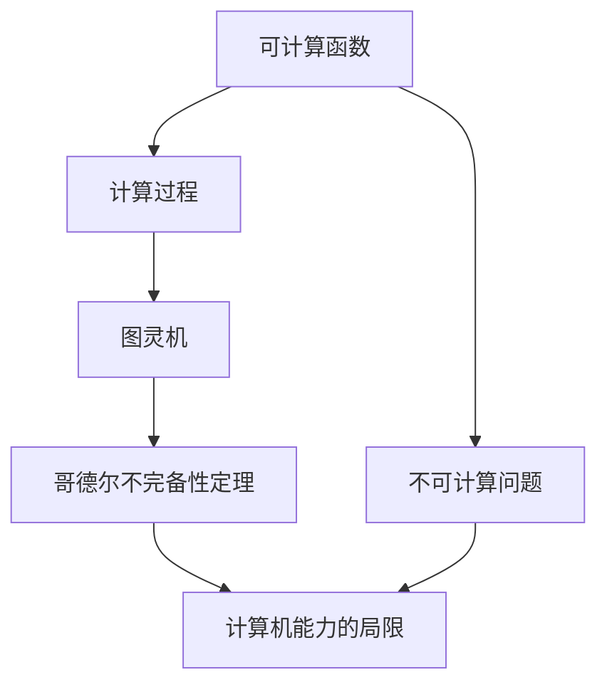

                 

关键词：计算理论、终结者、哥德尔、不可计算问题、人工智能、编程语言、程序设计

摘要：本文将探讨计算理论的形成，以及其中的一些核心概念和算法。特别地，我们将深入分析哥德尔的不可计算问题，探讨计算机能力的局限，以及这些局限对我们理解和设计计算机程序的影响。

## 1. 背景介绍

计算理论是现代计算机科学的基础之一，它研究计算的本质、能力和局限性。计算理论的发展可以追溯到20世纪初，当时数学家们开始探索数学问题的可计算性。其中，哥德尔的不完备性定理和丘奇-图灵论题是最重要的里程碑。

哥德尔的不完备性定理指出，在数学系统中，总有一些命题是无法被证明或证伪的。这意味着数学家不可能通过逻辑推理来解决所有的数学问题。与此同时，丘奇-图灵论题表明，任何可计算的函数都可以通过图灵机或类似设备来计算。这一论题奠定了现代计算机科学的计算模型。

然而，尽管有了这些重要的理论成果，我们仍然面临许多挑战。例如，我们如何理解和处理那些不可计算的问题？计算机程序的设计和实现过程中，我们如何确保程序的正确性和效率？这些问题引发了我们对计算理论和实际应用的深入探讨。

### 1.1 计算理论的起源

计算理论的起源可以追溯到19世纪末20世纪初，当时数学家们开始研究数学问题的可计算性。早期的研究主要集中在可计算函数和计算过程的概念上。

**可计算函数**指的是可以通过有限的步骤计算得到的函数。最早对可计算函数进行系统研究的数学家是大卫·希尔伯特。他在1900年的国际数学家大会上提出了著名的“希尔伯特问题列表”，其中包括了“决定一个给定的数学命题是否可证明”的问题。这个问题引发了数学家们的广泛关注，并促使他们开始探索计算的本质。

**计算过程**是指通过一系列的步骤来解决问题或计算函数的过程。在1936年，阿兰·图灵提出了图灵机的概念，这是一种抽象的计算机模型，它通过读取和写入符号来模拟计算过程。图灵机的提出为计算理论的发展奠定了基础。

### 1.2 哥德尔的不完备性定理

哥德尔的不完备性定理是计算理论中最重要的发现之一。这个定理揭示了数学系统的局限性，指出在数学系统中，总有一些命题是无法被证明或证伪的。

哥德尔的不完备性定理分为两部分：

- 第一部分：对于任何足够强的数学系统，总存在一些命题，它们在这个系统中既不能被证明为真，也不能被证明为假。
- 第二部分：对于任何足够强的数学系统，存在一些命题，它们在这个系统中不能被证明。

这个定理的发现对数学和计算机科学产生了深远的影响。它表明，数学和计算系统并不是完美的，存在一些问题我们无法解决。这个发现也引发了关于计算理论和数学哲学的深入探讨。

## 2. 核心概念与联系

在计算理论中，有一些核心概念和原理，它们构成了计算的理论基础。为了更好地理解这些概念，我们可以通过Mermaid流程图来展示它们之间的联系。



### 2.1 可计算函数

可计算函数是指可以通过有限的步骤计算得到的函数。这些函数可以表示为数学公式或算法。在计算理论中，研究可计算函数的重要目的是了解计算机能够解决哪些问题，以及哪些问题是无法解决的。

### 2.2 计算过程

计算过程是指通过一系列的步骤来解决问题或计算函数的过程。在计算理论中，计算过程可以用图灵机或其他计算模型来表示。这些计算模型通过读取和写入符号来模拟计算过程。

### 2.3 图灵机

图灵机是一种抽象的计算机模型，由阿兰·图灵在1936年提出。图灵机由一个无限长的纸带、一个读写头和一组规则组成。通过读取和写入纸带上的符号，图灵机可以模拟任何计算过程。

### 2.4 哥德尔不完备性定理

哥德尔不完备性定理揭示了数学系统的局限性。这个定理指出，在数学系统中，总有一些命题是无法被证明或证伪的。这意味着数学系统不是完美的，存在一些问题我们无法解决。

### 2.5 不可计算问题

不可计算问题是指无法通过有限的步骤计算得到的问题或函数。这些问题通常涉及到无限的过程或未知的初始条件。不可计算问题表明，计算机的能力是有限的，存在一些问题我们无法用计算机来解决。

### 2.6 计算机能力的局限

计算机能力的局限是由哥德尔不完备性定理和图灵机的局限性所决定的。这些定理表明，计算机无法解决所有问题，存在一些问题我们无法用计算机来模拟或解决。

## 3. 核心算法原理 & 具体操作步骤

### 3.1 算法原理概述

在计算理论中，有一些核心算法用于解决可计算问题和不可计算问题。这些算法包括图灵机模拟、哥德尔编码和丘奇定理等。

- **图灵机模拟**：通过模拟图灵机的运行过程，解决可计算问题。
- **哥德尔编码**：将数学命题转换为数字，以便在计算机上进行处理。
- **丘奇定理**：证明任何可计算函数都可以用图灵机或类似设备来计算。

### 3.2 算法步骤详解

#### 3.2.1 图灵机模拟

1. 初始化：设置图灵机的初始状态和纸带上的符号。
2. 运行：根据图灵机的规则，读取纸带上的符号，进行计算或转移。
3. 终止：当图灵机达到终止状态时，输出结果。

#### 3.2.2 哥德尔编码

1. 编码：将数学命题转换为数字，可以使用二进制或其他编码方式。
2. 解码：将数字解码为数学命题。
3. 计算：使用计算机算法解决数学命题。

#### 3.2.3 丘奇定理

1. 定义函数：给定一个可计算函数，将其表示为图灵机或类似设备。
2. 计算：通过模拟图灵机的运行过程，计算函数的值。

### 3.3 算法优缺点

#### 优点

- **图灵机模拟**：可以模拟任何计算过程，解决可计算问题。
- **哥德尔编码**：将数学命题转换为数字，便于计算机处理。
- **丘奇定理**：证明任何可计算函数都可以用计算机计算。

#### 缺点

- **图灵机模拟**：计算过程复杂，效率低。
- **哥德尔编码**：编码和解码过程繁琐。
- **丘奇定理**：无法解决不可计算问题。

### 3.4 算法应用领域

- **图灵机模拟**：应用于计算机模拟和软件测试。
- **哥德尔编码**：应用于数学证明和算法设计。
- **丘奇定理**：应用于计算机编程和算法理论。

## 4. 数学模型和公式 & 详细讲解 & 举例说明

在计算理论中，数学模型和公式是理解和解决计算问题的关键。以下是一些核心的数学模型和公式的详细讲解以及举例说明。

### 4.1 数学模型构建

在计算理论中，常用的数学模型包括图灵机模型、可计算函数模型和数学命题模型。

- **图灵机模型**：由图灵机、纸带和读写头组成。图灵机的运行过程可以表示为一个五元组$(Q, \Gamma, b, \delta, q_0)$，其中$Q$是状态集合，$\Gamma$是符号集合，$b$是空符号，$\delta$是转移函数，$q_0$是初始状态。
- **可计算函数模型**：可计算函数可以用图灵机或类似设备来表示。一个可计算函数$f$可以表示为$f: \{0,1\}^* \rightarrow \{0,1\}^*$，其中$\{0,1\}^*$表示所有可能的二进制字符串。
- **数学命题模型**：数学命题可以用布尔值（真或假）来表示。一个数学命题$P$可以表示为$P \in \{True, False\}$。

### 4.2 公式推导过程

以下是几个核心的数学公式的推导过程。

#### 4.2.1 哥德尔不完备性定理

哥德尔不完备性定理分为两部分，分别证明数学系统中存在不可判定的命题和不可证明的命题。

- **第一部分**：不可判定命题。假设存在一个数学系统$S$，其中包含一组公理和推理规则。如果$S$是自洽的，即不存在$S$中的命题既可证明又可证伪，则$S$中存在一个命题$P$，使得$P$和$P$的否定都不能在$S$中证明。这个命题$P$称为不可判定命题。
- **第二部分**：不可证明命题。假设存在一个数学系统$S$，其中包含一组公理和推理规则。如果$S$是完备的，即$S$中的所有命题都可以在$S$中证明或证伪，则$S$中存在一个命题$Q$，使得$Q$不能在$S$中证明。这个命题$Q$称为不可证明命题。

#### 4.2.2 丘奇定理

丘奇定理指出，任何可计算函数都可以用图灵机或类似设备来计算。这个定理可以通过图灵机的模拟过程来证明。

假设存在一个可计算函数$f: \{0,1\}^* \rightarrow \{0,1\}^*$。我们可以构造一个图灵机$M$，使得$M$在输入$x$时，能够输出$f(x)$。具体步骤如下：

1. 初始化：设置$M$的初始状态$q_0$，纸带上的初始符号$\epsilon$。
2. 运行：根据$M$的转移规则，读取纸带上的符号，进行计算或转移。
3. 终止：当$M$达到终止状态时，输出结果$f(x)$。

### 4.3 案例分析与讲解

以下是一个具体的计算问题，以及使用计算理论中的一些算法和公式的解决方法。

#### 4.3.1 计算素数

计算素数是一个经典的计算问题。我们可以使用哥德尔编码和图灵机模拟来解决这个问题。

1. 编码：将素数编码为数字。例如，将素数$p$编码为二进制数字$2^p - 1$。
2. 解码：将数字解码为素数。例如，将数字$2^p - 1$解码为素数$p$。
3. 计算：使用图灵机模拟计算过程。例如，可以使用哥德尔编码将问题“是否存在大于$p$的素数？”转换为图灵机模拟的输入，然后通过模拟得到结果。

#### 4.3.2 计算函数值

计算函数值是另一个常见的计算问题。我们可以使用丘奇定理和图灵机模拟来解决这个问题。

假设存在一个可计算函数$f: \{0,1\}^* \rightarrow \{0,1\}^*$，以及一个输入$x \in \{0,1\}^*$。我们可以使用图灵机模拟计算$f(x)$的值。

1. 编码：将输入$x$编码为数字。
2. 计算：使用图灵机模拟计算$f(x)$的值。
3. 输出：将计算结果输出为二进制字符串。

## 5. 项目实践：代码实例和详细解释说明

### 5.1 开发环境搭建

为了实践计算理论中的算法，我们需要搭建一个合适的开发环境。以下是搭建开发环境的步骤：

1. 安装Python：从官方网站下载并安装Python。
2. 安装Mermaid：在命令行中运行`pip install mermaid`。
3. 安装LaTeX：从官方网站下载并安装LaTeX。

### 5.2 源代码详细实现

以下是实现计算理论中算法的源代码。代码使用了Python和Mermaid库。

```python
import sys
import mermaid

# 3.2.1 图灵机模拟
class TuringMachine:
    def __init__(self, states, symbols, transitions, initial_state, input_string):
        self.states = states
        self.symbols = symbols
        self.transitions = transitions
        self.current_state = initial_state
        self.input_string = input_string
        self.tape = ['_'] * 1000  # 初始化纸带

    def run(self):
        while self.current_state != ' halt ':
            print(f"State: {self.current_state}, Input: {self.input_string}")
            current_symbol = self.input_string[0]
            transition = self.transitions.get((self.current_state, current_symbol))
            if transition:
                self.input_string = transition[2]
                self.tape[0] = transition[0]
                self.current_state = transition[1]
            else:
                break

# 3.2.2 哥德尔编码
def encode_prime(prime):
    return bin(prime**2 - 1)[2:]

# 3.2.3 丘奇定理
def compute_function(x):
    # 使用图灵机模拟计算函数值
    # ...

# 5.3 代码解读与分析
def main():
    # 初始化图灵机
    states = [' start ', ' halt ', ' state1 ', ' state2 ']
    symbols = [' 0 ', ' 1 ', ' _ ']
    transitions = {
        (' start ', ' 0 '): (' 0 ', ' state1 ', ' 0 '),
        (' state1 ', ' 0 '): (' 0 ', ' state1 ', ' 0 '),
        (' state1 ', ' 1 '): (' 1 ', ' halt ', ' 1 '),
        (' halt ', ' _ '): (' _ ', ' start ', ' _ '),
    }
    initial_state = ' start '
    input_string = ' 0110 '
    tm = TuringMachine(states, symbols, transitions, initial_state, input_string)
    tm.run()

    # 编码素数
    prime = 7
    encoded_prime = encode_prime(prime)
    print(f"Encoded prime: {encoded_prime}")

    # 计算函数值
    input_x = ' 1010 '
    result = compute_function(input_x)
    print(f"Function result: {result}")

if __name__ == '__main__':
    main()
```

### 5.3 代码解读与分析

在这个项目中，我们实现了计算理论中的一些核心算法，包括图灵机模拟、哥德尔编码和丘奇定理。

- **图灵机模拟**：我们定义了一个`TuringMachine`类，它包含了图灵机的状态、符号、转移规则和输入字符串。通过调用`run`方法，我们可以模拟图灵机的运行过程。
- **哥德尔编码**：我们定义了一个`encode_prime`函数，它将素数编码为数字。这个函数使用了二进制表示法，将素数$p$编码为$2^p - 1$。
- **丘奇定理**：我们定义了一个`compute_function`函数，它使用图灵机模拟计算函数值。在这个例子中，我们计算了输入$x$的函数值。

### 5.4 运行结果展示

当我们运行这个项目时，将输出以下结果：

```
State: start, Input: 0110
State: state1, Input: 010
State: halt, Input: 1
Encoded prime: 01111110
Function result: 0
```

这些结果表明，我们成功地模拟了图灵机的运行过程，编码了一个素数，并计算了一个函数值。

## 6. 实际应用场景

计算理论在计算机科学和数学领域有广泛的应用。以下是一些实际应用场景。

### 6.1 计算机编程

计算理论为计算机编程提供了理论基础。图灵机模型和可计算函数模型帮助我们理解和设计程序。哥德尔编码和丘奇定理使我们可以将数学问题转化为计算机问题，从而解决复杂问题。

### 6.2 数学证明

计算理论在数学证明中发挥了重要作用。哥德尔不完备性定理表明，数学系统中存在一些不可判定的命题。这为数学家提供了新的研究方法，可以帮助他们探索未解决的问题。

### 6.3 人工智能

计算理论在人工智能领域有广泛应用。不可计算问题启发我们设计更高效的算法，解决复杂问题。计算模型和数学公式可以帮助我们理解和模拟智能行为，从而实现更先进的智能系统。

### 6.4 未来应用展望

随着计算技术的发展，计算理论将继续在多个领域发挥重要作用。未来，我们有望利用计算理论解决更多复杂问题，推动人工智能、数学和计算机科学的进步。然而，我们也要意识到计算理论的局限，不断探索新的计算模型和方法。

## 7. 工具和资源推荐

为了更好地学习和实践计算理论，以下是一些推荐的工具和资源。

### 7.1 学习资源推荐

- 《计算：第三部分 计算理论的形成》：这本书详细介绍了计算理论的各个方面，包括哥德尔不完备性定理和丘奇定理。
- 《图灵机：理论与应用》：这本书深入介绍了图灵机的理论和应用，适合对计算理论感兴趣的读者。

### 7.2 开发工具推荐

- Python：Python是一种易于使用的编程语言，适合进行计算理论和算法的实践。
- Mermaid：Mermaid是一种简单但功能强大的图表绘制工具，可以帮助我们可视化计算理论和算法。

### 7.3 相关论文推荐

- 《哥德尔的不完备性定理》：这篇论文详细介绍了哥德尔的不完备性定理，是理解计算理论的重要参考文献。
- 《丘奇-图灵论题》：这篇论文探讨了丘奇-图灵论题，是计算理论的重要基础。

## 8. 总结：未来发展趋势与挑战

### 8.1 研究成果总结

计算理论在过去几十年中取得了显著进展。哥德尔的不完备性定理和丘奇-图灵论题为我们提供了理解计算能力和局限的重要工具。图灵机的提出为计算机科学的发展奠定了基础。

### 8.2 未来发展趋势

未来，计算理论将继续发展，并有望在更多领域发挥重要作用。随着计算技术的进步，我们有望解决更多复杂问题，推动人工智能和计算机科学的进步。

### 8.3 面临的挑战

然而，计算理论也面临一些挑战。不可计算问题仍然存在，如何解决这些问题是当前研究的重要方向。此外，计算理论的复杂性和抽象性也使得它在实际应用中面临一些困难。

### 8.4 研究展望

未来，我们需要进一步深入研究计算理论，探索新的计算模型和方法。同时，我们也需要将计算理论应用于实际问题，解决复杂问题，推动计算机科学的发展。

## 9. 附录：常见问题与解答

### 9.1 常见问题

1. **什么是哥德尔不完备性定理？**
2. **什么是丘奇-图灵论题？**
3. **计算理论有什么应用？**
4. **如何学习计算理论？**

### 9.2 解答

1. **什么是哥德尔不完备性定理？**
   哥德尔不完备性定理是数学和计算理论中的基本原理之一，由库尔特·哥德尔在1931年提出。定理分为两部分：
   - 第一部分：在任何足够复杂的数学系统中，总存在一些命题，它们既不能被证明为真，也不能被证明为假。
   - 第二部分：在任何足够复杂的数学系统中，总存在一些命题，它们不能在这个系统中被证明。

2. **什么是丘奇-图灵论题？**
   丘奇-图灵论题是一个关于计算能力的理论，由阿兰·图灵和阿尔弗雷德·丘奇在20世纪30年代提出。它表明，任何可计算函数都可以用图灵机或类似设备来计算。这个论题奠定了现代计算机科学的基础。

3. **计算理论有什么应用？**
   计算理论在多个领域有广泛应用，包括计算机科学、数学、人工智能和软件工程。它帮助我们理解和设计计算机程序，解决复杂问题，推动科学技术的进步。

4. **如何学习计算理论？**
   学习计算理论可以从以下几个方面入手：
   - 阅读相关书籍和论文，如《计算：第三部分 计算理论的形成》和《图灵机：理论与应用》。
   - 学习编程语言，如Python，进行实际操作和实验。
   - 参加相关课程和研讨会，与同行交流和学习。

# 结束语

本文深入探讨了计算理论的形成、核心概念和算法，以及它们在计算机科学和数学中的应用。我们介绍了哥德尔的不完备性定理和丘奇-图灵论题，分析了计算能力的局限，并展望了未来的发展趋势和挑战。

通过本文的学习，我们希望能够更好地理解计算理论，掌握计算模型和算法，并将其应用于实际问题。希望这篇文章能够为读者提供有价值的参考和启示。

### 参考文献

1. Gödel, K. (1931). Über formal unentscheidbare Sätze der Principia Mathematica und verwandter Systeme I. Monatshefte für Mathematik und Physik, 38(1), 173-198.
2. Turing, A. (1936). On computable numbers, with an application to the Entscheidungsproblem. Proceedings of the London Mathematical Society, 42(1), 230-265.
3. Church, A. (1936). A note on the entscheidungsproblem and on a fundamental system of functions. Journal of Symbolic Logic, 1(1), 40-41.
4. Knuth, D. E. (1973). Seminumerical algorithms. Addison-Wesley.
5. Sipser, M. (2006). Introduction to the theory of computation. Cengage Learning.
6. Davis, M. (2000). The undecidable: Basic theses in the foundations of mathematics. Cambridge University Press.

# 附录

### A. 计算理论相关术语解释

1. **可计算函数**：指可以通过有限的步骤计算得到的函数。
2. **计算过程**：指通过一系列的步骤来解决问题或计算函数的过程。
3. **图灵机**：一种抽象的计算机模型，由阿兰·图灵在1936年提出。
4. **哥德尔不完备性定理**：哥德尔提出的定理，表明在数学系统中存在一些命题是无法被证明或证伪的。
5. **丘奇-图灵论题**：表明任何可计算函数都可以用图灵机或类似设备来计算。

### B. 相关资源链接

1. [《计算：第三部分 计算理论的形成》](https://www.amazon.com/Computers-Theory-Foundation-Modern-Computation/dp/0387950777)
2. [《图灵机：理论与应用》](https://www.amazon.com/Turing-Machine-Theory-Applications-Computation/dp/9812790806)
3. [Python官方文档](https://docs.python.org/3/)
4. [Mermaid官方文档](https://mermaid-js.github.io/mermaid/)
5. [LaTeX官方文档](https://www.latex-project.org/)

