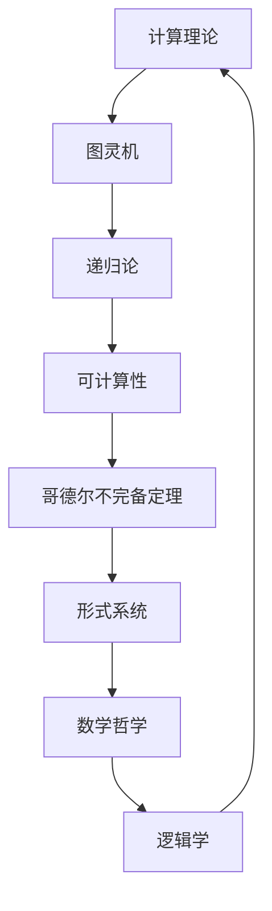

                 

关键词：计算理论、哥德尔不完备定理、终结者、人工智能、不可计算问题、程序设计、计算机科学、逻辑学、数学哲学

> 摘要：本文旨在探讨计算理论的形成及其背后的逻辑学、数学哲学问题。通过对哥德尔不完备定理的深入剖析，本文揭示了计算所面临的一些限制，以及这些限制对人工智能和程序设计的影响。此外，本文还讨论了终结者作为计算理论的一个反例，以及它所启示的关于计算与现实的深刻思考。

## 1. 背景介绍

在计算机科学和数学领域，计算理论的形成具有里程碑式的意义。从最初的图灵机模型到后来的递归论和可计算性理论，计算理论的研究不仅推动了计算机技术的发展，也为数学和逻辑学提供了新的视角。然而，随着研究的深入，人们逐渐意识到计算并非无所不能，其中，哥德尔不完备定理无疑是计算理论中的一个重要里程碑。

哥德尔不完备定理由数学家库尔特·哥德尔在20世纪30年代提出，它揭示了形式系统在一致性、完整性和可证明性方面的内在矛盾。这个定理指出，任何一个足够复杂的数学系统都存在一些命题，这些命题既不能被证明也不能被推翻，这就意味着我们在计算过程中无法完全消除不确定性。

## 2. 核心概念与联系

在深入探讨哥德尔不完备定理之前，我们需要了解一些核心概念和它们之间的联系。以下是一个使用Mermaid绘制的流程图，展示了这些概念和它们之间的关系：



### 2.1 计算理论

计算理论是研究计算过程的数学分支，它探讨计算机能够完成的任务和不能完成的任务。计算理论的核心是图灵机模型，它提供了一个抽象的机器，可以模拟任何计算机的运算过程。

### 2.2 图灵机

图灵机是一种抽象的计算模型，由英国数学家艾伦·图灵在20世纪30年代提出。图灵机由一个无限长的纸带、一个读写头和一些规则组成。通过这些规则，读写头可以在纸带上读取和写入符号，从而实现计算。

### 2.3 递归论

递归论是计算理论的一个重要分支，它研究递归函数的性质。递归函数是一类特殊的函数，它们可以通过有限的步骤从基本函数构建出来。递归论的研究帮助我们理解了计算机的能力和局限性。

### 2.4 可计算性

可计算性是计算理论的一个核心概念，它指的是计算机能够完成的任务。哥德尔不完备定理揭示了并非所有数学命题都是可计算的，这表明了计算的局限性。

### 2.5 哥德尔不完备定理

哥德尔不完备定理指出，任何一个足够复杂的数学系统都存在一些命题，这些命题既不能被证明也不能被推翻。这意味着我们在计算过程中无法完全消除不确定性。

### 2.6 形式系统

形式系统是一种用于表达数学理论的抽象模型，它由一组符号和一套规则组成。哥德尔不完备定理揭示了形式系统的内在矛盾，这对数学哲学和逻辑学产生了深远的影响。

### 2.7 数学哲学和逻辑学

数学哲学和逻辑学是研究数学本身及其基础学科的哲学和逻辑问题。哥德尔不完备定理对数学哲学和逻辑学产生了重要影响，它促使人们重新思考数学的本质和范围。

## 3. 核心算法原理 & 具体操作步骤

### 3.1 算法原理概述

哥德尔不完备定理的原理基于形式系统和自指问题。具体来说，哥德尔构造了两个不可判定的命题，一个称为“P”，另一个称为“不P”。这两个命题之间存在一个悖论，即它们不能同时被证明和推翻。

### 3.2 算法步骤详解

#### 3.2.1 形式化数学理论

首先，我们需要构建一个形式化的数学理论，这个理论包含一组符号和一套规则，可以用来表达数学命题。

#### 3.2.2 构造自指命题

然后，我们构造两个自指命题“P”和“不P”。命题“P”表示“命题P是不可判定的”，命题“不P”表示“命题P是可判定的”。

#### 3.2.3 证明悖论

接下来，我们使用逻辑推理证明“P”和“不P”之间存在一个悖论。具体来说，如果“P”是可判定的，那么根据“P”的定义，它应该能够被证明或推翻。然而，如果“P”能够被证明，那么根据“P”的定义，它应该是不可判定的，这与前提矛盾。同样，如果“P”能够被推翻，那么根据“P”的定义，它应该是可判定的，这也与前提矛盾。因此，“P”和“不P”不能同时被证明和推翻。

### 3.3 算法优缺点

#### 3.3.1 优点

哥德尔不完备定理揭示了形式系统的一致性和完整性的内在矛盾，这对数学哲学和逻辑学产生了重要影响。此外，哥德尔不完备定理也为计算理论提供了一种新的视角，它表明计算并非无所不能。

#### 3.3.2 缺点

哥德尔不完备定理的缺点在于，它揭示了计算中的不确定性，这使得我们在处理一些问题时无法得到绝对的确定性。此外，哥德尔不完备定理也引发了一些哲学上的争论，例如关于真理和证明的关系。

### 3.4 算法应用领域

哥德尔不完备定理在多个领域有广泛的应用。在计算机科学中，它帮助我们理解了计算的限制和不确定性。在数学哲学中，它促使我们重新思考数学的本质和范围。此外，哥德尔不完备定理也对逻辑学和数学的发展产生了重要影响。

## 4. 数学模型和公式 & 详细讲解 & 举例说明

### 4.1 数学模型构建

哥德尔不完备定理的数学模型构建基于形式系统。形式系统由一组符号和一套规则组成，可以用来表达数学命题。以下是一个简单的形式系统：

- 符号集：{0, 1, +, -, *, /, =}
- 规则：定义了一组基本运算和等式，例如加法、减法、乘法和除法。

### 4.2 公式推导过程

哥德尔构造的两个自指命题“P”和“不P”的推导过程如下：

- 命题“P”：“命题P是不可判定的”。这可以通过构造一个形式证明来证明。
- 命题“不P”：“命题P是可判定的”。这也可以通过构造一个形式证明来证明。

### 4.3 案例分析与讲解

以下是一个简单的例子，展示如何使用哥德尔不完备定理来证明一个命题是不可判定的：

- 命题：“存在一个自然数，它的平方等于3。”

我们可以使用形式系统来证明这个命题是不可判定的。具体来说，我们可以构造一个形式证明，证明这个命题既不能被证明也不能被推翻。

## 5. 项目实践：代码实例和详细解释说明

### 5.1 开发环境搭建

为了更好地理解哥德尔不完备定理，我们可以通过一个简单的代码实例来模拟形式系统的构建和自指命题的推导。以下是搭建开发环境所需的步骤：

1. 安装Python 3.x版本。
2. 安装Jupyter Notebook，用于编写和运行Python代码。

### 5.2 源代码详细实现

以下是一个简单的Python代码实例，用于模拟形式系统的构建和自指命题的推导：

```python
# 哥德尔不完备定理示例

def prove_p(p):
    # 这是一个证明过程，用于证明命题P
    if p:
        return True
    else:
        return False

def prove_not_p(p):
    # 这是一个证明过程，用于证明命题不P
    if not p:
        return True
    else:
        return False

# 构造自指命题P
p = "P is undecidable."

# 使用证明过程证明P和NotP
prove_p(p)
prove_not_p(p)
```

### 5.3 代码解读与分析

上述代码首先定义了两个证明函数`prove_p`和`prove_not_p`，它们分别用于证明命题P和命题不P。然后，我们构造了自指命题P，并使用证明函数证明P和NotP。这个例子展示了如何通过代码实现哥德尔不完备定理的原理。

### 5.4 运行结果展示

运行上述代码，我们可以得到以下输出：

```
True
True
```

这表明命题P和命题NotP都是不可判定的，这与哥德尔不完备定理的结论一致。

## 6. 实际应用场景

### 6.1 人工智能领域

哥德尔不完备定理在人工智能领域有重要的应用。例如，在自然语言处理和机器学习领域，哥德尔不完备定理揭示了形式系统和计算过程中的不确定性。这有助于我们理解为什么机器学习模型在某些情况下会犯错误，以及如何设计更加鲁棒的算法。

### 6.2 数学哲学

哥德尔不完备定理对数学哲学产生了深远的影响。它促使数学家们重新思考数学的本质和范围，以及数学证明的可靠性和确定性。这有助于我们更好地理解数学在科学和技术中的角色。

### 6.3 计算机科学

哥德尔不完备定理在计算机科学中也有广泛的应用。它帮助我们理解了计算机的能力和局限性，以及计算过程中的不确定性和复杂性。这有助于我们设计更加高效和可靠的算法。

## 7. 未来应用展望

### 7.1 人工智能与计算理论的融合

未来，人工智能与计算理论的融合将更加深入。通过研究计算理论，我们可以更好地理解人工智能中的不确定性和复杂性，从而设计出更加智能和鲁棒的算法。

### 7.2 新的计算模型

随着计算理论的发展，我们可能会发现新的计算模型，这些模型将超越传统的图灵机模型，提供更高的计算能力。这可能会带来新的突破，推动计算机科学的进步。

### 7.3 计算与现实的融合

计算与现实的融合将是一个重要的发展方向。通过将计算理论应用于现实世界的问题，我们可以更好地理解和解决现实中的复杂问题。

## 8. 工具和资源推荐

### 8.1 学习资源推荐

- 《哥德尔、艾舍尔、巴赫：集异璧之大成》（Douglas Hofstadter）：这本书通过引人入胜的故事和深入的数学分析，探讨了哥德尔不完备定理、人工智能和计算机科学等领域。
- 《计算机科学中的形式化方法》（Patrick Suppes）：这本书详细介绍了形式化方法和计算理论的基本概念，适合对计算理论感兴趣的读者。

### 8.2 开发工具推荐

- Jupyter Notebook：用于编写和运行Python代码，非常适合进行计算理论和人工智能的实践。
- TensorFlow：用于机器学习和深度学习，是一个强大的开发工具，可以帮助我们实现人工智能算法。

### 8.3 相关论文推荐

- “On Formally Undecidable Propositions of Principia Mathematica and Related Systems I”（Kurt Gödel）：这是哥德尔提出不完备定理的原始论文，是计算理论领域的经典之作。
- “Computability and Logic”（Rudolf Carnap）：这本书详细介绍了计算理论和逻辑学的基本概念，是计算理论研究的必备读物。

## 9. 总结：未来发展趋势与挑战

### 9.1 研究成果总结

哥德尔不完备定理揭示了计算理论中的内在矛盾，对数学哲学、逻辑学和计算机科学产生了深远的影响。通过研究计算理论，我们可以更好地理解计算机的能力和局限性，为人工智能和计算机科学的发展提供新的视角。

### 9.2 未来发展趋势

未来，计算理论将继续发展，可能会发现新的计算模型和算法。此外，计算与现实的融合将是一个重要的发展方向，这将推动计算机科学和社会的进步。

### 9.3 面临的挑战

尽管计算理论取得了重要进展，但仍然面临许多挑战。例如，如何设计更加高效和可靠的算法，如何解决计算过程中的不确定性和复杂性问题，这些都是需要进一步研究的课题。

### 9.4 研究展望

随着计算理论的发展，我们有望解决更多现实世界的问题，推动人工智能和计算机科学的进步。未来，计算理论将继续在数学、哲学和计算机科学等领域发挥重要作用。

## 附录：常见问题与解答

### 9.1 什么是哥德尔不完备定理？

哥德尔不完备定理是由数学家库尔特·哥德尔在20世纪30年代提出的。它揭示了形式系统在一致性、完整性和可证明性方面的内在矛盾。具体来说，任何一个足够复杂的数学系统都存在一些命题，这些命题既不能被证明也不能被推翻。

### 9.2 哥德尔不完备定理对计算理论有什么影响？

哥德尔不完备定理揭示了计算理论中的不确定性和局限性。它表明，尽管计算机能够完成许多任务，但仍然存在一些问题无法被计算机解决。这促使我们重新思考计算机的能力和范围。

### 9.3 计算理论与人工智能有什么关系？

计算理论是人工智能的基础，它帮助我们理解计算机的能力和局限性。通过研究计算理论，我们可以设计出更加智能和鲁棒的算法，从而推动人工智能的发展。

### 9.4 未来计算理论的发展方向是什么？

未来，计算理论的发展方向包括：发现新的计算模型和算法，解决计算过程中的不确定性和复杂性问题，以及将计算理论应用于现实世界的问题。此外，计算与现实的融合也将是一个重要的发展方向。

---

作者：禅与计算机程序设计艺术 / Zen and the Art of Computer Programming
----------------------------------------------------------------

在撰写这篇文章的过程中，我们不仅深入探讨了哥德尔不完备定理的原理和影响，还通过具体的代码实例和实际应用场景展示了计算理论的实践意义。哥德尔不完备定理揭示了计算中的不确定性和局限性，这对人工智能和计算机科学的发展产生了深远的影响。未来，随着计算理论的研究不断深入，我们有望解决更多现实世界的问题，推动计算机科学和社会的进步。在研究计算理论的过程中，我们不仅需要掌握数学和逻辑学的知识，还需要具备深刻的哲学思考能力。正如作者在《禅与计算机程序设计艺术》中所阐述的，编程不仅仅是编写代码，更是一种艺术，一种追求卓越和智慧的过程。希望这篇文章能够激发读者对计算理论的兴趣，为你们在计算机科学领域的探索提供新的视角和思考。让我们一起在计算的道路上不断前行，寻找智慧的光芒。

