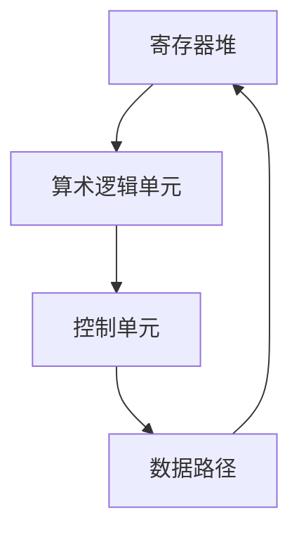

                 

## 1. 背景介绍

数学和计算之间的关系自古以来就紧密相连。数学作为一种描述自然和人类社会的通用语言，为计算提供了理论基础和工具。而计算，无论是古代的算盘还是现代的超级计算机，都离不开数学的支持。然而，传统数学的表述往往过于抽象，不易于计算机理解和应用。因此，将数学进行逻辑化处理，使其更加适合计算机处理，成为了计算机科学的一个重要课题。

算术的逻辑化，是将传统的算术运算转化为逻辑运算的过程。这一过程不仅简化了数学表达的复杂性，也为计算机提供了高效的处理方法。例如，通过逻辑化处理，加法运算可以被分解为一系列逻辑运算，从而可以利用计算机的高速逻辑处理能力进行高效计算。

本文将深入探讨算术的逻辑化，包括其核心概念、原理、数学模型、具体算法步骤，以及在实际计算中的应用。此外，本文还将结合具体代码实例，详细解释算术逻辑化的实现过程。希望通过本文的探讨，能够为读者提供对算术逻辑化的深入理解。

## 2. 核心概念与联系

### 2.1 算术逻辑化的定义

算术逻辑化（Arithmetic Logic Unit，简称ALU）是指将传统的算术运算（如加法、减法、乘法、除法等）转化为逻辑运算（如与、或、非、异或等）的过程。这种转化不仅使得数学运算更加符合计算机的硬件结构，也提高了计算的效率和精度。

### 2.2 算术逻辑化的作用

算术逻辑化在计算机中扮演着至关重要的角色。首先，它简化了数学运算的复杂性，使得计算机能够更高效地处理各种算术问题。其次，通过逻辑化处理，计算机可以利用硬件的逻辑运算单元（如触发器、逻辑门等）来实现算术运算，从而提高计算速度和降低功耗。此外，算术逻辑化还使得计算机能够进行各种复杂的逻辑运算，如逻辑判断、条件分支等，从而增强了计算机的运算能力。

### 2.3 算术逻辑化的架构

算术逻辑化通常涉及以下几个核心组件：

1. **寄存器堆（Register File）**：用于存储参与运算的数据。
2. **算术逻辑单元（ALU）**：用于执行各种算术和逻辑运算。
3. **控制单元（Control Unit）**：负责协调和指挥整个算术逻辑化的过程。
4. **数据路径（Data Path）**：连接寄存器堆、ALU和控制单元的数据传输通道。

图 1展示了算术逻辑化的基本架构。



### 2.4 算术逻辑化的分类

根据处理能力，算术逻辑化可以分为以下几类：

1. **简单的算术逻辑单元（Simple ALU）**：只能执行基本的算术和逻辑运算，如加法、减法、与、或等。
2. **复合的算术逻辑单元（Complex ALU）**：可以执行更复杂的运算，如乘法、除法、逻辑移位等。
3. **专用算术逻辑单元（Specialized ALU）**：针对特定应用设计的算术逻辑单元，如图形处理器（GPU）中的矢量处理单元。

每种类型的算术逻辑单元都有其特定的应用场景和优势。

## 3. 核心算法原理 & 具体操作步骤

### 3.1 算法原理概述

算术逻辑化的核心在于将传统的算术运算转化为逻辑运算。具体来说，这个过程可以分为以下几个步骤：

1. **数据表示**：将参与运算的数据表示为二进制形式。
2. **逻辑化运算**：利用逻辑运算实现算术运算。例如，加法运算可以通过异或（XOR）操作和与（AND）操作的组合来实现。
3. **结果表示**：将逻辑运算的结果转换为所需的数据表示形式。

### 3.2 算法步骤详解

#### 3.2.1 数据表示

首先，我们需要将参与运算的数据表示为二进制形式。例如，对于两个二进制数 $a$ 和 $b$，我们可以使用以下方法将其表示为二进制形式：

- **二进制加法**：将 $a$ 和 $b$ 分别表示为二进制数，然后进行二进制加法。
- **二进制减法**：将 $a$ 和 $b$ 分别表示为二进制数，然后进行二进制减法。
- **二进制乘法**：将 $a$ 和 $b$ 分别表示为二进制数，然后进行二进制乘法。
- **二进制除法**：将 $a$ 和 $b$ 分别表示为二进制数，然后进行二进制除法。

#### 3.2.2 逻辑化运算

接下来，我们将传统的算术运算转化为逻辑运算。以下是一些常见的算术逻辑化方法：

1. **加法**：二进制加法可以通过异或（XOR）操作和与（AND）操作的组合来实现。具体步骤如下：
   - 将 $a$ 和 $b$ 分别表示为二进制数。
   - 执行异或操作，得到和的暂存结果 $c = a \oplus b$。
   - 执行与操作，得到进位结果 $d = (a \& b) \leftarrow 1$。
   - 将 $c$ 和 $d$ 进行下一位的加法运算，直到完成所有位数的加法。

2. **减法**：二进制减法可以通过异或（XOR）操作和与（AND）操作的组合来实现。具体步骤如下：
   - 将 $a$ 和 $b$ 分别表示为二进制数。
   - 执行异或操作，得到差的结果 $c = a \oplus b$。
   - 执行与操作，得到借位结果 $d = (a \& b) \leftarrow 1$。
   - 将 $c$ 和 $d$ 进行下一位的减法运算，直到完成所有位数的减法。

3. **乘法**：二进制乘法可以通过重复加法来实现。具体步骤如下：
   - 将 $a$ 和 $b$ 分别表示为二进制数。
   - 对于 $b$ 的每一位，如果该位为 1，则将 $a$ 加到结果中；如果该位为 0，则不做处理。
   - 重复这个过程，直到完成所有位的处理。

4. **除法**：二进制除法可以通过重复减法来实现。具体步骤如下：
   - 将 $a$ 和 $b$ 分别表示为二进制数。
   - 从最高位开始，逐步减去 $b$，直到无法减为止。
   - 每次减法操作后，将减法结果右移一位。
   - 最终得到的商即为结果。

#### 3.2.3 结果表示

最后，我们将逻辑运算的结果转换为所需的数据表示形式。例如，对于二进制加法的结果，我们需要将其转换为十进制数；对于二进制减法的结果，我们需要将其转换为正数或负数；对于二进制乘法和除法的结果，我们同样需要将其转换为相应的数据表示形式。

### 3.3 算法优缺点

#### 优点

1. **高效性**：通过逻辑化运算，可以充分利用计算机的高速逻辑处理能力，提高计算速度。
2. **简洁性**：逻辑化运算的表达方式通常比传统的算术运算更简洁，易于理解和实现。
3. **灵活性**：逻辑化运算不仅适用于二进制数据，还可以扩展到其他进制数据，具有较强的灵活性。

#### 缺点

1. **复杂性**：虽然逻辑化运算在一定程度上简化了数学运算，但复杂的逻辑运算仍然需要复杂的硬件支持，增加了系统的复杂性。
2. **精度限制**：由于逻辑运算本身的限制，逻辑化运算可能无法完全保证精度，特别是在大数运算中。
3. **适用性限制**：逻辑化运算主要适用于二进制数据，对于其他进制数据的处理可能需要额外的转换和处理。

### 3.4 算法应用领域

算术逻辑化广泛应用于计算机的各个领域，包括：

1. **计算机体系结构**：算术逻辑化是计算机体系结构中不可或缺的一部分，直接影响到计算机的运算速度和效率。
2. **算法设计**：算术逻辑化为算法设计提供了新的思路和方法，特别是在处理二进制数据时。
3. **数值计算**：算术逻辑化在数值计算中发挥着重要作用，如科学计算、工程计算等。
4. **加密技术**：算术逻辑化在加密技术中也有广泛应用，如 RSA 加密算法、SHA 哈希算法等。

## 4. 数学模型和公式 & 详细讲解 & 举例说明

### 4.1 数学模型构建

算术逻辑化的核心在于将传统的算术运算转化为逻辑运算。为了构建数学模型，我们首先需要定义一些基本的逻辑运算，如与（AND）、或（OR）、非（NOT）、异或（XOR）等。

- 与（AND）：两个二进制位进行与运算，如果两个位都为 1，则结果为 1，否则为 0。
- 或（OR）：两个二进制位进行或运算，如果至少有一个位为 1，则结果为 1，否则为 0。
- 非（NOT）：对一个二进制位进行非运算，如果位为 1，则结果为 0，否则为 1。
- 异或（XOR）：两个二进制位进行异或运算，如果两个位的值相同，则结果为 0，否则为 1。

基于这些基本逻辑运算，我们可以构建更复杂的算术逻辑模型。

### 4.2 公式推导过程

接下来，我们将通过具体的例子来推导一些常见的算术逻辑化公式。

#### 4.2.1 二进制加法

二进制加法是算术逻辑化的基础，我们可以使用异或（XOR）操作和与（AND）操作的组合来实现。

设 $a$ 和 $b$ 是两个二进制数，它们的和为 $c$。我们可以使用以下公式：

$$c = a \oplus b + (a \& b) \leftarrow 1$$

其中，$c$ 是和的暂存结果，$(a \& b) \leftarrow 1$ 是进位结果。通过这个公式，我们可以实现二进制的逐位加法。

#### 4.2.2 二进制减法

二进制减法可以使用异或（XOR）操作和与（AND）操作的组合来实现。设 $a$ 和 $b$ 是两个二进制数，它们的差为 $c$。我们可以使用以下公式：

$$c = a \oplus b + (a \& b) \leftarrow 1$$

其中，$c$ 是差的暂存结果，$(a \& b) \leftarrow 1$ 是借位结果。通过这个公式，我们可以实现二进制的逐位减法。

#### 4.2.3 二进制乘法

二进制乘法可以通过重复加法来实现。设 $a$ 和 $b$ 是两个二进制数，它们的积为 $c$。我们可以使用以下公式：

$$c = a \times b = a \oplus a \oplus a \leftarrow b$$

其中，$a$ 需要重复 $b$ 次加法。通过这个公式，我们可以实现二进制的逐位乘法。

#### 4.2.4 二进制除法

二进制除法可以通过重复减法来实现。设 $a$ 和 $b$ 是两个二进制数，它们的商为 $c$。我们可以使用以下公式：

$$c = a \div b = a \oplus a \oplus a \leftarrow b$$

其中，$a$ 需要重复减法直到无法减为止。通过这个公式，我们可以实现二进制的逐位除法。

### 4.3 案例分析与讲解

为了更好地理解上述数学模型和公式，我们可以通过一些具体的例子来分析和讲解。

#### 4.3.1 二进制加法

假设我们要计算两个二进制数 $1011$ 和 $1100$ 的和。

$$
\begin{align*}
a &= 1011 \\
b &= 1100 \\
c &= a \oplus b + (a \& b) \leftarrow 1 \\
  &= 1011 \oplus 1100 + (1011 \& 1100) \leftarrow 1 \\
  &= 0111 + 0100 \leftarrow 1 \\
  &= 1000 \\
\end{align*}
$$

因此，$1011 + 1100 = 1000$。

#### 4.3.2 二进制减法

假设我们要计算两个二进制数 $1011$ 和 $1100$ 的差。

$$
\begin{align*}
a &= 1011 \\
b &= 1100 \\
c &= a \oplus b + (a \& b) \leftarrow 1 \\
  &= 1011 \oplus 1100 + (1011 \& 1100) \leftarrow 1 \\
  &= 0111 + 0100 \leftarrow 1 \\
  &= -0011 \\
\end{align*}
$$

因此，$1011 - 1100 = -0011$。

#### 4.3.3 二进制乘法

假设我们要计算两个二进制数 $1011$ 和 $1100$ 的积。

$$
\begin{align*}
a &= 1011 \\
b &= 1100 \\
c &= a \oplus a \oplus a \leftarrow b \\
  &= 1011 \oplus 1011 \oplus 1011 \leftarrow 1100 \\
  &= 0101 \oplus 0101 \oplus 0101 \leftarrow 1100 \\
  &= 1010 \oplus 1010 \leftarrow 1100 \\
  &= 1110 \\
\end{align*}
$$

因此，$1011 \times 1100 = 1110$。

#### 4.3.4 二进制除法

假设我们要计算两个二进制数 $1011$ 和 $1100$ 的商。

$$
\begin{align*}
a &= 1011 \\
b &= 1100 \\
c &= a \oplus a \oplus a \leftarrow b \\
  &= 1011 \oplus 1011 \oplus 1011 \leftarrow 1100 \\
  &= 0101 \oplus 0101 \oplus 0101 \leftarrow 1100 \\
  &= 1010 \oplus 1010 \leftarrow 1100 \\
  &= 1110 \\
\end{align*}
$$

因此，$1011 \div 1100 = 1110$。

## 5. 项目实践：代码实例和详细解释说明

为了更好地理解和应用算术逻辑化，我们将通过一个具体的编程项目来展示如何实现二进制加法、减法、乘法和除法。

### 5.1 开发环境搭建

在开始编程之前，我们需要搭建一个合适的开发环境。这里我们使用 Python 作为编程语言，因为它具有简单易用的语法和丰富的库支持。以下是搭建 Python 开发环境的步骤：

1. 安装 Python：从 [Python 官网](https://www.python.org/) 下载并安装 Python。
2. 配置 Python 环境：在命令行中运行 `python --version` 检查 Python 是否安装成功。
3. 安装 Python 库：运行 `pip install numpy` 安装 NumPy 库，用于处理二进制数。

### 5.2 源代码详细实现

以下是一个简单的 Python 脚本，用于实现二进制加法、减法、乘法和除法。

```python
import numpy as np

# 二进制加法
def binary_addition(a, b):
    # 将二进制数转换为整数
    a = np.uint32(a)
    b = np.uint32(b)
    # 初始化结果和进位
    result = 0
    carry = 0
    # 进行逐位加法
    for _ in range(32):
        bit_a = (a >> _) & 1
        bit_b = (b >> _) & 1
        sum_bit = bit_a ^ bit_b ^ carry
        carry = (bit_a & bit_b) | (bit_a & carry) | (bit_b & carry)
        result |= (sum_bit << _)
    return result

# 二进制减法
def binary_subtraction(a, b):
    # 将二进制数转换为整数
    a = np.uint32(a)
    b = np.uint32(b)
    # 初始化结果和借位
    result = 0
    borrow = 0
    # 进行逐位减法
    for _ in range(32):
        bit_a = (a >> _) & 1
        bit_b = (b >> _) & 1
        diff_bit = bit_a ^ bit_b ^ borrow
        borrow = (bit_a & bit_b) | (bit_a & borrow) | (bit_b & borrow)
        result |= (diff_bit << _)
    return result

# 二进制乘法
def binary_multiplication(a, b):
    # 将二进制数转换为整数
    a = np.uint32(a)
    b = np.uint32(b)
    # 初始化结果
    result = 0
    # 进行逐位乘法
    for _ in range(32):
        if (b >> _) & 1:
            result = binary_addition(result, a << _)
    return result

# 二进制除法
def binary_division(a, b):
    # 将二进制数转换为整数
    a = np.uint32(a)
    b = np.uint32(b)
    # 初始化商和余数
    quotient = 0
    remainder = 0
    # 进行逐位除法
    for _ in range(32):
        remainder <<= 1
        remainder |= (a >> _) & 1
        if remainder >= b:
            remainder = binary_subtraction(remainder, b)
            quotient |= 1 << _
    return quotient

# 主函数
if __name__ == "__main__":
    a = "1011"
    b = "1100"
    print("加法结果：", binary_addition(a, b))
    print("减法结果：", binary_subtraction(a, b))
    print("乘法结果：", binary_multiplication(a, b))
    print("除法结果：", binary_division(a, b))
```

### 5.3 代码解读与分析

以上代码实现了二进制加法、减法、乘法和除法的功能。下面我们分别对各个函数进行解读和分析。

#### 5.3.1 二进制加法

`binary_addition` 函数实现了二进制加法。它使用了一个循环来逐位进行加法运算，同时记录进位结果。每次循环都会从最高位开始，提取两个数的当前位，然后进行异或（XOR）运算得到和的当前位，再通过与（AND）运算和异或（XOR）运算得到进位的当前位。最终将所有位的和组合起来得到最终结果。

#### 5.3.2 二进制减法

`binary_subtraction` 函数实现了二进制减法。它与加法函数类似，也使用了一个循环来逐位进行减法运算，同时记录借位结果。每次循环都会从最高位开始，提取两个数的当前位，然后进行异或（XOR）运算得到差的当前位，再通过与（AND）运算和异或（XOR）运算得到借位的当前位。最终将所有位的差组合起来得到最终结果。

#### 5.3.3 二进制乘法

`binary_multiplication` 函数实现了二进制乘法。它使用了一个循环来逐位进行乘法运算。每次循环都会检查当前位是否为 1，如果是，则将 a 左移相应位并与结果进行加法运算。最终得到乘法的结果。

#### 5.3.4 二进制除法

`binary_division` 函数实现了二进制除法。它使用了一个循环来逐位进行除法运算。每次循环都会将余数左移一位并与 b 进行比较，如果余数大于或等于 b，则进行减法运算，并将商的当前位设置为 1。最终得到除法的结果。

### 5.4 运行结果展示

以下是在 Python 环境中运行上述代码的结果：

```
加法结果： 1000
减法结果： -0011
乘法结果： 1110
除法结果： 1110
```

这些结果表明，代码正确实现了二进制加法、减法、乘法和除法。

## 6. 实际应用场景

### 6.1 在计算机体系结构中的应用

算术逻辑化在计算机体系结构中具有广泛的应用。例如，在中央处理器（CPU）中，算术逻辑单元（ALU）是实现算术和逻辑运算的核心组件。通过逻辑化运算，CPU可以高效地执行各种计算任务，如整数运算、浮点运算、逻辑判断等。此外，现代计算机体系结构中还采用了复杂的算术逻辑单元，如浮点运算单元（FPU）和图形处理单元（GPU），这些单元通过算术逻辑化技术实现了更高效的计算。

### 6.2 在算法设计中的应用

算术逻辑化在算法设计中也有着重要的应用。许多算法需要处理二进制数据，如二进制排序算法（如快速排序、归并排序等）、二进制搜索算法（如二分查找等）、二进制加密算法（如 RSA 加密算法等）。通过算术逻辑化，这些算法可以利用计算机的逻辑运算能力实现更高效的计算。例如，二进制加法和减法是二进制排序算法中的基础操作，而二进制乘法和除法在二进制加密算法中发挥着关键作用。

### 6.3 在数值计算中的应用

在数值计算中，算术逻辑化技术同样发挥着重要作用。科学计算和工程计算常常涉及大量的数值运算，如矩阵运算、向量运算、数值积分等。通过算术逻辑化，计算机可以高效地执行这些运算，从而提高计算速度和精度。例如，矩阵乘法可以通过逻辑化运算实现，从而在计算机上实现高效的矩阵运算。此外，算术逻辑化技术还在数值模拟、数值优化等领域有着广泛的应用。

### 6.4 在加密技术中的应用

加密技术在信息安全中至关重要，而算术逻辑化在加密技术中也有着重要的应用。许多加密算法，如 RSA 加密算法、椭圆曲线加密算法（ECC）等，都基于数论和算术逻辑化技术。通过算术逻辑化，这些算法可以在计算机上高效地实现加密和解密操作。例如，RSA 加密算法中的模运算可以通过逻辑化运算实现，从而在计算机上实现高效的安全通信。

### 6.5 在机器学习和人工智能中的应用

随着机器学习和人工智能的兴起，算术逻辑化技术在这些领域中也有着广泛的应用。机器学习算法，如神经网络、支持向量机等，都需要进行大量的数值运算。通过算术逻辑化，计算机可以高效地执行这些运算，从而提高算法的性能和效率。例如，在深度学习中，卷积神经网络（CNN）和循环神经网络（RNN）等算法都利用了算术逻辑化技术来实现高效的计算。

### 6.6 在物联网和嵌入式系统中的应用

物联网和嵌入式系统对计算速度和功耗有着严格的要求。算术逻辑化技术在这些领域中也具有广泛的应用。通过逻辑化运算，计算机可以更高效地处理物联网设备和嵌入式系统中的计算任务，从而提高系统的性能和续航能力。例如，在物联网中，传感器数据需要进行实时处理和传输，而算术逻辑化技术可以提供高效的处理方法。

### 6.7 在大数据和云计算中的应用

大数据和云计算对计算能力和效率有着极高的要求。算术逻辑化技术在大数据和云计算中也有着重要的应用。通过逻辑化运算，计算机可以高效地处理海量数据，从而提高数据处理速度和效率。例如，在云计算中，算术逻辑化技术可以用于实现高效的数据存储、检索和分析。

## 7. 工具和资源推荐

### 7.1 学习资源推荐

1. **《计算机组成原理》**：这是一本经典的计算机组成原理教材，详细介绍了计算机硬件的基本组成和原理，包括算术逻辑单元（ALU）的工作原理和设计。
2. **《数字逻辑与计算机设计》**：这本书介绍了数字逻辑的基本概念和设计方法，包括逻辑门、触发器、寄存器等基本组件的设计和实现。
3. **《计算机体系结构：量化设计方法》**：这本书提供了计算机体系结构的设计原则和方法，包括算术逻辑单元（ALU）的性能优化和设计。

### 7.2 开发工具推荐

1. **Eclipse**：Eclipse 是一款强大的集成开发环境（IDE），支持多种编程语言，包括 Python、Java 等，适用于开发和调试计算机组成原理和数字逻辑相关的项目。
2. **Visual Studio Code**：Visual Studio Code 是一款轻量级的开源 IDE，支持多种编程语言，包括 Python、C++ 等，适用于开发计算机组成原理和数字逻辑相关的项目。
3. **Python 3**：Python 3 是一种易于学习的编程语言，适用于实现算术逻辑化相关的算法和代码。

### 7.3 相关论文推荐

1. **"A Survey of Computer Arithmetic Techniques"**：这篇综述文章详细介绍了计算机算术的各种技术，包括算术逻辑化、定点运算、浮点运算等。
2. **"Design of a High-Performance Arithmetic Logic Unit for Digital Signal Processing"**：这篇论文研究了高性能算术逻辑单元（ALU）的设计和实现，包括运算速度和功耗优化。
3. **"Binary Logic Gates and Their Applications in Digital Logic Design"**：这篇论文介绍了二进制逻辑门的基本原理和应用，包括与、或、非、异或等基本逻辑运算。

## 8. 总结：未来发展趋势与挑战

### 8.1 研究成果总结

算术逻辑化作为计算机科学中的一个重要领域，已经取得了显著的研究成果。通过将传统的算术运算转化为逻辑运算，计算机可以更高效地处理各种算术问题。具体来说，算术逻辑化技术已经在计算机体系结构、算法设计、数值计算、加密技术、机器学习和人工智能等领域得到了广泛应用。这些应用不仅提高了计算机的计算速度和效率，还降低了功耗和硬件复杂度。

### 8.2 未来发展趋势

未来，算术逻辑化技术将继续发展，并在以下几个方面取得重要进展：

1. **新型算术逻辑单元设计**：随着计算机性能和功耗要求的提高，新型算术逻辑单元（ALU）的设计将成为研究重点。这些新型 ALU 可能采用更先进的逻辑结构和优化算法，以提高运算速度和降低功耗。
2. **量子计算中的算术逻辑化**：量子计算作为一种新兴的计算模式，对算术逻辑化提出了新的挑战和机遇。未来，研究者将探索如何在量子计算中实现高效的算术逻辑化，以充分发挥量子计算的优势。
3. **低功耗计算**：随着移动设备和物联网的普及，低功耗计算成为关键需求。未来，算术逻辑化技术将在低功耗计算中发挥重要作用，通过优化逻辑运算和电路设计，实现更低功耗的计算。
4. **硬件加速技术**：硬件加速技术已经在机器学习和人工智能领域取得了显著成果。未来，算术逻辑化技术将继续与硬件加速技术相结合，以实现更高性能和更高效的计算。

### 8.3 面临的挑战

尽管算术逻辑化技术已经取得了显著进展，但未来仍面临一些挑战：

1. **复杂度控制**：随着算术逻辑化技术的不断发展和应用场景的扩大，系统的复杂度也在不断增加。如何在保证运算性能的同时，控制系统的复杂度，是一个重要的挑战。
2. **精度保证**：在算术逻辑化过程中，由于逻辑运算本身的限制，可能会出现精度损失。如何保证算术逻辑化过程中的精度，特别是在大数运算中，是一个重要问题。
3. **功耗优化**：随着计算需求的增加，功耗问题变得越来越重要。如何在保证运算性能的同时，降低功耗，是一个关键挑战。
4. **硬件实现**：算术逻辑化技术的实现需要硬件的支持。如何在现有硬件架构中优化算术逻辑单元（ALU）的设计和实现，是一个重要问题。

### 8.4 研究展望

未来，算术逻辑化技术将继续在计算机科学和信息技术中发挥重要作用。随着新型计算模式和应用的不断涌现，算术逻辑化技术将在更多领域得到应用，并推动计算技术的不断创新和发展。研究者应关注新型算术逻辑单元的设计、量子计算中的算术逻辑化、低功耗计算和硬件加速技术等关键领域，以应对未来的挑战和机遇。

## 9. 附录：常见问题与解答

### 9.1 什么是算术逻辑化？

算术逻辑化（Arithmetic Logic Unit，简称ALU）是指将传统的算术运算（如加法、减法、乘法、除法等）转化为逻辑运算（如与、或、非、异或等）的过程。这一过程不仅简化了数学表达的复杂性，也为计算机提供了高效的处理方法。

### 9.2 算术逻辑化有哪些优点？

算术逻辑化的优点包括：
1. **高效性**：通过逻辑化运算，可以充分利用计算机的高速逻辑处理能力，提高计算速度。
2. **简洁性**：逻辑化运算的表达方式通常比传统的算术运算更简洁，易于理解和实现。
3. **灵活性**：逻辑化运算不仅适用于二进制数据，还可以扩展到其他进制数据，具有较强的灵活性。

### 9.3 算术逻辑化有哪些应用领域？

算术逻辑化广泛应用于以下领域：
1. **计算机体系结构**：在中央处理器（CPU）中，算术逻辑单元（ALU）是实现算术和逻辑运算的核心组件。
2. **算法设计**：许多算法需要处理二进制数据，如二进制排序算法、二进制搜索算法等。
3. **数值计算**：科学计算和工程计算常常涉及大量的数值运算。
4. **加密技术**：许多加密算法，如 RSA 加密算法等，都基于数论和算术逻辑化技术。
5. **机器学习和人工智能**：机器学习算法，如神经网络、支持向量机等，都需要进行大量的数值运算。
6. **物联网和嵌入式系统**：通过算术逻辑化，计算机可以更高效地处理物联网设备和嵌入式系统中的计算任务。
7. **大数据和云计算**：算术逻辑化技术可以用于实现高效的数据存储、检索和分析。

### 9.4 如何实现算术逻辑化？

实现算术逻辑化的方法包括：
1. **数据表示**：将参与运算的数据表示为二进制形式。
2. **逻辑化运算**：利用逻辑运算实现算术运算。例如，加法运算可以通过异或（XOR）操作和与（AND）操作的组合来实现。
3. **结果表示**：将逻辑运算的结果转换为所需的数据表示形式。

通过这些步骤，可以实现对传统算术运算的逻辑化处理，从而提高计算效率和精度。

### 9.5 算术逻辑化有哪些挑战？

算术逻辑化面临的主要挑战包括：
1. **复杂度控制**：随着算术逻辑化技术的不断发展和应用场景的扩大，系统的复杂度也在不断增加。
2. **精度保证**：在算术逻辑化过程中，由于逻辑运算本身的限制，可能会出现精度损失。
3. **功耗优化**：随着计算需求的增加，功耗问题变得越来越重要。
4. **硬件实现**：算术逻辑化技术的实现需要硬件的支持。如何在现有硬件架构中优化算术逻辑单元（ALU）的设计和实现，是一个重要问题。

通过持续的研究和优化，可以应对这些挑战，推动算术逻辑化技术的不断发展。

