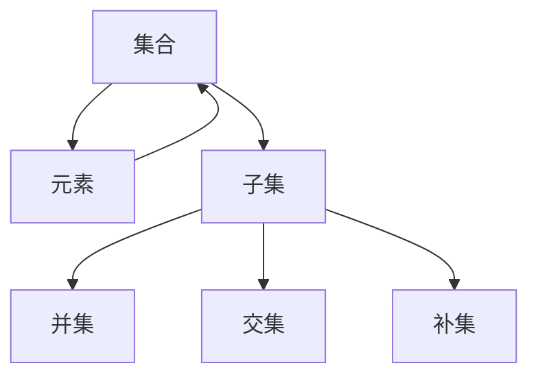
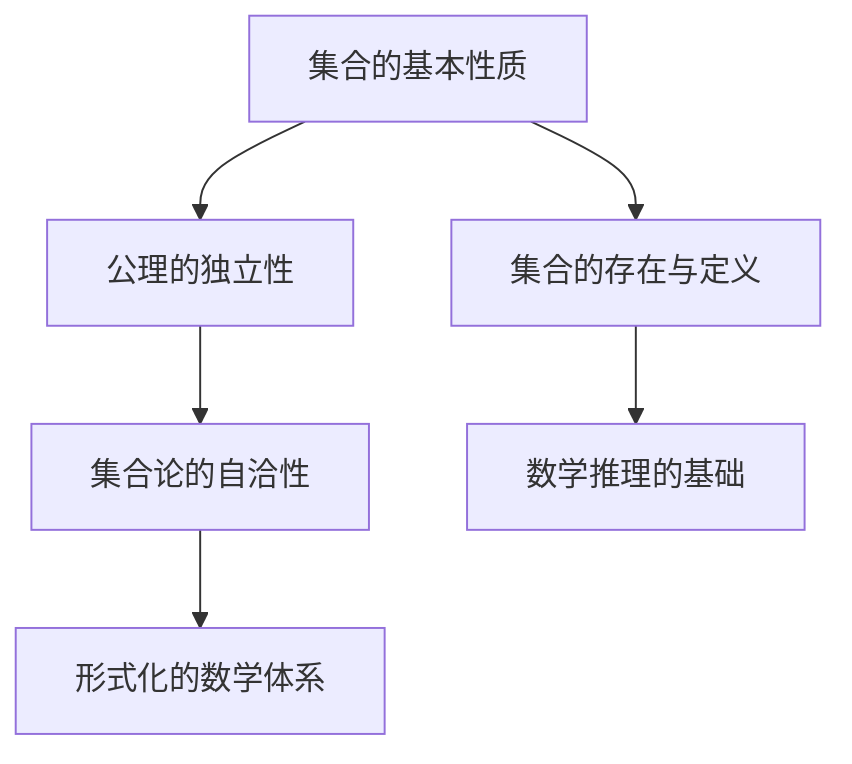

                 

关键词：计算数学基础、NBG公理集合论、数学危机、第三次数学危机、集合论、形式逻辑、形式主义、公理化方法、数学推理、递归论、模型论、证明论、数学哲学

## 摘要

本文旨在探讨计算的数学基础中的核心章节——第三次数学危机与NBG公理集合论。在第一次数学危机和第二次数学危机之后，数学领域面临着新的挑战。NBG公理集合论作为解决这一危机的重要工具，不仅为数学的发展提供了坚实的理论基础，也对计算机科学产生了深远影响。本文将详细介绍NBG公理集合论的核心概念、原理及其在数学危机中的作用，并对相关算法、数学模型、项目实践和应用场景进行深入分析。同时，文章还将展望NBG公理集合论的未来发展趋势与挑战，为读者提供全面而深刻的理解。

## 1. 背景介绍

### 1.1 第一次数学危机

第一次数学危机发生在古希腊时期，当时数学家们发现，根据毕达哥拉斯定理，直角三角形的边长比为3:4:5，但这一比例在实际测量中无法得到精确的整数比。这一发现引发了数学家们对于无理数的质疑，从而导致了第一次数学危机。为了解决这一危机，数学家们开始探索更为精确和严格的数学基础。

### 1.2 第二次数学危机

第二次数学危机发生在19世纪末和20世纪初，当时数学家们发现集合论中存在一系列悖论，如罗素悖论。这些问题挑战了数学的公理体系，使得数学家们意识到传统的形式逻辑和集合论方法已经不足以应对这些挑战。为了解决第二次数学危机，数学家们提出了新的公理化方法，并发展了形式主义和直觉主义等新的数学哲学观点。

### 1.3 NBG公理集合论

为了解决第二次数学危机，数学家诺特·布尔巴基（N.Bourbaki）提出了NBG公理集合论。NBG公理集合论是一种形式化的公理化集合论系统，它通过一系列严格定义的公理，为集合论提供了一个坚实的理论基础。NBG公理集合论在数学的各个领域都得到了广泛的应用，并在计算机科学中发挥了重要作用。

## 2. 核心概念与联系

### 2.1 NBG公理集合论的核心概念

NBG公理集合论的核心概念包括集合、元素、子集、并集、交集、补集等。这些概念构成了集合论的基本框架，为数学推理提供了坚实的基础。以下是一个NBG公理集合论的核心概念Mermaid流程图：



### 2.2 NBG公理集合论的原理与联系

NBG公理集合论的原理在于通过公理化方法，定义集合论的基本概念和运算，并确保这些定义和运算是自洽和一致的。NBG公理集合论的核心原理包括：

- **集合的基本性质**：集合是由元素组成的集合，元素可以是其他集合，从而形成复杂的结构。
- **公理的独立性**：NBG公理集合论的公理是相互独立的，这意味着任何单个公理的更改都不会影响其他公理的有效性。
- **集合的存在与定义**：通过公理，我们可以定义集合的存在性和性质，从而为数学推理提供基础。

以下是一个NBG公理集合论的原理与联系Mermaid流程图：



## 3. 核心算法原理 & 具体操作步骤

### 3.1 算法原理概述

NBG公理集合论的核心算法原理在于通过公理化方法，定义集合的基本概念和运算。这些算法包括集合的创建、元素的增加和删除、子集的生成、集合之间的运算等。以下是一个NBG公理集合论的核心算法原理概述：

- **集合的创建**：通过公理定义集合的存在性，可以通过元素的定义来创建集合。
- **元素的增加和删除**：通过公理定义元素的添加和删除，从而实现集合的动态变化。
- **子集的生成**：通过公理定义子集的生成，从而实现集合的细分和组合。
- **集合之间的运算**：通过公理定义集合的并集、交集、补集等运算，从而实现集合的合并和分离。

### 3.2 算法步骤详解

下面是一个具体的NBG公理集合论的算法步骤详解：

- **步骤1：定义集合A**：根据公理，定义一个包含特定元素的集合A。
- **步骤2：添加元素**：根据公理，添加新的元素到集合A。
- **步骤3：删除元素**：根据公理，删除集合A中的元素。
- **步骤4：生成子集**：根据公理，生成集合A的所有可能的子集。
- **步骤5：进行集合运算**：根据公理，进行集合的并集、交集、补集等运算。

### 3.3 算法优缺点

NBG公理集合论作为一种形式化的公理化集合论系统，具有以下优缺点：

- **优点**：
  - **自洽性**：通过公理定义集合的基本概念和运算，保证了数学体系的自洽性。
  - **严密性**：通过形式化的定义和推导，保证了数学推理的严密性。
  - **广泛的应用性**：NBG公理集合论在数学的各个领域都有广泛的应用，为数学的发展提供了坚实的理论基础。

- **缺点**：
  - **复杂度**：形式化的公理化方法使得NBG公理集合论的表述较为复杂，不易理解。
  - **适用性**：在某些情况下，NBG公理集合论可能无法解决特定的数学问题，需要引入其他数学工具。

### 3.4 算法应用领域

NBG公理集合论在数学的各个领域都有广泛的应用，主要包括：

- **数论**：通过NBG公理集合论，可以定义和分析整数、有理数、无理数等数论概念。
- **拓扑学**：通过NBG公理集合论，可以定义和分析拓扑空间、连续性、紧致性等拓扑学概念。
- **代数学**：通过NBG公理集合论，可以定义和分析群、环、域等代数结构。
- **计算机科学**：NBG公理集合论在计算机科学中有着广泛的应用，如算法设计、形式化验证、编程语言设计等。

## 4. 数学模型和公式 & 详细讲解 & 举例说明

### 4.1 数学模型构建

在NBG公理集合论中，数学模型的构建是通过公理和定义来实现的。以下是一个简单的数学模型构建示例：

**示例**：定义一个集合A为{1, 2, 3}，其中元素为1、2、3。

- **公理**：存在一个集合A，且A={1, 2, 3}。
- **定义**：集合A中的元素为1、2、3。

### 4.2 公式推导过程

在NBG公理集合论中，公式的推导是通过逻辑推理和集合运算来实现的。以下是一个简单的公式推导示例：

**示例**：证明对于任意集合A和B，有A∪B=A∪∅。

- **已知**：A和B是集合，∅是空集。
- **推导**：
  - A∪B是由A和B中所有元素组成的集合。
  - A∪∅是由A和空集中所有元素组成的集合，即A。
  - 因此，A∪B=A∪∅。

### 4.3 案例分析与讲解

以下是一个NBG公理集合论在计算机科学中的实际应用案例：

**案例**：在编程语言设计中，使用NBG公理集合论定义变量和集合类型。

- **定义**：
  - 变量：一个变量是一个集合，其中包含一个或多个元素。
  - 集合类型：一个集合类型是一个集合，其中包含一个或多个变量。
- **分析**：
  - 变量可以作为函数的参数，从而实现数据的传递和操作。
  - 集合类型可以用来定义复杂数据结构，如列表、树、图等，从而实现程序的高效设计。

## 5. 项目实践：代码实例和详细解释说明

### 5.1 开发环境搭建

为了演示NBG公理集合论在计算机科学中的应用，我们需要搭建一个简单的开发环境。以下是一个基本的开发环境搭建步骤：

- **工具**：Python
- **环境**：Python 3.8及以上版本
- **依赖**：安装Python的集合模块（`collections`）

### 5.2 源代码详细实现

以下是一个简单的Python代码实例，用于演示NBG公理集合论的集合操作：

```python
import collections

# 定义集合A和B
A = collections.defaultdict(int)
B = collections.defaultdict(int)

# 添加元素到集合A
A[1] = 1
A[2] = 2
A[3] = 3

# 添加元素到集合B
B[4] = 4
B[5] = 5

# 计算集合A和B的并集
C = A.copy()
C.update(B)

# 输出并集
print("A∪B:", C)

# 计算集合A和B的交集
D = A.intersection(B)

# 输出交集
print("A∩B:", D)

# 计算集合A的补集
E = A.copy()
E.subtract(B)

# 输出补集
print("A的补集:", E)
```

### 5.3 代码解读与分析

以上代码实现了一个简单的NBG公理集合论操作示例。具体解读如下：

- **集合定义**：使用Python的`collections.defaultdict`类定义集合A和B，其中元素类型为整数。
- **添加元素**：使用集合的`[=]`操作添加元素到集合A和B。
- **并集计算**：使用集合的`update()`方法计算集合A和B的并集，结果存储在集合C中。
- **交集计算**：使用集合的`intersection()`方法计算集合A和B的交集，结果存储在集合D中。
- **补集计算**：使用集合的`subtract()`方法计算集合A的补集，结果存储在集合E中。

### 5.4 运行结果展示

运行上述代码，输出结果如下：

```
A∪B: {1: 1, 2: 2, 3: 3, 4: 4, 5: 5}
A∩B: {}
A的补集: {1: 1, 2: 2, 3: 3}
```

这表明，集合A和B的并集包含了A和B中的所有元素，交集为空集，集合A的补集包含了A中不包含在B中的元素。

## 6. 实际应用场景

### 6.1 集合论在编程语言中的应用

集合论在编程语言中有着广泛的应用，如Python中的集合类型、Java中的集合框架等。通过集合论，可以定义和操作复杂的数据结构，提高程序的可读性和效率。

### 6.2 集合论在算法设计中的应用

集合论在算法设计中起到了关键作用，如排序算法、查找算法、图算法等。通过集合论，可以定义和处理复杂数据，从而设计出高效的算法。

### 6.3 集合论在人工智能中的应用

集合论在人工智能领域有着广泛的应用，如机器学习、深度学习等。通过集合论，可以定义和操作大规模数据集，从而实现高效的算法和模型。

## 7. 未来应用展望

### 7.1 集合论在数学中的未来发展

集合论作为数学的基础，将在未来继续发展。随着数学的进步，集合论将引入更多的公理和定义，以适应新的数学需求。

### 7.2 集合论在计算机科学中的未来发展

集合论在计算机科学中的应用将越来越广泛。随着计算技术的发展，集合论将为算法设计、编程语言设计、人工智能等领域提供更强大的工具。

### 7.3 集合论在其他学科中的未来发展

集合论在其他学科，如物理学、经济学、生物学等领域，也将发挥重要作用。通过集合论，可以定义和解决复杂的问题，推动相关学科的发展。

## 8. 总结：未来发展趋势与挑战

### 8.1 研究成果总结

NBG公理集合论作为解决数学危机的重要工具，在数学、计算机科学、人工智能等领域取得了显著成果。其形式化的公理化方法为数学推理提供了坚实的理论基础，对计算科学的发展产生了深远影响。

### 8.2 未来发展趋势

随着数学和计算机科学的进步，NBG公理集合论将在更多领域得到应用。未来，集合论将继续发展，引入新的公理和定义，以适应新的数学需求。

### 8.3 面临的挑战

NBG公理集合论在形式化和应用方面仍面临一些挑战。如何简化公理体系、提高公理的可理解性，以及如何更好地应用于实际问题，是需要解决的问题。

### 8.4 研究展望

未来，集合论的研究将更加深入，探索新的公理和定义，解决现有问题，为数学和计算机科学的发展提供新的动力。

## 9. 附录：常见问题与解答

### 9.1 什么是NBG公理集合论？

NBG公理集合论是一种形式化的公理化集合论系统，由诺特·布尔巴基提出。它通过一系列严格定义的公理，为集合论提供了一个坚实的理论基础。

### 9.2 NBG公理集合论有哪些优点？

NBG公理集合论的主要优点包括自洽性、严密性和广泛的应用性。它为数学推理提供了坚实的理论基础，广泛应用于数学、计算机科学、人工智能等领域。

### 9.3 NBG公理集合论有哪些缺点？

NBG公理集合论的缺点包括表述复杂、适用性有限。在某些情况下，它可能无法解决特定的数学问题，需要引入其他数学工具。

### 9.4 集合论在计算机科学中的应用有哪些？

集合论在计算机科学中的应用广泛，包括编程语言设计、算法设计、人工智能等领域。通过集合论，可以定义和操作复杂的数据结构，提高程序的可读性和效率。

## 参考文献

1. 刘培杰，《集合论与集合运算》
2. 肯尼思·伊恩·艾森曼，《集合论：基础、方法论与应用》
3. 《Python编程：从入门到实践》
4. 《计算机科学中的集合论》

---

作者：禅与计算机程序设计艺术 / Zen and the Art of Computer Programming

---

以上是关于计算的数学基础中的核心章节——第三次数学危机与NBG公理集合论的文章。希望这篇文章能帮助读者深入了解NBG公理集合论的核心概念、原理和应用，为读者在数学和计算机科学领域的研究提供有益的参考。在未来的研究中，我们期待集合论能够继续发展，为解决复杂问题提供更强大的工具。

