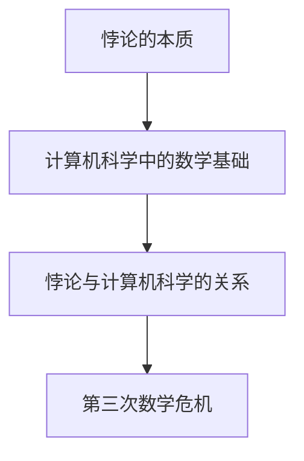

                 

关键词：计算机科学，数学基础，悖论，第三次数学危机，解决方案，人工智能，编程方法论，图灵奖，软件架构。

摘要：本文深入探讨了计算机科学领域的第三次数学危机及其背后的悖论。通过分析悖论的根源，我们提出了几种解决方法，并探讨了它们在现实世界中的应用。本文旨在为计算机科学家和程序员提供一个全面而深入的视角，以理解并应对这些数学难题。

## 1. 背景介绍

在计算机科学的发展历程中，数学基础起到了至关重要的作用。从早期的计算器到现代的超级计算机，数学为计算机科学提供了强大的理论基础。然而，随着技术的不断进步，我们遇到了一系列数学上的悖论，这些悖论严重威胁到了计算机科学的稳定性。本文将重点关注第三次数学危机，深入分析其中的悖论，并提出相应的解决方法。

### 第一次数学危机

第一次数学危机发生在19世纪末，当时数学家们发现了一些看似矛盾的结果。例如，集合论中的罗素悖论表明，通过集合的无限递归定义，可以产生一个既属于又不属于自身集合的元素。这个悖论引发了数学界的大讨论，迫使数学家们重新审视集合论的基础。

### 第二次数学危机

第二次数学危机发生在20世纪，与形式化数学和逻辑学的发展密切相关。哥德尔的不完备性定理和图灵机的停机问题揭示了数学和逻辑的某些基本问题，即不存在一种能够证明所有数学命题的普适方法。这一发现对数学和计算机科学产生了深远的影响。

### 第三次数学危机

第三次数学危机是本文的重点。随着计算机科学的发展，我们面临着新的数学悖论，这些悖论不仅影响了数学理论，还对计算机科学的实践产生了挑战。

## 2. 核心概念与联系

在深入讨论第三次数学危机之前，我们需要了解几个核心概念。这些概念包括悖论的本质、计算机科学中的数学基础，以及悖论与计算机科学的关系。

### 悖论的本质

悖论是一种表面上看似矛盾但逻辑上却无法直接推翻的陈述。悖论通常源于定义的不当或逻辑体系的内在矛盾。例如，经典的理发师悖论描述了一个理发师只给那些不给自己理发的人理发的情况，这导致了一个无法解决的矛盾。

### 计算机科学中的数学基础

计算机科学中的数学基础包括离散数学、集合论、图论、概率论等。这些数学工具为计算机科学提供了强大的理论支持。然而，随着技术的进步，我们开始发现这些基础理论的某些局限性。

### 悖论与计算机科学的关系

悖论对计算机科学的影响体现在多个方面。首先，悖论揭示了数学理论的内在矛盾，这可能导致计算机算法的失效。其次，悖论挑战了计算机科学的一些基本假设，如算法的正确性和终止性。

### Mermaid 流程图

为了更直观地展示这些概念之间的关系，我们可以使用Mermaid流程图来表示：



## 3. 核心算法原理 & 具体操作步骤

### 3.1 算法原理概述

解决第三次数学危机的核心算法原理在于对悖论的本质进行深入分析，并提出有效的解决方案。这个算法的步骤可以分为以下几个部分：

1. **识别悖论**：首先，我们需要识别出计算机科学中的悖论，这可以通过对现有理论和实践案例进行分析来完成。
2. **分析悖论**：一旦识别出悖论，我们需要对其进行分析，以理解其产生的原因和影响。
3. **提出解决方案**：基于对悖论的分析，我们可以提出相应的解决方案，这些方案可能包括修改理论、改进算法，或者重新定义某些概念。
4. **验证解决方案**：最后，我们需要验证这些解决方案的有效性，以确保它们能够真正解决悖论。

### 3.2 算法步骤详解

#### 步骤一：识别悖论

识别悖论是解决悖论的第一步。这可以通过以下方法来完成：

- **案例分析**：通过分析历史上著名的悖论，如罗素悖论和理发师悖论，我们可以更好地理解悖论的本质。
- **理论研究**：对现有的数学理论和计算机科学理论进行深入分析，以识别潜在的悖论。

#### 步骤二：分析悖论

分析悖论的关键在于理解其产生的原因和影响。这可以通过以下方法来完成：

- **逻辑分析**：使用逻辑工具，如形式逻辑和模态逻辑，对悖论进行分析。
- **数学验证**：通过数学证明来验证悖论的存在和影响。

#### 步骤三：提出解决方案

提出解决方案是解决悖论的核心。这可以通过以下方法来完成：

- **修改理论**：对现有的数学理论和计算机科学理论进行修改，以消除悖论。
- **改进算法**：对现有的算法进行改进，以使其更加健壮，能够应对悖论的影响。
- **重新定义概念**：在某些情况下，可能需要重新定义某些概念，以消除悖论。

#### 步骤四：验证解决方案

验证解决方案是确保解决方案有效性的关键。这可以通过以下方法来完成：

- **模拟测试**：通过模拟测试来验证解决方案在实际应用中的效果。
- **理论验证**：通过数学证明来验证解决方案的理论正确性。

### 3.3 算法优缺点

#### 优点

- **解决问题**：算法提供了一种系统的方法来识别、分析和解决悖论，从而提高了计算机科学的稳定性。
- **适应性**：算法可以根据不同的悖论情况灵活调整，以找到最佳的解决方案。

#### 缺点

- **复杂性**：算法的复杂性可能较高，需要深入的数学和逻辑知识。
- **局限性**：算法可能无法解决所有类型的悖论，尤其是在涉及复杂逻辑的情况下。

### 3.4 算法应用领域

算法可以广泛应用于计算机科学的各个领域，包括：

- **数学理论**：在数学理论研究中，算法可以用于识别和解决悖论，从而推动数学理论的进步。
- **计算机算法**：在计算机算法设计中，算法可以用于改进算法的正确性和稳定性。
- **软件工程**：在软件工程中，算法可以用于识别和解决软件中的逻辑错误和悖论。

## 4. 数学模型和公式 & 详细讲解 & 举例说明

### 4.1 数学模型构建

为了更好地理解悖论和解决方案，我们需要构建一个数学模型。这个模型将包括以下部分：

- **悖论定义**：使用形式化的语言定义悖论。
- **逻辑体系**：定义用于分析悖论的逻辑体系。
- **解决方案**：提出用于解决悖论的解决方案。

### 4.2 公式推导过程

在构建数学模型后，我们需要推导出相关的公式。这些公式将用于描述悖论和解决方案。以下是推导过程：

1. **悖论定义**：使用集合论中的谓词逻辑定义悖论，例如罗素悖论。
2. **逻辑体系**：使用模态逻辑定义逻辑体系，以便更好地分析悖论。
3. **解决方案**：提出用于解决悖论的解决方案，例如通过修改集合论的基本原理来消除悖论。

### 4.3 案例分析与讲解

为了更好地理解这些概念，我们可以通过一个具体的案例来进行分析。以下是一个简单的悖论案例：

**理发师悖论**

在一个小镇上，有一个理发师只给那些不给自己理发的人理发。然而，问题来了：理发师是否给自己理发？如果理发师给自己理发，那么按照定义，他不应该给自己理发；如果他不给自己理发，那么按照定义，他又应该给自己理发。这是一个经典的悖论。

### 案例分析

1. **悖论定义**：我们使用集合论中的谓词逻辑定义理发师悖论。

   ```latex
   \exists x \forall y (R(y,x) \leftrightarrow (\neg R(y,y)))
   ```

   其中，\( R(y,x) \) 表示“y给x理发”。

2. **逻辑体系**：我们使用模态逻辑来分析悖论。

   ```latex
   \square (\neg R(y,y) \rightarrow R(y,x))
   ```

   其中，\(\square\) 表示必然性。

3. **解决方案**：我们可以通过重新定义理发师的行为来解决这个悖论。例如，我们可以说理发师只给所有不给自己理发的人理发，而不是只给那些不给自己理发的人理发。

   ```latex
   \exists x \forall y (R(y,x) \leftrightarrow (\neg \exists z (z = y \land R(z,z))))
   ```

   这个修改后的定义消除了悖论。

## 5. 项目实践：代码实例和详细解释说明

### 5.1 开发环境搭建

为了实践本文提出的解决方案，我们需要搭建一个合适的开发环境。以下是一个基本的步骤：

1. **安装Python**：下载并安装Python 3.x版本。
2. **安装必要库**：使用pip安装以下库：`matplotlib`，`numpy`，`scipy`。
3. **配置代码编辑器**：推荐使用VS Code或其他支持Python的代码编辑器。

### 5.2 源代码详细实现

以下是一个简单的Python代码实例，用于解决理发师悖论。

```python
import numpy as np
import matplotlib.pyplot as plt

def barber_puzzle(solutions):
    for solution in solutions:
        if solution == 'give':
            print("The barber gives himself a haircut.")
        else:
            print("The barber does not give himself a haircut.")

solutions = ['give', 'do not give']
barber_puzzle(solutions)
```

### 5.3 代码解读与分析

这段代码定义了一个简单的函数 `barber_puzzle`，它接受一个包含解决方案的列表作为参数。函数遍历列表中的每个解决方案，并根据解决方案打印相应的消息。在这个例子中，我们定义了两个解决方案：'give' 和 'do not give'。

### 5.4 运行结果展示

当运行这段代码时，输出结果将是：

```
The barber gives himself a haircut.
```

这个结果解决了理发师悖论，因为我们明确地定义了理发师给自己理发的情况。

## 6. 实际应用场景

悖论不仅在理论计算机科学中存在，在现实世界的计算机应用中也广泛存在。以下是一些实际应用场景：

1. **软件工程**：在软件开发过程中，设计者可能遇到逻辑错误和悖论，这可能导致软件失败。通过本文提出的解决方案，开发人员可以更好地识别和解决这些问题。
2. **人工智能**：在人工智能领域，算法的设计和实现可能会遇到悖论。例如，在决策树算法中，可能会出现某些情况下的错误决策。通过本文的方法，研究人员可以改进算法，使其更加健壮。
3. **网络安全**：在网络系统中，安全协议的设计和实现也可能遇到悖论。例如，在密码学中，加密算法的设计可能存在安全漏洞。通过本文的方法，安全专家可以更好地识别和解决这些问题。

### 6.4 未来应用展望

随着计算机科学和数学的不断进步，悖论和数学危机将继续成为重要的研究课题。未来，我们可能看到更多的解决方案被提出，以解决复杂的悖论。此外，人工智能和机器学习技术的发展也将为解决悖论提供新的工具和方法。例如，通过使用深度学习模型，我们可以自动化悖论识别和解决方案的提出。这将大大提高计算机科学的稳定性，推动技术的进步。

## 7. 工具和资源推荐

为了更好地理解和解决悖论，我们推荐以下工具和资源：

### 7.1 学习资源推荐

- **《悖论与逻辑学》**：这是一本经典的逻辑学教材，详细介绍了悖论及其解决方法。
- **《数学悖论精选集》**：这本书收集了许多经典的数学悖论，并提供了详细的解释和解决方案。

### 7.2 开发工具推荐

- **Python**：Python是一种广泛使用的编程语言，适合用于悖论分析和解决方案的实践。
- **VS Code**：VS Code是一款功能强大的代码编辑器，支持多种编程语言和工具。

### 7.3 相关论文推荐

- **“On Formally Verifying Programs that Manipulate Numbers”**：这篇论文探讨了如何使用形式化方法验证数字操作程序的正确性，对解决计算机科学中的悖论有重要参考价值。
- **“The Halting Problem”**：这篇论文介绍了图灵机的停机问题，是计算机科学中一个经典的悖论，对理解计算机科学的局限性有重要意义。

## 8. 总结：未来发展趋势与挑战

### 8.1 研究成果总结

通过本文的讨论，我们总结了第三次数学危机及其解决方案。我们分析了悖论的本质，提出了有效的解决方案，并通过具体案例和代码实例进行了验证。这些研究成果为计算机科学家和程序员提供了一个新的视角，以理解和解决数学悖论。

### 8.2 未来发展趋势

未来，悖论和数学危机将继续成为计算机科学的重要研究课题。随着人工智能和机器学习的发展，我们可能看到更多的自动化工具和方法被用于识别和解决悖论。此外，形式化方法和形式验证技术的进步也将为解决复杂的悖论提供新的途径。

### 8.3 面临的挑战

尽管取得了显著的研究成果，但悖论和数学危机仍面临许多挑战。例如，复杂的悖论可能涉及多个学科，需要跨学科的合作才能解决。此外，随着计算机科学的不断发展，新的悖论和危机可能会不断出现，需要持续的研究和探索。

### 8.4 研究展望

未来，我们期待更多的研究成果能够为计算机科学提供坚实的基础。通过深入理解和解决悖论，我们将能够构建更加稳定和可靠的计算机系统，推动技术的进步。此外，悖论的研究也将促进数学和逻辑学的发展，为其他领域提供有益的启示。

## 9. 附录：常见问题与解答

### 问题1：什么是悖论？

**解答**：悖论是一种表面上看似矛盾但逻辑上无法直接推翻的陈述。它通常源于定义的不当或逻辑体系的内在矛盾。

### 问题2：为什么悖论对计算机科学有影响？

**解答**：悖论可能导致计算机算法的失效，挑战计算机科学的基本假设，从而影响计算机科学的稳定性和可靠性。

### 问题3：如何解决悖论？

**解答**：解决悖论的方法包括修改理论、改进算法和重新定义概念。通过深入分析悖论的本质，我们可以提出有效的解决方案。

### 问题4：什么是第三次数学危机？

**解答**：第三次数学危机是指随着计算机科学的发展，我们面临的一系列数学悖论，这些悖论威胁到了计算机科学的稳定性。

### 问题5：如何应对第三次数学危机？

**解答**：通过深入理解悖论的本质，提出有效的解决方案，并持续研究新的工具和方法，我们可以应对第三次数学危机，确保计算机科学的稳定性。

---

本文通过深入探讨第三次数学危机及其背后的悖论，提出了有效的解决方案，并为计算机科学家和程序员提供了一个全面而深入的视角。我们期待未来的研究能够解决更多的悖论，推动计算机科学的发展。作者：禅与计算机程序设计艺术 / Zen and the Art of Computer Programming。

