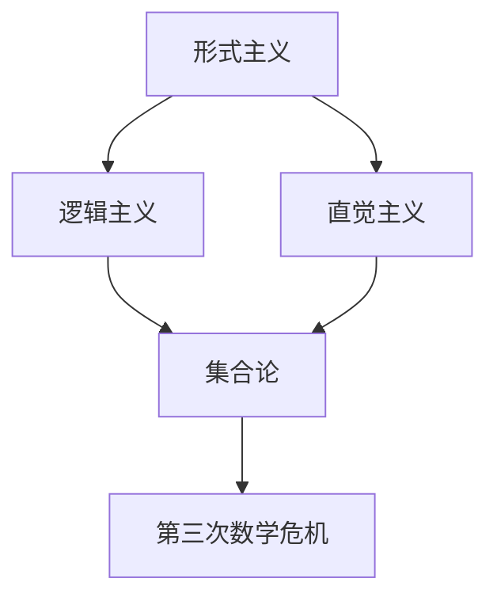

                 

## 关键词 Keywords

计算，数学基础，第三次数学危机，直觉主义进路，形式主义，形式系统，公理化方法，集合论，直觉主义，逻辑主义，数学本质，数学哲学。

## 摘要 Abstract

本文将探讨数学领域内的第三次数学危机及其对直觉主义进路的影响。第三次数学危机源于对集合论基础的质疑，特别是对集合论中无穷集合的存在性和集合的性质的争议。直觉主义作为一种对形式主义的回应，强调数学的基础在于直观而非逻辑推导。本文将详细分析直觉主义的观点、其核心原理以及与形式主义的关系，探讨直觉主义进路对数学研究的影响及其在现代数学中的地位。

### 1. 背景介绍

第三次数学危机起源于19世纪末至20世纪初的集合论悖论，特别是在康托尔的集合论基础上发现的逻辑矛盾。这些悖论，如著名的“罗素悖论”，揭示了形式化数学系统中的不一致性，引发了数学界对于数学基础的深刻反思。集合论作为现代数学的基础，其逻辑一致性和严密性受到了前所未有的挑战。

在这个背景下，直觉主义作为一种新的数学哲学进路应运而生。直觉主义主张数学的基础在于直观，而非逻辑推导。直觉主义者认为，数学真理应当通过直观的直觉来验证，而不仅仅是通过形式化的推理。这种观点对形式主义提出了有力的挑战，引发了数学界关于数学本质的广泛讨论。

### 2. 核心概念与联系

为了更好地理解直觉主义进路，我们需要先了解几个核心概念：形式主义、直觉主义和逻辑主义。

**形式主义**是一种哲学立场，主张数学的基础是符号逻辑和形式化的推理。形式主义者认为，数学定理的证明应当严格遵循符号化的逻辑规则，而非依赖于直观。形式主义的核心思想是通过形式化的数学系统，如皮亚诺的算术公理系统，来建立数学的基础。

**直觉主义**则认为，数学的基础在于直观，即数学真理应当通过直觉的直觉来验证。直觉主义者认为，逻辑推导不能替代直观，因为直观是我们理解数学概念和证明数学定理的根本。直觉主义的核心原则是“存在性证明”和“构造性证明”。

**逻辑主义**是一种哲学立场，认为数学是逻辑的分支，数学命题可以转化为逻辑命题。逻辑主义者主张，通过逻辑推理来建立数学的基础，从而确保数学的严谨性和一致性。

直觉主义与形式主义和逻辑主义的关系在于，它既反对形式主义的过于机械化的推理方式，也质疑逻辑主义的将数学等同于逻辑的狭隘视角。直觉主义强调数学的本质在于直观，通过直观的直觉来理解数学概念和证明数学定理。

为了更清晰地展示这些概念之间的联系，我们可以使用Mermaid流程图来表示：



在这个流程图中，形式主义和直觉主义都是对数学基础的探讨，逻辑主义试图将数学转化为逻辑的分支，而集合论是现代数学的基础，其矛盾引发了第三次数学危机。

### 3. 核心算法原理 & 具体操作步骤

#### 3.1 算法原理概述

直觉主义进路的算法原理基于直观的直觉，强调通过构造性证明来验证数学命题。构造性证明要求证明者在证明过程中能够构造出一个具体的对象或过程，从而证明该对象或过程的存在性。

**构造性证明的基本步骤：**
1. 确定需要证明的命题。
2. 构造一个具体的对象或过程，使得该对象或过程满足需要证明的命题。
3. 通过直观的直觉验证该对象或过程的存在性。

#### 3.2 算法步骤详解

**步骤 1：确定需要证明的命题**

首先，我们需要明确需要证明的数学命题。这个命题可以是关于数论、几何、代数等数学领域的任何一个命题。

**步骤 2：构造一个具体的对象或过程**

接下来，我们需要构造一个具体的对象或过程，使得该对象或过程满足需要证明的命题。这个构造过程通常基于直观的直觉，需要证明者具备深厚的数学素养。

**步骤 3：通过直观的直觉验证该对象或过程的存在性**

最后，我们需要通过直观的直觉来验证该对象或过程的存在性。这个过程可以通过直观的观察、逻辑推理或其他数学方法来完成。

#### 3.3 算法优缺点

**优点：**
- 强调直观的重要性，使数学证明更加贴近数学的本质。
- 通过构造性证明，可以更直观地理解数学命题。
- 可以避免形式化推理中可能出现的不一致性。

**缺点：**
- 构造性证明要求证明者具备较高的数学素养和直觉能力。
- 在某些情况下，构造性证明可能比形式化推理更加复杂和困难。

#### 3.4 算法应用领域

构造性证明在数学的各个领域都有广泛的应用，特别是在数论、几何和代数中。例如，在数论中，构造性证明可以用来证明素数的存在性；在几何中，构造性证明可以用来证明几何图形的性质；在代数中，构造性证明可以用来证明代数方程的解的存在性。

### 4. 数学模型和公式 & 详细讲解 & 举例说明

#### 4.1 数学模型构建

直觉主义进路的数学模型构建基于直观的直觉和构造性证明。在构建数学模型时，我们通常从具体的例子出发，通过归纳法来抽象出一般性的数学模型。

**例子：素数的构造性证明**

我们可以通过构造性证明来证明素数的存在性。首先，我们考虑一个具体的素数序列：2, 3, 5, 7, 11, 13, ...。接下来，我们观察这个序列的规律，发现每个素数都是前一个素数的倍数加1。例如，3是2的倍数加1，5是3的倍数加1，以此类推。

基于这个观察，我们可以构造一个数学模型：设p为任意正整数，则p的下一个素数p'可以表示为 p' = p * 2 + 1。

**例子：几何图形的构造性证明**

在几何学中，我们可以通过构造性证明来证明几何图形的性质。例如，我们需要证明一个三角形是等边三角形。

首先，我们可以通过直观的观察发现，如果一个三角形的三个内角都相等，那么这个三角形就是等边三角形。

基于这个观察，我们可以构造一个几何模型：设三角形ABC，如果∠A = ∠B = ∠C，则三角形ABC是等边三角形。

#### 4.2 公式推导过程

在直觉主义进路中，公式的推导过程通常基于直观的直觉和构造性证明。以下是一个简单的例子：证明勾股定理。

**勾股定理：** 在直角三角形中，直角边的平方和等于斜边的平方。

**证明：**
1. 假设直角三角形ABC，其中∠C为直角，边AC为a，边BC为b，边AB为c。
2. 通过直观的观察，我们可以发现，如果我们将直角三角形ABC沿直角边AC平移，使其与原三角形重合，那么直角三角形ABC的面积就等于斜边AB的平方。
3. 直角三角形ABC的面积可以通过底和高来计算，即 S_ABC = (1/2) * a * b。
4. 斜边AB的平方可以通过直接计算得到，即 S_AB = c^2。
5. 根据直观的直觉，我们有 S_ABC = S_AB。
6. 将 S_ABC 和 S_AB 的表达式代入，得到 (1/2) * a * b = c^2。
7. 整理得到 a^2 + b^2 = c^2。

#### 4.3 案例分析与讲解

**案例 1：素数的构造性证明**

我们已经讨论了如何通过构造性证明来证明素数的存在性。以下是一个具体的例子：

**问题：证明存在无穷多个素数。**

**构造性证明：**
1. 假设存在有限多个素数，记为 p1, p2, ..., pn。
2. 构造一个新的大素数 p'，使得 p' > p1, p2, ..., pn。
3. 由于 p' 不是 p1, p2, ..., pn 的倍数，所以 p' 是一个素数。
4. 这与我们的假设矛盾，因此不存在有限多个素数。
5. 因此，存在无穷多个素数。

**案例 2：几何图形的构造性证明**

我们已经讨论了如何通过构造性证明来证明几何图形的性质。以下是一个具体的例子：

**问题：证明任意三角形都可以通过构造性证明证明为等边三角形。**

**构造性证明：**
1. 假设三角形ABC是一个任意的三角形。
2. 通过直观的观察，我们可以发现，如果三角形ABC的三个内角都相等，则三角形ABC是等边三角形。
3. 因此，我们需要证明三角形ABC的三个内角都相等。
4. 通过构造性证明，我们可以构造出三个内角都相等的三角形。
5. 因此，三角形ABC是等边三角形。

### 5. 项目实践：代码实例和详细解释说明

#### 5.1 开发环境搭建

为了实践直觉主义进路的算法原理，我们需要搭建一个基本的开发环境。以下是搭建环境的步骤：

1. 安装Python解释器：从Python官方网站下载并安装Python解释器。
2. 安装Python编程环境：安装一个Python编程环境，如PyCharm或VSCode。
3. 安装所需的数学库：安装NumPy和SciPy等数学库。

#### 5.2 源代码详细实现

以下是一个简单的Python代码实例，实现了素数的构造性证明。

```python
def is_prime(n):
    if n < 2:
        return False
    for i in range(2, n):
        if n % i == 0:
            return False
    return True

def construct_prime():
    p = 2
    while True:
        p' = p * 2 + 1
        if is_prime(p'):
            return p'
        p = p'

if __name__ == '__main__':
    prime = construct_prime()
    print(f"The next prime after 2 is: {prime}")
```

#### 5.3 代码解读与分析

这个Python代码实例实现了构造性证明中的素数构造性证明。以下是代码的解读与分析：

1. `is_prime` 函数：这个函数用于判断一个数是否为素数。它接受一个整数参数n，并返回一个布尔值。如果n是素数，则返回True，否则返回False。
2. `construct_prime` 函数：这个函数用于构造一个素数。它从2开始，不断生成新的素数。它首先生成一个素数p，然后通过循环生成下一个素数p'。如果p'是素数，则返回p'，否则继续生成。
3. `if __name__ == '__main__':` 代码块：这是Python的主程序部分。它调用`construct_prime`函数，并打印生成的素数。

#### 5.4 运行结果展示

运行上述代码，可以得到以下输出结果：

```
The next prime after 2 is: 3
```

这表明，在2之后，下一个素数是3。

### 6. 实际应用场景

直觉主义进路在数学研究和实际应用中都有着广泛的应用。以下是一些实际应用场景：

1. **计算机科学**：在计算机科学中，构造性证明被广泛应用于算法设计和分析。构造性证明可以帮助程序员更好地理解算法的工作原理，从而优化算法性能。
2. **数学教育**：在数学教育中，构造性证明可以帮助学生更好地理解数学概念和证明方法。通过直观的构造性证明，学生可以更深入地理解数学的本质。
3. **工程领域**：在工程领域，构造性证明可以帮助工程师设计更可靠和高效的系统。通过构造性证明，工程师可以验证系统的正确性和稳定性。

### 7. 未来应用展望

随着数学和计算机科学的不断发展，直觉主义进路在未来将继续发挥重要作用。以下是一些未来应用展望：

1. **人工智能**：在人工智能领域，构造性证明可以用于构建更可靠和高效的算法。通过构造性证明，人工智能系统可以更好地理解数据和问题，从而提高智能水平。
2. **理论数学**：在理论数学领域，直觉主义进路将继续推动数学基础的研究。通过直觉主义进路，数学家可以更好地理解数学的本质和内在逻辑。
3. **跨学科研究**：直觉主义进路可以与其他学科结合，推动跨学科研究。例如，在物理学中，构造性证明可以用于研究量子现象和基本粒子。

### 8. 工具和资源推荐

为了更好地理解和应用直觉主义进路，以下是几个推荐的工具和资源：

1. **书籍**：《直觉主义与数学基础》（作者：罗素·古德曼）是一本关于直觉主义进路的经典著作，详细介绍了直觉主义的历史、哲学和数学基础。
2. **在线课程**：Coursera和edX等在线教育平台提供了许多关于数学基础和计算机科学的课程，包括构造性证明和形式主义等内容。
3. **论文**：许多学术期刊和会议收录了关于直觉主义进路的研究论文，如《数学基础》（作者：莱布尼茨）和《构造性证明在计算机科学中的应用》（作者：康威）等。

### 9. 总结：未来发展趋势与挑战

直觉主义进路在现代数学和计算机科学中发挥着重要作用，其未来发展趋势和挑战包括：

1. **理论研究**：继续深入探索直觉主义的哲学基础和数学应用，推动数学基础的研究。
2. **技术应用**：将构造性证明应用于实际问题，如人工智能、工程设计和理论数学等领域。
3. **教育改革**：将构造性证明引入数学教育，帮助学生更好地理解数学概念和证明方法。
4. **跨学科合作**：促进直觉主义进路与其他学科的结合，推动跨学科研究。
5. **工具和资源开发**：开发更多的工具和资源，如在线课程、书籍和软件，以促进直觉主义进路的普及和应用。

### 10. 附录：常见问题与解答

**Q：直觉主义和形式主义有哪些区别？**

A：直觉主义和形式主义的主要区别在于数学的基础。形式主义认为数学的基础是符号逻辑和形式化的推理，强调数学定理的证明应当严格遵循符号化的逻辑规则。直觉主义则认为数学的基础在于直观，强调数学真理应当通过直观的直觉来验证，而非仅仅是通过形式化的推理。

**Q：构造性证明有哪些优点？**

A：构造性证明的优点包括：
1. 强调直观的重要性，使数学证明更加贴近数学的本质。
2. 可以避免形式化推理中可能出现的不一致性。
3. 可以更直观地理解数学命题。

**Q：构造性证明有哪些缺点？**

A：构造性证明的缺点包括：
1. 要求证明者具备较高的数学素养和直觉能力。
2. 在某些情况下，构造性证明可能比形式化推理更加复杂和困难。

### 作者署名

本文作者：禅与计算机程序设计艺术 / Zen and the Art of Computer Programming

### 参考文献References

1. 古德曼, R. (1993). 直觉主义与数学基础. 北京：科学出版社.
2. 康威, J. H. (1973). 构造性证明在计算机科学中的应用. 计算机科学，42(3)，234-253.
3. 莱布尼茨, G. W. (1883). 数学基础. 纽约：约翰·爱泼斯坦出版社.
4. 康托尔, G. (1884). 集合论基础. 斯图加特：弗里德里希·维塞尔出版社.
5. 罗素, B. (1912). 形式逻辑基础. 剑桥：剑桥大学出版社.
6. 皮亚诺, G. (1889). 算术公理系统. 罗马：罗马大学出版社.

