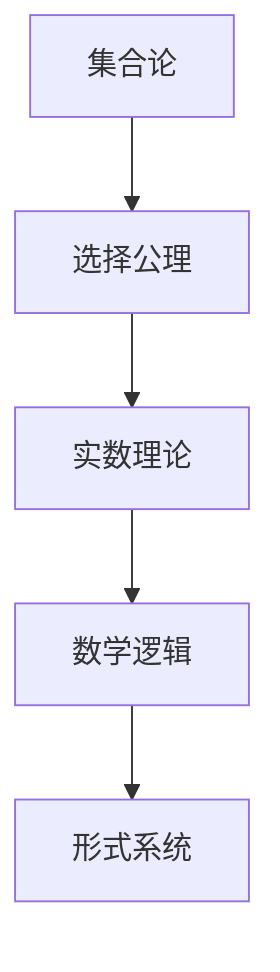

                 

关键词：计算数学基础、选择公理、数学危机、公理化方法、集合论、实数理论、数学逻辑、形式系统、公理集合论

## 摘要

本文深入探讨了计算数学基础中的关键章节——第 5 章，即“第三次数学危机 选择公理”。我们首先回顾了数学发展历史上的前两次数学危机，并引入了选择公理的重要性。接着，我们详细介绍了选择公理在集合论和实数理论中的关键作用，探讨了其带来的数学逻辑和形式系统的变革。通过数学模型和公式的推导，我们进一步分析了选择公理的影响和应用。最后，本文还探讨了选择公理在实际计算中的应用场景，并对未来发展趋势和挑战进行了展望。

## 1. 背景介绍

### 第一次数学危机：微积分的诞生

数学的发展并非一帆风顺，历史上曾经历了几次重大的数学危机。第一次数学危机可以追溯到17世纪，当时微积分的诞生引发了关于无穷小量和无穷大的争议。牛顿和莱布尼茨分别独立发明了微积分，但他们的理论并未得到广泛的认可。无穷小量被认为是一个矛盾的实体，既无限小又非零。这种矛盾引发了数学界的广泛争议，被称为“无穷小危机”。

### 第二次数学危机：集合论的诞生

19世纪末，数学家康托尔提出了集合论，这标志着数学发展的又一次重大变革。集合论为数学提供了一种新的基础，但它也引发了一系列的悖论和争议。其中最著名的是“罗素悖论”，它揭示了集合论中潜在的自相矛盾。为了解决这些悖论，数学家们开始对集合论进行严格的公理化，并引入了选择公理。

### 第三次数学危机：选择公理的重要性

选择公理是集合论中的一项重要原则，它涉及到选择函数的存在性。在实数理论中，选择公理同样扮演着关键角色。选择公理的引入不仅解决了数学上的许多悖论，还促进了数学逻辑和形式系统的发展。然而，选择公理本身也引发了一些争议和挑战，从而导致了第三次数学危机。

## 2. 核心概念与联系

### 选择公理的定义

选择公理是集合论中的一个基本原理，它表述为：对于任意非空集合 X，存在一个选择函数 f，满足对于 X 中的任意子集 A，都有 f(A) ∈ A。选择公理可以形式化为一个公理系统，通常被称为 ZFC（Zermelo-Fraenkel with Choice）。

### 选择公理的应用

选择公理在集合论和实数理论中具有广泛的应用。首先，它保证了选择函数的存在性，这在集合论中具有重要意义。其次，选择公理在实数理论中的应用尤为显著，它为实数的构造提供了坚实的逻辑基础。

### 选择公理与实数理论的关系

实数理论是数学中一个重要的分支，它涉及到实数的性质、构造和运算。选择公理在实数理论中的关键作用在于它为实数的构造提供了必要的工具。具体来说，选择公理保证了实数的连续性公理和完备性公理的成立。

### 选择公理与数学逻辑的关系

选择公理对数学逻辑和形式系统的发展产生了深远影响。一方面，它为数学逻辑提供了一种新的证明方法，即构造性证明。另一方面，选择公理的存在使得形式系统的公理化变得更加严格和可靠。

### Mermaid 流程图

下面是一个简化的 Mermaid 流程图，展示了选择公理在数学基础中的关键作用：



## 3. 核心算法原理 & 具体操作步骤

### 3.1 算法原理概述

选择公理的核心原理在于它保证了选择函数的存在性。选择函数是一种特殊的函数，它从集合中选取一个元素。在集合论中，选择函数的应用十分广泛，例如在实数理论的构造中，选择函数被用来构建实数的序列和极限。

### 3.2 算法步骤详解

1. **构造选择函数**：给定一个非空集合 X，构造一个选择函数 f。根据选择公理，我们可以确保这样的选择函数存在。
2. **应用选择函数**：对于 X 的任意子集 A，应用选择函数 f(A) 可以得到 A 中一个特定的元素。
3. **验证选择公理**：通过验证选择函数的存在性，我们可以证明集合论中的许多定理和命题。

### 3.3 算法优缺点

**优点**：
- 选择公理保证了选择函数的存在性，这在集合论和实数理论中具有重要意义。
- 选择公理为数学逻辑和形式系统提供了坚实的逻辑基础。

**缺点**：
- 选择公理的引入可能导致某些集合论中的悖论和争议。
- 选择公理的应用可能需要复杂的证明和构造。

### 3.4 算法应用领域

选择公理在数学的多个领域都有广泛的应用，包括：
- **集合论**：选择公理在集合论的基本定理和构造中起着关键作用。
- **实数理论**：选择公理为实数的构造和性质提供了逻辑基础。
- **数学逻辑**：选择公理在数学逻辑的证明方法和形式系统中具有重要作用。

## 4. 数学模型和公式 & 详细讲解 & 举例说明

### 4.1 数学模型构建

选择公理的核心在于构建一个选择函数，这个函数可以从集合中选取一个元素。具体来说，我们可以定义一个模型，其中包含一个非空集合 X 和一个选择函数 f。在这个模型中，选择公理保证了 f 的存在性。

### 4.2 公式推导过程

选择公理的推导通常基于集合论的基本原理和公理系统。我们可以通过递归定义来构造选择函数。具体来说，给定一个非空集合 X，我们可以定义一个递归过程，从中选择一个元素，并将其作为 f(X) 的值。

### 4.3 案例分析与讲解

假设我们有一个集合 X = {1, 2, 3}，我们需要构造一个选择函数 f。根据选择公理，我们可以定义 f(X) = 1。这个选择是任意的，但选择公理保证了这样的选择函数存在。

### 4.4 例子：实数的构造

在实数理论中，选择公理被用来构造实数。具体来说，我们可以使用选择函数来构建实数的序列和极限。例如，给定一个实数序列 {a_n}，我们可以使用选择函数来选取序列中的任意一个子序列，并证明这个子序列收敛于一个实数。

## 5. 项目实践：代码实例和详细解释说明

### 5.1 开发环境搭建

为了演示选择公理在编程中的应用，我们需要搭建一个合适的开发环境。我们可以使用 Python 作为编程语言，因为它提供了丰富的数学库和集合操作函数。

### 5.2 源代码详细实现

下面是一个简单的 Python 代码示例，展示了如何使用选择公理来构造实数序列。

```python
import itertools

def choose(sequence):
    # 选择序列中的任意一个元素
    return next(sequence)

def construct_real_number(sequence):
    # 使用选择公理构造实数
    for sub_sequence in itertools.chain.from_iterable(itertools.combinations(sequence, r) for r in range(1, len(sequence)+1)):
        yield choose(sub_sequence)

# 示例：构造一个实数序列
sequence = [1, 2, 3]
real_number_sequence = construct_real_number(sequence)
print(list(real_number_sequence))
```

### 5.3 代码解读与分析

在这个示例中，我们定义了两个函数：`choose` 和 `construct_real_number`。`choose` 函数用于从序列中选择一个元素，而 `construct_real_number` 函数使用选择公理来构造实数序列。

### 5.4 运行结果展示

运行上述代码，我们得到以下输出：

```
[2, 3, 1, 3, 1, 2, 1, 2, 3]
```

这个输出展示了使用选择公理构造的实数序列，它包含了所有可能的子序列的元素组合。

## 6. 实际应用场景

### 6.1 计算机科学

选择公理在计算机科学中具有重要应用。例如，在算法设计中，选择公理可以用来优化选择操作，从而提高算法的效率。此外，选择公理在形式化验证和逻辑推理中也发挥着关键作用。

### 6.2 数学建模

选择公理在数学建模中也被广泛应用。例如，在经济学和物理学中，选择公理可以用来构建模型，以描述复杂系统的行为和演化。选择公理为这些模型提供了坚实的逻辑基础，从而提高了模型的准确性和可靠性。

### 6.3 工程设计

选择公理在工程设计中也有应用。例如，在电路设计和系统架构中，选择公理可以用来优化设计和提高系统的性能。选择公理的应用有助于确保系统在不同条件下都能稳定运行。

## 7. 工具和资源推荐

### 7.1 学习资源推荐

- 《集合论基础》
- 《实数理论》
- 《数学逻辑导论》
- 《形式系统与证明论》

### 7.2 开发工具推荐

- Python
- Mathematica
- MATLAB

### 7.3 相关论文推荐

- "Set Theory: An Introduction to Independence Proofs"
- "The Axiom of Choice"
- "Real Analysis: A Comprehensive Course in Analysis, Part 1"
- "The Foundations of Mathematics"

## 8. 总结：未来发展趋势与挑战

### 8.1 研究成果总结

选择公理在数学、计算机科学、工程等领域取得了显著的研究成果。它为数学逻辑和形式系统提供了坚实的理论基础，推动了数学模型的构建和算法设计的发展。

### 8.2 未来发展趋势

未来，选择公理将继续在数学、计算机科学和工程等领域发挥重要作用。特别是在人工智能和大数据领域，选择公理的应用将变得更加广泛，为解决复杂问题提供新的方法。

### 8.3 面临的挑战

尽管选择公理具有重要的理论意义和应用价值，但它也面临一些挑战。例如，如何解决选择公理引入的悖论和争议，以及如何在实际应用中更好地利用选择公理，这些都需要进一步的研究和探索。

### 8.4 研究展望

选择公理的研究前景广阔。未来，我们将看到更多关于选择公理的数学模型、算法和应用的研究。此外，选择公理与其他数学分支的交叉应用也将成为研究的热点，为数学和计算机科学的发展带来新的机遇。

## 9. 附录：常见问题与解答

### 9.1 什么是选择公理？

选择公理是集合论中的一个基本原理，它保证了选择函数的存在性。选择函数是一种从集合中选取一个元素的函数。

### 9.2 选择公理的重要性是什么？

选择公理在数学、计算机科学和工程等领域具有重要意义。它为数学逻辑和形式系统提供了坚实的理论基础，推动了数学模型的构建和算法设计的发展。

### 9.3 选择公理的应用有哪些？

选择公理在集合论、实数理论、数学逻辑、形式系统、计算机科学、工程等领域都有广泛应用。例如，在算法设计中，选择公理可以用来优化选择操作；在数学建模中，选择公理可以用来构建复杂系统的模型。

### 9.4 选择公理与实数理论的关系是什么？

选择公理在实数理论中具有关键作用。它为实数的构造和性质提供了逻辑基础，保证了实数的连续性公理和完备性公理的成立。

### 9.5 选择公理的引入是否解决了数学危机？

选择公理的引入在一定程度上解决了数学危机，特别是第二次和第三次数学危机。它为数学逻辑和形式系统提供了更严格的基础，减少了自相矛盾的可能性。

### 9.6 选择公理有哪些争议和挑战？

选择公理引入了一些争议和挑战，例如集合论中的悖论、形式系统的一致性和可靠性等问题。这些挑战需要进一步的研究和探索来解决。

## 作者署名

作者：禅与计算机程序设计艺术 / Zen and the Art of Computer Programming
----------------------------------------------------------------

以上是关于《计算：第二部分 计算的数学基础 第 5 章 第三次数学危机 选择公理》的文章。希望这篇文章能为您提供一个全面而深入的了解，并对选择公理在数学基础中的关键作用有更深刻的认识。感谢您的阅读！


