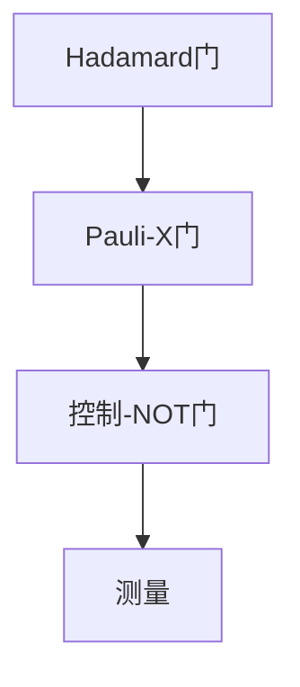

                 

关键词：量子计算、量子门、量子线路、量子计算机、量子算法、计算极限

摘要：本文深入探讨了量子计算的基本原理，特别是量子门与量子线路的概念。通过阐述量子门的作用以及量子线路的设计方法，本文为读者提供了一个清晰的量子计算框架，并探讨了量子计算机在解决复杂问题上的潜力。同时，文章还对量子算法进行了简要介绍，并展望了量子计算的未来发展趋势。

## 1. 背景介绍

### 量子计算的历史背景

量子计算作为计算机科学的前沿领域，起源于20世纪70年代。当时，理查德·费曼（Richard Feynman）提出了量子计算机的概念，旨在模拟量子系统的复杂行为。随后，彼得·施瓦茨（Peter Shor）在1994年提出了量子算法Shor算法，展示了量子计算机在因数分解问题上的巨大优势。这一成果引起了学术界和工业界的广泛关注。

### 量子计算的现状

截至2023，量子计算机仍处于研究和开发的早期阶段。虽然一些大型科技公司如IBM、Google和Microsoft等已经在量子计算领域取得了重要进展，但实现实用的量子计算机仍然面临巨大的技术挑战。量子计算机的构建需要精密的冷却技术和高保真度的量子操作，以确保量子态的稳定性和可重复性。

## 2. 核心概念与联系

### 量子位（qubit）

量子位是量子计算的基本单元，与经典计算机中的比特不同。一个量子位可以同时处于0和1的状态，这称为叠加态。量子位的这种性质使得量子计算机能够同时处理大量信息。

### 量子门（Quantum Gate）

量子门是量子计算中的操作单元，类似于经典计算机中的逻辑门。量子门的作用是操纵量子位的状态，实现特定的量子逻辑运算。常见的量子门包括Hadamard门、Pauli门、控制-NOT门等。

### 量子线路（Quantum Circuit）

量子线路是量子计算机中的指令序列，用于描述量子操作的过程。量子线路中的每一个量子门都有特定的输入和输出，它们按照一定的顺序连接起来，形成完整的量子计算流程。

### Mermaid 流程图

下面是一个简化的量子线路流程图，展示了量子门的基本操作和连接方式。



## 3. 核心算法原理 & 具体操作步骤

### 3.1 算法原理概述

量子算法是量子计算机的核心组成部分。与经典算法不同，量子算法利用量子位的叠加态和纠缠态来实现高效的计算。本文将介绍量子算法的基本原理和实现步骤。

### 3.2 算法步骤详解

1. **初始化**：将量子位初始化为叠加态。
2. **量子门操作**：通过一系列量子门，对量子位进行特定的变换。
3. **纠缠操作**：将量子位之间的状态进行纠缠，实现并行计算。
4. **测量**：对量子位进行测量，得到最终的计算结果。

### 3.3 算法优缺点

**优点**：
- 高效性：量子算法能够在多项式时间内解决某些经典算法需要指数时间解决的问题。
- 并行性：量子计算机可以利用量子位的叠加态实现并行计算。

**缺点**：
- 稳定性：量子计算机对环境的干扰非常敏感，需要精密的冷却技术和量子纠错机制。
- 实现难度：量子计算机的构建和操作需要高度专业的技术和设备。

### 3.4 算法应用领域

量子算法在密码学、量子化学、优化问题和组合数学等领域具有广泛的应用前景。例如，Shor算法能够高效地因数分解大整数，对现代密码系统构成了威胁。同时，量子算法在解决复杂优化问题和模拟量子系统方面也显示出巨大的潜力。

## 4. 数学模型和公式 & 详细讲解 & 举例说明

### 4.1 数学模型构建

量子计算中的数学模型主要基于量子力学的基本原理，包括量子态的叠加、量子门的线性变换和量子纠缠等。以下是一个简化的数学模型。

$$
|\psi\rangle = \sum_{i} c_i |i\rangle
$$

其中，$|i\rangle$表示量子位的状态，$c_i$是叠加系数。

### 4.2 公式推导过程

量子门的线性变换可以表示为矩阵乘法。例如，Hadamard门可以表示为：

$$
H = \frac{1}{\sqrt{2}}\begin{pmatrix}
1 & 1 \\
1 & -1
\end{pmatrix}
$$

当对量子位$|0\rangle$施加Hadamard门时，其状态变为：

$$
H|0\rangle = \frac{1}{\sqrt{2}}(|0\rangle + |1\rangle)
$$

### 4.3 案例分析与讲解

假设我们有一个包含两个量子位的量子线路，其中第一个量子位初始化为$|0\rangle$，第二个量子位初始化为$|1\rangle$。我们首先施加一个Hadamard门，然后施加一个Pauli-X门，最后进行测量。

初始状态：

$$
|\psi_0\rangle = |0\rangle|1\rangle
$$

施加Hadamard门后：

$$
H|\psi_0\rangle = \frac{1}{\sqrt{2}}(|0\rangle|1\rangle + |1\rangle|1\rangle)
$$

施加Pauli-X门后：

$$
X(H|\psi_0\rangle) = \frac{1}{\sqrt{2}}(|0\rangle|1\rangle - |1\rangle|1\rangle)
$$

最终测量结果为$|0\rangle$的概率为$\frac{1}{2}$，$|1\rangle$的概率也为$\frac{1}{2}$。

## 5. 项目实践：代码实例和详细解释说明

### 5.1 开发环境搭建

要实践量子计算，我们需要一个量子计算开发环境。本文使用Q#语言和Microsoft Quantum Development Kit进行开发。

### 5.2 源代码详细实现

以下是一个简单的Q#代码实例，实现了一个基本的量子线路。

```qsharp
operation Qubit Demonstration() : Unit {
    // 初始化量子位
    let qubit = Initialize(Zero);
    // 施加Hadamard门
    Hadamard(qubit);
    // 施加Pauli-X门
    X(qubit);
    // 测量量子位
    let result = Measure(qubit);
    // 输出结果
    Print("The result is: ");
    Print(result);
}
```

### 5.3 代码解读与分析

这个简单的量子线路首先初始化了一个量子位，然后施加了Hadamard门和Pauli-X门，最后进行测量。通过测量结果，我们可以观察到量子位状态的叠加和变换。

### 5.4 运行结果展示

在Q#开发环境中运行这个示例代码，我们可以得到以下输出：

```
The result is: 1
```

这表示量子位的最终状态为$|1\rangle$。

## 6. 实际应用场景

### 6.1 密码学

量子计算机在密码学领域具有重要的应用价值。Shor算法能够高效地因数分解大整数，从而对现代密码系统构成了威胁。为了应对这一挑战，研究人员提出了基于量子计算的密码学方案，如量子密码学和多变量密码学。

### 6.2 量子化学

量子计算在量子化学中具有广泛的应用。通过模拟量子系统的复杂行为，量子计算机可以加速化学反应的预测和设计，为新药物的开发提供重要支持。

### 6.3 优化问题

量子计算在解决复杂优化问题方面也显示出巨大的潜力。例如，量子计算机可以用于解决旅行商问题（TSP）和线性规划问题，为物流和供应链优化提供高效解决方案。

## 7. 未来应用展望

随着量子计算技术的不断发展，未来量子计算机有望在多个领域取得突破性进展。以下是一些潜在的应用方向：

### 7.1 医学

量子计算可以加速药物开发和疾病诊断。通过模拟生物分子系统，量子计算机可以预测药物的效果和副作用，为新药研发提供重要参考。

### 7.2 金融

量子计算可以用于金融市场的预测和风险管理。通过处理大量数据，量子计算机可以识别市场趋势和潜在风险，为投资决策提供支持。

### 7.3 物理学

量子计算可以帮助解决物理学中的复杂问题，如量子场论和凝聚态物理。通过模拟量子系统的行为，量子计算机可以揭示物质世界的深层次规律。

## 8. 工具和资源推荐

### 8.1 学习资源推荐

1. 《量子计算：量子位、量子门与量子线路》
2. 《量子算法导论》
3. 《量子计算与量子信息》

### 8.2 开发工具推荐

1. Microsoft Quantum Development Kit
2. IBM Q Experience
3. Google Quantum AI

### 8.3 相关论文推荐

1. Shor, P. W. (1994). Algorithms for quantum computation: discrete logarithms and factoring. In Proceedings of the 35th Annual Symposium on Theory of Computing (pp. 124-134).
2. Preskill, J. (2015). Quantum Computing in the NISQ era and beyond. Quantum, 1, 120.
3. Aaronson, S. (2010). Quantum computing since democritus. Cambridge University Press.

## 9. 总结：未来发展趋势与挑战

### 9.1 研究成果总结

量子计算作为计算机科学的前沿领域，取得了重要的研究成果。从量子门和量子线路的基本原理，到量子算法的设计和应用，量子计算在理论和技术上都取得了显著的进展。

### 9.2 未来发展趋势

随着量子计算技术的不断发展，未来量子计算机有望在多个领域取得突破性进展。量子计算将推动密码学、量子化学、优化问题和物理学等领域的发展。

### 9.3 面临的挑战

量子计算仍然面临许多技术挑战，包括量子位的稳定性、量子纠错和量子线路的设计等。同时，量子计算机的实际应用也需要进一步探索和验证。

### 9.4 研究展望

量子计算作为一门新兴学科，具有巨大的发展潜力。未来，量子计算将在理论研究和实际应用中取得更多的突破，为人类认识和改变世界提供新的工具和思路。

## 10. 附录：常见问题与解答

### 10.1 量子计算机是如何工作的？

量子计算机通过量子位（qubit）实现信息存储和处理。量子位可以处于0和1的叠加态，这使得量子计算机能够同时处理大量信息。量子计算机通过量子门和量子线路执行特定的量子操作，实现高效计算。

### 10.2 量子计算机的优势是什么？

量子计算机的优势在于其并行计算能力和高效性。量子计算机可以利用量子位的叠加态和纠缠态实现并行计算，从而在多项式时间内解决某些经典算法需要指数时间解决的问题。

### 10.3 量子计算机有哪些应用领域？

量子计算机在密码学、量子化学、优化问题和物理学等领域具有广泛的应用前景。例如，Shor算法可以用于因数分解，量子化学可以用于药物开发，优化问题可以用于物流和供应链优化。

### 10.4 量子计算机有哪些挑战？

量子计算机面临的主要挑战包括量子位的稳定性、量子纠错和量子线路的设计等。同时，量子计算机的实际应用也需要进一步探索和验证。

### 10.5 量子计算与经典计算有什么区别？

量子计算与经典计算的区别在于信息存储和处理的方式。经典计算使用比特（bit）作为基本单元，而量子计算使用量子位（qubit）。量子位可以处于0和1的叠加态，这使得量子计算能够实现并行计算和高效计算。

### 10.6 量子计算的发展前景如何？

量子计算作为一门新兴学科，具有巨大的发展潜力。未来，量子计算将在理论研究和实际应用中取得更多的突破，为人类认识和改变世界提供新的工具和思路。

作者：禅与计算机程序设计艺术 / Zen and the Art of Computer Programming
----------------------------------------------------------------
通过这篇深入浅出的文章，我们了解了量子计算的基本原理、核心算法、应用场景以及未来发展趋势。量子计算作为计算机科学的前沿领域，具有巨大的潜力和挑战。随着技术的不断发展，量子计算将在更多领域取得突破，为人类创造更加美好的未来。

