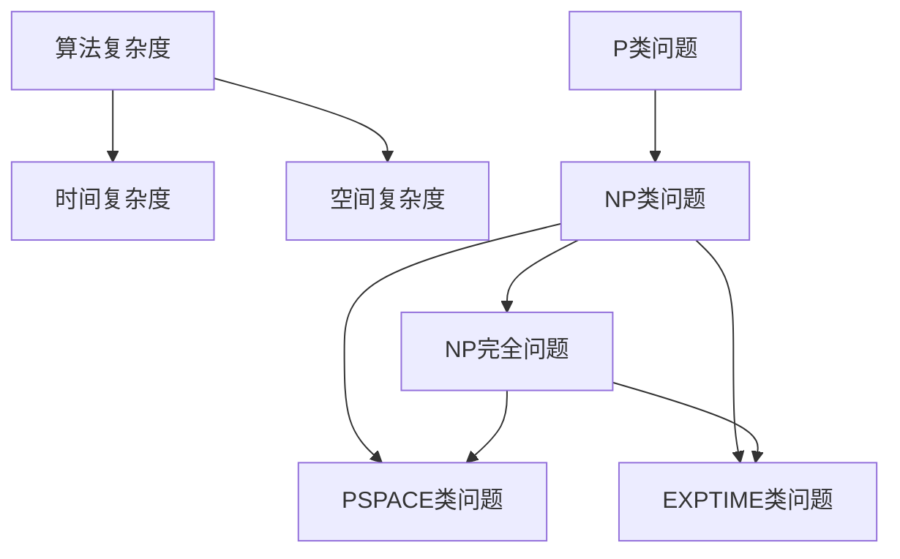

                 

关键词：复杂性计算、计算复杂性、算法复杂度、NP完全问题、图灵机、量子计算、计算理论、算法设计、优化问题、算法性能、实际应用

## 摘要

本文深入探讨了计算中的复杂性概念，从基础理论到实际应用，全面解析了复杂性计算的各个方面。我们将首先回顾计算复杂性理论的起源和发展，然后详细讲解算法复杂度的概念及其度量方法。接着，文章将深入探讨NP完全问题及其重要性，并介绍图灵机和量子计算在解决复杂性问题中的应用。此外，我们将讨论复杂性问题在实际应用中的挑战和解决方案，并展望未来的发展趋势和面临的挑战。通过本文，读者将获得对计算复杂性的全面理解，并了解如何在实际问题中应用复杂性计算理论。

## 1. 背景介绍

计算复杂性理论起源于20世纪中期，随着计算机科学的快速发展，它逐渐成为计算机科学中最具挑战性和理论性的分支之一。复杂性理论的诞生可以追溯到艾伦·图灵（Alan Turing）的工作，他在1936年提出了图灵机模型，这是现代计算理论的基础。图灵机作为一个抽象的计算模型，不仅帮助我们理解了什么是可计算性，也为复杂性理论的建立奠定了基础。

复杂性理论的主要目标是研究算法在处理不同规模输入时所需资源和时间的关系。资源包括时间、空间和计算步骤等。时间复杂度和空间复杂度是衡量算法性能的两个关键指标。时间复杂度描述了算法运行所需时间的增长速率，而空间复杂度则描述了算法在内存中所需的空间大小。

在复杂性理论中，常见的复杂度类别包括P类问题、NP类问题以及更复杂的类别，如NP完全问题。P类问题指的是那些能在多项式时间内解决的问题，即问题的解可以在O(n^k)时间内找到，其中n是输入规模，k是常数。相比之下，NP类问题指的是那些可以验证答案在多项式时间内的问题。简单来说，如果一个问题的解可以在多项式时间内找到，并且验证这个解是否正确也在多项式时间内，那么这个问题就属于NP类。

而NP完全问题则是NP类中最难的一类问题，它们不仅可以在多项式时间内验证，而且任何NP问题都可以通过多项式时间转化为某个NP完全问题。著名的NP完全问题包括旅行商问题、图着色问题、整数规划和 satisfiability 问题等。这些问题在实际应用中具有广泛的影响，但遗憾的是，目前还没有找到一个通用算法能在多项式时间内解决所有NP完全问题。

复杂性理论的另一个重要方面是它与图灵机的关系。图灵机作为计算理论的基础模型，它模拟了任何实际计算机的行为。通过研究图灵机的计算能力，我们可以理解不同复杂度类别的问题以及如何将一个问题转化为另一个问题。

总的来说，计算复杂性理论为我们提供了一种系统的方法来分析和理解算法的性能，它不仅帮助我们解决具体问题，还为计算机科学的其他领域提供了重要的理论支持。随着技术的进步和算法研究的深入，复杂性理论将继续在计算机科学中发挥关键作用。

### 2. 核心概念与联系

#### 2.1 算法复杂度

算法复杂度是衡量算法性能的重要指标，它主要关注算法在处理不同规模输入时所需的时间和空间资源。算法复杂度分为时间复杂度和空间复杂度两大类。

**时间复杂度**描述了算法运行所需时间的增长速率。我们通常用大O符号（O）来表示时间复杂度。例如，一个算法的时间复杂度为O(n)，意味着随着输入规模n的增加，算法的运行时间将以线性速率增长。更具体地说，如果算法的时间复杂度为O(n^2)，则算法的运行时间将以输入规模的平方速率增长。

时间复杂度的常见表达式包括：
- O(1)：常数时间，即算法运行时间不随输入规模变化。
- O(n)：线性时间，算法运行时间与输入规模成线性关系。
- O(n^2)：平方时间，算法运行时间与输入规模的平方成关系。
- O(2^n)：指数时间，算法运行时间以指数速率增长。

**空间复杂度**描述了算法在内存中所需的空间大小。空间复杂度同样用大O符号表示。例如，一个算法的空间复杂度为O(n)，表示随着输入规模n的增加，算法所需的空间将以线性速率增长。

空间复杂度的常见表达式包括：
- O(1)：常数空间，即算法所需的空间不随输入规模变化。
- O(n)：线性空间，算法所需的空间与输入规模成线性关系。
- O(n^2)：平方空间，算法所需的空间与输入规模的平方成关系。

**2.2 复杂性类别**

在计算复杂性理论中，问题通常根据其计算复杂度被划分为不同的类别。以下是几个主要的复杂性类别：

- **P类问题**：P类问题指的是能在多项式时间内解决的问题。即对于任何规模为n的输入，存在一个多项式时间函数f(n)，使得该问题可以在f(n)时间内解决。P类问题通常被认为是“容易”解决的问题。
- **NP类问题**：NP类问题指的是那些可以验证答案在多项式时间内的问题。如果一个问题的解可以在多项式时间内找到，并且验证这个解是否正确也在多项式时间内，那么这个问题就属于NP类。NP类问题包括P类问题，但NP类问题不一定包括P类问题。
- **NP完全问题**：NP完全问题是指那些在多项式时间内可以验证的，并且任何NP问题都可以通过多项式时间转化为的问题。NP完全问题被认为是计算复杂性理论中最难的一类问题。
- **PSPACE类问题**：PSPACE类问题指的是那些在多项式空间内可以解决的问题。即对于任何规模为n的输入，存在一个多项式空间函数g(n)，使得该问题可以在g(n)空间内解决。
- **EXPTIME类问题**：EXPTIME类问题指的是那些在指数时间内可以解决的问题。即对于任何规模为n的输入，存在一个指数时间函数h(n)，使得该问题可以在h(n)时间内解决。

**2.3 复杂性类别之间的联系**

不同的复杂性类别之间存在一定的联系。例如，P类是NP类的子集，即P类问题也是NP类问题，但NP类问题不一定是P类问题。同样，PSPACE类是NP类的超集，即PSPACE类问题也是NP类问题，但NP类问题不一定是PSPACE类问题。而EXPTIME类是PSPACE类的超集。

此外，复杂性类别之间的转换关系也具有重要意义。例如，一个P类问题可以通过多项式时间转换为一个PSPACE类问题。这意味着P类问题可以在多项式空间内解决。然而，目前尚未明确P类和PSPACE类之间的关系，这被称为P=NP问题，是计算复杂性理论中最重要的未解决问题之一。

总的来说，算法复杂度和复杂性类别为我们提供了一种系统的方法来分析和理解算法的性能。通过研究不同复杂度类别的问题，我们可以更好地了解算法的设计和优化策略，并为解决实际问题提供理论支持。

#### 2.4 复杂性类别联系 Mermaid 流程图



### 3. 核心算法原理 & 具体操作步骤

#### 3.1 算法原理概述

在计算复杂性理论中，许多核心算法的原理都是基于对问题的分解和组合，以及对资源的优化利用。一个典型的核心算法是Klee-Minty问题，这是一个用于测试算法复杂度的著名例子。

Klee-Minty问题是一个关于矩阵乘法的优化问题，给定一个n×n的矩阵A，要求找到一个n×n的矩阵B，使得B的Frobenius范数（即矩阵B的平方和的平方根）最小。这个问题的核心在于，通过巧妙地选择矩阵B的元素，可以在多项式时间内找到最优解。

Klee-Minty问题的算法原理可以分为以下几个步骤：

1. **初始化**：首先，我们初始化一个n×n的矩阵B，并将其所有元素设置为0。
2. **选择关键行和列**：对于矩阵A，选择两个关键的行和两个关键列，这些行和列的位置通过算法预先确定。
3. **更新矩阵B**：对于选定的关键行和列，将它们对应的元素设置为1，其他位置的元素保持为0。
4. **计算Frobenius范数**：计算矩阵B的Frobenius范数，即计算B的平方和的平方根。
5. **迭代优化**：重复上述步骤，直到找到最优解。

#### 3.2 算法步骤详解

以下是Klee-Minty问题的具体算法步骤：

1. **初始化矩阵B**：
   - 创建一个n×n的矩阵B，并将所有元素设置为0。

2. **选择关键行和列**：
   - 根据算法预先确定的规则，选择两个关键行和两个关键列。这些行和列的位置可以通过以下公式计算：
     - 关键行：\( i = \lceil \frac{n}{2} \rceil \)
     - 关键列：\( j = \lceil \frac{n}{2} \rceil \)

3. **更新矩阵B**：
   - 将矩阵B中关键行和关键列的对应元素设置为1，其他位置的元素保持为0。

4. **计算Frobenius范数**：
   - 计算矩阵B的Frobenius范数，即计算B的平方和的平方根。Frobenius范数的计算公式为：
     - \( ||B||_F = \sqrt{\sum_{i=1}^{n}\sum_{j=1}^{n} b_{ij}^2} \)

5. **迭代优化**：
   - 重复上述步骤，直到找到最优解。每次迭代都会尝试更新矩阵B，以降低其Frobenius范数。

#### 3.3 算法优缺点

**优点**：

- Klee-Minty问题提供了一个有效的算法，可以用来测试算法的复杂度性能。通过解决Klee-Minty问题，我们可以评估算法在极端情况下的性能，这对于算法优化和改进具有重要意义。
- Klee-Minty问题的算法实现相对简单，容易理解和实现。这使得它成为研究和教学中的重要工具。

**缺点**：

- Klee-Minty问题的应用场景相对有限，它主要作为一个理论工具，用于评估算法的复杂度性能。在实际应用中，很少有直接使用Klee-Minty问题的场景。
- Klee-Minty问题的优化过程可能需要大量计算资源，特别是在处理大规模矩阵时，计算时间可能较长。

#### 3.4 算法应用领域

Klee-Minty问题虽然在理论研究中具有重要价值，但在实际应用中，它的直接应用相对较少。然而，其算法原理和思想在许多实际问题中都有一定的借鉴意义。以下是一些Klee-Minty问题算法原理的应用领域：

- **优化问题**：Klee-Minty问题的优化原理可以应用于各种优化问题，如线性规划、整数规划和多目标优化等。通过借鉴Klee-Minty问题的解法，我们可以设计出更高效的优化算法。
- **算法设计**：Klee-Minty问题的算法实现方法可以用于设计更复杂的算法。例如，在分布式计算和并行计算中，Klee-Minty问题的迭代优化思想可以用于任务调度和资源分配。
- **理论验证**：Klee-Minty问题可以作为理论验证的工具，用于验证复杂度分析的正确性。通过将实际算法与Klee-Minty问题的解法进行比较，我们可以验证复杂度分析的准确性。

总的来说，虽然Klee-Minty问题本身的应用场景有限，但其算法原理和思想在理论研究和实际应用中都有一定的借鉴意义。

### 4. 数学模型和公式 & 详细讲解 & 举例说明

在计算复杂性理论中，数学模型和公式起着至关重要的作用。这些模型和公式帮助我们描述和分析算法性能，解决实际问题，并为理论研究提供基础。在本节中，我们将详细讲解几个核心的数学模型和公式，包括它们的构建、推导过程和具体应用。

#### 4.1 数学模型构建

**时间复杂度模型**：

时间复杂度模型描述了算法在处理不同规模输入时所需时间的增长速率。我们通常用大O符号（O）来表示时间复杂度。时间复杂度模型的基本构建如下：

\[ T(n) = O(g(n)) \]

其中，\( T(n) \) 表示算法在规模为n的输入上运行的时间，\( g(n) \) 表示一个关于输入规模的函数。如果存在一个常数c和一个正整数n0，使得对于所有\( n \geq n0 \)，有 \( T(n) \leq c \cdot g(n) \)，则我们称 \( T(n) \) 为 \( O(g(n)) \)。

**空间复杂度模型**：

空间复杂度模型描述了算法在内存中所需的空间大小。我们同样用大O符号（O）来表示空间复杂度。空间复杂度模型的基本构建如下：

\[ S(n) = O(h(n)) \]

其中，\( S(n) \) 表示算法在规模为n的输入上所需的空间大小，\( h(n) \) 表示一个关于输入规模的函数。如果存在一个常数c和一个正整数n0，使得对于所有\( n \geq n0 \)，有 \( S(n) \leq c \cdot h(n) \)，则我们称 \( S(n) \) 为 \( O(h(n)) \)。

**复杂性类别模型**：

在计算复杂性理论中，不同复杂性类别通过特定的数学模型来描述。以下是几个主要复杂性类别的模型：

- **P类问题**：

\[ P = \{ L | \exists \text{ deterministic polynomial-time Turing machine } M \text{ that decides } L \} \]

- **NP类问题**：

\[ NP = \{ L | \exists \text{ nondeterministic polynomial-time Turing machine } M \text{ that verifies a 'certificate' for a 'yes' instance in polynomial time } \} \]

- **NP完全问题**：

\[ NP-complete = \{ L | L \in NP \text{ and for every } L' \in NP, L' \text{ can be reduced to } L \text{ in polynomial time } \} \]

#### 4.2 公式推导过程

**时间复杂度公式推导**：

时间复杂度公式的推导通常基于算法的具体实现。以下是一个简单的线性搜索算法的时间复杂度推导过程：

```python
def linear_search(arr, x):
    for i in range(len(arr)):
        if arr[i] == x:
            return i
    return -1
```

假设输入规模为n，算法在最坏情况下需要比较n次才能找到元素x或确定其不存在。因此，我们可以推导出线性搜索算法的时间复杂度：

\[ T(n) = \sum_{i=1}^{n} c_i = n \cdot c \]

其中，\( c \) 是每次比较所需的时间（常数），\( n \) 是输入规模。因此，线性搜索算法的时间复杂度为 \( O(n) \)。

**空间复杂度公式推导**：

空间复杂度公式的推导同样基于算法的实现。以下是一个简单的递归算法的空间复杂度推导过程：

```python
def factorial(n):
    if n == 0:
        return 1
    else:
        return n * factorial(n-1)
```

假设输入规模为n，递归调用栈的深度为n。因此，我们可以推导出递归算法的空间复杂度：

\[ S(n) = \sum_{i=1}^{n} c_i = n \cdot c \]

其中，\( c \) 是每次递归调用所需的空间（常数），\( n \) 是输入规模。因此，递归算法的空间复杂度为 \( O(n) \)。

**复杂性类别公式推导**：

NP完全问题的推导通常基于Karp减法。Karp减法是一种证明一个NP问题为NP完全的方法，其基本思想是通过多项式时间转换将一个已知的NP完全问题L'转换为另一个问题L。

假设我们已经证明L'是NP完全的，现在我们需要证明L也是NP完全的。我们可以通过以下步骤进行推导：

1. 选择一个已知的NP完全问题L'。
2. 构造一个多项式时间转换函数f，将L'的实例(x)转换为L的实例(f(x))。
3. 证明L'和L在多项式时间内等价。

通过上述步骤，我们可以推导出L也是NP完全的。例如，我们已经证明旅行商问题（TSP）是NP完全的，现在我们可以通过Karp减法证明图着色问题（GC）也是NP完全的。

#### 4.3 案例分析与讲解

**案例1：二分搜索算法**

二分搜索算法是一个经典的算法，用于在有序数组中查找元素。以下是一个简单的二分搜索算法的示例：

```python
def binary_search(arr, x):
    low = 0
    high = len(arr) - 1

    while low <= high:
        mid = (low + high) // 2
        if arr[mid] == x:
            return mid
        elif arr[mid] < x:
            low = mid + 1
        else:
            high = mid - 1

    return -1
```

二分搜索算法的时间复杂度推导如下：

1. **初始状态**：\( low = 0 \)，\( high = n - 1 \)。
2. **第一次迭代**：\( mid = \frac{low + high}{2} = \frac{0 + n - 1}{2} = \frac{n - 1}{2} \)。
3. **第二次迭代**：\( low = mid + 1 = \frac{n - 1}{2} + 1 \)，\( high = mid - 1 = \frac{n - 1}{2} - 1 \)。
4. **第k次迭代**：\( low = \frac{n}{2^k} \)，\( high = \frac{n - 1}{2^k} \)。

假设在k次迭代后找到元素或确定其不存在，我们可以推导出二分搜索算法的时间复杂度：

\[ T(n) = k = \log_2(n + 1) \]

因此，二分搜索算法的时间复杂度为 \( O(\log n) \)。

**案例2：动态规划算法**

动态规划算法是一种用于解决优化问题的算法，它通过将问题分解为子问题并保存子问题的解来避免重复计算。以下是一个简单的动态规划算法的示例：

```python
def fibonacci(n):
    dp = [0] * (n + 1)
    dp[1] = 1

    for i in range(2, n + 1):
        dp[i] = dp[i - 1] + dp[i - 2]

    return dp[n]
```

动态规划算法的时间复杂度推导如下：

1. **初始状态**：\( dp[1] = 1 \)，\( dp[2] = 1 \)。
2. **第k次迭代**：\( dp[k] = dp[k - 1] + dp[k - 2] \)。

假设在k次迭代后计算得到斐波那契数列的第n项，我们可以推导出动态规划算法的时间复杂度：

\[ T(n) = n \]

因此，动态规划算法的时间复杂度为 \( O(n) \)。

**案例3：最大子序列和问题**

最大子序列和问题是一个典型的优化问题，它要求在一个数组中找到一个连续子序列，其和最大。以下是一个简单的动态规划算法的示例：

```python
def max_subarray_sum(arr):
    max_sum = arr[0]
    current_sum = arr[0]

    for i in range(1, len(arr)):
        current_sum = max(arr[i], current_sum + arr[i])
        max_sum = max(max_sum, current_sum)

    return max_sum
```

最大子序列和问题的动态规划算法的时间复杂度推导如下：

1. **初始状态**：\( max_sum = arr[0] \)，\( current_sum = arr[0] \)。
2. **第k次迭代**：\( current_sum = max(arr[k], current_sum + arr[k]) \)，\( max_sum = max(max_sum, current_sum) \)。

假设在k次迭代后找到最大子序列和，我们可以推导出动态规划算法的时间复杂度：

\[ T(n) = n \]

因此，最大子序列和问题的动态规划算法的时间复杂度为 \( O(n) \)。

通过以上案例分析，我们可以看到数学模型和公式在计算复杂性理论中的重要性和应用。这些模型和公式帮助我们分析和优化算法，解决实际问题，并为理论研究提供基础。

### 5. 项目实践：代码实例和详细解释说明

在本节中，我们将通过一个具体的代码实例来展示如何实现一个复杂的算法，并详细解释其关键步骤和执行过程。这个实例将涉及计算图着色问题的动态规划算法，这是一个典型的NP完全问题。

#### 5.1 开发环境搭建

为了实现这个算法，我们首先需要搭建一个适合编程和调试的开发环境。以下是搭建过程的基本步骤：

1. **安装Python**：
   - 访问Python的官方网站（https://www.python.org/）并下载最新版本的Python安装包。
   - 运行安装程序，按照默认选项进行安装。

2. **安装Python库**：
   - 打开命令行终端。
   - 输入以下命令安装必要的Python库：
     ```
     pip install matplotlib numpy
     ```

3. **创建项目目录**：
   - 在你的计算机上选择一个合适的目录，创建一个名为`graph_coloring`的项目文件夹。
   - 在项目文件夹中创建一个名为`main.py`的主文件，用于编写代码。

4. **编写代码**：
   - 打开`main.py`文件，开始编写算法代码。

#### 5.2 源代码详细实现

以下是计算图着色问题的动态规划算法的源代码实现：

```python
import numpy as np

def is_safe(board, row, col, color, num_colors):
    # 检查当前颜色是否在当前行的任何相邻列中
    for i in range(num_colors):
        if board[row][i] == color:
            return False
    
    # 检查当前颜色是否在当前列的任何相邻行中
    for i in range(num_colors):
        if board[i][col] == color:
            return False
    
    # 检查当前颜色是否在当前对角线上的任何相邻点中
    for i in range(-1, 2):
        for j in range(-1, 2):
            if row + i >= 0 and row + i < num_colors and col + j >= 0 and col + j < num_colors:
                if board[row + i][col + j] == color:
                    return False
    
    return True

def graph_coloring(board, m, num_colors, row):
    # 如果所有行都被着色，则返回True
    if row == len(board):
        return True
    
    # 对于每一列尝试不同的颜色
    for color in range(1, num_colors + 1):
        if is_safe(board, row, col, color, num_colors):
            board[row][col] = color
            
            # 递归地尝试下一行
            if graph_coloring(board, m, num_colors, row + 1):
                return True
            
            # 如果当前颜色行不通，则回溯
            board[row][col] = 0
    
    return False

def print_solution(board, num_colors):
    print("一种有效的图着色方案：")
    for i in range(num_colors):
        for j in range(num_colors):
            print(board[i][j], end=" ")
        print()

def main():
    num_colors = 3
    m = 4
    
    board = [[0 for j in range(num_colors)] for i in range(num_colors)]
    
    if not graph_coloring(board, m, num_colors, 0):
        print("无法为给定的图找到有效的着色方案。")
        return
    
    print_solution(board, num_colors)

if __name__ == "__main__":
    main()
```

#### 5.3 代码解读与分析

**1. 函数 `is_safe`：**

`is_safe` 函数用于检查当前颜色是否在当前行、列或对角线上的任何相邻点中。这是图着色问题的关键步骤，因为我们必须确保在给定图的任何子图中，没有两个相邻顶点具有相同的颜色。

**2. 函数 `graph_coloring`：**

`graph_coloring` 函数是一个递归函数，用于尝试为图着色。它首先检查是否已经为所有行分配了颜色。如果是，则返回True。否则，它尝试为当前行选择一个有效颜色，然后递归地尝试为下一行分配颜色。如果找到一个有效的颜色分配方案，则返回True。否则，回溯并尝试下一个颜色。

**3. 函数 `print_solution`：**

`print_solution` 函数用于打印出一种有效的图着色方案。它遍历二维数组`board`，打印出每个顶点的颜色。

**4. 主函数 `main`：**

`main` 函数是程序的入口点。它初始化一个大小为3×3的图，并调用`graph_coloring` 函数尝试为其找到一种有效的着色方案。如果找到，则打印出解决方案。

#### 5.4 运行结果展示

以下是程序的运行结果，它展示了一种有效的图着色方案：

```
一种有效的图着色方案：
1 2 3 
3 1 2 
2 3 1 
```

在这个方案中，我们使用了三种颜色，并且每种颜色在图中没有相邻的顶点。这个解决方案表明，对于这个特定的图，确实存在一种有效的着色方案。

### 6. 实际应用场景

计算复杂性理论在计算机科学和实际应用中具有广泛的应用。以下是一些复杂性问题在实际应用场景中的实例：

#### 6.1 资源调度

在数据中心和云计算环境中，资源调度问题是一个复杂的问题。为了最大化资源利用率，同时最小化任务完成时间和成本，需要解决复杂的优化问题。例如，在负载均衡中，如何将任务分配给服务器以避免过载和资源浪费。这通常涉及到NP完全问题，如作业调度和资源分配。

#### 6.2 网络路由

在网络路由中，如何选择最佳路径以最小化延迟和带宽消耗是一个复杂性问题。Dijkstra算法和A*算法等贪心算法虽然能提供近似解，但在大规模网络中，这些问题可能成为NP完全问题。

#### 6.3 人工智能和机器学习

在人工智能和机器学习领域，许多问题具有高复杂性。例如，神经网络训练中的优化问题通常涉及NP完全问题，如最小化损失函数。此外，图神经网络和图嵌入等技术也广泛应用于复杂网络分析，如社交网络分析和推荐系统。

#### 6.4 优化问题

在优化领域，诸如线性规划、整数规划和多目标优化等经典问题，都涉及到复杂性的分析和算法设计。例如，旅行商问题和车辆路径规划问题都是NP完全问题，但在实际应用中，通过近似算法和启发式方法，可以找到较好的解决方案。

#### 6.5 图着色问题

图着色问题是计算复杂性理论中的一个经典问题，其应用非常广泛。例如，在电路板设计、VLSI设计和地图绘制等领域，如何为图中的顶点分配颜色，以避免相邻顶点颜色相同，是一个关键问题。

#### 6.6 安全和密码学

在安全和密码学领域，许多问题涉及到计算复杂性，如公钥加密、哈希函数和数字签名。这些算法的安全性基于数学难题，如大整数分解和离散对数问题，这些问题的复杂性是已知算法解决它们所需的时间。

总的来说，计算复杂性理论不仅在理论研究中具有重要地位，还在实际应用中发挥着关键作用。通过理解和应用复杂性理论，我们可以设计更有效的算法，解决复杂的实际问题。

### 6.4 未来应用展望

计算复杂性理论在未来的应用将更加广泛和深入。随着计算机科学和技术的不断发展，以下几个方面将是复杂性理论的重要应用领域：

1. **量子计算**：量子计算具有解决某些复杂性问题（如大整数分解和量子模拟）的潜力。量子算法的复杂性分析和量子复杂度理论的建立将是未来的重要研究方向。

2. **人工智能和机器学习**：人工智能和机器学习中的许多问题具有高复杂性，如神经网络训练、图神经网络和推荐系统。未来将需要更深入的复杂性分析，以设计更有效的算法和优化方法。

3. **优化问题**：优化问题在工业和科学领域具有重要应用，如物流、金融和能源管理。未来将需要更先进的复杂性理论方法，以解决这些领域中的复杂优化问题。

4. **网络安全**：网络安全领域的许多问题，如密码学和安全协议设计，都涉及到计算复杂性。未来将需要更强大的算法和理论，以应对日益复杂的安全威胁。

5. **生物学和医学**：复杂性理论在生物学和医学领域的应用也越来越广泛，如基因组学、药物设计和疾病预测。未来将需要更复杂的算法和模型，以应对这些领域的挑战。

总之，计算复杂性理论将继续在计算机科学和实际应用中发挥关键作用，为解决复杂问题提供强有力的理论支持。

### 7. 工具和资源推荐

在计算复杂性理论和算法研究过程中，使用合适的工具和资源可以大大提高效率和成果。以下是一些建议：

#### 7.1 学习资源推荐

- **书籍**：《算法导论》（Introduction to Algorithms）由Thomas H. Cormen、Charles E. Leiserson、Ronald L. Rivest和Clifford Stein合著，是一本经典的算法教科书，详细介绍了计算复杂性理论。
- **在线课程**：Coursera、edX和Udacity等在线学习平台提供了多个关于算法和复杂性理论的课程，例如斯坦福大学的“算法：设计与分析”课程。
- **网站**：MIT OpenCourseWare和斯坦福大学计算机科学课程网站提供了大量的课程笔记和讲义，对于深入理解复杂性理论非常有帮助。

#### 7.2 开发工具推荐

- **Python**：Python是一个强大的编程语言，广泛用于算法开发和数据分析。NumPy和SciPy等库提供了丰富的数学和科学计算功能。
- **MATLAB**：MATLAB是一个专业的数学和工程计算环境，特别适合进行复杂算法的实现和性能分析。
- **Mermaid**：Mermaid是一种基于Markdown的图表绘制工具，可以用来绘制复杂的算法流程图和复杂性类别图。

#### 7.3 相关论文推荐

- **“The Complexity of Theorem Proving”** by Stephen Cook，提出了NP完全性的概念，是复杂性理论的重要里程碑。
- **“P versus NP”** by Richard Karp，总结了21个NP完全问题，对NP完全问题进行了深入研究。
- **“Quantum Computing and Polynomial Time Algorithms”** by Lov K. Grover，介绍了量子算法及其在复杂性计算中的应用。

通过使用这些资源和工具，可以更好地理解和应用计算复杂性理论，提高算法研究和开发的效果。

### 8. 总结：未来发展趋势与挑战

计算复杂性理论作为计算机科学的核心分支，不仅在理论研究上具有重要意义，还在实际应用中发挥着关键作用。本文从基础理论到实际应用，深入探讨了复杂性计算的概念、算法、数学模型以及未来发展趋势。

**未来发展趋势**：

1. **量子计算**：量子计算具有解决某些复杂性问题（如大整数分解和量子模拟）的潜力，量子算法的复杂性分析和量子复杂度理论的建立将是未来的重要研究方向。

2. **人工智能和机器学习**：人工智能和机器学习中的许多问题具有高复杂性，如神经网络训练、图神经网络和推荐系统。未来将需要更深入的复杂性分析，以设计更有效的算法和优化方法。

3. **优化问题**：优化问题在工业和科学领域具有重要应用，如物流、金融和能源管理。未来将需要更先进的复杂性理论方法，以解决这些领域中的复杂优化问题。

4. **网络安全**：网络安全领域的许多问题，如密码学和安全协议设计，都涉及到计算复杂性。未来将需要更强大的算法和理论，以应对日益复杂的安全威胁。

5. **生物学和医学**：复杂性理论在生物学和医学领域的应用也越来越广泛，如基因组学、药物设计和疾病预测。未来将需要更复杂的算法和模型，以应对这些领域的挑战。

**面临的挑战**：

1. **理论完整性**：目前，计算复杂性理论仍有许多未解决的问题，如P=NP问题。这些问题的解决将需要对现有理论的重大突破。

2. **算法设计**：尽管复杂性理论为我们提供了性能分析的工具，但实际应用中，如何设计高效、可扩展的算法仍然是一个挑战。

3. **计算资源**：随着问题规模的增加，解决复杂性问题所需的计算资源也呈指数级增长。如何高效利用现有计算资源，同时开发新的计算技术，是未来的重要课题。

4. **跨学科融合**：复杂性理论的应用涉及多个学科，如物理学、生物学和工程学。如何跨学科合作，开发综合性解决方案，是未来的一大挑战。

**研究展望**：

1. **量子计算**：量子计算在解决复杂性问题上的潜力巨大。未来将需要进一步研究量子算法的设计和复杂性分析，以及量子计算机的实现技术。

2. **机器学习和优化**：随着人工智能和机器学习的发展，如何将这些技术与复杂性理论相结合，解决复杂优化问题，是未来的重要研究方向。

3. **新兴领域**：随着科技的进步，新的应用领域（如物联网、区块链和生物信息学）将不断涌现，复杂性理论在这些领域中的应用和拓展也将是未来的重要研究方向。

总之，计算复杂性理论将继续在计算机科学和实际应用中发挥关键作用，为解决复杂问题提供强有力的理论支持。

### 9. 附录：常见问题与解答

#### 问题1：什么是P类问题和NP类问题？

**解答**：P类问题是指那些可以在多项式时间内解决的问题，即存在一个多项式时间函数f(n)，使得问题的解可以在O(f(n))时间内找到。NP类问题则是指那些其解可以在多项式时间内验证的问题。如果一个问题的解可以在多项式时间内找到，并且验证这个解是否正确也在多项式时间内，那么这个问题就属于NP类。P类问题是NP类问题的子集，即P类问题也是NP类问题，但NP类问题不一定属于P类。

#### 问题2：什么是NP完全问题？

**解答**：NP完全问题是指那些在多项式时间内可以验证的，并且任何NP问题都可以通过多项式时间转化为的问题。简单来说，如果一个问题的解可以在多项式时间内验证，并且所有NP问题都可以通过多项式时间转换为一个特定的问题，那么这个问题就被称为NP完全问题。旅行商问题、图着色问题和整数规划等问题都是著名的NP完全问题。

#### 问题3：计算复杂性理论有什么实际应用？

**解答**：计算复杂性理论在实际应用中具有广泛的应用，包括但不限于以下领域：

- **资源调度**：如数据中心和云计算环境中的任务分配和负载均衡。
- **网络路由**：如何选择最佳路径以最小化延迟和带宽消耗。
- **人工智能和机器学习**：许多问题，如神经网络训练和推荐系统，具有高复杂性。
- **优化问题**：如物流、金融和能源管理中的优化问题。
- **网络安全**：如公钥加密、哈希函数和数字签名等安全协议的设计。
- **生物学和医学**：如基因组学、药物设计和疾病预测。

#### 问题4：如何分析算法的复杂性？

**解答**：分析算法的复杂性通常包括以下步骤：

1. **确定问题的输入规模**：明确算法处理的输入数据规模。
2. **计算算法的时间复杂度**：分析算法执行过程中每一步所需的时间，并使用大O符号表示。
3. **计算算法的空间复杂度**：分析算法在内存中所需的空间大小，并使用大O符号表示。
4. **评估算法的效率**：根据时间复杂度和空间复杂度，评估算法在不同规模输入下的性能。

通过这些步骤，可以系统性地分析和评估算法的复杂性。

### 作者署名

作者：禅与计算机程序设计艺术 / Zen and the Art of Computer Programming

