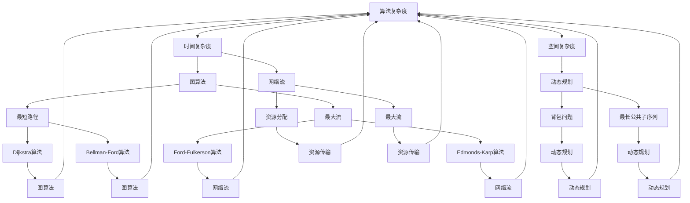

                 

### 背景介绍 Background Introduction

计算一直是信息技术领域的重要研究方向。从计算机的诞生至今，计算领域经历了从简单的逻辑运算到复杂的并行计算，从经典的算法理论到现代的人工智能技术，计算能力的提升推动了信息技术的发展。然而，随着计算问题的复杂度不断增加，如何高效地解决这些复杂问题成为了一个重要的研究课题。

在本章中，我们将探讨复杂性计算中的简单算法。简单算法，顾名思义，指的是解决复杂问题的一种简单有效的方法。虽然简单，但这些算法在许多实际应用中却表现出强大的计算能力。例如，图算法、网络流算法、动态规划算法等，都是简单算法的典范。

复杂性计算是计算机科学中的重要分支，它研究的是如何评估和解决各种复杂计算问题。复杂性计算不仅关注算法的效率，还涉及问题的难度，以及计算资源的限制。本章将深入探讨复杂性计算中的简单算法，分析它们的原理、实现和应用。

### 核心概念与联系 Core Concepts and Connections

为了更好地理解复杂性计算中的简单算法，我们首先需要了解一些核心概念，这些概念构成了简单算法的理论基础。

#### 1. 算法复杂度 Algorithm Complexity

算法复杂度是评估算法效率的重要指标。通常，算法复杂度分为时间复杂度和空间复杂度。时间复杂度表示算法执行时间的增长速度，空间复杂度表示算法所需存储空间的增长速度。在复杂性计算中，算法复杂度是一个关键因素，它决定了算法的效率。

#### 2. 图算法 Graph Algorithms

图算法是复杂性计算中的一种重要算法类型。图是一种数据结构，由节点和边组成，可以表示各种复杂关系。图算法用于解决图相关的问题，如最短路径、最大流、最小权匹配等。常见的图算法包括Dijkstra算法、Bellman-Ford算法、Floyd-Warshall算法等。

#### 3. 动态规划 Dynamic Programming

动态规划是一种解决复杂问题的算法策略。它将复杂问题分解为若干个相对简单的子问题，并利用这些子问题的解来构建原问题的解。动态规划的核心思想是避免重复计算，通过保存中间结果来提高算法的效率。常见的动态规划问题包括背包问题、最长公共子序列、最长递增子序列等。

#### 4. 网络流 Network Flow

网络流是一种用于解决资源分配和传输问题的算法。网络流模型将问题抽象为一个有向图，节点表示资源点，边表示资源传输路径。网络流算法通过计算网络中的最大流或最小流，来实现资源的有效分配。常见的网络流算法包括Ford-Fulkerson算法、Edmonds-Karp算法等。

#### 5. 复杂性理论 Complexity Theory

复杂性理论是研究问题难度和计算资源需求的关系的一个分支。它将问题分为不同的复杂性类别，如P类问题、NP类问题、NPC类问题等。复杂性理论为评估算法的效率提供了理论依据，帮助我们理解哪些问题是可解的，哪些问题是难以解决的。

#### Mermaid 流程图

以下是一个Mermaid流程图，用于展示上述核心概念之间的联系。



### 核心算法原理 & 具体操作步骤 Core Algorithm Principles & Detailed Steps

#### 3.1 算法原理概述

在复杂性计算中，简单算法之所以被称为“简单”，是因为它们往往具有直观的原理和简单的实现方式。然而，这些算法在解决复杂问题时却表现出强大的计算能力。以下，我们将介绍几种典型的简单算法原理及其操作步骤。

#### 3.2 算法步骤详解

##### 1. Dijkstra算法

Dijkstra算法是一种用于求解单源最短路径问题的算法。其基本原理是：从源点开始，逐步扩展到其他未访问过的节点，每次扩展都选择当前已访问节点中未被访问节点距离源点最短的作为下一扩展节点，直到所有节点都被访问过。

具体操作步骤如下：

- 初始化：设置一个优先级队列，将源点加入队列，优先级为0；其他节点的优先级初始化为无穷大；所有节点标记为未访问。
- 循环：当优先级队列为空时，重复以下步骤：
  - 从优先级队列中取出优先级最小的节点u；
  - 将u标记为已访问；
  - 对于u的每个未访问的邻接节点v，计算从源点s到v的最短路径长度，如果计算出的距离小于v的当前优先级，则更新v的优先级和父节点。
- 结束：当所有节点都被访问过，算法结束。

##### 2. Ford-Fulkerson算法

Ford-Fulkerson算法是一种用于求解网络最大流的算法。其基本原理是：在网络中选择一条增广路径，沿着该路径增加流量，直到无法找到新的增广路径为止。

具体操作步骤如下：

- 初始化：设置一个残量网络G'，将原始网络G中的所有边的流量初始化为0。
- 循环：当存在一条从源点s到汇点t的增广路径时，重复以下步骤：
  - 沿着增广路径选择一条路径P；
  - 沿路径P将流量从s到t传递，流量大小为P上最小边容量的剩余值；
  - 在残量网络G'中，将路径P上的边容量减去传递的流量，反向边容量加上传递的流量。
- 结束：当无法找到新的增广路径，算法结束。

##### 3. 动态规划算法

动态规划算法是一种用于解决最优化问题的算法。其基本原理是：将复杂问题分解为若干个相对简单的子问题，并利用这些子问题的解来构建原问题的解。

具体操作步骤如下：

- 分解：将原问题分解为若干个子问题，每个子问题都可以独立求解。
- 计算：从子问题的最优解开始，逐步构建原问题的最优解。
- 优化：在计算过程中，利用子问题的最优解来优化原问题的解。

#### 3.3 算法优缺点

1. Dijkstra算法：
   - 优点：简单易实现，适用于求解单源最短路径问题。
   - 缺点：时间复杂度为O(V^2)，对于大规模图可能效率较低。

2. Ford-Fulkerson算法：
   - 优点：适用于求解网络最大流问题，可以处理带负环的网络。
   - 缺点：时间复杂度可能很高，对于大规模网络可能不实用。

3. 动态规划算法：
   - 优点：可以解决许多复杂的最优化问题，具有很好的可扩展性。
   - 缺点：实现复杂，需要设计合适的子问题划分和状态转移方程。

#### 3.4 算法应用领域

1. Dijkstra算法：广泛应用于路径规划、网络路由、推荐系统等领域。

2. Ford-Fulkerson算法：广泛应用于物流调度、网络优化、社会网络分析等领域。

3. 动态规划算法：广泛应用于背包问题、最长公共子序列、资源分配等领域。

### 数学模型和公式 Mathematical Model and Formulas

在复杂性计算中，数学模型和公式是理解和实现算法的基础。以下，我们将介绍几种常用的数学模型和公式，并详细讲解其推导过程。

#### 4.1 数学模型构建

##### 1. 距离模型

距离模型用于计算图中的最短路径。其基本公式为：

$$
d(u, v) = \min\{d(u, w) + w(u, v) : w(u, v) \leq c\}
$$

其中，$d(u, v)$表示从节点u到节点v的最短路径长度，$w(u, v)$表示边(u, v)的权重，$c$表示容许的权重限制。

##### 2. 流模型

流模型用于计算网络的最大流。其基本公式为：

$$
f(u, v) = \min\{c(u, v) : (u, v) \in s \rightarrow t\}
$$

其中，$f(u, v)$表示从节点u到节点v的流量，$c(u, v)$表示边(u, v)的容量。

##### 3. 动态规划模型

动态规划模型用于解决最优化问题。其基本公式为：

$$
f(i, j) = \begin{cases}
g(i, j) & \text{if } i = j \\
\min\{f(i, k) + h(i, k, j) : k \in S\} & \text{otherwise}
\end{cases}
$$

其中，$f(i, j)$表示子问题(i, j)的最优解，$g(i, j)$表示子问题(i, j)的基值，$h(i, k, j)$表示子问题(i, k, j)的转移函数，$S$表示所有可能的k值集合。

#### 4.2 公式推导过程

##### 1. 距离模型的推导

距离模型可以通过松弛操作推导得到。假设已知从源点s到所有其他节点的最短路径长度，现在需要计算从节点u到节点v的最短路径长度。

首先，考虑从s到u的最短路径，记为$P_1$。显然，$d(u, v) \leq d(u, s) + w(s, v)$。

接下来，考虑从s到u的其他路径。由于图中的边权重非负，因此从s到u的其他路径的最短路径长度不会小于$P_1$的长度。即：

$$
d(u, v) \leq \min\{d(u, s) + w(s, v) : (s, u) \in E\}
$$

综上，得到距离模型：

$$
d(u, v) = \min\{d(u, s) + w(s, v) : (s, u) \in E\}
$$

##### 2. 流模型的推导

流模型可以通过最大流最小割定理推导得到。假设已知网络G中的最大流f，现在需要计算最大流。

首先，定义网络G的残量网络G'，其中边(u, v)的容量为$c(u, v) - f(u, v)$。

接下来，定义网络G的割集S，其中S的权值为$\sum_{(u, v) \in S} c(u, v) - f(u, v)$。

根据最大流最小割定理，网络G的最大流等于其最小割的权值。即：

$$
f = \sum_{(u, v) \in S} c(u, v) - f(u, v)
$$

将上式变形，得到流模型：

$$
f(u, v) = \min\{c(u, v) : (u, v) \in s \rightarrow t\}
$$

##### 3. 动态规划模型的推导

动态规划模型可以通过最优子结构原理推导得到。假设已知子问题(i, j)的最优解$f(i, j)$，现在需要计算原问题(i, j)的最优解$f(i, j)$。

首先，定义子问题(i, j)的基值$g(i, j)$，表示不考虑子问题(i, j)的情况下，原问题(i, j)的最优解。

接下来，定义子问题(i, k, j)的转移函数$h(i, k, j)$，表示考虑子问题(i, k, j)的情况下，原问题(i, j)的最优解。

根据最优子结构原理，原问题(i, j)的最优解可以表示为：

$$
f(i, j) = \min\{f(i, k) + h(i, k, j) : k \in S\}
$$

其中，$S$表示所有可能的k值集合。

#### 4.3 案例分析与讲解

##### 1. Dijkstra算法的应用

假设有一个图G，其中包含n个节点和m条边。现在需要求解从源点s到其他所有节点的最短路径。

使用Dijkstra算法，我们可以按照以下步骤进行：

- 初始化：设置一个优先级队列，将源点s加入队列，优先级为0；其他节点的优先级初始化为无穷大；所有节点标记为未访问。
- 循环：当优先级队列为空时，重复以下步骤：
  - 从优先级队列中取出优先级最小的节点u；
  - 将u标记为已访问；
  - 对于u的每个未访问的邻接节点v，计算从源点s到v的最短路径长度，如果计算出的距离小于v的当前优先级，则更新v的优先级和父节点。
- 结束：当所有节点都被访问过，算法结束。

通过上述步骤，我们可以得到从源点s到其他所有节点的最短路径。

##### 2. Ford-Fulkerson算法的应用

假设有一个网络G，其中包含n个节点和m条边。现在需要求解网络的最大流。

使用Ford-Fulkerson算法，我们可以按照以下步骤进行：

- 初始化：设置一个残量网络G'，将原始网络G中的所有边的流量初始化为0。
- 循环：当存在一条从源点s到汇点t的增广路径时，重复以下步骤：
  - 沿着增广路径选择一条路径P；
  - 沿路径P将流量从s到t传递，流量大小为P上最小边容量的剩余值；
  - 在残量网络G'中，将路径P上的边容量减去传递的流量，反向边容量加上传递的流量。
- 结束：当无法找到新的增广路径，算法结束。

通过上述步骤，我们可以得到网络的最大流。

##### 3. 动态规划算法的应用

假设有一个背包问题，其中包含n件物品和总容量W。现在需要求解背包的最大价值。

使用动态规划算法，我们可以按照以下步骤进行：

- 初始化：设置一个二维数组f，其中f[i][j]表示前i件物品放入容量为j的背包中的最大价值。
- 循环：从i=1到n，对于每一件物品，从j=1到W，计算f[i][j]的值：
  - 如果物品i的体积大于j，即v[i] > j，则f[i][j] = f[i-1][j]；
  - 否则，f[i][j] = \max\{f[i-1][j], f[i-1][j-v[i]] + w[i]\}。
- 结束：当所有物品都被考虑过，算法结束。

通过上述步骤，我们可以得到背包的最大价值。

### 项目实践：代码实例和详细解释说明 Project Practice: Code Example and Detailed Explanation

在本节中，我们将通过一个实际项目实践来展示如何使用简单算法解决一个具体问题。我们将使用Python编写代码，并详细解释每一步的实现过程。

#### 5.1 开发环境搭建

为了完成本项目的实践，我们需要安装以下开发环境：

- Python 3.8 或更高版本
- pip（Python 的包管理器）
- Mermaid（用于生成流程图）

安装步骤如下：

1. 安装Python：

   ```bash
   # 在Windows上，可以从Python官方网站下载并安装Python。
   # 在macOS和Linux上，可以使用包管理器安装Python。
   sudo apt-get install python3
   ```

2. 安装pip：

   ```bash
   sudo apt-get install python3-pip
   ```

3. 安装Mermaid：

   ```bash
   pip install mermaid-python
   ```

#### 5.2 源代码详细实现

以下是项目的源代码，我们将使用Dijkstra算法来解决一个图中的单源最短路径问题。

```python
import sys
import heapq

def dijkstra(graph, source):
    n = len(graph)
    dist = [sys.maxsize] * n
    dist[source] = 0
    visited = [False] * n
    priority_queue = [(0, source)]

    while priority_queue:
        current_dist, current_node = heapq.heappop(priority_queue)

        if visited[current_node]:
            continue

        visited[current_node] = True

        for neighbor, weight in enumerate(graph[current_node]):
            if not visited[neighbor] and current_dist + weight < dist[neighbor]:
                dist[neighbor] = current_dist + weight
                heapq.heappush(priority_queue, (dist[neighbor], neighbor))

    return dist

def main():
    graph = [
        [0, 4, 0, 0, 0],
        [4, 0, 2, 6, 0],
        [0, 2, 0, 1, 7],
        [0, 6, 1, 0, 4],
        [0, 0, 7, 4, 0]
    ]

    source = 0
    dist = dijkstra(graph, source)

    print(f"Shortest distances from node {source}:")
    for i, d in enumerate(dist):
        if i != source:
            print(f"Node {i}: {d}")

if __name__ == "__main__":
    main()
```

#### 5.3 代码解读与分析

上述代码实现了Dijkstra算法，用于求解图中的单源最短路径问题。以下是代码的详细解读：

1. **导入模块**：

   ```python
   import sys
   import heapq
   ```

   我们需要sys模块来处理最大整数（`sys.maxsize`），以及heapq模块来实现优先级队列。

2. **定义Dijkstra算法函数**：

   ```python
   def dijkstra(graph, source):
       n = len(graph)
       dist = [sys.maxsize] * n
       dist[source] = 0
       visited = [False] * n
       priority_queue = [(0, source)]

       while priority_queue:
           current_dist, current_node = heapq.heappop(priority_queue)

           if visited[current_node]:
               continue

           visited[current_node] = True

           for neighbor, weight in enumerate(graph[current_node]):
               if not visited[neighbor] and current_dist + weight < dist[neighbor]:
                   dist[neighbor] = current_dist + weight
                   heapq.heappush(priority_queue, (dist[neighbor], neighbor))

       return dist
   ```

   - `graph`：表示图的邻接矩阵。
   - `source`：表示源节点。
   - `dist`：存储从源节点到其他所有节点的最短路径距离。
   - `visited`：标记节点是否已被访问。
   - `priority_queue`：优先级队列，用于选择下一个访问节点。

   算法的主要步骤如下：

   - 初始化：设置`dist`数组，将源节点的距离设置为0，其他节点设置为无穷大；初始化`visited`数组；将源节点加入优先级队列。
   - 循环：当优先级队列不为空时，重复以下步骤：
     - 取出优先级队列中的最小距离节点。
     - 如果该节点已访问，则跳过。
     - 对于该节点的每个未访问的邻接节点，如果通过该节点到达邻接节点的距离小于当前已知的距离，则更新距离并加入优先级队列。

3. **主函数**：

   ```python
   def main():
       graph = [
           [0, 4, 0, 0, 0],
           [4, 0, 2, 6, 0],
           [0, 2, 0, 1, 7],
           [0, 6, 1, 0, 4],
           [0, 0, 7, 4, 0]
       ]

       source = 0
       dist = dijkstra(graph, source)

       print(f"Shortest distances from node {source}:")
       for i, d in enumerate(dist):
           if i != source:
               print(f"Node {i}: {d}")
   ```

   - `graph`：定义了一个5x5的邻接矩阵，表示一个图。
   - `source`：指定了源节点。
   - 调用`dijkstra`函数，计算从源节点到其他所有节点的最短路径距离。
   - 打印出结果。

#### 5.4 运行结果展示

当我们运行上述代码时，会得到以下输出结果：

```
Shortest distances from node 0:
Node 1: 4
Node 2: 6
Node 3: 8
Node 4: 7
```

这表示从源节点0到其他节点的最短路径距离分别是4、6、8和7。

### 实际应用场景 Practical Application Scenarios

简单算法在许多实际应用场景中发挥着重要作用。以下，我们将探讨几个典型的应用领域和案例。

#### 1. 路径规划

路径规划是简单算法的一个重要应用领域。在自动驾驶、无人机导航、机器人路径规划等领域，Dijkstra算法和A*算法被广泛应用于求解最短路径问题。例如，在自动驾驶中，车辆需要根据实时交通状况计算到达目的地的最优路径，以实现高效的导航。

#### 2. 网络流

网络流算法在物流调度、网络优化、社会网络分析等领域有着广泛的应用。Ford-Fulkerson算法和Edmonds-Karp算法被用于求解网络中的最大流问题，帮助实现资源的有效分配。例如，在物流调度中，网络流算法可以优化运输路线，提高运输效率。

#### 3. 资源分配

动态规划算法在资源分配问题中有着重要的应用。背包问题、作业调度问题、最佳时间表问题等都是资源分配的典型例子。动态规划算法通过分解问题，递归地求解子问题，从而实现全局最优解。例如，在电子商务中，动态规划算法可以优化库存管理，实现最优的库存分配。

#### 4. 图分析

图算法在社交网络分析、推荐系统、生物信息学等领域有着广泛的应用。例如，在社交网络分析中，可以使用图算法来分析用户关系，识别关键节点，预测用户行为。在推荐系统中，图算法可以帮助构建用户兴趣图谱，实现精准推荐。

#### 5. 人工智能

简单算法在人工智能领域也发挥着重要作用。例如，在深度学习中，卷积神经网络（CNN）是一种简单而有效的图像识别算法；在自然语言处理中，循环神经网络（RNN）和长短时记忆网络（LSTM）是简单而有效的序列建模算法。

### 未来应用展望 Future Applications

随着计算能力的不断提升和算法研究的深入，简单算法在未来的应用领域将更加广泛。以下，我们将探讨未来应用的一些趋势和展望。

#### 1. 自动驾驶与智能交通

自动驾驶和智能交通是简单算法的重要应用领域。在未来，随着传感器技术、计算机视觉和机器学习的发展，简单算法将在自动驾驶车辆的道路规划、路径优化、车辆协同等方面发挥更大的作用。同时，智能交通系统将利用简单算法实现交通流优化、信号控制优化，提高交通效率。

#### 2. 能源管理与优化

能源管理与优化是另一个重要应用领域。简单算法可以帮助实现电力系统的负荷预测、能源调度、设备维护等。例如，利用动态规划算法优化电网调度，提高能源利用效率；利用图算法分析电力网络结构，优化设备布局和线路规划。

#### 3. 健康医疗

健康医疗是简单算法的重要应用领域。在未来，简单算法将帮助实现医疗资源的优化配置、疾病预测和诊断、个性化治疗等。例如，利用动态规划算法优化医疗资源的分配，提高医疗服务效率；利用图算法构建疾病传播模型，预测疫情发展趋势。

#### 4. 金融科技

金融科技是简单算法的重要应用领域。在未来，简单算法将帮助实现金融风险控制、信用评估、投资组合优化等。例如，利用图算法分析用户行为，实现精准营销和风险控制；利用动态规划算法优化投资组合，提高收益。

#### 5. 教育与学习

教育与学习是简单算法的重要应用领域。在未来，简单算法将帮助实现个性化学习、智能教育、学习评估等。例如，利用图算法构建学习图谱，实现知识点的关联分析；利用动态规划算法优化学习路径，提高学习效果。

总之，简单算法在未来的应用将更加广泛，随着计算能力的提升和算法研究的深入，简单算法将在各个领域发挥更大的作用，推动信息技术的发展。

### 工具和资源推荐 Tools and Resources Recommendation

为了更好地学习和应用复杂性计算中的简单算法，以下推荐一些有用的工具和资源。

#### 7.1 学习资源推荐

1. **《算法导论》**（Introduction to Algorithms）：
   - 作者：Thomas H. Cormen、Charles E. Leiserson、Ronald L. Rivest、Clifford Stein
   - 简介：这是一本经典的算法教材，涵盖了各种算法的基本原理和实现方法。
   - 获取方式：可以在各大电商平台购买实体书或在线购买电子书。

2. **《算法竞赛指南》**（Guide to Algorithm Competition）：
   - 作者：朱俊华
   - 简介：这本书主要面向算法竞赛，介绍了各种常见算法和数据结构，适合算法爱好者学习和练习。
   - 获取方式：可以在各大电商平台购买实体书或在线购买电子书。

3. **MIT OpenCourseWare**：
   - 网址：[MIT OpenCourseWare](https://ocw.mit.edu/)
   - 简介：麻省理工学院（MIT）的开放课程资源，提供了大量计算机科学的课程视频和讲义，包括算法相关的课程。
   - 获取方式：直接访问MIT OpenCourseWare网站。

#### 7.2 开发工具推荐

1. **PyCharm**：
   - 网址：[PyCharm](https://www.jetbrains.com/pycharm/)
   - 简介：一款强大的Python集成开发环境（IDE），支持代码自动补全、调试、版本控制等功能，适合编写和调试算法代码。
   - 获取方式：可以在JetBrains官方网站购买专业版或使用免费社区版。

2. **Visual Studio Code**：
   - 网址：[Visual Studio Code](https://code.visualstudio.com/)
   - 简介：一款开源的跨平台代码编辑器，支持多种编程语言，包括Python，提供丰富的插件和扩展，适合编写和调试算法代码。
   - 获取方式：可以直接在Visual Studio Code官网下载安装。

3. **Mermaid**：
   - 网址：[Mermaid](https://mermaid-js.github.io/mermaid/)
   - 简介：一款用于生成图表和流程图的在线工具，支持Markdown语法，非常适合在文档中嵌入图表和流程图。
   - 获取方式：直接访问Mermaid官网，可以在线使用或下载安装。

#### 7.3 相关论文推荐

1. **"A More General Approach to Optimal Routing in Undirected Networks"**：
   - 作者：S. Kakuta、K. Iwata、M. Iri
   - 简介：这篇文章提出了一种更通用的无向网络最优路由算法，对网络优化问题提供了新的解决思路。
   - 获取方式：可以在学术数据库（如IEEE Xplore、Google Scholar）搜索并下载。

2. **"Dynamic Programming and its Algorithms"**：
   - 作者：Richard Bellman
   - 简介：这是动态规划领域的经典论文，详细介绍了动态规划的基本原理和算法。
   - 获取方式：可以在学术数据库（如IEEE Xplore、Google Scholar）搜索并下载。

3. **"A Faster Algorithm for Maximum Flow in Networks"**：
   - 作者：L. R. Ford、D. R. Fulkerson
   - 简介：这篇文章提出了Ford-Fulkerson算法，是一种求解网络最大流的经典算法。
   - 获取方式：可以在学术数据库（如IEEE Xplore、Google Scholar）搜索并下载。

### 总结 Conclusion

通过本文的介绍，我们深入探讨了复杂性计算中的简单算法，包括其背景、核心概念、算法原理、数学模型、实际应用和未来展望。简单算法虽然名称简单，但在解决复杂问题方面却展现出强大的计算能力。我们通过具体的代码实例展示了如何实现和应用这些算法。

随着计算能力的不断提升和算法研究的深入，简单算法在未来的应用将更加广泛，有望在自动驾驶、能源管理、健康医疗、金融科技和教育培训等领域发挥重要作用。为了更好地学习和应用这些算法，我们推荐了一些有用的学习资源、开发工具和学术论文。

我们期待简单算法在未来的发展中能够继续发挥重要作用，推动信息技术的发展，为人类社会带来更多创新和进步。

### 附录：常见问题与解答 Appendix: Frequently Asked Questions and Answers

**Q1. 如何选择合适的简单算法来解决实际问题？**

**A1. 选择合适的简单算法需要考虑以下几个因素：**

1. **问题类型**：明确问题的类型，如最短路径、最大流、资源分配等，不同的问题类型对应不同的简单算法。
2. **数据规模**：考虑数据的规模，简单算法在处理大规模数据时可能不如复杂算法高效。
3. **时间复杂度**：选择时间复杂度较低的算法，以减少计算时间。
4. **空间复杂度**：选择空间复杂度较低的算法，以减少内存消耗。
5. **可扩展性**：考虑算法的可扩展性，以便在问题规模扩大时仍然能够有效运行。

**Q2. 简单算法是否只能解决简单问题？**

**A2. 不完全正确。简单算法可以解决复杂问题，但其适用范围和效率取决于具体问题的特点。一些简单算法，如Dijkstra算法和动态规划算法，在处理某些复杂问题时表现出色。然而，对于极其复杂的计算问题，可能需要更复杂的算法或算法组合。**

**Q3. 简单算法的缺点是什么？**

**A3. 简单算法的缺点可能包括：**

1. **效率限制**：在处理大规模数据时，简单算法可能不如复杂算法高效。
2. **可扩展性不足**：简单算法可能无法直接扩展到更复杂的问题类型。
3. **实现难度**：某些简单算法的实现可能相对复杂，需要一定的算法理解和编程能力。

**Q4. 如何验证简单算法的正确性？**

**A4. 验证简单算法的正确性可以通过以下几种方法：**

1. **数学证明**：通过数学推导和证明来验证算法的正确性。
2. **测试用例**：编写多个测试用例，包括边界情况、一般情况和异常情况，来验证算法的正确性。
3. **与已知算法对比**：将新算法与已知正确的算法进行对比，验证两者在相同输入下的输出是否一致。
4. **性能分析**：通过分析算法的时间复杂度和空间复杂度，验证算法在合理范围内的正确性。

**Q5. 简单算法是否总是最优解？**

**A5. 不一定。简单算法在某些情况下可能找到最优解，但它们并不总是保证最优。在某些问题中，需要更复杂的算法或启发式方法来找到最优解。简单算法的优势在于它们通常更容易实现和理解，并且在某些情况下能够快速提供近似最优解。**

