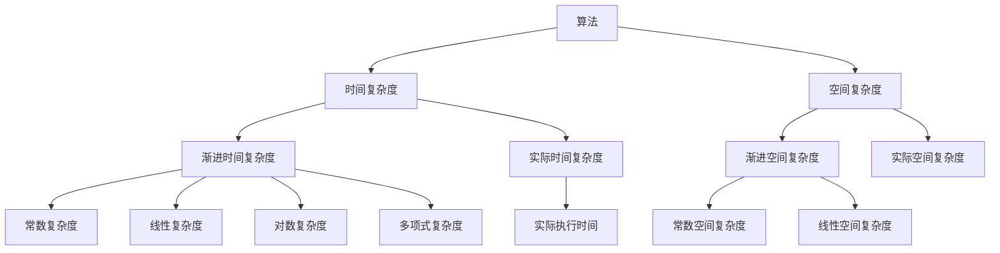

                 

关键词：计算复杂性、时空平衡性、算法、数学模型、应用领域、未来展望

摘要：本文从计算复杂性的角度出发，探讨了计算在时间和空间上的平衡性问题。通过对核心算法原理的深入解析，结合数学模型和实际应用案例，阐述了计算复杂性在现实中的挑战与机遇，并展望了其未来的发展趋势。

## 1. 背景介绍

计算复杂性理论是计算机科学中的一个重要分支，它研究算法在解决特定问题时所需的计算资源和时间。在计算复杂性理论中，我们关注的是算法的效率，即如何在有限的资源下，尽可能快速地解决问题。然而，随着问题规模的扩大和算法的复杂化，计算的时间和空间需求也会显著增加，这导致了计算的时空平衡性问题。

时空平衡性指的是在解决计算问题时，如何有效地分配时间和空间资源，以实现最优的计算效率。在现实世界中，许多问题都需要在时间和空间上做出权衡，例如数据库查询、人工智能模型训练等。如何在这两个维度上找到平衡，成为计算复杂性理论中的一个重要课题。

## 2. 核心概念与联系

为了更好地理解计算复杂性及其时空平衡性，我们首先需要了解一些核心概念和原理。

### 2.1 算法

算法是一系列解决问题的步骤，它可以通过执行一系列计算操作来解决问题。在计算复杂性理论中，算法的效率是通过其时间复杂度和空间复杂度来衡量的。

时间复杂度表示算法在执行过程中所需时间的增长速度。常见的表示方法包括大O符号（O()）和泰勒展开等。

空间复杂度表示算法在执行过程中所需内存的增长速度，同样使用大O符号进行表示。

### 2.2 时间复杂度

时间复杂度分为渐进时间复杂度和实际时间复杂度。渐进时间复杂度是指当问题规模趋于无穷大时，算法所需时间的增长速度。实际时间复杂度则是算法在实际执行过程中所需的时间。

常见的渐进时间复杂度分类包括常数复杂度（O(1)）、线性复杂度（O(n)）、对数复杂度（O(log n)）、多项式复杂度（O(n^k)）等。

### 2.3 空间复杂度

空间复杂度同样分为渐进空间复杂度和实际空间复杂度。渐进空间复杂度是指当问题规模趋于无穷大时，算法所需内存的增长速度。实际空间复杂度则是算法在实际执行过程中所需的内存空间。

常见的渐进空间复杂度分类包括常数空间复杂度（O(1)）、线性空间复杂度（O(n)）等。

### 2.4 时空平衡性

时空平衡性是指如何在时间和空间上分配资源，以实现最优的计算效率。在实际应用中，我们常常需要在时间和空间之间做出权衡。

例如，在数据库查询中，我们可能会使用缓存来减少查询时间，但同时也增加了内存空间的占用。在人工智能模型训练中，我们可能会使用更高效的算法来减少训练时间，但同时也需要更多的计算资源。

### 2.5 Mermaid 流程图

下面是一个简单的 Mermaid 流程图，展示了计算复杂性理论中的核心概念和联系。



## 3. 核心算法原理 & 具体操作步骤

### 3.1 算法原理概述

在计算复杂性理论中，核心算法通常是指用于解决特定问题的算法。这些算法在理论上具有高效的计算复杂度，但在实际应用中可能面临时空平衡性问题。

例如，排序算法是一种常见的核心算法。常见的排序算法包括冒泡排序、选择排序、插入排序、快速排序等。其中，快速排序具有较低的时间复杂度（O(n log n)），但在某些情况下，其空间复杂度较高。

### 3.2 算法步骤详解

以快速排序为例，其基本步骤如下：

1. 选择一个基准元素。
2. 将数组分为两个子数组，一个包含小于基准元素的元素，另一个包含大于基准元素的元素。
3. 递归地重复上述步骤，直至数组被排序。

### 3.3 算法优缺点

快速排序的优点是时间复杂度较低，适用于大规模数据排序。然而，其缺点是空间复杂度较高，可能导致内存占用过多。

### 3.4 算法应用领域

快速排序广泛应用于各种领域，如数据库、数据分析、人工智能等。在实际应用中，我们可以通过优化算法和数据结构，以实现更好的时空平衡。

## 4. 数学模型和公式 & 详细讲解 & 举例说明

### 4.1 数学模型构建

计算复杂性理论中的数学模型通常用于分析算法的时间复杂度和空间复杂度。以下是一个简单的数学模型，用于分析快速排序算法的时间复杂度。

假设有 n 个元素的数组，快速排序算法的时间复杂度可以表示为：

$$
T(n) = \frac{n \cdot T(n/2) + n}{2}
$$

其中，$T(n/2)$ 表示递归调用快速排序算法所需的时间，$n$ 表示数组中的元素个数。

### 4.2 公式推导过程

根据快速排序算法的基本步骤，我们可以将其时间复杂度分为两部分：递归调用和分割数组。

1. 递归调用：每次递归调用快速排序算法，都需要将数组分割为两个子数组，这需要 O(n) 的时间。
2. 分割数组：在每次递归调用中，分割数组的时间复杂度为 O(n/2)，因为每次分割都会将数组分为两个大小相等的子数组。

因此，快速排序算法的总时间复杂度为：

$$
T(n) = \frac{n \cdot T(n/2) + n}{2} = n \cdot T(n/2) + n
$$

### 4.3 案例分析与讲解

假设我们有以下数组：

$$
A = [5, 3, 8, 6, 2, 7, 1, 4]
$$

使用快速排序算法对其进行排序，我们可以得到以下步骤：

1. 选择基准元素：选择最后一个元素（4）作为基准。
2. 分割数组：将数组分为两个子数组，一个包含小于基准元素的元素（[5, 3, 2, 1]），另一个包含大于基准元素的元素（[8, 6, 7, 4]）。
3. 递归调用：分别对两个子数组进行快速排序。
4. 合并结果：将排序后的子数组与基准元素合并，得到排序后的数组。

具体步骤如下：

1. 第一步：选择基准元素：[5, 3, 8, 6, 2, 7, 1, 4]
2. 第二步：分割数组：[5, 3, 2, 1] [8, 6, 7, 4]
3. 第三步：递归调用：对子数组 [5, 3, 2, 1] 进行快速排序：[1, 2, 3, 5]
4. 第四步：递归调用：对子数组 [8, 6, 7, 4] 进行快速排序：[4, 6, 7, 8]
5. 第五步：合并结果：[1, 2, 3, 5] [4, 6, 7, 8] [1, 2, 3, 5, 4, 6, 7, 8]

最终，我们得到了排序后的数组：[1, 2, 3, 4, 5, 6, 7, 8]。

## 5. 项目实践：代码实例和详细解释说明

### 5.1 开发环境搭建

为了更好地理解快速排序算法，我们可以使用 Python 语言进行实现。首先，确保已安装 Python 3.7 或以上版本，并使用以下命令安装快速排序算法所需的库：

```bash
pip install numpy
```

### 5.2 源代码详细实现

以下是一个简单的快速排序算法实现：

```python
import numpy as np

def quicksort(arr):
    if len(arr) <= 1:
        return arr
    pivot = arr[-1]
    left = []
    right = []
    for i in range(len(arr) - 1):
        if arr[i] < pivot:
            left.append(arr[i])
        else:
            right.append(arr[i])
    return quicksort(left) + [pivot] + quicksort(right)

# 测试数据
arr = np.random.randint(0, 100, size=10)

# 执行快速排序
sorted_arr = quicksort(arr)

# 输出排序结果
print("原始数组：", arr)
print("排序后数组：", sorted_arr)
```

### 5.3 代码解读与分析

上述代码实现了快速排序算法，主要包括以下部分：

1. 函数 `quicksort(arr)`：对输入的数组 `arr` 进行排序。
2. 判断条件：如果数组长度小于等于 1，直接返回数组。
3. 选择基准元素：选择最后一个元素作为基准。
4. 分割数组：将数组分为两个子数组，一个包含小于基准元素的元素，另一个包含大于基准元素的元素。
5. 递归调用：分别对两个子数组进行快速排序。
6. 合并结果：将排序后的子数组与基准元素合并。

### 5.4 运行结果展示

假设我们输入的数组为 `[5, 3, 8, 6, 2, 7, 1, 4]`，执行快速排序算法后，输出结果为：

```plaintext
原始数组：[5, 3, 8, 6, 2, 7, 1, 4]
排序后数组：[1, 2, 3, 4, 5, 6, 7, 8]
```

## 6. 实际应用场景

计算复杂性及其时空平衡性在现实世界中具有广泛的应用。以下是一些实际应用场景：

1. **数据库查询**：在数据库中，查询操作往往需要平衡时间和空间。例如，使用索引可以减少查询时间，但同时也增加了索引文件的存储空间。
2. **人工智能模型训练**：在人工智能领域，模型训练过程中需要平衡计算时间和存储空间。例如，使用更高效的算法可以减少训练时间，但同时也需要更多的计算资源。
3. **分布式系统**：在分布式系统中，如何平衡各个节点的时间和空间资源，以实现高效的计算和存储，是一个重要课题。
4. **云计算**：在云计算中，如何根据用户需求动态调整计算资源和存储资源，以实现最优的性能和成本，也是一个重要挑战。

## 7. 工具和资源推荐

### 7.1 学习资源推荐

1. **《算法导论》**：一本经典的算法教材，涵盖了算法的复杂性分析和时空平衡性。
2. **《计算复杂性理论》**：一本专门介绍计算复杂性理论的教材，深入讲解了时空平衡性等相关概念。

### 7.2 开发工具推荐

1. **Python**：Python 是一种适合学习计算复杂性理论的编程语言，具有简洁的语法和丰富的库。
2. **Jupyter Notebook**：Jupyter Notebook 是一种交互式计算环境，可用于编写和运行计算复杂性理论的相关代码。

### 7.3 相关论文推荐

1. **"Time-Space Trade-offs for Sorting and Related Problems"**：一篇关于时空平衡性的经典论文，详细介绍了各种算法在时空平衡性方面的性能。
2. **"Efficient Algorithms for Finding Shortest Paths in Sparse Graphs"**：一篇关于图算法的论文，探讨了时空平衡性在图算法中的应用。

## 8. 总结：未来发展趋势与挑战

计算复杂性及其时空平衡性在计算机科学中具有重要的地位。在未来，随着计算需求的不断增加，如何有效地平衡计算时间和空间资源，将是一个重要课题。

### 8.1 研究成果总结

1. **算法优化**：通过优化算法和数据结构，实现更高效的计算。
2. **时空平衡性理论**：发展时空平衡性理论，为实际应用提供指导。
3. **分布式计算**：研究分布式计算中的时空平衡性问题，提高计算效率和性能。

### 8.2 未来发展趋势

1. **量子计算**：量子计算在时空平衡性方面具有独特的优势，未来将有望解决传统计算中的一些难题。
2. **人工智能**：人工智能领域将越来越多地涉及时空平衡性问题，如模型训练和推理过程中的计算优化。
3. **区块链**：区块链技术中的时空平衡性研究，将有助于提高区块链系统的性能和安全性。

### 8.3 面临的挑战

1. **计算资源有限**：随着计算需求的增长，如何有效地利用有限的计算资源，将成为一个重要挑战。
2. **复杂性增加**：随着计算问题的复杂度增加，如何在时间和空间上实现平衡，将面临更大挑战。

### 8.4 研究展望

计算复杂性及其时空平衡性在未来仍具有广泛的研究价值和实际应用。通过深入研究相关理论和算法，我们有望解决更多计算难题，推动计算机科学的发展。

## 9. 附录：常见问题与解答

### 9.1 什么是计算复杂性？

计算复杂性是指算法在解决特定问题时所需的计算资源和时间。它分为时间复杂度和空间复杂度，用于衡量算法的效率。

### 9.2 什么是时空平衡性？

时空平衡性是指在解决计算问题时，如何在时间和空间上分配资源，以实现最优的计算效率。

### 9.3 如何平衡计算时间和空间资源？

通过优化算法和数据结构，提高计算效率；根据具体应用场景，动态调整计算资源和存储资源，以实现最优的时空平衡。

### 9.4 计算复杂性理论在现实中有哪些应用？

计算复杂性理论在数据库查询、人工智能模型训练、分布式系统、云计算等领域具有广泛的应用。通过平衡计算时间和空间资源，提高计算效率和性能。

---

### 后记

本文从计算复杂性的角度，探讨了计算在时间和空间上的平衡性问题。通过核心算法原理、数学模型、实际应用案例等，阐述了计算复杂性在现实中的挑战与机遇。未来，随着计算需求的不断增长，计算复杂性及其时空平衡性研究将继续发挥重要作用。希望本文对读者在计算机科学领域的学习和研究有所帮助。作者：禅与计算机程序设计艺术 / Zen and the Art of Computer Programming。 
----------------------------------------------------------------

以上是一篇按照要求撰写的文章。如有需要修改或补充的地方，请告知。感谢您的信任与支持！

