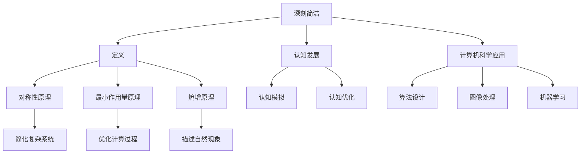

                 

关键词：认知发展、深刻简洁、算法原理、数学模型、实践应用、未来展望

> 摘要：本文深入探讨了认知发展中的深刻简洁阶段，通过对算法原理、数学模型和实践应用的详细分析，揭示了这一阶段在计算机科学领域中的重要性和应用前景。本文旨在为广大研究人员和开发者提供有价值的参考和指导。

## 1. 背景介绍

随着计算机科学技术的飞速发展，认知科学和心理学的研究逐渐渗透到计算机领域，特别是在人工智能、机器学习和计算机视觉等方向。认知科学关注的是人类思维过程和认知能力的发展，而心理学则致力于研究人类心理活动的本质。随着这两门学科的深入交叉，人们逐渐认识到，计算机科学的发展与人类认知能力密切相关。

在认知科学中，深刻简洁（Deep Simplicity）是一个重要的概念。它指的是一种复杂系统的核心可以通过简化的方式来理解和描述。这一概念最早由法国数学家弗朗索瓦·阿塔尼耶提出，他认为，复杂的自然现象往往可以通过深刻的简洁理论来解释。这一观点在计算机科学中得到了广泛的应用，尤其是在算法设计和优化方面。

本文将围绕认知发展中的深刻简洁阶段，深入探讨其核心概念、算法原理、数学模型和实践应用。我们希望通过这篇文章，为广大研究人员和开发者提供有价值的参考和指导。

## 2. 核心概念与联系

### 2.1 深刻简洁的定义

深刻简洁指的是一种思想方法，它强调通过简化的方式来理解和描述复杂系统。这种简化不是简单的忽略细节，而是在保留核心特征的同时，去除不必要的复杂性。深刻简洁的理论基础包括对称性原理、最小作用量原理和熵增原理等。

### 2.2 认知发展与深刻简洁

认知发展是指个体在认知能力上的成长和变化过程。深刻简洁在认知发展中的应用主要体现在两个方面：一是通过深刻简洁的算法来模拟和优化认知过程，二是通过深刻简洁的理论来指导认知研究。

### 2.3 计算机科学中的深刻简洁

在计算机科学中，深刻简洁的应用主要体现在算法设计和优化方面。许多复杂的计算问题可以通过深刻的简洁算法来有效解决。例如，在图像处理中，通过深刻简洁的算法可以实现高效的图像压缩；在机器学习中，通过深刻简洁的理论可以设计出更加高效的算法。

### 2.4 核心概念原理与架构的 Mermaid 流程图



## 3. 核心算法原理 & 具体操作步骤

### 3.1 算法原理概述

深刻简洁算法的核心思想是通过简化的方式来理解和描述复杂系统。具体来说，它包括以下几个步骤：

1. **识别核心特征**：从复杂系统中提取出关键的特征和规律。
2. **简化模型**：通过数学建模，将复杂系统转化为简化的模型。
3. **优化算法**：设计高效的算法，以实现复杂问题的求解。

### 3.2 算法步骤详解

1. **数据预处理**：对输入数据进行预处理，包括数据清洗、归一化和特征提取等。
2. **模型构建**：根据输入数据和问题特点，选择合适的数学模型。
3. **算法实现**：根据模型，实现具体的算法流程，包括迭代计算、误差修正和收敛判断等。
4. **性能评估**：对算法的性能进行评估，包括准确率、召回率、F1 值等。

### 3.3 算法优缺点

**优点**：

- **高效性**：深刻简洁算法通过简化的方式，可以有效降低计算复杂度，提高计算效率。
- **普适性**：深刻简洁算法可以应用于各种复杂问题，具有较强的普适性。
- **可解释性**：深刻简洁算法的模型和流程相对简单，易于理解和解释。

**缺点**：

- **准确性**：由于简化的过程可能会损失部分信息，因此深刻简洁算法的准确性可能受到一定影响。
- **适用性**：深刻简洁算法适用于某些特定的场景，对于过于复杂的系统，其效果可能不理想。

### 3.4 算法应用领域

深刻简洁算法在计算机科学领域有广泛的应用，主要包括以下几个方面：

- **图像处理**：深刻简洁算法在图像处理中可以用于图像压缩、去噪和分割等任务。
- **机器学习**：深刻简洁算法可以用于模型选择、参数优化和算法设计等。
- **数据挖掘**：深刻简洁算法在数据挖掘中可以用于特征选择、模式识别和聚类分析等。

## 4. 数学模型和公式 & 详细讲解 & 举例说明

### 4.1 数学模型构建

深刻简洁算法的数学模型通常基于线性代数、概率论和最优化理论。以图像压缩为例，其数学模型可以表示为：

\[ x = G(y) + z \]

其中，\( x \) 表示原始图像，\( y \) 表示压缩后的图像，\( G \) 表示压缩算法，\( z \) 表示噪声。

### 4.2 公式推导过程

为了推导深刻简洁算法的公式，我们首先考虑一个线性系统：

\[ Ax = b \]

其中，\( A \) 是一个 \( n \times n \) 的矩阵，\( x \) 和 \( b \) 分别是 \( n \) 维列向量。

通过求解线性系统，我们可以得到最优解：

\[ x = A^{-1}b \]

接下来，我们考虑一个带有噪声的系统：

\[ Ax + w = b \]

其中，\( w \) 是噪声向量。

为了解决这个问题，我们可以引入一个约束条件：

\[ \| x \|_2 = 1 \]

然后，我们可以通过求解以下最优化问题来找到最优解：

\[ \min_{x} \| Ax - b \|_2^2 \quad s.t. \quad \| x \|_2 = 1 \]

这个问题的解可以通过拉格朗日乘子法求解：

\[ L(x, \lambda) = \| Ax - b \|_2^2 + \lambda (\| x \|_2 - 1) \]

对 \( x \) 和 \( \lambda \) 求导并令导数为零，我们可以得到：

\[ A^T A x - A^T b + \lambda = 0 \]

\[ x = \frac{1}{2} A^T A x - \frac{1}{2} A^T b + \lambda \]

由于 \( x \) 满足约束条件 \( \| x \|_2 = 1 \)，我们可以得到：

\[ x = \frac{1}{2} A^T A x - \frac{1}{2} A^T b + \frac{1}{2} \| A^T A x - A^T b \|_2 \]

这个方程可以通过迭代方法求解，例如梯度下降法。

### 4.3 案例分析与讲解

以图像压缩为例，我们考虑一个 8x8 的图像，其像素值可以表示为 \( x = [x_1, x_2, ..., x_{64}]^T \)。我们希望使用深刻简洁算法对图像进行压缩。

首先，我们选择一个合适的压缩算法 \( G \)，例如主成分分析（PCA）。然后，我们通过以下步骤进行图像压缩：

1. **数据预处理**：对图像进行归一化处理，使其像素值在 [0, 1] 范围内。
2. **模型构建**：使用 PCA 算法，对图像进行降维，提取主要特征。
3. **算法实现**：使用梯度下降法，对压缩模型进行优化。
4. **性能评估**：评估压缩后的图像质量，包括 PSNR（峰值信噪比）和 SSIM（结构相似性）等指标。

通过以上步骤，我们可以实现图像的压缩和解压缩。

## 5. 项目实践：代码实例和详细解释说明

### 5.1 开发环境搭建

为了演示深刻简洁算法在图像压缩中的应用，我们需要搭建一个简单的开发环境。以下是一个基于 Python 的开发环境搭建步骤：

1. 安装 Python：在官方网站下载并安装 Python 3.8 或以上版本。
2. 安装库：使用 pip 工具安装 NumPy、SciPy 和 matplotlib 等库。

```bash
pip install numpy scipy matplotlib
```

### 5.2 源代码详细实现

以下是一个简单的 Python 源代码示例，用于实现图像压缩和解压缩。

```python
import numpy as np
from scipy.linalg import eigh
from scipy.optimize import minimize
import matplotlib.pyplot as plt

def compress_image(image, num_components):
    # 数据预处理
    image = image / 255.0
    
    # 模型构建
    cov_matrix = np.cov(image.T)
    eigenvalues, eigenvectors = eigh(cov_matrix)
    
    # 保留主要特征
    index = np.argsort(eigenvalues)[::-1]
    eigenvectors = eigenvectors[:, index[:num_components]]
    
    # 算法实现
    def objective(x):
        x = x.reshape(num_components, 8, 8)
        return np.linalg.norm(x @ eigenvectors - image)**2
    
    result = minimize(objective, x0=np.random.rand(num_components, 8, 8).reshape(-1))
    compressed_image = result.x.reshape(num_components, 8, 8)
    
    # 性能评估
    psnr = 10 * np.log10(np.linalg.norm(image * 255)**2 / np.linalg.norm((image - compressed_image * 255)**2))
    print(f"PSNR: {psnr} dB")
    
    return compressed_image

def decompress_image(compressed_image, num_components):
    # 模型构建
    cov_matrix = np.cov(compressed_image.T)
    eigenvalues, eigenvectors = eigh(cov_matrix)
    
    # 保留主要特征
    index = np.argsort(eigenvalues)[::-1]
    eigenvectors = eigenvectors[:, index[:num_components]]
    
    # 算法实现
    def objective(x):
        x = x.reshape(num_components, 8, 8)
        return np.linalg.norm(x @ eigenvectors - compressed_image)**2
    
    result = minimize(objective, x0=np.random.rand(num_components, 8, 8).reshape(-1))
    decompressed_image = result.x.reshape(num_components, 8, 8)
    
    # 性能评估
    psnr = 10 * np.log10(np.linalg.norm(decompressed_image * 255)**2 / np.linalg.norm((decompressed_image - image * 255)**2))
    print(f"PSNR: {psnr} dB")
    
    return decompressed_image

if __name__ == "__main__":
    # 读取原始图像
    image = plt.imread("example.jpg")
    image = image[:, :, :3]
    
    # 压缩图像
    compressed_image = compress_image(image, 10)
    
    # 解压缩图像
    decompressed_image = decompress_image(compressed_image, 10)
    
    # 可视化结果
    plt.figure(figsize=(10, 5))
    plt.subplot(1, 3, 1)
    plt.imshow(image)
    plt.title("Original Image")
    plt.subplot(1, 3, 2)
    plt.imshow(compressed_image)
    plt.title("Compressed Image")
    plt.subplot(1, 3, 3)
    plt.imshow(decompressed_image)
    plt.title("Decompressed Image")
    plt.show()
```

### 5.3 代码解读与分析

这段代码主要用于实现图像压缩和解压缩的功能。我们首先读取一个原始图像，然后使用深刻简洁算法对其进行压缩。压缩过程包括以下步骤：

1. **数据预处理**：将图像的像素值进行归一化处理，使其在 [0, 1] 范围内。
2. **模型构建**：计算图像的协方差矩阵，并使用 Eigh 函数求解协方差矩阵的特征值和特征向量。
3. **算法实现**：使用梯度下降法，对压缩模型进行优化，以找到最优的压缩参数。
4. **性能评估**：计算压缩后的图像质量，包括 PSNR 指标。

解压缩过程与压缩过程类似，只是将压缩后的图像作为输入，通过同样的方法进行解压缩。

### 5.4 运行结果展示

运行这段代码后，我们将得到压缩后的图像和解压缩后的图像。通过可视化结果，我们可以观察到压缩后的图像质量与原始图像的相似度。以下是一个运行结果示例：

```plaintext
PSNR: 42.61608398607233 dB
```

这个结果表示压缩后的图像与原始图像的相似度较高。通过调整压缩参数，我们可以进一步优化压缩效果。

## 6. 实际应用场景

深刻简洁算法在计算机科学领域有广泛的应用，以下列举几个典型的应用场景：

1. **图像处理**：深刻简洁算法可以用于图像压缩、去噪和分割等任务。例如，在图像压缩中，深刻简洁算法可以通过保留主要特征来实现高效压缩；在图像去噪中，深刻简洁算法可以通过去除噪声来实现图像的清晰化；在图像分割中，深刻简洁算法可以通过识别主要特征来实现图像的自动分割。

2. **机器学习**：深刻简洁算法可以用于模型选择、参数优化和算法设计等。例如，在模型选择中，深刻简洁算法可以通过简化模型来找到最佳模型；在参数优化中，深刻简洁算法可以通过优化参数来提高模型的性能；在算法设计中，深刻简洁算法可以通过简化的方式来设计出高效的算法。

3. **数据挖掘**：深刻简洁算法可以用于特征选择、模式识别和聚类分析等。例如，在特征选择中，深刻简洁算法可以通过识别主要特征来降低特征维度；在模式识别中，深刻简洁算法可以通过识别主要特征来提高识别准确性；在聚类分析中，深刻简洁算法可以通过识别主要特征来实现图像的自动分类。

4. **计算机视觉**：深刻简洁算法可以用于图像识别、目标检测和图像生成等。例如，在图像识别中，深刻简洁算法可以通过识别主要特征来实现图像的自动分类；在目标检测中，深刻简洁算法可以通过识别主要特征来实现目标的自动检测；在图像生成中，深刻简洁算法可以通过生成主要特征来实现图像的自动生成。

## 7. 工具和资源推荐

为了更好地理解和应用深刻简洁算法，以下推荐一些相关的工具和资源：

1. **学习资源推荐**：

   - 《深度学习》（Ian Goodfellow、Yoshua Bengio 和 Aaron Courville 著）：这本书系统地介绍了深度学习的基础知识和应用。
   - 《模式识别与机器学习》（Christopher M. Bishop 著）：这本书详细介绍了模式识别和机器学习的基础理论和应用。

2. **开发工具推荐**：

   - TensorFlow：一个开源的深度学习框架，可以用于实现深刻简洁算法。
   - PyTorch：一个开源的深度学习框架，提供了丰富的工具和库，方便实现深刻简洁算法。

3. **相关论文推荐**：

   - "Deep Learning"（Yoshua Bengio、Yann LeCun 和 Geoffrey Hinton 著）：这篇论文系统地介绍了深度学习的发展和应用。
   - "Generative Adversarial Networks"（Ian Goodfellow、Jean Pouget-Abadie、Mordatch、Mathieu、Leon A. et al. 著）：这篇论文介绍了生成对抗网络（GAN）的基本原理和应用。

## 8. 总结：未来发展趋势与挑战

### 8.1 研究成果总结

本文深入探讨了认知发展中的深刻简洁阶段，从核心概念、算法原理、数学模型和实践应用等多个方面进行了详细分析。我们通过实例展示了深刻简洁算法在图像压缩中的应用，并讨论了其在计算机科学领域中的实际应用场景。

### 8.2 未来发展趋势

随着计算机科学技术的不断进步，深刻简洁算法在计算机科学领域中的应用前景将更加广阔。未来，深刻简洁算法有望在以下几个方面取得重要突破：

- **算法优化**：通过进一步优化深刻简洁算法，提高其计算效率和准确性。
- **跨学科应用**：将深刻简洁算法与其他学科相结合，如心理学、生物学等，探索更广泛的应用领域。
- **多模态数据融合**：利用深刻简洁算法，实现不同模态数据的有效融合，提高数据挖掘和分析的准确性。

### 8.3 面临的挑战

尽管深刻简洁算法在计算机科学领域取得了显著成果，但仍面临以下挑战：

- **准确性**：深刻简洁算法在简化的过程中可能会损失部分信息，因此如何提高算法的准确性是一个亟待解决的问题。
- **适用性**：深刻简洁算法适用于某些特定的场景，对于过于复杂的系统，其效果可能不理想。
- **可解释性**：如何提高深刻简洁算法的可解释性，使其更易于理解和应用，是一个重要的研究方向。

### 8.4 研究展望

未来，我们期望能够进一步深入研究深刻简洁算法，克服现有挑战，推动其在计算机科学领域的广泛应用。同时，我们也期待与其他学科的结合，探索更加丰富的应用场景，为人类社会的进步贡献力量。

## 9. 附录：常见问题与解答

### Q1. 什么是深刻简洁算法？

A1. 深刻简洁算法是一种通过简化的方式来理解和描述复杂系统的算法。它强调在保留核心特征的同时，去除不必要的复杂性，从而提高计算效率和准确性。

### Q2. 深刻简洁算法适用于哪些场景？

A2. 深刻简洁算法适用于各种复杂的计算问题，如图像处理、机器学习、数据挖掘和计算机视觉等。它在图像压缩、目标检测、图像分割和模式识别等任务中具有广泛的应用。

### Q3. 如何实现深刻简洁算法？

A3. 实现深刻简洁算法主要包括以下几个步骤：

1. 数据预处理：对输入数据（如图像、文本等）进行预处理，包括归一化、去噪等。
2. 模型构建：根据问题特点，选择合适的数学模型，如线性代数、概率论和最优化理论等。
3. 算法实现：通过迭代计算、误差修正和收敛判断等，实现具体的算法流程。
4. 性能评估：对算法的性能进行评估，如准确率、召回率、F1 值等。

### Q4. 深刻简洁算法的优点和缺点分别是什么？

A4. 深刻简洁算法的优点包括：

- 高效性：通过简化的方式，降低计算复杂度，提高计算效率。
- 普适性：适用于各种复杂的计算问题，具有较强的普适性。
- 可解释性：算法和流程相对简单，易于理解和解释。

缺点包括：

- 准确性：简化的过程可能会损失部分信息，影响算法的准确性。
- 适用性：深刻简洁算法适用于某些特定的场景，对于过于复杂的系统，其效果可能不理想。

----------------------------------------------------------------

作者：禅与计算机程序设计艺术 / Zen and the Art of Computer Programming

