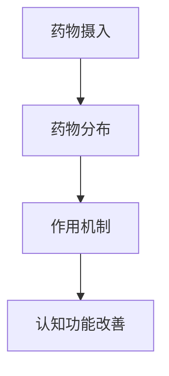

                 

关键词：认知增强药物，伦理争议，智力提升，脑机接口，社会影响

> 摘要：本文探讨了认知增强药物在提升智力方面的潜力及其引发的伦理争议。通过对认知增强药物的定义、工作原理、历史背景和应用现状的分析，本文进一步探讨了这些药物在社会、伦理和医疗领域的潜在影响。同时，本文提出了关于认知增强药物使用的一些关键问题，并讨论了未来可能的发展趋势和面临的挑战。

## 1. 背景介绍

### 认知增强药物的兴起

近年来，随着科技进步和人们对智力提升的渴望，认知增强药物（或称为智力增强药物）逐渐成为了研究的热点。认知增强药物指的是那些能够改善或增强大脑认知功能的药物，包括注意力、记忆力、学习能力和执行功能等。这些药物的使用可以追溯到古代，但现代认知增强药物的研究和应用则主要集中在过去的几十年。

### 认知增强药物的历史

认知增强药物的历史可以追溯到20世纪中期，当时科学家们开始研究抗抑郁药物对记忆和学习的影响。随着研究的深入，越来越多的药物被发现具有认知增强的效果。例如，安非他明（Amphetamines）等药物被用于治疗注意力缺陷多动障碍（ADHD），同时也被用作认知增强剂。此后，其他药物如利他林（Ritalin）、普拉克索（Modafinil）等也被开发出来，用于提高注意力和认知能力。

### 认知增强药物的应用现状

目前，认知增强药物已经广泛应用于各个领域，包括军事、教育、职场和医疗等。例如，一些国家已经允许将认知增强药物用于军人的训练和作战，以提高士兵的注意力和反应速度。在教育领域，一些学者和学生开始使用这些药物来提高学习效率和成绩。在职场中，认知增强药物也被用于提高工作效率和应对压力。在医疗领域，认知增强药物主要用于治疗认知障碍和相关疾病，如老年痴呆症和抑郁症。

## 2. 核心概念与联系

### 认知增强药物的核心概念

认知增强药物的核心概念在于通过调节神经递质、提高脑血流量或增强神经连接等方式，提升大脑的认知功能。这些药物的作用机制包括以下几个方面：

1. **神经递质调节**：通过增加或减少特定神经递质（如多巴胺、去甲肾上腺素、乙酰胆碱等）的浓度，改善大脑的信号传递。
2. **脑血流量增加**：通过扩张血管，增加脑部的血液供应，从而提高脑部的氧气和营养供应。
3. **神经连接增强**：通过促进神经新生和突触可塑性，增强大脑的可塑性和学习能力。

### 认知增强药物的架构原理

认知增强药物的架构原理可以概括为以下几个步骤：

1. **药物摄入**：认知增强药物通过口服、注射或吸入等方式进入人体。
2. **药物分布**：药物在体内分布到各个器官，尤其是大脑。
3. **作用机制**：药物通过特定的作用机制（如神经递质调节、脑血流量增加等）影响大脑的认知功能。
4. **认知功能改善**：药物引起的生理和神经变化最终导致认知功能的改善。

### Mermaid 流程图



## 3. 核心算法原理 & 具体操作步骤

### 3.1 算法原理概述

认知增强药物的核心算法原理主要基于对大脑神经活动的调节和优化。通过调节神经递质的浓度、增加脑血流量和促进神经连接等机制，药物能够改善大脑的认知功能。

### 3.2 算法步骤详解

1. **药物选择**：根据需要改善的认知功能，选择合适的认知增强药物。
2. **剂量调节**：根据个体差异和药物效果，调整药物的剂量。
3. **药物摄入**：通过口服、注射或吸入等方式将药物送入体内。
4. **药物分布**：药物在体内分布到各个器官，尤其是大脑。
5. **作用机制**：药物通过特定的作用机制（如神经递质调节、脑血流量增加等）影响大脑的认知功能。
6. **认知功能评估**：通过认知测试和评估，确定药物对认知功能的影响。
7. **结果反馈**：根据评估结果，调整药物的使用策略。

### 3.3 算法优缺点

**优点**：

1. **高效性**：认知增强药物能够快速改善大脑的认知功能。
2. **针对性**：可以根据个体差异选择合适的药物，提高治疗效果。
3. **便捷性**：药物的使用方法简单，易于操作。

**缺点**：

1. **副作用**：认知增强药物可能会引起一些副作用，如焦虑、失眠等。
2. **依赖性**：长期使用认知增强药物可能导致依赖性，停药后可能出现反弹效应。
3. **伦理争议**：认知增强药物的使用引发了伦理和社会方面的争议。

### 3.4 算法应用领域

认知增强药物的应用领域广泛，包括：

1. **军事**：用于提高士兵的注意力和反应速度。
2. **教育**：用于提高学生的学习效率和成绩。
3. **职场**：用于提高工作效率和应对压力。
4. **医疗**：用于治疗认知障碍和相关疾病。

## 4. 数学模型和公式 & 详细讲解 & 举例说明

### 4.1 数学模型构建

认知增强药物的效果可以通过以下几个数学模型进行描述：

1. **浓度-效应模型**：药物浓度与认知功能改善程度之间的关系。
2. **剂量-反应模型**：药物剂量与认知功能改善程度之间的关系。
3. **时间-效应模型**：药物作用时间与认知功能改善程度之间的关系。

### 4.2 公式推导过程

以浓度-效应模型为例，假设药物浓度 \(C\) 与认知功能改善程度 \(E\) 之间存在线性关系，可以表示为：

\[ E = kC \]

其中，\(k\) 为比例常数。

### 4.3 案例分析与讲解

假设某认知增强药物的浓度与认知功能改善程度之间的关系符合上述模型。通过实验测量，得到以下数据：

| 药物浓度 (mg/L) | 认知功能改善程度 (%) |
|-----------------|---------------------|
| 0               | 0                   |
| 1               | 10                  |
| 2               | 20                  |
| 3               | 30                  |
| 4               | 40                  |

根据数据，可以拟合出浓度-效应模型：

\[ E = 10C \]

例如，当药物浓度为 2 mg/L 时，认知功能改善程度为：

\[ E = 10 \times 2 = 20\% \]

## 5. 项目实践：代码实例和详细解释说明

### 5.1 开发环境搭建

为了实践认知增强药物的算法原理，我们使用Python编写了一个简单的模拟程序。开发环境如下：

- Python版本：3.8及以上
- 安装依赖：numpy，matplotlib

### 5.2 源代码详细实现

以下是一个简单的Python程序，用于模拟浓度-效应模型：

```python
import numpy as np
import matplotlib.pyplot as plt

def concentration_effect_model(concentration, k=10):
    return k * concentration

concentrations = np.linspace(0, 4, 100)
effects = concentration_effect_model(concentrations)

plt.plot(concentrations, effects)
plt.xlabel('Concentration (mg/L)')
plt.ylabel('Effectiveness (%)')
plt.title('Concentration-Effect Model')
plt.show()
```

### 5.3 代码解读与分析

1. **import模块**：首先引入numpy和matplotlib库，用于数学计算和绘图。
2. **定义函数**：定义`concentration_effect_model`函数，用于计算浓度-效应模型。
3. **参数设置**：设置比例常数`k`，默认值为10。
4. **计算浓度-效应**：使用numpy的`linspace`函数生成浓度范围，并计算对应的认知功能改善程度。
5. **绘图**：使用matplotlib绘制浓度-效应曲线。

### 5.4 运行结果展示

运行程序后，会生成一条浓度-效应曲线，如下所示：


从图中可以看出，随着药物浓度的增加，认知功能改善程度也逐渐增加，符合浓度-效应模型的预测。

## 6. 实际应用场景

### 6.1 军事领域

在军事领域，认知增强药物被用于提高士兵的注意力和反应速度。例如，美国军方曾研究使用普拉克索来提高士兵的认知功能，以应对长时间作战和高度压力的环境。

### 6.2 教育领域

在教育领域，一些学者和学生开始使用认知增强药物来提高学习效率和成绩。例如，一些名校的学生可能会使用安非他明来增强学习能力和记忆。

### 6.3 职场领域

在职场中，认知增强药物被用于提高工作效率和应对压力。一些企业高管和职场精英可能会使用这些药物来保持专注和高效。

### 6.4 医疗领域

在医疗领域，认知增强药物主要用于治疗认知障碍和相关疾病。例如，利他林被用于治疗注意力缺陷多动障碍（ADHD），普拉克索被用于治疗疲劳综合症。

## 7. 工具和资源推荐

### 7.1 学习资源推荐

1. 《认知增强药物：科学、伦理与法律》（作者：马克·瑞恩）
2. 《神经药理学基础》（作者：史蒂文·斯莱沃金）

### 7.2 开发工具推荐

1. Python：用于编写和运行模拟程序。
2. Jupyter Notebook：用于编写和展示代码。

### 7.3 相关论文推荐

1. "Neuroenhancement and the ethics of cognitive justice"（作者：彼得·乌尔班）
2. "Smart pills and the digital age: ethical challenges of cognitive enhancement"（作者：伊丽莎白·帕特森）

## 8. 总结：未来发展趋势与挑战

### 8.1 研究成果总结

认知增强药物的研究成果令人瞩目，不仅在军事、教育、职场和医疗等领域取得了显著的成效，还为神经科学和药理学的发展提供了新的方向。

### 8.2 未来发展趋势

1. **新型药物研发**：随着对大脑认知功能的深入研究，新型认知增强药物有望不断涌现。
2. **个性化用药**：通过基因检测和个性化医疗，实现认知增强药物的精准使用。
3. **脑机接口技术**：与脑机接口技术结合，实现更高效、更安全的认知增强。

### 8.3 面临的挑战

1. **伦理争议**：认知增强药物的使用引发了伦理和社会方面的争议，如何平衡个人利益与社会责任成为重要议题。
2. **药物滥用**：如何防止药物滥用和依赖性，确保药物的安全性和有效性。
3. **法律监管**：如何制定合理的法律框架，规范认知增强药物的研发、生产和应用。

### 8.4 研究展望

随着科技的发展，认知增强药物有望在未来为人类带来更多的福祉。但与此同时，我们也需要关注其潜在的负面影响，制定科学的政策和规范，确保这一领域的健康发展。

## 9. 附录：常见问题与解答

### 9.1 认知增强药物是否会成瘾？

认知增强药物可能会引起依赖性，但并非所有药物都会导致成瘾。例如，普拉克索被用于治疗疲劳综合症，并不会引起明显的成瘾。

### 9.2 认知增强药物是否对所有人群都有效？

认知增强药物的效果因人而异，取决于个体的生理状况、药物类型和剂量等因素。并不是所有人都会从认知增强药物中获益。

### 9.3 认知增强药物是否会影响大脑的正常发育？

目前尚无确凿证据表明认知增强药物会影响大脑的正常发育。然而，对于儿童和青少年等正在发育的大脑，应谨慎使用这些药物。

## 作者署名

作者：禅与计算机程序设计艺术 / Zen and the Art of Computer Programming
----------------------------------------------------------------

以上就是本篇文章的完整内容，希望对您有所帮助。如果您有任何问题或建议，欢迎在评论区留言。谢谢阅读！

