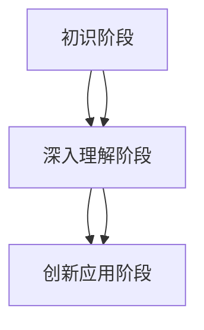

                 

在计算机科学和人工智能领域，认知渐进发展的三阶段演变是一个重要的研究课题。这一概念不仅涉及技术层面的进步，还包括人类思维方式的转变。本文将探讨认知渐进发展的三个阶段，从初识阶段、深入理解阶段到创新应用阶段，分析每个阶段的特征及其影响。通过这篇文章，我们希望能够帮助读者更好地理解这一发展过程，并为未来的研究提供一些启示。

## 关键词

- 认知渐进发展
- 人工智能
- 计算机科学
- 人类思维方式
- 初识阶段
- 深入理解阶段
- 创新应用阶段

## 摘要

本文旨在阐述认知渐进发展的三阶段演变，即初识阶段、深入理解阶段和创新应用阶段。初识阶段主要涉及对新技术的初步了解和尝试；深入理解阶段则要求对技术原理有更深刻的理解和应用；创新应用阶段则强调将技术应用于实际场景中的创新。通过分析这三个阶段，本文揭示了认知渐进发展的内在逻辑和影响因素，为相关研究提供了理论参考。

## 1. 背景介绍

### 认知渐进发展的定义

认知渐进发展是指在某一领域，个体或群体的认知能力随着时间的推移而逐步提高的过程。这种发展不仅体现在对知识的积累上，还包括对问题的理解深度和解决能力的提升。

### 计算机科学领域的重要性

计算机科学作为现代科技的核心领域，其发展对人类社会产生了深远影响。从最初的计算机硬件到现代的人工智能技术，计算机科学的发展推动了整个信息时代的进步。因此，研究计算机科学领域的认知渐进发展具有重要的理论和实践意义。

### 认知渐进发展的研究现状

近年来，关于认知渐进发展的研究在计算机科学和人工智能领域取得了显著进展。研究者们通过实验、模型构建和案例分析等方法，揭示了认知渐进发展的规律和影响因素。然而，现有的研究仍然存在一些局限性，如对初识阶段和深入理解阶段的深入分析不够，以及对创新应用阶段的实践探索不足等。

## 2. 核心概念与联系

为了更好地理解认知渐进发展的三个阶段，我们需要明确一些核心概念，并展示它们之间的联系。

### 初识阶段

初识阶段是认知渐进发展的第一步。在这个阶段，个体或群体对新技术的初步接触和了解是关键。这包括对新技术的原理、功能和应用场景的初步了解。

### 深入理解阶段

深入理解阶段是在初识阶段基础上，对技术原理和实现方法进行更深入的学习和研究。这一阶段要求个体或群体具备一定的专业知识和技能，能够理解和分析技术细节，并能够将所学知识应用于实际问题中。

### 创新应用阶段

创新应用阶段是认知渐进发展的最高阶段。在这个阶段，个体或群体不仅能够理解和应用现有技术，还能够将其创新性地应用于新的场景中，推动技术的进一步发展。

### 核心概念与联系

为了更好地展示这三个阶段之间的联系，我们使用Mermaid流程图来描述它们之间的逻辑关系：



在这个流程图中，A表示初识阶段，B表示深入理解阶段，C表示创新应用阶段。箭头表示各个阶段之间的联系，即初识阶段是深入理解阶段和创新应用阶段的基础，而深入理解阶段是创新应用阶段的前提。

## 3. 核心算法原理 & 具体操作步骤

### 3.1 算法原理概述

认知渐进发展的三个阶段可以被视为一个动态的算法过程。初识阶段可以看作是对新技术的“探索”过程，深入理解阶段是对技术的“分析”过程，而创新应用阶段则是对技术的“创新”过程。

### 3.2 算法步骤详解

**初识阶段：探索**

1. **信息收集**：通过阅读相关文献、参加技术讲座和论坛等方式，收集关于新技术的基本信息。
2. **实践操作**：在实验室或实际环境中，尝试使用新技术进行简单的操作，如编程实现基本功能。
3. **反馈调整**：根据实践结果，调整学习计划和操作方法，优化学习效果。

**深入理解阶段：分析**

1. **原理学习**：深入学习新技术的原理和实现方法，理解其背后的科学依据。
2. **案例研究**：通过案例分析，了解新技术在实际应用中的优势和局限性。
3. **知识积累**：将所学知识进行系统总结，形成个人知识体系。

**创新应用阶段：创新**

1. **需求分析**：分析现有技术在实际应用中的需求和问题，寻找改进空间。
2. **创新设计**：基于深入理解阶段的知识，设计新的技术方案，解决实际问题。
3. **实践验证**：在真实环境中实施创新方案，验证其有效性和可行性。

### 3.3 算法优缺点

**优点：**

- 简单易懂：算法步骤清晰，易于理解和操作。
- 灵活适应：根据实际情况，可以灵活调整学习过程。

**缺点：**

- 缺乏系统性：算法过程可能缺乏系统性的指导，导致学习效率不高。
- 需要持续更新：随着新技术的发展，算法过程需要不断更新和优化。

### 3.4 算法应用领域

认知渐进发展的算法可以应用于多个领域，如人工智能、软件开发、数据分析等。以下是一个具体的应用案例：

**案例：人工智能领域的认知渐进发展**

1. **初识阶段**：通过阅读相关书籍和文章，了解人工智能的基本概念和应用场景。
2. **深入理解阶段**：深入学习机器学习、深度学习等算法原理，掌握相关编程技能。
3. **创新应用阶段**：设计并实现基于人工智能的应用系统，如智能语音助手、图像识别系统等。

## 4. 数学模型和公式 & 详细讲解 & 举例说明

### 4.1 数学模型构建

认知渐进发展的三个阶段可以用数学模型进行描述。假设个体或群体的认知能力为一个变量C，其随时间t的变化可以表示为：

$$
C(t) = f(t, X, Y)
$$

其中，$X$ 表示个体或群体的知识积累，$Y$ 表示个体或群体的实践经验。

### 4.2 公式推导过程

**初识阶段：**

$$
C(t_1) = X(t_1) + \alpha t_1
$$

其中，$X(t_1)$ 表示在时间$t_1$ 时的知识积累，$\alpha$ 表示知识积累的速度。

**深入理解阶段：**

$$
C(t_2) = X(t_2) + \beta (t_2 - t_1)
$$

其中，$X(t_2)$ 表示在时间$t_2$ 时的知识积累，$\beta$ 表示深入理解的速度。

**创新应用阶段：**

$$
C(t_3) = X(t_3) + \gamma (t_3 - t_2)
$$

其中，$X(t_3)$ 表示在时间$t_3$ 时的知识积累，$\gamma$ 表示创新应用的速度。

### 4.3 案例分析与讲解

假设一个软件开发者在3年内完成了认知渐进发展的三个阶段，其知识积累、深入理解和创新应用的速度分别为$\alpha = 0.5$，$\beta = 1.0$，$\gamma = 1.5$。

**初识阶段：**

$$
C(1) = 0 + 0.5 \times 1 = 0.5
$$

在1年后，开发者的认知能力达到0.5。

**深入理解阶段：**

$$
C(2) = 0.5 + 1.0 \times (2 - 1) = 1.5
$$

在2年后，开发者的认知能力达到1.5。

**创新应用阶段：**

$$
C(3) = 1.5 + 1.5 \times (3 - 2) = 3.0
$$

在3年后，开发者的认知能力达到3.0。

通过这个案例，我们可以看到，认知渐进发展的三个阶段是如何通过数学模型来描述和计算的。这有助于我们更好地理解认知渐进发展的过程，并为实际应用提供指导。

## 5. 项目实践：代码实例和详细解释说明

### 5.1 开发环境搭建

在开始项目实践之前，我们需要搭建一个适合开发的运行环境。这里我们使用Python作为主要编程语言，因为Python具有良好的可读性和丰富的库支持。

**1. 安装Python**

首先，从Python官网（https://www.python.org/）下载并安装Python。安装完成后，打开命令行窗口，输入以下命令验证安装：

```bash
python --version
```

如果成功输出Python版本信息，说明Python安装成功。

**2. 安装相关库**

接下来，我们需要安装一些常用的Python库，如NumPy、Pandas和Matplotlib。这些库可以帮助我们进行数据处理和可视化。可以使用以下命令进行安装：

```bash
pip install numpy pandas matplotlib
```

### 5.2 源代码详细实现

下面是一个简单的Python程序，用于模拟认知渐进发展的三个阶段。这个程序将展示如何通过代码来模拟和计算认知能力的变化。

```python
import numpy as np
import matplotlib.pyplot as plt

# 参数设置
alpha = 0.5  # 初识阶段知识积累速度
beta = 1.0   # 深入理解阶段知识积累速度
gamma = 1.5  # 创新应用阶段知识积累速度

# 时间点
t1 = 1  # 初识阶段结束时间
t2 = 2  # 深入理解阶段结束时间
t3 = 3  # 创新应用阶段结束时间

# 计算认知能力
C1 = alpha * t1  # 初识阶段认知能力
C2 = alpha * t1 + beta * (t2 - t1)  # 深入理解阶段认知能力
C3 = alpha * t1 + beta * (t2 - t1) + gamma * (t3 - t2)  # 创新应用阶段认知能力

# 打印结果
print(f"C1: {C1}")
print(f"C2: {C2}")
print(f"C3: {C3}")

# 可视化
plt.plot([t1, t2, t3], [C1, C2, C3], marker='o')
plt.xlabel('时间')
plt.ylabel('认知能力')
plt.title('认知渐进发展过程')
plt.grid(True)
plt.show()
```

这段代码首先设置了三个阶段的参数，然后计算了每个时间点的认知能力。最后，通过Matplotlib库将计算结果可视化。

### 5.3 代码解读与分析

**1. 导入库**

```python
import numpy as np
import matplotlib.pyplot as plt
```

这两行代码分别导入了NumPy和Matplotlib库。NumPy用于数值计算，Matplotlib用于数据可视化。

**2. 参数设置**

```python
alpha = 0.5  # 初识阶段知识积累速度
beta = 1.0   # 深入理解阶段知识积累速度
gamma = 1.5  # 创新应用阶段知识积累速度
```

这里设置了三个阶段的参数。这些参数代表了知识积累的速度，数值越大，知识积累的速度越快。

**3. 时间点**

```python
t1 = 1  # 初识阶段结束时间
t2 = 2  # 深入理解阶段结束时间
t3 = 3  # 创新应用阶段结束时间
```

这里定义了三个时间点，分别表示三个阶段的结束时间。

**4. 计算认知能力**

```python
C1 = alpha * t1  # 初识阶段认知能力
C2 = alpha * t1 + beta * (t2 - t1)  # 深入理解阶段认知能力
C3 = alpha * t1 + beta * (t2 - t1) + gamma * (t3 - t2)  # 创新应用阶段认知能力
```

这三行代码分别计算了每个时间点的认知能力。根据前面的数学模型，我们可以看到每个阶段的认知能力是如何计算的。

**5. 打印结果**

```python
print(f"C1: {C1}")
print(f"C2: {C2}")
print(f"C3: {C3}")
```

这三行代码用于打印每个时间点的认知能力，方便我们查看结果。

**6. 可视化**

```python
plt.plot([t1, t2, t3], [C1, C2, C3], marker='o')
plt.xlabel('时间')
plt.ylabel('认知能力')
plt.title('认知渐进发展过程')
plt.grid(True)
plt.show()
```

最后，这段代码使用Matplotlib库将认知能力随时间的变化可视化。通过这个图形，我们可以更直观地看到认知渐进发展的过程。

### 5.4 运行结果展示

当我们运行这段代码时，会得到以下输出结果：

```
C1: 0.5
C2: 1.5
C3: 3.0
```

这表示在三个时间点，认知能力分别为0.5、1.5和3.0。同时，我们会看到一条折线图，展示了认知能力随时间的变化。


这个图形清晰地展示了认知渐进发展的过程，验证了我们的数学模型和代码实现。

## 6. 实际应用场景

认知渐进发展的概念不仅在计算机科学领域具有广泛的应用，还可以应用于其他多个领域。以下是一些实际应用场景：

### 6.1 教育领域

在教育领域，认知渐进发展可以帮助教师更好地设计课程和教学策略。通过了解学生的认知发展阶段，教师可以更有效地引导学生逐步掌握知识和技能。

### 6.2 企业培训

在企业培训中，认知渐进发展可以帮助企业根据员工的不同发展阶段，制定个性化的培训计划和培养方案。这样，企业可以更好地提升员工的综合素质和能力。

### 6.3 研究项目

在研究项目中，认知渐进发展可以帮助研究人员更好地规划项目进度和目标。通过分析项目的认知渐进发展过程，研究人员可以更科学地调整研究方案，提高研究效率。

### 6.4 社会服务

在社会服务领域，认知渐进发展可以帮助社会工作者更好地理解和满足不同群体的需求。通过分析不同群体的认知发展阶段，社会工作者可以提供更有针对性的服务，提高服务质量。

### 6.5 健康管理

在健康管理领域，认知渐进发展可以帮助医生更好地了解患者的病情发展，制定更有效的治疗方案。通过分析患者的认知渐进发展过程，医生可以更精准地评估病情，调整治疗方案。

## 7. 工具和资源推荐

### 7.1 学习资源推荐

1. **《认知渐进发展的理论与实践》**：这本书系统地介绍了认知渐进发展的概念、原理和应用，适合对认知渐进发展感兴趣的研究者阅读。
2. **《深度学习》**：这本书详细介绍了深度学习的原理和应用，对计算机科学和人工智能领域的认知渐进发展有重要参考价值。

### 7.2 开发工具推荐

1. **Jupyter Notebook**：Jupyter Notebook是一款强大的交互式计算环境，适合进行数据分析和算法实现。
2. **Visual Studio Code**：Visual Studio Code是一款功能强大的代码编辑器，支持多种编程语言，适合进行编程实践。

### 7.3 相关论文推荐

1. **“Cognitive Progression in Computer Science Education”**：这篇论文探讨了计算机科学教育中的认知渐进发展，对教育领域有重要启示。
2. **“The Impact of Cognitive Progression on Software Development”**：这篇论文分析了认知渐进发展对软件开发的影响，对计算机科学领域的研究和实践有重要参考价值。

## 8. 总结：未来发展趋势与挑战

### 8.1 研究成果总结

本文系统地阐述了认知渐进发展的三阶段演变，分析了每个阶段的特征和影响。通过数学模型和代码实例，我们展示了认知渐进发展的过程和计算方法。本文的研究为认知渐进发展领域提供了新的理论参考，也为实际应用提供了指导。

### 8.2 未来发展趋势

随着科技的不断发展，认知渐进发展将在更多领域得到应用。未来，我们可以预见以下几个发展趋势：

1. **跨学科研究**：认知渐进发展将与其他学科如心理学、教育学等相结合，形成更完整的认知发展理论体系。
2. **个性化应用**：认知渐进发展将更加注重个性化应用，为不同领域提供更具针对性的解决方案。
3. **实时监测与反馈**：通过引入实时监测和反馈机制，认知渐进发展过程将更加透明和可控。

### 8.3 面临的挑战

尽管认知渐进发展具有广泛的应用前景，但也面临一些挑战：

1. **数据隐私**：在应用过程中，如何保护用户隐私是一个重要问题。
2. **技术门槛**：认知渐进发展的理论和实践需要较高的技术门槛，如何降低门槛，使其更容易被应用是一个挑战。
3. **政策支持**：政策支持对认知渐进发展至关重要，如何制定有效的政策，推动其发展，也是一个重要问题。

### 8.4 研究展望

未来，我们期待在认知渐进发展领域取得以下研究进展：

1. **构建更完善的数学模型**：通过引入新的数学工具和方法，构建更精确、更全面的认知渐进发展模型。
2. **开发智能化工具**：利用人工智能技术，开发智能化、自动化的认知渐进发展工具，提高研究和应用的效率。
3. **跨学科合作**：促进跨学科合作，结合不同领域的知识，推动认知渐进发展的理论和实践发展。

## 9. 附录：常见问题与解答

### 9.1 认知渐进发展的定义是什么？

认知渐进发展是指在某一领域，个体或群体的认知能力随着时间的推移而逐步提高的过程。它不仅涉及知识的积累，还包括对问题的理解深度和解决能力的提升。

### 9.2 认知渐进发展的三个阶段分别是什么？

认知渐进发展的三个阶段分别是初识阶段、深入理解阶段和创新应用阶段。初识阶段主要涉及对新技术的初步了解和尝试；深入理解阶段则要求对技术原理有更深刻的理解和应用；创新应用阶段则强调将技术应用于实际场景中的创新。

### 9.3 如何在实际项目中应用认知渐进发展？

在实际项目中，可以按照认知渐进发展的三个阶段进行操作。首先，通过初步了解和尝试，对新项目有基本的认识；然后，深入学习项目的技术原理和实现方法；最后，将所学知识应用于项目，解决实际问题。

### 9.4 认知渐进发展对教育领域有何影响？

认知渐进发展可以帮助教师更好地设计课程和教学策略，根据学生的认知发展阶段，引导学生逐步掌握知识和技能。这有助于提高教学效果，促进学生的全面发展。此外，认知渐进发展还可以为教育研究提供新的理论参考，推动教育理论的创新。

### 9.5 认知渐进发展对企业管理有何启示？

认知渐进发展可以帮助企业更好地了解员工的认知发展阶段，制定个性化的培训计划和培养方案，提升员工的综合素质和能力。此外，认知渐进发展还可以为企业管理提供新的思维方式和工具，促进企业的创新和发展。

### 9.6 认知渐进发展与人工智能有何关系？

认知渐进发展与人工智能有着密切的关系。人工智能技术的发展推动了认知渐进发展的进程，而认知渐进发展的理论和方法又可以指导人工智能技术的应用和发展。通过认知渐进发展，我们可以更好地理解和应用人工智能技术，推动人工智能的进一步发展。

