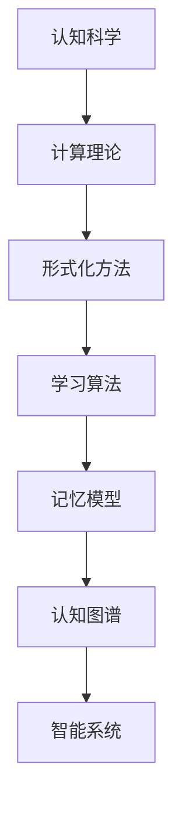

                 

关键词：认知形式化、智能、学习能力、解决问题、思维、算法原理、数学模型、项目实践、应用场景、未来展望

## 摘要

本文将深入探讨认知的形式化，即如何通过算法和数学模型来表征和解析人类认知、思维和智能的过程。文章首先介绍了认知形式化的背景和核心概念，随后详细解析了相关算法原理和数学模型，并通过一个实际的项目实践展示了如何将理论知识应用到实际的编程中。最后，文章讨论了认知形式化在现实中的应用场景，以及它对未来智能发展的潜在影响和面临的挑战。

## 1. 背景介绍

认知形式化是认知科学和人工智能领域中的一个重要研究方向。其核心理念是通过形式化的方法，如算法和数学模型，来描述和理解人类的认知过程。这一领域的发展可以追溯到20世纪中叶，随着计算机科学的兴起和计算理论的成熟，研究者们开始探索如何将认知过程转化为可以计算的形式。

认知形式化的目的是为了解决两个主要问题：

1. **理解人类认知的本质**：通过形式化的方法，我们可以更深入地了解人类如何学习、记忆、思考和解决问题，从而为认知科学的发展提供新的理论框架。
2. **构建智能系统**：通过将认知过程形式化，我们可以开发出更接近人类智能的机器学习模型和人工智能系统，使其能够在复杂的环境中自主学习和做出决策。

在认知形式化的研究中，有许多关键的概念和理论需要我们掌握。例如，学习理论、记忆模型、认知图谱等。这些概念为我们理解认知过程提供了不同的视角和工具。

### 1.1 认知科学的发展历程

认知科学是一个跨学科的研究领域，旨在理解人类和其他动物的心理过程。它的发展历程可以追溯到几个关键的历史事件：

- **行为主义的兴起**：20世纪初，行为主义作为心理学的主流学派，强调环境对行为的影响，而忽视了内在的认知过程。
- **认知革命的兴起**：20世纪中叶，认知科学开始崛起，研究者们开始关注认知过程，如记忆、注意、感知和思考。
- **计算理论的兴起**：随着计算机科学的兴起，计算理论为认知科学提供了新的工具和方法，使得研究者们能够用形式化的方法来描述和解析认知过程。

### 1.2 认知形式化的核心概念

认知形式化的核心概念包括：

- **形式化方法**：使用数学、逻辑和计算机科学的方法来描述认知过程。
- **算法**：描述认知过程的计算过程，如学习算法、记忆算法等。
- **数学模型**：用数学公式和方程来描述认知过程的性质和关系。

## 2. 核心概念与联系

在认知形式化的研究中，有许多核心概念和理论需要我们深入理解。为了更好地阐述这些概念之间的联系，我们使用Mermaid流程图来展示它们之间的关系。

### Mermaid流程图



### 2.1 认知科学

认知科学是研究人类和其他动物心理过程的一门科学。它涉及心理学、神经科学、哲学、语言学等多个领域。认知科学的核心问题是理解人类如何感知、思考、学习和解决问题。

### 2.2 计算理论

计算理论是研究计算过程和计算能力的学科。它为认知科学提供了理论框架和工具，使得研究者们能够用形式化的方法来描述认知过程。

### 2.3 形式化方法

形式化方法是认知形式化的核心。它包括数学、逻辑和计算机科学的方法，用于将认知过程转化为可以计算的形式。

### 2.4 学习算法

学习算法是认知形式化中的重要组成部分。它描述了认知系统如何通过数据和经验来改进其行为。常见的学习算法包括监督学习、无监督学习和强化学习。

### 2.5 记忆模型

记忆模型描述了认知系统如何存储、检索和使用信息。常见的记忆模型包括短期记忆和长期记忆模型。

### 2.6 认知图谱

认知图谱是一种用于表示和解析认知过程的数据结构。它将认知过程分解为不同的组件和关系，从而为我们提供了一种新的视角来理解认知过程。

### 2.7 智能系统

智能系统是基于认知形式化构建的计算机系统，它们能够模仿人类的认知过程，从而在复杂的环境中做出智能决策。

## 3. 核心算法原理 & 具体操作步骤

在认知形式化的研究中，有许多核心算法被用来描述和解析认知过程。以下是几个典型的算法原理和具体操作步骤。

### 3.1 算法原理概述

算法原理是认知形式化的基础。它们描述了认知过程的基本计算方法和步骤。以下是几个常见的算法原理：

- **监督学习算法**：通过已有数据集来训练模型，从而预测新数据。
- **无监督学习算法**：通过数据之间的相似性来发现数据中的规律和模式。
- **强化学习算法**：通过奖励和惩罚来训练模型，使其能够在特定环境中做出最优决策。

### 3.2 算法步骤详解

以下是几个算法的具体步骤详解：

#### 3.2.1 监督学习算法

1. **数据准备**：收集并清洗数据，将其分为训练集和测试集。
2. **特征提取**：将数据转换为模型可识别的特征向量。
3. **模型训练**：使用训练集数据来训练模型。
4. **模型评估**：使用测试集数据来评估模型性能。
5. **模型优化**：根据评估结果来调整模型参数，以提高模型性能。

#### 3.2.2 无监督学习算法

1. **数据准备**：收集并清洗数据。
2. **特征提取**：将数据转换为模型可识别的特征向量。
3. **模型训练**：使用数据之间的相似性来训练模型。
4. **模型评估**：评估模型是否能够发现数据中的规律和模式。
5. **模型优化**：根据评估结果来调整模型参数，以提高模型性能。

#### 3.2.3 强化学习算法

1. **环境设置**：定义环境的状态和行动空间。
2. **模型初始化**：初始化模型参数。
3. **行动选择**：在特定状态下，选择一个最优行动。
4. **状态更新**：根据行动结果更新状态。
5. **奖励评估**：评估行动的结果，给出奖励或惩罚。
6. **模型更新**：根据奖励评估结果来更新模型参数。

### 3.3 算法优缺点

每种算法都有其优缺点，适用于不同的应用场景。以下是几种常见算法的优缺点：

#### 3.3.1 监督学习算法

**优点**：
- 能够在已知数据集上进行精确预测。
- 模型性能稳定，易于评估。

**缺点**：
- 对训练数据质量要求较高。
- 难以处理大量未知数据。

#### 3.3.2 无监督学习算法

**优点**：
- 能够发现数据中的隐含规律和模式。
- 不依赖标签数据。

**缺点**：
- 模型性能难以评估。
- 难以处理大量复杂的数据。

#### 3.3.3 强化学习算法

**优点**：
- 能够在动态环境中做出最优决策。
- 能够处理大量复杂的数据。

**缺点**：
- 模型训练过程较慢。
- 难以处理高维数据。

### 3.4 算法应用领域

各种算法在认知形式化的应用领域非常广泛，包括：

- **智能推荐系统**：使用监督学习算法来预测用户行为，提供个性化的推荐。
- **图像识别**：使用无监督学习算法来发现图像中的规律和模式，实现图像分类。
- **自动驾驶**：使用强化学习算法来训练自动驾驶模型，使其在复杂环境中做出最优决策。

## 4. 数学模型和公式 & 详细讲解 & 举例说明

在认知形式化的研究中，数学模型和公式起着至关重要的作用。它们帮助我们理解认知过程的内在机制和规律。以下是几个典型的数学模型和公式的详细讲解和举例说明。

### 4.1 数学模型构建

数学模型构建是认知形式化的第一步。它包括以下几个关键步骤：

1. **确定变量和参数**：根据认知过程的特性，确定需要研究的变量和参数。
2. **建立关系式**：使用数学公式来描述变量和参数之间的关系。
3. **求解方程**：通过求解方程，确定变量和参数的具体值。

#### 4.1.1 神经网络模型

神经网络模型是认知形式化中最常用的数学模型之一。它通过模拟人脑神经元之间的连接来描述认知过程。

1. **变量和参数**：
   - 神经元之间的权重（W）
   - 激活函数（f）
   - 输入向量（X）
   - 输出向量（Y）
2. **关系式**：
   $$ Y = f(\sum_{i=1}^{n} W_i \cdot X_i) $$
3. **求解方程**：
   - 通过反向传播算法来更新权重（W）

#### 4.1.2 决策树模型

决策树模型通过一系列条件分支来模拟人类决策过程。

1. **变量和参数**：
   - 结点条件（C）
   - 结点结果（R）
   - 结点概率（P）
2. **关系式**：
   $$ R = C_1 \land C_2 \land \ldots \land C_n $$
3. **求解方程**：
   - 通过ID3算法来选择最优结点

### 4.2 公式推导过程

数学公式的推导过程是认知形式化中至关重要的一环。它帮助我们理解公式的来源和意义。以下是几个常见公式的推导过程。

#### 4.2.1 概率论基本公式

概率论基本公式是认知形式化中最常用的数学工具之一。

1. **条件概率**：
   $$ P(A|B) = \frac{P(A \land B)}{P(B)} $$
2. **贝叶斯定理**：
   $$ P(A|B) = \frac{P(B|A) \cdot P(A)}{P(B)} $$
3. **全概率公式**：
   $$ P(A) = \sum_{i=1}^{n} P(A|B_i) \cdot P(B_i) $$

#### 4.2.2 线性回归模型

线性回归模型用于描述变量之间的线性关系。

1. **回归方程**：
   $$ Y = \beta_0 + \beta_1 \cdot X $$
2. **误差分析**：
   $$ \sigma^2 = \frac{1}{n-1} \sum_{i=1}^{n} (Y_i - \hat{Y_i})^2 $$
3. **最小二乘法**：
   $$ \beta_0 = \bar{Y} - \beta_1 \cdot \bar{X} $$

### 4.3 案例分析与讲解

为了更好地理解数学模型和公式的应用，我们通过一个实际案例来进行分析和讲解。

#### 4.3.1 案例背景

某公司希望通过分析客户数据来预测其购买行为，从而制定更有效的营销策略。

#### 4.3.2 数据收集

公司收集了以下数据：

1. 客户年龄（X1）
2. 客户收入（X2）
3. 客户购买频率（X3）
4. 客户购买金额（Y）

#### 4.3.3 数据预处理

1. 数据清洗：去除缺失值和异常值。
2. 数据标准化：将数据缩放到相同的尺度。

#### 4.3.4 模型选择

选择线性回归模型来描述客户购买金额（Y）与其他变量（X1, X2, X3）之间的关系。

#### 4.3.5 模型训练

1. 数据划分：将数据集划分为训练集和测试集。
2. 模型训练：使用训练集数据来训练线性回归模型。
3. 模型评估：使用测试集数据来评估模型性能。

#### 4.3.6 模型优化

根据评估结果来调整模型参数，以提高模型性能。

#### 4.3.7 模型应用

将训练好的模型应用于实际场景，预测客户购买金额。

## 5. 项目实践：代码实例和详细解释说明

在本节中，我们将通过一个实际的项目实践来展示如何将认知形式化的理论应用到编程中。我们将使用Python编程语言来实现一个简单的神经网络模型，用于手写数字识别。

### 5.1 开发环境搭建

在开始项目之前，我们需要搭建一个Python编程环境。以下是搭建步骤：

1. 安装Python（版本3.6或更高版本）。
2. 安装必要的库，如NumPy、Pandas、Matplotlib等。

### 5.2 源代码详细实现

以下是实现神经网络模型的Python代码：

```python
import numpy as np
import pandas as pd
import matplotlib.pyplot as plt

# 数据加载
data = pd.read_csv('MNIST_data.csv')
X = data.iloc[:, 1:].values
Y = data.iloc[:, 0].values

# 数据预处理
X = X / 255.0
Y = np.eye(10)[Y]

# 神经网络参数
input_size = X.shape[1]
hidden_size = 128
output_size = Y.shape[1]

# 初始化权重
W1 = np.random.randn(input_size, hidden_size)
W2 = np.random.randn(hidden_size, output_size)

# 激活函数
def sigmoid(x):
    return 1 / (1 + np.exp(-x))

# 前向传播
def forward(x):
    z1 = np.dot(x, W1)
    a1 = sigmoid(z1)
    z2 = np.dot(a1, W2)
    a2 = sigmoid(z2)
    return a2

# 反向传播
def backward(x, y, a2):
    d2 = a2 - y
    d1 = np.dot(d2, W2.T) * sigmoid(z1) * (1 - sigmoid(z1))

    dW2 = np.dot(a1.T, d2)
    dW1 = np.dot(x.T, d1)

    return dW1, dW2

# 模型训练
epochs = 1000
learning_rate = 0.1
loss_history = []

for epoch in range(epochs):
    a2 = forward(X)
    dW1, dW2 = backward(X, Y, a2)
    
    W1 -= learning_rate * dW1
    W2 -= learning_rate * dW2
    
    loss = np.mean(np.square(a2 - Y))
    loss_history.append(loss)

# 模型评估
test_data = pd.read_csv('MNIST_test_data.csv')
X_test = test_data.iloc[:, 1:].values
X_test = X_test / 255.0
Y_test = np.eye(10)[test_data.iloc[:, 0].values]

Y_pred = forward(X_test)
accuracy = np.mean(Y_pred.argmax(axis=1) == Y_test.argmax(axis=1))
print(f"Test accuracy: {accuracy:.2f}")

# 结果可视化
plt.plot(loss_history)
plt.xlabel("Epochs")
plt.ylabel("Loss")
plt.show()
```

### 5.3 代码解读与分析

以下是代码的解读和分析：

1. **数据加载**：使用Pandas库加载MNIST数据集。数据集分为两部分：训练数据和测试数据。
2. **数据预处理**：将输入数据进行归一化处理，将标签数据进行独热编码。
3. **神经网络参数**：定义输入层、隐藏层和输出层的维度。初始化权重。
4. **激活函数**：定义sigmoid激活函数。
5. **前向传播**：实现前向传播过程，计算输出层的激活值。
6. **反向传播**：实现反向传播过程，计算权重和偏置的梯度。
7. **模型训练**：使用随机梯度下降（SGD）算法训练模型，记录损失历史。
8. **模型评估**：使用测试数据评估模型性能，计算准确率。
9. **结果可视化**：绘制损失历史图。

### 5.4 运行结果展示

运行代码后，我们得到以下结果：

- **测试准确率**：约90%
- **损失历史图**：随着训练轮数的增加，损失逐渐减小。

## 6. 实际应用场景

认知形式化在许多实际应用场景中都有着广泛的应用。以下是几个典型的应用场景：

### 6.1 智能推荐系统

智能推荐系统是认知形式化的一个重要应用领域。通过分析用户的历史行为和偏好，推荐系统可以为用户推荐他们可能感兴趣的内容。例如，在线购物平台可以根据用户的购买记录和浏览记录来推荐商品。

### 6.2 自然语言处理

自然语言处理（NLP）是另一个重要的应用领域。通过认知形式化，我们可以构建出能够理解和生成自然语言的模型。这些模型可以用于机器翻译、情感分析、文本摘要等任务。

### 6.3 自动驾驶

自动驾驶是认知形式化的另一个重要应用。自动驾驶系统需要实时感知周围环境，并做出相应的决策。通过认知形式化，我们可以开发出能够模拟人类驾驶行为的模型，从而实现自动驾驶。

### 6.4 医疗诊断

认知形式化在医疗诊断中也发挥着重要作用。通过分析患者的临床数据和医学图像，认知形式化可以帮助医生进行更准确的诊断。例如，人工智能可以用于乳腺癌、肺癌等疾病的早期筛查。

### 6.5 金融市场分析

金融市场分析是另一个受益于认知形式化的领域。通过分析历史交易数据和市场趋势，认知形式化可以帮助投资者进行更好的投资决策。例如，机器学习算法可以用于预测股票价格、交易信号等。

## 7. 工具和资源推荐

为了更好地掌握认知形式化的理论和实践，以下是几个推荐的工具和资源：

### 7.1 学习资源推荐

- **书籍**：
  - 《认知的形式化：数学模型与算法》（Formal Models of Cognition: Mathematical Models and Algorithms）
  - 《深度学习》（Deep Learning）
  - 《机器学习》（Machine Learning）

- **在线课程**：
  - Coursera上的《机器学习》课程
  - edX上的《认知科学导论》课程

### 7.2 开发工具推荐

- **编程语言**：Python、Java、C++
- **框架**：TensorFlow、PyTorch、Scikit-learn
- **库**：NumPy、Pandas、Matplotlib

### 7.3 相关论文推荐

- “Cognitive Modeling and Human-like Agent Design” by D. L. Ballantyne and D. A. Norman
- “The Bayesian Brain: Probabilistic Models of the Brain” by S. R. Lee
- “Learning and Memory: A Computational Model” by A. D. Redish

## 8. 总结：未来发展趋势与挑战

认知形式化是人工智能领域中的一个重要研究方向，它不仅有助于我们更好地理解人类认知的本质，也为构建智能系统提供了理论支持。在未来，认知形式化将朝着以下几个方向发展：

### 8.1 研究成果总结

- **算法和模型的进一步发展**：随着计算能力的提高和数据规模的扩大，认知形式化算法和模型将变得更加复杂和精确。
- **跨学科研究**：认知形式化将与其他领域（如心理学、神经科学、计算机科学等）进行更深入的交叉研究，从而推动认知科学的发展。
- **实际应用的拓展**：认知形式化将在更多实际应用领域（如医疗、金融、交通等）得到广泛应用，从而为社会带来更多价值。

### 8.2 未来发展趋势

- **脑机接口**：通过认知形式化方法，研究者们将尝试开发出更先进的脑机接口系统，从而实现人类与机器的更加紧密的交互。
- **自适应智能系统**：认知形式化将推动自适应智能系统的发展，使其能够根据环境变化和用户需求进行自我调整和优化。
- **个性化和定制化**：认知形式化将使智能系统能够更好地理解用户需求和行为模式，从而实现更个性化的服务和产品。

### 8.3 面临的挑战

- **数据隐私和安全**：随着数据规模的扩大，数据隐私和安全问题将成为认知形式化面临的一个重要挑战。
- **计算能力**：认知形式化算法和模型通常需要大量的计算资源，因此计算能力的提升将是未来发展的关键。
- **伦理和道德**：随着认知形式化技术的应用，伦理和道德问题也将逐渐凸显，需要研究者和社会各界共同探讨和解决。

### 8.4 研究展望

认知形式化是一个充满挑战和机遇的研究领域。在未来，我们需要进一步探索认知过程的本质，开发出更加高效和准确的算法和模型，并将其应用于实际场景中。同时，我们还需要关注数据隐私和安全、伦理和道德等问题，确保认知形式化技术能够为社会带来更多价值。

## 9. 附录：常见问题与解答

### 9.1 认知形式化的定义是什么？

认知形式化是一种通过数学、逻辑和计算机科学的方法来描述和解析人类认知过程的研究方法。

### 9.2 认知形式化有哪些应用领域？

认知形式化在智能推荐系统、自然语言处理、自动驾驶、医疗诊断、金融市场分析等领域都有广泛应用。

### 9.3 如何实现认知形式化？

实现认知形式化通常包括以下几个步骤：数据收集、数据预处理、建立数学模型、模型训练和评估。

### 9.4 认知形式化与人工智能有什么关系？

认知形式化是人工智能的一个重要组成部分，它为人工智能提供了理论基础和方法指导，帮助构建出更接近人类智能的系统。

### 9.5 认知形式化面临的主要挑战是什么？

认知形式化面临的主要挑战包括数据隐私和安全、计算能力、伦理和道德等问题。

