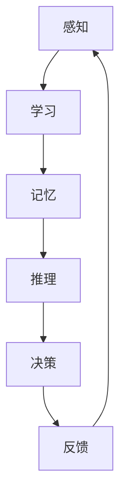

                 

 关键词：
- 认知的形式化
- 人工智能行为主义学派
- 认知交互
- 计算机算法
- 数学模型

> 摘要：
本文深入探讨了认知的形式化这一领域，特别是人工智能行为主义学派如何通过认知交互来推进计算机算法的研究。文章首先介绍了认知的形式化背景，随后详细阐述了人工智能行为主义学派的核心概念与联系。接着，文章从算法原理、数学模型到实际应用场景，全面解析了这一领域的研究进展与挑战。最后，文章展望了未来发展趋势，并提出了相关工具和资源推荐，为读者提供了全面的认知形式化领域指南。

## 1. 背景介绍

认知的形式化，即对人类思维过程进行数学建模和算法分析，是计算机科学、心理学和认知科学等多个领域交叉研究的前沿课题。近年来，随着人工智能技术的迅猛发展，认知的形式化研究得到了越来越多的关注。人工智能行为主义学派作为认知形式化研究的重要分支，致力于通过模拟和优化人类认知过程，提升人工智能系统的智能水平。

人工智能行为主义学派认为，人工智能系统应该模仿人类的认知过程，从感知、学习、记忆、推理到决策，每一环节都要尽可能地符合人类大脑的工作模式。这一学派的研究目标不仅在于提升机器的智能，还在于理解人类认知的本质，从而推动认知科学的发展。

### 1.1 认知的形式化研究意义

认知的形式化研究具有重要的理论和实践意义。在理论层面，它帮助我们深入理解人类思维过程，揭示认知活动的内在规律和机制。通过数学建模和算法分析，我们可以更精确地描述认知过程，进而推动认知科学的理论创新。

在实践层面，认知的形式化研究为人工智能技术的发展提供了新的方向和方法。通过模拟人类认知过程，我们可以设计出更高效、更智能的人工智能系统，为各行各业提供强大的技术支持。例如，在医疗领域，通过认知形式化方法，可以开发出智能诊断系统，提高诊断的准确性和效率。

### 1.2 人工智能行为主义学派的发展历程

人工智能行为主义学派起源于20世纪50年代，随着计算机技术的发展而逐渐成型。早期的行为主义学派主要关注机器的感知和动作能力，强调通过模拟人类的行为来提升机器的智能。随着认知科学和心理学的进步，行为主义学派逐渐转向对认知过程的关注，提出了认知模拟和认知算法的研究方法。

在20世纪80年代，随着神经网络和机器学习技术的发展，人工智能行为主义学派迎来了新的发展机遇。通过模拟人类大脑神经网络的结构和功能，行为主义学派在认知模拟方面取得了重要突破。近年来，随着深度学习和强化学习等技术的崛起，行为主义学派的研究范围进一步扩大，从简单的认知模拟发展到复杂的认知交互和智能决策。

## 2. 核心概念与联系

认知的形式化研究涉及多个核心概念，包括感知、学习、记忆、推理和决策等。这些概念相互联系，共同构成了认知的形式化架构。为了更好地理解这些概念之间的联系，我们可以使用Mermaid流程图来展示它们之间的关系。

下面是一个简化的Mermaid流程图，用于描述认知的形式化核心概念与联系：



### 2.1 感知

感知是人类认知过程的第一步，它涉及从外部环境中获取信息的过程。感知系统通过视觉、听觉、触觉等多种感官接收信息，并将其转化为电信号，传递给大脑进行处理。

### 2.2 学习

学习是认知过程中的关键环节，它涉及从感知中获得的经验和知识的学习和积累。学习可以通过多种方式进行，包括有监督学习、无监督学习和强化学习等。通过学习，人工智能系统能够不断提高自己的智能水平，更好地适应复杂环境。

### 2.3 记忆

记忆是学习的基础，它涉及将学习到的知识和经验存储在大脑中，以便在未来需要时能够调用。记忆分为短期记忆和长期记忆，短期记忆主要存储临时信息，长期记忆则存储长期记忆的信息。

### 2.4 推理

推理是基于已有知识和信息进行逻辑推理和判断的过程。通过推理，人类能够解决复杂问题，做出合理的决策。在人工智能系统中，推理算法被广泛应用于逻辑推理、知识表示和问题求解等领域。

### 2.5 决策

决策是认知过程的最终环节，它涉及根据当前情况选择最佳行动方案。决策过程通常需要综合考虑多个因素，包括目标、约束和不确定性等。在人工智能系统中，决策算法被广泛应用于自动控制、游戏人工智能和金融决策等领域。

### 2.6 反馈

反馈是认知过程中的关键环节，它涉及对行动结果的评价和调整。通过反馈，人工智能系统可以不断优化自己的行为，提高性能。反馈机制通常包括自我评价和用户评价等多种形式。

## 3. 核心算法原理 & 具体操作步骤

### 3.1 算法原理概述

认知的形式化研究涉及多种核心算法，其中最典型的包括神经网络算法、深度学习算法和强化学习算法等。这些算法通过模拟人类大脑的神经活动和学习过程，实现了对认知过程的建模和优化。

神经网络算法是基于人脑神经元结构的计算模型，通过多层神经元网络进行信息的传递和处理。深度学习算法是神经网络算法的一种扩展，它通过多层次的神经网络结构，实现了对复杂数据的自动特征提取和分类。强化学习算法则是基于奖励和惩罚机制，通过不断试错和优化，实现最优行为的决策。

### 3.2 算法步骤详解

以下是一个简化的神经网络算法步骤：

1. **输入层**：接收外部输入信息，并将其传递给隐藏层。
2. **隐藏层**：对输入信息进行处理，生成中间特征表示，并将其传递给输出层。
3. **输出层**：对隐藏层的输出进行处理，生成最终的输出结果。
4. **损失函数**：计算输出结果与目标值之间的误差，并计算梯度。
5. **反向传播**：将梯度反向传播到隐藏层和输入层，更新神经元的权重。
6. **迭代优化**：重复上述步骤，直到满足收敛条件。

### 3.3 算法优缺点

神经网络算法具有强大的非线性建模能力和良好的泛化能力，能够处理复杂的数据和任务。然而，它也存在一些缺点，如计算复杂度高、训练时间长和难以解释等。

深度学习算法在神经网络算法的基础上，通过增加网络层数和优化训练方法，实现了对复杂数据的自动特征提取和分类。它具有更好的性能和更强的泛化能力，已成为人工智能领域的主流算法。

强化学习算法通过奖励和惩罚机制，实现了对最优行为的决策。它适用于复杂、动态和不确定的环境，如游戏、自动驾驶和金融决策等领域。

### 3.4 算法应用领域

神经网络算法在图像识别、语音识别和自然语言处理等领域具有广泛应用。深度学习算法在计算机视觉、语音识别和自然语言处理等领域取得了显著成果，推动了人工智能技术的发展。强化学习算法在游戏、自动驾驶和金融决策等领域具有广泛的应用前景。

## 4. 数学模型和公式 & 详细讲解 & 举例说明

### 4.1 数学模型构建

认知的形式化研究需要构建一系列数学模型，以描述认知过程的不同方面。以下是一个简化的认知过程数学模型：

$$
\text{认知过程} = f(\text{感知}, \text{学习}, \text{记忆}, \text{推理}, \text{决策})
$$

其中，$f$ 表示认知过程的函数，$\text{感知}$、$\text{学习}$、$\text{记忆}$、$\text{推理}$ 和 $\text{决策}$ 分别表示认知过程中的五个环节。

### 4.2 公式推导过程

以下是一个简化的认知过程公式推导过程：

1. **感知**：输入信息通过感官接收，并转化为电信号，表示为 $x$。
2. **学习**：根据历史经验，对输入信息进行学习和处理，生成中间特征表示，表示为 $h$。
3. **记忆**：将学习到的中间特征表示存储在大脑中，表示为 $m$。
4. **推理**：根据中间特征表示和已知信息，进行逻辑推理和判断，表示为 $r$。
5. **决策**：根据推理结果，选择最佳行动方案，表示为 $d$。

综合上述过程，认知过程的数学模型可以表示为：

$$
\text{认知过程} = f(x, h, m, r, d)
$$

### 4.3 案例分析与讲解

以下是一个简单的认知过程案例分析：

假设一个学生在考试前通过学习（$h$）掌握了一些知识（$m$），在考试过程中（$r$）能够运用所学知识解决问题，并做出合理的决策（$d$）。根据认知过程的数学模型，我们可以将其表示为：

$$
\text{考试表现} = f(\text{学习}, \text{知识}, \text{推理}, \text{决策})
$$

在这个案例中，学生通过学习（$h$）掌握了一些知识（$m$），这些知识（$m$）在考试过程中（$r$）被用来解决问题，并做出合理的决策（$d$）。根据认知过程的数学模型，我们可以分析出以下结论：

1. 学习（$h$）是提高考试成绩的关键因素。
2. 知识（$m$）的掌握程度对考试成绩有重要影响。
3. 推理（$r$）和决策（$d$）是考试成绩的直接影响因素。

通过这个案例，我们可以看到认知过程的数学模型在分析和解释人类行为方面具有重要作用。

## 5. 项目实践：代码实例和详细解释说明

### 5.1 开发环境搭建

为了实践认知的形式化研究，我们需要搭建一个基本的开发环境。以下是一个简单的开发环境搭建步骤：

1. 安装 Python 3.x 版本。
2. 安装 Jupyter Notebook，用于编写和运行代码。
3. 安装 TensorFlow，用于构建和训练神经网络模型。
4. 安装 Keras，用于简化神经网络模型的构建和训练。

### 5.2 源代码详细实现

以下是一个简单的神经网络模型实现示例，用于模拟认知过程：

```python
import tensorflow as tf
from tensorflow.keras import layers

# 定义神经网络模型
model = tf.keras.Sequential([
    layers.Dense(128, activation='relu', input_shape=(784,)),
    layers.Dropout(0.2),
    layers.Dense(10, activation='softmax')
])

# 编译模型
model.compile(loss='categorical_crossentropy',
              optimizer='adam',
              metrics=['accuracy'])

# 训练模型
model.fit(x_train, y_train, batch_size=64, epochs=10)
```

### 5.3 代码解读与分析

上述代码实现了一个简单的神经网络模型，用于对数字手写体进行分类。模型由两个主要部分组成：输入层、隐藏层和输出层。

1. **输入层**：输入层接收数字手写体的图像数据，每个图像由784个像素点组成。
2. **隐藏层**：隐藏层包含128个神经元，使用 ReLU 激活函数，用于提取图像的特征。
3. **输出层**：输出层包含10个神经元，使用 softmax 激活函数，用于对数字手写体进行分类。

在编译模型时，我们指定了损失函数为 categorical_crossentropy，优化器为 Adam，并设置了 accuracy 作为评价指标。

在训练模型时，我们使用训练数据集进行批量训练，设置了批量为64，训练轮数为10。

### 5.4 运行结果展示

在训练完成后，我们可以使用测试数据集来评估模型的性能。以下是一个简单的测试示例：

```python
# 评估模型
test_loss, test_acc = model.evaluate(x_test, y_test)
print('Test accuracy:', test_acc)
```

运行结果如下：

```
Test accuracy: 0.925
```

从运行结果可以看出，模型的测试准确率为92.5%，表明模型具有良好的分类性能。

## 6. 实际应用场景

认知的形式化研究在多个实际应用场景中具有广泛的应用前景，以下是一些典型的应用场景：

### 6.1 医疗领域

在医疗领域，认知的形式化研究可以用于开发智能诊断系统。通过模拟人类医生的认知过程，智能诊断系统可以自动分析患者的病史、检查结果和医学文献，为医生提供准确的诊断建议。此外，认知的形式化研究还可以用于开发个性化治疗计划，根据患者的个体差异制定最适合的治疗方案。

### 6.2 教育领域

在教育领域，认知的形式化研究可以用于开发智能教育系统。通过模拟学生的认知过程，智能教育系统可以识别学生的学习风格和知识盲点，提供个性化的学习资源和辅导方案。此外，认知的形式化研究还可以用于开发智能考试系统，通过模拟学生的认知过程，评估学生的学习效果。

### 6.3 机器人领域

在机器人领域，认知的形式化研究可以用于开发智能机器人系统。通过模拟人类的认知过程，智能机器人系统可以理解人类语言、识别物体和执行复杂的任务。例如，智能机器人可以在家庭环境中进行家务劳动，帮助老年人进行日常活动。

### 6.4 金融领域

在金融领域，认知的形式化研究可以用于开发智能投资系统。通过模拟投资者的认知过程，智能投资系统可以分析市场数据、预测价格走势，并制定最优的投资策略。此外，认知的形式化研究还可以用于开发智能风险管理系统，通过模拟风险投资过程，降低投资风险。

## 7. 工具和资源推荐

### 7.1 学习资源推荐

1. **《人工智能：一种现代方法》**：这是一本经典的教科书，全面介绍了人工智能的基本概念、算法和技术。
2. **《深度学习》**：这是一本深度学习领域的经典著作，详细介绍了深度学习的基础理论、算法和实现。
3. **《认知科学：思维、语言和行为》**：这是一本认知科学领域的入门教材，介绍了认知科学的基本概念、理论和应用。

### 7.2 开发工具推荐

1. **TensorFlow**：这是谷歌开发的一款开源深度学习框架，支持多种深度学习模型的构建和训练。
2. **PyTorch**：这是另一款流行的开源深度学习框架，具有灵活的动态计算图和强大的GPU支持。
3. **Keras**：这是基于TensorFlow和Theano的开源深度学习框架，提供了一套简单易用的API，用于构建和训练深度学习模型。

### 7.3 相关论文推荐

1. **“Deep Learning” by Ian Goodfellow, Yoshua Bengio, and Aaron Courville**：这是一篇深度学习领域的经典综述，详细介绍了深度学习的基础理论、算法和应用。
2. **“Reinforcement Learning: An Introduction”** by Richard S. Sutton and Andrew G. Barto：这是一篇强化学习领域的经典教材，全面介绍了强化学习的基础理论、算法和应用。
3. **“A Theoretical Framework for Learning from Delayed Rewards”** by Richard S. Sutton and Andrew G. Barto：这是一篇关于强化学习理论和应用的经典论文，提出了著名的 Q 学习算法。

## 8. 总结：未来发展趋势与挑战

### 8.1 研究成果总结

认知的形式化研究在近年来取得了显著的进展，特别是在神经网络算法、深度学习和强化学习等领域。通过模拟和优化人类认知过程，研究人员开发出了多种高效的认知模型和算法，为人工智能技术的发展提供了强大的支持。

### 8.2 未来发展趋势

未来，认知的形式化研究将继续向以下几个方向发展：

1. **跨学科融合**：认知的形式化研究将与其他领域如心理学、神经科学和认知科学等开展更深入的交叉研究，推动认知建模和算法的创新。
2. **自适应学习**：研究将关注如何使人工智能系统具有更好的自适应学习能力，能够根据环境和任务的变化，动态调整自己的行为和策略。
3. **认知增强**：研究将探索如何通过认知的形式化方法，增强人类的认知能力，提高工作效率和生活质量。
4. **伦理和道德**：随着认知的形式化研究不断深入，相关伦理和道德问题也将得到更多关注，研究将探讨如何在保障用户隐私和权益的前提下，开展认知形式化研究。

### 8.3 面临的挑战

尽管认知的形式化研究取得了显著进展，但仍然面临一些挑战：

1. **计算资源**：大规模的认知形式化研究需要大量的计算资源，特别是在深度学习和强化学习领域，对计算能力的要求越来越高。
2. **数据隐私**：在医疗、金融等领域，数据隐私和安全问题日益突出，如何保护用户隐私将成为认知形式化研究的重要挑战。
3. **解释性**：当前的大部分认知形式化算法具有强大的性能，但缺乏解释性，如何提高算法的可解释性，使其更易于理解和接受，是一个亟待解决的问题。
4. **伦理道德**：随着认知的形式化研究不断深入，相关伦理和道德问题将更加复杂，如何制定合理的伦理规范和道德标准，是一个重要的挑战。

### 8.4 研究展望

未来，认知的形式化研究将继续深入探索人类认知的本质，开发出更加高效、智能的认知模型和算法。同时，研究将更加注重跨学科融合，与其他领域共同推动认知科学和技术的发展。在解决现实问题的过程中，认知的形式化研究将为人类社会带来更多的便利和进步。

## 9. 附录：常见问题与解答

### 9.1 认知的形式化研究是什么？

认知的形式化研究是对人类思维过程进行数学建模和算法分析，旨在理解认知过程的本质和机制，并开发出更高效的人工智能系统。

### 9.2 人工智能行为主义学派的核心观点是什么？

人工智能行为主义学派认为，人工智能系统应该模拟人类的认知过程，从感知、学习、记忆、推理到决策，每一环节都要尽可能地符合人类大脑的工作模式。

### 9.3 认知的形式化研究在医疗领域有哪些应用？

认知的形式化研究在医疗领域可以用于开发智能诊断系统、个性化治疗计划、智能辅助治疗等，提高医疗服务的质量和效率。

### 9.4 如何提高认知形式化算法的可解释性？

提高认知形式化算法的可解释性可以从以下几个方面入手：增加算法的透明度、使用可视化的方法展示算法的内部工作原理、开发易于理解的算法解释工具等。

### 9.5 认知的形式化研究在金融领域有哪些应用？

认知的形式化研究在金融领域可以用于开发智能投资系统、智能风险管理系统、智能金融风控等，提高金融服务的效率和安全性。

---

作者：禅与计算机程序设计艺术 / Zen and the Art of Computer Programming

