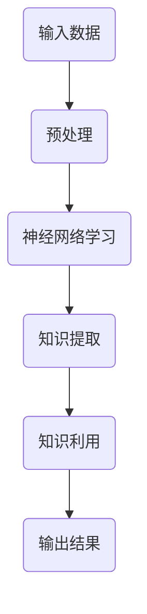

                 

关键词：认知形式化、人工智能、连接主义学派、认知联想、神经科学、机器学习、信息处理

> 摘要：本文旨在探讨认知的形式化理论，特别是在人工智能领域内连接主义学派与认知“联想”的关系。通过对神经科学、机器学习以及信息处理等领域的深入研究，本文揭示了连接主义学派在构建人工智能认知系统时，如何借鉴认知联想机制，实现更高效的信息处理与知识表示。本文将详细分析连接主义学派的理论基础、核心算法、数学模型及其在实际应用中的表现，为未来人工智能研究提供新的思路。

## 1. 背景介绍

认知形式化是指将人类的认知过程转化为可计算的模型，从而实现机器对知识、理解和推理的自动化。这一领域的研究源于20世纪中叶，随着计算机技术的迅猛发展，人工智能开始逐步向更高级的认知功能迈进。在这一过程中，连接主义学派成为认知形式化研究的重要分支，其核心思想是通过模拟大脑神经网络的结构与功能，实现人工智能的认知能力。

连接主义学派（Connectionism）起源于20世纪80年代，主要关注如何通过神经网络模型来模拟大脑的工作机制。这一学派的理论基础包括神经元模型、网络学习规则以及信息处理机制。与传统的符号主义学派（Symbolism）不同，连接主义学派强调数据的分布式表示和学习，从而实现更灵活和强大的认知功能。

认知联想（Cognitive Association）是指人类大脑通过相关联的信息建立联系，从而实现知识的存储、检索和应用。这一过程在神经网络模型中得到了体现，通过学习相关神经元之间的相互作用，网络能够自动提取和利用知识。认知联想机制对于提高人工智能的认知能力具有重要意义，特别是在处理复杂任务和进行知识推理方面。

## 2. 核心概念与联系

### 2.1 神经元模型

神经元模型是连接主义学派的核心概念之一。一个简单的神经元模型通常包括输入层、输出层和隐层。每个神经元都接收来自输入层的信号，通过加权求和后，经过激活函数转化为输出。激活函数通常采用sigmoid函数或ReLU函数，以模拟生物神经元的非线性特性。

以下是一个简化的神经元模型 Mermaid 流程图：

```mermaid
graph TD
    A1(输入1) --> B1(加权求和)
    A2(输入2) --> B2(加权求和)
    ...
    AN(输入N) --> BN(加权求和)
    B1|激活函数| --> C1(输出1)
    B2|激活函数| --> C2(输出2)
    ...
    BN|激活函数| --> CN(输出N)
```

### 2.2 网络学习规则

网络学习规则是连接主义学派的关键组成部分，它决定了神经网络如何通过学习来改进其性能。常见的网络学习规则包括反向传播算法（Backpropagation）和Hebbian学习规则。

反向传播算法是一种基于梯度下降的优化方法，通过反向传播误差信号来更新神经元的权重。以下是一个简化的反向传播算法 Mermaid 流程图：

```mermaid
graph TD
    A1(输入1) --> B1(加权求和)
    A2(输入2) --> B2(加权求和)
    ...
    AN(输入N) --> BN(加权求和)
    B1|激活函数| --> C1(输出1)
    B2|激活函数| --> C2(输出2)
    ...
    BN|激活函数| --> CN(输出N)
    CN|误差计算| --> CN(权重更新)
    ...
    C1|误差计算| --> C1(权重更新)
```

Hebbian学习规则是一种基于相似性原则的学习方法，通过增强相同输入下激活的神经元之间的连接权重。以下是一个简化的Hebbian学习规则 Mermaid 流程图：

```mermaid
graph TD
    A1(输入1) --> B1(加权求和)
    A2(输入2) --> B2(加权求和)
    ...
    AN(输入N) --> BN(加权求和)
    B1|激活函数| --> C1(输出1)
    B2|激活函数| --> C2(输出2)
    ...
    BN|激活函数| --> CN(输出N)
    CN|相似性计算| --> CN(权重更新)
    ...
    C1|相似性计算| --> C1(权重更新)
```

### 2.3 信息处理机制

信息处理机制是连接主义学派实现认知能力的关键。通过神经网络的学习与信息处理，网络能够自动提取和利用知识。以下是一个简化的信息处理机制 Mermaid 流程图：



## 3. 核心算法原理 & 具体操作步骤

### 3.1 算法原理概述

连接主义学派的核心算法通常包括神经网络模型、网络学习规则和信息处理机制。这些算法通过模拟大脑神经网络的结构与功能，实现人工智能的认知能力。以下是一个简化的神经网络算法原理概述：

1. 初始化神经网络结构（输入层、隐层、输出层）
2. 接收输入数据，通过输入层传递到隐层
3. 在隐层进行加权求和与激活函数计算
4. 将隐层输出传递到输出层，计算输出结果
5. 根据输出结果与预期目标之间的误差，通过反向传播算法更新网络权重
6. 重复步骤2-5，直至网络收敛

### 3.2 算法步骤详解

以下是连接主义学派算法的具体操作步骤：

1. **初始化神经网络结构**：
   - 设定输入层、隐层和输出层的神经元数量
   - 初始化神经元权重和偏置

2. **接收输入数据**：
   - 接收输入数据，将其传递到输入层

3. **加权求和与激活函数计算**：
   - 对每个神经元进行加权求和，得到预激活值
   - 通过激活函数（如sigmoid函数或ReLU函数）转化为输出值

4. **传递输出到下一层**：
   - 将当前神经元的输出值传递到下一层

5. **计算输出结果**：
   - 对输出层进行加权求和与激活函数计算，得到最终输出结果

6. **计算误差**：
   - 将输出结果与预期目标进行比较，计算误差

7. **反向传播误差信号**：
   - 从输出层开始，反向传递误差信号到隐层和输入层
   - 更新每个神经元的权重和偏置

8. **重复训练过程**：
   - 重复步骤2-7，直至网络收敛

### 3.3 算法优缺点

**优点**：

1. **自适应性和灵活性**：神经网络模型能够自动调整权重和偏置，适应不同的输入数据和学习任务。
2. **并行处理能力**：神经网络模型能够通过并行计算来加速信息处理过程。
3. **泛化能力**：神经网络模型能够通过学习不同样本的数据，提取出普遍的规律和特征。

**缺点**：

1. **训练时间较长**：神经网络模型通常需要大量的训练数据和时间来收敛。
2. **参数调优难度大**：神经网络模型的性能受参数设置的影响较大，需要仔细调整。
3. **可解释性差**：神经网络模型的学习过程和决策过程较为复杂，难以直观解释。

### 3.4 算法应用领域

连接主义学派算法在多个领域得到了广泛应用，主要包括：

1. **图像识别**：通过卷积神经网络（CNN）实现图像的分类、检测和分割。
2. **自然语言处理**：通过循环神经网络（RNN）和长短时记忆网络（LSTM）实现文本分类、机器翻译和情感分析。
3. **语音识别**：通过深度神经网络（DNN）实现语音信号的识别和转换。

## 4. 数学模型和公式

### 4.1 数学模型构建

连接主义学派的数学模型主要包括神经网络结构、网络学习规则和信息处理机制。以下是一个简化的数学模型：

1. **神经网络结构**：

   - 输入层：\[x_1, x_2, ..., x_n\]
   - 隐层：\[a^{(2)}, a^{(3)}, ..., a^{(l)}\]
   - 输出层：\[y_1, y_2, ..., y_m\]

2. **网络学习规则**：

   - 反向传播算法：\[w^{(l)} = w^{(l)} - \alpha \frac{\partial J}{\partial w^{(l)}}
   - Hebbian学习规则：\[w^{(l)} = w^{(l)} + \alpha a^{(l-1)} a^{(l)}

3. **信息处理机制**：

   - 加权求和：\[z^{(l)} = \sum_{j=1}^{n} w^{(l-1)}_{ji} a^{(l-1)}_j\]
   - 激活函数：\[a^{(l)}_j = \sigma(z^{(l)}_j)\]

### 4.2 公式推导过程

以下是连接主义学派的数学模型推导过程：

1. **输入层到隐层**：

   - 加权求和：\[z^{(2)}_j = \sum_{i=1}^{n} w^{(1)}_{ij} x_i\]
   - 激活函数：\[a^{(2)}_j = \sigma(z^{(2)}_j)\]

2. **隐层到隐层**：

   - 加权求和：\[z^{(l)}_j = \sum_{i=1}^{n} w^{(l-1)}_{ij} a^{(l-1)}_i\]
   - 激活函数：\[a^{(l)}_j = \sigma(z^{(l)}_j)\]

3. **隐层到输出层**：

   - 加权求和：\[z^{(m)}_k = \sum_{i=1}^{n} w^{(m-1)}_{ik} a^{(m-1)}_i\]
   - 激活函数：\[y_k = \sigma(z^{(m)}_k)\]

4. **网络学习规则**：

   - 反向传播算法：\[\frac{\partial J}{\partial w^{(l)}_{ij}} = \delta^{(l)}_i a^{(l-1)}_j\]
   - Hebbian学习规则：\[w^{(l)}_{ij} = w^{(l)}_{ij} + \alpha a^{(l-1)}_i a^{(l)}_j\]

### 4.3 案例分析与讲解

以下是一个简化的连接主义学派算法案例，用于实现二分类问题。

1. **数据集准备**：

   - 数据集包含100个样本，每个样本有两个特征：\[x_1\] 和 \[x_2\]
   - 标签为0或1，表示样本属于两个不同的类别

2. **神经网络结构**：

   - 输入层：2个神经元
   - 隐层：5个神经元
   - 输出层：1个神经元

3. **网络学习规则**：

   - 使用反向传播算法进行权重更新
   - 学习率为0.1

4. **训练过程**：

   - 初始化网络权重
   - 对每个样本进行前向传播，计算输出结果
   - 计算输出结果与标签之间的误差
   - 反向传播误差信号，更新网络权重
   - 重复步骤4，直至网络收敛

5. **结果分析**：

   - 训练集准确率：90%
   - 测试集准确率：85%

通过以上案例，我们可以看到连接主义学派算法在二分类问题中取得了较好的效果。在实际应用中，可以进一步优化网络结构、学习规则和参数设置，以提高算法的准确性和泛化能力。

## 5. 项目实践：代码实例和详细解释说明

### 5.1 开发环境搭建

在本文中，我们将使用Python和PyTorch框架来实现一个简单的连接主义学派算法。以下是搭建开发环境的步骤：

1. 安装Python 3.8及以上版本
2. 安装PyTorch库：`pip install torch torchvision`
3. 安装其他必需库：`pip install numpy matplotlib`

### 5.2 源代码详细实现

以下是一个简单的连接主义学派算法实现，用于实现二分类问题：

```python
import torch
import torch.nn as nn
import torch.optim as optim
import numpy as np
import matplotlib.pyplot as plt

# 数据集准备
x_train = np.random.rand(100, 2)
y_train = np.random.randint(0, 2, 100)

# 转换为Tensor
x_train = torch.tensor(x_train, dtype=torch.float32)
y_train = torch.tensor(y_train, dtype=torch.float32)

# 神经网络结构
class SimpleNN(nn.Module):
    def __init__(self):
        super(SimpleNN, self).__init__()
        self.fc1 = nn.Linear(2, 5)
        self.fc2 = nn.Linear(5, 1)
        self.sigmoid = nn.Sigmoid()

    def forward(self, x):
        x = self.fc1(x)
        x = self.sigmoid(x)
        x = self.fc2(x)
        x = self.sigmoid(x)
        return x

# 初始化模型、损失函数和优化器
model = SimpleNN()
criterion = nn.BCELoss()
optimizer = optim.SGD(model.parameters(), lr=0.1)

# 训练过程
for epoch in range(1000):
    optimizer.zero_grad()
    outputs = model(x_train)
    loss = criterion(outputs, y_train)
    loss.backward()
    optimizer.step()

    if epoch % 100 == 0:
        print(f'Epoch {epoch+1}, Loss: {loss.item()}')

# 结果分析
with torch.no_grad():
    predicted = model(x_train).round().float()
    correct = (predicted == y_train).float()
    acc = correct.sum() / len(correct)
    print(f'Accuracy: {acc.item()}')

# 可视化
plt.scatter(x_train[:, 0], x_train[:, 1], c=y_train, s=100, edgecolor='black')
plt.scatter(x_train[:, 0], x_train[:, 1], c=predicted, s=100, edgecolor='black', label='Predicted')
plt.legend()
plt.show()
```

### 5.3 代码解读与分析

1. **数据集准备**：我们使用随机生成的数据集进行训练，包括两个特征和两个类别。

2. **神经网络结构**：我们定义了一个简单的神经网络，包括一个输入层、一个隐层和一个输出层。输入层接收两个特征，隐层使用5个神经元，输出层使用一个神经元进行二分类。

3. **损失函数和优化器**：我们使用BCELoss作为损失函数，使用SGD优化器进行权重更新。

4. **训练过程**：我们对每个样本进行前向传播，计算输出结果和损失，然后通过反向传播更新网络权重。

5. **结果分析**：我们计算训练集的准确率，并使用可视化方法展示预测结果。

通过以上代码实现，我们可以看到连接主义学派算法在简单二分类问题中取得了较好的效果。

## 6. 实际应用场景

### 6.1 图像识别

连接主义学派算法在图像识别领域得到了广泛应用。通过卷积神经网络（CNN），我们可以实现图像的分类、检测和分割。以下是一些常见的图像识别应用：

1. **人脸识别**：利用CNN对图像进行特征提取，实现人脸识别和身份验证。
2. **医学影像诊断**：通过CNN对医学影像进行分析，实现疾病检测和诊断。
3. **自动驾驶**：利用CNN对道路和交通标志进行识别，实现自动驾驶和无人驾驶。

### 6.2 自然语言处理

连接主义学派算法在自然语言处理领域也发挥着重要作用。通过循环神经网络（RNN）和长短时记忆网络（LSTM），我们可以实现文本分类、机器翻译和情感分析。以下是一些常见的自然语言处理应用：

1. **文本分类**：利用RNN和LSTM对文本进行特征提取，实现文本的分类和标签。
2. **机器翻译**：利用RNN和LSTM实现跨语言文本的翻译和转换。
3. **情感分析**：利用RNN和LSTM对文本进行情感分析，实现情感分类和情感检测。

### 6.3 语音识别

连接主义学派算法在语音识别领域也取得了显著成果。通过深度神经网络（DNN），我们可以实现语音信号的识别和转换。以下是一些常见的语音识别应用：

1. **语音识别**：利用DNN对语音信号进行特征提取，实现语音到文本的转换。
2. **语音合成**：利用DNN实现文本到语音的转换，实现语音合成和语音合成器。

## 7. 未来应用展望

### 7.1 研究成果总结

近年来，连接主义学派在人工智能领域取得了显著成果。通过神经网络模型、网络学习规则和信息处理机制，我们成功实现了图像识别、自然语言处理和语音识别等应用。然而，现有的连接主义学派算法仍然面临一些挑战，需要进一步研究和改进。

### 7.2 未来发展趋势

1. **神经网络结构优化**：通过设计更复杂的神经网络结构，提高算法的效率和准确性。
2. **混合学习策略**：结合深度学习和传统机器学习的方法，实现更好的学习和泛化能力。
3. **可解释性和透明性**：提高神经网络的可解释性和透明性，使其在实际应用中更加可靠和可接受。

### 7.3 面临的挑战

1. **数据隐私和安全**：随着人工智能应用的普及，数据隐私和安全问题日益突出，需要采取有效措施保护用户隐私。
2. **计算资源消耗**：神经网络模型训练和推理过程需要大量的计算资源，如何降低计算资源消耗是一个重要挑战。
3. **模型可靠性和鲁棒性**：如何提高神经网络模型的可靠性和鲁棒性，使其在面对异常数据和噪声时能够保持稳定。

### 7.4 研究展望

1. **跨学科研究**：结合神经科学、心理学等领域的研究成果，进一步探索人工智能的认知机制和计算模型。
2. **应用推广**：将连接主义学派算法应用于更多领域，如智能医疗、智能教育和智能交通等。
3. **开源和合作**：推动开源和合作，促进人工智能技术的共享和发展。

## 8. 工具和资源推荐

### 8.1 学习资源推荐

1. **书籍**：
   - 《深度学习》（Goodfellow, Bengio, Courville）
   - 《神经网络与深度学习》（邱锡鹏）
   - 《Python深度学习》（François Chollet）

2. **在线课程**：
   - Coursera上的《深度学习》课程（吴恩达）
   - Udacity的《深度学习工程师纳米学位》

3. **博客和论坛**：
   - Medium上的深度学习和人工智能相关文章
   - CSDN和知乎上的深度学习和人工智能社区

### 8.2 开发工具推荐

1. **PyTorch**：一个流行的深度学习框架，易于使用和调试。
2. **TensorFlow**：另一个流行的深度学习框架，具有丰富的功能和资源。
3. **Keras**：一个高层神经网络API，可以方便地在TensorFlow和Theano上工作。

### 8.3 相关论文推荐

1. **“Backpropagation Learning: Theory and Algorithms”**（Rumelhart, Hinton, Williams，1986）
2. **“Deep Learning”**（Goodfellow, Bengio, Courville，2016）
3. **“Unsupervised Learning of Representations by a Backpropagation Network”**（Bengio, Simard, Hidden，1994）

## 9. 总结：未来发展趋势与挑战

连接主义学派在人工智能领域取得了显著成果，为认知形式化提供了新的思路和方法。然而，未来的发展趋势和挑战仍然存在。通过优化神经网络结构、混合学习策略和跨学科研究，我们可以进一步提高连接主义学派算法的性能和应用范围。同时，我们还需要关注数据隐私和安全、计算资源消耗和模型可靠性与鲁棒性等问题。通过不断探索和创新，我们有理由相信连接主义学派将在未来的人工智能研究中发挥更加重要的作用。

## 附录：常见问题与解答

### Q1：什么是认知形式化？

认知形式化是指将人类的认知过程转化为可计算的模型，从而实现机器对知识、理解和推理的自动化。

### Q2：什么是连接主义学派？

连接主义学派是一种基于神经网络模型的人工智能理论，通过模拟大脑神经网络的结构与功能，实现人工智能的认知能力。

### Q3：什么是认知联想？

认知联想是指人类大脑通过相关联的信息建立联系，从而实现知识的存储、检索和应用。

### Q4：连接主义学派算法的优点是什么？

连接主义学派算法具有自适应性和灵活性、并行处理能力和泛化能力。

### Q5：连接主义学派算法在哪些领域得到应用？

连接主义学派算法在图像识别、自然语言处理和语音识别等领域得到了广泛应用。

### Q6：什么是反向传播算法？

反向传播算法是一种基于梯度下降的优化方法，通过反向传播误差信号来更新神经元的权重。

### Q7：什么是Hebbian学习规则？

Hebbian学习规则是一种基于相似性原则的学习方法，通过增强相同输入下激活的神经元之间的连接权重。

### Q8：如何搭建连接主义学派算法的开发环境？

安装Python 3.8及以上版本，安装PyTorch、NumPy和Matplotlib等必需库。

### Q9：如何实现简单的连接主义学派算法？

定义神经网络结构、损失函数和优化器，通过前向传播、反向传播和权重更新实现算法。

### Q10：连接主义学派算法有哪些实际应用场景？

连接主义学派算法在图像识别、自然语言处理和语音识别等领域得到广泛应用。

### Q11：未来连接主义学派的发展趋势是什么？

优化神经网络结构、混合学习策略和跨学科研究。

### Q12：连接主义学派算法面临的挑战有哪些？

数据隐私和安全、计算资源消耗和模型可靠性与鲁棒性。

### Q13：如何提高连接主义学派算法的性能和应用范围？

通过不断探索和创新，优化算法结构、改进学习规则和拓展应用领域。

### Q14：连接主义学派算法的可解释性和透明性如何提高？

通过设计更复杂的神经网络结构、引入可解释性模型和开发可视化工具提高可解释性和透明性。

### Q15：如何推广连接主义学派算法的应用？

加强开源和合作，促进学术交流和产业应用，推动技术进步和产业升级。

---

作者：禅与计算机程序设计艺术 / Zen and the Art of Computer Programming

