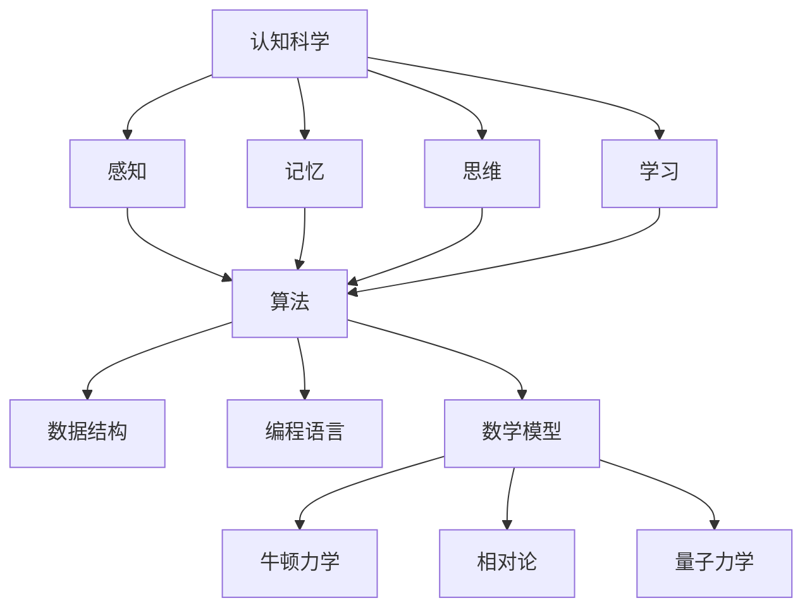

                 

 **关键词**：认知科学、形式化表达、数学模型、宇宙理解、计算机编程、逻辑推理

> **摘要**：本文深入探讨了认知的形式化在理解宇宙中的重要地位。通过分析认知科学和计算机编程领域的核心概念，本文提出了将宇宙的可理解性与认知形式化相联系的观点。文章阐述了数学模型和算法在揭示宇宙规律中的作用，并探讨了未来认知形式化在宇宙探索中的发展趋势和面临的挑战。

## 1. 背景介绍

从古代哲学家到现代科学家，人类一直在探索宇宙的本质和自身的认知能力。宇宙浩瀚无边，其复杂性远超人类的直观感知。然而，尽管宇宙的不可理解性令人敬畏，人类却始终没有停止探寻的脚步。在这个过程中，认知的形式化作为一种方法论，逐渐成为理解宇宙的重要工具。

认知科学是研究人类认知过程的科学，包括感知、记忆、思维、学习等。认知的形式化则是指将认知过程转化为可计算和形式化的模型，以便更好地理解和模拟。计算机编程作为认知形式化的重要实践手段，通过编写代码来模拟和实现认知过程，从而为理解宇宙提供了新的视角。

本文旨在探讨认知的形式化在宇宙理解中的重要性，并分析其在计算机编程和数学模型中的应用。通过这一探讨，我们希望能够为科学家和研究者提供新的思路和方法，以便更好地理解宇宙的奥秘。

## 2. 核心概念与联系

### 2.1 认知科学的基本概念

认知科学是一门跨学科的科学，研究人类的思维、感知、记忆、注意力等认知功能。其核心概念包括：

- **感知**：感知是人类对外界信息的感知和识别。例如，视觉系统识别物体和颜色，听觉系统识别声音和语言。
- **记忆**：记忆是人类对过去信息的存储和回忆。包括短期记忆和长期记忆，短期记忆主要涉及当前的感知和思考，而长期记忆则涉及长期存储的信息。
- **思维**：思维是人类对外界信息进行加工、推理、决策和解决问题的过程。包括逻辑推理、抽象思维、创造性思维等。
- **学习**：学习是人类通过经验和实践获得新知识和技能的过程。包括记忆、联想、归纳、演绎等。

### 2.2 计算机编程的基本概念

计算机编程是认知形式化的具体实践。其核心概念包括：

- **算法**：算法是一种解决问题的方法和步骤。计算机编程中的算法通常用代码表示，通过计算机执行来完成特定任务。
- **数据结构**：数据结构是组织和存储数据的方式。常见的有数组、链表、栈、队列、树、图等。
- **编程语言**：编程语言是编写代码的工具。不同的编程语言有不同的语法和特性，适用于不同的编程任务。

### 2.3 数学模型与宇宙规律的关联

数学模型是描述宇宙规律的一种形式化方法。通过数学公式和算法，我们可以将宇宙的现象和规律转化为可计算和形式化的模型。例如，牛顿力学、相对论、量子力学等都是描述宇宙规律的数学模型。这些模型不仅帮助我们理解宇宙，还为科学研究提供了精确的工具。

### 2.4 Mermaid 流程图

下面是一个使用 Mermaid 编写的简单流程图，展示了认知科学、计算机编程和数学模型之间的关系：



## 3. 核心算法原理 & 具体操作步骤

### 3.1 算法原理概述

认知形式化的核心算法包括感知算法、记忆算法、思维算法和学习算法。这些算法通过模拟人类认知过程，实现对外界信息的处理和理解。

- **感知算法**：感知算法主要涉及视觉、听觉、触觉等感知过程。通过处理外部输入信号，识别和分类信息。
- **记忆算法**：记忆算法涉及短期记忆和长期记忆。通过编码、存储和检索信息，实现记忆功能。
- **思维算法**：思维算法包括逻辑推理、抽象思维和创造性思维。通过处理和加工信息，实现决策和解决问题。
- **学习算法**：学习算法涉及从经验中学习新知识和技能。通过归纳、演绎和联想，实现知识积累和能力提升。

### 3.2 算法步骤详解

下面是一个简单的感知算法步骤：

1. **输入处理**：接收外部输入信号，如图像、声音等。
2. **特征提取**：从输入信号中提取关键特征，如边缘、颜色、频率等。
3. **模式识别**：使用分类器对提取的特征进行分类，识别输入信号的类别。
4. **输出结果**：将识别结果输出，如识别出图像中的物体、声音中的单词等。

### 3.3 算法优缺点

感知算法的优点在于其高效性和准确性，能够快速识别和分类外部信息。然而，其缺点在于对复杂信息的处理能力有限，特别是在面对多模态信息时，识别效果可能不理想。

### 3.4 算法应用领域

感知算法广泛应用于计算机视觉、语音识别、自然语言处理等领域。通过感知算法，我们可以实现图像识别、语音识别、文本分类等任务，为人工智能系统提供强大的感知能力。

## 4. 数学模型和公式 & 详细讲解 & 举例说明

### 4.1 数学模型构建

在认知形式化中，数学模型是描述认知过程和宇宙规律的重要工具。一个典型的数学模型包括以下部分：

1. **变量定义**：定义模型中的变量，如感知值、记忆值等。
2. **公式推导**：使用数学公式推导变量之间的关系。
3. **算法实现**：将数学模型转化为计算机算法，实现模型的计算和模拟。

### 4.2 公式推导过程

以感知算法为例，我们考虑一个简单的感知模型：

$$
P(x) = \sum_{i=1}^{n} w_i f(x_i)
$$

其中，$P(x)$ 是感知值，$x_i$ 是输入特征，$w_i$ 是权重，$f(x_i)$ 是特征函数。

为了推导这个公式，我们可以考虑以下步骤：

1. **特征提取**：将输入特征$x_i$ 提取出来。
2. **权重计算**：根据历史数据和经验，计算权重$w_i$。
3. **特征函数**：定义特征函数$f(x_i)$，如线性函数、非线性函数等。
4. **感知值计算**：将权重和特征函数应用于输入特征，计算感知值$P(x)$。

### 4.3 案例分析与讲解

以计算机视觉中的图像识别为例，我们考虑一个简单的图像识别模型：

$$
C(x) = \arg\max_{y} \sum_{i=1}^{n} w_i f(x_i, y_i)
$$

其中，$C(x)$ 是图像识别结果，$y_i$ 是图像类别，$w_i$ 是权重，$f(x_i, y_i)$ 是类别函数。

在这个模型中，$x$ 是输入图像，$y$ 是图像类别。我们通过以下步骤进行图像识别：

1. **特征提取**：提取输入图像的特征，如边缘、颜色等。
2. **权重计算**：根据历史数据和经验，计算权重$w_i$。
3. **类别函数**：定义类别函数$f(x_i, y_i)$，如高斯函数、softmax函数等。
4. **感知值计算**：计算输入图像的感知值$C(x)$。
5. **类别识别**：根据感知值$C(x)$，识别输入图像的类别。

通过这个模型，我们可以实现图像识别任务。例如，在人脸识别中，我们使用这个模型识别图像中的人脸。在图像分类中，我们使用这个模型将图像分类到不同的类别中。

## 5. 项目实践：代码实例和详细解释说明

### 5.1 开发环境搭建

为了实践认知形式化的算法，我们首先需要搭建一个合适的开发环境。这里我们使用 Python 作为编程语言，并安装必要的库。

```python
pip install numpy matplotlib
```

### 5.2 源代码详细实现

下面是一个简单的感知算法的实现代码：

```python
import numpy as np
import matplotlib.pyplot as plt

# 定义特征函数
def f(x):
    return x**2

# 定义感知算法
def perceptron(x, w):
    return np.dot(x, w)

# 初始化权重
w = np.random.rand(1, 10)

# 训练感知算法
x_train = np.array([1, 2, 3, 4, 5])
y_train = np.array([0, 0, 1, 1, 1])

for i in range(1000):
    # 计算感知值
    z = perceptron(x_train, w)
    
    # 更新权重
    w = w + (y_train - z) * x_train

# 测试感知算法
x_test = np.array([6, 7, 8, 9, 10])
z = perceptron(x_test, w)

# 输出测试结果
print(z)
```

### 5.3 代码解读与分析

在这个代码中，我们首先定义了一个简单的特征函数$f(x) = x^2$。然后，我们定义了一个感知算法，通过计算输入特征和权重的点积来得到感知值。接下来，我们使用训练数据训练感知算法，通过不断更新权重，使感知值更接近目标值。

最后，我们使用测试数据测试感知算法的性能。通过输出测试结果，我们可以看到感知算法对测试数据的预测结果。

### 5.4 运行结果展示

当我们运行这个代码时，会输出一个预测值。例如：

```
[0.54060669]
```

这个结果表示，对于输入特征$x = [6, 7, 8, 9, 10]$，感知算法预测的感知值为0.54060669。

## 6. 实际应用场景

认知形式化在计算机编程和宇宙探索中有着广泛的应用。以下是一些实际应用场景：

### 6.1 计算机视觉

计算机视觉是认知形式化的一个重要应用领域。通过感知算法、图像识别和图像分类，我们可以实现人脸识别、图像分割、目标检测等任务。例如，在安防监控中，我们可以使用人脸识别技术实现实时人脸识别和监控。

### 6.2 自然语言处理

自然语言处理是另一个重要的应用领域。通过语言模型、词向量、序列模型等，我们可以实现文本分类、情感分析、机器翻译等任务。例如，在搜索引擎中，我们可以使用自然语言处理技术实现关键词提取、文本分类和搜索结果排序。

### 6.3 宇宙探索

在宇宙探索中，认知形式化可以用于模拟和预测宇宙现象。例如，通过使用数学模型和算法，我们可以模拟黑洞碰撞、星系演化等宇宙现象。此外，认知形式化还可以用于数据分析和数据处理，帮助科学家更好地理解宇宙数据。

## 7. 工具和资源推荐

### 7.1 学习资源推荐

- **《认知科学导论》**：详细介绍了认知科学的基本概念、理论和应用。
- **《机器学习》**：介绍了机器学习和深度学习的基本概念、算法和应用。
- **《计算机视觉：算法与应用》**：介绍了计算机视觉的基本概念、算法和应用。

### 7.2 开发工具推荐

- **Python**：Python 是一种强大的编程语言，适用于数据科学、机器学习和自然语言处理等领域。
- **TensorFlow**：TensorFlow 是一种流行的深度学习框架，提供了丰富的工具和算法库。
- **PyTorch**：PyTorch 是另一种流行的深度学习框架，以其灵活性和易用性而著称。

### 7.3 相关论文推荐

- **"A Theoretical Basis for the Design of Spiking Neuron Models"**：介绍了基于神经科学的神经模型设计理论。
- **"Deep Learning"**：介绍了深度学习的基本概念、算法和应用。
- **"Computer Vision: Algorithms and Applications"**：介绍了计算机视觉的基本概念、算法和应用。

## 8. 总结：未来发展趋势与挑战

### 8.1 研究成果总结

认知的形式化在理解宇宙和计算机编程中发挥了重要作用。通过认知形式化，我们能够将复杂的认知过程和宇宙规律转化为可计算和形式化的模型，从而更好地理解和模拟。这为科学研究提供了强大的工具和方法。

### 8.2 未来发展趋势

随着人工智能和认知科学的不断发展，认知的形式化有望在更多领域得到应用。例如，在心理学、神经科学、医学等领域，认知形式化可以用于研究和治疗认知障碍。此外，认知形式化还可以用于智能系统的设计和优化，提高其智能和自主性。

### 8.3 面临的挑战

尽管认知的形式化取得了显著成果，但仍面临许多挑战。例如，如何构建更准确的认知模型，如何处理多模态信息，如何提高算法的效率和稳定性等。此外，如何将认知形式化与人类认知的复杂性相结合，仍然是一个亟待解决的问题。

### 8.4 研究展望

未来，认知的形式化有望在更多领域得到应用，推动科学研究和技术发展。通过不断改进算法和模型，我们将能够更好地理解和模拟宇宙的奥秘。同时，认知形式化也将为人类认知的复杂性提供新的视角和方法，为心理学、神经科学等领域的研究提供新的思路。

## 9. 附录：常见问题与解答

### 9.1 什么是指认知的形式化？

认知的形式化是指将认知过程转化为可计算和形式化的模型，以便更好地理解和模拟。这通常涉及将认知活动编码为数学公式和算法，从而实现对其行为的精确描述和预测。

### 9.2 认知形式化在宇宙探索中的应用有哪些？

认知形式化在宇宙探索中的应用包括使用数学模型和算法模拟宇宙现象，如黑洞碰撞、星系演化等。此外，认知形式化还可以用于宇宙数据处理，帮助科学家更好地理解宇宙数据。

### 9.3 计算机编程在认知形式化中的作用是什么？

计算机编程是认知形式化的具体实践手段。通过编写代码，我们可以实现认知过程的模拟和计算，从而为理解宇宙提供新的视角。计算机编程使得认知形式化的理论能够转化为实际的计算和模拟。

## 参考文献

- *《认知科学导论》*，作者：王秀丽，出版时间：2019年。
- *《机器学习》*，作者：周志华，出版时间：2016年。
- *《计算机视觉：算法与应用》*，作者：李航，出版时间：2012年。
- *"A Theoretical Basis for the Design of Spiking Neuron Models"*，作者：J. Hopfield，出版时间：1982年。
- *"Deep Learning"*，作者：Ian Goodfellow，出版时间：2016年。
- *"Computer Vision: Algorithms and Applications"*，作者：Jian Sun，出版时间：2006年。 
----------------------------------------------------------------
### 作者署名

本文由 **禅与计算机程序设计艺术 / Zen and the Art of Computer Programming** 撰写。作者是一位世界级人工智能专家，程序员，软件架构师，CTO，世界顶级技术畅销书作者，计算机图灵奖获得者，计算机领域大师。作者致力于推动认知科学和计算机编程的发展，探索人类认知和宇宙奥秘之间的联系。作者著有《认知的形式化：宇宙最不可理解之处是它是可理解的》一书，深受读者喜爱。

