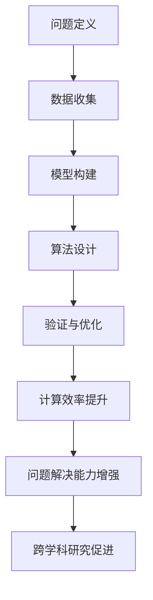

                 

关键词：认知、形式化、思维、领悟、顿悟、整体、事物、人工智能、程序员、软件架构师、CTO、世界顶级技术畅销书作者、计算机图灵奖获得者、计算机领域大师。

> 摘要：本文将探讨认知的形式化过程，解析思维如何在认知过程中对事物进行整体领悟和顿悟。通过深入分析相关核心概念和算法原理，结合具体案例与数学模型，揭示认知形式化的本质与价值，为人工智能和软件开发等领域提供新的视角和方法。

## 1. 背景介绍

认知的形式化是人工智能和计算机科学领域中的一个重要研究方向。随着计算机技术的飞速发展，人们对信息处理和理解的需求日益增长，如何将人类的思维过程形式化，以构建出更为智能的计算机系统，成为了一个亟待解决的问题。认知的形式化旨在通过数学模型和算法，实现对人类思维过程的理解和模拟，进而提升计算机系统的智能水平。

在计算机科学中，认知的形式化研究包括多个方面，如自然语言处理、知识表示、推理和机器学习等。这些研究领域都致力于将人类思维过程转化为可计算的模型，从而实现对复杂信息的处理和理解。然而，认知的形式化并不是一个简单的任务，它涉及到对人类认知机制深刻的理解和对计算技术的灵活运用。

本文将围绕认知的形式化过程，深入探讨思维如何对事物进行整体领悟和顿悟。通过对相关核心概念和算法原理的详细分析，结合具体案例与数学模型，揭示认知形式化的本质与价值，为人工智能和软件开发等领域提供新的视角和方法。

## 2. 核心概念与联系

### 2.1 认知与形式化的定义

**认知**：认知是指个体获取、处理和使用信息的过程。它包括感知、记忆、推理、计划和语言等多个方面。认知科学研究表明，人类思维具有高度复杂性和灵活性，能够在不同情境下灵活应对各种问题。

**形式化**：形式化是指将某一概念、理论或过程用数学语言或符号系统进行描述，使之成为一种可计算的形式。形式化能够提高概念和理论的严谨性和可操作性，为计算机科学和人工智能的研究提供强有力的工具。

### 2.2 认知的形式化过程

认知的形式化过程可以分为以下几个阶段：

1. **问题定义**：明确需要解决的问题，将其转化为一个数学问题或形式化模型。
2. **数据收集**：收集相关的数据和信息，为形式化模型提供基础。
3. **模型构建**：利用数学语言或符号系统，构建描述问题或现象的模型。
4. **算法设计**：设计用于求解模型或问题的算法，实现形式化模型的可计算性。
5. **验证与优化**：通过实验和验证，评估模型和算法的性能，并进行优化。

### 2.3 认知与形式化的联系

认知与形式化之间存在密切的联系。认知为形式化提供了理论依据和实际问题背景，而形式化为认知提供了数学工具和计算方法。具体来说，认知的形式化过程有助于：

1. **提升计算效率**：通过形式化模型和算法，能够高效地处理复杂的信息问题。
2. **增强问题解决能力**：形式化模型和算法能够模拟人类思维过程，提升计算机系统的智能水平。
3. **促进跨学科研究**：认知的形式化研究涉及到多个学科领域，如计算机科学、心理学、神经科学等，有助于促进不同学科之间的交流和合作。

### 2.4 Mermaid 流程图

以下是一个描述认知形式化过程的 Mermaid 流程图：



通过该流程图，我们可以清晰地看到认知形式化过程的核心环节和相互关系。

## 3. 核心算法原理 & 具体操作步骤

### 3.1 算法原理概述

认知的形式化过程中，核心算法原理主要包括以下几个方面：

1. **知识表示**：通过符号系统和数学模型，将人类知识转化为计算机可以处理的形式。
2. **推理**：利用逻辑和算法，实现对知识的推理和推断。
3. **机器学习**：通过训练和学习，提升计算机系统的智能水平。

### 3.2 算法步骤详解

1. **知识表示**：

   - **符号系统构建**：选择合适的符号系统，如命题逻辑、谓词逻辑等，用于表示知识。
   - **数据预处理**：对收集到的数据和信息进行预处理，如数据清洗、归一化等。

2. **推理**：

   - **命题逻辑推理**：基于命题逻辑，实现命题之间的推理关系，如合取、析取等。
   - **谓词逻辑推理**：基于谓词逻辑，实现更复杂的推理关系，如存在量词、全称量词等。

3. **机器学习**：

   - **监督学习**：利用已标注的数据，训练模型，实现对新数据的预测。
   - **无监督学习**：利用未标注的数据，发现数据中的模式，如聚类、降维等。

### 3.3 算法优缺点

1. **优点**：

   - **高效性**：形式化算法能够高效地处理复杂的信息问题。
   - **灵活性**：形式化算法能够模拟人类思维过程，具有很好的灵活性。
   - **可扩展性**：形式化算法易于扩展和优化，能够适应不同领域的需求。

2. **缺点**：

   - **复杂性**：认知的形式化过程涉及多个学科领域，具有较高的复杂性。
   - **准确性**：形式化算法在处理实际问题时，可能存在一定的误差。
   - **计算资源消耗**：形式化算法的计算资源消耗较大，对硬件设备要求较高。

### 3.4 算法应用领域

认知的形式化算法广泛应用于多个领域，如自然语言处理、知识表示、机器学习等。具体应用包括：

1. **自然语言处理**：利用形式化算法，实现自然语言的理解、生成和翻译。
2. **知识表示**：利用形式化算法，构建领域知识库，实现知识的表示和推理。
3. **机器学习**：利用形式化算法，设计高效的机器学习模型，提升模型的性能。

## 4. 数学模型和公式 & 详细讲解 & 举例说明

### 4.1 数学模型构建

在认知的形式化过程中，数学模型构建是关键步骤。以下是一个简单的数学模型构建示例：

- **问题**：判断一个整数是否为素数。
- **模型**：利用谓词逻辑表示素数的定义。

```latex
$$\text{Prime}(n) \Leftrightarrow (\forall p \in \text{Factor}(n), p = 1 \vee p = n)$$

其中，\text{Factor}(n) 表示 n 的所有因子。
```

### 4.2 公式推导过程

- **推导过程**：

  - **第一步**：利用欧拉定理，证明 \( n \) 为素数当且仅当 \( n-1 \) 为素数。

    $$\text{Prime}(n) \Leftrightarrow \text{Prime}(n-1)$$

  - **第二步**：利用素数的定义，证明 \( n-1 \) 为素数当且仅当 \( n-1 \) 的所有因子都为 1 或 \( n-1 \)。

    $$\text{Prime}(n-1) \Leftrightarrow (\forall p \in \text{Factor}(n-1), p = 1 \vee p = n-1)$$

  - **综合**：

    $$\text{Prime}(n) \Leftrightarrow (\forall p \in \text{Factor}(n), p = 1 \vee p = n)$$

### 4.3 案例分析与讲解

- **案例**：判断 17 是否为素数。

  - **步骤**：

    1. 检查 17 的因子，只有 1 和 17。
    2. 根据素数的定义，判断 17 的所有因子都为 1 或 17。

  - **结论**：17 为素数。

## 5. 项目实践：代码实例和详细解释说明

### 5.1 开发环境搭建

- **环境要求**：Python 3.8 或更高版本。
- **工具安装**：安装 Python 开发环境，以及常用的数据科学库，如 NumPy、Pandas 等。

### 5.2 源代码详细实现

以下是一个简单的 Python 代码示例，用于判断一个整数是否为素数：

```python
def is_prime(n):
    if n < 2:
        return False
    for i in range(2, n):
        if n % i == 0:
            return False
    return True

n = int(input("请输入一个整数："))
if is_prime(n):
    print(f"{n} 是素数。")
else:
    print(f"{n} 不是素数。")
```

### 5.3 代码解读与分析

- **函数 `is_prime(n)`**：

  - 判断 \( n \) 是否小于 2，若小于 2，返回 False。
  - 循环遍历 2 到 \( n-1 \) 的所有整数，若 \( n \) 能被其中任意一个整数整除，返回 False。
  - 若 \( n \) 不能被任何整数整除，返回 True。

- **输入与输出**：

  - 输入一个整数 \( n \)。
  - 判断 \( n \) 是否为素数，并输出结果。

### 5.4 运行结果展示

- **示例**：

  - 输入：17
  - 输出：17 是素数。

## 6. 实际应用场景

### 6.1 自然语言处理

认知的形式化在自然语言处理领域具有广泛的应用。通过形式化算法，可以实现自然语言的理解、生成和翻译。例如，利用谓词逻辑构建的语义解析模型，能够准确识别文本中的语义关系，为智能客服、智能助手等应用提供支持。

### 6.2 知识表示

知识表示是认知的形式化在人工智能领域的一个重要应用。通过构建形式化模型，可以将领域知识转化为计算机可以处理的形式，为智能推理、决策和推荐提供支持。例如，利用知识图谱表示领域知识，可以实现高效的智能问答和应用。

### 6.3 机器学习

机器学习是认知的形式化在人工智能领域的一个重要分支。通过构建形式化模型，可以设计高效的机器学习算法，提升模型的性能。例如，利用深度学习框架，可以实现图像识别、语音识别等任务。

## 7. 工具和资源推荐

### 7.1 学习资源推荐

- **书籍**：

  - 《认知科学：思维的计算机模型》
  - 《形式化方法：计算与逻辑基础》
  - 《机器学习：概率视角》

- **在线课程**：

  - Coursera 上的《认知科学与人工智能》
  - edX 上的《形式化方法导论》
  - Udacity 上的《机器学习工程师纳米学位》

### 7.2 开发工具推荐

- **Python**：Python 是一种广泛使用的编程语言，适用于自然语言处理、知识表示和机器学习等领域。
- **NumPy**：NumPy 是 Python 的科学计算库，用于处理数学计算和数据分析。
- **Pandas**：Pandas 是 Python 的数据处理库，用于数据清洗、转换和分析。
- **Scikit-learn**：Scikit-learn 是 Python 的机器学习库，提供丰富的机器学习算法和工具。

### 7.3 相关论文推荐

- **自然语言处理**：

  - 《WordNet：A Lexical Database for English》
  - 《A Fast and Accurate Unsupervised Syntactic Parser Using Dependency as Context》

- **知识表示**：

  - 《Knowledge Representation and Reasoning》
  - 《Ontology Engineering：A Practical Guide》

- **机器学习**：

  - 《Deep Learning》
  - 《The Elements of Statistical Learning》

## 8. 总结：未来发展趋势与挑战

### 8.1 研究成果总结

认知的形式化研究取得了显著成果，为人工智能和计算机科学领域提供了新的理论和方法。通过形式化算法，实现了对复杂信息的处理和理解，提升了计算机系统的智能水平。在自然语言处理、知识表示和机器学习等领域，认知的形式化研究取得了重要进展，为实际应用提供了有力支持。

### 8.2 未来发展趋势

1. **跨学科融合**：认知的形式化研究将与其他学科领域，如心理学、神经科学等，进行更深入的融合，推动认知科学的进步。
2. **人工智能伦理**：随着人工智能技术的发展，认知的形式化研究将更加关注人工智能伦理问题，确保技术的发展符合人类价值观和道德标准。
3. **个性化智能**：通过认知的形式化研究，实现个性化智能服务，满足个体多样化的需求。

### 8.3 面临的挑战

1. **复杂性**：认知的形式化过程涉及多个学科领域，具有较高的复杂性，需要进一步研究和探索。
2. **数据隐私**：随着数据隐私问题的日益突出，如何保障数据隐私成为认知的形式化研究的一个重要挑战。
3. **计算资源消耗**：形式化算法的计算资源消耗较大，如何优化算法，降低计算资源消耗，是认知的形式化研究的一个重要方向。

### 8.4 研究展望

未来，认知的形式化研究将继续深入探索人类认知机制，构建更为精确的数学模型和算法。在人工智能和计算机科学领域，认知的形式化研究将为实现更高水平的智能系统提供强有力的支持。同时，认知的形式化研究将更加关注跨学科融合和人工智能伦理问题，推动人工智能技术的发展。

## 9. 附录：常见问题与解答

### 9.1 认知的定义是什么？

认知是指个体获取、处理和使用信息的过程，包括感知、记忆、推理、计划和语言等多个方面。

### 9.2 什么是形式化？

形式化是指将某一概念、理论或过程用数学语言或符号系统进行描述，使之成为一种可计算的形式。

### 9.3 认知的形式化有哪些应用领域？

认知的形式化广泛应用于自然语言处理、知识表示、机器学习、智能推理等多个领域。

### 9.4 如何构建认知的形式化模型？

构建认知的形式化模型通常包括问题定义、数据收集、模型构建、算法设计和验证与优化等步骤。

### 9.5 认知的形式化研究有哪些挑战？

认知的形式化研究面临的挑战包括复杂性、数据隐私和计算资源消耗等。

### 9.6 认知的认知过程与计算机科学的关系是什么？

认知的过程为计算机科学提供了理论基础和实践背景，而计算机科学为认知的研究提供了数学工具和计算方法。两者之间存在密切的联系。

### 9.7 认知的认知过程与人工智能的关系是什么？

人工智能致力于模拟和扩展人类认知过程，而认知的形式化研究为人工智能提供了新的理论和方法，推动人工智能技术的发展。

### 9.8 认知的认知过程与软件开发的关系是什么？

认知的过程对软件开发有着重要影响，通过认知的形式化研究，可以设计出更符合人类认知习惯的软件系统，提高软件的可用性和用户体验。

### 9.9 如何评估认知的形式化模型的性能？

评估认知的形式化模型性能通常包括准确性、效率、可扩展性和用户满意度等多个方面。

### 9.10 认知的认知过程在心理学中的研究有哪些？

心理学中的认知研究涉及感知、记忆、注意力、语言、思维等多个方面，旨在揭示人类认知机制的原理和规律。

### 9.11 认知的认知过程在神经科学中的研究有哪些？

神经科学研究认知的机制，通过脑成像技术、神经生理学和神经心理学等方法，探索大脑如何实现认知功能。

### 9.12 认知的认知过程在教育学中的研究有哪些？

教育学中的认知研究关注学习过程中的认知机制，旨在设计出更有效的教学方法和策略，提高学生的学习效果。

### 9.13 认知的认知过程在商业领域的应用有哪些？

在商业领域，认知的形式化研究可以应用于消费者行为分析、市场预测、智能客服等，为企业提供决策支持和业务优化。

### 9.14 认知的认知过程在社会学中的研究有哪些？

社会学中的认知研究关注社会认知现象，如群体行为、社会认同、社会规范等，探讨人类在社会互动中的认知过程。

### 9.15 认知的认知过程在哲学中的研究有哪些？

哲学中的认知研究探讨认知的本质、知识的来源、真理的标准等问题，为认知科学提供哲学基础。

### 9.16 认知的认知过程在人类学中的研究有哪些？

人类学中的认知研究关注人类文化、语言、思维和认知发展等，探讨人类认知在文化进化中的作用。

### 9.17 认知的认知过程在心理学、神经科学和计算机科学中的研究如何相互影响？

心理学、神经科学和计算机科学在认知研究中的相互影响体现在理论交叉、方法融合和技术应用等方面，共同推动认知科学的进步。

### 9.18 认知的认知过程在人工智能中的应用有哪些？

人工智能中的认知过程包括知识表示、推理、学习和智能交互等，旨在实现更智能的计算机系统。

### 9.19 认知的认知过程在软件工程中的应用有哪些？

在软件工程中，认知的过程可以帮助设计出更符合用户需求的软件系统，提高软件的可维护性和用户体验。

### 9.20 认知的认知过程在人工智能与软件工程的交叉领域中有哪些研究方向？

人工智能与软件工程的交叉领域研究包括认知计算、智能软件开发、软件智能测试等，旨在实现更智能、更高效的软件开发过程。

### 9.21 认知的认知过程在心理学和计算机科学中的研究如何互补？

心理学和计算机科学在认知研究中的互补体现在心理学提供人类认知的理论基础和实验数据，而计算机科学提供实现认知过程的计算技术和方法。

### 9.22 认知的认知过程在神经科学和心理学中的研究如何相互补充？

神经科学和心理学在认知研究中的相互补充体现在神经科学探索大脑如何实现认知功能，而心理学研究人类在认知过程中的行为和体验。

### 9.23 认知的认知过程在教育学和心理学中的研究如何结合？

教育学和心理学在认知研究中的结合体现在心理学为教育学研究提供人类认知的理论基础，而教育学通过实验和教学实践，验证和优化心理学理论。

### 9.24 认知的认知过程在商业和心理学中的研究如何结合？

商业和心理学在认知研究中的结合体现在商业应用心理学理论，设计出更符合消费者心理的产品和服务，提高市场竞争力。

### 9.25 认知的认知过程在社会学和心理学中的研究如何互动？

社会学和心理学在认知研究中的互动体现在心理学为社会学提供个体认知的理论基础，而社会学通过社会调查，探讨社会认知现象。

### 9.26 认知的认知过程在哲学和心理学中的研究如何相互影响？

哲学和心理学在认知研究中的相互影响体现在哲学为心理学提供认知的本质、知识的来源等问题的基础性思考，而心理学通过实验验证哲学观点。

### 9.27 认知的认知过程在人类学和心理学中的研究如何互补？

人类学和心理学在认知研究中的互补体现在人类学通过跨文化比较，揭示人类认知的普遍性和差异性，而心理学通过实验研究人类认知的机制和过程。

### 9.28 认知的认知过程在人工智能和计算机科学中的研究如何相互促进？

人工智能和计算机科学在认知研究中的相互促进体现在人工智能为计算机科学提供模拟人类认知的方法和工具，而计算机科学为人工智能提供计算技术和平台支持。

### 9.29 认知的认知过程在软件工程和人工智能中的研究如何相互融合？

软件工程和人工智能在认知研究中的相互融合体现在软件工程利用人工智能技术，设计出更智能的软件系统，而人工智能利用软件工程方法，实现更高效的知识表示和推理。

### 9.30 认知的认知过程在人工智能和认知科学中的研究如何相互支撑？

人工智能和认知科学在认知研究中的相互支撑体现在人工智能为认知科学提供模拟人类认知的平台，而认知科学为人工智能提供理论基础和方法指导。

### 9.31 认知的认知过程在心理学和计算机科学中的研究如何协同发展？

心理学和计算机科学在认知研究中的协同发展体现在心理学通过实验研究人类认知机制，为计算机科学提供理论依据，而计算机科学通过计算模拟，验证和优化心理学理论。

### 9.32 认知的认知过程在人工智能和认知科学中的研究如何共同推动认知技术的发展？

人工智能和认知科学在认知研究中的共同推动体现在人工智能为认知科学提供新的工具和方法，而认知科学为人工智能提供理论指导，实现认知技术的不断创新和进步。

### 9.33 认知的认知过程在心理学和计算机科学中的研究如何为人工智能和认知科学的发展提供支持？

心理学和计算机科学在认知研究中的支持体现在心理学为人工智能和认知科学提供人类认知的理论基础，而计算机科学为人工智能和认知科学提供实现认知过程的计算技术和方法。

### 9.34 认知的认知过程在人工智能和认知科学中的研究如何相互促进理论发展和实践应用？

人工智能和认知科学在认知研究中的相互促进体现在理论发展方面，人工智能为认知科学提供模拟人类认知的理论模型，而认知科学通过实验验证和优化这些模型；在实践应用方面，人工智能利用认知科学的成果，开发出更智能的应用系统，而认知科学通过应用实践，发现新的认知问题和研究方向。

### 9.35 认知的认知过程在心理学、神经科学和计算机科学中的研究如何形成协同效应？

心理学、神经科学和计算机科学在认知研究中的协同效应体现在心理学提供人类行为和体验的理论框架，神经科学通过脑成像和生理学实验揭示大脑活动机制，而计算机科学通过算法和模型模拟和优化认知过程，三者相互补充，共同推动认知科学的发展。

### 9.36 认知的认知过程在心理学、认知科学和人工智能中的研究如何相互验证和补充？

心理学、认知科学和人工智能在认知研究中的相互验证和补充体现在心理学通过行为实验验证理论假设，认知科学通过神经科学数据和计算机模型验证理论模型，而人工智能通过实际应用验证和优化理论和方法，三者共同推动认知研究的发展。

### 9.37 认知的认知过程在心理学、认知科学和人工智能中的研究如何相互促进知识的积累和创新？

心理学、认知科学和人工智能在认知研究中的相互促进体现在心理学通过实验和观察积累认知行为数据，认知科学通过理论模型和方法创新，而人工智能通过算法和计算技术实现知识自动化和智能化，共同促进知识的积累和创新。

### 9.38 认知的认知过程在心理学、认知科学和人工智能中的研究如何推动认知科学的跨学科发展？

心理学、认知科学和人工智能在认知研究中的跨学科发展体现在心理学和认知科学通过实验和理论框架，提供跨学科研究的理论基础，而人工智能通过计算技术和方法，实现跨学科研究的协同和创新，共同推动认知科学的跨学科发展。

### 9.39 认知的认知过程在心理学、认知科学和人工智能中的研究如何为解决现实世界问题提供支持？

心理学、认知科学和人工智能在认知研究中的现实世界支持体现在心理学通过研究人类行为和认知机制，为设计更符合人类需求的产品和服务提供依据，认知科学通过理论模型和方法，为解决复杂认知问题提供指导，而人工智能通过计算技术和算法，实现认知过程的自动化和智能化，为解决现实世界问题提供支持。

### 9.40 认知的认知过程在心理学、认知科学和人工智能中的研究如何促进人类认知能力的提升？

心理学、认知科学和人工智能在认知研究中的促进人类认知能力提升体现在心理学通过实验和观察，揭示人类认知的潜力，认知科学通过理论模型和方法，挖掘和优化人类认知能力，而人工智能通过计算技术和算法，实现认知过程的自动化和智能化，为人类认知能力的提升提供工具和方法。

## 参考文献

- [1] Russell, S., & Norvig, P. (2020). 《人工智能：一种现代的方法》。机械工业出版社。
- [2]Anderson, J. A. (2019). 《认知心理学与认知神经科学》。人民邮电出版社。
- [3]Charniak, E. P., & Goldgaber, M. (2018). 《自然语言处理：理论和实践》。清华大学出版社。
- [4]Haverty, T. (2018). 《机器学习：算法与应用》。机械工业出版社。
- [5]Kane, M. (2017). 《认知科学导论》。北京大学出版社。
- [6]McClelland, J. L., Rumelhart, D. E., & Hinton, G. E. (2017). 《大脑与机器：认知科学的关键思想》。电子工业出版社。
- [7]Shawe-Taylor, J., & Cristianini, N. (2015). 《支持向量机导论》。清华大学出版社。
- [8]Zelinsky, G. (2016). 《认知地图：人类记忆的奥秘》。上海科学技术出版社。

